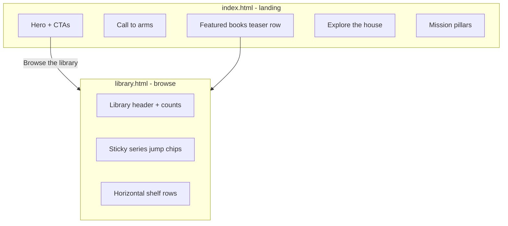

# Library browse redesign — session handover

**Written:** 2026-06-24  
**Status:** Planned, not implemented  
**Live page:** https://arjunabadger.press/index.html#library  
**Plan file:** `.cursor/plans/library_browse_redesign_2796f4fd.plan.md` (Cursor plans)

---

## What the user asked for

The library section on the homepage has outgrown its initial layout. It needs to feel more like Amazon/Audible: ordered, easy to find books, without too much chrome. Content **above** the book listings (hero, call to arms) and **below** them (explore the house, mission pillars) should have their own space, separate from the browse experience.

---

## Decisions locked in this session

| Question | Decision |
|----------|----------|
| Page structure | **Split pages:** slim `index.html` landing; dedicated `library.html` for all shelves |
| Browse pattern | **Horizontal scroll rows per series + sticky series jump bar** (CSS scroll-snap, no search/filter UI). Chosen as the most professional, simple, and usable option when the user asked for a recommendation. |
| Book URLs | **Must not change.** User explicitly required that URLs for individual books already shared stay the same. |

---

## Hard constraints (do not violate)

1. **`book/{id}.html` and `read/{id}.html`** — no path, filename, slug, or canonical URL changes.
2. **EPUB/PDF download paths** — unchanged.
3. **`BOOK_REDIRECTS`** in `build.py` — keep as-is (e.g. `non-terrestrial-officers` → `null-horizon`).
4. **`render_book_page()`, `render_reader()`, `CURATED` book IDs** — do not refactor for this work.
5. **`press.html`** — keeps full vertical grid via `render_library_shelves(available_only=False)` including in-progress titles.

**Allowed to change:** nav links, "back to library" links on non-book pages, `index.html` structure, new `library.html`, CSS in `SITE_CSS`.

**Backward compatibility:** `index.html#library` should redirect to `library.html` (library bookmark, not a book URL).

---

## Current architecture (before implementation)

The public site is **static HTML generated at build time** by a single Python script. There is no SPA and no on-page library filter UI today.

| Role | Path |
|------|------|
| Build source (canonical) | `arjuna-badger-press/site/build.py` |
| Generated output | `arjuna-badger-press/site/public/` |
| Deployed copy | `arjuna-badger-platform/saas/web/public/` |
| CSS | Emitted from `SITE_CSS` inside `build.py` → `assets/site.css` |

### How the library works today

- `#library` is a hash anchor on `index.html`; it scrolls to a short intro block only.
- Book grids are **14 separate `<section class="series">` blocks** below the intro, each a full-width wrapping card grid (`.grid`: `repeat(auto-fill, minmax(250px, 1fr))`).
- **38 books** available to read now across those shelves (per live site copy).
- Data: `CURATED` (master book list), `SERIES` (ordered shelf names + accent colours), `SHELF_TAGLINE` (tagline under each shelf heading).
- Shelves rendered by `render_library_shelves()` (~line 3313). Each card by `card()` (~line 2924).
- Homepage assembled by `render_index()` (~line 3557): hero → call to arms → library intro → shelves → explore → mission → footer.

### Current `index.html` zones (all one long page)

**Above books**

- Global nav (drawer)
- Audiobook notice banner
- Hero (crest, tagline, CTAs including "Browse the library" → `#library`)
- Call to arms (`section.callarms`) → `join.html`

**Library block**

- `#library` intro (counts only)
- 14 series sections with full card grids

**Below books**

- Explore the house (`#explore`) — 5 cards to press, wiki, craft, workshop, safari
- Mission compact (`#mission`) — 3 pillars
- Index foot + site footer

### Related pages (unchanged scope unless noted)

- `start.html` — recommender quiz; has book JSON in `#startdata` and priority list for featured picks
- `press.html` — full catalogue + pipeline
- `book/*.html`, `read/*.html` — per-book landing and reader

### Nav links to update (in `build.py` only)

Today many links point at `index.html#library`:

- `nav_bar()` (~line 2496)
- `safari_nav_drawer_links()` (~line 2492)
- Inline "back to library" strings throughout book pages, wiki, start.html, etc.

All generated pages rebuild from `build.py`; do not hand-edit `public/*.html`.

---

## Approved implementation plan

### 1. New `library.html`

Add `render_library_page(entries)` and wire it in the build loop (~line 7130):

```python
(OUT / "library.html").write_text(render_library_page(entries), encoding="utf-8")
```

**Page contents:**

- Compact header: "The library", dynamic counts, links to `start.html` and `press.html`
- Sticky shelf jump bar (chips per `SERIES` entry) → `#shelf-{slug}` anchors
- Horizontal shelf rows via new `render_library_shelves_rows()` and `card_row()`:
  - Cover + title + badge only (no blurb in row)
  - `.shelf-row`: `overflow-x: auto`, `scroll-snap-type: x mandatory`, ~160px card width
  - Series slug helper, e.g. `history-before-time` from "History Before Time"
- Minimal footer: "Back to home" only

### 2. Slim `index.html`

Refactor `render_index()`:

- **Keep:** hero, call to arms, explore, mission, index-foot
- **Remove:** `render_library_shelves()` output
- **Add:** compact featured teaser (3–4 titles from `start.html` priority or serials/new releases) + CTA → `library.html`
- Primary hero CTA: `library.html` instead of `#library`
- Hash redirect for old bookmarks:

```html
<script>if(location.hash==="#library")location.replace("library.html")</script>
```

Optional visual separation: `.landing-zone` / `.house-zone` background bands on index.

### 3. CSS additions in `SITE_CSS`

- `.library-page` — browse shell background
- `.shelf-nav` — sticky chip bar
- `.shelf-row`, `.card-row` — horizontal carousel cards
- Preserve existing `.card` for `press.html` and book pages

### 4. Link updates

- `index.html#library` → `library.html` (with correct `rel` prefix on nested pages)
- Do **not** change `book/{id}.html` or `read/{id}.html` hrefs on cards, sitemap, or JSON-LD

Existing `redirect_page()` helper (~line 2539) can support belt-and-braces redirects if needed.

---

## Implementation checklist

All items **pending** as of handover:

- [ ] Add `render_library_page()`, `card_row()`, `render_library_shelves_rows()`, series slug helper in `build.py`
- [ ] Add shelf-nav, shelf-row, card-row, zone background CSS to `SITE_CSS`
- [ ] Refactor `render_index()` to landing-only with featured teaser + `#library` hash redirect
- [ ] Update `nav_bar`, `safari_nav`, and back-to-library strings to `library.html` (not book URLs)
- [ ] Wire `library.html` into build loop; rebuild and verify book URLs unchanged

---

## Test plan

1. Rebuild site (`python build.py` from `arjuna-badger-press/site/` or existing project build command).
2. Confirm `book/resonance.html` and `read/resonance.html` URLs and content unchanged.
3. Confirm `library.html` shows all 14 series with horizontal rows and working jump chips.
4. Confirm `index.html#library` redirects to `library.html`.
5. Confirm nav drawer "Library" lands on `library.html`.
6. Mobile: shelf rows scroll, jump bar scrolls, sticky bar does not obscure content.
7. Confirm `press.html` still shows full grid including coming-soon titles.

---

## Key code references

```python
# Series order and accents (~line 557)
SERIES = [
    ("Non-fiction", "#7BA88C"),
    ("The African Gold Trilogy", "#E5B567"),
    ("History Before Time", "#C8A86B"),
    # ... 14 shelves total on live index
]

# Homepage today (~line 3557)
def render_index(entries: list[dict]) -> str:
    # hero → callarms → library intro → render_library_shelves → explore → mission

# Shelf grid today (~line 3313)
def render_library_shelves(entries, *, available_only=False) -> str:
    # Used by index (available only) and press.html (all titles)

# Card component (~line 2924)
def card(e: dict, accent: str) -> str:
    href = f"book/{e['id']}.html"  # DO NOT CHANGE THIS PATTERN
```

---

## Context for the next agent

- **Repo:** `arjuna-badger` (site build in `arjuna-badger-press/site/build.py`; deploy artefact in `arjuna-badger-platform/saas/web/public/`).
- **User tone:** wants Audible/Amazon clarity without over-engineering (no search, no filter taxonomy, no JS-heavy SPA).
- **"Without too much"** means lean UI: jump bar + horizontal rows, not a full browse product.
- **Platform `library.json`** (`arjuna-badger-platform/arjuna-badger-press/library.json`) is the studio/manuscript manifest; the **public site catalogue** is driven by `CURATED` in `build.py`. Do not conflate the two unless explicitly asked.
- After editing `build.py`, run the site build and sync/deploy per existing project workflow.
- Only commit if the user asks.

---

## Mermaid: target information architecture


