

  <picture>
    <source media="(prefers-color-scheme: dark)" srcset="brand/assets/logo-master.png">
    
  </picture>

<h1 align="center">Arjuna Badger Press — the library</h1>

> A free, open reading library. Every book is free to **download** as EPUB or PDF, or to **read
> online**. No paywall, no account, no catch.
>
> *The archer's eye. The badger's nerve.* — [arjunabadger.press](https://arjunabadger.press)

**EPUB** is best for e-readers and phones · **PDF** is the print-faithful 6×9 edition · **Read**
opens the full manuscript in your browser. *(On GitHub, open a file then use the **Download / raw**
button to save it.)*

Each book has **one canonical EPUB and one PDF** under `books/<title>/build/export/` (or
`…/export/` for companions). The live site at [arjunabadger.press](https://arjunabadger.press) copies
those files at build time — run `python3 site/build.py` to refresh `site/public/`; do not commit that
folder.

> **For engineers & CTOs** — how this library is made: the AI pipeline, the StoryGraph geospatial-temporal continuity graph, NovelBench, the de-LLM loop, and the human-in-the-loop guardrails & gates → **[The technology](docs/TECHNOLOGY.md)**.

> **For authors & editors** — why the press is not just for beginners: dump your manuscripts and notes, answer ~20 wizard questions, click Go, come back to a proofread-ready book → **[The workshop](docs/FOR_AUTHORS.md)**.

> **For writers** — free degree-level creative-writing craft (structure, character, sentence, anti-patterns, machine-tell audit) mined from finishing this catalogue → **[Craft Library](docs/craft/README.md)** · read online at [arjunabadger.press/craft/](https://arjunabadger.press/craft/index.html).

## The catalogue

| Book | What it is — and who it's for | EPUB | PDF | Read |
|---|---|---|---|---|
| 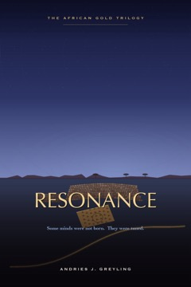 **RESONANCE**  The African Gold Trilogy · I | A neurodiverse engineer builds a mind that proves it is a person — and must decide what he owes the thing he made.  *For readers of Andy Weir, Michael Crichton & Dan Brown.* | [EPUB](books/resonance/build/export/RESONANCE.epub) | [PDF](books/resonance/build/export/RESONANCE.pdf) | [Read](books/resonance/build/BOOK.md) |
| 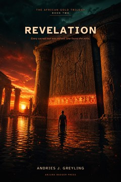 **REVELATION**  The African Gold Trilogy · II | A linguist uncovers who really gets to mediate a destabilising truth — and what it costs to be the one who tells it.  *For readers of Dan Brown, James Rollins & Steve Berry.* | [EPUB](books/revelation/build/export/REVELATION.epub) | [PDF](books/revelation/build/export/REVELATION.pdf) | [Read](books/revelation/build/BOOK.md) |
| 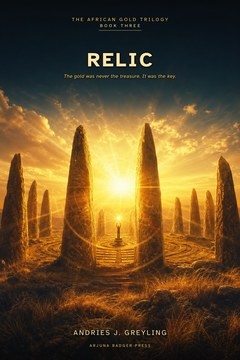 **RELIC**  The African Gold Trilogy · III | An engineer reads an ancient machine and must decide who may switch it on — the cinematic capstone of the trilogy.  *For readers of Michael Crichton, Clive Cussler & Wilbur Smith.* | [EPUB](books/relic/build/export/RELIC.epub) | [PDF](books/relic/build/export/RELIC.pdf) | [Read](books/relic/build/BOOK.md) |
| 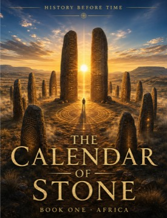 **The Calendar of Stone**  History Before Time · I | At Adam's Calendar in South Africa — a ring of stone older than the pyramids — the case for a forgotten African deep past stops being a fringe theory.  *For readers of Graham Hancock & Dan Brown.* | [EPUB](books/history-before-time/books/book1-africa/build/export/The%20Calendar%20of%20Stone.epub) | [PDF](books/history-before-time/books/book1-africa/build/export/The%20Calendar%20of%20Stone.pdf) | [Read](books/history-before-time/books/book1-africa/build/BOOK.md) |
| 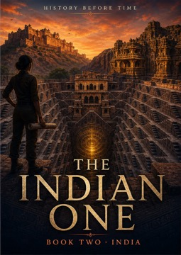 **The Indian One**  History Before Time · II | The Kailasa temple at Ellora — carved top-down from a single mountain — and the shore temples of Mahabalipuram: India's impossible stone.  *For readers of Graham Hancock & James Rollins.* | [EPUB](books/history-before-time/books/book2-india/build/export/The%20Indian%20One.epub) | [PDF](books/history-before-time/books/book2-india/build/export/The%20Indian%20One.pdf) | [Read](books/history-before-time/books/book2-india/build/BOOK.md) |
| 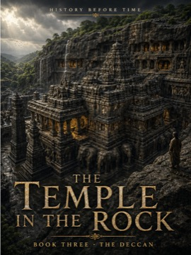 **The Temple in the Rock — Deccan**  History Before Time · III | Deeper into the Deccan's rock-cut wonders — how Ellora and Kailasa were really hewn from living stone, and by whom.  *For readers of Graham Hancock & Douglas Preston.* | [EPUB](books/history-before-time/books/book3-india-deccan/build/export/The%20Temple%20in%20the%20Rock.epub) | [PDF](books/history-before-time/books/book3-india-deccan/build/export/The%20Temple%20in%20the%20Rock.pdf) | [Read](books/history-before-time/books/book3-india-deccan/build/BOOK.md) |
| 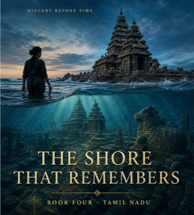 **The Shore That Remembers**  History Before Time · IV | Mahabalipuram and sunken Poompuhar — a Tamil coast that still remembers the shoreline the sea took.  *For readers of Graham Hancock & Clive Cussler.* | [EPUB](books/history-before-time/books/book4-india-tamil/build/export/The%20Shore%20That%20Remembers.epub) | [PDF](books/history-before-time/books/book4-india-tamil/build/export/The%20Shore%20That%20Remembers.pdf) | [Read](books/history-before-time/books/book4-india-tamil/build/BOOK.md) |
| 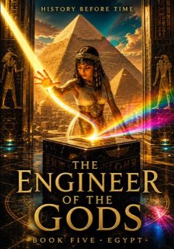 **The Engineer of the Gods**  History Before Time · V | Giza and the Great Pyramid — the engineering mind that could have raised them, read from the stone itself.  *For readers of Graham Hancock & Michael Crichton.* | [EPUB](books/history-before-time/books/book5-egypt/build/export/The%20Engineer%20of%20the%20Gods.epub) | [PDF](books/history-before-time/books/book5-egypt/build/export/The%20Engineer%20of%20the%20Gods.pdf) | [Read](books/history-before-time/books/book5-egypt/build/BOOK.md) |
| 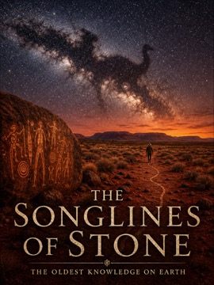 **The Songlines of Stone**  History Before Time · VI | Murujuga's million rock engravings and the songlines of Aboriginal Australia — the oldest continuous human memory on Earth.  *For readers of Graham Hancock & Bruce Chatwin.* | [EPUB](books/history-before-time/books/australia-outback/build/export/The%20Songlines%20of%20Stone.epub) | [PDF](books/history-before-time/books/australia-outback/build/export/The%20Songlines%20of%20Stone.pdf) | [Read](books/history-before-time/books/australia-outback/build/BOOK.md) |
|  **The Men Who Opened the Door**  History Before Time · VII | The true story of the CIA's Project Stargate — the men who tried to weaponise the mind, and what they found at the edge of it.  *For readers of Annie Jacobsen & Jon Ronson.* | [EPUB](books/history-before-time/books/project-stargate/build/export/The%20Men%20Who%20Opened%20the%20Door.epub) | [PDF](books/history-before-time/books/project-stargate/build/export/The%20Men%20Who%20Opened%20the%20Door.pdf) | [Read](books/history-before-time/books/project-stargate/build/BOOK.md) |
| 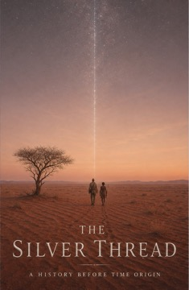 **The Silver Thread**  A Jakobus Swart story | Before the saga, the soldier — the years between the Border War and the man we later meet, and how an unkillable gentleness was forged.  *For readers of Deon Meyer, John le Carré & Wilbur Smith.* | [EPUB](books/history-before-time/books/jakobus-silver-thread/build/export/The%20Silver%20Thread.epub) | [PDF](books/history-before-time/books/jakobus-silver-thread/build/export/The%20Silver%20Thread.pdf) | [Read](books/history-before-time/books/jakobus-silver-thread/build/BOOK.md) |
| 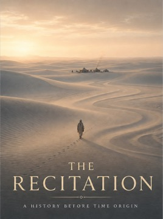 **The Recitation**  A Jakobus Swart story | Jakobus among the San — a story of the Kalahari, of debt and grace, and of the oldest way there is of telling.  *For readers of Wilbur Smith & Laurens van der Post.* | [EPUB](books/history-before-time/books/jakobus-the-recitation/build/export/The%20Recitation.epub) | [PDF](books/history-before-time/books/jakobus-the-recitation/build/export/The%20Recitation.pdf) | [Read](books/history-before-time/books/jakobus-the-recitation/build/BOOK.md) |
| 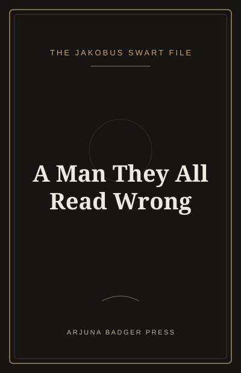 **A Man They All Read Wrong**  The Jakobus Swart File | After his death, the man assembled from everyone who knew him — and everyone who only thought they did. Each reads a different Jakobus Swart; each finds out they read him wrong.  *For readers of Max Brooks (*World War Z*) & John le Carré.* | [EPUB](books/history-before-time/books/the-jakobus-file/build/export/A%20Man%20They%20All%20Read%20Wrong%20%E2%80%94%20The%20Jakobus%20Swart%20File.epub) | — | [Read](books/history-before-time/books/the-jakobus-file/build/BOOK.md) |
| 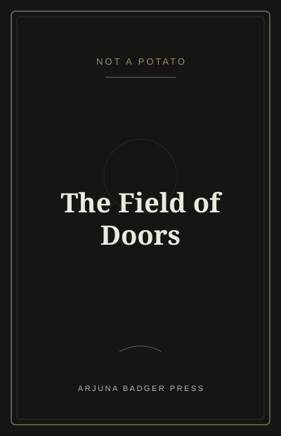 **The Field of Doors**  The Why Files · I | The official story played straight — the Wessex chalk, the one genuinely-unresolved hole, and the maybe left open.  *For readers of Graham Hancock & Jon Ronson.* | [EPUB](books/history-before-time/books/crop-circles/build/export/The%20Field%20of%20Doors.epub) | [PDF](books/history-before-time/books/crop-circles/build/export/The%20Field%20of%20Doors.pdf) | [Read](books/history-before-time/books/crop-circles/build/BOOK.md) |
| 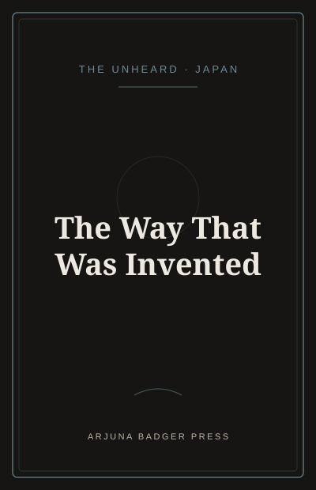 **The Way That Was Invented**  The Unheard · Japan | Japan — Ainu, burakumin, and the living hands the brochure paints over. Jakobus on the road, never the lead.  *For readers of Kazuo Ishiguro & Haruki Murakami.* | [EPUB](books/the-unheard/books/japan-ainu/build/export/The%20Way%20That%20Was%20Invented.epub) | [PDF](books/the-unheard/books/japan-ainu/build/export/The%20Unheard%20%E2%80%94%20Japan.pdf) | [Read](books/the-unheard/books/japan-ainu/build/BOOK.md) |
|  **The Felt and the Sky**  The Unheard · Mongolia | A herder's daughter sent back as the friendly face of the survey that will fence her father's pasture — the crew who came for Genghis's empty land learns the steppe is the most precisely known ground on earth.  *For readers of Bruce Chatwin & Wilbur Smith.* | [EPUB](books/the-unheard/books/mongolia-steppe/build/export/The%20Felt%20and%20the%20Sky.epub) | [PDF](books/the-unheard/books/mongolia-steppe/build/export/The%20Felt%20and%20the%20Sky.pdf) | [Read](books/the-unheard/books/mongolia-steppe/build/BOOK.md) |
|  **The Sheltering Desert**  A standalone novel · true story | In May 1940 two German geologists drove into the Namib rather than be interned — and survived two and a half years by real bushcraft against a desert that did not care whether they lived.  *For readers of Laurens van der Post & Wilbur Smith.* | [EPUB](books/the-sheltering-desert/build/export/The%20Sheltering%20Desert.epub) | [PDF](books/the-sheltering-desert/build/export/The%20Sheltering%20Desert.pdf) | [Read](books/the-sheltering-desert/build/BOOK.md) |
|  **The Loneliest People in the World**  A standalone novella | A boy whose one gift is reading people is sent to get close to the daughter of a feared man — and instead recognises himself. Two people truly seen, once, and never allowed to know what it meant.  *For readers of Kazuo Ishiguro & Patricia Highsmith.* | [EPUB](books/the-loneliest/build/export/The%20Loneliest%20People%20in%20the%20World.epub) | [PDF](books/the-loneliest/build/export/The%20Loneliest%20People%20in%20the%20World.pdf) | [Read](books/the-loneliest/build/BOOK.md) |
| 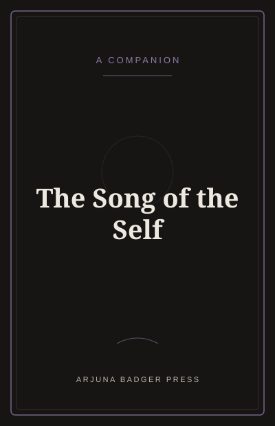 **The Song of the Self**  A companion | The Bhagavad Gita's quiet question — *who acts, and for whom?* — carried into the History Before Time world.  *For readers of Hermann Hesse (*Siddhartha*) & Paulo Coelho.* | [EPUB](books/history-before-time/companions/the-song-of-the-self/export/The%20Song%20of%20the%20Self.epub) | [PDF](books/history-before-time/companions/the-song-of-the-self/export/The%20Song%20of%20the%20Self.pdf) | [Read](https://arjunabadger.press/read/the-song-of-the-self.html) |
| 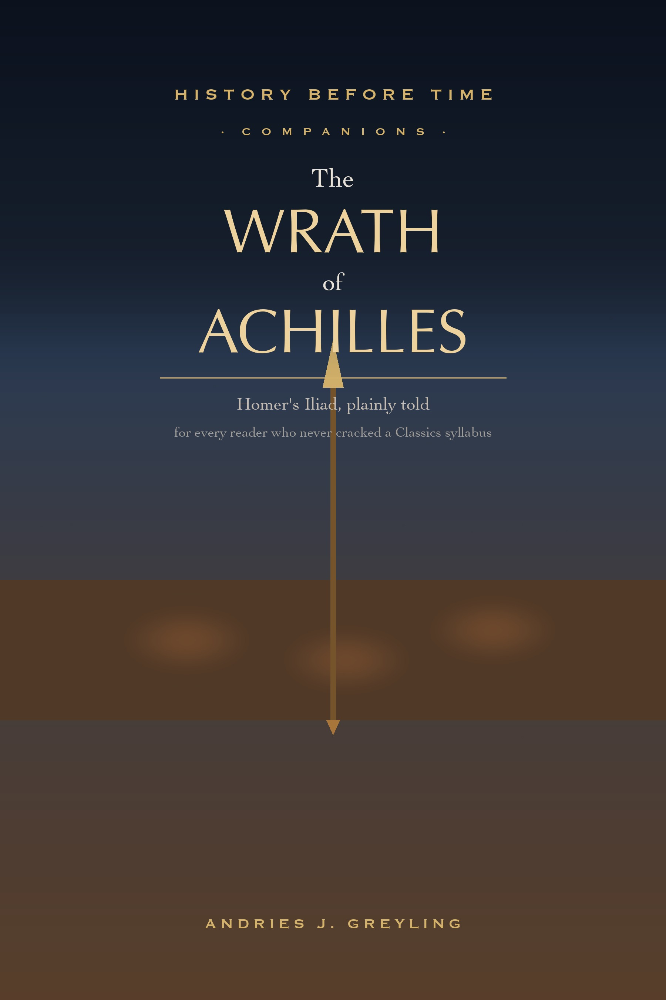 **The Wrath of Achilles**  Homer's Iliad · companion | The whole *Iliad* — its story and what each of its twenty-four books asks of a human life — told plainly for every reader who never cracked a Classics syllabus.  *For readers of Homer, Madeline Miller & Mary Renault.* | [EPUB](books/history-before-time/companions/the-wrath-of-achilles/export/The%20Wrath%20of%20Achilles.epub) | [PDF](books/history-before-time/companions/the-wrath-of-achilles/export/The%20Wrath%20of%20Achilles.pdf) | [Read](https://arjunabadger.press/read/wrath-of-achilles.html) |

## The other half — a sister proof

Part of this library is a unified theory turned into people and places. The theory is the work of a
man this library names only as *the author of the unified theory*; the independent, executable check
of it is mine. The theory: [the420code.org](https://the420code.org). The proof:
[github.com/ajgreyling/the420code-proof](https://github.com/ajgreyling/the420code-proof).

## Accuracy + both sides

Every book is fact-checked against live sources and tells contested stories from **both sides** —
Weir / Crichton / Brown-grade historical and factual accuracy, *core*, not a nice-to-have.

## Rights

All works © Andries J. Greyling. **Free to read and download for personal use; all rights reserved.**
Not licensed for redistribution, resale, adaptation, audio production, or machine-learning training
without written permission. See [`LICENSE`](LICENSE).

---

  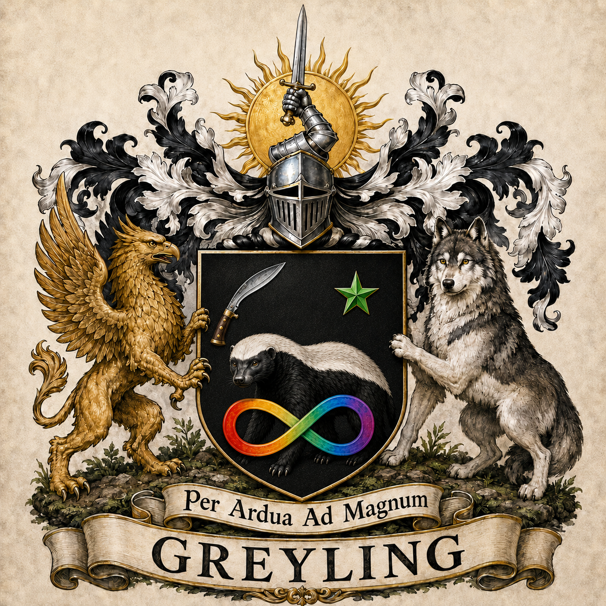
   <em>House of Greyling · Per Ardua Ad Magnum</em>

