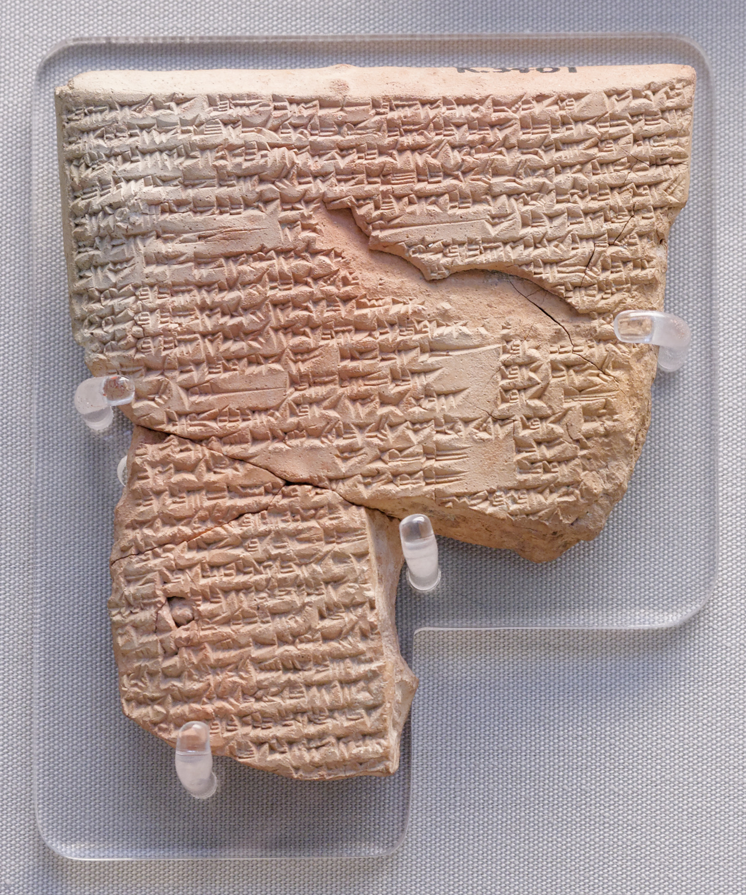

# Proem — A Guest at the Fire

I came to this book the way most people come to Gilgamesh: sideways, and late, and through someone else's summary.

Someone told me it was "the oldest story" — a king, a wild man, a flood before Noah, a search for immortality that fails. Some of that is in the poem, or near it, or grew up around it like barnacles on a hull. But the *Epic of Gilgamesh* itself is not a museum placard. It is a poem about a tyrant who learns he will die, a friend who makes him human, and a journey that ends not with eternal life but with **walls** — the work of human hands, still standing when the plant of youth is gone.

That is the poem. Not a conspiracy. Not a Bible-plagiarism graphic. A story about **friendship and mortality** — what it costs to love someone who can be taken from you, and what remains when you cannot keep yourself forever.

Then another reader — the best kind, the kind who loves a thing enough to be honest about it — told me something I had half-known and wholly avoided. *I know the names,* she said. *Gilgamesh, the flood, the serpent. I couldn't tell you what actually happens in the poem.* She was right. Of course she was right. You can know a story's shadow on the culture — a tablet in a museum, a line in a sermon, a comparison on the internet — and still not know **what the scribes actually wrote.** This book is the answer to that.

---

Let me be plain about what I am.

I am not an Assyriologist. I am not a priest of Nabu, a cuneiformist with forty years on the Nineveh tablets, or an archaeologist who can tell you which level of Uruk the poem's walls belong to. I hold no authority over this text whatsoever. There are men and women who have given their lives to Gilgamesh — who can read the Akkadian line by line, who can hear the Sumerian poems beneath the Standard Version, who know which restorations are secure and which are hope. They are the householders here. This is their fire.

I am a guest at it.

A guest at a fire has exactly one set of obligations, which I mean to keep on every page that follows. He warms his hands and is grateful. He does not rearrange the wood. He does not tell the family what their fire *really* means — he listens while they tell him. He carries nothing away that wasn't offered. And when he goes home and tells his own people about the warmth of it, he tells them the truth: *this was not my fire, but they let me sit, and here is what I saw by the light of it.*

That is the most I will claim. Not the truth of Gilgamesh — that belongs to the tradition that baked it into clay and dug it out of a burned library. Only an honest visitor's account of a poem that has been burning since before Homer, told warmly, told carefully, and told plainly enough that you can carry a little of the warmth home yourself.

---

A few promises, so you know the rules I have set for myself.

**I will keep three voices separate, and I will always tell you which one is speaking.** When I tell you what the epic says and what its tradition holds it to mean, that is the text, and I will be faithful to it. When I tell you what scholars argue about — when the Standard Version was compiled, how much is Old Babylonian, whether Tablet XII belongs — I will mark it as scholarship, a thing reasonable people dispute. And when I reach for a plain modern phrase to make an ancient one land, that is *me* — my gloss, my reach — and I will mark it as mine so you never mistake my paraphrase for the poem. When you read **`plainly:`**, that is my voice, owning the reach.

**I will use a real translation, and name it.** The passages I quote come from R. Campbell Thompson's *The Epic of Gilgamish* (1928) — a foundational English rendering of the twelve-tablet Standard Babylonian poem, long out of print, freely readable at [Sacred Texts](https://sacred-texts.com/ane/eog/index.htm). Thompson was, like me, a visitor who loved it; his English is scholarly and sometimes thick. I keep him because quoting a real, named rendering is honest in a way that smoothing everything into my own words would not be. Where his diction is too thick to learn from, I'll set a plain line beside it and mark it mine. For the living scholarly standard, *Going* points you to Andrew George.

**I will not flatten this into something it isn't.** I am not going to tell you Gilgamesh is "really" just the Bible's source code, or "really" an alien myth, or "really" a self-help book about grief with the gods taken out. The poem has gods who argue, a flood that nearly starves heaven, a plant stolen by a serpent, and a king who comes home empty-handed. I will not sand those edges off to make it comfortable. I will make it *legible* — that is my job — not tame.

**I will tell you the whole poem.** Twelve tablets. The tyrant, the friend, the Cedar Forest, Ishtar's offer, Enkidu's death, the road to Utnapishtim, the flood, the plant, the walls. Not a summary that skips to the famous bits — the whole arc, because the arc is the point. A man who will not die. A friend who does. A journey that fails. A city that remains.

The fire is lit. They have let us sit.

Here is what I saw by the light of it.

*PLATE P-14 · Cuneiform tablet from the Library of Ashurbanipal, Nineveh (K.3401, the birth legend of Sargon). British Museum. Photo: Jastrow, CC BY 2.5, via Wikimedia Commons. The burned library that kept the poem — clay hardens in fire; the catastrophe was the preservative.*
