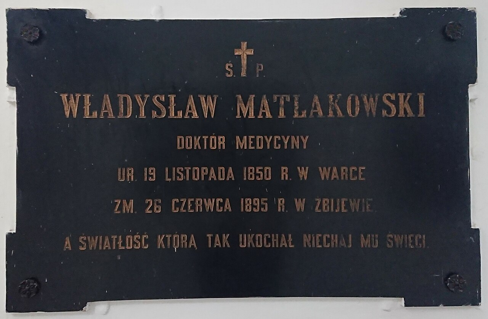

# The Walls — why the poem begins with a city

Before the friend, the walls. And before the walls, a king who would not be limited — two-thirds god, one-third human, and already too much for the people under him.

You need only a little of the backstory. The *Epic of Gilgamesh*, in the Standard Babylonian version dug from the Library of Ashurbanipal at Nineveh, runs to **twelve tablets**. Behind it stand older Sumerian poems about the same king — Gilgamesh of Uruk, builder, fighter, walker of the edges of the world. You do not need the whole school-room of variants. You need the square of ground the Standard poem stands on.

**Uruk** — one of the first great cities of the southern Mesopotamian plain, walls of baked brick, temples rising, the goddess **Ishtar** (Inanna) with a house inside those walls. **Gilgamesh** is its king: son of the goddess **Ninsun** and a mortal father, stronger and more restless than any man who faces him. The poem opens by praising what he built — the walls, the foundations, the copper tablet of his story — and then shows you why the gods intervene. He takes the sons for labour and the daughters for his bed. The people cry out. Heaven answers with a counterweight.

That counterweight is **Enkidu** — made of clay by the mother-goddess **Aruru**, a wild man of the steppe, hair like a woman, living with the animals, wrecking the hunters' traps. Civilisation will tame him. Friendship will bind him to Gilgamesh. Death will take him. And Gilgamesh, who thought himself almost a god, will learn what one-third human costs.

---

Here is what you need to know about the two men the story turns on.

**Gilgamesh** is the greatest king alive — builder of Uruk's walls, walker who will later cross the Waters of Death. He begins as a tyrant the people cannot bear. The poem will not leave him there. It will give him a friend equal to himself, then take that friend away, and send him hunting a life that cannot be kept.

**Enkidu** is the answer heaven sends — wild, then tamed by a woman from the temple (**Shamhat**), then brought to Uruk where he and Gilgamesh wrestle like equals and become brothers. He is not a sidekick. He is the other half of the king's strength, and when he dies the poem's centre of gravity shifts from adventure to grief.

Between them, in the early tablets, stands the **Cedar Forest** and its guardian **Humbaba**, and the goddess **Ishtar**, who will offer Gilgamesh what kings dream of and take a terrible revenge when he refuses. After Enkidu's death the poem becomes a road: tavern-keeper **Siduri**, boatman **Urshanabi**, flood-survivor **Utnapishtim**, a plant of youth stolen by a serpent, and at the end — again — **the walls of Uruk**.

---

The poem's opening, in the tradition, names the one **who saw the Deep** — who knew the ways, who brought back a story from before the Flood, who carved it on a tablet of lapis. Not "sing, goddess, of wrath." **Look at the walls. Read the tablet. This man went to the edge of the world and came home with knowledge.** From line one: this is a poem about what a human life can hold when it cannot hold forever.

The gods are already involved. They always are, in Mesopotamian epic — not as metaphors but as characters with appetites and assemblies, deciding in council, sending dreams, flooding the world when humans grow too loud. You do not need to believe in them to read the poem. You need to understand that *for the scribes* they are as real as the brick.

---

**Plainly:** You are dropped at the city gate like a new arrival — dust, brick, already late. The whole deep past of Sumer is backstory. The Standard poem is about **what happens when a king who will not die meets a friend who does**, and what he brings back when immortality fails. It begins not with the Flood (that comes late, as a story inside the story) but with **walls and tyranny and a wild man made to match a tyrant.** That is deliberate. Everyone has stood at that gate — the place where power without limit becomes a problem the gods themselves have to solve.

---

*PLATE P-01 · Uruk (Warka) archaeological site, Iraq. Photo: Jan Jerszyński, CC BY 3.0, via Wikimedia Commons. The square of ground the poem stands on — the walls the last line of Tablet XI tells you to climb.*

---

> **A note on what's real here** *(scholarship — register b).* Whether Gilgamesh was a historical Early Dynastic king of Uruk, how the Sumerian poems relate to the Akkadian epic, when Sin-leqi-unninni shaped the Standard Version, whether Tablet XII (Enkidu in the underworld) belongs to the same design as Tablets I–XI — scholars genuinely dispute all of this, and the poem does not need it settled to do its work. The same scholars place the Standard Version in the late second or early first millennium BCE, drawing on traditions far older; the Flood Tablet (K.3375) sits in the British Museum. None of that diminishes it. A thing can be assembled across centuries and still be the oldest long story we can still finish in one sitting. I note the scholarship because the honesty is the foundation — not because it changes what happens next on the walls.
