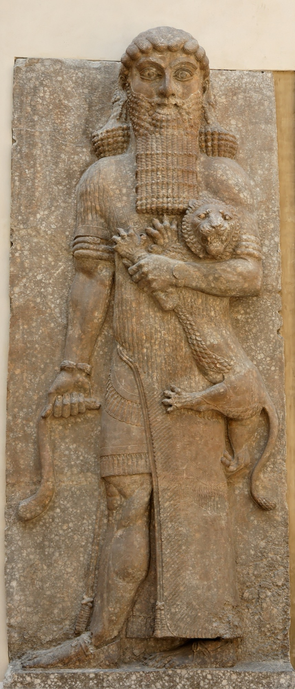

# Tablet One — The Tyrant and the Wild Man

### The scene

The poem does not begin with a flood or a serpent or a quest for eternal life. It begins with **walls** — and with the man who saw everything, who knew the countries and was wise in all matters, who brought back a tale from before the Deluge and cut all his toil into stone. Look at Uruk. Walk the rampart he built. Survey the foundations, clamped firm like bronze beneath holy **Eanna**, the temple of Anu and **Ishtar**. The city, the date-groves, the clay-pits, the temple ground — the poem measures them off like a proud surveyor before it tells you a single deed. Open the tablet-box. Read the travails of **Gilgamesh**.

He is **two-thirds god and one-third human** — son of the goddess **Ninsun**, towering over the heroes of Uruk like a wild bull, with no equal when his weapons are raised. And he is a tyrant the people cannot bear. His arrogance swells by day and by night. He leaves no son to his father. He leaves no maid to her mother, no daughter to the hero, no bride to her husband. The wailing rises until it reaches heaven, and the gods say to **Anu**, lord of Uruk: you begot this wild bull. Where is his match?

Anu hears. He calls **Aruru**, the mother-goddess who shaped mankind: you made him — now make his equal, one mighty enough to strive with him, so that Uruk may have peace. Aruru washes her hands, pinches off clay, and throws it down on the steppe. On the steppe she creates **Enkidu** — a warrior born and begotten of silence and the wild, his whole body shaggy with hair, his locks long like a woman's, knowing neither people nor country. Clad like the god of the herds, he grazes with the gazelles at the water-hole, and his heart delights among the beasts.

A **hunter** meets him there — one day, two days, three, face to face at the drinking-place — and comes home rigid with fear. The wild man has filled in his pits and torn up his snares; the beasts slip through his hands; he cannot work his trade. His father sends him to Uruk, and Gilgamesh gives the remedy the poem's world keeps ready for wildness: take **Shamhat**, a woman of the temple of Ishtar. When the herd comes down to drink, let her bare her beauty. He will come to her — and his beasts, reared with him in the desert, will deny him.

So it happens. Hunter and woman wait at the water-hole. Enkidu comes down with the gazelles, and Shamhat shows him what a woman is. For **six days and seven nights** Enkidu stays with her — and when he is sated and turns back to his herd, the gazelles scatter at the sight of him. The beasts of the field flee from him. His knees fail; his old swiftness is gone. He has lost something the poem does not pretend he can recover — and gained something it prizes more: **reason, and a widened heart**. He goes back and sits at the woman's feet, watching her face, understanding her words. You are beautiful as a god, she tells him. Why range the desert with beasts? Come to Uruk, to the sacred temple, where Gilgamesh lords it over men like a wild bull. He hears her, and knows his own longing for the first time: *he needs a friend.* And rage rises with the longing — he will go to that city and challenge its king, and cry through the streets, *I too am mighty.*

But Gilgamesh has already seen him — in dreams. He goes to Ninsun: mother, in the night the stars of heaven came out, and something like the very self of Anu fell down on my shoulders. I heaved at him and could not move him. The people of Uruk thronged round him; my companions kissed his feet; and I held him to my breast **like a woman**, and laid him at your feet. And a second dream: an axe, flung down in the street, with the crowd pressing round it — and I loved it, and held it to me like a woman. Ninsun, who knows all wisdom, gives both dreams one meaning: **this is a stout heart, a friend, one ready to stand by a comrade — strength like the self of Anu — and he will never abandon you.**

Far off on the steppe, Shamhat is telling Enkidu the same dreams. The wild man and the temple-woman set out for the city — toward a king who has already held him, asleep, like something beloved.

*PLATE P-02 · Hero mastering a lion, relief from Khorsabad. Musée du Louvre (AO 19862). Photo: Jastrow, public domain, via Wikimedia Commons. The palace "wild strongman" type — not a portrait of Enkidu, but his kin in stone.*

---

### Plainly

**A city that cannot bear its king gets a second creation — not a rival empire, but a wild equal who can match the tyrant blow for blow.**

---

### The line

Thompson's opening praise of the king, and the gods' answer to the city's cry:

> *Gilgamish — he was the Master of wisdom, with knowledge of all things … handed down the tradition relating to things prediluvian, went on a journey afar, all aweary and worn with his toiling, graved on a table of stone all the travail. Of Erech, the high-wall'd, he it was built up the ramparts; and he it was clamp'd the foundation, like unto brass … "'Twas thou, O Aruru, madest mankind: do now make its fellow, so that he happen on Gilgamish … so that they strive with each other, and he unto Erech give surcease."*
>
> — R. Campbell Thompson, *The Epic of Gilgamish* (1928), Tablet One

**`plainly:`** *This is the man who saw everything and built the walls — and this is heaven's answer to his tyranny: make him an equal, and let them wear each other out, so the city can breathe.*
