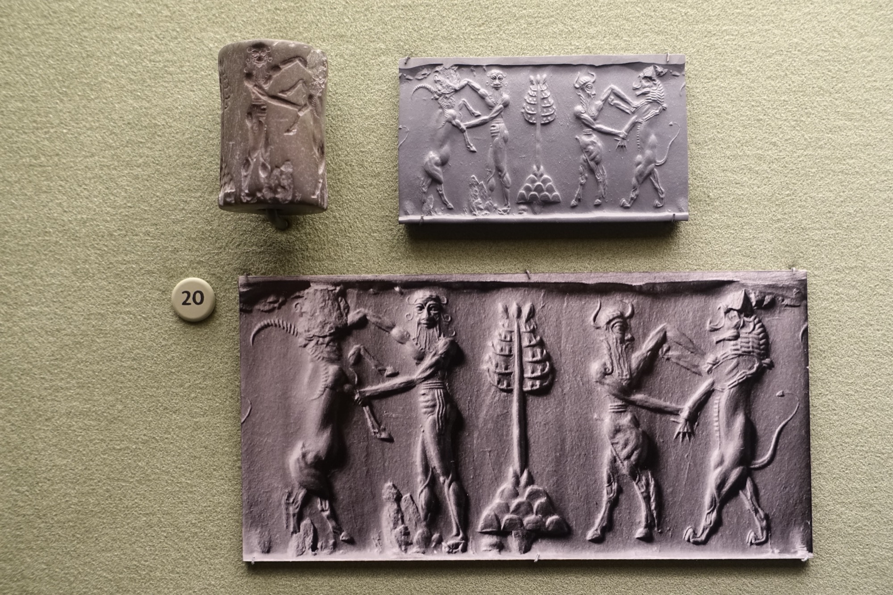

# Tablet Two — The Meeting

### The scene

**Shamhat** leads **Enkidu** from the steppe into the world of men, one lesson at a time. At a shepherds' camp he learns what the wild never taught him. Bread is set before him and he stares at it — he was suckled on the milk of wild things, and does not know how to eat. *Taste the bread*, the woman tells him, *for it is the staff of life; drink the beer, for it is the custom of the land.* He eats until he is gorged. He drinks seven cups of beer, and his spirit rises, and his face glows, and his heart is glad. He washes the matted hair of his body, rubs himself with oil — and, the poem says with perfect economy, **becomes human**. He puts on a garment like a man, takes a weapon, and hunts the lions that harry the flocks by night, so that the shepherds sleep soundly. The wild thing that once freed beasts from traps is now the watchman who kills for the fold.

A stranger passes through, summoned toward the city. Enkidu has him brought near and asks his errand — and the fellow explains, as if reciting the most ordinary law in the world: in Uruk the king takes his pleasure first. **Gilgamesh** will couple with the woman allotted by fate before the bridegroom does. At the words, Enkidu's face goes pale with fury. He sets out for Uruk with Shamhat behind him.

The city gathers to stare. *Like Gilgamesh he is*, the people say, thronging the street, *a trifle shorter in stature, but stronger of build — a baby once suckled on the milk of the wild things! Now he is a match for the god-like king.* And that night the bed is strewn for the rites; Gilgamesh comes through the dark to the woman who is his by custom. **Enkidu is standing in the street, blocking the door.**

They seize each other. They grapple and snort like bulls; the threshold shatters; the very wall shudders. Two bodies built by gods, jammed into one doorway, testing at last the question Anu asked when the clay was pinched: *where is his match?* Then Gilgamesh bends his knee to the ground — and his fury leaves him. He breaks off the fight.

And Enkidu, the loser who has just proven no man can win, speaks first — words not of surrender but of recognition: *your mother bore you as one and one only — Ninsun, that choicest cow of the fold — she exalted your head above heroes, and Enlil decreed you the kingship over men.* They kiss each other and **form a friendship**. The first person who could stop Gilgamesh, and the first person Gilgamesh could not simply take.

Gilgamesh brings his friend before **Ninsun**. The wise queen looks at the shaggy stranger — no kith, no kin, no mother of his own in all the poem until this moment — and Enkidu hears her words and weeps, his arms slack, his strength ebbing, until Gilgamesh takes his hand. But friendship in this poem does not stay at rest. Already Gilgamesh is talking of **Humbaba** — the guardian Enlil set over the Forest of Cedar, whose roar is the whirlwind, whose jaws are flame, whose very breath is death. Let us kill him, he says, and cut down the cedar. Enkidu knows that forest; he roamed its edges with the herd, and would not go two hours' march into its depths. He says so. Gilgamesh answers with the creed that drives the whole first half of the epic: only the gods live forever; the days of man are numbered; whatever he does is wind — *so let me fall, if fall I must, with a name that lasts.* They go to the forge. The smiths cast monstrous axes of three talents each, and glaives with golden hilts, and the two friends stand before the elders of Uruk armed and glittering — while the city, listening to the plan, does not yet know what it will cost.

*PLATE P-04 · Akkadian cylinder seal, hero contest scene (c. 2334–2154 BCE). Morgan Library & Museum. Photo: Daderot, public domain, via Wikimedia Commons. The wrestling-match motif was carved on seals for a thousand years — not a labelled Gilgamesh scene, but the same grammar of grappling equals.*

---

### Plainly

**Friendship begins as a fight between equals — and the first thing friends do, in this poem, is plan a war neither of them can survive unchanged.**

---

### The line

> *They grappled and snorted like bulls, and the threshold shatter'd: the very wall quiver'd … Gilgamish bent his leg to the ground: so his fury abated, aye, and his ardour was quell'd. So soon as was quelled his ardour, Enkidu thus unto Gilgamish spake: "Of a truth, did thy mother bear thee as one, and one only: that choicest cow of the steer-folds, Nin-sun exalted thy head above heroes, and Enlil hath dower'd thee with the kingship o'er men."*
>
> — R. Campbell Thompson, *The Epic of Gilgamish* (1928), Tablet Two

**`plainly:`** *They fought in the doorway until the wall shook — and when the king's rage passed, the wild man told him what he was: born without equal, raised above heroes, made for kingship. Then they became brothers.*
