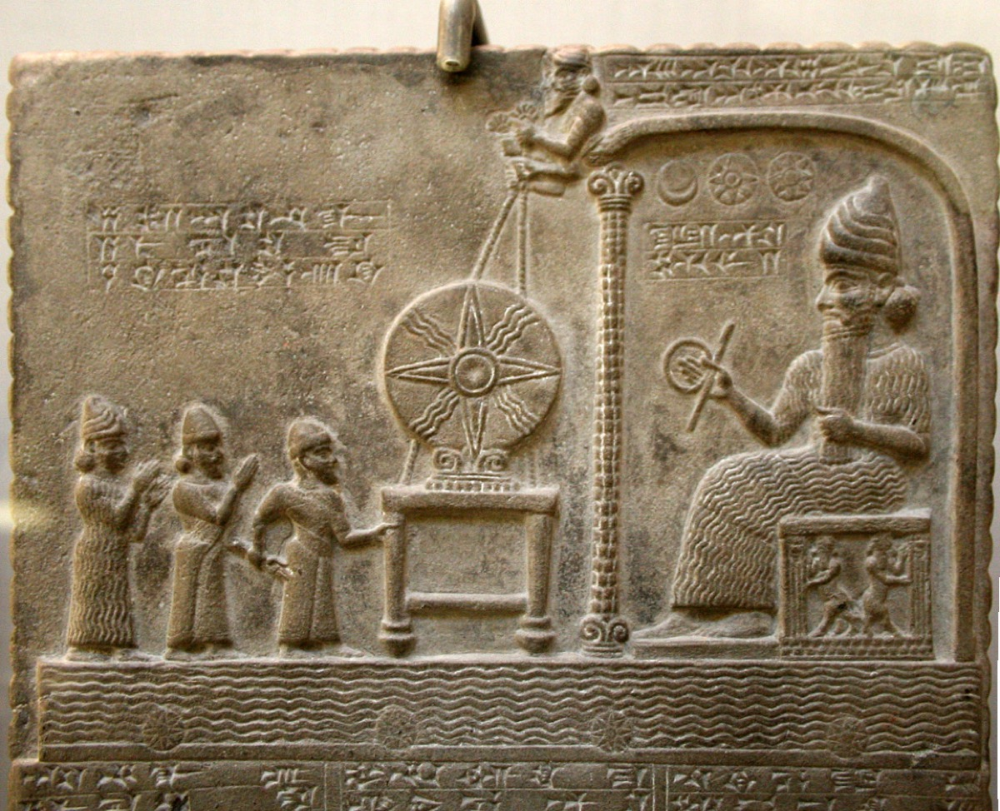

# Tablet Three — The Cedar Forest Proposed

### The scene

The **elders of Uruk** speak to Gilgamesh with the frankness of men who have seen kings ride out and not all ride back. Do not rely on your strength alone. Look long and hard; land a blow you can count on. To Uruk's quay come back in safety. They turn to **Enkidu**: you are tested in battle and tried in combat — guard your friend, keep safe your companion, bring the king home to his wives. In our assembly we place the King in your care.

Gilgamesh hears them and does what restless kings do when counsel fails: he takes Enkidu by the hand and goes to the Palace Sublime, into the presence of **Ninsun**. Mother, he says, bold as I am I shall tread the distant path to the home of Humbaba. I shall face a battle I know not. I shall ride a road I know not. Give me your blessing. Let me see your face again in safety, and return glad at heart through Uruk's gate.

Ninsun hears her son — and she does not refuse him. She climbs to the roof, raises a sacrificial bowl to **Shamash** the sun-god, and prays: why did you give my son a restless heart? On the day he faces Humbaba, let him see your omens. May Aya, Shamash's bride, cry his name in the night. May she not fail him, nor sleep, nor rest, until he has slain the guardian of the Forest of Cedar. Then she turns to Enkidu — the wild man with no mother in the poem until this moment — and **adopts him** as her son. She sets him at Gilgamesh's side: go before my son on the road; the one who goes in front saves his companion.

Enkidu has already told Gilgamesh what the elders repeat: Humbaba's reach is wide, his voice the Deluge, his breath death. He hears the forest murmur at sixty leagues' distance. Adad ranks first, and Humbaba second — Enlil made it his lot to terrify men and keep the cedars safe. If you penetrate his forest you are seized by the tremors. Enkidu knows. He was born there. He fears.

Gilgamesh does not fear — or rather, he fears boredom more than monsters. He arms the young men of Uruk who understand combat. He asks blessing as one who already intends to go. On his return he will celebrate New Year twice over; let the drums resound before Wild-Cow Ninsun. The elders warn Enkidu again in vain: tell him not to go to the Forest of Cedar. That is a journey which must not be made. That is a man who must not be looked on.

They go anyway. The poem gives us the pattern that will hold through every adventure to come: **the restless one proposes, the knowing one fears, heaven blesses what it cannot prevent, and the road opens before them.** Ninsun has done what a mother can — adopted the friend, enlisted the sun-god, spoken the prayer. The rest belongs to the forest, and to what two men carry between them when they leave the gate.

*PLATE P-16 · Tablet of Shamash, the sun-god enthroned (Sippar, c. 860–850 BCE). British Museum. Photo: Prioryman, CC BY-SA 4.0, via Wikimedia Commons. The god Ninsun climbs to the roof to enlist — keeper of omens, watcher of roads.*

---

### Plainly

**Glory is a plan made by the restless half of a friendship against the wiser half's fear — and the mother-goddess blesses what she cannot prevent.**

---

### The line

The elders' counsel as the king departs:

> *Gilgamish, put not thy faith in the strength of thine own person solely … Sooth, he who goeth as vaward is able to safeguard a comrade, he who doth know how to guide hath guarded his friend; so before thee do thou let Enkidu go, for 'tis he to the Forest of Cedars knoweth the road … Enkidu — he would watch over a friend, would safeguard a comrade, aye, such an one would deliver his person from out of the pitfalls.*
>
> — R. Campbell Thompson, *The Epic of Gilgamish* (1928), Tablet Three

**`plainly:`** *Do not trust your own strength alone. The one who walks in front saves his companion — so let Enkidu lead, because he knows the road and you only know the ambition.*
