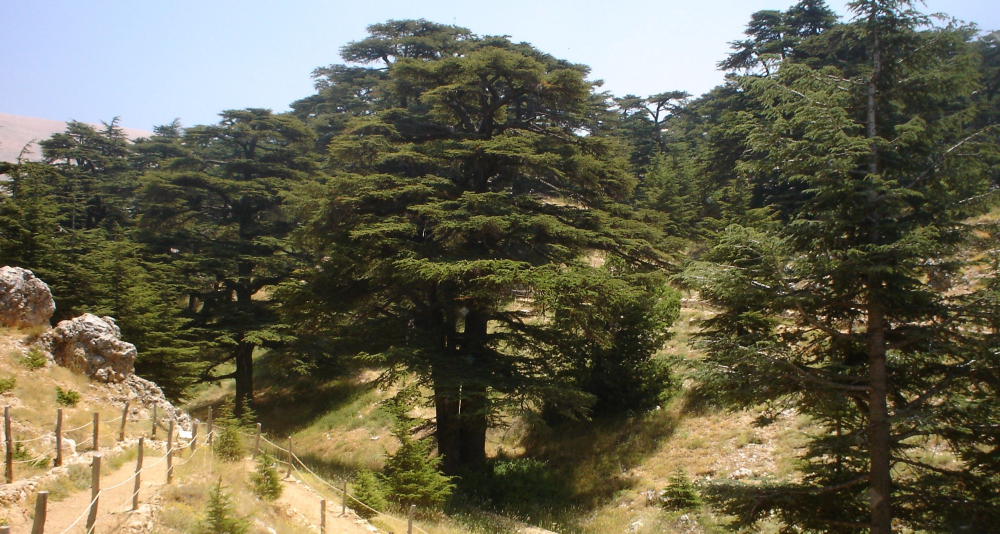

# Tablet Four — Dreams on the Road

### The scene

They leave Uruk. The journey to the Cedar Forest is a **measured stripping away** — league after league, camp after camp, the civilised world thinning behind them until only mountain, dust, and the road remain. The poem counts their pace like a boast: the distance of a month and a half walked in three days. Each evening they dig a well facing the setting sun. Each night Gilgamesh climbs the slope, pours out an offering of flour, and calls to the height: **Mountain, bring me a dream, a favourable message.** Enkidu builds a shelter against the wind. Gilgamesh sits with his chin on his knees, and sleep — the sleep that pours over all mankind — pours over him.

And the dreams come, each one worse than the last, and each time the pattern holds. Gilgamesh jolts awake at midnight: *Did you not call me? Why am I trembling? Did a god not pass by? Why is my flesh a-quiver?* — and tells the nightmare. In one, the two of them stand in a mountain gorge and the mountain topples on them, leaving them like flies in the wreckage. In another the firmament roars and the earth resounds; the day goes dark; lightning flashes and flame gorges the sky; death rains down; then the glare fades and the fires die and everything that fell has turned to ash. A man could not invent plainer omens of doom. **And Enkidu interprets every one as victory.** The mountain that fell, my friend — that is Humbaba. The mountain is not on us; the mountain is *him*. We shall seize him, we shall kill him, and throw his carcase down in abasement on the plain.

Whether the interpretations are true prophecy or only what a friend says to keep a friend walking, the poem does not tell. It only keeps them walking — and heaven itself sets the tempo. Shamash calls from the sky: hurry, before the guardian wraps himself in all seven of his terrors. He wears but one now. Even the gods are counting leagues.

Then the road ends. The cedars rise ahead, immense and incense-heavy, and the two heroes arrive at the **gate of the Forest** — timber without peer in any country, its very posts and pivot fashioned, Enkidu marvels, as if in the craftsman-city of Nippur. And here, at the threshold, the poem quietly reverses everything you thought you knew about these two. It is **Enkidu** — the wild one, the guide, the interpreter of victories — whose courage fails. His hands grow weak; his arms, he says, are stricken with palsy; let us not go down into the depths. And it is **Gilgamesh**, the dreamer who woke trembling every night of the march, who takes his turn at the other office of friendship: *Shall we, of all people, play the coward? You are tried in battle; touch your fear and it will pass. Forget death. I'll go in front of you myself.*

Courage, in this poem, is not a possession. It is traffic — passed back and forth between two people, each carrying it while the other cannot. They arrive together at the edge of the trees, and their speech stills into silence, and they stop, and stand, and look.

*PLATE P-03 · Lebanon cedar forest, Bsharri (the "Cedars of God"). Photo: Xtcrider, public domain, via Wikimedia Commons. What is left of the kind of forest Enlil set a guardian over.*

---

### Plainly

**Courage is not owned but carried in turns — the friend who says "go on" is as necessary as the god who sends the dream, and at the gate the offices reverse.**

---

### The line

Gilgamesh, when Enkidu's arms fail at the gate:

> *Shall we, O friend, play the coward? … Thou, O my friend, art cunning in warfare, art shrewd in the battle … O forget death, and be fearful of nothing … for he who is valiant, cautious and careful, by leading the way hath his own body guarded — he 'tis will safeguard a comrade.*
>
> — R. Campbell Thompson, *The Epic of Gilgamish* (1928), Tablet Four

**`plainly:`** *Now it is the wild man who is afraid, and the king who says: forget death, walk carefully, lead well — that is how a man guards his own body and his friend's.*
