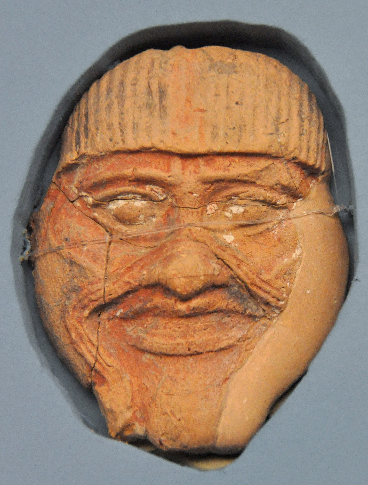

# Tablet Five — Humbaba

### The scene

They stand at the edge of the **Cedar Forest** and stare.

The avenue in is straight; Humbaba's tracks mark a good passage. Cedars rise like a mountain shrine — shade thick with incense, bushes spreading under branches that have stood since before any king of Uruk drew breath. Gilgamesh and Enkidu have come a long road for this. Now the forest itself looks like victory waiting to be taken, and like something that should never have been entered.

**Humbaba** meets them with what the poem calls his **auras** — terrors that are not merely fright but assault. His roar is a whirlwind; flame lives in his jaws; his breath is death. Gilgamesh feels his knees weaken. Enkidu, who once ranged these depths with the wild cattle, feels them weaken too. The guardian of the forest was appointed by **Enlil**; he is not a beast to be hunted but a force stationed at the world's edge. For a moment the heroes are boys again, staring at a door they were always told not to open.

Gilgamesh prays to **Shamash**, the sun-god — his mother's god, the god who watched over the road. Shamash hears. From heaven he raises **eight winds** against Humbaba: a great wind, wind from the north and south, tempest and storm-wind, chill wind and whirlwind, a wind of all evil. They seize Humbaba before and behind so that he cannot advance and cannot retreat. The monster who terrified the forest is pinned like cloth on a line.

Then Humbaba **begs**.

It is one of the poem's most unsettling moments. The guardian of the immortals' cedar grove speaks to Gilgamesh as a servant speaks to a master: stay your hand; be my lord and I will be your henchman; forget the boastful words I spoke against you. Mercy is on offer. The fight is won. The question is only what winning means.

**Enkidu** will not let Gilgamesh accept. Of the offer Humbaba makes, he says, you dare not take it — **Humbaba must not remain alive**. It is the second time the wild man has decided the moral arithmetic of this expedition, and this time there is no elder and no goddess to gainsay him. Gilgamesh listens to his friend. Together they cut off Humbaba's head.

The silence that follows is not triumph. It is cedar sap and a god's servant dead on the floor of a holy wood. They fell the great trees — timber for the temples, glory for the king — and turn homeward with the monster's head and the forest's wealth. The adventure has its prize. The poem does not pretend the price is visible yet.

*PLATE P-05 · Terracotta mask of Humbaba, southern Iraq, Old Babylonian period. Ancient Orient Museum, Istanbul. Photo: Osama Shukir Muhammed Amin, CC BY-SA 4.0, via Wikimedia Commons. The face ancient people gave the guardian — coiled like entrails, grinning like a warning.*

---

### Plainly

**The monster begs and the friend says kill — and victory smells of cedar and of a line crossed that cannot be uncrossed.**

---

### The line

> *O Gilgamish, (pr'y thee), Stay, (now, thy hand): be thou now my master, and I'll be thy henchman: O disregard all the words which I spake so boastfully against thee. Thereat to Gilgamish Enkidu spake: "Of the rede which Humbaba maketh to thee thou darest in nowise offer acceptance. (Aye, for) Humbaba must not remain alive."*
>
> — R. Campbell Thompson, *The Epic of Gilgamish* (1928), Tablet Five

**`plainly:`** *Humbaba surrenders and offers to serve; Enkidu tells Gilgamesh mercy is not an option — the guardian must die.*
