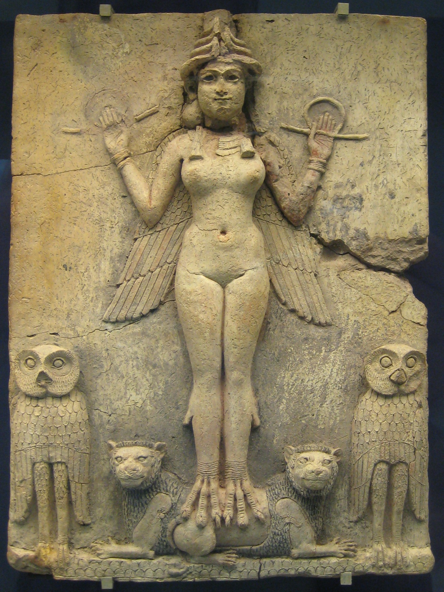

# Tablet Six — Ishtar and the Bull

### The scene

They come home to **Uruk** in triumph.

Gilgamesh washes the stains of combat from his body, braids his hair, puts on clean garments and armlets, girds himself with a baldric. He looks like what he is: the king who went to the Cedar Forest and returned. **Ishtar** — goddess of love and war, the power men invoke and fear in the same breath — sees his beauty and desires him.

She offers marriage as queens offer kingdoms. Come, be my bridegroom, she says; grant me the fruit of your body and I will be your wife. She promises a chariot of azure and gold, mules harnessed each day, a house fragrant with cedar. When you enter, threshold and dais will kiss your feet. Kings and princes will bring tribute. Your flocks will multiply; your herds will thrive; your chariot horses will win fame. It is kingship-in-love — everything a mortal ruler might want, with a goddess beside him.

Gilgamesh **refuses**.

He does not refuse politely. He asks what advantage there could be in marrying Ishtar, then answers his own question with a catalogue of ruin. She is a ruined house that gives no shelter, a back door that gives no resistance to the storm, pitch that defiles the bearer, a leaking water-skin, a sandal that trips its owner. And her lovers — who has she ever loved faithfully? She loved **Tammuz**, the husband of her girlhood, and makes him the cause of wailing every year. She loved the bright-feathered Roller bird and broke his wing — he stands in the groves still, crying *kappi*, "my wing!" She loved a lion in his full strength and dug him seven and seven pits. She loved a stallion, magnificent in battle, and gave him the bridle, the spur, and the whip, and gave his mother Silili her lamentation. She loved a shepherd who burned offerings for her daily, and turned him into a jackal so that his own herd-boys drove him off and his own dogs tore him. She loved **Ishullanu**, her father's gardener, and when he refused her she struck him into a spider, lodged halfway up a wall, able to climb neither up nor down. Me too, Gilgamesh says — you would love me and then reckon me like them.

Ishtar goes up to heaven in a rage. Before **Anu** her father and **Antu** her mother she demands the **Bull of Heaven** so she may kill Gilgamesh in his dwelling. Anu warns her: if I create this bull, seven years of lean husks will follow. Ishtar says she has hoarded grain for mankind and fodder for cattle — let the famine come. Anu gives way. The Bull descends on Uruk.

At its snort the earth opens; young men of Uruk fall into pits. Enkidu is swallowed to the waist, then leaps free and seizes the Bull by its horns. Gilgamesh drives his sword between nape and horns like a butcher who knows his trade. They kill it, tear out its heart, and offer it to Shamash. Then they feast.

Ishtar mounts the ramparts of Uruk and wails. Enkidu hears her, wrenches a haunch from the Bull's carcass and **flings it before her face** — if I could only have reached you, he says, I'd have served you the same; I'd have let his guts dangle on your flanks for a girdle. Ishtar gathers her devotees and leads the lamentation, while Gilgamesh calls the craftsmen to marvel at the horns — thirty minas of lapis in their setting — and hangs them in the shrine of his fathers. The heroes wash their hands in the Euphrates and stride the highway of Uruk with the crowd thronging to see them, and Gilgamesh throws a riddle to the notables: *Who is most splendid of heroes? Who is most famous of giants?* — *Gilgamesh is most splendid of heroes; Enkidu is most famous of giants.* In the palace that night there is high revel — and while the heroes sleep, Enkidu dreams what the gods have decided. Triumph in the street is already the beginning of the bill.

*PLATE P-06 · Burney Relief ("Queen of the Night"), Old Babylonian period. British Museum. Photo: BabelStone, CC0, via Wikimedia Commons. Ishtar or her sister-in-darkness Ereshkigal — scholars still argue; the talons and the lions say enough.*

---

### Plainly

**Refuse a goddess and she will send a famine on legs — and triumph in the street is already the beginning of the bill.**

---

### The line

> *Gilgamish, come, be a bridegroom, to me of the fruit (of thy body) Grant me largesse: (for) my husband shalt be and I'll be thy consort. O, but I'll furnish a chariot for thee, (all) azure and golden, Golden its wheel, and its yoke precious stones, each day to be harness'd Unto great mules.*
>
> — R. Campbell Thompson, *The Epic of Gilgamish* (1928), Tablet Six

**`plainly:`** *Ishtar offers Gilgamesh marriage, wealth, and power; he answers with every lover she destroyed.*
