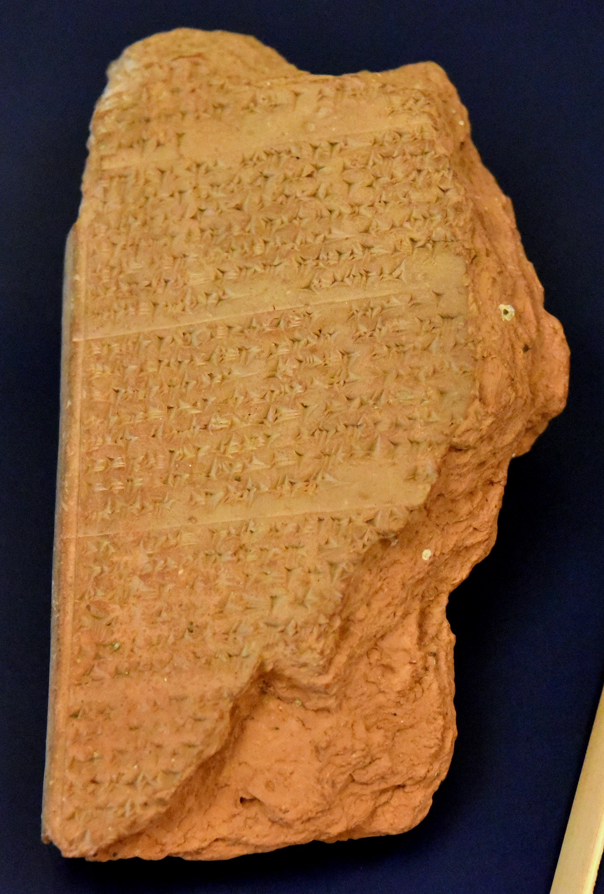

# Tablet Seven — Enkidu's Death

### The scene

Enkidu wakes in the night and tells Gilgamesh his dream.

The great gods have taken counsel together — **Enlil**, **Ea**, **Shamash**. Humbaba is slain; the Bull of Heaven is dead. Someone must pay. Enlil says **Enkidu shall die**, but Gilgamesh shall not. Shamash protests: at your command they killed the Bull and Humbaba; why must Enkidu die now? Enlil turns on the sun-god in anger. The decree stands. Enkidu has seen the underworld in his dream — the House of Dust, the road of no return, bird-garmented dead who never see daylight again. He knows what is coming.

Sickness takes him. He lies on his couch one day, a second, a third — through the tenth day, the eleventh, the **twelfth**. Fever lays him on his back. In his pain he **curses** the trapper who first saw him at the watering-place, and **Shamhat** the temple-woman who civilised him — may she never find satisfaction, may scorching heat and thirst waste her strength, may the shade of a wall be her only home. He loads the woman who brought him bread and wine and Gilgamesh with the bitterness of a man watching his wild strength drain away.

**Shamash** answers from heaven. Why curse Shamhat? She gave you bread fit for gods and wine fit for royalty; she clothed you and gave you Gilgamesh for comrade. Gilgamesh will grant you a great couch, a throne at his left hand; the princes of the underworld will kiss your feet; all Uruk will mourn you. Enkidu hears the god and his wrath is appeased. He **blesses** Shamhat — may kings and princes love her, may her bed be azure and golden, may she be mother of seven brides.

He sleeps alone and dreams again: the firmament roars and the earth echoes, and a man with a dark face and the claws of a lion overcomes him, binds his arms like a bird's wings, and leads him down the road on which there is no returning — to the **Dwelling of Darkness**, the home of Irkalla, where the dead eat dust and their sustenance is mud, where they wear garments of feathers like birds and sit in the dark and never see light. In that house Enkidu sees the crowns of old kings humbled, priest and acolyte, seer and magician; **Ereshkigal**, Queen of the Underworld, enthroned; and before her, reading aloud, Belit-seri, the recorder of Hades — who lifts her head and *sees him*. The dream needs no interpreter. Then he calls Gilgamesh. My friend, he says — my friend who stood with me in battle — and cannot finish. Gilgamesh weeps. He vows he will mourn Enkidu before all Uruk, will put on lion-skin and range the desert, will not let the world forget. Enkidu tries to rise and cannot. He stretches out his hand to his friend. His hand falls.

Gilgamesh will not accept it. He paces. He weeps. He speaks to the body as if speech could reverse decree. But Enkidu is gone — the wild man who met Gilgamesh on the threshold of the city, who made the king his equal, who urged the killing when Humbaba begged, who flung the Bull's haunch at Ishtar — gone to the common lot of mankind. The poem's hinge turns here. Everything before was adventure. Everything after is grief, and the terror of dying like Enkidu.

*PLATE P-07 · Gilgamesh epic clay tablet, Hittite copy from Hattusa, 13th century BCE. Neues Museum, Berlin. Photo: Osama Shukir Muhammed Amin, CC BY-SA 4.0, via Wikimedia Commons. The death of Enkidu survives partly in copies like this — the story travelled a thousand miles from Uruk before it reached us.*

---

### Plainly

**The poem's hinge: adventure ends, grief begins, and the wild man who made the king human is taken so the king can learn he is mortal.**

---

### The line

Enkidu's dream of the world below — the oldest surviving description of a land of the dead:

> *Me did he lead to the Dwelling of Darkness, the home of Irkalla, unto the Dwelling from which he who entereth cometh forth never! Aye, by the road on the passage whereof there can be no returning, unto the Dwelling whose tenants are ever bereft of the daylight, where for their food is the dust, and the mud is their sustenance: bird-like wear they a garment of feathers: and, sitting there in the darkness, never the light will they see.*
>
> — R. Campbell Thompson, *The Epic of Gilgamish* (1928), Tablet Seven

**`plainly:`** *The house of the dead has one door, and it opens only inward. The tenants eat dust, wear feathers, and sit in the dark forever. Enkidu has seen his address.*
