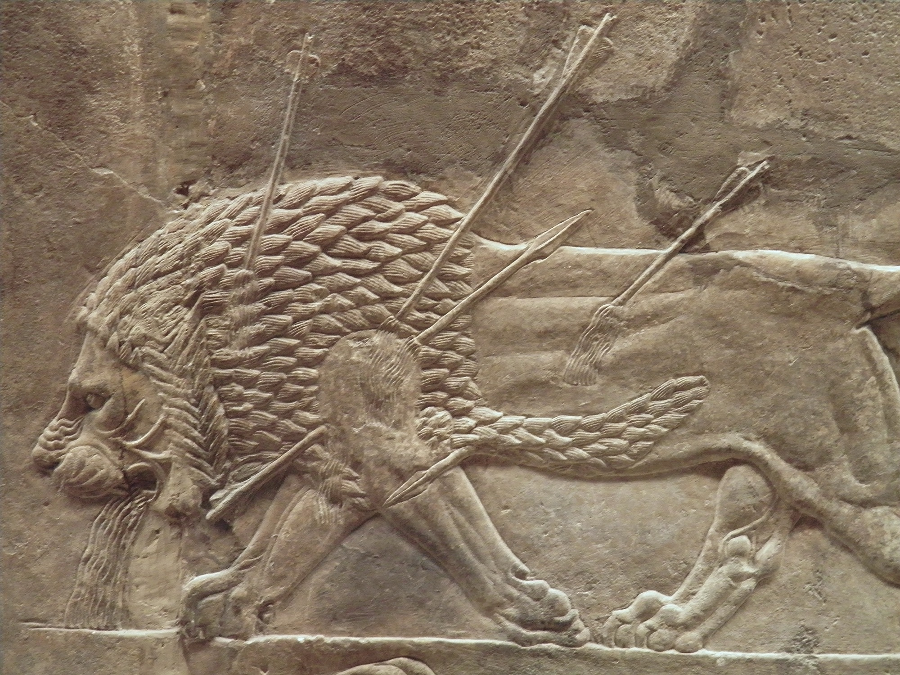

# Tablet Eight — The Lament

### The scene

Gilgamesh will not let Enkidu go quietly.

As something of morning dawns he bends over the body and compares his friend to a **gazelle** — the beast that raised him, the beast that fled him — and promises to glorify him. Then he stands before the **elders of Uruk** and keens like a woman at a bier — bitterly crying, grip slack on the battle-axe at his thigh, the sword at his belt forgotten. Festal garments bring no pleasure. Sorrow has cast him down. He names what they were together: comrades who chased the wild ass and the desert panther, who ascended mountains, captured the Bull of Heaven, overthrew Humbaba in the Cedar Forest. Now Enkidu is dark and cannot hear. Gilgamesh covers his friend **like a bride**, lifts his voice like a lion, roars like a lioness robbed of her whelps. He paces before the body, tearing his hair, plucking away his beauty.

He calls the **land** to mourn. He compares Enkidu to the weapons that made him formidable — the **axe** in his hand, the **sword** in his belt, the **garment** on his shoulders — now useless because the man who gave them meaning is gone. He summons the **mountains** and the **Cedar Forest** to weep. He promises what Shamash promised: a great couch, a throne at his left hand, princes of the underworld kissing his feet, all Uruk constrained to lament. He will put on lion-skin and wander the desert for Enkidu's sake.

He orders a **funerary statue** — likeness in precious metal, offerings of honey in bowls of ruby and azure, cream and adornment, craftsmen working through the rites the poem prescribes. He lavishes on the dead what he cannot give the living: permanence, honour, a place in memory.

And still he will **not bury** him.

Six days pass. A seventh. Enkidu lies on his face like a man asleep, but Gilgamesh knows he is not asleep. He calls and calls; the heart beneath his hand does not beat. He has bewailed his friend day and night and still cannot consign him to the tomb — as if keeping the body above ground could keep death at bay. Then he sees the **worm** — the small unstoppable sign that flesh is returning to earth. The friend he fondled has become what all fondled friends become. Decay breaks the vigil where courage and kingship could not.

Gilgamesh buries Enkidu at last. And then the poem turns again. If Enkidu is dust, then Gilgamesh will be dust. Sorrow enters his heart; he fears death as he ranges the desert. He will go to **Utnapishtim** — the man who survived the flood, the one mortal who was granted eternal life — and ask how to escape what took his friend. Grief does not end in the lament. It sends the king back out on the road.

*PLATE P-08 · Dying lion, Lion Hunt of Ashurbanipal reliefs, North Palace, Nineveh (c. 645–635 BCE). British Museum. Photo: Carole Raddato, CC BY-SA 2.0, via Wikimedia Commons. No Assyrian carver gave us a mourning Gilgamesh; this is the closest thing their art has to grief — strength, pierced.*

---

### Plainly

**Grief is not quiet in this poem — it is public, animal, and unfinished, until decay forces the next journey.**

---

### The line

> *Unto me hearken, O Elders, to me, aye, me shall ye listen, 'Tis that I weep for my comrade Enkidu, bitterly crying Like to a wailing woman: my grip is slack'd on the curtleaxe (slung at) my thigh, (and) the brand at my belt from my sight is removed.*
>
> — R. Campbell Thompson, *The Epic of Gilgamish* (1928), Tablet Eight

**`plainly:`** *Gilgamesh calls the elders to witness his mourning — weapons useless, festal clothes meaningless, Enkidu gone.*
