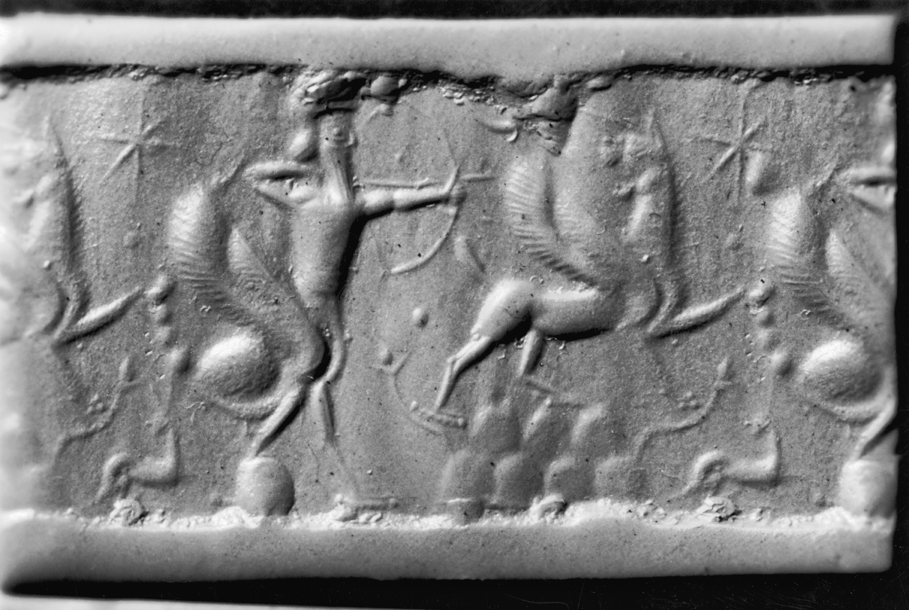

# Tablet Nine — The Road of the Sun

### The scene

**Gilgamesh** will not let **Enkidu** go.

He has wept him like a widow, roared over him like a lioness robbed of her cubs, called the land to mourning, made the statue and the offerings, kept the body until decay forced his hand. Now the worm has done its work and the king is left with a single unbearable thought: *I too will die.* Not someday in the abstract. As Enkidu died — twelve days of sickness, then silence. The two-thirds god discovers the one-third human at last, and it is terror.

He leaves Uruk. He leaves kingship's comforts. He roams the wilderness in skins, lets his hair grow wild, eats what beasts eat, until he looks less like the lord of baked brick and more like the man Enkidu was before **Shamhat** civilised him. Grief has reversed the poem's first movement: the tyrant becomes the wild thing, hunting not a monster but an answer.

The answer has a name: **Utnapishtim** the Faraway — the one who joined the Assembly of the Gods and was given eternal life after the great Flood. Gilgamesh will find him. He will ask about death and life. He will not accept that what happened to Enkidu must happen to him.

The road is not a road any mortal is meant to walk. He comes to **Mashu** — twin mountains whose peaks touch the dome of heaven and whose roots reach down into the underworld. At the gate stand the **scorpion-men**, guardians of the passage the sun travels at dawn and dusk. Their aspect is death; their terror blankets the mountains. Gilgamesh sees them and his face goes blank with fear — then he pulls himself together and draws near.

They see what he is. The male calls to his mate: the flesh of this one is the flesh of gods. She answers: two-thirds of him is god, one-third is human. They question him — why have you come so far, over rivers whose crossing is treacherous? Gilgamesh names his quest: Utnapishtim, eternal life, the secret of death. The scorpion-man tells him what every mortal should hear and few accept: no man has crossed these mountains. Twelve leagues of darkness lie within — dense darkness, no light at all. The sun enters at rising; the sun goes out at setting. Between, the black.

Gilgamesh does not turn back. Though it be in sadness and pain, in cold or heat, gasping for breath — he will go on. Open the gate.

They open it.

He walks the **Road of the Sun** through the mountain's belly — the traverse the sun itself makes in a day and a night, and no mortal has ever made at all. Two hours of deep darkness; four; six; eight — hour upon hour with no lamp but the memory of daylight behind him and the hope of daylight ahead. The poem counts the hours the way a man counts heartbeats when he cannot see his own hand. By the ninth double-hour, a glimmer. At the twelfth, full blazing sun — and before him a garden at the edge of the world, a tree of the gods bearing fruit of ruby, hung about with tendrils fair to behold, its foliage lapis-blue, every fruit a delight to the eye. He has crossed where the sun crosses. What waits beyond is the wine-maker's house by the shore, the Waters of Death, and the man who survived the Flood.

*PLATE P-09 · Cylinder seal with scorpion-man (girtablullû), Neo-Assyrian, 9th–8th century BCE. Walters Art Museum. Public domain, via Wikimedia Commons. The gatekeepers of the sun's road — half sting, half sentry.*

---

### Plainly

**When your friend is gone, the only project left is not dying — and the road to that answer goes through darkness no mortal was meant to cross.**

---

### The line

> *Gilgamish bitterly wept for his comrade, for Enkidu, ranging over the desert: "I, too — shall I not die like Enkidu also? Sorrow hath enter'd my heart; I fear death as I range o'er the desert, I will get hence on the road to the presence of Uta-Napishtim — offspring of Ubara-Tutu is he — and with speed will I travel."*
>
> — R. Campbell Thompson, *The Epic of Gilgamish* (1928), Tablet Nine

**`plainly:`** *The whole engine of the poem's second half in three lines: I too shall die; I cannot bear it; therefore I will walk to the one man who didn't.*
