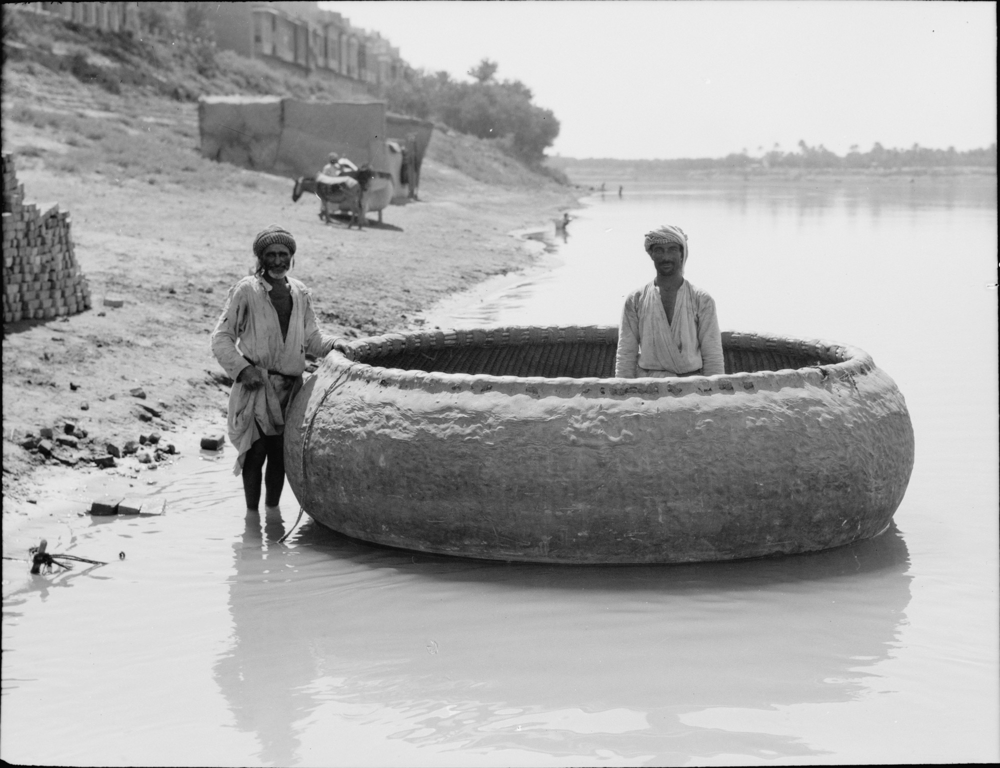

# Tablet Ten — Siduri, the Boatman, the Waters

### The scene

Beyond the mountain's dark, at the edge of the sea, **Siduri** keeps her house.

She is the wine-maker — the woman of the fermenting vat and the golden bowl, veiled, her door looking out over water that leads to what mortals cannot reach by walking. She sees a figure coming: clothed in pelts, the flesh of gods in his body but woe in his belly, his face like the face of one who has gone a far journey. She takes him for a bandit come to ravish and rob, and **bars her door** — postern, inner door, chamber.

**Gilgamesh** hears the bolt fall. He lifts his chin and calls: why have you barred your gate? I will smash the portal, I will break the bolt. I am Gilgamesh — I who seized the Bull of Heaven, who overthrew Humbaba in the Forest of Cedar, who slaughtered lions in the passes of the mountains.

And Siduri asks the question that everyone on this shore will ask him, in the same words, like a litany the poem cannot stop repeating: *if you are that man, why is your vigour wasted and your face sunken? Why is there woe in your belly, and your face like one who has gone a far journey — why do you range over the desert?* And Gilgamesh gives the answer that has hollowed him out: my friend, my comrade and henchman who chased the wild ass and the panther of the desert, Enkidu, who endured every hardship with me — his fate has overtaken him. Six days and seven nights I wept over him and would not give him up for burial, until he lay like a worm on his face. Now I am afraid. The friend I loved has become like clay. **And shall I not lie down like him, and never rise through all eternity?**

Siduri looks at his ruined face and does not give him directions. She gives him the counsel the poem has carried into every language that ever translated it — the wisdom of the wine-maker, who has seen enough seekers to know what they are actually asking for. You will not find what you are hunting. Death is the gods' allotment to man; life they kept in their own hands. So fill your belly. Be merry day and night; make every day a feast of rejoicing; wear fresh clothes, wash your head, bathe in water. Cherish the little one who holds your hand. Let your wife be happy in your arms. **This is the dower of man.**

It is not cynicism. It is the whole portion the gods actually gave — bread, festival, a clean shirt, a child's hand, a spouse — offered by a woman who serves wine at the end of the world. Gilgamesh cannot hear it. His grief is a wall thicker than Uruk's. Which is the way to Utnapishtim? If it can be crossed, I will cross the ocean; if not, I will go on ranging the desert. So she tells him: none has ever made this crossing — Shamash crosses, but who else? — and the **Waters of Death** bar the approach, deep, and one drop is an end. But down at the shore is **Urshanabi**, boatman to Utnapishtim the Faraway.

Gilgamesh goes down to the boatman axe in hand and, in his fury, destroys the very tackle of the boat — the things the crossing depended on (the word is so old and strange that translators cannot agree whether they were "sails" or the "Stone Ones," stone crew or stone charms; the poem's own furniture has half-dissolved in time). *It is your own hand, Gilgamesh, that has hindered your crossing.* So he must buy the passage with labour: into the forest, cut poles — a hundred and twenty, each sixty cubits, tipped with bitumen. Out on the deadly water Urshanabi calls the count: a second pole, a third, a fourth; a fifth, a sixth, a seventh — **one thrust for each pole and then let it go**, for the Waters of Death must never touch his hand. Twice sixty thrusts, and the poles are spent, and the far shore comes.

An old man watches from the beach, puzzling at a boat that comes in wrong. **Utnapishtim** the Faraway — no monster, no god enthroned; a man who looks like the man arriving, and who holds in his memory the answer that was crossed for. The Flood is about to be told.

*PLATE P-10 · Guffa (round boat) on the Tigris, Baghdad, 1932. Matson Collection, Library of Congress, public domain, via Wikimedia Commons. Boats like this outlived the epic's language by two thousand years — the waters keep their own traditions.*

---

### Plainly

**Wisdom offers the life you already have — bread, festival, a child's hand, a spouse — and grief refuses it, because the dead cannot be traded for bread.**

---

### The line

> *Gilgamish, why runnest thou, inasmuch as the life which thou seekest, thou canst not find? For the gods, in their first creation of mortals, death allotted to man, but life they retain'd in their keeping. Gilgamish, full be thy belly, each day and night be thou merry, and daily keep holiday revel, each day and night do thou dance and rejoice; and fresh be thy raiment, aye, let thy head be clean washen, and bathe thyself in the water, cherish the little one holding thy hand; be thy spouse in thy bosom happy — for this is the dower of man.*
>
> — R. Campbell Thompson, *The Epic of Gilgamish* (1928), Tablet Ten

**`plainly:`** *Stop running: the thing you are chasing was never issued to your species. Eat, dance, wash, hold your child, love your wife — that is the entire inheritance, and it is not nothing.*
