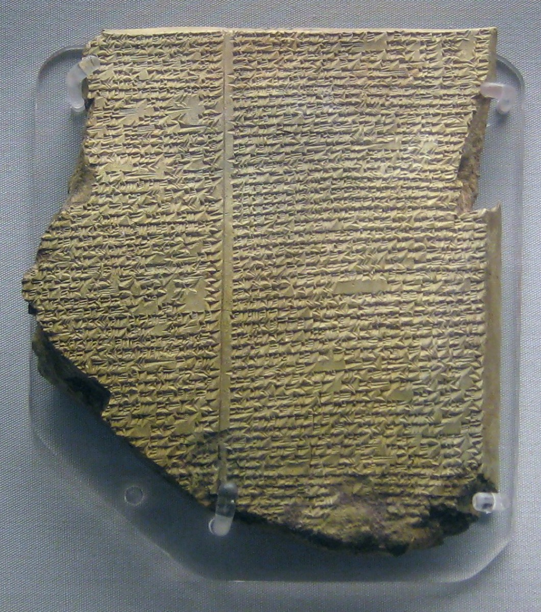

# Tablet Eleven — The Flood, the Plant, the Walls

### The scene

**Utnapishtim** looks at **Gilgamesh** and sees a mirror — same face, same body, a man who came ready to fight and found his arm useless. *How is it*, Gilgamesh demands, *that you stand in the Assembly of the Gods and have found life?*

Utnapishtim answers with a story.

**I will reveal to you a hidden matter**, he says — a secret of the gods. In **Shuruppak**, on the banks of the Euphrates, the hearts of the great gods moved them to send the Flood. **Anu** swore the oath of secrecy. **Enlil** advised. **Ea**, bound by the oath, could not speak openly — so he betrayed the counsel to a wall of reeds, and let a man overhear: *O Reed-hut, Reed-hut! Wall, wall! Hearken, O Reed-hut; consider, O Wall! O mortal, man of Shuruppak, son of Ubara-Tutu — pull down your dwelling and fashion a vessel of it. Abandon your possessions and seek life. Disregard your hoard, and save living things: make every kind of creature go up into the vessel.* Its beam and its length in due correspondence; then launch it on the deep.

The man — Utnapishtim himself, in his mortal days — obeyed. And to the city that would drown, Ea taught him a truthful lie: say that Enlil hates you, that you go down to the Deep to dwell with Ea — and on *them* he will shower abundance, fowl in plenty, a booty of fish, a rich harvest, a plentiful rain. Every word true, and every word a hook. On the fifth day he laid out the shape of the hull. He gave the workmen ale, oil, and wine as if it were river water, and they feasted as at the New Year. He loaded silver and gold, his kith and kin, cattle and beasts of the field and every craftsman. **Shamash** set the hour: in the night the ruinous rain would begin — then enter the vessel, and shut down the hatch.

The storm came. **Adad** thundered; the dikes overflowed; the land shattered like a pot. Six days and seven nights wind and flood flattened the world. The **gods** cowered like dogs along the outer wall. **Ishtar** shrieked: the old days have turned to clay; my people fill the sea like fish.

When the seventh day came, the sea grew quiet, and all mankind had returned to clay. Utnapishtim opened a hatch; sunlight fell on his cheek; he bowed down and sat weeping, the tears running over his face. He looked for land. At twelve points, land reared up. The boat grounded on **Mount Nisir** — Nimush, in newer readings — which held her fast day after day and gave no leave to shift. He sent a **dove**; she went to and fro and returned — no resting-place. He sent a **swallow**; she too returned. He sent a **raven**; the raven saw the waters ebbing, ate, waded, splashed, and did not come back. Then he freed everything to the four winds and sacrificed on the peak of the mountain — twice seven flagons, sweet cane, cedar, and myrtle heaped beneath. The gods smelled the savour and **gathered like flies** over the offering. And the great goddess, arriving, lifted up her necklace of great jewels: *sooner will I forget these sapphires at my throat than forget these days.*

**Enlil** arrived furious — has some mortal escaped? Not a soul was to survive the ruin. **Ea** answered him: on the sinner lay his sin, on the transgressor his transgression — but be merciful, lest all be cut off. Send a lion to thin mankind, send a wolf, send famine, send plague — anything with a survivor. But a flood is an argument with no one left to lose it. Enlil went up into the boat, took Utnapishtim's hand and his wife's, touched their foreheads as he stood between them, and blessed them: *hitherto Utnapishtim has been mortal; now he and his wife shall be like us gods, and dwell far away, at the mouth of the rivers.* Immortality — granted once, by a god embarrassed in front of his family, to close the book on a catastrophe. Not a recipe. A settlement.

Gilgamesh has crossed mountains for this — and Utnapishtim sets him a test. Sit, but do not sleep for six days and seven nights. Gilgamesh sits. Sleep, like a fog, blows over him. His host's wife urges mercy: bake loaves, set them by his head, mark each day on the wall. When he wakes, Utnapishtim shows him the evidence — the first loaf dried hard, the second stale, the third moist, mould on the fifth, only the last still fresh. **Seven days.** Gilgamesh failed before he knew the test had begun. Eternal life is not won by a man who cannot stay awake.

He weeps. And at his wife's urging Utnapishtim offers a parting gift instead — a hidden thing: a plant deep in the ocean, thorned like a briar, that scratches the hand that takes it — but the hand that takes it finds new life. Gilgamesh binds heavy stones to his feet, sinks to the deeps, seizes the plant though it pricks him, cuts the stones free, and rises. He names it — in Thompson's rendering, *Greybeard-who-turneth-to-man-in-his-prime* — and makes the most endearing plan in ancient literature: he will carry it home to Uruk and test it on an old man first, and then eat it himself.

Forty hours out they break their fast; at sixty they rest. Gilgamesh finds a pool of cool water and goes down to bathe. A **serpent** snuffs the fragrance of the plant, darts up, and snatches it — sloughing its skin as it goes, says the tradition: youth for the snake, nothing for the king. Gilgamesh sits down and weeps, the tears running over his cheeks. For whom have my arms laboured? For whom is my heart's blood spent? I won nothing for myself — I did my good deed for the ground-lion.

He returns with **Urshanabi**. They sail the long water back. They walk the long road home. And at **Uruk** — the city he left in skins and grief — Gilgamesh does the thing the poem has been building toward since the first line.

*Go up*, he tells the boatman, *and walk on the ramparts of Uruk. Look on the base. Take heed of the bricks.* Kiln-burnt brick; groundwork of bitumen, seven courses deep; one measure city, one measure gardens, one measure claylands, and the temple of Ishtar — the whole expanse tallied like an honest ledger. Not immortality. Not youth restored. **Walls** — human work, mortal work, work that outlasts the man who built it if the brick is sound and the labour honest.

The plant is gone. The friend is gone. The serpent has the youth. What remains is brick you can touch — the true ending of Tablets I–XI. The Flood sits inside the frame like a story inside a story — related, if you know Genesis, but not identical — and even its survivor cannot give Gilgamesh what he came for.

*PLATE P-11 · The Flood Tablet (Gilgamesh XI), Library of Ashurbanipal, Nineveh, 7th century BCE. British Museum, K.3375. Photo: BabelStone, CC0, via Wikimedia Commons. The actual clay George Smith read in 1872 — the piece of dirt that made a room full of Victorians gasp.*

---

### Plainly

**Immortality is a story someone else lived; the plant of youth goes to the serpent; what remains is brick you can climb and inspect — the work of hands that will die, still standing.**

---

### The line

The story's beginning, and the poem's true end:

> *Gilgamish, I unto thee will discover the whole hidden story, aye, and the rede of the Gods will I tell thee … Do thou, Ur-Shanabi, go up and walk on the ramparts of Erech, look on its base, and take heed of its bricks, if its bricks be not kiln-burnt, aye, and its ground-work be not bitumen, e'en seven courses.*
>
> — R. Campbell Thompson, *The Epic of Gilgamish* (1928), Tablet Eleven

**`plainly:`** *A secret of the gods, and then — climb the wall, boatman, and check my brickwork. Between those two sentences the whole education of Gilgamesh takes place.*
