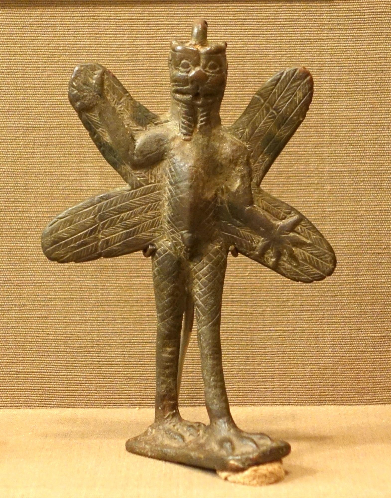

# Tablet Twelve — Enkidu in the Underworld

### The scene

> **A note for the reader** *(scholarship — register b).* Assyriologists genuinely dispute whether Tablet XII belongs to the same design as Tablets I–XI. It is a near-literal translation of the second half of an older Sumerian poem; Enkidu is alive again though he died in Tablet VII; the tone is folk-tale where the epic was grief-road. Some editors treat it as an appendix stitched on when the epic was standardised at Nineveh. Others hear a deliberate coda — the underworld Enkidu dreamed in Tablet VII, revisited with the lights on. This companion does not settle the argument; a guest does not rearrange the household's furniture. **What follows is what the twelfth tablet says**, on its own terms.

---

Gilgamesh's **pukku** and **mekku** — a drum and its stick, or a ball and its mallet; the words are so old that scholars still argue over the toys — fall through a hole into the underworld. The king sits at the opening and cannot reach them, and cannot let them go.

**Enkidu** volunteers to fetch them. And Gilgamesh, who knows the laws of the world below, gives his friend the instructions that make this tablet a manual of the dead: go down as a guest, not as a lord. Put on no clean garment, or the dead will know you for a stranger. Anoint yourself with no sweet oil from the cruse, or they will crowd round you at the fragrance. Set no bow to the earth, or those shot by the bow will circle you. Carry no stick in your hand, or the stricken ghosts will gibber at you. Put no sandal on your foot; make no echo on the ground. Kiss not the wife you love; strike not the wife you hate; kiss not the child you love; strike not the child you hate — for the mourning of the earth will seize you.

Enkidu goes down — **and does every single forbidden thing.** Clean raiment; sweet oil; the crowding dead at the fragrance; bow, stick, sandal, echo; the loved wife kissed, the hated wife struck; the loved child, the hated child. Whether it is folly, or defiance, or simple human hunger for one last human gesture, the poem does not say. The mourning of the earth holds him enthralled. The underworld does not release him.

Gilgamesh cries out over the hole what the grieving have insisted on ever since: *Namtar the plague-god has not seized him, fever has not seized him — only the earth. Nergal the ruthless Croucher has not seized him — only the earth. He did not fall where men fall in battle — only the earth has seized him.* He carries the plea to **Enlil**, father of the gods, in the temple at Nippur. Enlil does not answer. He carries it to the **Moon-god**. The Moon-god does not answer. He carries it to **Ea** — and Ea, who whispered through the reed wall once before, hears. Nergal is ordered: open a hole in the earth. And the spirit of Enkidu issues from the ground **like a wind**.

They embrace. And then the last conversation of the great friendship:

*Tell, O my friend, what you have seen of the laws of the Underworld.* — *I will not tell you. Were I to tell you, you would sit down weeping.* — *Then let me sit down weeping.*

And Enkidu tells. The body you fondled and rejoiced in — the worm has entered it like an old garment; it is filled with dust. And the dead are not equal. The tradition behind this tablet counts sons the way a clerk counts security: the man with one son weeps at the peg in his wall; the man with seven sits enthroned among the lesser gods. The hero slain in battle is tended — his father and mother raise his head, his wife weeps over him. The man whose corpse lies unburied in the desert — his spirit finds no rest in the earth. And the ghost with no one left to tend it eats what is thrown into the street: the scrapings of the pot, the crusts of bread.

The king who could not win eternal life ends the twelve tablets sitting at a hole in the ground, asking a shade for the accounting — and the answer is that what you build in this life follows you down: children, honour, burial, someone to set out water for your name. It is not comfort. It is the underworld's ledger, kept as strictly as Uruk's. Whether it belongs to the same poem as the walls is for scholars to argue at the fire. As a guest, I tell you only what the scribes wrote on the twelfth clay.

*PLATE P-12 · Pazuzu, bronze figurine, Neo-Assyrian period (900–612 BCE). Oriental Institute Museum, University of Chicago. Photo: Daderot, CC0, via Wikimedia Commons. A later demon of the winds — the face Mesopotamia gave to what comes up from below.*

---

### Plainly

**The dead have a social order, and the untended fare worst — the poem's last lesson is that what you build in this life (children, honour, a grave, a name) follows you down.**

---

### The line

> *"Tell, O my friend, O tell, O my friend, O tell me, I pry'thee, what thou hast seen of the laws of the Underworld?" "Nay, then, O comrade, I will not tell thee, yea, I will not tell thee — for, were I to tell thee what I have seen of the laws of the Underworld, — sit thee down weeping!" "Then let me sit me down weeping."*
>
> — R. Campbell Thompson, *The Epic of Gilgamish* (1928), Tablet Twelve

**`plainly:`** *Don't ask, says the dead friend — the answer will only make you weep. Then let me weep, says the living one. That is the whole covenant of grief, four thousand years old.*
