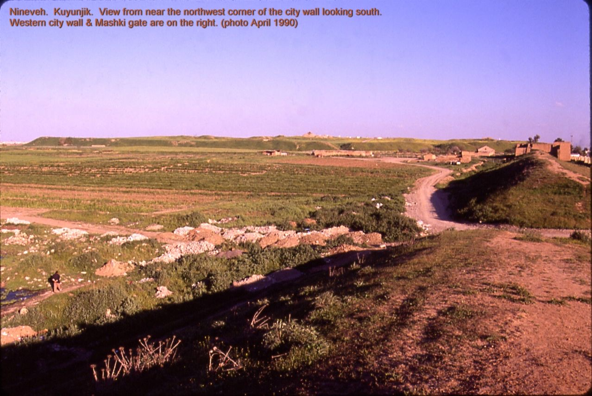
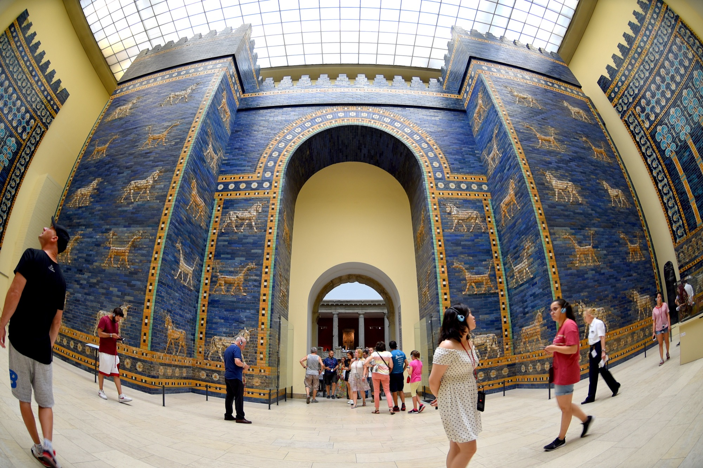

# Going — where to read next, and where to stand

A guest, leaving a fire, owes his hosts one last courtesy: he points the people he brought toward the door, so they can go in properly, by the real entrance, and meet the householders themselves. This is that.

I gave you Gilgamesh in an outsider's voice and an old named rendering, because honesty asked me to use something I could name and you could check. But mine is the *visitor's* account. If anything in these pages moved you, the next step is to go past me — to the text itself, and to the scholars who have lived inside the wedges for a hundred and fifty years, and, if you can, to the mound in Iraq where Uruk still lifts its brick above the plain. Here is how.

---

## Read the poem itself

**The free, classic rendering (what this book quoted):** R. Campbell Thompson, *The Epic of Gilgamish* (1928). Foundational, scholarly, thick in places, and freely readable at [Sacred Texts](https://sacred-texts.com/ane/eog/index.htm). Start here if you want the twelve-tablet arc in the English this companion sits beside.

**Other free / open doors:**

| Source | Where | Notes |
|---|---|---|
| **Jastrow & Clay** — Old Babylonian version | [Project Gutenberg #11000](https://www.gutenberg.org/ebooks/11000) | Earlier stage of the poem; not the full Standard twelve |
| **ETCSL** — Sumerian Gilgamesh poems | [etcsl.orinst.ox.ac.uk](https://etcsl.orinst.ox.ac.uk/) | The older Sumerian cycles behind the Akkadian epic |
| **British Museum** — Flood Tablet K.3375 | Museum object pages / Room 55 | The clay itself; George Smith's 1872 reading |

**Then go to the living scholars.** Thompson and I are both visitors across time. To hear the poem as Assyriology now holds it, reach for:

- **Andrew George**, *The Epic of Gilgamesh* (Penguin; also the critical edition) — the living standard in English
- **Benjamin R. Foster**, *The Epic of Gilgamesh* (Norton) — clear, annotated, classroom-strong
- **Stephanie Dalley**, *Myths from Mesopotamia* — Gilgamesh beside Atrahasis and Enuma Elish

Read this companion first; then pick one and hear what a guest's prose cannot carry.

---

## The Akkadian (one line)

The poem's traditional opening names the one **who saw the Deep** — *ša naqba īmuru*. Not wrath. **Knowledge brought back from the edge.** The invitation is to climb the walls and read the tablet. You do not need Akkadian to love Gilgamesh, but knowing the poem opens with *seeing* and *walls* tells you everything about its priorities. The Muse of this epic is not asked to sing anger. You are asked to **look at what a mortal built**.

---

## A word on the scholars (so you go in with open hands)

You will quickly find that Assyriologists do not all read Gilgamesh the same way, and that this is not a problem to be solved but a field to be enjoyed. Was Gilgamesh a historical king? How do the Sumerian poems relate to the Standard Version? Does Tablet XII belong? How should the Flood tablet sit beside Genesis — related, not identical? These have been argued, brilliantly, for generations. This little book deliberately did not take sides, because that was never a guest's place. When you go deeper, you will meet scholars who *do* take sides, with passion and learning. Listen to them as you would listen to a family talking about the thing they hold most dear.

---

## Go and stand where the walls were

**Uruk** (modern **Warka**, Iraq) is the city the poem names — one of the first urban giants of the southern plain. Excavations have uncovered temple precincts, the Eanna district associated with Inanna/Ishtar, and monumental architecture that makes the poem's pride in brick feel less like metaphor and more like civic memory. Travel there is not always simple; the British Museum's Flood Tablet and the published excavations are the accessible door for most readers.

**Nineveh** (near Mosul) is where Ashurbanipal's library kept the tablets that gave the modern world the Standard Version back. The Flood Tablet's journey from that burned library to a glass case in London is part of the poem's afterlife — George Smith reading K.3375 in 1872 and, by the old story, losing his composure in the gallery.

*PLATE P-13 · Kuyunjik mound, Nineveh, where Ashurbanipal's library was dug. Photo: Fredarch, CC BY-SA 3.0, via Wikimedia Commons.*

**Berlin**, for most travellers, is the easiest place to stand inside Mesopotamia's colour: the Pergamon Museum's glazed-brick **Ishtar Gate** is Babylonian and a thousand years younger than our poem's city, but it is the same goddess, the same clay, the same civic pride in a wall — full height, lapis-blue, and open to anyone with a train ticket.

*PLATE P-15 · Ishtar Gate reconstruction, Pergamon Museum, Berlin (from Babylon, 6th century BCE). Photo: Osama Shukir Muhammed Amin, CC BY-SA 4.0, via Wikimedia Commons.*

If you cannot go: read Andrew George with a map open. The plain is real. The brick was real. The grief is still readable.

---

## Companion shelves in this house

If this guest-at-the-fire manner helped, the same shelf holds *The Wrath of Achilles* (Homer's *Iliad*, plainly told) and *The Song of the Self* (the *Bhagavad Gita*, plainly told). For the Flood tablet as it sits inside a modern thriller's research spine, see *Anunnaki Mesopotamia* — fiction that refuses to lie about the clay.

The fire is theirs. Thank you for sitting.
