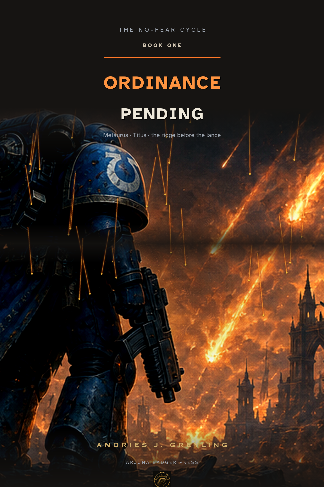
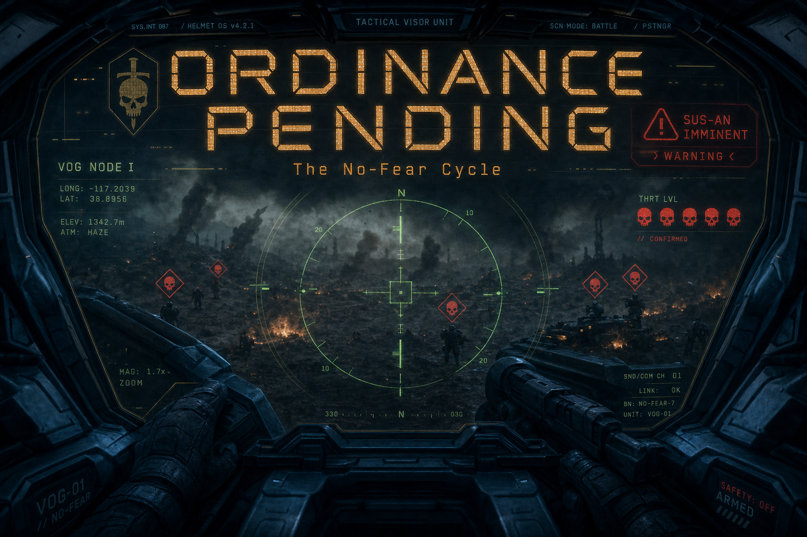
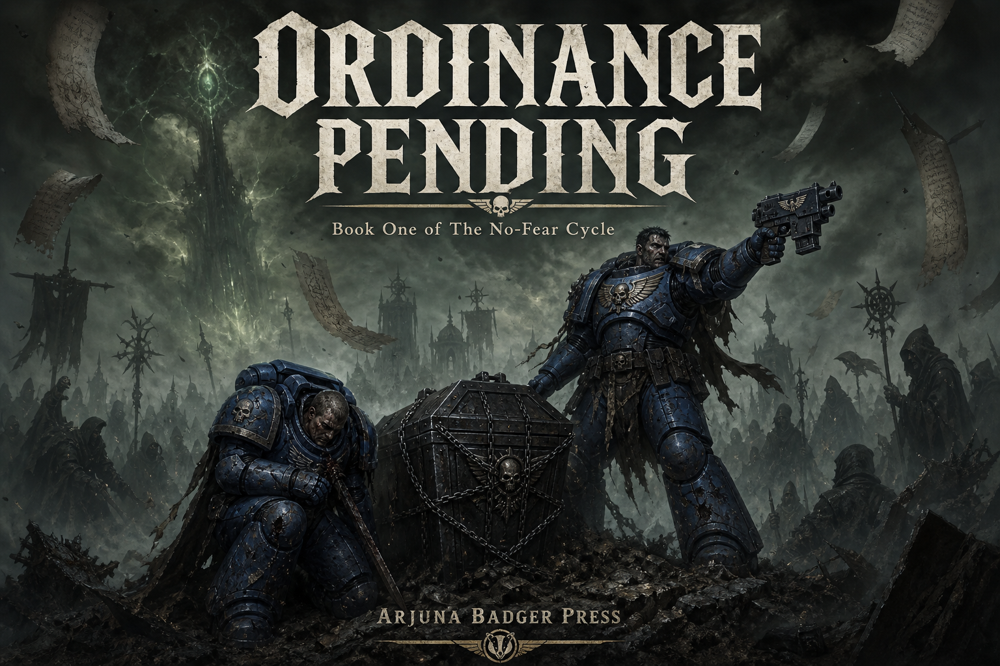
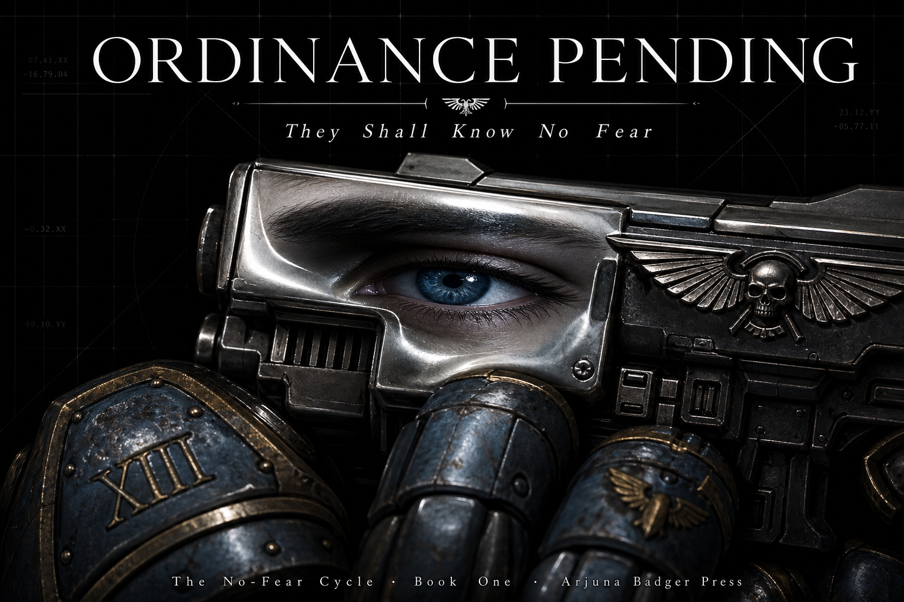

# Image Compendium — *Ordinance Pending* (The No-Fear Cycle · Book One)

> Cover art for the 6×9″ trade paperback / PDF demo. **All covers are original Arjuna Badger Press
> generated art** (2026) — not Games Workshop official artwork. Unauthorised fan-fiction setting;
> covers are platform demo only.

## Selected cover (front of PDF / EPUB)

**Cover E — *Ordinance* (enhanced)** — portrait 6×9″ @ 300 dpi composite of the Cover A illustration
with Atkinson Hyperlegible typography, contrast boost, and Arjuna Badger Press imprint. Lone
blue-armoured soldier on the ridge under orbital fire — matches the Prologue strike and reads at
thumbnail size.

- **File:** `design/cover.jpg` (also `design/cover.png`)
- **Source:** Cover A art + `design/make_cover.py` (Arjuna Badger Press house composite)
- **Credit:** Arjuna Badger Press / Andries J. Greyling, 2026
- **Use:** Front cover · PDF page 1 full bleed · EPUB cover image

---

## Alternate covers (PDF appendix)

The following three explorations appear at the end of the demo PDF as an **image compendium** — the
same workflow used for Wikimedia illustration galleries on the main shelf, applied here to cover
variants.

### Cover B — *HUD*

First-person helmet visor: skull icons, coordinate lock, sus-an warning. The Astartes / battle-council
channel aesthetic.

- **File:** `design/covers/cover-b-hud.png`
- **Credit:** Arjuna Badger Press / Andries J. Greyling, 2026

### Cover C — *The Ridge*

Two marines, sarcophagus chain, cultist tide — the Metaurus/Titus mentorship beat.

- **File:** `design/covers/cover-c-ridge.png`
- **Credit:** Arjuna Badger Press / Andries J. Greyling, 2026

### Cover D — *No Fear*

Blue eye in bolter reflection — Titus ontology; literary minimal.

- **File:** `design/covers/cover-d-eye.png`
- **Credit:** Arjuna Badger Press / Andries J. Greyling, 2026

---

## Image credits (consolidated)

| Cover | Role | File |
|---|---|---|
| A — Ordinance | Source art | `design/covers/cover-a-ordinance.png` |
| B — HUD | Alternate | `design/covers/cover-b-hud.png` |
| C — The Ridge | Alternate | `design/covers/cover-c-ridge.png` |
| D — No Fear | Alternate | `design/covers/cover-d-eye.png` |
| **E — Ordinance (enhanced)** | **Selected** | `design/cover.jpg` |

All art © 2026 Andries J. Greyling / Arjuna Badger Press. Demo only; not for commercial use with
Games Workshop trademarks.
