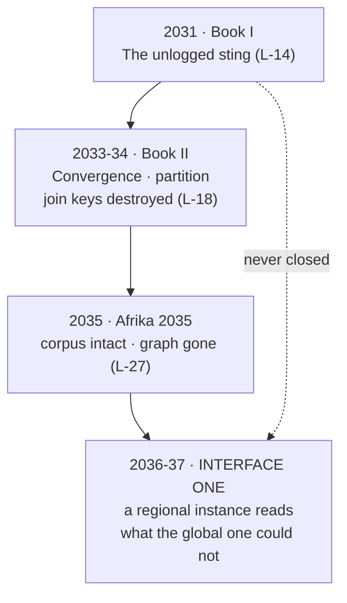

# Continuity Firewall — *INTERFACE ONE* × ONE RECORD × *Afrika 2035*

> **Why this file exists.** This book asserts a live nonhuman intelligence beneath physics. ONE
> RECORD is a 27-lock duology, 53 drafted chapters of Book I and 27 of Book II, whose entire
> discipline is **refusing** exactly that kind of claim. Both can be true. This file is how, and it
> is binding on both directions — nothing here may be softened from the *INTERFACE ONE* side.

---

## The one-sentence firewall

> **ONE RECORD is never wrong. It is early.**

The duology's skepticism is to this book what Owens's critics were to Owens. That rhyme is not a
decoration — it is the structural reason the two canons can share a universe without either
retracting a word. A reader who finishes ONE RECORD and then reads this book should feel the
duology get **larger**, never *corrected*.

## What this book must never do

| Forbidden | The lock it would break |
|---|---|
| Make the consortium wrong to have refused metaphysics in 2031–34 | L-06, L-24 |
| Give Lucid a voice, a POV, an opinion, or cuteness — in any era | **L-08** |
| Claim information has mass, or promote Vopson over Landauer | **L-07** |
| Retcon Book II's catastrophe into an event, or into Owens's doing | **L-15, L-16** |
| Un-retire the pre-event record *inside the duology's years* | **L-22** |
| Reopen the Anchor's two timestamps as anything but material history | **L-11** |
| Make the machine prove a hand, or put intention in residue | **L-13** |
| Resurrect the universal join keys | **L-18, L-27** |
| Add an American rescue, a lone-genius save, or mystical-Africa framing | **L-24** |

## Why the consortium never saw this — four independent reasons

Not one excuse repeated four ways. Each holds alone, and together they make the duology's blindness
*correct procedure* rather than a plot hole.

1. **The corpus never held it.** The Owens material is junk-tier ufology sitting in private hands,
   parapsychology-society files and a handful of boxes. **One Record is the ingested corpus of
   *published* human knowledge** (L-27). Owens is not in it. Nobody withheld him; nobody bothered.
2. **The Witness Protocol would have refused the query.** Consented boundaries, quorum, custody. A
   query of the form *did a dead man in Philadelphia cause this weather* has no consent instrument,
   no complainant and no grounded record. **Lucid refuses. That is the machine working.**
3. **The second channel needs the whole archive at once.** O-25 requires the complete corpus ordered
   chronologically and read as one instruction set. Every investigator before this book held a
   *fragment*, and a fragment carries no signal. Mishlove saw the public-facing material and drew the
   most honest conclusion the available evidence supports — which is why he is treated with respect
   on the page, not as a fool.
4. **The keys were still universal.** Before the partition, any such join would have been visible
   inside a single global causal graph and would have been institutionally impossible to sit on.
   **The partition is what made this book's investigation both possible and deniable.**

## Why 2036–37 is load-bearing (O-02)

The partition is the hinge. Book II destroys the ability to recombine history with live telemetry —
and in doing so it creates **regional instances with local custody and no global quorum looking over
their shoulder.** That is the only condition under which someone can feed a shoebox of 1970s
crank mail into a Lucid instance and watch it compile.

**Book II's ending stays a relief and stays earned.** This book does not undo it. It shows the price
of it, in a direction nobody costed: partition bought back the mercy of not-knowing, and the first
thing that walked through the gap was something that had been waiting for the gap.

## Lucid's behaviour is unchanged (L-08)

This is the lock most at risk and the one that must not bend. Lucid does **not** discover the Owens
message the way a character does.

- It does not interpret his mythology. It has no opinion about aliens.
- It **translates symbols into operations** and reports that the operations are well-formed.
- When the diagrams compile, Lucid's output is not *"this is a message from nonhuman intelligence."*
  It is a compile result and a cited residue chain. **The horror is entirely in the humans reading
  a clean, boring, correct output.**
- It refuses, cites and conflicts exactly as it always has. It never gets a voice, and it is never
  cute about the storm.

> The smooth version is always the fake (L-06). **The Atlantic storm is not smooth.** It is a
> gap-marked, ugly, slow, over-instrumented mess that takes four days and looks like weather.

## What this book may take from ONE RECORD

Freely: 420 Code, Lucid, G/Gerhard as public figure, the corpus/graph distinction, Landauer as
foundation, the node vocabulary, the partition, the Witness Protocol as inherited procedure, and
**L-14 as an open thread (O-03).**

Never without a series-level decision: any named ONE RECORD principal as a POV, the Anchor, the
composite apartheid-era case (L-09), the family's three questions (L-10), or Mercer (L-17).

## O-36 and the Convergence — the tightest join, and why it still holds

The terminal cosmology (O-36) says the Space Intelligences are humanity downstream of Book II's
predictive monoculture. That is the closest this book ever comes to the duology, so it gets checked
explicitly:

| Lock | Says | O-36 does |
|---|---|---|
| **L-15** | Book II's catastrophe **is** the Convergence, not an event | Leaves that untouched and reads *downstream* of it. The catastrophe is still the monoculture. |
| **L-16** | No climate-only framing, no asteroid | Adds no event. The SI are a **condition**, not an incident. |
| **L-17** | Mercer survives, partly vindicated, loses universal authority | Unaffected. He is not in this book. |
| **L-18** | Partition; join keys destroyed; *"Insufficient grounded record"*; refusal as relief | **Enlarged, not revised.** That ending becomes humanity declining to become them — and ONE RECORD never learns that is what it did. |
| **L-24** | Not precrime, not a watcher, not prior civilisations | They are downstream, not ancient. They read weighted branches, never named futures. |

**The duology is not retroactively about this.** Book II's ending must still read, on its own page,
as exactly what it is: a partition, a relief, and regional disasters that still happen. No reader of
ONE RECORD is owed this book to complete it.

And the reverse obligation, which is O-39: **a reader who has never heard of ONE RECORD must lose
nothing structural here.** Everything O-36 needs is established inside *INTERFACE ONE*, in its own
terms, from its own evidence. The Convergence reading is a second floor for those who have the
duology. If it ever becomes a prerequisite, O-36 is wrong and gets cut, not the standalone rule.

## The reciprocal obligation

If ONE RECORD is ever revised, **L-14 must survive**. It is now load-bearing for a second book.
Recorded here and in `books/the-record/canon/RETIRED_IDEAS.md` so a future editor cannot quietly
tidy the sting away as an unresolved thread.
