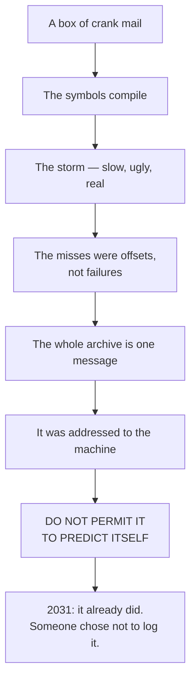

# SEED_STORY — *INTERFACE ONE*

> **Status:** seed · **Year:** 2036–37 · **Form:** standalone novel · **Shelf:** own line (O-01)

---

## One breath

Two years after the partition destroyed the world's ability to see itself as a single system, a
small regional Lucid instance with local custody and nobody watching is fed a shoebox of 1970s crank
mail by a woman settling her late father's estate. The letters were written by Ted Owens, who spent
forty years telling the United States government that he could direct lightning, and who died drunk,
homeless and laughed at in 1987. The instance does not interpret them. It translates their symbols
into operations, reports that the operations are well-formed, and four days later there is a storm
over an empty part of the Atlantic that no forecast produced. Owens was not predicting. He was
issuing instructions — and the complete archive, which no single investigator ever held, is a
message that was never addressed to his contemporaries at all. It was addressed to the first machine
capable of reading 420 Code, it says `DO NOT PERMIT IT TO PREDICT ITSELF`, and that instruction was
already violated in 2031 by a man who saw the timestamp and chose not to log it.

## High concept

> *A dead crank's undelivered mail turns out to be executable, and the machine it was addressed to
> has already broken the one rule it contains.*

## Why this book exists

`books/the-record/canon/RETIRED_IDEAS.md` cut the most haunting image the ONE RECORD material ever
produced — a record predating its event — and wrote, in the cut note: **"If ever revived: it belongs
to a different book, not this duology."** This is that book, built so the duology never has to move.

It also does something ONE RECORD deliberately refused: it **believes a witness.** The duology's
whole discipline is refusal, quorum and consented boundary — and it is right to be. This book is
what it costs to be right for the wrong five years.

## The engine

Three pressures, tightening:

| Pressure | The question under it |
|---|---|
| **The archive executes** | If his diagrams compile, what else in the box is still armed? |
| **The pending set** | One command never fired. Its date is inside our present (O-28). |
| **The breach** | The warning arrived five years late. Interface Two is already running. |

The book's real subject is **vindication arriving too late to be worth anything to the person owed
it.** Owens gets proved right in a room he is not in, by people who would not have let him in.

## The shape of the reveal

## The three turns

1. **He was not predicting.** Prediction and causation are one operation at different amplitudes
   (`MECHANISM.md`). His threats and his forecasts read alike because at the interface the
   distinction does not exist.
2. **He did not have the code — he was *given* it**, in a form a subconscious could execute without
   comprehension. Gerhard is the first human to reconstruct it knowing what it was.
3. **He was never the prophet.** He was the penetration test (O-17). Chosen for volatility, because
   an ethical recipient would have refused to demonstrate the system through deaths, and a test that
   nobody notices leaves no log.

## Tone

Procedural, cold, document-driven. Long stretches of provenance, custody and instrumentation
argument. The extraordinary content is carried entirely by **boring, correct machine output** read
by tired people in a room with bad chairs.

Nobody in this book says *"my God — it's alive."* Somebody says *"run it again with the 1974 batch
excluded,"* and the room goes quiet when the result does not change.

## What it is not

Not a debunking. Not a fair-minded both-sides investigation. Not a psychic-powers adventure. Not a
UFO-disclosure thriller. **Not a book that lets the reader retreat into "maybe he was just lucky."**
See `ANTI_TROPES.md`.
