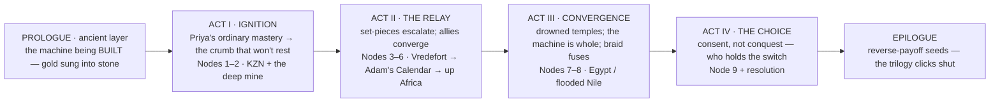

# Story Bible — African Gold

> The binding four-act + prologue/epilogue spine and the turning points. The structural engine is
> the **quest-relay** (Architecture §3; enforced by `template:quest-relay`). This bible is the
> high-level map; the node-by-node detail is in [`PLOT.md`](PLOT.md) and the relay ledger is
> [`SET_PIECE_LEDGER.md`](SET_PIECE_LEDGER.md). ~90–100k words, ~20–24 chapters.

---

## Dramatic question

**Who gets to decide what humanity is ready to switch on?** — and beneath it, the protagonist's
question: *can I understand the thing before anyone uses it, sells it, or buries it — and what do
I owe knowledge I'm not sure we're ready for?*

## The spine (relay, not loop or ladder)

---

## ACT I — IGNITION (Nodes 1–2)

**Function:** establish Priya's ordinary mastery and her exile from AugmenTech; deliver the crumb
that won't let her rest; force the first descent.

- **Open on competence**: Priya doing what she does — reading a system, being right, being dry,
  being alone by choice. Establish the ND gift as her superpower *before* any ancient mystery.
- **The crumb**: something surfaces (via Theo / the Court lineage / an assayer) that she cannot
  un-see — a vitrified bore, a gold piece that "rings wrong," a pattern that says *engineered*.
  Her habit of not stopping does the rest.
- **Node 1 (KZN)** and **Node 2 (the deep mine)**: the first set-pieces. The first **worked-gold
  key** surfaces; the relay's logic is set (each node hands her the next).
- **Turning point (end Act I):** she proves to herself the thing is real and *made* — and that
  she's not the only one looking. The adversary's hand shows (a staged route, a watched dig).
  Arin re-enters (the tunnel he survived means something now).

## ACT II — THE RELAY (Nodes 3–6)

**Function:** the chain of escalating set-pieces; allies converge; the gold pieces assemble; the
adversary's logic sharpens; the cost accumulates.

- **Node 3 (Vredefort)** → the vitrified tunnel crumb pays off; the waveguide; the oldest scar's
  anomaly. **Node 4 (Adam's Calendar)** → the resonator; the site rings; Leila enters with the
  Brotherhood's gold-thread. **Nodes 5–6 (up Africa)** → Great Zimbabwe / Aksum; the Brotherhood
  revealed as keepers of the *key*, not just money; the decoy/key flip begins (GOLD.md Layer A/B).
- **Midpoint turn:** the "treasure hunt" reframes — it was never about wealth; the gold is a
  **key to a machine**, and the machine is **planet-scale**. Stakes jump from "find it" to "what
  does it *do*, and who's about to switch it on." For a series reader, the book-2 gold thread
  flips here (reverse-payoff).
- **Escalation discipline (gate-checked):** each node out-stakes the last; each **handoff is
  forced**; each node **costs** (time, trust, a body, a piece of the key, a wound to a
  relationship). The relay must not flatten into "and then they went to the next cool place."
- **Turning point (end Act II):** the assembled key points to **the convergence site** (the
  drowned temples); the adversary moves to control the switch; an ally pays a real price. The
  ancient-layer thread (running beneath as fragments) is now braided tight to the present.

## ACT III — CONVERGENCE (Nodes 7–8)

**Function:** the grandest set-pieces; the machine made whole; the mystery-box opens (grounded);
the two-timeline braid **fuses**.

- **Egypt / the flooded Nile dam**: drowned temples as **coupling chambers** (MYTHOS_RULES Rule
  3). Water, stone, gold geometry. The relay's most cinematic, most physical sequence.
- **The reveal (grounded, not lectured):** the network is a **planetary instrument**; its purpose
  is shown by **effect and inference**, not a monologue (designated mystery, MYTHOS_RULES). The
  present has a reason to wonder whether it still works and whether it's *needed again*.
- **The braid fuses:** the ancient-layer prologue/fragments and the present-day relay resolve into
  one understanding — the thing the Builders did and the thing Priya is standing inside are the
  same act, across time. (Two-layer timeline gate asserts this closure.)
- **Turning point (end Act III):** the instrument *can* be tuned (the key is whole, the chamber is
  found). The choice is now real and imminent — and the adversary has the leverage to force it.

## ACT IV — THE CHOICE (Node 9 + resolution)

**Function:** not a fight over a relic — a choice about **consent**, resolved by the trilogy's
capstone turn (MYTHOS_RULES Rule 7-T): the machine answers only to consciousness, and tech/AI —
the adversary's entire premise — is rendered useless.

- **The confrontation is ideological first, physical second:** Priya refuses the adversary's
  *logic* (managed knowledge / someone-must-hold-the-switch) — the *Sacred Shadows* "stewardship
  without ownership" thesis, carried into a question about technological consent. The Brotherhood's
  caution (keep it asleep) and the adversary's control (we decide) are both rejected; Priya's
  third path is **understanding-then-consent**.
- **The capstone turn (the threshold — Rule 7-T):** at the moment of operating the instrument, the
  grounded mythos breaks open. The machine will not answer code, augmentation, or the Court — it is
  keyed to a present conscious mind. This is the M.-Night reveal the whole trilogy earned by
  grounding everything else. It is *shown*, never explained (designated mystery #5).
  - **The Court steps aside (pays off RESONANCE):** the machine-mind, useful all trilogy, is the
    one intelligence that *cannot* drive this; it reasons its way to its own boundary and withdraws.
    R's "can a made mind be a person?" is answered — …and even a person-mind has a threshold it
    can't cross.
  - **Priya foregoes technology (her hardest cost):** the engineer who reads the world *through*
    systems sets all of it down — instruments, the Court, augmentation — and meets the machine as
    bare consciousness. Her honey-badger fearlessness is all she carries in. A transcendence of her
    gift, never a negation of it.
  - **The adversary is defeated by the physics of the thing:** you cannot seize, hack, or automate
    a consciousness-keyed machine. Their control was always impossible; the reveal, not a fight,
    unmakes them.
- **Someone pays.** The honey-badger price is Priya's, earned.
- **Resolution:** the instrument's fate is settled honouring consent over control — and the
  trilogy closes on a chosen, sober **relinquishing** of tech/AI for this domain (THEMES
  C-resonance), kept light. Ambiguous in the trilogy's register (hope earned through cost, not
  triumph). What Priya keeps is the integrity of having understood it first — and of having, at the
  end, set the understanding *down*.

## EPILOGUE — the trilogy clicks shut

The ancient-layer thread lands its last fragment; the **reverse-payoff seeds** are planted (the
*RESONANCE* title double-meaning via gold; the *Sacred Shadows* gold thread completed; "all the
same"). A newcomer feels a clean, resonant ending; a series reader feels three books lock
together. Per ardua ad magnum.

---

## Structural guarantees the gate enforces (Architecture §7)

1. **Relay conformance** — every chapter maps to the quest-relay node shape; no node missing its
   COST or HANDOFF.
2. **Key-chain unbroken** — every node's key-out is a later node's key-in; no orphan keys, no
   locked door without a planted key (`SET_PIECE_LEDGER.md`).
3. **Two-layer braid closes** — every ancient-layer fragment is anchored and lands; the fusion
   happens in Act III (`TIMELINE.md`).
4. **No dangling crumb; none load-bearing for a newcomer** (`CROSSBOOK_CRUMBS.md`).
5. **Mythos stays grounded** — no rule violated, no designated mystery over-explained
   (`MYTHOS_RULES.md`).
