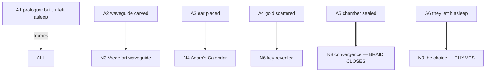

# Timeline — African Gold (two-layer chronology)

> Binding chronology anchor, **gate-enforced** by `storygraph/timeline2.py`. This book runs **two
> chronologies at once** (Architecture §7.3): the present-day quest clock and the ancient-layer
> chronology — plus the **fusion points** where an ancient fragment pays off a present beat. The
> gate checks: the present clock is monotonic and consistent with `WORLD.md` distances/travel;
> every ancient fragment is anchored and *lands* on a present beat (no orphan flashback); and the
> braid **closes** in Act III (the promised fusion is delivered).

---

## LAYER P — the present-day quest clock

Present day (continuous with the trilogy's "now" — a few years after *RESONANCE*; concurrent-with-
or-just-after *Sacred Shadows*). The relay is **fast** — the whole quest runs over roughly **10–18
days**, propelled by forced handoffs. The clock must respect real travel (KZN → Witwatersrand →
Vredefort → Mpumalanga → up-Africa → Egypt).

| T (day) | Beat | Place | Node |
|---|---|---|---|
| T0 | The crumb arrives; Priya can't un-see it | Durban / KZN | N1 |
| T0–T2 | Provenance chase; first watchers | KZN | N1 |
| T2–T4 | The descent; Arin enters; near-miss | Witwatersrand mine | N2 |
| T4 | Marker forces Vredefort *(end Act I)* | — | — |
| T4–T6 | The waveguide; vitrified tunnel pays off | Vredefort | N3 |
| T6–T8 | The instrument's ear; Leila enters | Adam's Calendar (Mpumalanga) | N4 |
| T8–T11 | Inheritance leg; decoy→key flip begins | Great Zimbabwe / up-Africa | N5 |
| T11–T13 | The key revealed; midpoint reframe; flip completes | Aksum / Brotherhood seat | N6 |
| T13 | Assembled key forces Egypt *(end Act II)* | — | — |
| T13–T15 | The drowned threshold; near-drowning | Egypt / flooded Nile dam | N7 |
| T15–T17 | The machine made whole; reveal; **braid fuses** | the coupling chamber | N8 |
| T17 | The choice becomes imminent *(end Act III)* | — | — |
| T17–T18 | Consent vs. control; the price paid | the switch | N9 |
| T18+ | Resolution; the allies part | — | — |
| later | Epilogue — reverse-payoff seeds | — | — |

> **Gate rule (Layer P):** monotonic days; no place visited at two incompatible times; travel
> legs must fit real distances per `WORLD.md`. A jump that outruns physics (KZN→Egypt in a day
> with no in-world justification) is flagged.

---

## LAYER A — the ancient-layer chronology

Deep antiquity — the Builders (MYTHOS_RULES Rule 1), tens of thousands of years before dynastic
Egypt. Delivered as a **prologue + thin interstitial fragments** beneath the present relay. Each
fragment is short, cold, distant, **without names we know**, and shows a piece of the machine being
**built / tuned / left asleep** — the strand that fuses with the present in Act III.

| A-seq | Fragment | Lands on (present beat) | Fusion |
|---|---|---|---|
| A1 | PROLOGUE — gold sung into stone; a resonator brought to tune; *left asleep* | Frames the whole book | — |
| A2 | The bore made smooth (the waveguide carved) | Vredefort waveguide (N3) | partial |
| A3 | The ear placed (the resonator aligned) | Adam's Calendar (N4) | partial |
| A4 | The gold scattered on purpose (the key dispersed) | Brotherhood key revealed (N6) | partial |
| A5 | The coupling chamber sealed beneath the water that would come | The drowned chamber (N7–N8) | **closes** |
| A6 | The choice the Builders made — *to leave it asleep* | Priya's choice (N9) | **rhymes** |

> **Gate rule (Layer A):** every fragment must be **anchored** (placed in the manuscript) and must
> **land** on its present beat — no orphan flashback that pays off nothing. The **fusion closes**
> at N7–N8 (A5) and **rhymes** at N9 (A6): the Builders' act and Priya's act are the same act
> across time. If Act III ends without the braid closing, the gate fails (the blueprint's central
> promise undelivered).

---

## The braid (how the two layers fuse — Architecture §3.2, §7.3)

- **Surface (Layer P):** the propulsive quest-relay the newcomer reads as a cracking adventure.
- **Underneath (Layer A):** the ancient thread that recontextualises the surface and **fuses** in
  Act III, so the climax is not just "switch or don't" but "we are standing exactly where they
  stood, making exactly their choice." That fusion is the emotional engine of the capstone.

---

## Carry-over chronology (trilogy consistency — see CROSSBOOK_CRUMBS)

- *RESONANCE* events are **past** (a few years back): Priya's AugmenTech tenure, the calibration
  wound, Arin's tunnel, the Court/SAGE lineage's origin.
- *Sacred Shadows* events are **recent past / concurrent**: Leila's institute exists; the
  Brotherhood's gold economy is established; the book-2 gold thread is *ready to flip*.
- The ancient layer (A) is **shared trilogy deep-history** — the thing book 1's "resonance" and
  book 2's "gold" were both partial views of. The gate treats trilogy-time contradictions as
  errors (e.g. Priya younger than her RESONANCE age; Leila's institute not yet founded).
