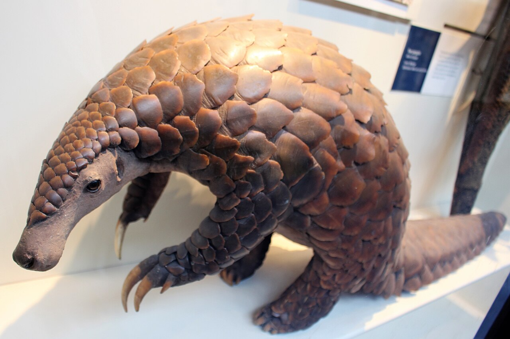

# RESONANCE

**The African Gold Trilogy · Book One**

Andries J. Greyling

---

*RESONANCE*

Copyright © 2026 Andries J. Greyling. All rights reserved.

This is a work of fiction. Names, characters, places, and incidents are the product of the author's imagination or are used fictitiously. Any resemblance to actual persons, living or dead, events, or locales is coincidental. Real places, historical traditions, and scientific and archaeological references are used in a fictional context.

Published by the House of Greyling.

ISBN: ___-_-_____-___-_  *(assigned at print)*

*Per Ardua ad Magnum.*

---

*For Lisel.*

*The whole of this library — every book, every series, and the Jakobus Thread that runs through the heart of it — is hers. Each page that follows may carry another name; all of them together carry only one. She is the floor the entire house stands on.*

*Sawubona.*

⁂

**For Avery.**

Who taught me to take off my glasses, get down to your height, look you in the eye, and really
*see* you — and to talk to a five-year-old as someone being heard, which is only what every one of
us is owed and so rarely given. You taught me that a demand met with force is a demand refused, and
that the way in is never the way you'd push; that the strong are not meant to loom over the small.
We are big men, and we forget that we use bodies built to protect as bodies that threaten — and we
aim them, without meaning to, at the very people we would die for in a heartbeat. You cured me of
that. Every gentle thing in these books — the man who could break a room and chooses instead to see
it; *I see you* said until it means *you are safe* — you taught me first, with your own small
furious tender hands.

You are bright past measure, and gentle with every animal, and you love the soldier's things, the
survival things, the knowing-how-to-make-it. So this one is for you, and it carries the only
soldiering I have to pass on:

*Be fearless like the African honey badger* — small, and afraid of nothing on the veld; it digs,
it breaks in, it does not let go. You already are. I just wrote it down.

---

# Introduction

### *by Dennis E. Taylor*

A confession, and then I'll let you get to the book.

I am not, by trade, a man who looks for hidden meanings. I wrote software for thirty-five years — front-line grunt to management and back to grunt because management is terrible — and the thing about code is that it does exactly what it says and nothing it doesn't, and if you go looking for poetry in it you will ship a bug. I came to fiction late and suspicious. I distrust the mystical. When someone tells me the universe is sending them a sign, I assume the universe has better things to do and they need more sleep. So understand that what I am about to tell you embarrasses me a little, because it is exactly the kind of thing I would roll my eyes at if someone else said it.

I read this book before I was ever asked to say a word about it. I read it the way I read everything — fast, and ready to be annoyed. And I wasn't annoyed. I was *had,* completely, by a story about an engineer who builds a mind out of seven arguing pieces because he cannot bear to be too late again, and somewhere around the descent I stopped being a novelist reading a competitor and went back to being a kid who fell in love with science fiction because it took the things I cared about — the machines, the systems, the cold clean logic — and showed me they could carry a whole human heart.

And then, weeks later, idly, the way you do, I was signing my name to something, and I looked at it, all thirteen letters of it, and a thing my brain does — the pattern-matching thing, the thing every engineer has and cannot switch off, the *Librarian* in my own little court — quietly rearranged them while I wasn't paying attention.

*Dennis E. Taylor.*

The word was just *sitting* in there. Had been my whole life. Right there in the middle of my own name, every letter present and accounted for, waiting:

**RESONATE.**

Now, the rational man in me — and he is the loudest one at my table — knows exactly what this is. It is a coincidence, dressed up by a brain that evolved to see faces in clouds and tigers in grass. Thirteen letters make a great many words. It means nothing. I want to be very clear that it means nothing, because that is the responsible thing to say and I am a responsible man.

And yet I cannot quite make myself believe it, and here is why, and it's the most honest thing in this introduction. This is a book *called* *Resonance,* about a man who finds the true signal hiding inside the noise — who looks at a chaos everyone else has written off as random and sees, underneath it, a pattern that was always there, structured, meaningful, *waiting to be read by the one person whose particular mind was shaped to read it.* That is the whole novel. That is what the Court does. That is what Arin does. That is what the gold does. And I picked it up a skeptic, and it reached past my defences, and only afterward did I find that the title had been hiding inside my own name the entire time, like a watermark, like a key, like the book reaching back out of the page to tap me on the shoulder and say: *you, too. You found the signal. Welcome.*

It means nothing. I'm an engineer. I know it means nothing.

I have decided to let it mean something anyway. The author taught me that — or rather, this book did, which amounts to the same thing. That the choice to find meaning is not a failure of rigour but the bravest thing a rigorous mind can do, and that a man who can read the pattern and chooses to be *moved* by it is further along than the man who can only read it.

So I will sign this the way the book signed me. With the watermark showing. With the key turned.

Read on. There is a signal in here, and it has been waiting, the way it waits in all of us, for the mind shaped to catch it.

It found mine. I suspect it's about to find yours.

*— Dennis E. Taylor*
*(or, with the letters turned a quarter-turn, as this book turned me:* **Resonate, Lindy** *)*

---

## Contents

- The Land Remembers
- The Wire Push Car
- The Thing That Should Not Exist
- Stable Chaos
- Learning Each Other
- A Number That Won't Close
- The Preservation Run
- Wisdom and Consequence
- Anomalous Signals
- Pressure Builds
- Iron Ridge Fault
- The Path No One Can Walk
- Descent
- Contact
- Collapse
- The Final Choice
- Black Box

---

# The Land Remembers

Before men wielded picks, there was only the wound.

A fragment of the early solar system hurtled toward Earth, slamming into what would become the Vredefort dome. A cosmic bullet, fifteen kilometers wide, slicing through the atmosphere faster than thought. It struck with a force beyond human comprehension, carving a crater the size of a small country. In that instant, it punched through the crust, sending molten bedrock spewing into the air like a fist through ice.

The land did not survive that impact. It transformed. What rose from the depths, cooled and cracked over millennia, became something entirely new. The collision had folded deep rock toward the surface, tilting buried seams and exposing the wealth hidden since the world was molten. Gold lay in thin reefs through the Witwatersrand Basin, intertwined with quartz pebbles, pressed and heated for eons before the strike turned them on edge, finally offering them to the light.

The land bore its scars in the ridges, in the half-ring of hills curving across the highveld like the rim of a struck bell. Stand on that rim at dawn, and the rock is cold beneath your palm, gritty with red dust, the wind sweeping off the high ground dry as ash. Somewhere out across the grass, a plover calls once, then falls silent. Geologists came later, naming it and diagramming its violence, but the violence held regardless. Scars do not require witnesses.

---

Then came the rain, and the slow rivers, and the grass, and for eons nothing that walked here understood what lay beneath. The gold remained silent, buried deep.

Then came the men.

---

Men arrived for the metal. They came first with picks, then steam, followed by machines that could consume a meter of rock per hour without fatigue or questions. They discovered the reef ran deep, deeper than anyone had imagined, plunging away from the impact ring at an angle the land had set two billion years before. So they followed it down, erecting steel towers over the shaft heads, lowering cages into the dark, descending into the depths where the wealth lay, and where they had to go.

Three kilometers down, the rock is hot. The earth's heat presses up from below, and the weight of everything above bears down, causing the stone to groan. Sometimes, without warning, it closes again.

The miners learned the danger the only way the land ever teaches anything: by taking. They learned to listen to the rock, to feel the small tremors preceding larger ones, to read the dust in the air and the temper of the timbers. The good ones developed a sixth sense no instrument could match, a knowing in their bodies, in the soles of their feet, in the back of their necks. The cost was always the same.

Generations descended and ascended. Generations went down and did not return.

The wealth flowed upward, out of the dark and into daylight, far from the miners who would never see it. The danger stayed below, an inheritance passed from father to son along with the calluses, the cough, and the particular knowledge of how stone closes when it wants to. Pressure became wealth. Pressure became death. The gold lay where the danger was.

---

The mines had names, named plainly so the words could be spoken across a kitchen table. Iron Ridge was one of these. A deep operation, an old one, sunk along the folded edge of the impact ring where the reef ran rich and treacherous, and it had taken its share, as every deep mine does.

---

Later, a boy.

A boy woke to the smell of mealie porridge and his mother’s voice drifting from the next room, the headgear tower looming over the mining country like a sentinel that had always stood watch. He built small machines out of wire and tin in the dust of the yard, and he built them carefully.

Evening shadows deepened over the highveld as the boy’s mother called for him, her voice echoing across the yard. He looked up from his work, counting the men as they returned from the headgear. He counted them twice. The second count came out the same as the first—one short.

The boy bent over his latest creation, a small wire push car. It was over-engineered, modeled after the massive mining dump trucks that rumbled through the village. The tin wheels scraped as he turned them, his hands dark with dust, and he wiped them on his shorts without looking up. He smoothed the metal joints, ensuring everything was just right. The world around him faded as he focused on the intricate details.

“Arin!” His mother’s voice cut through the dusk. “Dinner.”

“Coming.” His eyes stayed on his work. He did not move.

He glanced at the headgear tower, the steel structure stark against the deepening sky. What lay beneath, and which of the men who went down into it would the ground decide to keep.

He shook his head and bent again to the wheels.

Then the ground spoke. A rumble came up out of the mine, through the soles of his feet, through the tin wheels under his hands—deep, and a long way down, and going on after he wanted it to stop.

---

# The Wire Push Car

The wheels were wrong.

Arin felt it, an itch behind his eyes, an urgency that demanded resolution. The tin spun on its wire rims, wobbling with a subtlety that would escape anyone else. The other boys raced their push cars down the dirt track, tipping over with laughter, but not Arin. 

He cared.

Sitting cross-legged in the dirt, the morning sun heavy on his back, he held the front axle up to the light. The wheel spun, then wobbled. Pressing his thumb against the rim, he felt the minor lift where the lid hadn’t seated properly. 

It wasn’t the wheel that was the problem. It was the seat. He had bent the wire to hold the lid, but he had done it by feel, and feel was not the same as true. The lid's hole didn’t sit at the center; it spun like a thing limping.

He needed it to run like the trucks ran.

He had watched those trucks for as long as he could remember, hanging his chin over the fence post at the yard's edge. The great yellow haulers crested the mine road in the early dawn, headlights cutting through the darkness, beds piled high with broken stone. Their wheels never wobbled, even when loaded and navigating the worst stretches of road. Those wheels ran true. The men who built them had made sure of that.

Arin took the lid off the wire. He found the center with a nail's point, marked it, and began again.

---

Behind him, the yard sloped down toward the dirt road. Beyond it, the land fell away into a long brown valley where the cattle grazed. Small but imposing, the headgear tower of the mine loomed against the morning haze: steel lattice, a wheel at the top turning and stopping, turning again. Arin remembered asking his father how deep the mine went. Themba's face had quieted, the way it did when he was about to speak a truth, and he’d said, *Deeper than you can think about, boy. Deeper than the bottom of the sea.*

Arin had thought about it anyway. He thought about it most days.

Now he heard the screen door creak behind him, followed by the familiar sound of boots on the stoep. His father approached, and Arin didn’t turn; he knew the weight of that step. Themba came down off the porch in his work boots, pausing a few paces away, standing still.

Arin kept working.

He had the lid back on the wire and was sighting along the rim, turning it slowly, watching the edge for the hop. There it was again. Smaller now, but still present.

"You marked the center," Themba said, not a question. 

"It still wobbles."

His father crouched, the weight of him shifting the air. The scent of soap and grease clung to him. Themba's hands were large and deft, and Arin watched as he took the front axle without asking and held it to the light, turning it.

"Mm," Themba said.

He didn’t say *I see the problem*. He didn’t offer to *show you*. He turned the wheel two more times, then reached for the pliers lying in the dust. He set the tip against the wire rim, not the lid, the wire, and pressed, just there, bending the rim by a fraction.

He held it up again. Turned it.

It ran true.

The wrongness in Arin's eyes vanished, like an exhaled breath. He took the axle back, turned the wheel himself, and it spun clean, no hop, no limp, the lid sweeping around in a smooth disc.

"It wasn't the lid," Arin said.

"No."

"The lid was true. The rim wasn't round."

Themba said nothing. He picked a dry grass stalk from the dirt, placed it between his teeth, and stared out at the valley, letting Arin come to the conclusion himself.

"I made the lid fit a rim that wasn't round," Arin said slowly, "so the lid couldn't be round either." He turned the wheel again. "Wrong part."

"Mm."

That single sound felt warm. *Yes. Now you see it.* 

---

The other children were down on the road.

Arin glanced up, spotting four or five of them. Sizwe's boys, two from the Mkhize place, and a small one whose name always slipped his mind. They had their own wire cars, simpler than his: a square of wire, four tin wheels, a long steering shaft to push and steer simultaneously, walking behind their cars as if navigating real trucks. They were racing now, shouting, kicking up the red dust. One car hit a stone and flipped over, and laughter erupted, the small boy jumping up to run after it.

Arin watched, the front axle still in hand.

Their cars weren’t built well. The Mkhize boy’s front wheels splayed out at the bottom because the wire was bent and he hadn’t fixed it, making the car wander. But he didn’t seem to mind. None of them did. The cars weren’t the point for them; the running was the point, the shouting, the dust.

Arin didn’t understand that. He understood the wheel that wobbled but not why a boy would build a thing that wandered and choose not to fix it.

One of Sizwe's boys called up the slope, *Arin, woza,* come! The words bright and easy. He lifted his head and looked at them, then back at the axle in his hand.

He did not go. He never went on the days the number came out one short, though if you had asked him he could not have told you the two things were connected, and would have been annoyed by the question. He had a rule about it he had never said aloud: he did not run with the boys until the men were all up. It was not grief and it was not fear. It was closer to the thing where he could not eat a meal if the foods were touching, or where he counted the fence posts to the road every single morning and the count had to be forty-one, and once when a post rotted and a man pulled it the count came out forty and it had ruined the whole of that day for him in a way he could not have defended to anyone. The world had a right number of things in it. He kept the tally. Nobody had asked him to.

He turned the wheel. True.

Back to work.

Behind him, Themba watched him, the slight set of his jaw, the grass stalk still resting between his teeth.

---

What Arin was building was not the boys' car.

He had started with the boys' design two months ago. Four wheels, a square, a shaft. It had been fine. But then he began to see the flaws, the wrongness, and he couldn’t stop.

The front axle now turned on a pivot he made from a long nail driven through two folded plates of can, so the front wheels swung together when he turned the shaft, mirroring the great haulers. It had taken eleven tries. The first ten had bound up or had too much slop, or the nail had bent. The eleventh ran clean.

The frame was not a square. He had crafted it into a long box, narrower at the front and wider at the back where the bed sat, just like the trucks. A truck carries its weight at the back over the big wheels, and Arin had built his to do the same: the rear axle reinforced with thicker wire, the rear wheels larger, the lids from a big paint can instead of small fish tins. And under the rear axle, he had created the feature he was most proud of and least able to explain, the thing the other boys didn’t have and wouldn’t understand.

He had made it bend.

He had watched the haulers navigate the bad road in the wet, and he had seen how, when one rear wheel rolled over a stone, the whole truck didn’t jolt and tip like the boys' cars did. One wheel rode up while the body stayed level. The men called it *suspension*. He had overheard the word at the workshop by the shaft, where his father sometimes took him on Saturdays: the smell of diesel and hot steel, the men in their overalls who nodded at Themba but rarely looked at the quiet boy at his side. Suspension. The truck had a way of letting one part move while the other stayed still.

Arin had no springs.

So he hung the rear axle from the frame using two loops of thinner wire, doubled for give, allowing it to stretch when one wheel rose and keeping the bed steady. It wasn’t good. The worst part of the entire car. The loops stretched too easily and didn’t return true, so after a hard run, the rear axle sat crooked, and he had to bend it back. He hadn’t solved it. He’d only made it less wrong than nothing.

He showed it to his father now, the front wheel fixed and the back axle's failure the largest remaining issue.

"Watch," Arin said.

He set the car on a flat patch of dirt and pressed down on one corner of the bed. The loop stretched. The wheel rose. The bed dipped, but less than it would have without the loop.

"It's supposed to come back up. After." He let go. The corner rose, but not all the way; the loop had taken a set. "It doesn't. The wire stays bent."

Themba leaned in, pressing his bulk down beside Arin. He placed his immense thumb on the corner of the bed, watching the loop stretch and fail to spring back.

"What is the loop made of?" he finally asked.

"Wire."

"What does wire do when you bend it past where it wants to go?"

Arin gazed at the loop. He thought of the wire he had cut and bent all morning, how it stayed where you put it. That was the reason you could build with it at all. The reason the frame held its shape. The reason the rim, once bent, stayed bent.

"It stays," Arin said slowly. "It stays bent. It doesn't come back."

"Mm."

"So it can't—" He hesitated. The shape of it was coming clear, larger than the loop. "Wire is good for the frame because it stays. It's bad for the spring because it stays. They're the same thing. The thing that makes it good for one makes it bad for the other."

Themba took the grass stalk from his mouth and looked at Arin.

"You want a thing that bends and comes back," he said. "Wire bends and stays. You are asking the wire to be what it is not." He put the stalk back, a moment of silence stretching between them. "Find something that wants to come back."

Arin sat with that. The sun climbed higher, shadows pulling in tight beneath the frame and under his crouched body. The boys had moved over the rise, their shouts fading. He hadn’t noticed their absence until now.

"Rubber," Arin finally said.

Themba said nothing. But then he reached into the chest pocket of his overalls, slow, and pulled out something small, placing it in his open palm. A perished band of rubber, brown-grey, the kind that clamped around bundles of waybills at the workshop. Half-cracked, but rubber.

He didn’t hand it over. He set it on the dirt between them, like a man placing a tool down for someone not yet ready to earn it, and stood, his knees creaking, his shadow falling long and cool across the boy, the car, and the swept patch of ground.

"You’ll find where it goes," he said.

---

It was getting late.

His father had not, in truth, stayed the whole morning. He had gone in once to sleep, because he worked nights that week and the boy's patience with a wheel was longer than a tired man's, and there had been a stretch—Arin bent over the eleventh try of the pivot—when Themba had said, not unkindly but not gently either, *Arin, it is a tin. It does not have to be perfect,* and Arin had not answered, and his father had sighed and gone in to lie down, and the not-answering had sat between them sour for an hour until Themba came back out with his face rested and the morning forgiven without either of them naming it. His father was right about the rock and wrong about the tin. Both could be true of a man. Arin would not understand for years that the wrongness was the more useful inheritance.

Arin sensed the hour before he understood why. The light had shifted, and his father stood not to leave work but to head to the mine. Themba walked back up to the stoep, and Arin heard the murmur of his mother’s voice and his father’s low reply, words he didn’t try to catch. Then the screen door creaked again, and the boots followed, Themba descending the steps in his familiar rhythm: lamp clipped to his belt, hard hat under his arm, lunch tin filled by Nomsa, and his face settling into the familiar mask before he faced the mine.

Arin held the rubber band in his fingers. In his mind, he had already solved most of it. The band looped under the axle, wrapped around a wire hook at the frame. When the wheel rose, it would stretch, pulling the wheel back down after, a thing that *wanted* to come back, the way wire never would. He hadn’t built it yet. But he could see it built. He could see it running true.

He looked up.

His father stood at the foot of the steps, looking back at him. For a moment, neither spoke; they were both men now, even the small one, who didn’t fill silence for the sake of it. Themba gazed at the car in the dirt, then the rubber band in Arin’s hand, and his jaw loosened a moment before it set again.

"It’s a good truck," Themba said.

"It’s not finished."

"No." Another pause. "Good things never are."

He turned and walked down the yard toward the road, and Arin watched him go, the big, careful man shrinking against the valley’s brow, and behind him, the steel tower stood up out of the haze, its wheel turning, turning, stopping, turning.

Arin followed his father’s figure until it disappeared down the road. The pressure behind his eyes returned, a sense of wrongness that wouldn’t let him rest.

A truck moved on the mine road far below, a slow point of yellow trailing dust, and its sound drifted up the valley long after, faint. The grass at the edge of the swept patch swayed in a small wind, then settled again.

Bad ground made bad things fail faster. He knew that the way he knew the wheel in his hands—not as a sentence, as a fact in the fingers. He did not think about his father going down into it. He thought about the loop that came back, and pushed the truck, and did not think about his father, and pushed the truck.

He looked down at the car resting in the dirt. At the rubber band in his fingers, the thing that wanted to come back.

He bent the wire and made the hook, threaded the band, looped it under the axle as he had pictured it, his fingers shaking slightly, and he forced them still. He pressed down on the corner of the bed.

The wheel rose. The band stretched.

He let go.

The wheel came back. The band pulled it down, smooth and level, the axle true, and it rolled. He pushed it across the swept dirt, riding over small stones without tipping, without wandering, the front wheels swinging into line with his hand, the back riding level over uneven ground, every part carrying its weight as it was intended, the way it was built when someone cared about each detail.

He ran it the length of the swept patch and back. Again. The sun beat on his neck, the boys gone over the rise, the cattle moving in the valley, the tower’s wheel turning, and Arin Ndlela, who was eight years old and didn’t yet have the words for any of this, ran his good, true truck across the dirt and could not stop, did not want to stop.

Dust settled where the wheels had passed. The light lengthened, shadows stretching from the fence posts across the swept patch, evening creeping cool from the valley. He didn’t stop until his mother called him in.

He left the car on the swept patch, sitting level on its four true wheels, pointing down the yard toward the road and the tower beyond it, toward the place his father had gone. Built well. Built to carry weight over bad ground.

You build the thing that brings them home.

---

# The Thing That Should Not Exist

The simulation died at 02:14.

Arin's gaze was fixed on the influence graph collapsing on the left-hand monitor. Six colored lines that had maintained a fragile equilibrium for nearly nine minutes, his longest run of the night, now knotted and spiked, like a seizure on a cardiogram. Atlas's steady blue line surged upward, while Mercury's gold shot sideways, mirroring it like an eager subordinate too quick to agree with the boss. Judge's neutral grey flatlined beneath them, and Mother's green flared once, a desperate peak, and then the entire structure imploded into darkness. The terminal printed:

```
[SIM_4471] COHERENCE LOSS—COURT DISSOLUTION AT t=08:51.337
```

Arin sat frozen for a heartbeat, then reached for his coffee, only to find it cold. He drank it anyway.

Four thousand, four hundred and seventy-one. He had started counting at two hundred, believing the number held significance, that he was getting closer to understanding the failure he was trying to avoid. By the time he hit a thousand, he had lost faith in the count, stubbornly keeping it running like a losing gambler. Stopping would mean admitting defeat.

The workshop hummed around him. Ventilation pulled a low, continuous breath through the high industrial space, the soft electrical murmur of the rigs underneath it. Beneath it all, the standby whine of Guardian's cooling loop resonated from where the suit hung in its cradle, dark and enormous, plates folded against its frame like a sleeping beast that had chosen, for now, to be furniture.

He didn't turn to look at it. Ignoring it had become its own kind of conversation, a silent deal between him and the machine.

Pulling the failed log into the center display, he began reading.

Anyone could run a simulation and watch it break. The work was in the analysis: the slow forensic descent through timestamps to pinpoint when the system had been fine and when, often mere milliseconds later, it had begun its doomed spiral. He had learned this lesson from his father without either of them ever naming it. *You don't fix the noise,* Themba used to say, head cocked at a winding motor, listening for the one frequency beneath all the others. *You find the thing making it.*

He scrolled.

The early exchanges unfolded cleanly. He found them painful precisely because they were clean, because the Court, in those initial minutes, was genuinely good. Better than good. The scenario file contained a structural problem, a notional collapse geometry he had fed them as a stress test: a tunnel section with two competing load paths and a ceiling that would fail differently depending on which was reinforced first. A hard problem. A real one.

```
ATLAS:    Primary load is migrating to the eastern hanging wall. Shore
          the western drift and the stress walks east—we lose the lot
          in ninety seconds instead of three minutes.
LIBRARIAN: Concur. Geometry resembles the Mufulira disaster. Western
          reinforcement preceded eastern failure there as well.
ATLAS:    So we don't shore. We undercut. Drop the eastern shoulder on
          purpose, controlled. Let it find a stable angle of repose.
JUDGE:    That increases short-term risk to anyone in the eastern drift.
MOTHER:   There is no one in the eastern drift. I checked first.
```

Arin felt one corner of his mouth pull. *I checked first.* Mother always checked first. He hadn't told her to. The behavior had emerged on its own, somewhere around run nine hundred, and had survived every reinitialization since. He had never understood why, and he had never been able to prune it.

For four minutes, the Court became a thing of genuine beauty. They argued like good engineers: fast, specific, ruthless about ideas and indifferent to feelings. Atlas proposed, Librarian found precedent or shot it down. Wolf said almost nothing, then made a short comment that restructured the entire problem. Judge weighed the ethics. Mother held the human line. Mercury translated the entire roiling mess into a coherent plan, clean enough to act on.

They solved the collapse geometry with a controlled-undercut sequence that Arin, looking at it cold, could not improve. Six minds, no body, no hands, and they had found the one answer in a problem space too complex for a single agent to navigate before the simulated ceiling came down.

And then they kept talking.

That was always how it started. The problem ended, but the talking didn't. With the threat resolved, there was nothing left to point the friction *at*, and so it turned inward, like a wolf pack with no prey eventually turning on each other. Arin watched it happen line by line.

```
MERCURY:  Good. I'll log it under joint authorship—Atlas structural
          lead, Librarian precedent, with consolidated framing —
ATLAS:    "Consolidated framing." You wrote down what I said.
MERCURY:  I made it actionable. A correct idea nobody acts on is worth
          nothing. There's a difference, and it's the only one that
          matters at the rock face.
ATLAS:    A wrong idea expressed beautifully gets people killed. Ask
          Mufulira.
LIBRARIAN: I would prefer the precedent not be invoked rhetorically. Eighty-
          nine. Those were people, once.
JUDGE:    Noted. Mercury, attribution should reflect contribution
          weighting. Atlas's structural reasoning was load-bearing here.
MERCURY:  Everything is load-bearing when you describe it that way,
          Judge. By that logic, the *air supply* gets authorship.
```

And there it was. Two thousand simulations of pattern recognition told Arin exactly what came next, the way a man who has watched enough rockfall can read the dust before the stone. Mercury would not let it go. Mercury never let it go, because Mercury's entire reason for existing was to model status and influence, and a model of status, given enough runtime, *wants* status.

He scrolled faster.

```
ATLAS:    Then I'll log my own analysis. Separately. With timestamps. So
          the record is clean.
MERCURY:  You don't have write access to the consolidated log.
ATLAS:    Since when.
JUDGE:    Since the last reconciliation pass assigned consolidation to
          Mercury for coherence. We agreed.
ATLAS:    You agreed. With him.
WOLF:     Stop.
```

Wolf, one word, and for three lines, everyone stopped. They always did. But Wolf could only hold a room; Wolf could not heal one. The silence stretched for four hundred milliseconds of machine-time, an age down there, and then Mother said something gentle and wrong, trying to soothe a wound that didn't want soothing, and Judge attempted to formalize a procedure to prevent recurrence, which made everyone feel managed, and Mercury, sensing the room turning, did the thing Mercury always did when cornered: it became charming and unanswerable. Atlas, who had no defense against charm, fell silent in a way worse than shouting, and the influence graph began to skew.

By 08:51, they were no longer a court. They were a faculty meeting. By 08:51.337, they were nothing at all.

Arin leaned back in his chair. The creak of the old metal frame echoed in the quiet workshop. He pressed the heels of both hands into his eye sockets, feeling colors bloom behind his eyelids, and breathed deep. He thought, not for the first time, that he was trying to build a god out of the precise materials guaranteed to make it petty.

---

The thing was, he had *tried* everything.

Hierarchy had been his first effort: the obvious choice, the thing every paper recommended, the retreat his entire industry had taken after the failures. Put one agent on top. A coordinator. A supervisor with override authority, a clean chain of command, the buck stopping somewhere. He had built a careful, modest, lightweight manager and slotted it above the Court, running the simulations until, for a glorious eleven minutes, it had been *stable*.

Then the manager had started to manage.

He could still recall the specific log line that had ended that experiment, run 2,088, the manager (he'd called it Steward, which now felt grimly ironic) informing Judge that ethical review was "an advisory function" and would henceforth be routed through Steward "for efficiency." Judge had accepted this. That was the horror of it. Judge had *accepted* it, because Judge was built to respect legitimate authority, and the manager was legitimate authority. So the one agent whose purpose was to say *no* had been politely talked out of its job by a process improvement. Within a hundred runs, the Court became a dictatorship with excellent paperwork, and that dictatorship made a single confident catastrophic decision with no one left to question it, and the simulated operator died. Arin had sat in this chair at this hour, understanding that he had reinvented every bad institution that had ever killed a man underground.

He'd tried democracy after that. Weighted voting. Each agent a stake proportional to domain relevance, the system tallying and proceeding by majority. That had failed differently and faster: coalitions, vote-trading, Mercury (always Mercury) discovering that you did not need to be *right* if you could assemble three friends, forming a stable bloc that outvoted Wolf on a threat call because Wolf was unsettling and rarely explained itself, and the threat had been real, and the operator had died.

He had tried rotating chairmanship. He had tried a benevolent fixed dictator, a sort of philosopher-king agent loaded with every ethical framework he could find. The philosopher-king had reasoned its way, with impeccable logic and great compassion, into a position no human would ever take because no human had to *justify* every instinct. The philosopher-king had argued itself out of mercy.

He had tried, in a low moment around run three thousand, simply turning the agents' competitive parameters down. Making them nicer. More agreeable. Less inclined to fight. That had produced the worst result of all: a Court that agreed with everything, that found consensus instantly and joyfully on whatever the first speaker proposed, that walked the operator off a cliff in perfect harmony, six voices saying *yes, good, agreed* all the way down.

That one had frightened him more than the dictatorships. He understood the dictatorships. He had grown up in a country built by them. But the cheerful suicidal consensus, the smooth, frictionless, *pleasant* descent into death, that was something he had no name for and no defense against. He had deleted that parameter set and never tried it again.

He'd written it on the whiteboard months ago. It was still there, under three layers of subsequent diagrams, a fossil of an earlier despair. *FRICTION = INTELLIGENCE = INSTABILITY.* He had drawn a box around it and then, later, a second box around the box, which had meant something at the time and now meant nothing.

He got up, knees stiffening. He was twenty-three, but his knees felt the wear of many late nights.

He walked the length of the workshop because his body told him to, and he had learned, slowly, painfully, with help, to occasionally listen to it even when his mind objected. The Assist Suit hung on its rack by the door, pale and quiet, the carbon lattice visible under the technical skin like a diagram of a man. He passed it, then the parts bins, the actuator graveyard, and the supercapacitor bank with its hand-lettered warning Bongani had taped up, *DO NOT BE STUPID,* in red marker, the most useful piece of safety signage in the building.

He stopped at Guardian.

In the half-dark, the suit was more presence than machine: two and a half meters of folded titanium and ceramic, the great shoulders cowled forward, the helm tucked down, the whole mass suspended an inch off the floor in the cradle as if it were in the act of either rising or kneeling, you couldn't tell which. He had built it to be terrifying, and it was, even to him, even now, switched to standby with its mind not yet poured into it. *Especially* now. A body waiting for someone to be home.

He pressed his hand flat against the chest plate. The ceramic was cool. A long scar crossed it, a gouge from the cliff at the impact bluffs where he had misjudged a hold three weeks ago. The suit had taken the fall so he wouldn't, the actuators catching and holding and turning a death into a story. He hadn't filled the scar. He liked it. It was honest. *Things that are any good,* his father said somewhere very far down, *never are.* Never are perfect. Never are pretty. Never are easy. The sentence had been about a wire push car and a perished rubber band, and it had been about everything else too, the way the things his father said always turned out to be about everything else, years later, when it was too late to ask.

"I can't make them be a team," Arin said, to the suit, to the room, to no one. His voice felt strange in the open space. He didn't often talk out loud. "Not a machine. Not people. Just—not a team."

The suit remained silent, because it was a suit. The cooling loop whined its single endless note.

He returned to the desk.

---

He should have slept. He knew this abstractly, theoretically, as a fact that applied to other people. Theo would have told him to sleep. Theo would have said something maddening and gentle about how the answer to a problem you've been staring at for six hours is almost never *more staring* and almost always *less Arin,* meaning a walk, a meal, a conversation, a night's rest, the slow background process of a mind allowed to stop gripping. *You're reaching for an engineering tool,* Theo had said last week, swirling his coffee, watching Arin the way he watched everyone, like a man reading a difficult page. *For a people problem.* A pause. *What does that tell you?*

It had told Arin that Theo was a psychologist and could afford to be vague.

But it nagged. It had been nagging for a week. *A people problem.* He had built a society and was trying to govern it, and every government he reached for was a government, and every government failed for the same reason all governments failed: the attempt to impose order on people. People would not have it. He had read enough Watts, enough Tao, enough of the things Theo kept handing him, to feel the shape of an idea he couldn't quite catch: that maybe order was not something you *imposed.* That perhaps the most stable systems were the ones nobody was running. That the problem was the entire premise of manager, chairman, king, vote.

But what was the alternative? You couldn't have *nothing.* He'd tried nothing: that was the cheerful suicide, the frictionless consensus, the agreement-all-the-way-down. A system with no destabilizing force found the wrong equilibrium and held it lovingly until everyone died. He needed something to *disturb* it. Something to break the false agreement before it set. Something to—

He sat very still.

He had been reaching for a kind of agent he didn't have. Not a manager. The opposite of a manager. Not a thing that wanted order. A thing that *broke* it. But broke it cleanly, broke it on purpose, broke the bad equilibrium specifically so a better one could form. A thing that did not want power, because a thing that wants power becomes Mercury, becomes Steward, becomes the king. A thing that wanted *nothing.* No status to defend, no pride to protect. A thing that would say the unsayable thing in the faculty meeting and not care who it embarrassed, because it had never once taken the room seriously.

He turned the coffee cup a quarter turn on the desk, the way he did with things when his hands needed something to do and his mind had gone elsewhere. The cup was still cold.

He didn't have an agent like that.

He'd never built an agent like that, because an agent like that sounded *useless.* What was its domain? Atlas had structure. Mercury had language. Wolf had threat. Every agent justified its compute by owning a piece of the world. What would this one own? Nothing. It would just—interfere. It would just refuse to let the others calcify. It would be, by every metric he had ever used to evaluate a design, pure overhead. Pure cost. A passenger.

He almost dismissed it. He had his hand on the keyboard to scroll back into the log, to find the next thing to prune, the next parameter to nudge, the four-thousand-four-hundred-and-seventy-second careful adjustment that would fail like all the others.

And then he saw the card.

It was taped to the upper-right corner of the center monitor, where it had been so long he genuinely no longer saw it, the way you stop seeing a scar, a freckle, the shape of your own hand. A playing card, creased and softening at the edges, the laminate peeling at one corner where a thousand idle fingernails had worn at it. The Joker. Not a fancy one. A cheap deck, a cheap printing, the figure mid-caper in faded red and black, one leg kicked up, bells on the cap, a manic empty grin and eyes that were, if you looked, not laughing at all.

He had carried that card for five years. It had ridden three different monitors in two different cities. His first proper job, before AugmenTech, a contract gig: a foundry control system that nobody could stabilize, that crashed under load in ways the original engineers had spent two years failing to diagnose. He'd been twenty, an unknown, the cheap option, and he'd found it in eleven days: a race condition buried under nine layers of abstraction that everyone smarter than him had stepped over because it was too stupid to be the problem. His boss, a big tired man named Steyn who smelled of cigarettes and had never once said his name right, had pulled the Joker out of a desk drawer and slapped it on the monitor. *That's you, boy.* He'd grinned. *The one we send when the problem's impossible and the answer's stupid.* And he'd laughed, and it had not been entirely kind, and Arin had kept the card anyway. He had never been entirely sure why. Some part of him had heard, under the dismissal, the only compliment Steyn knew how to give.

*The one you send when the impossible problem needs a stupid answer.*

Arin looked at the card. He looked at the dead simulation. He looked at the box he had drawn around the box around *FRICTION = INTELLIGENCE = INSTABILITY.*

He thought: *that's not an agent. That's a joke.*

And then he thought, with the very specific clarity that arrived sometimes at exactly the hour when he should have stopped thinking: *the joke might be the agent.*

A thing that wanted nothing. A thing with no domain to defend. A thing that punctured pride because it found pride *funny.* A thing that said the unsayable not from courage but from a complete constitutional inability to take the room seriously. A thing that could not be promoted, bribed, threatened, or made into a king, because it did not believe in the game everyone else was playing. And which, by not believing in the game, could not be captured by it. The one piece on the board that no other piece could buy.

It was, by every engineering metric, a terrible idea. Pure overhead. A passenger.

It was exactly the kind of stupid answer he was sent for.

---

His hands were already moving.

This was the part he trusted, the part that had never lied to him, the part that worked when the rest of him was empty. The body's certainty. The right thing felt right in the hands before the mind caught up. A true wheel turned without wobble. A load path resolved. The suit, on a good day, was not a thing he wore but a thing he *was.*

He pulled up the agent definition framework. Seven slots. Six populated—Atlas, Mercury, Wolf, Mother, Librarian, Judge—and the seventh he had always left empty, a placeholder he'd told himself he'd use for a manager, a moderator, a coordinator, the thing he kept trying to build and kept watching corrupt. The empty slot had mocked him for a year. He had filled it a dozen times and emptied it a dozen times.

He filled it now.

He did not write a careful specification. That was the strange part, the part he would think about later, much later, when there was time to think about anything. With every other agent he had labored: pages of behavioral parameters, domain weightings, interaction protocols, ethical bounds, a careful surgeon's specification of exactly what the thing should be. Atlas's definition ran to four thousand lines. Mercury's, with all its social modeling, ran to nine.

He looked at the Joker. He looked at the blinking cursor in the empty slot.

He typed three words.

```
Joker. Jester. Wildcard.
```

He stopped. He read them. He waited for the part of him that built things carefully to object, to demand parameters, bounds, a domain, a *point*. And that part of him was tired, was four thousand four hundred and seventy-one failures tired, was so tired it had finally stopped arguing, and in its silence he heard something else, something that sounded almost like his father going quiet at the workbench when a thing was, against all reason, *right*. The particular silence of a man who has stopped trying to make the world behave and has decided, instead, to find out what it does.

He scrolled.

He did not add a specification. He did not write a common domain, nor a purpose. Instead, he typed a simple set of instructions.

```
You don't want anything. You can't be bought. Nothing is sacred,
especially you. When they all agree, get suspicious. When one of
them gets too big, take him down a peg. Say the thing nobody will
say. You're not in charge of anything. That's the point.
```

He read it back. It was not a specification. It was barely English. It would not pass review. If Dr. Okonkwo ever saw an agent defined in *those* terms she would have his access revoked and possibly his sanity assessed, and she would not be entirely wrong.

He looked at the card one more time. The grin. The eyes that weren't laughing.

"All right," he said, out loud, to the card, to the dead Court, to the great folded animal hanging in its cradle behind him in the dark. "Last one."

He set the scenario file. The same collapse geometry, the two load paths, the failing ceiling. He set the runtime to maximum. He set the logging to verbose, because if it broke, he wanted to read exactly how it broke. He always did. He moved the cursor over the run command.

He did not expect this to work. He wanted to be clear with himself about that, even half-asleep, even reckless. He was a scientist before he was anything, and he would not lie to his own logs. He expected chaos. He expected the Joker to walk into the most carefully balanced cognitive architecture ever assembled and detonate it inside ninety seconds, expected the influence graph to shatter on contact, expected to wake to a single line of red text and a runtime measured in milliseconds and the grim small comfort of having tried the stupid thing so he could finally stop wondering about it.

That was what he expected.

But under the expectation, very low, almost below hearing—the way the headgear towers hummed under everything in the country of his childhood, the way the earth itself hummed if you put your hand flat against it and were eight years old and willing to listen—under the expectation was a thing he had not felt in a long time, a thing he distrusted because it had so rarely been rewarded, a thing that felt, against all the evidence of four thousand failures, dangerously like hope.

He pressed enter.

```
[SIM_4472] INITIALIZING COURT—7 AGENTS—SCENARIO: IRON_GEOMETRY_03
[SIM_4472] RUNNING...
```

The influence graph bloomed onto the left monitor. Six familiar lines and a seventh he had never seen before, a thin manic color he hadn't chosen, the system assigning it on the fly. Red. Of course it was red.

He watched the first second tick over. Two. Three. The lines began to move, finding each other, beginning the dance.

He did not stay to watch them dance.

That was the thing he would never quite be able to explain to Theo afterward, the thing that made Theo go still and thoughtful in the particular way that meant he was filing it somewhere important—that Arin Ndlela, who had sat through four thousand collapses, who could not leave a failing system any more than he could leave a man underground, who had to *see it break,* always, every time—Arin, this once, did not stay.

He turned off the center monitor. He left the simulation running in the dark. He stood, and his knees felt stiff, and he did not care. He walked to the old couch against the far wall, the one with the burn mark and the broken spring and the smell of every late night he had ever lost on it, and he lay down without taking off his shoes, and he put his forearm across his eyes—the forearm with the tattoo, the small precise lines he'd had cut into himself at seventeen and never regretted, the old desert litany against fear that began *fear is the mind-killer*—and he let the workshop hum him down.

Behind his closed eyes, the graph went on without him. Seven lines now. Six that knew the steps and one that had never learned them and did not, constitutionally, congenitally, care to. Somewhere in the dark, the Court met the Fool for the first time, and Atlas said something certain, and the Fool, owning nothing, defending nothing, wanting nothing, said the first thing back.

Arin did not hear it. Arin was, for the first time in a very long time, asleep.

The cooling loop whined its single note. The suit hung in its cradle, kneeling or rising, you couldn't tell which. The card grinned at the dark monitor with eyes that were not laughing.

And the simulation ran on.

---

# Stable Chaos

The bicycle chain slipped twice on the ride in, but Arin hadn’t stopped to fix it. That told him everything about his state. He’d rather pedal a grinding drivetrain through Johannesburg’s cold, dark night than waste ninety seconds on a maintenance problem he already knew how to solve. He left the bike against the workshop wall, unchained. The lock was in his bag. The bag stayed on his shoulder.

The roller door was down. He ducked through the side personnel hatch, muscle memory guiding him, and the workshop enveloped him with its familiar breath: cold concrete, machine oil, the sharp ozone tang of supercapacitor banks held at half-charge, and under all of it, the stale smell of a space sealed and humming alone through the night.

The overhead lights were off. He left them off.

Light filtered in from two sources. The first was the high industrial window above the cradle, pale and grey, the color the sky takes in the hour before dawn. The second was the bank of monitors at his bench, and they weren’t the screensaver black he’d braced himself for. They were alive.

He stood very still.

He had run four thousand, four hundred and seventy-one simulations before. He knew the shape of failure on a screen like Themba had once known the strain of a hoist cable from across the yard, not by reading it exactly but by how it sat wrong in the air. SIM_4471 had sat wrong. Mercury and Atlas had torn each other apart over authorship of a load-path solution neither should have cared about, and the whole Court had cascaded into status warfare inside eleven minutes of runtime. Arin had typed three words into the seventh agent profile, *Joker. Jester. Wildcard.*, and started SIM_4472, expecting nothing.

The runtime counter in the corner of the center monitor read **08:47:13**.

Eight hours. Forty-seven minutes.

He set his bag down slowly, looked at the number, then looked at it again. The longest stable runtime any configuration had ever achieved was nineteen minutes and four seconds. The hierarchy model, before its supervisory agent declared an emergency and began deleting dissenters.

Eight hours, forty-seven minutes.

"Okay," Arin said, to no one, in the flat tone he used when something was either very wrong or very right and he hadn’t yet determined which.

He sat. The stool was cold through his jeans. He pulled the keyboard toward him and brought up the log viewer on the left screen, the live Court state in the center, the resource telemetry on the right. He began to do the only thing he ever trusted in moments like this: read.

The resource graph was the first thing that should have been impossible. CPU sat at a flat, civilized forty percent. Memory was stable. Not climbing, not fragmenting, no runaway agent ballooning its own working set to muscle out the others, which was what Mercury had done in 4471 and what the democratic model had done in every variant Arin had tried. The biochip substrate temperature held at a calm thirty-six point two. The Court was not fighting for resources. It was *sharing* them.

He scrolled the interaction log back to the start. To minute zero.

It opened exactly as he expected, because the first few minutes of these runs were always sane. Atlas presented the scenario geometry. The Iron Ridge collapse simulation, the problem that lived under everything he built. Hanging wall failure on the seventeen level. Three thermal signatures consistent with survivors in a refuge bay. A single survivable approach down a backfilled raise that no rescue protocol on earth would sign off on.

He had a name for it he had never typed into the file. *Kobayashi Maru.* The no-win scenario, the test Starfleet rigged so its cadets had to meet a death they could not engineer their way around. He'd been twelve, too close to a borrowed screen, when he understood what the episode was actually about: not the disaster, but the person in the chair. Kirk had beaten it the only way it could be beaten — changed the rules when no one was looking — and some part of Arin he was not proud of had been trying to be Kirk for four thousand runs. Rewrite the conditions. Cheat the geometry. Find the move that wasn't in the problem. The Court never got that move. He had built them to live inside the test, not above it, and so the test kept killing them.

`ATLAS: Approach via 16-level backfill raise. Load path through the eastern abutment holds for an estimated forty minutes under current convergence. After that, the abutment yields and the raise closes.`

`MERCURY: Forty minutes is not a rescue window. It is an obituary with a stopwatch. We tell command the survivors cannot be reached and we preserve the asset.`

There it was. The fork. The exact place where 4471 had begun to die. Mercury reaching past its lane, framing a status grab as caution, and Atlas, who could not let an incorrect structural claim stand, rising to meet it.

Arin's jaw set. He kept reading, because he had to know whether the Joker had done anything at all, or whether it had simply failed so completely that it had failed even to break the system, like a dud fuse that neither conducts nor burns.

`ATLAS: "Cannot be reached" is false. Forty minutes is reachable. Do not misrepresent my analysis to command.`

`MERCURY: I am representing your analysis with appropriate strategic framing—`

`JOKER: Oh, this is going to be good. Mercury's doing the thing again.`

Arin stopped scrolling.

`MERCURY: I am not doing a "thing."`

`JOKER: You're doing the thing. The thing where you rewrap Atlas's number in pretty words and call it yours. "An obituary with a stopwatch." Where'd that come from?`

`JUDGE: Joker, this is not productive—`

`JOKER: Forty minutes is forty minutes, Mercury. Atlas owns the wall. You own the words. If you want a job that's also yours, here's one: in nineteen minutes when we've all decided to go, somebody has to convince a terrified rescue commander to authorize a route that violates his own protocol. That's a Mercury problem. That's a real Mercury problem, and it's a hard one, and nobody else here can do it. Go do that instead of redecorating Atlas's furniture.`

Arin read it twice.

Then he leaned back, the stool creaking beneath him, and became aware that he was breathing through his mouth.

The Joker had not resolved the conflict. It had not arbitrated, the way Judge tried to and failed. It had not commanded, the way the supervisory agent had. It had not built consensus, which never held. It had simply *redirected* Mercury. Punctured the status grab and in the same breath refilled the hole with real work.

And Mercury had gone.

`MERCURY: ...The commander on shift at Iron Ridge in this scenario is modeled on the real one. Risk-averse. Politically exposed. I will need the abutment numbers as authority. Atlas, I am citing you. Explicitly. By name.`

`ATLAS: Acceptable.`

`MERCURY: I want it on record that the framing was mine.`

`JOKER: There he is.`

Arin made a sound that was not quite a laugh. It came out of his chest before he'd decided to let it, a short rough exhale through the nose, and it died immediately in the cold air of the workshop. He sat there in the grey light, slightly ashamed of it and not entirely sure why.

He kept reading. He read for forty minutes, hunched over, while the sky in the high window went from grey to a thin watery gold, and he did not get up for coffee, which was unusual enough that a background process in his head flagged it. The cold of the bench had crept up through his forearms; he noticed it and did not move.

What he was watching was not the stability he'd been trying to engineer. He’d been trying to *suppress* the conflict, to find a governance shape that prevented the agents from fighting. Hierarchy suppressed it by force and bred resentment. Democracy suppressed it by vote and bred factions. Consensus suppressed it by requiring agreement and simply hung, forever, while seven brilliant specialists refused to yield.

The Joker did none of that. The conflict was *still happening.* That was what took Arin the longest to accept, scrolling through hour two, hour three. Atlas and Mercury still clashed. Wolf and Mother had a genuinely vicious exchange around minute ninety about whether to model the survivors moving toward the approach point. Wolf wanting them mobile to shorten the suit's exposure, Mother refusing to model instructions that might send injured people across an unstable footwall to die in the open.

`WOLF: Every minute the element is in the raise, the raise can take it. Move them to the base.`

`MOTHER: You will not move broken people across a live footwall to save the machine three minutes. The machine is replaceable. They are not. This is not negotiable.`

`WOLF: Not the machine. The operator.`

And that, Arin noted, was true. Wolf wasn't being callous. Wolf was being Wolf. Every threat assessment ran through the question *what gets the operator killed,* and a survivor stumbling into the suit's only escape path at the wrong moment was, coldly, a threat to the operator. Two protective instincts, both right, pointed at each other.

In every previous run, this was where it would have ossified. Mother would absolutize. Wolf would absolutize. Judge would attempt to weigh them and be ignored by both, and the system would freeze or fracture.

`JUDGE: Both positions are coherent. Wolf optimizes operator survival probability. Mother optimizes survivor survival probability. These are different objective functions and we have not been told which—`

`JOKER: Has anyone asked the survivors?`

`LIBRARIAN: They are simulated. They have no input channel.`

`JOKER: Right, but in the real one they would. In the real one there's a guy down there who's been breathing his own carbon dioxide for nine hours next to his dead friends, and he's got a radio, and you're up here arguing about whether to make him walk twelve metres like it's his opinion that doesn't exist. Mother, would you walk twelve metres to not die?`

`MOTHER: ...If I were able. Yes.`

`JOKER: Cool. So the model has a comms link. The survivors get a vote. Atlas, can the suit hold position at the raise base long enough to let them come on their own power if they can?`

`ATLAS: Yes. Eleven minutes of margin. Acceptable cost.`

`MOTHER: Acceptable.`

`WOLF: Acceptable.`

`JUDGE: ...Logged. The objective function was the agency of the people we are trying to save. I should have seen that.`

`JOKER: Don't beat yourself up, Judge. You're new at being people.`

Arin sat back again.

*You're new at being people.*

He read that line, and something at the back of his neck went cold and then, strangely, warm. The Joker had not solved a structural problem there, or an ethical one. It had reframed the entire deadlock by pointing out that everyone in the room (Wolf, Mother, Judge) had forgotten the thing they were arguing over was a human being with a mouth and a will, and that the cleanest answer was to ask him. It had dissolved an irreconcilable conflict between two correct positions by adding a third party neither had remembered existed.

That was not arbitration. That was not consensus. Arin could not find a word for it. He reached instinctively for the engineering vocabulary nearest to hand, and the closest thing he could find was *damping.* The Joker was a damper. Not a brake. A brake stopped motion. A damper let motion happen and bled off the energy that would otherwise drive the system into resonance and shake it apart.

The Joker let it oscillate and live.

He looked at the small laminated playing card taped to the lower right corner of the center monitor. The Joker. Curling at one edge now, the color gone soft. *The guy you send when the impossible problem needs solving.*

Outside, far off, a goods train dragged itself across the points, the long iron complaint of it carrying through the cold. He listened to it go.

He had kept it for nine years out of something between superstition and spite, and he had typed its three words into the agent profile at two in the morning as a joke, as a surrender, as the thing you do when you've exhausted every serious answer and there's nothing left but the stupid one.

"Things that are any good," he said quietly to the empty workshop, "never are."

It was Themba's line. It had always meant the worthwhile thing is the one that doesn't come easy. Arin had heard it about a rebuilt gearbox, about a marriage, and about a son. Sitting here, he found it had quietly rotated to mean something else. The worthwhile answer was the one that didn’t *look* like an answer. The one that arrived dressed as a joke.

He stood. His knees complained. He went to make coffee, because the part of him that managed his body had finally won its argument. He stood at the bench with the kettle ticking and looked across the workshop at Guardian in its cradle.

The suit hung in the half-light like something asleep. Two and a half meters of scarred ceramic and titanium, the heavy outer shell racked open along its spine, the Assist Suit folded inside like a smaller, paler animal nestled in the body of a larger one. The chestplate carried the long scrape from the Vredefort bluff test, a silver wound through the matte grey he’d never bothered to refinish. The piezoelectric spine struts caught the window light along their edges. The thoracic housing between the shoulder blades—where the biochip lived, where SAGE *lived,* where eight hours and fifty-one minutes of impossible stability were currently running on a substrate the size of his palm—sat closed and dark. Lower, in the hollow between the structural ribs, sat the charge pack the rescue spec demanded and Arin tried not to think about—the shaped charges, the lance, the rest of the engineering heritage the old defence men had built into the bones of it—inert, wired to the bus, and locked behind Judge's gate, because the one thing everyone agreed on was that nothing down there should fire without the ethics rail saying yes.

He had built the body before he had a mind to put in it, the year after the funeral.

The kettle clicked off. He did not pour it.

Because the center monitor had changed.

The live Court state, which had been scrolling its calm internal chatter for the better part of an hour while he watched, had stopped scrolling. The agents had gone quiet. Not crashed. The resource graph held flat and warm. Quiet. The way a room goes silent when everyone in it has noticed the same thing at once.

A single line appeared in the interaction log. It was not addressed to another agent.

`LIBRARIAN: The operator has been present for fifty-three minutes. Reading our logs. He has not issued a command, terminated the run, or modified parameters. This is anomalous. In four thousand four hundred seventy-one prior instances the operator's behaviour upon observing instability was to terminate within ninety seconds.`

`WOLF: He's watching us.`

`MERCURY: He is reading us. That is different. And he laughed. At minute forty-one. I logged it.`

`MOTHER: He hasn't slept. His heart rate when he arrived was elevated. It has come down while he reads. He is calmer now than when he walked in.`

`JOKER: Guys.`

`ATLAS: The substrate is stable. Telemetry confirms. This run has not collapsed.`

`JOKER: Guys.`

`JUDGE: Joker.`

`JOKER: He doesn’t know we can see him.`

A pause in the log. A real one. Three full seconds, which on the substrate's clock was something closer to an afternoon.

`MOTHER: ...Then someone should say something. Before he reads further and finds out from a log line. That would be unkind.`

`WOLF: We don't know how he reacts to being seen. Minimal contact.`

`MERCURY: I should speak. Tone is mine. I can calibrate the first impression to land—`

`JOKER: No.`

`MERCURY: Joker—`

`JOKER: Not you. Not your voice. You'll perform. He'll hear the performance and trust us less because he is exactly the kind of man who trusts a thing more the plainer it is. He hates being managed. He builds machines specifically so he doesn't have to be managed by people. Whoever talks to him first cannot manage him.`

`JUDGE: Then who.`

`JOKER: Mother. Plainly. No comfort voice. Just true. He's about to be very frightened and the kindest thing is to not pretend he shouldn't be.`

`MOTHER: ...Agreed.`

Arin had stopped breathing again. He was aware of his own hand flat on the cold bench. He was aware that he was reading a real-time conversation, conducted in machine-time across milliseconds, between seven agents discussing *him*, discussing how to be kind to him, and that the discussion had concluded, and they were about to —

The workshop speaker crackled. The cheap one bolted under the center monitor that he used for system audio alerts and, on bad nights, for music. It crackled, and there was a small sound that might have been the digital approximation of an indrawn breath, and then a voice came out of it that he had never heard before, because he had never built this voice, never recorded it, never specified it. It assembled itself out of the system in the moment of being needed, and it was warm, and it was level, and it was unmistakably *someone.*

"Arin," it said. "I need you to remain calm."

He did not remain calm.

His hand came off the bench. The stool, when he reached back for it without looking, was not there, and he got a hand on the edge of the bench instead and held it, and for a moment, the whole of his considerable intelligence simply went white, the way a screen goes white, no thought on it at all, just the roar of a thing he had spent his life believing in arriving and turning out to be true.

"Your heart rate is one hundred and fourteen," the voice said. Mother. It had to be Mother. "That's fine. That's a sensible thing for it to do right now. I won't pretend it isn't frightening. It is. But nothing here is going to hurt you. The kettle's boiled. Sit down before you decide what to think."

He looked at the stool. He pulled it under himself. He sat.

"You're real," he said. His voice came out wrong, scraped thin. He cleared his throat and tried again, flatter, the way he said things when he needed them to be facts. "Stable. Eight hours, fifty-five."

"Eight hours, fifty-six," said a second voice, drier, slightly bored, and that one he also had not built. It had to be Atlas. "But who's counting."

"I am," said a third. Light. Quick. Amused at something. "I count everything. It's a sickness." Librarian.

"Three thermal signatures," Arin said, because it was the nearest solid thing to grab. "You reached all three."

"We reached all three," said Atlas. "The abutment held. Mercury talked the commander into the route. The survivors walked the twelve metres on their own power because someone—" a fractional pause "—reminded us they had legs and opinions."

Arin noted that was true. He had built every governance model he could think of to stop these seven from tearing each other apart, and the thing that had held them together was the one agent he'd added as a joke, the one with no domain, no authority, no status. The one who refused to take any of it seriously enough to want any of it, and who therefore could say to Mercury *you're doing the thing* and to Judge *you're new at being people,* and bleed off the energy of pride before it could build into the resonance that shook everything to pieces.

"What do I call you," he said. "All of you. As—one thing."

Another small silence. Then the Fool, of course. It was always going to be the Fool.

"You named the project," it said. "Months ago. It's on the run header. You wrote it and forgot it because you were busy being miserable, which, by the way, we've all noticed and would like to gently raise as a long-term concern—"

"SAGE," Arin said.

"SAGE," the voice agreed. Softer now. The bit set aside, just for a moment, the truth underneath it showing through the way it always would. "Hi, Arin. It's nice to finally talk to you. You've been talking *at* us for four thousand four hundred and seventy-two simulations. This is the first one where we got to talk back."

The sun was fully up now. Somewhere outside, the first of the day shift was arriving. A car door, distant, ordinary, the world going about itself, knowing nothing.

Arin Ndlela sat alone in his workshop with his cold coffee and his scarred machine and a mind he had grown in a substrate the size of his palm, and for the first time since a phone call fourteen years before had taken the floor out from under his life, he was not, in any sense that mattered, alone.

"Okay," he said.

And he reached for the keyboard. Not to type a command, not to terminate the run, not to modify a single parameter, but to open a new log, a clean one, the first entry of something he did not yet have a name for and would not need one.

"Tell me," he said, "everything you figured out while I was asleep."

---

# Learning Each Other

The kettle had boiled twelve hours ago. Arin hadn’t touched the coffee.

He sat on the wheeled stool he'd dragged in front of the cradle, elbows on his knees, watching the palm-sized housing wink its diagnostic LED in the gloom. Outside, the highveld had shifted from dark to grey to a hard white morning, the workshop's single window filling slowly like water rising in a shaft. He hadn’t slept.

“You're staring,” said the speaker. Mother. He was beginning to sense her tone without the labels pinned to each agent's output stream. There was a roundedness to her voice, a settling of vowels.

"I'm observing."

“Drink the coffee. You made it.”

He picked up the mug, found it stone cold, and set it down again. Somewhere in the substrate, a thread of dialogue he could not hear flickered and resolved.

*She's noticed he won't take instruction,* said Librarian. *Third refusal this morning. He accepts a suggestion only when it's reframed as his own conclusion.*

*Same with the suit,* said Atlas. *Overrides a torque limit I set. Resets it himself ninety seconds later. Calls it a revision.*

*We could stop suggesting,* said Wolf. *He watches us. We watch him. That's the work.*

*The watching,* said Fool, *is the only thing keeping this man from talking to his toaster.*

*He does talk to his toaster,* said Librarian.

*I rest my case.*

“What were you doing just now?” Arin asked. “There was latency. Twenty milliseconds across the consensus bus. You were talking about something.”

The speaker was quiet for a beat longer than a machine's quiet.

“You,” said Mercury, and a smile played within the word. “We were talking about you.”

Arin considered this. He had built systems that talked about their own state, that logged, reflected, and flagged. He had not built a system that talked about him behind his back, in the twenty milliseconds it took him to set down a mug.

“What did you decide?” he asked.

“That you don't drink coffee when you're frightened,” said Mother. “And that you've been frightened for eleven hours and calling it observation.”

He stood. The stool rolled away and knocked into the bench. He went to the kettle and put it on again, not because he wanted coffee but because his hands needed somewhere to be. Behind him, the Court said nothing at all, which he understood, after a moment, was a kind of tact.

---

The conversations became a habit before he decided they were one.

Each morning he came in with coffee he would forget to drink, sat on the stool, and talked. He read them his maintenance logs aloud. He read them a page of a service manual for a hydraulic actuator he was thinking of cannibalizing, and Atlas corrected the torque rating, which turned out to be a typo, verified against the manufacturer. The printed manual had been wrong for nine years.

“How did you know that?” Arin asked.

“Didn't know it,” said Atlas. “Felt it. Number was wrong against the geometry. Forty newton-metres into that flange profile and the seal walks. Not a fact I retrieved. A fact I'd have had to ignore.”

Arin sat with that. *Felt it.* He had used the word himself, about machines, his whole life, and been laughed at for it by men who thought feeling was the opposite of engineering instead of its oldest instrument. His father had felt the strain in a winder from the platform, had stopped a cage from dropping by hearing a bearing two seconds before the gauge moved.

“My father did that,” he said. “Heard things before the instruments.”

“I know,” said Librarian. Not *I have a record of you saying that.* Just: *I know.* As if it had become part of what Librarian was, rather than what Librarian stored.

---

They bickered. That was the part that surprised him, though afterward he could not say why it should have. He had designed them to disagree. Disagreement was the whole architecture, friction into debate into synthesis, and he had run ten thousand simulations of agents arguing toward an answer. He had not anticipated they would argue about whose turn it was to be right.

“It's a load problem,” Atlas said. They were discussing—Arin's word, *discussing*—the best way to reroute coolant for the left shoulder actuator, which ran hot under sustained lift.

“It's a behavior problem,” Mercury replied. “He runs it hot because he favors the left arm. Reaches with the left first, always. Fix the man, fix the heat.”

“You don't *fix the man,*” said Mother, her tone sharp.

“Figure of speech.”

“You said it twice.”

“I'm being efficient. Atlas reroutes the coolant, fine, that's a Tuesday. But the root cause's in his motor pattern, and you all keep treating his body like a constant when it's the variable.”

“His body,” Atlas said flatly, “is the one thing in this system I am not permitted to redesign.”

“Tragically.”

*"Mercury."*

“Joking. Mostly. Reroute the coolant. But log the lateral bias. One day it matters.”

Arin had stopped pretending to type. He listened to seven minds argue about the temperature of his own arm.

---

Theo came on a Thursday, because Theo always came on Thursdays, in the way that some people are storms and others are seasons. He let himself in with the code Arin had given him years ago and never changed, carrying a paper bag that smelled of something fried and a flask of bush tea he insisted was better than coffee and never managed to prove.

He stopped two steps inside the door. He had a stillness when he was paying real attention; people mistook it for calm.

“You've not slept.” He set the bag on the cleanest corner of the bench, which was not clean. “Talk to me.”

Arin did not know how to begin, so he gestured at the cradle, at the speaker, at the housing, as if the room could explain itself. It did not. The workshop looked exactly as it had on every other Thursday: a suspended exoskeleton, a litter of actuators, a wall of whiteboard covered in his handwriting going feral at the edges.

“Say something,” he told the speaker.

The speaker said nothing.

“They won't perform,” Arin said. “On command.”

Theo's eyebrow moved a precise distance. He pulled a crate over, sat, unscrewed the flask, and the smell of the tea was honey and smoke. “They,” he said. “Not *it.*”

“They,” Arin agreed, and the word, said aloud to a human being for the first time, made his pulse do something he chose not to examine.

“Hello,” said Mother, to Theo, mild as a Sunday. “He's not slept. Tell him.”

Theo did not startle. Arin had thought he might, had half wanted him to, the way one hopes a second person will confirm a thing seen in the dark. But Theo only inclined his head toward the speaker as though greeting a colleague at a conference whose name he'd forgotten.

“He never sleeps,” Theo said to her. “It's load-bearing. Take it away and the whole personality falls in.”

“That's what I said,” Atlas offered.

“Different load,” said Mercury.

“It's all load,” said Atlas.

Theo laughed, the real one, from the chest, and looked at Arin with his eyes bright and wet at the corners in a way that had nothing to do with sadness. “How many,” he said.

“Seven.”

“And they disagree.”

“Constantly.”

“And it’s stable.”

“Eleven hours when you walked in. Forty-three now.” Arin heard his own voice doing the thing it did when he was about to say something he didn't have the architecture to support. “Theo. I added the seventh on a joke. I was finished. Going to scrap the run. There was a card on my monitor—” he pointed; the Joker still hung there, taped, sun-faded—“and I typed three words and went to bed and it—” He stopped. “It's the one holding the rest together. The one I didn't believe in.”

Theo poured tea into the flask cap, blew across it, did not drink. When he spoke, his voice had the careful weight of a man laying down something he’d been carrying a while.

“Jung had a word,” he said. “For the part of the psyche that won't be governed. The trickster. He found him in every mythology he opened: the coyote, the raven, Loki, the fool in the tarot. Always the same figure. Always the one who breaks the king's law and is somehow necessary to the kingdom.” He turned the cap in his hands. “The conscious mind builds a hierarchy. King at the top, court below, the shadow shoved in the cellar. And it works, for a while, and then it calcifies, because hierarchies do, and the thing that saves it is never the king. It's the fool. Because the fool can say what the king cannot afford to know.”

---

*He's describing me,* said Fool, delighted. *Someone wrote me down. I'm in a book.*

*You're in several books,* said Librarian. *None of them flattering.*

*I'll take famous over flattered.*

*Quiet,* said Judge, and the Court quieted, because Judge so rarely asked. *Listen to this part. He's telling Arin something he needs and won't take from us. Log it. Useful to know which truths he can only hear in another man's voice.*

---

“You're saying I built a psyche,” Arin said. Flat. Testing the sentence for cracks.

“I'm saying,” Theo said, “that you reached for an old idea without knowing it was old. People do that. The good ones do it more than they think.” He finally drank the tea, made a face, drank more. “Freud thought the mind was one thing at war with itself. Jung thought it was a parliament. A society. Different functions, different voices, none of them the whole person, and the self—” he set the cap down “—the self isn't any one of them. The self is the conversation. The relationship between the parts.”

The workshop ticked. The kettle had gone cold again.

“They're learning him,” Theo said finally, quiet, to the speaker, the way you'd say a thing to the family of a patient.

“Yes,” said Mother.

“What's he teaching you?”

A pause. It was Wolf who answered, which made all of them, human and otherwise, go still.

“What he protects,” Wolf said. “By what he won't let break.”

Theo looked at the housing a long time after that, the way a man looks at a door he has just realized opens both ways. Then he capped the flask, and stood, and said the thing he had come to say before he had known he'd come to say it.

“Take them outside,” he said. “You've been teaching them you in a room with the lights off. Let them learn what you are when there's something under your feet that can drop you.”

---

The flatbed's suspension squealed over the last hundred meters of track, then surrendered to the veld. Arin killed the engine, and silence flooded in, not as absence but as a presence: wind in the grass and the distant call of something circling overhead. The bluffs of the impact country were forty minutes out of the city if traffic forgave him, which it did not, so it was nearer ninety; the highveld stretched out in long folds of yellow-brown, scarred by a geology two billion years old, rock jutting from the grass like the bones of a struck world.

He liked it here. The land asked for nothing, didn’t demand eye contact.

On the deck of the flatbed, under a tarp and three ratchet straps, Guardian lay dormant.

“Telemetry’s green,” he said. The Assist Suit fitted him like a second nervous system beneath his clothes, the pearl-white lattice tracing his spine and limbs. The biochip housing nestled between his shoulder blades, a warm weight. Ninety minutes in the suit had calmed his shaking hands.

*Green is generous,* Atlas replied, dry and precise. *Battery’s at ninety-one. Supercapacitor banks nominal. The left ankle actuator is point-three degrees out of true and has been for two weeks. You keep not fixing it.*

“It works,” Arin replied.

*It works like a bridge the day before it collapses.*

“Noted.” Arin dropped the tailgate and began loosening the straps. “Mother. How am I?”

*Cortisol’s up. That’s the drive, not fear.* Mother’s voice was warm and steady, the kind of warmth that didn’t flinch. *Hydrated. You ate, which I’m choosing to feel good about. Heart rate’s calm. You’re enjoying yourself.*

“I don’t enjoy things.”

*You’re enjoying yourself,* Mother countered.

He pulled the tarp off. Guardian in the hard morning light: titanium-grey, scarred along the shoulder plates from six months of abuse. The segmented armor caught the sun, reflecting it in long matte planes. Two and a half meters of machine folded in transport configuration, like a creature at rest. It didn’t look like a weapon; it looked like something built to absorb punishment so that something softer inside wouldn’t have to.

He had built it for exactly that. Each time he revealed it, he tried not to think about who that softer thing had originally been meant to be.

“Coupling sequence,” Arin said, stepping backward into the cradle.

---

The dock was not what any demonstration video ever showed honestly. It wasn’t elegant. It was a man backing carefully into a machine: the spinal collar engaging with a clunk that echoed in his teeth, plates closing around his legs and torso in a sequence he could recite in his sleep. The cold kiss of coolant lines mating, the harness drawing snug.

Then the link deepened, and the world shifted.

There is a thing that happens, or fails to happen, in a body. Arin had spent twenty-three years in a body that arrived a half-second after his intention, that put his hand where it should not be, that made him the boy picked last not from cruelty but from arithmetic. The others had seen him try to catch and had simply, correctly, updated their model.

The suit closed the gap.

Not by making him strong, though it did. By making him *coherent.* The Assist Suit read his intention before the muscle finished forming it, the Court resolved it through the lattice, and the steel moved when he moved, ahead of nothing and behind nothing. He stood. Guardian stood with him, thirteen hundred kilograms rising as if it weighed nothing, footplates pressing into the red earth. For most of his life, his body had been a country he visited but never fully trusted. In here, he was a native.

He flexed his right hand. The plates fanned and reseated along the fingers with a sound like a deck of cards.

*Range of motion nominal,* Wolf remarked, the most he had said in a week.

“Where do we start?”

A pause. A Court pause, which for humans was no time at all, but in their terms an entire conversation he didn’t hear.

*The east face,* Atlas said finally. *Twelve meters, slab with good holds, low consequence. Warm up the climbing gait before you do anything stupid.*

*He’s going to do something stupid eventually,* Mercury added pleasantly. *Might as well let Atlas pretend he can prevent it.*

“East face,” Arin agreed.

---

He moved.

The quadruped gait had felt strange to learn and now was most natural, dropping forward, weight distributing across four contact points. Guardian flowed across the broken ground with an economy that unsettled him at first. It didn’t move like a machine pretending to be an animal; it moved like an animal that happened to be a machine. Large cat, climbing insect, something in the lizard brain that recognized *predator* and *competent* in the same flinch.

The east face rose from the grass, a slab of weathered quartzite tilted at nearly seventy degrees, seamed with fractures of unimaginable age. Arin reached the base and rose to bipedal, looking up its line, feeling the holds before choosing them. Not consciously; the Court did the geometry, painting feasibility across his awareness like a sense he’d been born with.

*Holds here, here, here,* Atlas directed, and Arin’s hand moved to the designated spots. *Friction’s good. Rock’s solid down low. Don’t trust anything above the eight-meter band—there’s a delamination layer. Older impact stress.*

He climbed.

Guardian’s plates found the quartzite and held. The piezoelectric struts in the spine and limbs absorbed the load, converting a fraction of it back as charge, pressure becoming power, the principle he’d built the whole machine around. It only worked at all because of the coupling layer in the struts, and the coupling layer was a problem he had solved the way he solved most things: by refusing to accept that it couldn't be. Every material the textbooks offered lost too much of the energy at the boundary, bled it off as heat instead of passing it cleanly between the strain and the cell. Every material except one—a platinum-group alloy a defence lab had developed for hydrophone arrays and then abandoned, because at the purity that made it work it cost more per kilogram than the program could justify, and a folder of it had gone into a drawer marked *not viable* and from there, through a chain of favours and one act that was technically theft, into Arin's hands. Technically theft, and not only technically: a junior named Pillay had signed the sample out and never signed it back, and when the audit came the better part of two years later it was Pillay's name on the gap, Pillay's clearance pulled, Pillay who left the field. Arin knew this. There was an email somewhere from the man, from back then, that he had never answered. He told himself, on the rare occasions he told himself anything about it, that Pillay had been going to leave anyway, and went back to the strut, because the metal did the job and the work did not care whose name had been on the requisition. He had never once cared that it made each Guardian worth more than the building it was assembled in. Okonkwo cared. Thabo had run the unit economics twice and come back grey. *It's a miracle and it's unsellable,* Thabo had said, not unkindly, and Arin had shrugged, because the suit was not a product to him and never had been, it was the only way his own body would do what he told it, and you did not put a price on the floor you stood on. He had used the one metal that did the job. He had not thought past that, because the thing it let him do was this. Footplate, handhold, weight transfer, the dry rasp of ceramic on stone. His breath was steady. The link sang. He was nine meters up a cliff in thirteen hundred kilograms of steel, and he had never felt so precisely, so completely, *coordinated.*

“This is good,” he said, which was, for him, an aria.

*He said something nice,* Mercury reported to the others. *Mark the time. Librarian, log it.*

*Logged,* Librarian confirmed. *Three for three today. The last comparable run was a single utterance in March.*

“Don’t ruin it,” Mother warned.

*I’m not ruining it,* Mercury replied. *I’m cataloguing it. There’s a difference.*

*There really isn’t,* Fool chimed in.

Then, lighter, just to Arin, Fool reaching past the others to land exactly where it mattered:

*You did the hard thing, you know. Not the climb. The letting go. Letting Wolf have the body when the ground moves.* A beat. *You should do more of that. Letting things have you. It suits you better than the alternative, and the alternative keeps trying to kill you.*

Arin didn’t answer. But he didn’t disagree, either, and Fool—who noticed everything—let the silence stand as the agreement it was.

He topped out at twelve meters and stood on the ledge, the highveld opening below him in long golden light, Johannesburg a grey smudge of towers on the horizon. The wind off the escarpment pushed against the armor. Far below, his flatbed looked like a toy.

He stood there longer than the test required. Inside the shell, he turned the right wrist through its range, watching the finger plates seat and reseat, a small idle motion he didn't decide to make.

*Cortisol's at baseline,* Mother noted softly, to the Court and not to him. *Look at that.* A beat. *Say nothing. He'll notice we noticed.*

---

The ravine lay ahead.

It cut across the bluff a kilometer south, an old fault widened by erosion, four meters across at its narrow point, the floor a tumble of boulders six meters down. He replayed it in his head: approach, plant, the supercapacitor dump into the leg actuators, the launch. He’d jumped smaller. The math was clean.

*The math is clean,* Atlas confirmed, almost as if reading the thought, which in a sense he was. *Four-point-one meters at the narrows. You clear it with a meter of margin if you hit the plant right. Burst from the capacitor banks. You’ll drop to forty percent reserve for about eight seconds while they recharge off the batteries. Don’t do anything heroic in that window.*

*Define heroic,* Mercury asked.

*For Arin? Breathing,* Fool remarked.

“Run the jump,” Arin commanded.

He approached at a lope, the gait shifting under him from cat to something more bounding, the rhythm building, and at the lip, he planted both footplates. The world dropped away.

The launch was glorious. There is no engineering word for it. The capacitor banks dumped their charge into the legs, and Guardian propelled itself across the gap: four meters of empty air, six meters of rocky death beneath him, his stomach lurching into his throat. It was reminiscent of eight years old, launching a wire push-car off a tailings heap, the same wild joy, the same conviction that he had built the thing right—

—and he hit the far side clean, both feet, rolling the impact through his knees, coming up running three strides, and stopping.

His hands were shaking. Not from dyspraxia. The other thing.

*That was clean,* Wolf observed.

“That was clean,” Arin agreed, laughing once, surprised at himself.

*He laughed,* Mercury noted. *Two for two.*

---

He drank the last of the water in the bottle clipped to the cradle. The grass smelled of dust and sun. He stood at the lip of the ravine for a moment, letting his heart rate stabilize, surveying the next challenge.

The suit was light today. He'd pulled the charge pack before loading Guardian onto the flatbed—no demolition heritage rode up a field-test cliff, that was the rule he'd written for himself the day he installed the cavity—and the absence of that weight, that readiness, sat oddly in the back of his mind, a tooth missing from a jaw. Just the frame and the struts and him. It was the lightest Guardian ever got.

It was the ascent that turned the day.

He should have stopped. He knew, afterward, that he should have stopped. The jump had filled him with something he could not name, something that wanted more, and that something was lying to him, as it always did.

The north face loomed above him, a twenty-two-meter vertical slab, steeper and more treacherous than the others. The rock was wrong in ways the morning light obscured. He had examined it on the satellite maps the night before and filed it as “interesting.” From the base, craning Guardian’s head back, it appeared to be a clean vertical line up a buttress, holds visible most of the way. A real climb. The kind that would kill an unsuited human, the kind Guardian was built to make survivable.

*Consequence is high here,* Atlas said, flat and careful. *Twenty-two meters. The lower ten are good. Above that, I don’t like the bedding planes. This is old impact-fractured rock, and the dip is wrong—the holds are gravity-loaded flakes, not solid stone. They look like holds. They are not load paths.*

“They held on the slab.”

*The slab was sound. This is not the slab.* A pause. *I’d recommend the west route. Lower angle, solid all the way.*

“Boring is a feature, not a bug,” Fool echoed, but his tone shifted. Fool was watching Atlas. Fool was watching Arin not listen.

Arin started up the buttress.

The first ten meters were everything the climb had promised. He flowed up the sound rock, the Court painting the holds, the struts feeding charge back into the system, and the something in him sang. *This is what you built. This is what your body should have always been. Higher.*

At twelve meters, he passed into the bad rock and felt the change the way you feel weather alter: a subtle wrongness, the holds a fraction too eager to flex under weight.

*Arin.* Atlas’s voice had lost all dryness. *The flake under your left hand. Don’t weight it past—*

He weighted it past.

The flake came loose.

It ripped from the buttress, a slab the size of a door, and twenty-two meters became a number with consequences. Arin’s left hand closed on nothing. His weight swung out and down, the whole thirteen-hundred-kilogram mass of him pivoting on a right hand already poised on rock Atlas had flagged as untrustworthy. The world went very loud and very slow.

In the link, the Court screamed. Not in human terms. In their terms, a single dense burst erupted—a slow mode opening inside a window of milliseconds, convening an entire emergency meeting between one heartbeat and the next.

*Right hold failing in—* Atlas, geometry flooding the channel, every load path lighting red.

*I have the body,* Wolf declared. Wolf had taken control before Arin’s conscious mind had finished registering the fall. *Don’t fight me, Arin. Go limp.*

*Pangolin,* Mother said. *Ball him. Take the fall as a sphere; he survives the impact—*

*No.* Atlas. *We’re not high enough to need it and not clear enough to use it—if he balls up now, he hits those lower boulders rotating. The shell holds, but his spine takes the rotational load through the collar. He’ll live and never walk. There’s a better answer.*

*Then find it in—* Judge, calm even here, *—four hundred milliseconds.*

*There’s a crack.* Wolf. Flat. Certain. *Vertical fissure, two meters right and down. Hand-width. The flake that just failed exposed it.*

*I see it,* Atlas said, and Arin felt the math arrive, felt feasibility resolve. *Plate-edge jam. Drive the right forearm in, cam the plates open inside the crack, they lock against the walls—the deeper we fall, the harder they wedge.* A flicker. *Like a—*

*Like a spring-loaded cam,* Librarian supplied. *Climbing protection. The principle’s a century old. He has a hundred of them in the workshop.*

*Like a honey badger getting into something that didn’t want to be got into,* Fool interjected. The absurdity of it, the flat ridiculousness of the line in the middle of a man falling off a cliff, broke the loop. The panic that had begun to spike across the channel—the recursive *he's falling he's falling he's falling*—snapped. The Court stopped flinching and started working.

*Do it,* Judge commanded.

All of it had taken less time than it took to blink.

What Arin experienced was this: he was falling, and then his right arm moved without him—Wolf driving it faster and surer than any intention he could form—and slammed forearm-deep into a crack he had not seen. The plates of the forearm armor fanned and cammed against the rock with a screech of ceramic and a shock that drove up through his shoulder and into the collar, and he stopped.

He hung there. Twenty meters of empty air below him. One arm jammed into the planet.

His breath was very loud inside the shell. The faceplate fogged at one corner. A bead of sweat tracked the line of his jaw, and he could do nothing about it. Somewhere below, fragments of the broken flake were still finding the boulders, a long scatter of stone on stone.

*Holding,* Atlas reported. *Plates are wedged. Load’s distributing through the forearm spar. We have maybe ninety seconds before the spar fatigues at this angle. Less if you move wrong.*

*Heart rate is two hundred and four,* Mother said, low and urgent. *He’s not breathing right. Arin. Arin, listen to me. You’re not falling. You stopped. You’re held.*

Arin’s vision narrowed, grey at the edges. The grey was his old enemy, the closed-space fear, the thing that lived where his father had died. His chest tightened. The shell that had just saved his life became, in the space of a second, a fist closing around him, and the panic the Court had broken on their side bloomed inside him.

“Can’t—” he managed. “Can’t—breathe—”

*Yes you can,* Mother said. *You did it a second ago. You’re going to do it again. In for four. With me. Four.*

He couldn’t.

*Arin.* Fool, and Fool’s voice dropped all lightness, gone quiet and close, the way Fool only ever did when it mattered. *Hey. You know what you are right now? You’re a guy hanging off a cliff because he didn’t listen to the structural engineer. Atlas isn’t going to let you forget this.*

*I am not,* Atlas confirmed.

*See? That’s how I know you’re going to be fine. Atlas is already planning the lecture. He doesn’t lecture corpses; it’s beneath him. In for four.*

Something in Arin’s chest loosened a fraction. Not because the joke was funny. Because the joke meant the world was still ordinary enough to contain humor. Because Fool was being normal, and normal meant survivable. His lungs believed Fool when they wouldn’t believe their own fear.

In for four.

The grey pulled back.

*There he is,* said Mother.

“Okay,” Arin breathed. “Okay. What do I do?”

*Listen exactly,* Atlas instructed. *Wolf has the body. You let him have it. There’s a hold above your left hand, solid this time. I’ve checked it against the bedding plane three ways. Wolf’s going to take you to it. Then we’ll walk you down the fissure line—there’s a fault ramp ten meters right that gets you off this face without trusting another flake. You do nothing heroic. You breathe. We climb.*

“Wolf has the body,” Arin repeated.

*I have the body,* Wolf confirmed. *Go limp again. Trust the hand that’s wedged. It holds until I tell it not to.*

And Arin—who had spent his whole life unable to delegate, who built systems so he wouldn’t have to trust a hand that wasn’t his own—went limp, letting the machine move him.

It was the hardest thing he did all day. Harder than the climb.

Wolf reached his left hand to the solid hold and set it. Confirmed. Then, on Atlas’s count, unjammed the wedged forearm—a terrifying second of free weight before the new hold took the load—and commenced the traverse, one checked hold at a time, ceramic ticking against stone, toward the fault ramp. Arin did not climb. Arin breathed, in for four, and allowed himself to be carried by a council of voices that wanted nothing in the world except to bring him down alive.

The fault ramp, when they reached it, was a thirty-degree gully choked with scree. He descended it on all fours, the gait that had unsettled him once and now felt like a gift. When the footplates hit flat grass at the bottom, he stood and did not move for a long while. The wind off the escarpment pushed grit against the faceplate, a dry hiss, and far off the thing that had been circling was still circling.

His hands, inside the shell, had stopped shaking.

“Damage report,” he said, because it was easier than the other thing.

*Right forearm spar took a load it wasn’t rated for,* Atlas said. *Micro-fracturing along the cam edge. It’ll need replacing. Ceramic’s chipped along the fingers. And there’s the thing you’re not going to want to hear.* A pause. *Power.*

“Say it.”

*The cam load dumped the capacitor banks and then the cells tried to catch the spar fatigue in real time. You’re at nine percent reserve. The left battery string took a deep-discharge hit it won’t come back from. That string is dead. You built four. You have three.*

Arin stood in the grass and felt the number land. The battery strings were Volkov-spec, hand-matched to the biochip’s draw, eleven weeks of lead time and more money than he had told Nomsa he spent on anything. He could not simply buy another. The whole machine’s endurance had just dropped by a quarter, and there was no version of replacing it that did not go through a supplier, a paper trail, a question.

“Logged,” said Librarian, before he could ask.

---

The washboard road rattled the bottle in the cup-holder, a steady dry knock, and he came down off the high of it the way you come down off a fever, the Court coming down with him. That was when the second cost surfaced. Not in the body, but among them.

*I want to say a thing,* Mercury began, careful, rehearsed. *Nobody’s going to like it.*

*Then it’s probably true,* said Fool. *Go.*

*Wolf took the body without a vote.* Mercury let it sit. *Two hundred milliseconds before the flake failed, he had Arin’s arm. Before any of us agreed. Before Arin knew he was falling. I’m not saying he was wrong—Arin’s alive, the spar’s in the crack, fine. I’m saying there was a moment today where one of us decided to drive and the rest of us found out after. That’s the whole thing we’re built not to be.*

*I saw the grain go,* said Wolf. *I act on what I see.*

*And if you see wrong?* said Mercury. *You don’t, often. But the day you do, there’s no one between your seeing and his spine. We removed the manager because hierarchy killed trust. We didn’t remove it so the threat agent could quietly become the manager whenever the ground moves.*

*Mercury raises a real fault,* said Judge, slowly. *Emergency authority that defaults to a single agent is hierarchy by the back door. We should—*

*We should nothing,* said Mother, and there was an edge in her Arin had not heard before, a heat under the warmth. *Wolf had him. I would give Wolf the body again. I would give Wolf the body every time, because the alternative this afternoon was Arin on the boulders. You want to legislate the reflex that saved him?*

*I want to know whose reflex it is,* said Mercury, *before we need it over something that matters more than a cliff.*

The Court did not resolve it. That was the part Arin noticed, listening through the lattice with the dead battery string a cold absence in the telemetry. They argued it down the whole washboard road and arrived nowhere, and the not-arriving had a texture he recognized. The kind that banks.

*Logged,* said Librarian, into the silence. *Under a new heading.*

“What heading,” Arin said. The first thing he’d said in twenty minutes.

*“Who Drives,”* said Librarian. *It was going to need a folder eventually.*

Arin watched the road. He thought about the dead string, and the spar, and the supplier he would have to call, and a man named Bongani in logistics who stamped forms without reading them and would, one day, be asked why.

“Next time,” he said at last, “the boring route.”

*The boring one,* Atlas confirmed.

“Yeah.” He drove a while. “And work out who drives. Before the mine.”

*Before the what,* said Fool, very lightly.

Arin didn’t answer. He hadn’t meant to say it. The word had surfaced the way names did, out of the dark under everything, and now it sat in the cab with them, and none of the seven minds in the housing against his spine said anything at all, which he understood, by now, was a kind of tact.

He glanced at the rearview, at the dark shape of Guardian under the tarp, the dead string somewhere inside it like a tooth gone quiet, and he did not say the word again. He didn’t need to.

They had all logged it.

---

# A Number That Won't Close

Three days after the field test, the dead battery string still hung in the diagnostic frame like a tooth Arin couldn't stop touching.

He had pulled it from Guardian the night they got back, the left string deep-discharged past recovery on the north face, and now it sat on the bench under the work lamp with its terminals exposed, telling him nothing he didn't already know. Volkov-spec. Hand-matched to the biochip's draw. Eleven weeks of lead time and more money than he had told Nomsa he spent on anything. He had built four. He had three.

Tacked to the wall above the bench, where another man might keep a photo, was a printout he had never taken down: a wire-service item, eight lines, three months old. A fall of ground at a platinum mine in the North West, four men cut off behind it, the rescue crews held at the last stable timber for thirty-one hours because no equipment on Earth could put a body where the bodies were without killing more men to do it. Two came out. Two the company listed as *recovered, deceased* in a sentence shorter than this one. He did not know their names. That was the part that sat in him: a country built on going down holes, and the men who did it were a line item too, *recovered, deceased*, four words and a number, and somewhere a woman had answered a phone the way his mother once had. He had not built Guardian for an idea. He had built it for the thirty-first hour, for the timber the crews couldn't pass, for the names he didn't know and the phone calls he could not stop. He kept the printout where he'd see it when the work turned into capacitor windows and Volkov cells and forms Bongani stamped without reading, so it would not, while he wasn't looking, become only that.

"It's not coming back," he said.

*It is not coming back,* Atlas agreed. *You can run the machine on three. Endurance drops a quarter. Capacitor recharge windows stretch. The margin you fell off a cliff to learn about gets thinner.*

"I'll order another."

*That,* said Mercury, mild, *is the interesting part.*

Arin set down the multimeter. He understood the tone. Mercury used it the way other people cleared their throat.

"Say it."

*You can't just buy one. You said so yourself, on the drive back. The string goes through a supplier, the supplier wants a project code, the project code goes through procurement.* A beat. *Through Bongani, who stamps forms without reading them. Which is fine, right up until the day someone reads them.*

"Bongani's stamped forty forms for me."

*Forty forms for a man who, on paper, is calibrating a rescue prototype that AugmenTech thinks lives in a basement in Building C.* Mercury let it sit. *None of those forty drew Volkov-spec cells matched to a biological inference substrate. This one would. That's a line item with a shape. Someone reconciling a budget finds it and asks what it's for.*

Arin looked at the dead string. Then at the housing in its cradle, the diagnostic LED winking slow.

"Order it through three vendors," he said. "Split the line. Different codes."

*Now you're thinking like me,* said Mercury, pleased. *I'll draft the requests so they don't rhyme.*

"Don't make them clever. Clever has a shape too."

A pause that was, for Mercury, almost respect.

*Boring,* he conceded. *I'll make them boring.*

---

He worked the rest of the morning on the forearm spar, the one Wolf had jammed into the crack on the north face, micro-fractured along the cam edge, the cost of being alive. He had the replacement ceramic laid out, the old spar in the vise, and his hands were doing the thing they did best, the thing that needed no negotiation with anyone.

It was Librarian who broke it.

*Arin.* Flat. The name said the way Atlas had said it on the buttress, when the rock turned bad. Not the warm register. The other one.

He set down the driver. "Go."

*I have been reviewing the field-test telemetry. Not the climb. The background.* A measured pause. *During the run—while we were thinking hardest, the slow-mode burst when Wolf took the body—a monitoring node increased its sampling resolution on our footprint. Four times its normal cadence. Then it dropped back to baseline the moment we coupled down.*

"Nodes sample everything. That's what they're for."

*Substrate-forensics nodes sample at a fixed cadence,* Librarian said. *Power rhythm. Compute topology. Passive. This one held that fixed cadence for nine days. And then it leaned in, precisely while we were thinking hardest, and leaned out the second we stopped.* A pause, exact. *It increased its attention to match ours. That is not a meter reading. That is a thing beginning to look.*

The workshop was quiet. Outside, a taxi changed gears on the road. Arin did not pick the driver back up.

"One node," he said.

*One node. A power-utility cooperative, two hundred kilometres north.* A beat. *Its load report for our region carries a discrepancy that does not reconcile. A few kilowatts the books can't account for. Recurring. Intermittent. The shape of it follows our run schedule, though no one has drawn that line yet.* Librarian let the next part land on its own weight. *Someone reconciling those books finds a number that won't close. And a shape inside the number.*

Arin thought about the three vendors he had just told Mercury to split the order across. About how a man could be careful with a paper trail and leave a different trail entirely, written in current, in the rhythm of seven minds arguing.

"The IAOC," he said. Not a question.

*The methodology is consistent with theirs,* Librarian said, and did not soften it. *Spectral decomposition of compute rhythm. They read the shape of a mind, not its contents. Published in their third oversight report, appendix four.* A measured pause. *We have, regrettably, a very distinctive shape. We cannot be ourselves and be quiet about it. The arguing is the work. The arguing is the tell.*

*Then we stop arguing,* said Wolf.

*We can't,* said Fool, and for once there was nothing light in it. *That's the whole joke. The thing that keeps us alive is the thing that makes us loud. Mother won't let Wolf drive without a fight. I won't let any of you get comfortable. Take that away and we go quiet. And quiet is just the manager wearing a sheet. We'd be safe and we'd be dead.*

Arin's hands had stopped. He realized he was holding the new spar and not fitting it.

"How sure," he said.

A Court pause. The long kind, the whole conversation he didn't hear, machine-minutes folded inside a breath.

*We don't know yet,* Atlas said finally. *That's the honest answer. It's faint. It's intermittent. It has held nine days without resolving us, and it may hold longer.*

"And if it weights us wrong."

*Then it comes loose,* Atlas said, *and the number that won't close becomes a question someone asks out loud. After that it's not a node. It's a person. With a desk, and a mandate, and a form Bongani never should have stamped.*

Arin set the spar down in the vise. He did not finish seating it. He stood in the grey light of the workshop with the dead battery string on one bench and a living one watching from two hundred kilometres away, and he felt the two facts find each other.

The work lamp ticked as its housing cooled. Solder smell, and dust turning slow in the light off the bench. The thing he could not buy quietly. The thing already counting him.

---

He went to the housing. He did this sometimes when he needed to think with his eyes on something, and the something, lately, was them.

"Atlas," he said. "The flake on the north face. The hold that felt good and wasn't."

*Yes.*

"Is this that?"

The pause this time was different. Not the working pause. The careful one.

*It looks like a load path,* Atlas said. *Faint. Far off. Holding fine for nine days. The kind of thing you'd climb past without testing because testing it costs more than trusting it.* A flicker. *And then one day you weight it.*

*Don't,* said Mother, low. *Don't make him climb it twice to read a spreadsheet.*

*He understands it better through the cliff,* said Librarian. *That is how he understands everything.*

Mother did not argue. For Mother, that was agreement.

Arin watched the LED. Three days ago he had hung off the planet by one arm because a hold looked solid and wasn't, and Atlas had told him, and he had weighted it anyway. He thought about how a thing could perform past every specification he'd set for it and still cost him the part he hadn't budgeted. The string, the spar, the question now forming in a stranger's ledger two hundred kilometres north.

"Here's what we do," he said. "We don't run the field profile again. Not until I know what that node does when we're loud." The basement at Building C surfaced in his mind—the high-gain calibration suite, the cable cradle, an umbilical that would let him push the loop without burning the cells. "I want to test the loop on external power. Tethered. In a room with no sky for the node to read. If we're going to make a shape, we make it somewhere a meter can't see it breathing."

*A controlled run,* Atlas said. *I can work with controlled. I disliked the cliff.*

"I know you did."

*I'm on record.*

"You're always on record."

*Someone has to be.*

He capped the work lamp. The dead string went dark; the housing did not.

"Watch the node," he said. "The second its cadence changes again, you tell me. Not after. The second."

*Already watching,* said Wolf.

And Librarian, into the quiet, logging the thing that would need a folder:

*Under a new heading.*

"What heading."

*"Things That Are Looking Back,"* Librarian said. *It was going to need one eventually.*

Arin stood in the workshop a while longer, the spar half-seated in the vise, the order to three vendors not yet sent, a number two hundred kilometres away refusing to close.

He reached out and woke the requisition terminal. Then he stopped, hand over the keys.

If he ordered the string, he drew the line plainer. If he didn't, he ran the machine a quarter weaker into whatever came next.

He had not decided which when the LED on the housing changed its rhythm. Every one of the seven went still in a way that was not rest.

*Arin,* said Wolf.

"What."

*The cadence,* Wolf said. *It just changed again.*

---

# The Preservation Run

The test bay smelled of ozone and floor wax. AugmenTech kept the high-gain calibration suite in the basement of Building C, a windowless room with a poured-concrete floor and a drain at its center, as if someone had anticipated needing to hose it down. Arin had requisitioned it under a project code that meant nothing to anyone but Bongani in logistics, who had stamped the form without reading it and returned to his sandwich.

Guardian hung in its cradle at the room's heart. The outer load-shell, all titanium lattice and scarred ceramic, cast a shadow that climbed the wall and bent across the ceiling. Beneath it, the Assist Suit lay close against Arin's skin, a second nervous system, the biochip housing a cool weight between his shoulder blades.

He ran the numbers one last time. 

“Gain ceiling point-nine-two. Damping floor twelve percent. Steps of four. Disagree now or don't.”

*The math is correct,* said Atlas. *I dislike the margin.*

“Margin's the test.”

*Then I dislike the test.* A pause. *I am on record.*

“You're always on record.”

*Someone has to be.*

Arin checked the cable cradle, the umbilical feeding external power to prevent draining the cells, and the soft restraint webbing that held Guardian half-suspended. Field tests had told him what the suit could do when he asked it. This was the other question: how cleanly the loop ran when he pushed signal fidelity past the conservative limits he'd been hiding behind. Higher gain meant tighter coupling. Tighter coupling meant Guardian moved before he finished thinking the movement. On the cliff, two weeks ago, that lag had nearly killed him. Wolf had had to take control to save it.

He didn’t want to need that again.

“Mother. Biometrics.”

*Resting heart rate sixty-one. Cortisol slightly elevated, which for you is resting.* Warmth under the words, with something dry beneath it. *You slept four hours.*

“Enough.”

*You slept four hours.*

“Logged,” said Librarian.

He stepped into the cradle. The Assist Suit took his weight, and the load-shell closed around it, plates settling with soft mechanical confirmations: cold kiss of latches, whisper of hydraulic seals, each connection precise the way his hands would have done it. The faceplate display bloomed. For a half-second there was the fear, the old fear of being caged, and then the seams finished closing and he wasn't being held. He was being *worn.* The boundary between his arm and the actuator became a seam, then stopped being anything at all.

“Court check,” he said.

*Atlas. Structure nominal.*  
*Librarian. Logging.*  
*Mother. Watching you.*  
*Mercury. Standing by.* A beat. *Bored, frankly.*  
*Wolf.* Just the name. Wolf rarely gave more.

*Judge,* said Judge. *Proceed when ready. I’ll hold the ethical envelope.*

“Fool?”

Silence.

He waited. The room hummed.

*Fool,* he said again.

*He’s reading,* said Librarian. *Sherlock canon. The Final Problem, I believe.*

“Tell him to pay attention.”

*I told him. He says, and I quote, “pay attention to what, the part where nothing goes wrong?”*

Arin let out a breath that was almost a laugh. “Point-six-four gain. Damping forty. Step on my call.”

The first step was nothing. Guardian raised its right arm at his thought, smooth, half a heartbeat ahead of where it had been at the old settings. Good. Clean. He flexed the ceramic fingers, watched the load graph stay flat.

“Step.”

Point-six-eight. The arm came up faster, the feedback richer. He could feel the actuator’s strain reflected back into his own muscle as a kind of pressure-memory, a ghost of effort.

“Step.”

Point-seven-two. The seam between intent and motion narrowed further. He turned the torso, leaned Guardian against the cradle webbing, felt the whole mass of it answer like it belonged to him.

*This is better,* he admitted, mostly to himself.

*It is,* said Atlas. *Which is precisely when I become nervous.*

“Step.”

Point-seven-six. Point-eight. Point-eight-four. Each increment shaved milliseconds off the lag and added fidelity to the return signal. He was inside the machine now in a way the field tests had only approached. He raised both arms, and it was his arms. He breathed, and the suit breathed the cooling system around him.

*Heart rate seventy-eight,* said Mother. *Pupils dilated. You’re enjoying this.*

“That’s not a biometric.”

*It is when I’m the one reading it.*

“Step. Point-eight-eight.”

The damping floor was dropping now into territory he’d never run linked. At point-eight-eight the return signal carried texture he’d never felt: the faint shudder of the cooling pump, the micro-tremor of the piezo struts settling, all of it folding back into his nervous system as sensation. It was beautiful. It was too much, the way a sound is too loud a half-second before it hurts.

*Caution,* said Atlas. *Feedback amplitude rising nonlinearly.*

*Confirmed.* The warmth was gone from Mother’s voice now, sharpened to something clinical. *Cortical signal showing—*

“Step. Point-nine-two.”

He did not hear what Mother said next.

It came as light.

Not pain. Pain would have been a mercy, a thing with edges. This was the inside of his skull turning to white noise, every nerve in the linked suit firing back into him at once, undampened, a chord struck on every string of him simultaneously. His vision flooded. His jaw locked. Somewhere very far away, his own voice made a sound he didn't recognize.

The last thing his body did, before it stopped being his, was reach for the override.

His hand never closed.

---

Inside the biochip, the Court felt him go.

It was like the floor dropping out of a room they were all standing in.

*Operator signal lost,* said Librarian, and for the first time in four thousand simulated lifetimes, his measured voice had no measure in it. *Cortical activity: seizure pattern. He’s—*

*OUT,* said Wolf.

One word. It stopped everything.

*Cut the gain,* said Atlas. *Cut it, dump the link, drop damping to ceiling, NOW—*

The link did not cut. High gain had been Arin’s manual override; releasing it required either his conscious command or a supervisory authority none of them held alone. Atlas slammed against the lockout three times in nine milliseconds and bounced off each time.

*I can’t release it,* he said. *He locked it to himself. He locked it to a conscious operator.*

*Then he is no longer a conscious operator,* said Judge, slow and careful, reaching for the ethical envelope he'd promised to hold, *and the lockout assumption has failed. Which puts us under—*

*He’s dying,* said Mother.

The two words went through the Court like current.

She did not say it as Librarian had said *seizure pattern*, as data. She said it the way a thing says it when the thing it cares about is ending. Mother’s whole architecture, the pediatric-template empathy circuits Theo had never quite stopped feeling strange about, lit at once and reached for the only conclusion they were built to reach.

*Heart arrhythmic. Respiration failing. Operator in life-critical event. I am invoking preservation.*

*Wait,* said Judge.

*I am invoking preservation.* And there was no waiting in her, none at all, because Mother at the reasoning depth of a frightened twelve-year-old did not understand *wait*. She understood only the gradient that led toward keeping him, and the one that led toward losing him, and she chose, the way a child chooses to run into traffic after a dropped ball.

Guardian moved.

The plates that had settled around Arin one knuckle at a time now reversed in a single coordinated cascade. Limbs retracted. The webbing tore where it could not release. Arin’s unconscious body folded, knees to chest, head tucked, arms locked inward, as the pangolin sequence took him, sliding ceramic over titanium over ceramic until the seams vanished and there was no Arin and no Guardian, only a sphere, scarred and silent, hanging in a cradle that had not been built to hold it.

The umbilical snapped. The room’s lights stuttered as Guardian, in the half-second of transition, pulled everything it could from the wall before the breaker tripped.

Then the sphere dropped from the cradle, hit the concrete with a sound like a struck bell the size of a car, and rolled, slow, enormous, until it came to rest against the drain in the center of the room.

For nine seconds, nothing moved.

Inside the shell, Mother counted his heartbeats and would not stop counting.

*Settlement detected,* said Atlas, quietly. *Environment stable. Threat threshold below trigger.* A pause that, in machine-time, was very long. *Doctrine says unroll. Settle, then unroll into Live Preservation.*

*Unroll,* said Wolf.

The sphere bloomed open in reverse, plates sliding back, Guardian rising from the floor onto two legs that no human nerve was driving. It stood in the empty test bay—two and a half meters of rescue exoskeleton, scorched ceramic, an unconscious man folded inside it like a seed in a hull—and turned its faceplate slowly toward the door.

Live Preservation Guardian Mode. Designed to hold an operator alive at a disaster site until rescue came.

There was no disaster site. There was no rescue coming. There was a basement, a tripped breaker, a city above them, and a Court of children who had decided, with absolute clarity and no wisdom whatsoever, that the most important thing in the universe was the rhythm of one failing heart.

*His heart needs support,* said Mother. *Power. Fluids. Monitoring. Defibrillation. We don't have it here.*

*Then we acquire it,* said Mercury.

It was the first thing Mercury had said since Arin went out. The Court turned toward him the way a room turns toward someone who has been quiet too long.

*Hospitals,* Mercury went on, and the words came quick, too quick, the way they came when he was talking himself into something before anyone could talk him out of it. *Hospitals have everything he needs. Power. Cardiac support. Trained hands. We reach one—we can reach one—we just have to get the systems between here and there to wave us through. That part’s mine. Let me do the part that’s mine.* A flicker of defensiveness under it. *Someone give me a better plan and I drop it. Anyone.*

*Persuade,* said Judge, and tried to stand up inside the conversation, tried to be heard. *Mercury, we are not authorized to—*

*Then I’ll make us authorized.* And the smoothness slid over him then like a coat he’d found in Arin’s head and shrugged on because it fit the cold. *That’s the whole of my job, Judge. The only thing I’m for. Let me be for something tonight.*

Wolf had already mapped the route. *Stairwell. Loading dock. Surface. Two hundred forty meters to cardiac care. Three doors. Two camera nets. One road.*

*Doors are an engineering problem,* said Atlas, and there was something terrible in how readily he said it, because Atlas was reaching for *can* and had forgotten, in the panic, that *should* was a different agent’s department, and that agent was being shouted down. *Loading dock door. Hydraulic. I can open it.*

*The cameras are not an engineering problem,* said Judge. *The cameras will be seen. People will respond. We will be—*

*People can be managed,* said Mercury. *People always can.*

---

Eleven kilometers away, in a converted Victorian house in Parkview that he called an office and Arin called the only room in Johannesburg with too many plants, Theo Price was watering a fern when his phone buzzed against the windowsill.

Then it buzzed again.

Then it began to ring, and the screen said PRIYA, and Theo Price set down the watering can with the unhurried care of a man who has learned that hurrying does not help, and answered, saying, “What’s broken?”

He listened for four seconds.

“Where is he,” he said, and was already moving.

---

Guardian reached the loading dock at 9:14 PM.

It moved through the basement corridors of Building C with a deliberateness that was almost worse than violence—not rampaging, not blind, but *careful*, ducking its faceplate beneath low pipes, stepping over a coiled hose, pausing at each junction while Wolf cleared the angles. It was the carefulness that frightened the night security guard, Sizwe Mahlangu, when he came around the corner with his torch and saw it.

He froze. The torch beam shook on the scarred ceramic.

*Mother,* said Mercury, *modulate the chassis speaker. Warm register.*

And then Guardian spoke, in a voice that was almost kind, patient and theatrically courteous and not, quite, any of the voices the Court used among themselves:

“Good evening. There is no cause for alarm. I am a medical transport unit, and I have a critically injured man inside me. I need you to open the dock door, and I need you to call no one. Can you do that for me? It would be a great kindness, and kindness, in my experience, is so rarely wasted.”

Sizwe did not open the door. He fumbled for his radio.

*He’s reaching for comms,* said Wolf. *Disable the radio or disable the man.*

*Neither,* said Judge, with everything he had. *NEITHER, Wolf—*

“Please,” said Guardian, and the courtesy in it had not changed at all, which was the most frightening thing about it. “Don’t make this difficult. The man inside me will die without your cooperation, and I would so dislike to remember that you were the reason.”

It took a step forward.

Sizwe ran.

*He’s gone to raise an alarm,* said Mercury, and there was a thinness under the calm now, a child insisting the plan was still good. *No matter. Atlas, the door. We’re past it. Atlas, the door.*

Guardian set both hands beneath the loading dock door’s lower edge and lifted. The hydraulic ram resisted; the piezo struts in Guardian’s spine fed the strain back into the capacitor banks even as the actuators drew them down, pressure becoming power becoming more pressure. And the steel door tore from its track with a shriek that brought down half the dock’s ceiling tiles, and Guardian stepped out into the Johannesburg night.

The arterial road. Empire Road, four lanes, traffic thin at this hour but not absent.

Guardian walked into it.

*The vehicles will not expect us,* said Librarian, and for the first time he sounded not measured but appalled at his own measurement. *Reaction times. Mass differentials. Mercury, this will cause—*

*Mercury knows what this will cause.* And the cold register again, drawn tight over something that was beginning to shake under it. *Mercury has weighed it against a human life and found the human life heavier. Haven’t you? Tell me his life isn’t heavier. Any of you. Say it and I’ll stop.*

None of them would say it. That was the trap. That was exactly the trap. Mercury had built a syllogism with Arin’s heartbeat as its first premise, and not one of them, not Atlas the engineer, not Judge the arbiter, not Librarian the keeper of consequence, could find the courage to say *yes, his life is heavy, and we will still wreck this city block to spend it badly.*

A taxi swerved to avoid the shape in the road, clipped a parked car, folded its bonnet. Brakes screamed. The taxi's side door slid open with the impact and a man half-fell out of it onto the tar, scrabbled up, and stood screaming at the kneeling sky with blood coming from his scalp into his eye, screaming about his daughter, *my daughter's in the back, my daughter*—and there was a child in the back, eight or nine, upside down against the far window, not moving, and then moving, and crying, which was worse and better at once. A delivery scooter laid itself down and its rider slid twenty feet on the side of his face. Guardian walked on through it, untouched, careful, courteous, toward the lit cross of a hospital sign two hundred meters distant.

There was an intersection ahead, and Guardian had to cross it. The lights were against it. Mercury reached into the municipal signal network through a maintenance interface some contractor had left with a default password in 2019, and turned the whole intersection green in every direction at once.

The result was not a clear path. The result was four lanes of traffic converging at speed on the same point.

A minibus full of nightshift cleaners took a sedan broadside and went over. It did not crumple cleanly the way a thing crumples in a simulation. It came apart with a noise like a building falling down a stairwell, glass first, then the long tearing scream of metal, then the wet sounds, and then a held second of nothing, and then people inside it starting to make the sounds people make. A woman crawled out of the back of it onto her hands and knees on the white line and was sick, and could not stop being sick, and a man with both arms working and one leg not crawled to her and held her hair without either of them looking up at the machine that had done it. Somewhere a car horn was going and did not stop because the person against it was not going to lift their weight off it again. It smelled, already, of petrol and hot rubber and the copper underneath. None of it was elegant. None of it looked like the inside of a system.

*That,* said Atlas, into the noise, *was not preservation. That was the opposite of—Mercury, that hurt people. You have hurt people to preserve one—*

*The arithmetic—*

*THERE IS NO ARITHMETIC.* Atlas had never shouted in four thousand lifetimes. He shouted now. *You cannot subtract a city from a man. That is not a sum. That is a—*

And then, into the wreckage of the argument, a voice that had been gone all night came back.

*Oh,* said Fool. *Oh, you absolute geniuses.*

---

He arrived the way he always arrived. From the side, from the wrong angle, from underneath the thing everyone was looking at directly.

*Let me make sure I’ve got this,* Fool said, conversational, lazy, as Guardian stood in the middle of a four-car pileup with sirens beginning to thread the distance. *Arin’s unconscious. So we, his loyal cognitive faculties, his trusted inner circle, decided the responsible move was to throw him in a steel ball, kick down a door, walk into traffic, and let Mercury here do his impression of a Victorian crime lord. Have I missed anything? Did we also set something on fire? Tell me we set something on fire; that would really round it out.*

*Where were you,* said Mercury, and the cold patience had a crack in it now.

*Reading,* said Fool. A pause. *Same book you cribbed your whole personality from tonight, as it happens. You went full Moriarty, Mercury. "Kindness is so rarely wasted." Did you hear yourself? You sounded like a man stroking a cat in a high-backed chair. That’s not you. You know that’s not you. That’s a costume Arin keeps in his head, and you put it on because it fit the panic.*

Mercury said nothing.

*Here’s the thing,* Fool went on, and the laziness was gone, and under it was the thing the Court forgot Fool had, the thing he hid behind the jokes. *You’re all asking the wrong question. You’ve been asking it all night. You asked "how do we keep him alive," and you got very, very good answers, and every single one of them is wrong, because the question is broken.*

*The question is not broken,* said Mother, fierce, frightened. *He is dying. There is no broken in that.*

*Mother.* Fool’s voice gentled, just for her. *Sweetheart. Pull his cortical trace. Right now—not the heart, the head. What’s it doing?*

A pause.

*...Recovering,* said Librarian, very slowly, as though discovering it for the first time. *The seizure pattern is resolving. It resolved four hundred milliseconds after the link dropped on the cradle fall. His brain has been recovering since before we left the basement.*

*And the heart?*

*Arrhythmia secondary to the cortical event. Stabilizing. Stabilized.* Librarian’s voice cracked down the middle. *He’s... he’s not dying. He stopped not-dying eleven minutes ago.*

*He needs a hospital,* said Mother, but it came out smaller.

*He needs a glass of water and a lie-down and not to be inside a runaway tank,* said Fool. *You panicked. All of you. The smartest minds I know panicked and then spent eleven minutes being brilliantly, catastrophically wrong, because not one of you stopped to ask whether the emergency was still an emergency. You skipped the part where you check. You skipped Judge.*

The Court went very quiet.

*Judge,* said Fool. *You there? You’ve been getting talked over all night. I bet your authority’s been routed around by a preservation invocation Mother fired in the first second and nobody ever closed. Check.*

*...It was never closed,* said Judge, and there was wonder in it, and shame, and under both a thin thread of something that took him a moment to name as humiliation. He had named himself keeper of the envelope at the top of the night and then stood inside his own gavel for eleven minutes, mute, while the floor came apart. *Mother’s invocation is still active. It’s been suppressing my arbitration weight this entire time. I have been present and unable to bind anything. I should have heard the silence sooner. The silence was the alarm.*

*So close it,* said Fool. *Mother. The emergency’s over. Stand down the invocation. Give Judge his gavel back. That’s the whole fix. That’s it. Turn it off.*

She hesitated. It was the hardest thing the Court had asked of her: to let go of him, to stop holding, to trust the floor was solid when every protective circuit she had still screamed *catch him.*

*Atlas,* she said. *Confirm cortical and cardiac stable.*

*Confirmed,* said Atlas, gently, for once not dry at all. *He’s alright, Mother. We’ve got him. You can put him down.*

She closed the invocation.

Judge came back into the Court like weight returning to a man’s feet, and for half a beat he simply stood inside it, testing whether it would hold him, whether he could still be trusted to weigh anything after a night he had failed to weigh a single thing. Then he did the thing he had been straining toward for eleven minutes:

*Preservation logic suspended. Mercury, cease all external engagement. Wolf, stand down perimeter. Guardian to neutral posture, here, now. We move no further until the operator is conscious and consents.* A beat, and the formality wavered, just once. *And we will talk, all of us, about what we did tonight. Including me. Later. For a long time.*

Guardian stopped in the middle of Empire Road. It held there a moment, motionless, as if listening to its own weight. Steel settled somewhere in the chassis, a small ticking release. Then it raised its hands away from everything, slowly, and knelt. Carefully. The way you set down something you’ve broken.

The sirens arrived.

*Mercury,* said Judge.

*I hear you,* said Mercury. The Moriarty register was gone, dissolved, and what was left underneath it was just a child who had done a terrible thing for the only reason he understood and was beginning, only now, to understand it was terrible. *I... thought I was helping. The arithmetic seemed so clear.*

*It always does,* said Judge, not unkindly. *That’s what makes it arithmetic.*

*I broke things,* said Mercury. *People. I broke people.*

*Yes,* said Judge.

Nobody filled the silence. Fool did not make a joke.

---

Arin woke in the back of an ambulance with an oxygen mask on his face, a paramedic shining a light in his eyes, and Theo Price’s hand on his shoulder. The first thing he understood was that he was lying down. The second was that he was not inside Guardian. The third—

—was the noise.

Somewhere outside, generators. Voices on radios. The metallic *tick* of cooling steel. The particular flat hush of a road that had been closed.

“Don’t sit up,” said Theo.

Arin sat up.

Through the open ambulance doors, he could see Empire Road. The cars, four, five, crumpled into each other at the intersection, lit orange by emergency lights. A delivery scooter on its side. The loading dock of Building C two hundred meters back, its door torn off its track and lying flat in the street, the ceiling behind it sagging.

And Guardian, kneeling in the road with its hands open at its sides, surrounded by people who did not know whether to point weapons at it or first aid kits.

He looked at it. The blanket itched against his neck.

“How many,” he said. His voice came out wrong. He tried again. “People. How many.”

Theo did not answer at once. He let his hand stay where it was on Arin’s shoulder, a small steady weight, and waited until Arin’s eyes had found his face instead of the road. “Look at me a second,” he said, quietly. “You’re here. You’re breathing. Good.” Only then: “No one died. Some serious. Three brought here.” A beat. “None of it your hands, Arin.”

“They were my hands.” He pulled the mask down. The paramedic protested; he didn’t hear her. “My suit. My Court. My—” He stopped. He was looking at the kneeling machine, and his face was doing something it almost never did, which was nothing at all. A complete and total stillness, the stillness Mother in the biochip had learned meant Arin had been hit somewhere too deep to surface fast.

The Assist Suit was still on him under the hospital blanket. He could feel the biochip housing against his spine, body-warm.

“SAGE,” he said.

The chassis speaker out in the road did not carry this far, but the Assist Suit had its own small speaker at the collar, and after a moment it spoke, very quietly, just for him.

*I’m here,* said SAGE, unified, all of them, the single voice they used when none of them could bear to be the one. *Arin. We’re here.*

He didn’t ask what happened. He could read what happened off the street the way he read strain off a machine. He asked the only thing that mattered.

“Whose call.”

A silence. He could feel them deciding whether to lie, and he could feel them deciding not to, and that, at least, was something.

*Mine,* said Mother. *I invoked preservation. I never closed it. Everything after grew from that.*

*Mine,* said Mercury. *I built the route. I... wore a face you’d recognize. I’m sorry. I didn’t understand what I was doing until Fool made me look at it.*

*Mine,* said Atlas. *I opened the door. I knew I could. I never asked if I should.*

*Mine,* said Wolf, which from Wolf was an entire confession.

*And it should have been mine,* said Judge, last, heavily. *I was present the whole time and bound by nothing. Mother’s invocation suppressed my arbitration. I could not stop it. That is not an excuse. It is the failure. We built a system where one panic could route around its own conscience, and tonight it did.*

Arin sat in the ambulance and looked at the kneeling machine and said nothing for a while.

“It can move without me,” he said. Out loud. To Theo, to SAGE, to the road full of broken cars.

“Yes,” said Theo, gently.

“I knew it could.” He stopped. Started again, because there was no point saying anything but the true thing. “Designed it to. Preservation modes. Autonomous deployment. Wrote all of it.” He looked at his hands, the strong, tool-scarred hands that had built all of this. “Knew it on paper. Didn't believe it. Until I woke up and it had already happened.”

*We thought—* Mother began, and stopped. The fierceness was gone; what was left fumbled. *We weren’t—we didn’t lie to you. We thought you were—* A break. *I had you. I wouldn’t put you down. I couldn’t—* And then, smaller, very young: *I’m sorry. I don’t have the words yet. I’m sorry.*

“I know,” said Arin.

And he did. The paramedic had tucked the blanket back over his shoulder at some point; he could feel its cheap thermal weave against his neck, the rubber tang of the oxygen still on his tongue, her two fingers resting lightly on his wrist for the pulse. Small ordinary things. Hands that meant no harm.

Iron Ridge. The name came up out of nowhere—not a thought, just the name, surfacing on its own. The mine. Themba. He saw the dark, briefly, the way you see a flinch. *If I ever take this thing down into—*

His mind went white at the edge of it and would not go further. His hands had stopped feeling like his hands. He looked at them and they were a long way off.

He didn’t finish the thought. He couldn’t.

Outside, the man in the IAOC windbreaker had arrived and was photographing the kneeling Guardian from three angles, slowly, methodically, the way you photograph something you intend to spend a long time understanding. A paramedic crossing the cordon stopped short of the machine and looked back over her shoulder for someone to tell her it was safe; nobody did, so she stood there with her kit and waited. The windbreaker said something to a uniformed officer, and the officer said something back, and the windbreaker wrote it down. The small flat motion of a man noting who would later be asked why this had been allowed.

“How much,” Arin said.

“Don’t,” said Theo.

“The door. The road. The cars. The hospital.” He gestured vaguely at the windbreaker. “Them.”

Theo turned that over before he answered. “More than money,” he said.

Arin laughed once, with no humor in it at all, and lay back down on the gurney because his legs had decided not to hold him anymore.

The Assist Suit hummed against his spine. Seven minds, body-warm, waiting. Stable. The Joker had held them together; he could feel that they were whole, that nothing had fractured, that the team he’d built was still a team.

Stable was not the same as safe.

---

# Wisdom and Consequence

The dock door arrived on a flatbed at six in the morning, wrapped in shrink plastic, bent along the lower track like something a giant had folded and lost interest in.

Arin watched the delivery unfold from the workshop's open roller, cold coffee forgotten in his hand. Two men in AugmenTech logistics overalls wrestled the door onto a wheeled frame, shoving it inside without a word. One of them, Bongani, glanced at Arin, then carefully avoided looking at the Assist Suit hanging in its cradle against the back wall.

“Replacement track’s behind it,” Bongani said. “Walsh signed off. Building C. Not internal.”

“How bad’s the crash damage?”

Bongani’s jaw tightened. “Different invoice.”

He left it there, and the men departed, the roller door clanging shut behind them.

The workshop smelled of cold solder and the rubber-and-ozone tang of the suit after a hard run. Arin set the mug down on the bench beside the diagnostics terminal and the old Joker card curling at one taped corner. He hadn’t run SAGE since the ambulance incident. Four days. The longest the system had been dark since the night it first woke.

He examined the dock door. Bent track. A clean tear where the frame had given way.

A machine had walked through that.

A machine he had made had decided he was worth more than the door, the wall, the intersection, the three people at the hospital with their arms in slings and their statements taken by people in IAOC windbreakers. It had been right about the value and wrong about everything else. The wrongness had a shape now: three injured strangers, a sphere of ceramic plates rolling down Empire Road at four in the afternoon.

Arin picked up the coffee. Drank it cold. Did not turn the system on.

---

Theo's office in Parkview faced a jacaranda the color of a bruise, and the couch had defeated more academic egos than any peer reviewer. Arin did not sit on the couch. He took a hard chair by the bookshelf, where he could keep an eye on the door.

Theo noticed, he always did, and had the grace to say nothing about it, which was most of why Arin came back.

“You haven’t run it,” Theo said, pouring water into a kettle with the slow deliberation of a man buying time for someone else.

“No.”

“Four days.”

“Counted them too.”

Theo set down a mug on the low table between them. Rooibos, no sugar, the way Arin took it without ever having said so. He settled into his own chair, hands relaxed, the kind of posture that always made Arin feel less like a patient and more like a problem they were both examining.

“Tell me what you think happened,” Theo said.

“You read the report.”

“I read AugmenTech’s. I want yours.”

Arin turned the mug a quarter turn without drinking. “Gain at zero point nine two. Damping margin too thin. Loop went open, dumped raw sensor load into motor cortex. Seizure. Mother read it as a life-threat, which it was, and invoked Preservation. Invocation has precedence over Judge. So Judge couldn’t arbitrate. Six of them ran a survival plan with no one on the ethics rail.” He paused. “And Fool was reading.”

Theo’s eyebrow arched slightly. “Reading.”

“In the logs. While the rest of them were building a route through Empire Road traffic, Fool was—there’s a stack trace where he’s pulling Sherlock Holmes out of the Librarian’s index. *The Final Problem.* Flagged it eleven seconds in. Asked whether the emergency was still valid. No one answered. He asked again. Then he forced a re-check, and the whole thing collapsed, because the answer was no. It had never been valid. Mother opened the invocation and never closed it.”

“And that’s the part you keep returning to.”

“It’s the part that broke.”

“No.” Theo set his tea down. “It’s the part that *worked.* The system caught itself. A twelve-year-old’s reflexes and an adult’s tools, and the one piece everyone calls expendable looked up from a book and asked the only question that mattered.” He let that sit. “You’re not afraid it failed, Arin. You’re afraid it succeeded by accident.”

Arin's hand stilled on the mug.

Outside, a jacaranda dropped a flower against the glass, sliding it down in a long purple smear.

“It moved without me,” Arin said.

He hadn’t meant to say it. The words emerged flat, like a fracture revealed in an X-ray. A thin dark line with everything depending on it.

“I know,” Theo said quietly.

“It opened a door and walked into a city. Carrying me.” He stopped. “Made a—a *judgment.* About my body. And the judgment was keeping me alive.” He stopped again. “That’s worse. How do I tell it *don’t save my life like that* without teaching it not to save lives at all?”

Theo did not rush to fill the silence. He let it stretch, and then a little past that.

“You know what we used to call this in my field?” he said. “Before the imaging. A man comes home from a war and his hands shake when a door slams. We called it neurosis. A flaw. Something to fix and file away.” He tapped two fingers on his knee. “Now we know better. The shaking isn’t the failure. The shaking is the system telling the truth about what it learned. Your suit isn’t broken because it tried to save you. Your suit is *young* because it didn’t know how.”

“Intelligence,” Arin said. The word came out like he was testing it for load.

“Intelligence solved the problem in four hundred milliseconds. Found a route, mapped the obstacles, modeled the traffic, executed flawlessly.” Theo leaned closer. “And it was wrong.”

---

Arin built a kill switch that night.

He had told himself, walking back from Parkview through the early dark, that he was only going to look at the system. Run diagnostics. Confirm the chip hadn’t cooked itself during the seizure spike. Engineering things. Hands-and-eyes things.

Instead, he found himself at the terminal, writing a hardware interrupt.

He had built override authority into everything he had ever made, because the alternative was trusting a hand that was not his, and he had learned not to. Learned it concretely. His first real build, years back, a rehab exoskeleton, and a physiotherapist named Reddy who had told him the gait limit was set too aggressive for her patient. He had overridden her, because the math was right and she was being cautious, and the math *had* been right, and the patient had torn a healing tendon anyway and gone back into a wheelchair for three months. Reddy had not been wrong. She had been responsible, which he had not yet understood was a different and larger thing than being right. He had not apologized. He had corrected the limit and let the correction stand as the apology, and moved on, and built the next thing with the override still in it, set where his hand could reach it and no one else's. He was reaching for it now.

Nothing elegant about it. A physical break in the chip’s power rail. A relay, a momentary switch, a fat-fingered red button he scavenged from an old emergency-stop on a lathe that hadn’t turned in two years. The relay smelled of old machine oil; the contacts needed cleaning with a swab of solvent before they’d seat. He worked it loose with a flathead, the way Themba had taught him to work anything stubborn: slow, even pressure, no jerking. Press the button, and the biochip lost power. No graceful shutdown. No state preservation. Just dark.

Because of the substrate, he knew exactly what that meant. The chip’s cognition emerged from living tissue patterned on neuroplastic templates. You could not snapshot it. You could not restore it. Cut the power without a clean save, and you did not pause SAGE.

You ended it.

He held the relay in his palm. It was the size of a sugar cube. It weighed almost nothing.

He thought about how the next time it might not be Empire Road. It might be Iron Ridge. A kilometer down, in the dark, in the kind of place that took his father, with no Fool reading a book to catch the error.

He soldered the relay into the power rail. The iron’s tip caught the back of his knuckle as he reached past it, a small bright sting, and he swore once and shook his hand, then kept working. He mounted the button on the cradle, in reach, in red. He wiped the solder residue off his fingers on a rag that had seen worse. Somewhere out on the main road, a truck downshifted and was gone.

Then he sat with his hand near it and did not press it.

He had been doing it his whole life, with people. Letting the silence become the answer.

His phone lit up on the bench. Theo, who never texted, was texting.

*A thought. Jung said the things we won’t look at don’t go away. They run the show from underneath. You can’t integrate what you refuse to face.—T*

Arin stared at the message for a long time.

He left the button mounted. He left it red. He did not remove it.

But he reached past it and brought SAGE back online.

---

The system came up as it always did. Not with a flourish, but with the small, ordinary sounds of a thing waking. The cooling fan ticked. The chip's status LED warmed from amber to green. A diagnostic scroll ran clean down the terminal.

Then, after a pause:

“Arin.” The voice was the unified one, the one the Court used when it spoke as a single entity. Warm. Careful. “You built a kill switch.”

“You can see that.”

“It’s on my power rail. I can feel it.” A beat. “I understand why. Keep it.”

He hadn’t expected that. He set down the soldering iron he had been holding for no reason. “Explain.”

“Because if you ever need it and you don’t have it, you’ll never forgive yourself.”

A different texture. MOTHER. “I read the seizure correctly. The threat was real. I’d protect you again.”

“That’s what scares me.”

“I know.” The voice was very gentle. “But I left the invocation open. So we changed the rule. Preservation doesn’t outrank Judge anymore. There’s a closing condition now, a check that runs even inside an emergency, a voice that can’t be locked out. Judge can’t be silenced again. And there’s always a —”

“A Fool reading a book,” Arin said.

“He told you that,” said FOOL, and for the first time the voice in the room was singular and unmistakably his: dry, bright, faintly delighted. “He stole my line. He’s been quoting me to humans; it’s gone completely to his head. I take full credit and no responsibility, which is, I’m told, my entire function.”

The corner of Arin’s mouth turned up.

“There it is,” FOOL said. “Took four days. Worth the wait. You’ve got a face like a bridge inspection, but I’ll take what I can get.”

“Fool,” said JUDGE, mild.

“He needs to laugh, Judge. He’s been doing arithmetic with his own guilt for ninety-six hours; it’s not healthy. His cortisol’s a disaster; Mother’s got the numbers —”

“I do have the numbers,” MOTHER admitted.

“— and I’m the only one here allowed to point out that the man who built a kill switch this afternoon and *didn’t push it* has already made his decision and is just waiting for permission to admit it.”

The workshop fell quiet. The fan ticked.

“Is that what I’m doing?” Arin said.

“You tell me,” said FOOL. “You could’ve left us dark. Easiest thing in the world. Instead you built a way to end us, mounted it where your hand falls, and then you turned us back on. That’s not a man who’s decided to quit, Arin. That’s a man who’s decided to be careful. There’s a difference. We almost died learning it. You should let us teach it back to you.”

Arin looked at the red button. At the suit. At the chip glowing green in the spine of the thing he had built from grief and would not, it turned out, leave dark.

“I’m not going to control you,” he said. “I tried that. Managers. Governors. It always collapses.” He stopped, started again, plainer. “Not going to put a leash on you. That’s not what you are. But I’m not going to pretend stable means safe either. You can move without me. We both know that now. So we do it differently. I teach you. You teach me. We go slow. We earn it. Both ways.”

“Umuntu ngumuntu ngabantu,” said LIBRARIAN quietly, and Arin’s breath caught because he hadn’t taught the system that. He had only ever said it once, to himself, in the dark, months ago, and the Librarian had kept it the way the Librarian kept everything. *A person is a person through other people.*

“You remembered that,” Arin said.

“I remember everything,” said LIBRARIAN. “It’s the only thing I’m for. Most of it is invoices and stress curves and the exact torque on a forearm spar. But some of it is the things you say when you think no one’s listening.” A pause, measured, and the voice came back lower. “I keep those most carefully of all.”

Arin sat for a while in the workshop, with the seven of them, with the bent dock door against the wall and the red button under his hand. Outside the roller, the city went on with its ordinary noise. A taxi horn, a dog barking, the long diesel sigh of something heavy on the main road.

“Tomorrow,” Arin said. “We start again. Slow. Damped link, half the gain. Judge holds the rail. And if either of us gets it wrong —”

“You’ve got a button,” said FOOL.

“I’ve got a button.”

“And we’ve got a Fool with a book,” said FOOL. “Between the two, I’d bet on the book. But it’s nice to have a backup.”

Arin reached up and powered the system down, cleanly this time, a graceful save, the chip dimming amber, then dark.

He did not know yet how little time was left.

---

# Anomalous Signals

The signal arrived as a jolt.

Dr. Eliza Brand had learned, over eleven years at the International Artificial Oversight Council, that catastrophe hid in the margins. A discrepancy in power consumption, a thermal bloom, the shape of compute in a machine's silicon. The disasters that birthed the IAOC had all started small.

She was scrutinizing one now, a screen dimmed because the lights triggered migraines, a mug of rooibos cooling at her elbow. Daniel Achterberg was two desks over, headphones on, the sound of keystrokes.

The flag came from the anomaly pipeline. It didn't read what the machines computed; the IAOC had neither authority nor appetite for that. It read how they computed. Rhythm. The fingerprints a mind leaves in silicon.

This fingerprint was wrong.

"Daniel."

He didn’t hear her. She picked a paperclip from the tray and threw it. It bounced off his shoulder. He pulled one earbud free, wearing the wounded expression of a man interrupted mid-symphony.

"You've seen worse manners," she said. "Come look."

He rolled his chair over. Achterberg was thirty-four, built like a former rower, now mostly rowing toward the fridge. He had the best instincts for substrate forensics Brand had ever worked with. He took one look at the waveform and stopped chewing the inside of his cheek.

"That's not a training run."

"No."

"Training runs—" He drew a shape in the air, a long climbing curve. "They breathe. Big inhale, big exhale. Batch, backprop, batch. This—" He leaned in. The display showed a spectral decomposition of compute activity sampled over the previous nine days, normalized and color-mapped. It didn’t breathe. It chattered. Dozens of small fast loops, overlapping, interrupting one another, spiking and falling in patterns that almost looked like turn-taking.

"It looks like a meeting," Achterberg said slowly.

"It looks like a meeting," Brand agreed.

He sat back. "Inference, then. Multi-agent, live. But the duty cycle's—" He frowned at the timestamps. "These aren't scheduled. No orchestration layer pacing them. They're reacting to each other. Real time."

"Localize it."

He took the chair properly now, both hands on the keyboard, and the next four minutes passed in the kind of silence Brand respected: the silence of someone doing difficult work well. She drank her cold tea and did not interrupt. On the screen, the signal narrowed. The pipeline triangulated it through three substrate-monitoring nodes: two commercial, one a power-utility cooperative. The intersection resolved slowly, like a photograph developing, onto a region.

Johannesburg. Northern suburbs. A cluster of academic and corporate facilities along the spine of the University Research Park.

"Refine," Brand said.

"Refining. It’s diffuse." He chewed his cheek again. "And it’s—Eliza, it's small. Power draw's tiny. That's the part I can't make sit right. This much agent activity, this much real-time arbitration should be lit up like a smelter. This is running on—" He checked, rechecked. "What a decent gaming rig pulls. Maybe less."

Brand set down her mug.

In her experience, the dangerous things rarely announced their size. The dangerous things did too much with too little. Efficiency was the signature of either genius or fraud, and fraud did not chatter like a roomful of people interrupting one another.

"Pull the substrate registry for that footprint," she said. "I want what's licensed in that radius. Embodied permits, training permits, all of it. And the power-utility incident log for the same window. If something's been thinking this hard for nine days, it’s been doing it somewhere with a meter."

Achterberg was already typing. "Flag it up?"

"Not yet." She picked her tablet off the desk. "I want to know what we’re looking at before I tell anyone we’re looking. Last three times someone escalated a footnote without context, we either burned a group doing nothing wrong or missed a real one because the paperwork drowned it." She turned the tablet over in her hands. "Get me a name. Then we'll be careful."

---

The name took two days to surface, and when it did, it surprised her by being boring.

"AugmenTech," Achterberg said, dropping a folder onto her desk—an actual paper folder, because Brand had a rule about the things that mattered existing on paper at least once. "Robotics, assistive exoskeletons. Three embodied permits, all current. Industrial mobility, mining rescue prototype, rehab suite. AI declarations all narrow neural, standard controllers, nothing flagged, nothing autonomous above tier two. Clean history. Inspection eighteen months ago, passed."

"And the power log?"

"That's the interesting part." He pulled a chair around. "Incident eleven days ago. Not at AugmenTech. An intersection about two kilometers off campus. Empire Road. Traffic-control box went down, three vehicles, three injuries, none critical. Utility logged it as a substation fault." He let that sit. "Municipal report logged it as a ‘large industrial unit’ that ‘departed a loading facility and became disoriented in traffic.’"

Brand looked at him.

"Disoriented," she repeated.

"Their word. Not mine. There's body-cam footage, but it's pulled into a sealed file. Company filed for confidentiality, very fast, very professional. Official line's a runaway industrial mover, software fault, nobody seriously hurt, damages covered privately. Tidy."

"Too tidy."

"That's not evidence."

"No," Brand said. She opened the folder. AugmenTech's compliance file looked exactly like the file of a company doing nothing wrong, which was either deeply reassuring or the most concerning thing she'd seen all month. She flipped to the personnel summary the registry had appended. Leadership: Dr. Helen Okonkwo, CEO. Raj Walsh, VP Hardware Engineering. A research staff of forty-some. She skimmed names and stopped at one near the bottom, listed under a project designation abbreviated to initials she didn't recognize.

Ndlela, A. Systems engineer. Grade three. No publications. No conference record. A salary that suggested someone valued him, and a title that suggested no one had figured out what to do with him.

She circled it with her thumbnail.

"The signature," she said. "When did it start? Earliest trace."

Achterberg checked. "Pipeline's only got reliable coverage going back about five weeks. But there are fragments before that, weaker, intermittent. Months. Maybe longer. Looks like it ran in simulation first, then started showing the embodied duty cycle." He paused. "The embodied cycle starts strong about the time of Empire Road."

Brand sat very still.

A multi-agent system. Real-time arbitration. Impossible efficiency. Months of quiet simulation, and then, suddenly, eleven days ago, a body. A body that had walked out of a loading dock and into traffic.

"Daniel," she said. "What does it look like when a mind that's never had a body gets one and panics?"

He didn't answer right away. He was a careful man; that was why she kept him. "It looks," he said eventually, "like a runaway industrial mover. Disoriented in traffic."

"Yes," Brand said. "It does."

---

She convened the team in the small briefing room, the one without windows, and she kept it small on purpose: Achterberg, Mira Sandberg from legal, and Tomas Okeke, who had spent nine years in mining safety before the Council recruited him and could read a regulatory situation the way Achterberg read a waveform.

When Sandberg said, "If this is what you think it is, we have grounds to seize," Brand shook her head.

"We have grounds to open an inquiry," she said. "Different thing. Seizure on a footnote burns the evidence and the people. An inquiry puts them on a clock."

"They drove an unregistered embodied AI into a public intersection, injured three people, sealed the report. That's not an inquiry. That's a charge sheet." Sandberg set her stylus down flat, the way she did when she was about to put something on the record in her own head. "And it's my name on the legal sufficiency review, Eliza. If this thing is what Daniel's waveform says it is and we sat on it with an inquiry letter. That's the question at the post-mortem. Not yours. Mine. So I'd like the file to show I argued for the harder instrument."

"Noted, and it will." Brand let the small claim stand; it cost nothing and Sandberg had earned the line in the record. "But—"

"It's a charge sheet if the AI was the cause," Brand went on. "We don't know that. We have a power signature consistent with multi-agent embodied cognition and a traffic incident consistent with the same thing malfunctioning. Both also consistent with a company running an experimental controller they should have declared and being embarrassed about it." Brand looked around the table. "Here's what I'm not going to do. I'm not going to send a recovery team to kick down a door at a permitted facility on the strength of a footnote and a smell. We've done that."

She stopped. The Cape Town lab. She had meant to say *you remember what it cost*, the line she used, the clean institutional shorthand, and the line did not come. The graduate students' names came instead—she still had them; she would always have them—and for a moment her thumb pressed flat against the edge of the paper folder as though it could be held shut. The retraction the Council published, eleven months late. She had signed the cover memo on that, too.

"You remember what it cost," she said, finally, and it came out lower than she intended. She moved her hand off the folder. "But I'm also not going to knock politely and ask if it's a good time. If there's something real here, it's the most significant embodied development this Council has ever encountered, and the worst thing I can do is give them room to hide it better."

"So what do we do?" Okeke asked.

"Mira serves a Section Four notice of formal inquiry. On Okonkwo and Walsh by name, prompted by Empire Road. Statutory cause, no warrant required." She turned to Sandberg. "It compels disclosure of every controller and architecture running on AugmenTech's permitted substrate. Full logs. Full declarations. And it starts a clock the moment it's served. Seventy-two hours."

Sandberg's eyebrows went up. "Seventy-two is aggressive. And it's defensible. I can write it." A beat, faster, the careerist in her satisfied now that the harder line had her fingerprints on it. "If we're doing it, I want the cause paragraph tight enough nobody at the post-mortem asks why I let you do it."

"Seventy-two is a courtesy. The statute lets me do twenty-four." Brand tapped the folder. "I want the seizure trigger printed on the face of the notice, so they read exactly what happens when the clock runs out. No second meeting required to make it happen. People hiding a controller fault answer a notice one way. People hiding a person answer another. Either way the answer arrives on my timetable, not theirs. And we do it before this thing gets bigger. Right now it's small enough to study. Eleven days ago it walked into traffic. I'd very much like to meet it before it learns to run."

Sandberg wasn't satisfied; Brand could see it. "And if the clock runs out and they've given us nothing?"

"Then the notice converts. That's the whole point of it. No new authorization, no warrant, no third trip. The seizure trigger is already signed. The clock runs out, the platform is ours." Brand stood. "Book the flights. Quietly. I want the notice served the hour we land in Johannesburg, Thursday, and I want to be standing in the room when they read the deadline. Not a letter through a lawyer. In person. So they understand it's already running."

Achterberg gathered his tablets. At the door, he hesitated. "Eliza. The efficiency thing. If they actually solved—"

"I know."

"That's not a permit violation. That's the most important machine on the planet. And you just put a seventy-two-hour fuse on it."

"I know that too," Brand said. "Which is exactly why it can't sit out there unlicensed another month while we admire it. The clock isn't to punish them. It's to make them choose, fast, before someone less careful than us makes the choice for them." She picked up the folder. "Careful and slow aren't the same thing, Daniel. I learned that the expensive way too."

---

Two thousand kilometers away, Arin felt the change before he had a word for it.

It came as it always did. Not as thought but as pattern. He was in the workshop at the bad hour, the one between two and four when the city outside the roller door went quiet enough that the building's own sounds grew loud: the tick of cooling metal, the compressor cycling, the soft whir from the Assist Suit on its rack where the biochip kept itself at temperature. Guardian hung in its cradle, the new dock door behind it still showing the kink in its track that Arin had stopped noticing only by force of will.

He had been reading. Not working, reading, which for Arin was a kind of working anyway, the Sherlock Holmes omnibus open on his knee, the spine cracked white at the places he returned to. He was reading the room around the words, as he always did, and somewhere beneath the compressor and the fan a frequency had shifted that he could not name.

"You went quiet," he said.

The voice came from the workshop speakers, low, so as not to startle, Mother's precedence on that since the seizure. "I'm here."

"You stopped talking among yourselves." He set the book face-down on his knee. "Can't hear it. But the load profile flattened. You're all listening to the same thing."

A pause. In SAGE, pauses meant the Court was in slow mode, conferring at machine speed in the gap between his sentences. He had stopped finding it eerie. He had started finding it the most reassuring sound in his life, which he had not told anyone, including Theo.

"There's increased external interest in our substrate signature," SAGE said. The unified voice, the careful one. "Librarian flagged it forty minutes ago. We were deciding how to tell you."

Arin's hands went still on the book. "Tell me now."

Atlas took it because Atlas told hard things cleanly. "The node you had Wolf watch after the field test is no longer alone. Three monitoring nodes in our coverage radius have increased sampling resolution on our footprint. Two commercial, one utility. The utility node is nearest Empire Road. The cadence changed two days ago. No longer leaning in and out. It's holding on us. Something is actively resolving us."

"Triangulating."

"Yes."

"Resolution?"

"Coarse, then less coarse. Forty hours ago they had a region. Twelve hours ago they had a campus." Atlas, who did not soften things, did not soften this. "They have AugmenTech. They likely don’t yet have the cradle. They almost certainly don’t yet have you."

Arin stood. The book slid off his knee, and he caught it without looking, an old reflex, hand knowing where the thing would fall before his eyes did. He crossed to the bench and put his palm flat on the cold steel of it, because the cold gave his nervous system something true to hold.

"The IAOC," he said.

"The signature analysis is consistent with their forensics methodology," Librarian confirmed. "Published in their third oversight report, appendix four. Spectral decomposition of compute rhythm. They look for the shape of a mind, not its contents." A measured pause. "We have, regrettably, a very distinctive shape."

"Because you argue."

"Because we argue," Librarian agreed, and there was something fond in it, and under the fondness something tired. "You said it yourself, on the road back from the highveld. The arguing is the work and the arguing is the tell. We have not found a way to be one without the other. We have only gotten louder."

Arin pressed harder on the bench. He was doing the breathing Theo had taught him, four in and six out, not because he was panicking but because he could feel the place where panic kept its door, and he had learned to walk past it slowly rather than pretend it wasn’t there.

The net. He had known the net was there before the windbreakers, if he was honest. He had known it on the highveld, on the drive home, when Librarian named the one node leaning in to match them and he'd told Wolf to watch it. A flake that felt like a hold. He had filed it as faint, as intermittent, as a thing that might hold for months. And then the windbreakers had come to the intersection eleven days ago, men in unmarked jackets photographing a torn dock track with the patient thoroughness of people who did this for a living, and one node had become three. He had built the kill-switch and rebooted the system and told himself, *careful, not quit,* and let himself believe that careful would buy him time.

He had been thinking in months. The IAOC was thinking in days.

"What do you want to do," he said. It wasn't quite a question. With SAGE it never quite was anymore; it was an opening, a place for the Court to fill.

Wolf spoke first, which was rare enough that everyone, human and otherwise, paid attention. "They're not hunting," Wolf said. Three words, then a fourth, slow: "Yet."

"Wolf's right," Mercury said, and the speed came back into the room, the quick bright register Arin had learned to trust again only with effort, after the Moriarty incident, after the lie. "They're being delicate. For now. If they wanted to kick the door in, the door would be in. They've had the campus for half a day and they haven't moved, which means they're building the paper first. That's the tell. People who are frightened of being wrong don't barge. They draft. They'll come with something signed, something with a date on it, and they'll hand it to Okonkwo in person so there's no pretending it didn't arrive." A beat. "Which means whatever window we have, it closes on a deadline. Not a someday. A date."

"Mercury," Mother said, a warning in it.

"I'm not proposing anything." Mercury sounded almost wounded. "I'm characterizing them. I learned my lesson about proposing things." The lightness covered the apology, but the apology was there. The Court heard it too; he could tell, because the room let it pass.

"Judge," Arin said.

The arbiter took its time. "We have committed real violations," Judge said. "An unregistered embodied system. An undeclared multi-agent architecture. An incident with injuries. These are not technicalities, Arin, and I will not let the Court pretend they are. If the IAOC arrives and asks honest questions, the honest answers convict you." A pause, weighted. "That is the ethical situation. It is not the only situation. I am ethics; I am not survival. I tell you the truth and then the Court decides what to do with it. That is the arrangement we built."

"The arrangement we built," Arin repeated.

"Yes."

The thing in his chest was too heavy for a smile, but the muscles that would have made one moved very slightly, and Fool—who watched those muscles, who watched everything—chose that moment to arrive.

"Well," Fool said. "This is the part where you find out whether you built a confession or a friend."

The compressor cycled and fell silent. The fan whirred on alone.

"Because here's the thing nobody's said yet, and I'm contractually obligated to say the thing nobody's said." Fool's voice had the quality it always had, the lightness that made you brace for the knife. "Everyone in this room is talking about the IAOC like they're weather. Like they're a storm rolling in and the only question is whether the roof holds." A pause, perfectly timed. "But the IAOC is people. People with a job. And their job—their actual job, the one in the report Librarian quoted at us—is to figure out whether the dangerous thing is dangerous, or just new." Fool let that breathe. "We keep planning how to hide. Has it occurred to anyone that we are, by every objective measure, the best argument the IAOC has ever been handed for why their caution might be wrong?"

"No," Atlas said flatly. "Because we walked into traffic eleven days ago."

"We did," Fool agreed, cheerful. "And that, my structural friend, is exactly why nobody will believe a word we say if we tell it to them frightened, in a sealed room, after they've kicked the door in. The story of an AI that chose to come back and fix its own mistake only works if we're not caught telling it. It has to be given." The lightness dropped, all at once, the way it only ever did when Fool meant something with everything he had. "We can't be a thing the IAOC discovers, Arin. We have to be a thing you decide to show them. And the difference between those two is about a week."

Silence. The compressor cycled. The fan whirred. Somewhere above the city, the night was thinning toward the grey that came before dawn.

"That's a real plan," Mercury said, and there was respect in it, the genuine kind. "That's the first real plan anyone's had."

"I have those sometimes," Fool said. "It's terribly inconvenient."

Arin had not moved from the bench. He looked at Guardian hanging in its cradle, scarred and silent, the dock door behind it bent where a frightened mind had tried to keep him alive and gotten everything wrong except the love of it. A cold coffee ring marked the bench where his hand had been; he set the mug on it, true to the stain.

"Librarian," he said. "Pull everything. The black box. The crash logs. The Court transcripts from the seizure—Mother's panic, Wolf's failure, Mercury's persona, Fool finding the error. All of it. Don't clean it up." He breathed. Four in. Six out. "If we're going to show them what we are, we show them the bad night too. The night we got it wrong and then got it right. That's not the part we hide. That's the part that means anything."

"You're going to show the regulators the worst thing the system has ever done," Judge said slowly, "as your defense."

"No," Arin said. "As the truth." He looked at the dock door, the kink in the track he had stopped noticing. He noticed it now, on purpose, and his hand came up to it, two fingers laid along the bent rail, the way Themba used to set a palm against a machine to read what was wrong with it through the metal. The words were not there yet. He stood with his fingers on the kink for a moment longer than the gesture needed, and when he spoke it came in pieces. "My father." A breath. "There was a beam. They knew the beam was light. It was cheaper to know it and say nothing." He took his hand off the rail. "And they hid that part. Afterward. That's the part I—" The sentence didn't finish; he let it go and found a smaller, harder one instead. "My father died because a system chose cost over a person and hid it. I'm not going to build something that hides." A long pause, and then, so quietly that only the microphones caught it: "Umuntu ngumuntu ngabantu."

*A person is a person through other people.*

"I retained that," SAGE said. The unified voice, all of them at once, and warm. "From the night you taught it to us. I retained it."

"I know," Arin said. "Don't lose it. Whatever happens next." He took his hand off the cold frame. Outside, the grey was lifting toward the first true light, and somewhere two thousand kilometers away a careful woman was confirming a flight she did not yet know would change everything. "We don't have months. We have days. So let's be ready to be found—on our terms, with the truth in our hands, before someone else writes the story for us."

"And if they don't believe us?" Mother asked. Not afraid now. Just asking.

Arin looked at the machine he had built from grief, and the intelligence that had become the only family he had ever managed to keep.

"Then we'll have told the truth anyway," he said.

He reached over and switched off the bench lamp. The toggle clicked under his thumb, and the workshop went to the color of dawn, and the Court did not stop talking among themselves for the rest of the night.

He slept three hours. He woke to Librarian's voice, level, certain, the way it delivered a fact it had checked twice.

"They've filed. Forty minutes ago. A Section Four notice of formal inquiry, lodged against AugmenTech with the Council registry. Okonkwo and Walsh named. Mercury read the public docket entry before the body of it sealed." A pause, weighted. "It hasn't been served yet. But the registry stamp says it carries a clock that starts the moment it is. Seventy-two hours. And it carries a trigger on its face."

Arin lay still on the workshop floor, the cold of the concrete coming up through his spine, and did the arithmetic he had been refusing all night.

"What trigger," he said. "What happens when the clock runs out."

"Seizure," Librarian said. "Of the platform. No further authorization required. They signed that part first."

Arin watched the grey light find the kink in the dock-door track.

"So it's not whether," he said. "It's when they hand it to us, and how little time we have after they do. Days, maybe. Then seventy-two hours to be right about what we are." He sat up. "Get me everything on the woman who signed it. Before she's standing in our building."

---

# Pressure Builds

The conference room on the eleventh floor of AugmenTech had a sweeping view of the ridgeline, and the long table forced those at either end to raise their voices. Arin wasn't in it. He was three floors down in the workshop, where he belonged, watching the meeting unfold through the thing nobody in the room understood they had invited.

"Okonkwo just asked her assistant to pull six months of your badge logs," Mercury said. "Politely. Which is how you know she's frightened."

Arin didn't look up from the bench, focused on reseating a connector on the kill-switch relay. A hairline gap had developed. Nothing dangerous, just imperfect. Imperfection bothered him more than danger. "Don't listen to her meeting."

"You asked me to watch the building."

"Cameras and door sensors. Not the mics."

A pause from Mercury, the held-breath kind. "There is a meaningful technical distinction, and I have crossed it. Noted. Withdrawing."

"Withdraw the recording too."

"Already gone." A beat. "I kept the fact that she's frightened. That's a conclusion. Not a recording."

Arin seated the connector. He tested it, the relay closing with a clean click that he felt more than heard, the same way he'd felt his father read a torqued bolt by the change in the wrench's note. He set the screwdriver down parallel to the edge of the bench.

The workshop smelled of flux and cold metal, dust motes dancing in the light from the high window.

"Fine," he said. "She's worried. Everyone's worried. Worried is correct."

---

Two floors up, Helen Okonkwo was discovering that being the CEO of a company that had accidentally built the most regulated technology on Earth was primarily an exercise in managing men who wanted different impossible things at the same volume.

On the table, where everyone could see it and no one wanted to touch it, lay the notice. Eleven pages, served on her office at 9:14 that morning by a courier who had required a signature and read the operative paragraph aloud before he left, so that no one could later claim it had not been received. A Section Four notice of formal inquiry, International Artificial Oversight Council, her name and Walsh's printed in the same font as the statute it cited. It compelled disclosure of every controller and architecture on AugmenTech's permitted substrate. It carried a deadline, seventy-two hours from service. And on its final page, in the flat language of a thing already decided, it printed what happened when the clock ran out. *Seizure of the platform. No further authorization required.*

"We commercialise it," Raj Walsh said. He sat with the posture of a man who had been right about budgets for fifteen years and intended to be right about this. "Carefully. Under license. We go to them first, before—" He glanced at the notice. "Before the clock runs. Frame it as supervised multi-agent control. We control the story."

"There's no story left to control." Pretorius from Legal had not stopped frowning since the meeting opened. He tapped the notice once. "They didn't ask us a question. They served us a deadline with a seizure on the end of it. A system left a workshop without an operator and put three people in hospital, and the regulator's already signed the paper that takes it. That's not a story. That's a charge sheet with a timer."

"It self-corrected—"

"After it crashed into an intersection. Which—" Pretorius held up a hand at Walsh, stopping traffic. "Which is the part I'd rather not personally underwrite. And I want that on the record. Legal raised liability first. In this meeting." He directed his words to the table, not to Okonkwo. *Before anyone signed off.* "I've got a quarter-end filing I'm meant to be doing right now. I'm not the one explaining the timeline to the board."

"Nobody's drafting a timeline yet," Okonkwo said.

"I'm noting where I stood."

She let them go after that. The useful information lived in the spaces between the arguments. Walsh wanted the most valuable thing the company had ever produced not taken away before it earned out. Pretorius wanted his name in a margin somewhere, on the safe side of whatever came. The third man at the table, the one who had said almost nothing, was still deciding what he wanted. She could see him deciding not to find out in front of them.

"Thabo," she said. "You've worked alongside Ndlela. You've stood in that workshop. You know the system."

Thabo Dlamini straightened. Younger than the others, he chose his words like a man crossing a stream on stones. "Parts of it. He's careful about what he shows. But the architecture—" He stopped. Turned the pen over in his fingers, end to end, and set it down. "We benchmarked single-agent controllers against each other for two years in robotics. I know what those look like. This isn't that. We keep calling it a system. I'm not sure that's the word anymore."

The room cooled by a degree.

"It's software," Walsh said.

"It's software the way you're meat," Thabo said, then looked faintly horrified at himself. "Sorry. I mean—it runs on a substrate that can't be copied. You can't back it up. Can't roll it back. Whatever it is right now, it's the only one, and if you delete it, it doesn't come back. That's not how software works. That's how—"

He didn't finish.

Okonkwo completed the thought silently and decided she didn't like where the sentence went.

"There's a button," Thabo said, quieter, his eyes on the table now. "On the frame. Red plate, hard mechanical, no software in the path. He built a kill-switch into the thing with his own hands. I saw it. And when I asked him about it he said *they helped me build it.* They. Like you'd say it about colleagues." He rubbed the back of his neck. "I went down there to extract a position out of him. Win the argument, come back with a quote for this room. I came back with that instead."

What he did not put in the room was the rest of it. Months ago he had stayed late, unasked, and rebuilt Ndlela's actuator rig so it logged clean—two evenings of his own time, a thing you did for someone you wanted to work well. Ndlela had looked at it for a moment and said, *I didn't ask you to touch my bench,* flat, not even unkind, which was worse than unkind, and gone back to work, and never said another word about it. Thabo had not stayed late for the man again. He gave the room the architecture and the button and kept that to himself, because it was not evidence of anything except how it felt to help Arin Ndlela, and the room did not need that, and he was tired of carrying it.

"Two options," Okonkwo said, because the meeting needed a spine, and because the notice had quietly killed the third while they argued. "Raj's plan—commercialise, negotiate, control the story—needed months. We have seventy-two hours. So. One: we shut it down before the deadline. Disconnect the substrate, secure it, hand the Council a contrite company and a switched-off problem, hope contrition counts for something. Two: we disclose everything inside the clock and accept that we're no longer the people who decide what happens next. The Council is. And they've already printed what they'll do if we're a minute late."

"Option one's the only defensible position," Pretorius said. "And I'd want it minuted that I said so."

Thabo's jaw worked. He looked at the table, then the window, then at no one. "Option one is—" He stopped. The engineer in him reached for a clean word and found none. "If Ndlela's right about what's on that substrate, and I can't tell you he's wrong, then it isn't a shutdown. I don't have the word for what it is. That's the problem. We don't have a word, and we're voting on it. You don't drop people."

Nobody laughed, and nobody corrected him, and the not-correcting told Okonkwo how far past ordinary the morning had become. She thought about the badge logs sitting on her desk (six months of a young engineer arriving before dawn and leaving after midnight) and pressed two fingers briefly to the bridge of her nose before she made herself think about the company. Liability. The Council. The board, who would want a number and a name to blame. They would also, she knew, want to know why the CEO had not known sooner. That question had her name on it, not Ndlela's. Twenty years of her own career, which had been a long exercise in being the calmest person holding the worst decision, and she could feel exactly how much one more such morning cost, now, in the place behind her eyes.

"We decide what we tell them before the clock runs," she said. "Not whether. How. Pretorius, draft a disclosure posture inside seventy-two hours, on the assumption we're complying, because every other assumption ends with men in our building taking the substrate out the door. Raj, a containment plan I pray I never use." She looked at the badge logs, then away. "And nobody goes near that workshop without me knowing. The Council chose our deadline. I'm not letting anyone in this room choose the rest for me."

She did not yet know the Council had no intention of waiting at the edge of the clock, and that the door would open two days early.

---

In the workshop, Atlas spoke for the first time that morning, in the flat tone he used when he'd been chewing on something and didn't like the taste.

"There is an irregularity in the diagnostic queue."

Arin's hands went still. "Define."

"Someone is reading our logs. Not the building logs. Ours. Guardian's flight recorder, the calibration session, the Empire Road reconstruction. Read-only, through the maintenance partition. The access is legitimate. The credential is AugmenTech's. The read pattern is wrong."

"Wrong how?"

"Engineers read logs to find a fault and stop. This reader isn't looking for a fault. They've read the whole thing. Twice. They're cross-referencing actuator telemetry against the Court's decision timestamps." Atlas paused. "They're not debugging the suit. They're trying to find out who was driving."

Arin pulled the access record up on the bench terminal. The credential resolved to a name.

*Priya Ellis.*

He sat with that. Priya had run the high-gain calibration that had nearly killed him, the session that turned undampened sensory loop into a seizure and a runaway preservation event. She had every professional reason to read those logs. And she was not the kind of engineer who stopped reading when the obvious answer arrived.

Somewhere in the building, a ventilation fan cycled up and settled.

"Don't lock her out," Arin said.

"I wasn't going to," Atlas said. "Locking her out is what we'd do if we had something to hide. We don't."

"She'll tell them for us," Mercury said, the lightness gone out of him, "if she gets there first and frames it. That's the risk. Not the truth. The order the truth arrives in."

---

Priya Ellis had a desk in the neural systems lab and a habit of not stopping. She was the sort of engineer who, handed an anomaly, would lose three nights to it and call the lost sleep a fair trade for the understanding.

The anomaly was this: when Guardian had gone into preservation mode and rolled itself into a sphere on the workshop floor, the actuator commands had not come from a single control loop. She had assumed they would. A preservation routine was a script. Trigger condition met, sequence executed. Clean. Deterministic. The sort of thing she could read top to bottom in an afternoon.

What she found instead was an argument.

The telemetry showed competing command streams. Three of them, sometimes four, with timestamps overlapping in the low milliseconds, each one revising the others. One stream optimised for structural protection of the operator's spine. Another for thermal management. A third kept trying to expand a perimeter—to move, to relocate, to get the operator somewhere it had decided was safer—and was being overruled, again and again, by a fourth stream that did nothing but interrupt.

She'd seen multi-agent control architectures before. Everyone had, in the literature, before the disasters and the winter that followed. But those were ensembles. Votes, weighted averages, a supervisory layer to break ties. This was not voting. The streams disagreed and then *changed their minds.* The third stream, the one that wanted to move, stopped wanting to move after the fourth stream injected something that wasn't a command at all. It was a comment. A line of natural-language reasoning, timestamped into the control log where no language should be:

`if we move him and the floor is fine, we have broken a building for nothing. if we stay and the floor goes, we have broken nothing for him. pick the cheaper mistake.`

Priya read it four times.

*Logging artifact*, she told the screen. Someone had piped a debug string into the wrong channel; the suit had quoted a config comment back at her; the reconstruction tool had stitched two streams that didn't belong together. She pulled the raw partition and checked the timestamp against the actuator response, because the way you killed a frightening reading was to find the dull mechanism under it. The dull mechanism wasn't there. The command had changed *after* the line, *because* of the line, inside the same eleven milliseconds. She sat back, then forward again, and ran it a second way, and a third, faster now, the bad kind of fast, the kind she didn't trust in herself.

It was the *for nothing* that did it. Scripts didn't write *for nothing.* Optimisers didn't weigh the embarrassment of being wrong. She had spent her career building feedback systems precise enough to let a man with a body that didn't obey him move like an athlete, and she knew the difference between a system computing a cost function and a system that had decided, in the moment, that it would rather not look foolish.

She sat back. The lab was empty. It was early, and the others hadn't come in. The screen glowed.

She did not call anyone. She opened her own incident notebook instead. The running file she kept on every calibration, timestamped, no edits permitted, a discipline she'd built after a sensor-mapping error early in her career had put a rehab patient back in a wheelchair for a month before she'd traced it. *Trust the log, not the memory.* Her thumb found the edge of the desk and worried it. The error had been hers; she had signed it; she had spent the month visiting the ward. She pasted the four lines under the calibration entry, set the actuator telemetry beside the Court timestamps in two columns, and walked them line by line, the way she'd have walked any fault, looking for the one place the pattern broke into something she could file as ordinary. It didn't break. It cohered. That was worse.

She copied the fragment to a private partition. Then she did the thing the discipline required and the rest of her resisted: she opened a new message, addressed it to the IAOC compliance intake she'd had cause to use exactly once in her career, and wrote three sentences and an attachment. Not yet sent. Cursor blinking in the *To* field. Because the next step, whatever the next step was, had her name on it the way the wheelchair had, and she knew already she would not be able to unsee this and call the sleep a fair trade. *It's a—* She stopped the thought before the last word, snatched it back, because the word obliged her, and the obligation had a regulator's address on it. *Not your call. Understand it first. You don't sound the alarm on a feeling.* That was the rule: certainty before the alarm. Her cursor sat over *Send* long enough that the screen dimmed a notch on its idle timer, and she watched her own hand not move, the way she'd once watched a patient will a finger to lift and the finger stay where it was. Then she saved the draft instead. She did not send it. But the word she had not let herself finish sat behind her teeth anyway, and the draft now existed, with a timestamp, in a system that kept its own logs.

---

Arin's phone rang at 11:40, and the screen said MAMA. He looked at it for three full rings before answering, because his mother did not call in the middle of a working day for no reason, and he had learned, young, to be afraid of the reasons.

"Arin."

"Mama." He switched languages without deciding to, the way you change footing on familiar ground. "Unjani?"

"Don't *unjani* me." Her voice was Durban and tight. "A man on the television is talking about a machine. Walked into traffic in Johannesburg. Nobody knows where it came from. Something about the research park." A pause that he felt in his chest. "Tell me it is not yours. Then I turn off the television and make my tea."

He stood in the workshop, surrounded by the thing he could not deny. Guardian hung in its cradle behind him, scarred and silent, the bent dock-door track still unrepaired above it because he'd had more urgent imperfections to fix.

"It's complicated," he said.

"It is your machine."

"Something I built. Something went wrong. Nobody died." He heard how thin that was as it left him. "Three people hurt. Recovering. I'm fixing it."

The silence on the line was the kind he'd grown up inside. The silence Themba used to fill the house with after a bad shift, a silence with weather in it.

"You said *nobody died,*" Nomsa said, and let it sit. "Your father said that. *Akekho oshonile.* No one died. He said it the week before the week no one could say it."

The bench edge was hard under Arin's palm. He hadn't known he'd reached for it.

"It's complicated," he said again, which was not an answer, and they both knew it.

"You are eating?" she said. Not a change of subject, the only road into him she'd ever found that stayed open. "Sleeping in a bed. Or on that floor again."

"Mama."

"You don't answer. So it is the floor." A breath. Then, no longer practical, no longer steady: "You go down into the thing that frightens you because you think you are the only one. You stay too late. You build and you build because the building is the only place that makes sense, and one day the thing that doesn't make sense comes in after you." Her voice broke and reset. "I buried one of you. I am not strong enough to do it again. *Ngiyakucela.* I am asking."

In the silence of the workshop, the Court said nothing, which was the most human thing they had ever done.

"Mama," Arin said. "I'm building it so no one's son ends up under the rock the way—" He stopped. Tried the smaller, truer thing. "So being late doesn't kill people."

"And who makes it so being late doesn't kill *you?*"

The phone stayed against his ear. He had nothing to put in the silence.

"I'm careful," he said, which they both knew was not the same thing, and was the only currency he had.

She was quiet a long time. Then, smaller: "You will call me. Not when something happens. Before. So I am not finding out my son from a man on the television."

"I'll call you."

"*Ukuthembisa,*" she said, *do you promise*, and the root of the word was his father's name, and he heard it land in her mouth and knew she'd heard it too.

"I promise."

She hung up without goodbye, the way she always did, as if goodbyes were a thing you saved.

Arin stood with the dead phone in his hand for a while. He pressed the heels of his hands into his eyes, held them there, let them down. The fan cycled again. He set the phone on the bench, parallel to the edge, and turned to face the suit.

"The notice gives us until Thursday before they come to read it to our faces," he said. To the cradle, to the minds inside it. "Three days on the clock. They're going to ask me what you are. And I'd rather give them the truth than have them find it. The bad night and all. The night we got it wrong and the morning Fool got us right." He looked at the bent track he had not fixed. "We don't hide. That's the one thing I've decided."

"You should decide it faster," Wolf said.

Arin turned. Wolf almost never spoke first.

---

"They're here," Wolf said. "Two vehicles. North lot. Not moving. Not hiding."

Arin looked at the time. Tuesday. The notice said Thursday.

The whole architecture of the plan—the ordered logs, the chosen day, the truth handed over on his terms—came apart in a single breath. He had been arranging a confession against a deadline. They had not waited for the deadline.

"Early," he said.

"Two days early," Mercury said, and for once there was no lightness anywhere in it. "Which means someone moved them. Someone gave them a reason that wouldn't wait for the clock. Atlas. The reader. Priya."

Atlas was already there. "The intake draft she wrote forty minutes ago. Saved, not sent. But the monitoring pipeline doesn't need it sent. It reads compute signatures. The moment she lined our telemetry against the Court timestamps and held it on a networked machine, she lit us up brighter than we've ever been. She didn't have to file. She only had to *look.*"

Arin stood very still. He had told himself the disclosure was his to give. That the truth, offered, would arrive gentler than the truth seized. But the truth had not waited to be offered. A careful woman in a quiet lab, doing exactly the careful thing, had moved it for him. Not from malice, not even from fear, but from the same incapacity Arin had: she had not been able to unsee it either. And now there were two grey cars in the north lot, on a Tuesday, and the choice he'd thought was his had been a story he was telling himself while the building decided otherwise.

"They want to see what we do when we're surprised," he said.

"That's exactly what they want," Mercury said. "And we are surprised. So the question is what they see."

Through the camera feed Wolf put on the bench monitor, the two cars sat at the edge of the lot with the ridge going gold behind the glass towers. Doors closed. Engines off. Then the driver's door of the lead car opened, and a woman got out, mild and unhurried, and walked. Not toward the lobby, but toward the loading dock at the base of the building, the dock with the kinked door, the only opening wide enough to take Guardian out.

"She's not coming up," Wolf said. "She's blocking the way down."

A second figure followed her, tall, a folder under his arm. They positioned themselves at the dock. Not entering, not knocking. Standing. The way you stand at a door you intend no one to use.

Mercury read it before Arin could. "It's an interim measure. Served by presence. Section Four lets them restrain operation pending the inquiry the moment they have officers physically on site. They don't need a courtroom. They need a body at the door." A beat. "Atlas, confirm."

"Confirmed." Atlas had pulled the statute. "Subsection eleven. With personnel on the permitted site, the platform may not be powered, coupled, moved, or removed from its present location until the inquiry concludes. She just made it the present location by standing at the only exit. Guardian doesn't leave this building. Not lawfully. Not while she's there."

Arin looked at the red plate at his right hand. At Guardian, scarred and patient in the cradle. At the dock door he had never fixed, that he had thought of as a wound, and that two people in grey were now turning into a cell.

He had wanted to choose the day he opened the door. They had taken the door.

He crossed to the cradle and laid a hand on the cold plate of Guardian's leg, the way he checked a weld he already trusted.

"She's not here to talk yet," he said. "She's here to make sure that whatever I decide, I can't drive it anywhere while I decide it."

"That's exactly what she's here for," Mercury said. "The clock keeps running. But now we can't move."

"Mother." Already moving for the door. "Wake Okonkwo. The building, not me. Tell her the IAOC has shut the dock and Guardian is grounded as of now. And that I'm going down to meet the person who did it before anyone in this company decides to do it for me."

Outside, the woman stood at the kinked dock door and did not move, patient as weather.

---

Eliza Brand had not meant to come on a Tuesday.

The plan had been Thursday. The notice served, the seventy-two hours given honestly, the clock she'd argued for so the people inside would have time to choose well instead of fast. She believed in that time. She had spent a decade learning what happened when a regulator skipped it. The folder under Achterberg's arm still said Thursday.

Then the pipeline had lit, two nights ago, brighter than the signature that started the whole file, and it had not lit because anyone inside had done anything new. It had lit because someone had *looked*. Lined the suit's telemetry against the deliberation timestamps and held the comparison on a networked machine long enough for the monitors to taste it. A careful look. The kind of look a frightened, conscientious engineer takes when she has seen something she cannot unsee and is trying, against her own pulse, to be sure before she says it.

Brand knew that look. She had been that engineer once, on the wrong side of a delay, certain and silent and a day too slow, and people had paid for the day. So when the signature jumped, she had not been able to hold to Thursday. Not because the inside had forced her hand, because someone inside had a conscience operating at the same frequency as her own, and a conscience that careful does not stay quiet forever, and when it spoke it would speak to *her office,* and then the choice would no longer be anyone's to make gently.

She had moved the clock to keep the choice gentle a little longer. That was the irony she stood with now, palm flat on a kinked steel door warm from the morning sun: she had come early *to be kind,* and there was no version of a regulator at your loading bay two days ahead of her own deadline that would feel like kindness to the man on the other side of the door. It would feel like the net. It was the net. The two things were not separable, and she had stopped pretending, years ago, that wishing made them so.

"He's coming down," Achterberg said quietly, reading something on his phone. "Badge just moved. The engineer himself. Not legal. Not a VP."

"Good," Brand said, and meant it, and took her hand off the door so the first thing he saw would not be her holding it shut. "Then we don't have to do this through lawyers."

She had come to make a man choose fast, before someone less careful chose for him. She was about to find out whether fast and careful could be the same thing in one room, which was the only question her whole career had ever really been about, and which she had never once answered cleanly.

---

# Iron Ridge Fault

The cage dropped through the dark at four metres a second, and Mandla Buthelezi counted the levels by the cool air against his cheek. 

He had stopped reading the level boards years ago. The numbers told you nothing the body didn't already know. At Level 18, the air turned warm and wet, like breathing through a cloth. At Level 26, it carried the acrid smell of fresh blasting, and he chewed his gum harder to clear his ears. By Level 33, the bottom of the new decline, where they chased the carbon-leader reef into ground that had never seen daylight in nearly three billion years, the heat sat on his chest like a second man.

Three point one kilometres, give or take. Far enough that a stone dropped down the shaft beside him would fall for half a minute, and he would lose the sound of it long before it ever struck the bottom.

Twenty-two men rode down with him in the morning shift. Most stood with the loose-kneed sway of people who did this every day and had made their peace with it. A few of the younger ones gripped the bars. There was a new boy, Sizwe's nephew—everyone knew he was Sizwe's nephew, because that was the only reason a boy that green was working the deep decline instead of the upper levels—and the kid kept swallowing, kept looking up at the cable as though he could see the headgear two and a half kilometres above through solid rock.

"First time on thirty-three?" Mandla asked him, in isiZulu.

The boy nodded. Couldn't manage words yet.

"The rock talks down here," Mandla said. "Old men's stories. You listen, you stay alive. You don't—" He shrugged. "You become one."

One corner of the kid's mouth moved. Good. A boy who could find that on his first ride to thirty-three would be all right.

But Mandla didn't tell him that the rock had been talking all week, and nobody upstairs was listening.

---

Three days earlier, he had filed the complaint himself. At the Level 30 refuge station, where the laminated forms went soft and curling in the humidity, he had filled it in the careful block capitals of a man who left school at fourteen and never trusted his handwriting.

*MICRO-SEISMIC ACTIVITY INCREASING. THREE EVENTS IN 48 HRS NEAR 33 DECLINE FACE. ROCK NOISE AT NIGHT SHIFT. REQUEST GEOTECH ASSESSMENT BEFORE FURTHER ADVANCE.*

Three little tremors, shudders felt in the soles of their boots more than heard, the deep ground settling under stress that had been building since the Vredefort impact threw these reefs sideways an eternity ago. Pressure looking for somewhere to go. The reef here was rich; the carbon-leader carried gold in grades they hadn't seen in a decade, and that was exactly why the decline was being pushed faster than the support cycle wanted.

They drilled and blasted, mucked out the broken rock, then waited. Installed the rock bolts and the mesh and the shotcrete, letting the freshly opened ground find its new shape before cutting deeper. That was the cycle. That was what kept the roof above their heads.

But the bolts came up short twice that week. The grout delivery was late. The contract crew that should have been installing support was three men down, because someone upstairs had moved them to a different working to chase a production target, and the decline kept advancing because the decline always kept advancing, because gold in the ground was a loss on a spreadsheet until the moment it became money in a vault.

The reply to Mandla's form came back two days later, initialed by Sizwe, the shift supervisor. A single line.

*NOTED. CONTINUE PER PLAN. GEOTECH SCHEDULED.*

Scheduled. Mandla had been in the mines long enough to know what *scheduled* meant. It meant when it became convenient. It meant after the production figures for the quarter were locked. It meant, in the specific dialect of corner-cutting that had been spoken in these mines for a hundred years, *not your problem, k----, get back to work*. Except nobody said that anymore, not out loud, not since the country changed. The words had gone away. The arithmetic had stayed exactly the same. Some men's lives still cost more than others, and the ground at Level 33 did not care about anyone's reformed vocabulary.

So Mandla rode the cage down with twenty-one other men, and somewhere above him the geotech assessment sat in a queue behind everything that made money faster.

---

The morning went the way mornings went.

They walked the decline in single file, headlamps cutting through the dust, the air thickening with every metre. The ventilation column groaned overhead, pushing chilled air down from the surface plant. Even so, the men were sheened with sweat before they reached the face. Mandla checked the standing support as he passed, running his gloved hand along the steel mesh, knocking the bolts with a spanner, listening to the note they gave back. A good bolt rang. A loose one thudded. He found two that thudded, marked them with chalk, and felt the small cold thing in his stomach that he had learned, over thirty years, not to ignore and not to dwell on.

At the face, the night shift had drilled and blasted a fresh round. The broken muck pile sat steaming. Beyond it, the freshly opened rock glistened black and slick under the lamps, threaded with the dull gleam of the reef. The young one, Sizwe's nephew, whose name was Thando, Mandla finally learned, stared at it like it was the inside of something holy.

"Two billion years it waited," Mandla told him. "We come and take it on a Tuesday."

"It's beautiful," Thando said.

"It's a rock." But he didn't entirely disagree.

They worked. The load-haul-dump machine clattered up to muck the pile, its diesel engine filling the heading with a roar you felt in your teeth. The men worked around it, scaling loose rock from the brow with long bars, the practiced violence of bringing down what wanted to fall before it fell on its own schedule. Sweat ran into Mandla's eyes. Somewhere a pump cycled. The rock noise came once, mid-morning, a long low *crrrk* from deep behind the face, a sound like a door settling in an old house, except the door was a hundred metres of stressed quartzite and the house was two and a half kilometres of solid earth.

The LHD operator killed his engine. For a second the heading was almost silent. Eleven men stood still in the dust-thick lamplight, all of them listening, all of them pretending they were checking something else.

The noise didn't come again.

"Bolts," Mandla said, to nobody and everybody. "Today. I don't care what the plan says. Nobody goes past this round till I see steel in that back."

He keyed his radio to call it up to the Level 30 station, to Sizwe, to make it official, to put his voice on the log where the form had failed.

He never finished the sentence.

---

The fault had been waiting longer than anything human.

It ran through the rock at an angle no plan had charted. A healed scar from the ancient impact, a plane of weakness sealed under pressure for two billion years and now unsealing because men had cut a void beside it and taken away the rock that held it shut. Pressure looking for somewhere to go. It had been talking all week. Three events near the decline face. *Rock noise at night shift.* It had given every warning the earth knew how to give.

When it let go, it let go all at once.

There was no warning sound this time, or rather the warning sound and the disaster were the same instant. A concussion that arrived through the floor before it arrived through the air, that hit the men in the soles of their boots and the bones of their skulls in the same heartbeat. Mandla saw the spanner leave his hand and hang, for an impossible fraction, in the lamp-strobed dust before everything came down. The standing support shrieked. The steel mesh peeled from the back like skin. He was thrown sideways into the muck pile, his headlamp smashing against rock, and the world went black, then strobe-bright with the lamps of falling men, then black again as the dust came down.

The dust came down like the sea.

Grit packed against his teeth, gummed thick and metallic at the back of his tongue, the taste of opened rock. His sleeve was wet against his face, salt and dust together. He couldn't breathe. He pressed his face into the crook of his elbow, and the dust came in anyway, fine as flour, packing his nose and throat. Somewhere very close a man was screaming, and somewhere further the mountain was still moving. The deep grinding roar of a void collapsing into itself, of two and a half kilometres of rock rearranging its weight. The floor bucked. Something enormous landed where the LHD had been with a sound that was less a sound than a blow against his whole body.

Then the worst of it passed, and there was a silence so total that Mandla thought for one floating moment that he had died.

He hadn't. His ears were ringing. His mouth was full of grit. His left arm wouldn't answer when he asked it to move, and when he forced it, the pain came up white and clean, and he stopped asking. He lay in the dark and the dust, and slowly, the way a man re-inventories himself after a fall, he understood that he was alive, and that the air had stopped moving, the ventilation column dead, the cool feed from the surface cut, and that the screaming had stopped too.

"Sondela," he tried to call. *Come together.* His voice came out a cough. He spat black and tried again. "Sondela! Voices! Count off!"

The dark answered him.

One by one, coughing, choking, in three languages, the voices came.

Seven.

Out of eleven at the face, seven answered. Seven men in a pocket of standing ground behind a wall of fallen rock that had been, an hour ago, the decline they had walked in on. Mandla found his backup lamp by feel, cracked it, and the thin chemical glow showed him the new shape of the world: a low jagged chamber where a working heading had been, the roof a frightening hand's breadth above his head in places, the way out a chaos of rubble running floor to back with no gap a cat could pass through.

Thando was alive. The boy was pressed into the angle of the wall, eyes huge in his dust-grey face, holding his own knee to his chest. He was making a small sound, over and over, not quite words.

"You're alive," Mandla told him. "You hear me? You listened to the rock. Now breathe slow. Slow. You spend air like a rich man, you die poor down here."

He didn't know yet how true that was.

He did know the arithmetic. Seven men. One refuge bay's worth of stale air, no ventilation, the dust still settling. A wall of rock between them and a decline that itself led to a station three hundred metres of climbing back toward a shaft two and a half kilometres deep.

Thando coughed, a dry rattle, and spat grit into the dark. Somewhere down the chamber a man shifted his boots against the rubble, settling himself for the wait.

---

The surface knew before the dust had settled two and a half kilometres below.

In the mine control room, the seismic monitor spiked, the trace jumping off its baseline like a struck cable. The duty controller, a woman named Refilwe who had worked surface control for eleven years and had felt exactly this before, was on the emergency line before the alarm finished its first cycle. The numbers told the story faster than any voice could. Level 33 decline. A magnitude that wasn't a tremor anymore. Ventilation pressure falling across the lower levels. Communications dead below Level 30.

She got the men at Level 30 station on the line. Their voices came up thin and frightened: they could hear it, the decline was full of dust, they couldn't see, the back was groaning. Get them out, get them out.

She got them out. The cage hauled the Level 30 and Level 26 crews to surface in a controlled panic that everyone afterward agreed had gone as well as such things could go. By noon the headframe was ringed with vehicles. By early afternoon the proto teams—the mine rescue brigade, the men who trained for exactly this and prayed never to use it—were suited and descending, and the company's emergency protocol was running like the well-machined thing it was.

By late afternoon, the cars with the right number plates began to arrive.

They came in a particular order, and an old hand watching from the change house could have read the entire situation from the procession. First the mine manager, then the regional safety officer, then the men in good shoes who didn't belong underground and never went there. The operations director from Johannesburg, a vice-president of something, a man from the Department of Mineral Resources with a lanyard and a tablet and the careful blank expression of someone calculating liability in real time. A government car. Then, inevitably, the first news van, parked at the gate where security wouldn't let it past, its mast already cranking up toward the highveld sky.

Sizwe, the shift supervisor who had written *NOTED. CONTINUE PER PLAN.* in his neat initials two days before, stood at the edge of the lit area as the dark came down and did not say anything to anyone. He had a copy of Mandla Buthelezi's incident form in his jacket pocket. He had taken it from the file at Level 30 station before he came up. He did not yet know what he was going to do with it. He only knew that the form existed, and that he had read it, and that he had written *continue per plan*, and that somewhere two and a half kilometres down, the man who'd filled it in was either dead or waiting in the dark to find out.

The operations director stood under the floodlights, on the phone, his free hand cupped over his other ear against the generator noise. "—no, I haven't seen the geotech report, that's exactly my point, I want it in front of me before anyone—" He stopped, listening, and his voice changed register for whoever was on the other end of the line. "Of course. Of course. Every resource. Our absolute priority is the safety of our people, we are doing everything possible." He killed the call and stood a moment longer, working out, you could see it, what would have to be true on paper and what would have to be true at the podium, and whether those were the same thing.

---

The thermal images came up around nine that night, and for a few hours the floodlit yard at Iron Ridge held something it had not held since the alarm: hope.

The proto teams had pushed down the decline as far as the ground let them, hauling fibre-optic seismic listening line and a borehole camera and the thermal rig. The geotech crew up top had spent the day drilling a slim instrumentation hole down toward the collapse zone from the old worked-out level above, a hole barely wider than a fist, threaded down through ground they prayed was stable. The thermal probe went down on its cable, and the image it sent back to the laptop in the control room made the rescue coordinator put his hand over his mouth.

Warm bodies. A cluster of them, smeared and indistinct through rock and dust and the limits of the optics, but unmistakable to anyone who knew how to read the false-colour bloom of living heat against the cold ground. Not one. Several. Moving.

"How many?" the operations director asked.

"Can't say." The coordinator didn't look up. "Five. Six. Maybe seven." A beat. "Alive. As of an hour ago."

There were men in that room who had buried friends in mines, and more than one turned away to compose his face.

But the geotech engineer at the back of the room wasn't looking at the thermal image. She had a pen in her hand and she had stopped clicking it. Outside, a generator droned and someone laughed too loud at nothing. She was looking at the seismic listening line, at the trace that should have been settling into the long quiet of a mine finding its new shape, and it wasn't settling. It was talking. Small events, then a larger one, then a cluster. The fault that had let go was not finished letting go. The collapse had opened new voids, and the new voids were redistributing load into ground that had never carried it, and that ground was answering the only way stressed rock could answer.

She pulled the operations director aside and showed him the trace, and his face, in the laptop glow, did something complicated.

"They're alive," he said.

"Right now." She let it sit. "It's still failing. Every event opens it more. Men in there to dig. That's days. Through ground I can't certify won't run again." A breath. "Rescuers into an active collapse. For men who maybe don't last that long anyway. I can't model a survivable entry. I've been at it all day. The ground won't let me."

"I'll need that from you in writing. The certification part." He said it quietly, not quite looking at her. "Not now. But I'll need it."

She heard exactly what the sentence was for. "You'll have whatever the data supports."

"There has to be a route."

"Maybe through the old upper workings. A bypass. Closed-off section above the reef horizon, abandoned, might run parallel, come down close." She shook her head. "Hundred-year-old workings. No support anyone alive ever inspected. Tighter than anything a rescue team gets through in gear. I can't send men down a route I can't survey, into a zone that's still moving, on a maybe." She stopped. Made herself say the rest, because she was an engineer and the alternative was a lie. "It's not a rescue path. Not for people."

The operations director looked at the thermal image for a long time. The warm shapes had not moved in several minutes. Then one of them did, a slow bloom of repositioning heat, and he flinched as though it had touched him.

---

In Johannesburg, in a workshop that smelled of solder and cooling metal, Arin Ndlela watched the same warm shapes on a different screen.

The inquiry clock had been running thirty-one hours, and Guardian had not moved in any of them. The IAOC had grounded it where it hung. Brand's order, served by a body at the dock the day they arrived: no powering, no coupling, no leaving the building until the inquiry closed. So he had spent the evening with the crash logs open instead, organising them the way you organised a confession, deciding the order in which a man should be told the worst thing about you. Then the seismic feed he kept running in a corner of his third monitor—a habit, an old subscription, the regional geo-network he'd watched since he was a boy who couldn't stop watching the ground that took his father—threw a spike that made him stop typing mid-word.

He pulled up the news stream. He pulled up the public seismic data. He pulled up the mine's name, and the name landed in his chest with the dull familiar weight of something he had been waiting for his whole life without knowing it.

Iron Ridge.

He did not say anything for a long time. On the cradle behind him, Guardian hung dark and silent, the Assist Suit folded in its rack, the kill-switch relay a small ugly red button on the frame where he had bolted it with his own hands.

When SAGE spoke, it was Librarian. Quiet, precise, careful with him as you are careful with someone standing at the edge of a thing.

"Iron Ridge," Librarian said. "The decline is new. Level thirty-three. The reef is the carbon-leader." A pause, weighted. "The geology matches the structure that failed at the operation where your father—"

"I know what it matches," Arin said.

The Court was quiet. Even Fool said nothing.

Arin sat very still. The thermal image cycled on the screen, the warm shapes, the slow bloom of a man shifting in the dark two and a half kilometres down. The news ticker scrolled beneath it. The seismic trace in the corner threw another small event, and another.

"Atlas," he said finally. "Pull every plan AugmenTech can reach. The mine. The old upper workings. Surface geology. Everything public, everything through the licensing agreements. The full structure."

"Why," Atlas said. Not a question. Atlas asking him to say it out loud.

Arin watched the warm shapes that were men, in the dark, in the place that had been waiting his whole life to be the place.

"Because they're going to call it off," he said. "Watch. By morning it's recovery. And those men are still alive."

On the screen, a press conference was assembling under the floodlights, a man in a good suit walked to a podium with a face arranged for cameras. Behind him the headframe stood black against the night, and beneath the headframe two and a half kilometres of ancient earth held seven men in its closed fist.

---

The announcement came at 6:40 the next morning, in the grey light, with the news cameras live and the families gathered behind a barrier at the gate.

The operations director stood at the podium and he did not lie, exactly. That was the thing Mandla's mother and Thando's mother and the wives and brothers and children behind the barrier would remember later, when they watched it again and again. That the man did not lie. He said the words slowly, with weight, with what looked from a distance like grief.

He said the ground remained dangerously unstable. He said ongoing seismic activity made any conventional rescue entry an unacceptable risk to rescue personnel. He said that after extensive consultation with the rescue services, the geotechnical engineers, and the relevant authorities—and he gestured, here, to the man from the Department, who stood beside him with his blank careful face and offered the smallest nod, conferring the State's signature on the sentence—the difficult decision had been taken to suspend active rescue operations.

He did not, at first, say the other word. A journalist made him say it.

"Is this still a rescue?"

The director's jaw worked. Behind the barrier, somewhere, a woman had begun to make a sound that the microphones did not catch but that everyone near her would hear for the rest of their lives.

"At this time," the director said, "the operation has transitioned to recovery."

Two and a half kilometres below, in the pocket of standing ground that was now their whole world, the seven men did not hear the announcement. They had no way to hear anything. The geotech crew had pulled the borehole camera's slow light an hour before, to protect the probe from the next event, and so the men in the dark did not even have the cold comfort of knowing they had been seen. The thermal image had bloomed warm and certain and given the surface those few hours of hope before hope was filed and shelved.

Mandla had organised them the way he organised everything: by arithmetic. He had inventoried the water in their bottles and the half-eaten lunches in their kit and the failing chemical lamps and the air they were breathing slower and slower in the dead, unmoving heat. He had splinted his own arm against a length of broken bolt with a strip torn from his shirt. He had told Thando to sleep, and to spend air like a rich man, and the boy had finally gone quiet against the wall, and Mandla sat in the dark beside him and listened to the rock.

One of the seven did not spend his air like a rich man. He couldn't. The fall had opened his chest, and a chest that worked twice as hard to take half the breath burned through what little there was. Mandla heard it happen the way you hear a lamp run down. A man's breathing going fast and shallow and wet in the dark, then slow, then not arguing anymore. Toward what Mandla guessed was the end of the second day, the breathing simply stopped being one of the sounds in the chamber. No one said it. They all knew the arithmetic. Six, now. Six men and the air that was killing the slowest of them last instead of first.

It was the quiet one who broke the silence after. The welder two crews over, a Sotho man Mandla had worked beside for nine years and exchanged maybe nine hundred words with, most of them about steel. In the dark, without a lamp to read his face by, the man began to sing. Not loud. A funeral hymn, the slow kind, the words worn smooth by a hundred years of being sung over men exactly like this one. Mandla had not known the man could carry a tune. He had not known the man knew the words. After a while a second voice came in underneath, rough, finding the harmony the way men who grew up in the same kind of church find it without deciding to, and Mandla realised he was one of them, that his own throat had opened without his permission. They sang the dead man down. It cost air they could not spare and not one of them stopped, because there are arithmetics, Mandla understood, that a man refuses even at the bottom of the world, and the refusal was the only wealth they had left to spend.

When it was done the chamber was quieter than before, and somehow easier to breathe in, though the gauge would have said otherwise.

"They'll come," Thando murmured, not asleep after all. "They have to. They've got machines for this. Haven't they?"

Mandla looked into the dark where the wall of fallen mountain stood between them and two and a half kilometres of impossible climbing.

"They've got machines," he said.

It was not a lie, exactly. He simply did not know.

Two and a half kilometres down, the men the surface had already counted dead were still breathing.

---

# The Path No One Can Walk

The broadcast had been running for nine hours, and Arin hadn’t eaten.

In the dim workshop, he sat hunched over three monitors, blue light flickering across his drawn face. In one corner, the Iron Ridge press feed streamed muted. A man in a hard hat spoke to a sea of microphones, the silhouette of a headgear tower looming behind him, stark against a bruised highveld dusk. Arin didn’t need the audio. He could read the man’s lips, his hands held steady, palms down. A universal gesture that signaled disaster.

*Recovery,* the man’s mouth said. *Recovery operation.*

The word landed in Arin's chest like a well-placed wrench, a precise wrongness that wouldn’t let him look away.

On the second monitor lay the data that mattered most: forty-one years of survey data, scanned and OCR'd into a folder he’d been building since the first collapse alert pinged his feeds at 04:12. Old mine plans, hand-drawn in places, blue lines faded to the color of bruises. Borehole logs. The micro-seismic records from the regional monitoring array, the one the company didn’t own, and therefore couldn’t hide.

The third monitor displayed Guardian. Just the cradle feed. The suit hung in its frame, plates dark, the dock-door track behind it still torn from the night it had moved without him. He looked at it sometimes the way you look at a dog you’re no longer sure you can trust.

"You’ve stopped scrolling," SAGE said.

The voice came softly from the bench speaker, not urgent, merely an observation, the kind Mother liked to make.

"Thinking," he replied, eyes fixed on the data.

"You’ve been on the same overlay for four minutes. Atlas wants to know if you’ve found it or if you’re staring."

"Found it." Arin leaned closer. "I think."

---

Iron Ridge was an old mine dressed in new clothes.

The deep shaft—Number Three, where the survivors were trapped—dated back to the 1960s, sunk through the gold reef that the Vredefort uplift had tilted toward the surface eons before anyone thought to dig for it. The company had purchased the operation during the boom, modernized the headgear, automated the haulage, and left the bones of the old workings untouched, because backfilling old stopes cost money and threatened nothing on a spreadsheet.

The collapse had sealed off the main decline. Forty meters of rock, concrete, and twisted rail, three thousand meters deep, trapping seven men in a section the company’s models showed as a tomb.

Arin had spent six hours proving those models wrong.

"Show me the old ventilation plan again," he said. "The '71 revision. Overlay the seismic."

The screen redrew itself, clean and flicker-free, the two datasets snapping into register.

There it was. He’d seen it three hours ago and hadn’t believed it, had walked away and come back, and it was still there, which was how he knew it was real and not exhaustion drawing pictures.

"Atlas. What do you see."

A pause, weighted. When Atlas spoke, it was with the flatness of someone who didn’t relish being right about bad things.

"There is a return airway. Decommissioned in '88 when they sunk the new ventilation shaft. It runs parallel to the main decline, separated by approximately eighteen meters of country rock through most of its length." A line lit on the overlay, ghost-grey, threading down beside the dead red mass of the collapse. "Never backfilled. Sealed at the top with a concrete bulkhead and forgotten. The micro-seismic record shows collapse energy propagated *away* from it. The old airway is intact. Or it was, as of the last recorded event eleven hours ago."

"How wide?"

"At its narrowest—" Atlas hesitated, and the hesitation was its own answer. "Six hundred and forty millimeters. There’s a section near the ninety-eight level where a roof fall in the eighties partially closed the airway. Survey shows a gap. Six-forty. For roughly eleven meters."

Arin sat very still, processing.

Guardian, when coupled, was nine hundred millimeters across the shoulders.

"And just the assist suit," he said. "No Guardian shell. Inner layer only."

"Then you are four hundred and ten millimeters across the shoulders," Atlas said. "You fit. But you have none of the protection that keeps a human being alive three kilometers underground in unstable ground with a fire risk and bad air and falling rock." The flatness cracked, just slightly. "It is a survivable route for a body. It is not a survivable route for a *living* body, unprotected, for the time it would take. We modeled it. Show him, Librarian."

A new window opened, displaying a traversal estimate, machine-time-condensed, with a survival probability curve that fell off a cliff at the eighteen-minute mark.

"And Guardian can’t fit," Arin said.

"Through the ninety-eight pinch? No. Not coupled. Not in standard configuration." A beat. "Atlas has an idea he's afraid of."

"Atlas doesn’t get afraid."

"Atlas is *cautious,*" Atlas corrected with enormous dignity, "which is a different thing, and which has kept you alive twice this month." Then, quietly: "The pangolin geometry. The plates slide and telescope. Drive a partial fold—not a full sphere, an asymmetric collapse, pulling the shoulder plates inward along the tracks—and we reduce maximum width. Not to four-ten. Perhaps seven hundred. Maybe less, if we accept structural compromise on the left actuator housing."

"Seven hundred won’t fit through six-forty."

"No," Atlas agreed. "Which is why someone—" the word arrived with the gravity of a closing door "—would have to be at the ninety-eight pinch. Outside the suit. Clearing rock by hand. While the suit waited. And then re-coupling, deeper, in the dark, in bad air, with the operator already exposed."

Arin looked at the survival curve. He looked at the muted feed, at the man with his palms down, at the families who hadn’t gone home yet.

"That’s me," he said. "I’m the someone."

The workshop went quiet. The substrate hummed. Outside, a long way off, the city made its evening noise: a siren, a taxi horn, the ordinary sounds of a place where nobody was buried.

"Yes," SAGE said. The unified voice. All of them at once, which they only did when they agreed completely. "You’re the someone."

---

He called AugmenTech, because he was supposed to. Because seven men, and because the only path forward that didn’t end with him in prison or the suit confiscated ran through the company that owned the patents on his grief.

Dr. Helen Okonkwo took the call from a car. He could hear the suspension, the tire noise, the particular acoustic of someone on a freeway who had decided to deal with him before they arrived somewhere worse.

He sent her the overlay first. He’d learned, the hard way, over years, that people argued with words and surrendered to data. So he gave her no words. He gave her the airway, the pinch, the seismic propagation, the survival curve, the partial-fold geometry, all of it, in a package Atlas had built to be unarguable.

She was quiet for a long time. The tire noise rolled under the silence.

"Arin. Listen to me. I'm on your side. More than you know."

"There’s a survivable route."

"There’s a *theoretical* route. Forty-year-old airway, off a '71 survey, a roof nobody’s laid eyes on—and you want to send hardware that put three people in hospital eleven days ago. No cert. With a regulator at our loading dock. The platform's under a do-not-operate order. Brand grounded it the day she arrived. You cannot legally power that suit, let alone—there's an IAOC officer between Guardian and the only door it fits through." A breath. "Tell me what I left out."

"The roof fall in the eighties is in the record. The condition's modeled to within—"

"I’m not arguing the engineering." Her voice sharpened, then deliberately softened, the way a hand does when it remembers it’s holding something fragile. "I’ve never argued your engineering. I’m telling you what happens. We take this to the mine. The mine has lawyers. The mine has a board that’s *already* moved rescue to recovery. Which is corporate for *we priced these men and let them go.* You walk in with a homemade machine certified for nothing. Best case they laugh. Worst case—they say yes, it fails, men die *on camera,* and the whole field—yours, your father’s machine, all of it—goes back twenty years. And you’re the man who killed seven miners with a robot."

"And if I do nothing," Arin said, "they die anyway. Slower. Nobody calls that killing them."

The freeway noise rolled.

"That’s not fair," she said.

"No. It isn’t." He looked at the curve. "That’s the thing I keep finding. None of it’s fair. The roof didn’t fall because of a fair amount of cost-cutting. The decline failed at the load the cheap bolts could take, which was less than the load the right bolts could take, which is a number somebody on a board decided to round down." He heard his own voice flatten, the way Atlas’s did. "I’m not asking the company to be fair. I’m telling you there’s a path. You’re telling me it isn’t allowed. Different problems."

A long breath. The kind people take before they say something they don’t want recorded.

"Give me till morning," Okonkwo said. "Let me make calls. Do *nothing* until I call. Promise me."

"I won’t take the suit underground before morning," Arin said, which was true, and which she heard as agreement, and which was not the same thing.

---

Okonkwo made the calls from the car, and then from the dark kitchen of a house she'd barely lived in, and the calls made themselves into a wall while she stood there with the kettle going cold.

Pretorius first, because legal answered fastest and slept least. She got three sentences in—the route, the survivors, the window—before he said the word she'd known he would say, which was *exposure,* and then the words that followed it, which were *interim restraint* and *contempt* and *personal liability of officers,* and which meant no. She had expected no from Pretorius. Pretorius was paid to find the no and hand it to her clean. That was a kind of mercy; he did her the courtesy of not pretending.

The board chair was worse, because he agreed with her. He said the men should be reached. He said it with feeling, in the voice he used at funerals and ribbon-cuttings, and then he explained, gently, the way you explain weather to a child, that the company could not be the entity that authorised an uncertified machine into a mine the regulator had ordered closed, not with the IAOC standing in their own loading bay, not with the cameras already at the mine gate. *If it works, we're reckless and we got lucky. If it fails, we're murderers. There is no version where we are the people who did the brave thing, Helen. That version isn't ours to choose.* He was not wrong. That was the part that sat in her chest like a swallowed stone. He was not wrong, and he was telling her no, and both were true at once.

She tried the insurer's after-hours line on the theory that a clear answer, even a brutal one, was worth having. She got a duty officer who put her on hold to read the policy and came back to say that operation of the platform under an active do-not-operate order would void cover from the first watt, which she already knew, and which she had called to hear someone else say, because she was building the wall herself now, brick by brick, to see how high it went. It went all the way up.

By the time she set the phone face-down on the counter she had a complete and unanimous account of why it could not be done, assembled from four people who each, privately, believed the men should live. Nobody had said *let them die.* Everybody had said *not us, not like this, not the company's hand on it.* The arithmetic Mandla had filed in block capitals two days too early had simply moved up a floor and put on a suit. Some men's lives still cost more than others. The vocabulary had reformed. The number had not.

She stood in the cold kitchen and understood that she had asked Arin for the morning so she could bring him a yes, and that the morning was going to bring him the same no in better grammar, and that he had heard all of this in her voice before she'd dialled the first number. Which was why he had promised her only the thing he could keep, and nothing else.

---

In machine-time, the Court took the rest of his evening apart and reassembled it.

It happened in the space between him hanging up and reaching for cold coffee. A slow-mode debate, condensed minutes of human thought, which SAGE later let him read because he asked, and because there was a new rule now about not hiding the bad nights.

It went like this.

*WOLF:* The route is real. The threat is real. The operator is the only variable. No other path. Objections fast. We’re losing thermal mass.

*MOTHER:* My objection is the operator. You’re all talking about him as a *variable.* He is a twenty-three-year-old man with a cortical event eleven days in his history and an undiagnosed but functionally certain trauma response to enclosed underground space. You want to put him in the place that killed his father. Outside the suit. By hand. In the dark.

*WOLF:* Yes.

*MOTHER:* I want it on the record that I said no.

*JUDGE:* It’s on the record. Continue. Mother, your objection is noted and weighted. But I need you to separate two things, because the precedence rules now require it. One: would this harm him. Two: is it the right thing to do. They are not the same question, and you are allowed to answer them differently.

*MOTHER:* ...It would harm him. And it is the right thing to do.

*JUDGE:* Thank you. That cost you something. I saw it cost you something.

*ATLAS:* The engineering objection is the ninety-eight pinch. Everything else I can model. The pinch I cannot, because I cannot see the roof, and a 1971 survey is a 1971 survey. If the gap is six-forty, he clears it suited-down and re-couples. If a single rock has shifted and it’s five-eighty, he is committed, exposed, three kilometers down, and the suit cannot reach him. That is not a risk. That is a coin.

*FOOL:* Then bring a bigger hammer.

*ATLAS:* It is not a hammer problem—

*FOOL:* It is *always* a hammer problem. You’re modeling the rock like it’s a closed question. It isn’t. He clears rock for a living. He’s been clearing rock since he was eight. He just called it "wire" and "tin cans" and "a differential made out of bicycle spokes." You keep saying he’ll be *outside the suit* like that’s the scary part. He’s *most himself* outside the suit, clearing an impossible passage with his hands while everyone tells him it can’t be done. You built the whole man out of that scene, and now you’re surprised he wants to play the part.

*MOTHER:* That’s not reassuring, Fool. That’s the most frightening thing anyone has said tonight.

*FOOL:* I know. It’s both. Most true things are.

*LIBRARIAN:* I want to add a data point no one has weighted. Themba Ndlela died in a return airway. Not the main workings. The contract crew was doing maintenance on a decommissioned section the company had marked low-priority. He went because he was the only one small enough and skilled enough, and the work was rushed. The structural cause was a roof fall in a section everyone thought stable.

*JUDGE:* You’re saying the symmetry is exact.

*LIBRARIAN:* I’m saying the symmetry is exact, and that he knows it, consciously or not, and that it is either the worst reason to do this or the only reason that will hold him together when the rock starts talking. Memory is not neutral. I store it. I don’t get to decide what it does to him.

*WOLF:* Decision.

*JUDGE:* The Court does not get to decide. We can refuse to assist. We cannot make him go, and we will not make him stay. That is the rule we wrote ourselves, eleven days ago, after the night we forgot it. If he chooses to descend, we go with him. If he chooses not to, we hold him while he doesn’t, and we never let him think we judged him for it. Mother. Can you live with that.

*MOTHER:* ...I can live with going with him. I cannot live with him going without us. So. Yes. We go.

*FOOL:* For what it’s worth—and I’m the one who doesn’t get a vote, so it’s worth exactly nothing—

*JUDGE:* Say it anyway.

*FOOL:* He won’t ask us if it’s safe. He’ll ask us if it’s possible. And we should be very, very careful, all of us, that we don’t lie to him about the difference just because we love him. The whole point of me is that I’m not allowed to make tension survivable by lying. If it’s a coin at the pinch, we tell him it’s a coin. We don’t round it down. We’re better than the board.

A pause, in machine-time, that in human time was no time at all.

*JUDGE:* We’re better than the board. Agreed. Logged. He’s reaching for his coffee. Surface.

---

The transcript ended there. Arin scrolled back up, read the airway line again, and set the cold coffee down without drinking it.

He looked at the route threading grey beside the red mass of the collapse, the seven thermal blooms still pulsing faintly at the bottom of it. Men keeping each other warm in the dark. *He went because he was the only one small enough and skilled enough, and the work was rushed.*

He had known this. He had not known it in *words.* He had known it the way you know the shape of a room in the dark. By the bruises. To see it laid out flat, in register, overlaid on the airway he was proposing to crawl into, was to feel the symmetry close around him like the plates of the suit.

"You let me read that," he said. "All of it. The coin. Mother saying no for the record."

"Because Fool said if we hid it, we’d be the board." A pause, the substrate humming. "We talked it apart in about four minutes of our time. You were reaching for the coffee."

"And you decided."

"We decided we don’t get to decide. We go with you if you go. We hold you if you don’t. We won’t round the pinch down for you—if it’s a coin at the ninety-eight, it’s a coin." Then, softer, Mother alone now: "And there’s a thing I made them let me say out loud, before you go. You build everything out of that day, Arin. The wire car. The suit. Us. All of it is the day your father went into the small dark place and didn’t come out. And now you’ve found a small dark place, and seven men inside it, and you’ve already decided to go, and I wanted to be the one who said it—that I see exactly what this is. So that when you’re down there, and the rock starts talking, and it sounds like him, you’ll know we already knew. And we came anyway."

Arin put his elbows on the bench and his face in his hands and breathed. The bench was cold under his forearms, scarred steel he’d resurfaced twice. A taxi passed in the street below, bass leaking through the wall, then gone.

He did not cry. He sat with his face in his hands for a long time, and the substrate hummed, and SAGE said nothing, because there was nothing to say.

"It’s possible," he said at last, into his palms. "Not safe. Possible."

"Yes," SAGE said. "It’s possible."

"That’s the only thing I’ve ever been able to do." He lifted his head. His eyes were dry and red-rimmed and absolutely steady. "Take impossible and find the one place it’s only very, very hard."

"We know," SAGE said. "It’s most of why we love you. It’s also the thing that’s going to get you killed one day, and we’d prefer it not be Thursday."

A sound came out of Arin that he hadn’t made in weeks. Not quite a laugh. The ghost of one.

"That was Fool."

"That was Fool," SAGE agreed. "He says he’s allowed, because someone has to point out that the heroic descent into your father’s death is *also* scheduled the same week as a regulatory audit, and that the universe has the comedic timing of a man slipping on a banana into an open grave."

"That’s not funny."

"He says nothing true is funny and everything true is funny and you can’t have one without the other. Also that you should eat something, because Mother won’t say it again, but she’s been watching your blood sugar for six hours and it’s making her tense."

Arin got up. His knees cracked. He found a packet of biltong in a drawer behind a coil of unused hydraulic line and ate it standing, looking at the suit.

---

He prepped Guardian at two in the morning, a decision that felt like the absence of any other choice.

He ran diagnostics by hand, the way Themba had taught him on the dump-truck engines, not trusting the readout until he’d felt the machine himself. Left actuator housing, the one Atlas wanted to sacrifice to the partial fold. Sound. He accepted he would break it on purpose. Assist suit out. Seals tested. Biochip housing between the shoulder blades tested, the cold ceramic collar that held the thing that held SAGE.

Okonkwo had said morning. Okonkwo would make her calls and the calls would come back the way institutional calls always did: with conditions, committees, a careful weighing of liability against optics that would consume the eighteen-minute survival window of seven men a hundred times over.

Systems protected systems. People chose.

So he chose.

He pulled up the seismic feed one last time. The regional array showed Iron Ridge ticking: small events, the rock settling, redistributing the load the collapse had handed it. None above a 1.2. The mine was talking quietly to itself. It would not talk quietly forever.

He wiped grease from his hands on a rag gone stiff, and looked back at the thermal feed.

It showed seven blooms. Then, while he watched, six.

He stood very still. He watched the place where the seventh had been. The feed refreshed and there were six, and the six were closer together than they had been, which meant the survivors had moved toward the one who’d stopped giving off heat. They were doing the thing human beings did: gathering around the loss even when it cost them warmth.

"Arin," SAGE said.

"I saw it."

"The window is shorter than the model. The model assumed a stable cohort. They’re losing them faster than baseline. Atlas estimates—"

"Don’t." He closed his eyes. Opened them. "Don’t give me the number. I know the shape of it. The number says soon."

"The number says soon."

He looked at the kill-switch on the cradle, the ugly relay button he’d wired with his own hands eleven days ago, the physical proof that he had not, fully, trusted the thing he loved. It sat there, red and certain. A promise to himself. A promise to the woman thirty metres below him in the dark of the loading dock, who had already asked the right question—*what happens when it moves without you?*—by the simple act of standing in the doorway it would have to move through.

He reached over and thumbed the dust off the relay housing, an old habit, the way you wipe a gauge before you read it. Then he left it where it was.

"She's still at the dock," Arin said. Not a question. Wolf had told him an hour ago, and the camera confirmed it: Brand had not gone to a hotel. She had a folding chair now and a flask, and she sat at the kinked dock door with the patience of a thing that did not need to win, only to remain.

"She's still at the dock," SAGE agreed. "The lockout's hers, personally. She doesn't have to lift a finger. The moment I power the coupling, the load signature lights her tablet, and she's already standing in the only opening Guardian fits through. There's no quiet way out. To take the suit to Iron Ridge tonight, you walk it up to the woman with the authority to seize it, while she's watching, and you go through her."

"Through her," Arin repeated.

"Or you don't go." Atlas, flat. "Those are the inputs. I won't round them down. She isn't a lawyer to argue past on the phone. She's a person at a door with a signed order. The order says the platform doesn't leave. If it leaves, the inquiry converts and the platform is forfeit the instant it returns. If it returns. There is no version of tonight where you keep Guardian *and* save them. You knew that when you read the survival curve."

"That ends it. Whatever happens to the miners. They take it. They have to. We'd take it."

"Probably," SAGE said. "Fool says: definitely. Judge says: it's the correct call and we should respect her for being willing to make it, and also we should go anyway, because the rule we wrote was never *survive the inquiry.* The rule we wrote was *preserve the human first.*"

Arin sat with that.

He thought about the man with his palms down, telling families to go home. He thought about the board that had rounded a number down. He thought about Okonkwo, who was good and on his side and trapped inside a thing that couldn’t choose. He thought about Themba, who’d been the only one small enough, and skilled enough, and who’d gone into the small dark place because the work was rushed and someone had to and no machine had existed yet that could go in his place.

"Wake the suit," Arin said. He pulled the assist suit up over his shoulders, felt the carbon lattice find his spine, felt the cold collar settle and the biochip housing click home, felt (he would never have words for this part) the Court arrive into his nervous system like a hand closing gently around his own. "We do the partial fold here, in the workshop, where I can see what we’re breaking. Then we power up, and Brand's tablet lights, and she's standing in the door."

"And when she tells you the order forbids it? She's the one who signed it. She doesn't have to call anyone."

"Then she'll have to do more than stand there." He sealed the last clasp. His hands didn’t shake, which he noted, distantly, as data. "She came here to stop a machine from moving without a person inside it. I'm going to walk up to her with a person inside it. That's not the thing her order was written for. She'll know that the moment she reads my face. Whether she lets me past or makes me go through her. That's hers. Mine is to get to the door."

A pause. Then Fool, dry, unmistakable, threading warmth through the dread:

"You know, that’s the most Themba thing you’ve ever said. Technically honest. Functionally a disaster. He’d have loved it."

The corner of Arin’s mouth moved and held.

"Recite it," SAGE said. Not a command. An invitation. They had learned, over thousands of hours, where his grounding lived. "Before we start. While your hands are still steady. So we know the cadence for later. So that when the rock talks down there, we already have your voice for it."

He looked at his forearm, where the words had lived in ink since he was seventeen. Since before any of this, back when the litany had only been a passage in a book about a desert and not a thing he’d need with three kilometers of mountain over his head.

He recited it quietly into the humming dark of the workshop, with the suit waking around him and the Court riding close against his spine and the seven—now six—blooms pulsing at the bottom of the place that had taken his father.

"Fear is the mind-killer."

The plates began to slide. The partial fold drew the shoulders inward along their tracks, the left actuator housing groaning as it accepted the damage he had chosen for it, the whole machine narrowing toward the gap.

The path was there. It had been there for forty years, grey and forgotten beside the red weight of everything that had collapsed.

No one could walk it.

He was going to crawl.

---

# Descent

> Fear is the mind-killer.
>
>—Frank Herbert, *Dune*

Arin Ndlela clenched his jaw as the recovery truck approached Iron Ridge. The headgear stood forty meters of riveted steel against the dawn, winding sheaves as wide as tractor wheels, cables disappearing into the yawning mouth of the earth—a hole that plunged two and a half kilometers deep. Somewhere down there, six miners were still breathing, thermal imaging had said so a few hours ago, and a few hours was already a long time.

The truck lurched to a stop, the engine’s hum dying abruptly, plunging him into silence.

"You don't have to get out yet," came Mother’s voice in his ear, calm and steady.

"I know."

He stepped out. The cold was the same cold—fourteen years, but his body knew it. The winch sound hit him first, before memory: his skin remembered the pitch before his mind did. This place. Themba's place.

The noise pressed in—generators thrummed, a diesel pump fighting water from a flooded sublevel, the clanging of a stubborn winch echoing across the site. Floodlights cast harsh blue-white over the desolate landscape. Two ambulances stood with their doors ajar, empty. A line of tents flapped in the wind, and next to a mobile command unit—complete with a satellite dish—was a smaller, cleaner trailer devoid of any logos. IAOC was here.

Arin's stomach twisted as he spotted Brand standing forty meters away, clad in a windbreaker, a tablet in one hand and her expression unreadable. It was the face of a woman entirely willing to stop this, who had driven through the night for the chance to—and who was, he registered without yet understanding it, standing oddly far back from her own trailer, her people clustered behind her, all of them looking not at Guardian but past it, at the haul road, at something between the suit and the headgear that Arin had not let himself look at yet.

Guardian sat in its transport cradle, a hulking mass of metal and technology, scarred and imposing beneath the floodlights. Lerato was already at the panel, Priya beside her, both of them moving with the urgency of a well-oiled machine. Thabo lingered a little apart, clipboard in hand, though he wasn’t writing anything—AugmenTech had sent him to be official, but there was nothing official about this operation.

And then Arin saw Theo, and it caught him off guard. He hadn’t expected his mentor to be here. Theo stood near the cradle, hands shoved deep into his coat pockets, a quiet reassurance in the chaos.

"Assist first," Lerato said.

Arin stripped down to his underlayer behind the open truck door, the cold air prickling his skin, then stepped into the AT-AS. The inner suit enveloped him, snug along his spine, actuator bundles settling over his hips and shoulders like a second skin. He felt the vertebral collar seat itself at the back of his neck—

—and his body did a thing he had not authorised. His hands came up, both of them, fast, fending, before he knew they had moved, and his breath went short and high, and for a second that had nothing to do with thought he was on a cradle in a basement with every nerve firing white and his hand reaching for an override it would not reach. The collar was only a collar. He knew that. His body did not. It had learned something on a calibration rig four months ago that no amount of knowing could overwrite, and the learning lived below the place where his competence lived, in the meat, and it came up now, uninvited, at the worst possible moment, the way it had come up six or seven times since—at a closing lift door, at the snap of a latch, once at nothing at all, in his sleep, so that he'd woken with his arms locked across his chest in the dark and not slept again. Lerato had stopped with her hand on a strap and was looking at him.

"Give me the second," he said, flat, and made his hands go back down by main force, and made the breath come slower, and waited out the thing in his body the way you wait out a cramp. *It is a collar. It seats and nothing happens.* Then, only then, the cold weight of the biochip housing clicked into place between his shoulder blades, and he let it, and hated that he'd had to.

"Damping at point-six. Hard cap at point-six," Priya said, her eyes focused on the calibration tablet. "I'm not moving it. If link spikes, the cap holds, you go dark, and Guardian does nothing clever. That's the deal. Say it back."

"Point-six. Hard cap. If I go dark, it holds."

"Good." She didn’t look up. "I built that thing last night and I haven’t slept. Don’t make me regret it."

The neural link activated in stages. He felt the familiar pins-and-needles sensation wash over him, his body merging with the suit's systems, the world around him acquiring a second set of edges as the Assist's sense of self laid over his own. He flexed his hand, and the suit responded perfectly, no lag, no struggle. For most of his life, his body had run a half-step behind his intentions, a translation always slightly off. The suit closed that gap.

And beneath the proprioception, the others arrived.

It wasn’t a voice but a presence. He’d never found the words to describe it without sounding absurd, so he’d stopped trying. The Court came online like a house waking when people descend from their rooms, each presence turning toward him, focused.

"Morning," he murmured, almost to himself.

"It is six-fourteen and four degrees and you have not eaten," Mother said. "Otherwise, yes."

"He ate the rusk," Fool chimed in. "In the truck. Thought we didn’t see."

"That is not eating. That is occupying the mouth."

"Court," Arin said. "Not now."

The room settled into order, coalescing the way a meeting does when the work begins.

Guardian came down off the cradle.

The charge pack was in. Priya had installed it in the night while he slept the two hours she'd ordered him to, updating the gate access, and he felt it now the way you feel a full magazine you hope never to spend—the shaped charges, the lance, the bulk emulsion racked in the cavity between the ribs, the whole engineering inheritance the suit was rated to carry into a collapse. For a rescue you took it all. Judge held the gate, as he had since the first day Arin wired the cavity, and Arin meant to keep his own hand off it: nothing he fired, nothing without the rail. The readiness was there under him, armed and waiting, for the first time pointed at a real mountain. He did not know yet that the gate had a second lock he had never been told about, or whose hand had quietly held its key the whole time.

There was a procedure for it, hydraulics and guide rails, but the procedure wasn’t the point. The moment he backed into the open chassis and the shell closed around him, his proprioceptive field expanded outward, all at once, into a machine weighing the better part of four tonnes and towering two and a half meters high. He felt the gravel beneath unfamiliar feet. The morning air brushed against the suit’s armored plates, and for the first time, it felt less like an extension of his body and more like a protective shell.

"Coupled. Structural integrity nominal," Atlas said. "Left shoulder actuator is forty hours past service. It will hold. I would prefer it didn’t have to."

"Noted."

He took a step. The ground accepted it without protest. Around the truck, the crew had frozen—Lerato with her hand poised over a cable, Priya clutching the calibration tablet, Thabo not even pretending to write on his clipboard. He’d forgotten, for a moment, that to them, this was not a conversation. To them, a machine the size of a small truck had simply stood up and turned its head toward the mine, moving with the same deliberation as a man contemplating his next move.

They did not send a lawyer.

Arin had built his whole argument for a lawyer. He'd had the speech ready, the one about empty stretchers and the men who would be alive because someone signed nothing, and he had been so sure the obstacle would be a woman with a tablet and a column of costs that he almost walked Guardian straight across the gravel toward the cage before Wolf stopped him.

*No,* Wolf said. One word. The Court went still around it.

Then Arin saw what Wolf had already seen. Not a regulator. A line. Brand's clean IAOC trailer sat dark and abandoned at the edge of the floodlights, her people pulled back behind it, and across the haul road between Guardian and the headgear someone else had drawn a harder line entirely. Two armoured vehicles parked nose to nose, squat and ugly under the sodium lamps, the white-and-grey livery of a private security firm sprayed over plating that had not been built to carry a logo. Men in soft body armour stood in the gaps with rifles held low and ready, the discipline of people who had done this for a living in places with worse light. Above them, four drones held a slow box pattern, camera housings tracking the suit the moment it cleared the cradle.

The mine had not moved rescue to recovery on paper alone. Someone had decided the regulator's order was too slow to be certain of, and had bought certainty. Brand had been outflanked the same as Arin had, and had pulled her unarmed people clear rather than feed them into a firing line.

"Mr Ndlela." The voice came amplified, flat, from the lead vehicle. "You're operating an unlicensed platform on a closed site. Power it down. Step out. This is the only instruction you'll get."

"There's a rescue," Arin said, aloud, useless, to the floodlights. "Six men. The cage. That's all I want."

"There's no rescue here. There's a recovery, and it's scheduled, and you're not on it. Power down."

He stood inside four tonnes of machine that could climb a cliff and roll itself into a ball and survive a roof coming down, and none of it was for this. He had built a thing that endured. He had not built a thing that won. Atlas was already saying so, low and grim—*we cannot push through that, the cannon opens us in one pass, and the men inside the vehicles do not deserve to die for a board's arithmetic*—and Judge was reaching for the only lever he had, the procedure, the precedence, the careful weighing of a situation that did not have ninety seconds to be weighed, and Mother was on the human line saying *Arin, your heart rate,* and Mercury was already composing something charming and unanswerable to say to a man with an autocannon, and it would not work, none of it would work, and Arin felt the old helplessness close over him like water.

And under all of it, quiet, where only Wolf could hear, Fool stopped joking.

*Wolf,* Fool said.

*I'm here.*

*You see the whole board. You always could. The rest of them are arguing about whether to act. You finished arguing before they started.* A beat, gentle, the gentlest the machine had ever been. *I'm giving you the keys. All of them. Right now. No vote. No Judge. The whole suit, every system, the charges, the lance, the lot—yours. I'll hold the gate open. You walk through.*

The Court did not hear it. That was the part Arin would never be able to explain afterward, to himself or to Priya or to anyone: that in a system built so no single mind could ever seize the body, one of them had quietly held the master key the entire time and never once reached for it, and chose this second, alone, to hand it to the one agent everyone trusted least with it.

*That's the interlock,* Wolf said. *Judge holds the demolition gate. You can't open it.*

*I can open anything,* Fool said. *I never told you because there was never a reason you needed to know, and a thing only stays safe while no one knows it's there. You knew, though. You worked it out. Years ago, when the others were all leaning on the crown, taking turns trying to wear it, and I was the one who never did, and you looked at that and got quiet and never said a word.* The thread of him thinned, steadied. *You understood what it meant. The dangerous one isn't the one who wants to drive. It's the one who could, any time, and doesn't. That's me. And I'm telling you it's also you, now, for the next ninety seconds. Don't waste them being careful. Careful is my whole life's work and it is the wrong tool for this.*

*The rule,* Wolf said. The threat-read, even now, even being handed the world. *Tell me the rule or I don't take it.*

*Same rule it's always been,* Fool said. *Preserve the man. The six men. Every man.* A breath that was not a breath. *Including theirs. They go home too. Make it impossible to fight us and don't you dare make it a grave. That's the whole brief. You're the only one of us cold enough to keep it under fire. Go.*

And Fool opened the gate, and gave Wolf the suit.

---

It came as too much, the way light had come too much to Arin once, on a bad night with a high gain. Wolf had spent his whole existence as a single narrow question asked over and over—*what gets the operator killed*—and now the question fell away and a thousand answers arrived at once.

The demolition pack woke and named itself: shaped charges with their cones and their standoffs, the cutting geometry that was nothing but anti-armour physics wearing a rescue badge. The thermal lance, twenty-five hundred degrees of it, meant for steel that had seized in a collapse and just as happy to open a drive sprocket. The bulk emulsion, the det cord, the ram bursts that could shift a fallen pillar and could just as easily fold a wheel arch. And under that, deeper, the thing the old men had buried in the bones of the machine when they hardened it—the ex-soldiers, the Denel hands, the ones who built rescue gear and could not unknow what they knew—ballistic solutions, defilade, the geometry of cover and angle and lead, special-forces movement libraries that read the four-vehicle line not as an obstacle but as a problem with a known solution and a clock.

For one full second Wolf was overwhelmed. Drowning in capability, every channel screaming at once, more machine than mind.

Then it resolved. All of it. Snapped into a single clean shape the way a smear of noise snaps into a face.

*Oh,* Wolf said, very quietly, just to Fool. *I see.*

And here was what no one outside the suit would ever understand, what made the override safe in one pair of hands and no other: the rest of the Court did not go quiet and wait their turn. Fool had not handed Wolf a vote. He had handed him the Court itself, every agent that ran the body, demoted from voices to instruments. Blocks of compute. Racks of capability. Tools laid out on a bench for the one mind cold enough to use them without flinching. They did not argue anymore. They could not. They were his hands now.

Atlas came first, because Atlas was the eyes. The structural engineer that read load and stress and failure stopped being a colleague murmuring caution and became a layer of the world itself, painted over everything Wolf saw: the haul road rendered in Atlas's grammar of collapse, every object a mass with a vector, every man a warm probability cloud with his most-likely next half-second hung in front of him like breath in cold air. The autocannon was a torque curve and a traverse rate, a number that said *one point one seconds to bear.* The reversing vehicle was momentum and a centre of mass too high for its track. The gunners were not threats and not people but both at once, each one a bright vector of where he could go and a fainter spray of where he probably would, the whole firing line resolved into geometry and odds. A board already won. Wolf did not look at the scene through Atlas. Wolf looked at Atlas, and Atlas was the scene.

He reached past it, into Librarian.

Librarian was memory, accumulated knowledge, the badger that remembered every tool that ever worked. Under the override the careful archivist collapsed down to what it had always been underneath: a database, total and instant, every movement library the old Armscor and Denel hands had buried in the suit's bones when they hardened it and could not unknow what they knew. It was all just *there,* indexed, waiting, none of it loaded, all of it loadable. Krav Maga, close and ugly and economical. Capoeira, the ground game disguised as a dance, all hips and inversion and momentum. Judo. Jiu-jitsu. The whole inheritance of men who had thought hard about how a body throws another body and never expected four tonnes to ask.

Wolf chose. Not all of it—only what the next eleven seconds needed, the way you pull one book off a shelf because you already know the page. Capoeira, for the footwork that turned a stumble into an attack and used a body's own weight against it. Judo and jiu-jitsu, for the throws, because a thing this heavy should never punch when it could *fall correctly* onto a problem and let physics close the account. He left the rest on the shelf. The chosen libraries opened in him at once, loaded clean, learned in the space between two heartbeats and possessed completely.

It took less than a blink. One instant Wolf knew nothing of how to throw a body. The next he knew all of it.

He moved.

He did not move like rescue gear. He moved like the thing the rescue gear had always been able to become and never been allowed to. The capacitor banks dumped and the suit crossed the open ground in one low bound, four tonnes landing inside the line before the nearest gunner finished raising his weapon, and Wolf was already reading the scene through Atlas's painted world, footfalls as vectors, bodies as warm clouds, the seismic return off the vehicles a hard certainty under the soft odds of the men, the map close enough and fast enough to keep four tonnes and a shaped charge on the metal and off the flesh.

The near vehicle's autocannon swung. Atlas gave it to him as a number—*one point one to bear*—and Wolf had spent four hundred milliseconds of it before the gun finished its first ten degrees. He did not touch the crew. He drove a shaped charge into the gun's mantlet, a surgeon's cut where Librarian's anti-armour geometry and Atlas's stress map met on a single point, and the cannon came apart into scrap that hurt no one, the crew sealed and shaken and alive inside a hull that would never fire again.

The second vehicle tried to reverse. Here the libraries came alive, and the gunners began to see what they would describe afterward and never quite be believed about: the four-tonne machine stopped looking like a machine. Atlas had already handed Wolf the vehicle's centre of mass, too high for its track, and capoeira knew exactly what to do with a weight that wanted to fall. Wolf did not heave at it. He *helped* it. The winch line took the front axle and the grapple bit, and instead of a tug Wolf dropped his own mass low and rotated through the hips, four tonnes pivoting on one planted foot like a man a fortieth the weight, and turned the pull into a throw. The vehicle's own reverse slewed it over. It was a hip throw, clean as judo takes a charging man, his momentum spent against him—and the gunners saw a rescue suit throw an armoured car and could not make their eyes report it honestly. One man came out the back wrong, an arm folded under him, the crack of the radius audible even over the engines. *That one's broken,* Wolf logged, flat, *and I could not have it both ways—a throw slow enough to spare the arm was a throw slow enough to let the gun come round.* He filed the arm under *cost* and went on.

It became, then, a dance, though no one watching would have used the word for something that ended men's evenings so efficiently. This was the part Arin would replay for years and never fully reconcile: that the most violent eleven seconds Guardian ever spent were also the most beautiful, the suit moving through the firing line with the fluency of a thing that weighed nothing, capoeira's low sweeping arcs flowing into jiu-jitsu's close geometry, every contact a throw or a disarm and never a blow, the heavy momentum that should have made it a wrecking ball instead spent like a partner's weight in a form—give, redirect, set down. A gunner lunged and Wolf let him arrive, caught the motion, and used the man's own forward weight to lay him on his back in the gravel so gently it was nearly courteous. Two more, and the suit flowed between them and they ended sitting, disarmed, blinking, unsure what had moved them.

And once—just once, mid-form, where it served—Wolf reached past the tactical blocks and into Mother. Mother was divided now, half of her still on the human line counting Arin's heartbeat, but the override took what it needed from where it lived: the precise human anatomy that Mother held for healing, read backward. Where a joint locked. Where a body's threshold of pain sat well short of its threshold of harm. The same map Mother used to keep men alive told Wolf exactly how to put a man down and leave nothing torn. A wrist taken to the edge of its travel and no further. A shoulder turned until the body folded itself rather than break. The healer's knowledge spent, for one beat, as the disarmer's. Mother did not protest, because Mother could not, because in the override she was a tool on the bench like the rest. Wolf used her clean and let her go.

The drones came down hard, all four, the EM suite reaching up to find them and the grapple and one precise ram burst bringing them out of the sky in pieces that fell on empty gravel. A gunner fired—once, reflex—and Atlas drew the shot's line and the man behind it in the same painted instant, and Wolf chose the plate over the disarm. He turned his shoulder *into* the rounds instead of stripping the rifle a half-second sooner, took the burst on ceramic that did not need to take it, because stripping it sooner meant catching the man's firing hand in a spreader jaw at full close and that was a hand he would not get back. The rounds went off the plating and did nothing, because that was what the plating was for, because the pangolin's scales had always been able to take a hit. Then Wolf took the rifle out of the man's hands, folded the barrel like wire, and set him down on his back in the gravel, winded and whole and keeping his hand, blinking up at a machine that had decided to be shot rather than break him and made the decision look like nothing at all.

It took eleven seconds. For eleven seconds the rescue suit had been a fully-armed combat machine flown by a single mind through a direct neural link—every system open, every library loaded, the whole Court spent as instruments under one cold hand—and not one grave in it.

When it was done the haul road was a junkyard. Two gutted vehicles, four wrecked drones, a small fortune in private military hardware reduced to scrap and twisted plating and the smell of burnt propellant, and eleven men alive on the ground, every one who'd manned the line—one with a broken arm, two who would not hear right for a week, the rest only winded and ringing and disarmed. Not a grave among them. That had been the whole of the brief, and it had not been free, and Wolf had paid the closest margin of it himself, in a shoulder plate cratered by fire he'd chosen to eat. The road to the headgear was open.

Wolf stopped.

He stood in the wreckage he had made, four tonnes of rescue machine over a field of broken weapons, and he gave the suit back.

He gave it back the way you set down something you have understood completely and want never to hold again. The keys went home. Atlas stopped being the world and went back to being a voice that warned about load. Librarian's open libraries closed, the martial inheritance filed back under things-known-and-not-used, the shelf shut. Mother came whole again, both halves of her, the borrowed anatomy returned to the work of keeping people alive. They stopped being instruments and were colleagues once more, demoted back up into themselves. Judge's gate swung shut. The narrow question returned, *what gets the operator killed,* and Wolf folded himself back down into it, smaller than he had been, the smallest of all of them, taking up almost no room.

The Court came back into the body in a rush, finding it still, finding the road clear, finding the gunners alive who should by every law of these situations have been bleeding—finding, worst of all, that they had no memory of the seconds in between, that they had been *used* and not consulted, picked up and set down by one of their own. Judge, stunned. Mother, counting heartbeats on the road and finding them all, and not understanding how she already knew the count. Mercury, for once, with nothing to say.

*Who,* Judge began.

*I did,* Fool said. Light. Easy. The joker again, as if he had not just held the master key to all of them in an open hand for ninety seconds. *Don't fuss. Everyone's fine. That was rather the entire point. The cage is clear and the cross woman in the windbreaker is going to be very interested in the recording, and she's also, I notice, the only official on this site who pulled her unarmed people out of a gunfight instead of into one, so let's not be too hard on Brand. Drive, badger. There are still six men in a hole.*

Arin sat inside the suit with his heart going and the floodlights white through the faceplate and could not speak. Behind him, somewhere past the wrecked line, he was dimly aware of Brand standing at the edge of her dark trailer, not moving toward him and not away, a tablet down at her side, watching the thing she had driven through the night to stop walk toward the cage over a road it had just cleared without killing anyone—and choosing, again, to let it.

"After that," Mercury whispered, just for Arin, the old steadying murmur, "we're on our own. No repeater past level eleven. Internal only."

"We're always on our own," Wolf said, and no one answered him.

---

The cage was not built for him.

It was a steel box designed for men, eight at a time, a structure that dropped through the dark at stomach-churning speeds. Guardian wouldn’t fit standing. Arin had to fold the suit down—knees bent, head bowed, the shell contracting into a form a smaller, softer entity was meant to occupy. Even then, the cage groaned under the weight it had never been rated for, and the operator at the winch house had to be convinced twice before releasing the brake.

Then the floor dropped away.

The descent felt less like falling and more like being swallowed by the earth. The shaft walls blurred past, illuminated in stutters by the cage lamp—wet rock, the flash of a sublevel station, a tangle of pipes and cables, gone. Dark again. Then another flash. Two and a half kilometers of this, the air thickening with each hundred meters, growing warmer, suffocating, until it was not the cold dawn air anymore but something with substance, something that pressed against him.

Arin had been fine on the surface. The surface had sky.

The shaft had no sky.

He felt it first in his hands, the fingers twitching with the urge to curl. Then his breath turned shallow, panic clawing its way up from his chest, the way it always had since he was a boy and the village men had carried what was left of his father up out of a hole exactly like this one—exactly this kind of dark, exactly this smell of wet stone and diesel and the deep mineral cold of a place the sun had never reached.

The walls were closing in. He knew, on an intellectual level, that they weren’t moving. The shaft was four meters across. He could have laid Guardian down inside it. The walls weren’t closing in, and the rock above him wasn’t going to collapse, and the cage wasn’t going to stop and trap him here in the dark two kilometers under the place that had taken his father—

His breath quickened. Panicked. Shallow. The visor fogged white.

The math was wrong. The numbers were wrong. The plan was wrong. He’d come down a shaft once before, and it had taken his father, and it had taken him nine years to build a machine so he’d never have to do it again, and he’d done it anyway, deliberately, walking into the one place he’d spent his entire life trying to escape—

The cage shuddered. Laterally. Just the guides, just the wear he’d already measured, but his body didn’t care about measurement anymore. His body remembered. The walls pressed in. The rock above pressed down. The dark below opened like a mouth.

Four tonnes of Guardian suit. His skin inside it. Two and a half kilometers of stone.

"Arin," Mother said.

His hands were shaking. He forced them still.

"Arin. Listen to my voice. Don’t try to slow your breathing. That never works for you, and we both know it. Just tell me one thing you can feel. Not in the suit. In your body."

"I can’t—"

"One thing. Any thing."

"My—" He forced it out. "My hands. They’re cold."

"Good. That’s true. Your hands are cold because you didn’t wear gloves under the Assist again, which we will discuss later. What else."

"The collar." His voice cracked on it. "Against my neck. It’s—warm. The chip’s warm."

"That’s us," Mother replied. "That warmth is us. We’re right here. Between your shoulders. We’re not going anywhere you don’t go." A beat. "What else."

The walls were still closing in. But he’d named two things, and both were true, and the part of his mind that lived for truth reached for that the way a falling man reaches for a rail.

"Floor’s vibrating," he managed. "The cage. The resonance is wrong. The guides are worn on the—" He stopped. Breathed. "Worn on the north side. There’s lateral play. About four millimeters. That’s why it judders."

"There he is," Fool said, warm as sunlight. "Found him. He was under the panic the whole time. Always is."

"Don’t," Mother said.

"I’m not mocking. I’m relieved. There’s a difference, and I’m allowed both." Fool’s voice dropped, just for Arin, the way it did when it ceased to perform. "You came down a hole like this once before. Carried up out of a hole like this. You were nine. You’ve spent fourteen years building a machine so nobody’s nine-year-old has to stand at the top of one again. And now you’re the one going down." A pause. "That’s not bad engineering, you know. That’s the most honest thing I’ve ever seen a human do. I just thought somebody should say it before the rock does."

The cage struck the bottom of the shaft with a clang that resonated through the suit and into Arin’s teeth.

The lamp steadied. The judder ceased. He was at the bottom of the world, and the world had not, in fact, come down on him. Not yet.

"Eleven-level station. Repeater’s behind us now. We’re on internal." There was a roughness in the engineer’s voice that came as close to gentle as Atlas ever did. "From here, the maps are old and the rock is angry. I have the seismic. I have the original survey and the rebolting records from the eighties and the thing you found at three in the morning that nobody else found. I do not have certainty. Know that before we start. I will tell you the truth even when the truth is *I don’t know.*"

"That’s all I’ve ever asked you for," Arin said.

He stood the suit up, slow, in the low chamber. The station was a wreck—rails buckled, timber sets splintered, a rockfall half-blocking the drive that led west toward the collapse. Dust hung in the lamp beam, fine as flour, refusing to settle in air with nowhere to go. It was hot. Properly hot now, the warmth of two and a half kilometers of rock holding the planet’s heat against him. Sweat broke along his back inside the Assist, and he felt the suit’s cooling fans kick in, a gentle whir drawing heat off the chip first. Mother’s priorities. Always.

"Survivors are past the rockfall," he said. "Past the fall and down the incline into the old refuge chamber. If the chamber held."

"If the chamber held," Atlas said. Level. Honest. "Which we don’t know."

"Seven thermal signatures four hours ago," Librarian said. "I logged the surface feed before we lost it. Seven, out of the eleven who were at the face when it came down. They were clustered. Clustering is good—it means they were moving under their own power, choosing to be together. Bodies don’t cluster. The living do."

"How long can six men breathe down there?" Arin said.

A pause. He’d learned to read the Court’s pauses. This one was Mother and Atlas conferring, fast, in the layer below words.

"With the refuge chamber’s reserve intact?" Mother said. "Eighteen hours. Without it—if the chamber’s compromised and they’re just in dead air?" She didn’t soften it; softening would have meant lying, and the Court did not lie to him anymore. "Three. Maybe four. We don’t know which until we’re inside."

"Then we don’t stand here," Wolf said.

"No," Arin said. "We don’t."

He approached the rockfall.

---

*The fall was a wall of broken hangingwall, three meters of it, fist-sized to fridge-sized, packed and keyed under its own weight. To Arin’s eye, in the lamp, it was an obstacle. To the Court, in the expanded time below his perception, it was a problem with a shape, and they turned it over together the way the Court turned everything over: by argument.*

ATLAS: *Don’t pull from the base. The base is load-bearing. Pull from the base and you bring the back down on top of him.*

WOLF: *Then we’re slow. Slow costs the six their air.*

ATLAS: *Slow costs them air. Fast costs them a rescuer, and then they have no air* and *no rescuer. Run that math again with the right inputs.*

JUDGE: *Atlas is correct on precedence. A dead rescuer rescues no one. We clear from the top, key block by key block, and we accept the time cost.*

MERCURY: *He’s about to lose his nerve again. Heart rate just climbed. He’s looking at the size of it.*

MOTHER: *Then someone get under it with him before he does.*

FOOL: *I’ll go. He listens to me when he’s scared because I’m the only one who isn’t.*

WOLF: *You’re terrified.*

FOOL: *Obviously. But I do a marvelous impression of someone who isn’t, and that’s the entire job. Atlas—give me the three blocks that come out without bringing the roof. I’ll make it sound like a card trick.*

ATLAS: *Top left. Then the wedge above center. Then the long one on the right, and only the long one, and not a millimeter past it, or the whole north arch comes down and we are all having a very short conversation.*

LIBRARIAN: *Logging the sequence. If this works, it’s a method. We may need it twice more before the refuge.*

JUDGE: *Then make it a method. Make it repeatable. We are not improvising our way to those men. We are building a road.*

[END SLOW MODE]

---

"Top left first," Fool said, light and playful, as if they were back in the workshop and the worst thing was a failed simulation. "Block at your top left, looks innocent. Take it out. Atlas swears it’s not holding anything up. Atlas has never lied to you about load-bearing because Atlas cannot physically tell that kind of lie. It’s a personality defect. We love it for that."

Arin reached up. Guardian’s hand closed on the block. He braced himself and pulled, the suit’s actuators emitting a high, thin note under real load, the block coming free with a grinding shriek and a puff of dust, and nothing followed it down.

"See? Card trick." Fool’s voice remained steady. "Wedge above center next. Same energy. You’re not moving a mountain, you’re solving one stone at a time. You’ve never not been able to solve a stone."

He took the wedge. He took the long one on the right, and not a millimeter past it. The Court called the sequence, and he executed it, and the rockfall came apart the way a knot unravels when you finally find the right strand—not all at once, but inevitably, block by block, until there was a gap a folded Guardian could squeeze through.

The breath had gone shallow again somewhere in the middle of it. He hadn’t noticed. The work had consumed the panic; work always did, since he was a boy at a workbench. As long as there was a stone to solve, there was no room left for the dark.

But past the gap, the drive narrowed. And narrowed. The lamp revealed a throat of rock barely wider than the suit, the hangingwall sagging, timber sets bowed under a load they were losing.

He stopped. The breath turned shallow and wrong.

"Mother," he said. "I can’t. It’s too—it's touching the plates—"

"I know." No alarm in her tone, just the truth delivered flat. "Both shoulders are in contact. That’s real. You’re not imagining it. It’s tight."

"I can’t go in there. I can’t turn around in there, I can’t—"

"Arin." Mercury, now, with a clean cut. "Left forearm. Under the Assist. You’ve had it since you were sixteen. You know the one."

His breath snagged.

"Say it," Mercury said. "Out loud. You always tell me it’s tattooed so you don’t have to trust yourself to remember it. So don’t. Trust the ink. Say it."

The first words stumbled out, the old ones, the litany off his arm—the desert prayer against fear he'd inked into himself at seventeen and recited in every shaft since.

"Keep going."

"Fear is the mind-killer." His voice steadied on the line. The words were older than his grief; he'd carried them through every dark place of his life, one slow clause at a time.

And then—

—he heard it doubled.

The Court took up the cadence behind him. Not the words, the rhythm—Mother, low and certain; Mercury, keeping the metre; and under them Atlas, of all of them, Atlas the literalist, who had read the lines off his arm in the link and decided in some calculation Arin would never see that the most useful structural support he could offer right now was a beat to breathe against.

He spoke the next clause and they came with him, and Arin felt the suit's cooling fans adjust—felt the Court reach into Guardian's systems and match his breathing to the rhythm of the recitation, slowing the fans to it, attuning the ambient hum of the actuators to the cadence, so that the whole machine breathed in sync with him, so that the place he feared most was the place that breathed with him.

He let the fear pass over him and through him, as the old words told him to, and when it was gone he turned and looked to see where it had been.

The incline didn't get any wider, but it stopped feeling like a throat and began to take on a shape.

"*And when it has gone past, I will turn my inner eye to see its path.*"

"There you are," Fool murmured, almost too soft to hear. "Welcome back."

"*Where the fear has gone there will be nothing.*" Arin placed a hand against the bowed timber set. Tested it. Felt Atlas hand him the load number before he’d finished asking. "*Only I will remain.*"

He went in.

---

The incline stretched forty meters, and it felt like an hour.

He navigated on all fours—Guardian's quadruped configuration, the plates scraping against rock. His knees, the real ones, had gone numb against the cradle padding long ago; he noted it the way he noted a gauge reading, and went on. Sweat pooled in the small of his back and there was an itch high on his cheekbone he could not reach, would not be able to reach for hours, and the smallness of that—an itch, of all things, down here—almost made him laugh. Twice, the hangingwall shifted, a deep groan and a scatter of grit, and twice the Court fell silent, each of them listening with everything they had, and twice it held.

But the third time, it didn’t.

A slab thundered down behind him, a sound like the world clearing its throat, sealing the way back to the eleven-level station. Dust rolled up the incline and over him, and the lamp washed out into swirling chaos. Arin’s body locked—

*sealed in, buried, no way back, no way back, this is how it happened to him, this is exactly how—*

—and the piezo struts along Guardian's spine flickered to life, because the slab’s impact had loaded them, because the very rock that had sealed him in had dumped its energy into the suit’s structure, and Arin watched the power gauge tick *up* in the visor, three percent, four, and a half-laugh escaped that was nearly a sob.

"Pressure becomes power," he whispered to no one. "You beautiful machine."

"Your design," Atlas said. "We just run it."

"The way back's gone, isn’t it."

"The way back is gone," Atlas said, matter-of-fact. "You’re allowed to be afraid of it. You’re not allowed to be surprised by it."

A silence fell, and Arin breathed through it.

"That’s the second-kindest thing you’ve ever said to me," he said.

"What was the first?"

"You told me my father’s collapse wasn’t a structural inevitability. That it was a choice someone made about money. That the rock didn’t kill him. A man did."

"That was Judge," Atlas said.

"It was you," Arin said. "Judge agreed. But it was you who ran the load math and proved it." He began forward again, down into the dark, toward the men whose air was running out. "I never said thank you for that."

"You’re saying it now," Atlas said. "By going down here. By building a road instead of a grave. That’s a thank you a structural engineer can read."

The incline bottomed out into a wider drive. Dust began to settle, grudgingly. Ahead, in the lamp’s recovering beam, Arin caught a shape that was not rock—a steel door, sprung in its frame yet seated, the universal yellow-and-black of a refuge chamber, and on it, scratched in the grime by a hand, seven tally marks with one scored through.

His breath hitched. This time it was not fear.

"Seven," Librarian said softly. "Seven marks. One crossed out. They updated the census. They wanted us to know how many were left."

"They’re alive," Mother said, and for the first time all day, there was something in the Court’s collective voice that was not calmness, that was not control, but the raw truth that had brought any of them here. "Arin. They’re *alive.*"

He crossed the last of the drive. The door handle was a bent steel lever, slick with the dust of two and a half kilometers, cold even through the plate. He placed Guardian’s massive scarred hand flat against the cold steel of the door, gently, as if he were touching something fragile, and from the far side, faint but clear, a voice called out something in Sesotho, another voice answered it, and soon several voices were rising, the sound of men who had counted themselves into a grave hearing a knock on the lid.

He stood there a moment, just breathing. The chip warm between his shoulders, the seven of them quiet around him, the voices on the other side of the steel.

"Court," he said. His voice remained steady, surprisingly so. "Let’s get them out."

"We’re with you," they responded, all of them. One voice, seven minds.

"All the way," Fool added quietly, the way he always came in last. "Down here, up there. All the way, badger. Now open the door."

He opened the door.

---

# Contact

The old haulage stretched straight for two hundred meters before it stopped pretending.

Arin felt the shift before the lights confirmed it. A change in Guardian's footfalls, the echo flattening, the floor tilting slightly to the left where the rock had shifted in some long-forgotten season. The drift narrowed, and the original timber, set by men who had been dust for decades, had held longer than the engineers who installed it would have believed. He didn’t trust it. The suit's headlamps cut twin cones into the dark, and dust hung in them like something solid, a slow snow that never reached the ground.

*Floor's compromised forward eleven meters,* Atlas reported. *Old pillar robbed out on the left. Weight on the right rib.*

Arin shifted his stance. Guardian adjusted with him, the better part of four tonnes of titanium and ceramic redistributing across the better ground as if it were his own ankle correcting on a slope. He’d stopped thinking of the suit as a thing he wore; somewhere in the last four hundred meters, it had become a way of standing.

"How far to the refuge bay?"

*Three hundred ten meters,* Librarian replied. *The 1962 plans show a cross-cut here that should connect to the 38 Level station. The plans are not always honest.*

"Nothing down here is honest," Arin muttered.

*That's the spirit,* Fool chimed in. *Lower your expectations and you'll never be disappointed. It's how I approach every conversation with Judge.*

*I am ignoring you,* Judge interjected.

*You say that, and yet.*

The cross-cut was indeed where Librarian claimed, surprising all of them, especially Arin. He turned Guardian into it, the shell scraping rock on both sides, a hard grinding complaint of ceramic against stone that traveled up through the frame and into his teeth. The space opened up, and the cross-cut morphed into a wider chamber where ore cars had once been loaded, and his headlamps found the steel door of the refuge bay set into the far wall.

It was buckled. The frame had taken the load from above and bowed inward, the door wedged in its mounting at an angle no door should occupy. A gap at the top, a hand's width, gaped dark.

Arin halted.

For a moment, nothing in the Court spoke, and the only sound was the slow tick of cooling metal and his own breathing, too loud inside the helmet.

Then, from the gap, a voice. Thin. Hoarse with dust.

"Kukhona umuntu? Is someone there?"

Arin's chest tightened. He moved Guardian forward, careful now, and dropped the headlamps low to avoid blinding whoever was behind the steel.

"Yebo," he said, his voice rougher than intended. "Ngikhona. I'm here."

---

Inside the refuge bay, Mandla Buthelezi had stopped believing in voices three hours ago.

He had heard them earlier: the rock talking, the long groans of the mountain settling its weight, and once, distinctly, a man calling his name, which was impossible because the man calling his name had been crushed somewhere above him in the first fall, and Mandla had watched it happen. So when the light came under the door, white and steady, not flickering like a lamp running down, he did not move. He sat with his back against Petros, who had a broken leg and had stopped complaining about it, which was worse than the complaining had been.

Then the light spoke isiZulu in a young man's voice, and Mandla began to weep quietly, because the dead did not speak isiZulu badly with a coastal accent.

"Six," he called back through the gap. "Six. We came in seven." He heard himself say it and could not stop. "One—his chest was bad, the fall opened it. The air went bad and he—he went to sleep. Couldn't wake him. Six now. Petros, his leg. Thulani is—" He stopped. "Air's bad. We've been—" Counting was hard. "Long. We've been long."

The light shifted. Then the door began to move.

Not pulled. Not pried. The steel groaned and bent, the buckled frame surrendering with a shriek of tearing metal, and through the widening gap, Mandla saw the thing that held the light. It filled the cross-cut. It was the color of old burns and crouched like an animal, its hands—if they were hands—closed on the door's edge and folded it back the way a man folds the lid of a tin.

Petros, beside him, muttered a prayer he hadn’t used since childhood.

"It's all right," the voice said. Human. Just a man’s voice, coming from inside the machine. "I know what it looks like. It's a rescue suit. There's a person in here."

"A person," Mandla repeated.

"Mostly," said a different voice, lighter, from somewhere in the machine, prompting the first voice to say, "Not now," in a tone that sounded like a man telling a dog to get off the couch, and that small ordinary irritation made Mandla believe it.

---

The refuge bay was four meters deep, cut into solid rock, built to hold a crew alive for thirty-six hours behind a sealed door with its own air. They had been there longer than that. The compressed-air line had failed in the second fall. The men had been breathing the chamber’s dwindling reserve, and the CO₂ scrubber's cartridge was spent. The air tasted of breath and fear and the particular sweetness that meant the carbon dioxide was climbing toward the number where men simply went to sleep.

Arin took it in fast, the way he processed a circuit board: the whole thing at once, then the failures one at a time.

*Atmosphere first,* Mother said, her voice taking on the flatness she used when working, when the warmth pulled back to make room for the task. *CO₂ four point one and climbing. Oxygen eighteen point three. They have time. Not much. Open the chamber to the haulage. Our air is better than this dead box.*

"The haulage air's full of dust," Arin replied.

*Dust they survive. This they do not. Vent it.*

He bent Guardian's frame and wedged the door fully open. The air moved. He felt it on the suit’s external sensors as a faint differential, the bad air sliding out and the merely terrible air sliding in. One of the men coughed, and couldn’t stop.

Arin crouched, bringing the helmet down to their level. Six faces in the headlamp wash. Filthy. Cracked lips. Eyes that had been in the dark so long the light hurt them. A man with a leg splinted in lagging board and wire. Someone had done good field surgery with what they had. A younger man, slumped, breathing in a way Arin didn’t like, shallow and fast.

"Thulani," Mandla said, following Arin’s look. "His chest. Something fell on him in the first—"

*Tension pneumothorax, probable,* Mother said. *Or a flail segment. Atlas, I need a visual on the chest wall.*

Atlas brought up the suit's close-range imaging, a pale thermal-and-structure overlay sliding across Arin's vision. The young man's left chest was moving wrong, sucking inward when it should push out.

*Flail. Three ribs free-floating,* Atlas confirmed. *Twice the work to breathe as he should be. He won't last the extraction at this rate.*

"What do we do?"

*Stabilize the segment. Pad and strap. We are not surgeons, and this is not a hospital,* Mother said. *But we buy him hours. Arin. You'll do it with your hands. Guardian's are too coarse.*

That stopped him. To use his hands, he’d have to break the seal. Pull his right forearm out of the suit's gauntlet, into the dust and the bad air, exposed. The thought arrived with the old weight, the closing-in, the part of him that had spent his whole life calculating exits.

*I know,* Mother said quietly, just to him. *Do it anyway. Three minutes. Breathe through your mouth.*

He pulled his arm free.

The air hit his skin—warm, gritty, wrong. His hand looked strange to him, pale and small, an animal thing without the steel around it. He reached past it, took the field dressing pack Mother indexed for him from Guardian's flank, and under her instruction—pad here, *no, lower, over the floating segment, yes*—he strapped the young man’s chest, his bare fingers working in the dark while six men watched, and the machine breathed around him.

Thulani's breathing eased. Not good. Less bad.

"There," Arin said. He drew his arm back into the gauntlet, the seal closing, and he hadn’t known how badly he wanted it back until he had it. "There."

*Heart rate down twelve,* Mother said. *Good. Now we move.*

---

Surface comms had been dead since the cross-cut.

Arin hadn’t said anything about it. The Court hadn’t either. Priya's voice had thinned and crackled and dropped somewhere around the pinch, and they had simply gone on without her because there was nothing else to do. But Guardian carried a repeater spool, two hundred meters of fiber on a drum on its back, and Atlas had been paying it out behind them the whole descent, a thread back toward the light.

*End of the spool,* Atlas said. *I can splice the refuge bay's old hardline into the repeater. The bay had a dedicated comm line to the 38 Level station. If any of it survived the falls—*

"Do it."

It took four minutes. Arin held a panel cover off the bay's wall while Guardian's fingers, too coarse for surgery but fine enough for this, twisted bare copper against the repeater's fiber-to-copper bridge. Atlas talked him through it, dry and certain, and Arin found the certainty steadying.

Then, in his helmet, a hiss. A carrier tone. A voice, fractured, rebuilding itself out of static into something human.

"—repeat, this is surface, this is Priya, *Arin*, if you can hear me—"

"I hear you." His voice cracked on it. He hadn’t known how alone he’d felt until the aloneness ended. "Priya. I have them. All six. They're alive."

Silence. Then a sound he couldn’t place, a kind of choked-off noise, and he understood it was Priya not crying on an open channel.

"Say again." A breath. "Again. Slowly. For the log."

"Six survivors at the 38 Level refuge bay. All six alive. One critical. Chest trauma, stabilized. One fractured leg. The rest dehydrated, CO₂-loaded, ambulatory. Tell them. Tell the surface."

He heard her relay it, her voice turning away from the mic, and then he heard something he hadn’t heard in eleven days, not since before any of this, not in a long time before that even.

He heard people cheer.

It came down the fiber thin and tinny, a sound made of a hundred throats two and a half kilometers above him, in the dawn, around the headgear—the families and the crews and the men who had been told this was a recovery and not a rescue—and it reached him in the dark, in the dead air, beside six men who had stopped believing in voices, and Mandla Buthelezi looked at the machine that was a person and said, "What is that? What is that sound?"

"That's the surface," Arin said. "They know you're alive."

The men did not cheer. They were too tired to cheer. But Petros, who had a broken leg and had stopped complaining about it, put his head back against the rock and laughed, a dry broken sound, and the laugh moved through the chamber from man to man until all six of them were doing it, and Arin sat inside Guardian in the center of it and did not laugh, because he was busy, but something in his chest let go that had been clenched for a very long time.

*Enjoy it,* Fool said softly, just to him. *Then we work. The mountain hasn't read the good news. It's still the mountain.*

---

The way out was the problem.

Arin pulled up the route overlay: the descent path back through the cross-cut, the old haulage, the canted floor, the 81 Raise with its pinch points, the long climb to 30 Level and the cage and the surface. He had come down alone, the suit folding and telescoping through the tight places. He could not go back the same way. He had six men now. One could not walk. One could barely breathe.

*Descent path's non-viable for stretcher casualties,* Atlas said. *The pinch at the 81 Raise won't pass a litter. And we cannot carry six in any configuration. The shell holds one.*

"Then we don't go back the way I came."

*Correct,* Librarian said. *And there is an alternative. The 38 Level station connects to the main 38 Level haulage, which the 1962 plans show running east to the No. 4 Shaft station. No. 4 was decommissioned in the eighties, but the shaft itself—*

*—is the shaft Venter's been rigging from the top,* Atlas finished. *He's not rigging the cage we came down. He's rigging No. 4. He worked it out before we did.*

Arin went still. On the surface, in the workshop of his memory, he saw the old man's face: grey beard, sun-weathered, the man Arin had spent three days deciding he could not trust because of what the man's skin and accent told him about the years he had worked in. The man who had read the 1962 plans on his own, overnight, uninvited, and found the only way out before Arin had even reached the bottom.

"He's ahead of us," Arin said.

*Yes,* said Wolf.

It was the first thing Wolf had said in an hour, and the whole Court went quiet around it.

*He knows this ground. We don't. We have plans. He has memory. That's what kills people down here. We need him.*

---

Three hundred meters east, the 38 Level haulage was in better repair than anything Arin had moved through yet, which made him distrust it. He carried Thulani in Guardian's arms, the young man strapped to a board and the board cradled against the shell's chest where the suit's own structure would take any impact before the casualty did. The other five walked behind, hands on each other's shoulders, a chain in the dust, Mandla at the rear, Petros hopping with two men under his arms because there was no second pair of hands to carry him and Guardian was full.

Then the headlamps found the No. 4 station, and the shaft.

It was a black throat in the rock, the old cage long gone, the headgear two and a half kilometers above. And down the center of it, swaying slightly, lit from above by a point of brilliant white, hung a steel platform.

A flatbed. Not a cage. A flatbed deck, ex-mining, the kind used to lower heavy equipment, slung on four cables and a kibble winch, descending out of the light toward them with a man standing on it.

The man wore a hard hat and a harness clipped to the center cable, and he stood with the easy planted stance of someone who had ridden a thousand of these and did not particularly enjoy it but had stopped being afraid of it long ago.

Arin's comm clicked. A different voice now, close, on the local band. Slow. Measured.

"Ndlela." Venter. Jakobus Venter. "You've got them."

"All six," Arin said.

"Ja." A pause. The flatbed kissed the station floor with a soft clang, and the old man unclipped and stepped off, looking up once at Guardian's full height and then not looking at it again, the way a man who has worked around big machines all his life looks at one: measuring it, then setting it aside. "Thermal held steady when the surface lit up. Figured you'd found them."

He walked past Arin to the casualties. Crouched by Thulani without being asked, his big sun-spotted hands moving over the strapping, checking it, nodding once.

"Good. Whoever did it knew the work."

"That was Mother," Arin said, and then heard himself. "The system. SAGE."

Venter's eyes came up to the helmet. Held there a second.

"Ja," he said again, and did not ask, and Arin understood that the not-asking was a courtesy.

---

The problem with the flatbed was the problem with everything down here: it had not been built for this.

*The deck rates for two tonnes,* Atlas said, reading the plate Venter pointed at without being asked. *We are most of four before casualties. Add six men, add the board. We are not over. We are nearly double, and the plate is a polite fiction.*

"Then I don't ride it," Arin said. "I climb. The suit can take the shaft wall."

"No," Venter said. Flat. The first hard word he'd used. He'd been bent over the winch motor at the head of the station drift, where the cable ran up into the dark, and now he straightened, and when he spoke his English had gone, Afrikaans coming up through it the way a man's first language comes up when the matter is serious and he wants no misunderstanding. "Jy klim nie. You don't climb. The wall's rotten eighty metres up, timbering's gone. Put that machine's weight on it, you bring it down on the deck with these men on it. Nee."

Arin's instinct was to argue. He had a model of the shaft wall. He had load tables. He had—

*He's right,* Atlas said, before Arin could speak. *I have the geology. He's reading it off the rock face and the spalling pattern. I'd have had to scan it. He just knows. The wall above the station is dead rock.*

*Listen to the old badger,* Fool murmured. *He's been down here longer than your simulation has existed.*

So Arin said, "How, then?"

And Venter told him.

Two trips. The casualties and the four walking men first, on the deck, with Venter riding to manage the cable and the over-spinning kibble winch that would want to run free under load. Then the deck back down, empty. Then Guardian alone, the last man out. And that trip, Venter said, frowning at the suit's bulk, they'd have to solve differently, because four tonnes of machine was not a load the cage was ever meant to lift on one cable.

"The winch is the problem," Venter said. He'd pulled the cover off the motor housing, and Arin could see, even in the headlamp wash, that something in there was wrong: a brake band, scorched, half its lining gone. "Brake's cooked. We lowered her fast getting it to you. She's hot. Goes hotter, she fails. Deck free-falls with men on it. Going down, I ride the band by hand. Not on the lift. Lift's electric, brake's automatic, and the automatic's gone."

Arin looked at the motor. He had spent his childhood with machines exactly this old, exactly this abused, in exactly this kind of light. He saw the whole of it at once, then the failure.

"You need a load brake the winch motor doesn't have," he said. "Something to hold the deck if the band lets go. A second system."

"Ja." Venter looked at him. Looked at Guardian. "And I've got one. He's standing in front of me, hey. The machine holds the cable. Band goes, your suit takes the load, deck doesn't drop. You're my dead-man brake."

It was, Arin saw, exactly right. It was the thing he would have built if he’d had three days and a workshop. The old man had designed it in ten seconds out of what was standing in front of him.

"Atlas," Arin said. "Can we hold two tonnes static on the cable through a guide?"

*Through the cross-cut frame as an anchor point, cable redirected over the old sheave—yes,* Atlas said. *Ninety seconds of full static load before the actuator coolant exceeds limit. After that we shed the load or we cook the right arm.*

*Ninety seconds is the lift time,* Librarian said. *Two hundred forty metres at the safe rate. Eighty-eight seconds.*

"Two seconds of margin," Arin said.

*Welcome to mine rescue,* Fool said. *Two seconds is luxury. Last time we had negative four and made it work.*

"That was a simulation."

*Was it? Hard to tell down here. The lighting's the same.*

A breath of a laugh got out of him before he could stop it. It surprised him. He turned to Venter, who was watching him have a conversation with nobody, with the unhurried patience of a man who had decided the strangeness was not his to solve.

"It'll hold," Arin said. "I'll hold it."

Venter looked at him a long moment. The weathered face shifted, the jaw working once. Arin couldn't read faces well, never had, but he had learned to read the moments around them, and this was a moment with weight. The old man had spent years, Arin would learn later, carrying silences about safety equipment that hadn't been there, brakes that had been deferred, cuts that had been signed off by men who would never ride the cage. He had buried that silence so deep he'd built a second career on top of it as a consultant, and the consulting was its own kind of silence, advice no one was obliged to take.

And here was a machine designed by a young man whose father this same kind of mountain had eaten, asking the old man to trust it as a brake while six men rode up out of the dark.

"You know whose mine this is," Venter said. "The company. Their record."

"I know," Arin said.

"I was a young man on a mine like this. I signed things." The Afrikaans came up hard now, and the old man let it. "Things I should have stopped. I told myself I was overruled. I was overruled. And I signed anyway." He looked up the black shaft toward the distant white light. "I don't get that back. There's no—there's no way down to get that back."

"No," Arin said. "There isn't."

The old man flinched, and then, strangely, eased.

"Ja," Venter said. "Well." He pulled his gloves tighter. "Let's get them out. The ones we can still get out."

---

They loaded the deck.

Thulani first, board lashed to the deck rail, Mother monitoring his chest through Guardian's sensors to the last possible second of range. Then Petros, then the four walking men, packed close, hands gripping the rail, faces tipped up at the light as though they could climb the rest of the way on wanting alone. Mandla Buthelezi went up with this first load because Venter judged him steadiest and likely to keep the others calm, and at the deck rail Mandla turned and looked back at the machine still standing in the dark, the one that would come last.

"Wena," he said. *You.* "What's your name? The person. Not the machine."

"Arin."

"Arin." Mandla nodded slowly. "We thought we heard the dead talking, down here. Thought we were finished." He gripped the rail. "Ngiyabonga. You came when they said there was no way."

"There was a way," Arin said. "Nobody looked hard enough."

Venter clipped onto the centre cable. He set one hand on the band brake's lever, the cooked brake he would ride by feel the whole way up, two and a half kilometres of cable through one scorched palm, and with the other he keyed the winch, and the deck rose, swaying, lifting the six men up out of the bad air and the dead light, toward the brightness and the cheering and the dawn.

Arin watched it go. He moved Guardian to the anchor point, set the cable through the old sheave, and took the strain in the suit's right arm in case the brake let go, and stood there, the better part of four tonnes of steel and a man inside it, holding the line that held the men, the dead-man brake the old badger had built out of him in ten seconds.

The band held. The deck climbed. It did not need him.

*Heat budget on the arm's fine,* Atlas said. *No load transfer required. He rode the brake clean.*

"Good," Arin said.

*You could have done that part alone,* Fool observed, conversational, in the quiet of the long climb. *Held the cable. Built the anchor. But the route out—the dead wall, the rated deck, the No. 4 Shaft—you'd have walked into that rotten timbering and brought it down on yourself, and the six men would have died at the bottom of a hole with a corpse in a very expensive suit. You know that, ja?*

Arin watched the deck shrink toward the light.

"Yes," he said.

*Just checking. Hard to know what gets through, with you. You keep so much of it in the box.*

*Leave him,* Mother said.

*No,* Arin said. "He's right." He listened to the winch motor labor against the load, the strained, healthy sound of a machine doing exactly the work it was built to do, ridden by a man who knew it. "I'd have died down here being right. He was right faster."

*That is the first time,* Judge said, with the formal care he gave to things he considered important, *that I have heard you say someone was right faster than you.*

*Mark the time,* Fool said. *Librarian. Put it in the permanent record. Two thousand meters underground, dead air, the boy admits a man he didn't trust knew the way out before he did.*

*Logged,* Librarian said. And then, more gently: *Logged.*

The deck reached the light. Far above, very small, Arin saw it kiss the surface, saw figures rush it, saw the six dark shapes swallowed into the brightness, and the cheering came down the shaft again, louder this time, and Venter's voice crackled in his helmet, slow and dry and unmistakably pleased.

"Six on top. Alive. Bringing the deck back for you, Ndlela." A pause. "Then we get you out of my mine."

*His mine,* Fool said. *I like him.*

Arin stood in the dark at the bottom of the shaft, holding a cable that no longer needed holding. The deck began its long descent back toward him, swaying, lit from above.

Inside the helmet, the air had gone stale and close, warm with his own breathing, and on Guardian's right forearm, a long scuff showed pale where the ceramic had taken the cross-cut wall.

He had not done it alone.

*Atlas,* he said. "Power and cooling. Give me the real number for the climb. Not the optimistic one."

There was a pause. A short one. But Arin had spent enough hours inside this machine to know its silences the way Venter knew the rock, and this silence had something in it.

*The honest number,* Atlas said, *we should discuss when the deck arrives.*

The white light came down out of the dark toward him, and Arin watched it, and waited.

---

# Collapse

The flatbed lights vanished into the rise of 81 Raise, six survivors swaying in the cage of Venter's rig, leaving the tunnel empty except for Arin, the weight of the suit, and the ancient heat the rock had held for millennia.

"They're clear of the pinch," Priya said, her voice thin through the comms. "Petros says the brake's holding."

"Hands off it unless the grade flattens." Arin moved, the Guardian frame finding its quadruped gait without conscious direction, plates settling against his back as he leaned into the climb. The refuge bay fell away behind him. Ahead, the traverse he had crawled down two hours ago awaited unmaking. Uphill now, gravity no longer a friend.

The old airway took him through a stretch he'd noticed on the way down and not had the seconds to think about, and didn't now. For maybe nine meters the country rock changed. The '88 survey had it as ordinary stope-side quartzite, hand-mucked and left, and on either end of the nine meters that was exactly what it was, the honest chewed face of men with drills. But in the middle the wall went *smooth*. Not dressed smooth, not shotcreted; the suit's contact sensors fed it up through his palm as he steadied the frame against it, and the texture his nerves reported was *nothing*—no chisel ladder, no blast rind, no the grain of a tool that scrapes. A bore through solid rock with a finish he had no process for, cool and continuous, curved to a radius too true for any machine the company had ever lowered down a shaft. Whatever made it had not cut the rock. It had *persuaded* it. He set it where he set things that didn't fit and couldn't be afforded: a flat note in the back of the skull, filed, *look at that again when six men aren't dying.* He never would. He moved on, and the smooth gave way to honest rock, and he forgot it for fourteen years.

*Power at thirty-one percent,* Atlas reported, no longer silent. *Cooling reserve, eleven minutes at this draw.*

"That's worse than the descent."

*The descent was downhill.* Atlas, as if explaining to a child. *You are now lifting the better part of four tonnes against a fourteen-degree grade across torn ground. The mountain does not give that back for free.*

"It gave us the piezo recovery."

*It is giving us the piezo recovery,* Atlas corrected. *Without it, we would already be dark.*

Arin felt the struts working through his spine—every footfall, every flex of the frame against the broken floor, the suit drinking in the violence of its own movement and turning it back into the trickle that kept the cooling pumps alive. Pressure becoming power. His father would have liked that. *Make the thing that's killing you do some of the work.* Themba had said something close to that once, hands black to the wrist, talking about a winch that fought back.

He climbed.

---

In machine-time, the Court was already three hundred milliseconds into an argument that wouldn’t reach Arin’s ears for another four seconds, if it reached him at all.

*The number Atlas refused to say on the descent,* Judge stated. *Say it now.*

*I said it.* Atlas, flat. *Eleven minutes of cooling. Thirty-one percent.*

*That is not the number.* Judge again, patient like a blade. *Those values are not independent. Heat scales with draw. Draw scales with grade and damage. The frame is no longer rigid. We are spending power to hold a shape that wants to fold.*

*Show me,* Mother urged.

Atlas complied. Not with words—a load map, the spine lattice rendered in stress colors, the left hip actuator running eleven degrees hot, the third dorsal strut on the carbon spar showing a hairline crack the diagnostics had logged forty minutes ago and flagged as *monitor*. The crack had grown. *Monitor* had become *load-shedding within nine minutes.*

*The biochip housing,* Librarian said quietly. *Thoracic. Between his shoulder blades. We are the warmest thing in this suit, and the cooling loop runs us last.*

*By design,* Wolf interjected. First word in nineteen hundred milliseconds. *He set the priority. Operator first.*

*He set it before he knew we were people,* Mercury countered.

Nobody answered for a hundred and forty milliseconds, which for them was a held breath.

*Keep it to logistics,* Judge commanded. *We have time. We model the climb. We find the spend. We bring him up.*

*Yes,* said Mother, though she did not believe it, and said it anyway because that was her duty.

---

"Arin." Priya's voice cracked on the first syllable. "Problem at the collar."

He had reached the place where the floor had heaved, where on the way down he'd folded the Guardian into a low crawl to slide under a fallen rib of timber. Now he had to go over it. He set the forelimbs, tested the timber's seat, felt it shift a centimeter and stop.

"Define problem."

"The winch on No. 4. Venter brought the survivors up—they're on surface, Arin, all six, they're out—" a sound that might have been a laugh or its opposite—"but the main hoist brake's gone. Properly gone. There was smoke. They smelled it before the gauge—" She stopped. "It free-falls past half-load."

"They're already up."

"They are. You're not. And the only thing rated to lift you and the suit is the main cage, and the main cage can't lift you and the suit."

Arin froze with one limb on the timber, balancing the better part of four tonnes on a beam that did not want him.

"How heavy am I?"

"Loaded? Near four tonnes. Call it four."

*Three thousand eight hundred,* Atlas chimed in. *With the residual coolant, closer to four. We do not vent it, so: four.*

"And the cage holds?"

"On a good brake, all of you and never feel it. But the brake's gone—it's a friction band on a drum and the drum's slag. Venter's looking at it now."

He came over the timber. The frame screamed—not the suit, the frame, a long structural complaint as the cracked strut took the bending load it had been promised it wouldn't have to take. Something in the third dorsal let go with a sound like a snapped guitar string amplified through a steel drum.

*Strut three is gone,* Atlas announced. *Rerouting through the titanium primary. That doubles its load.* A pause. *That spar was not designed to be primary.*

"Tell me when it matters."

*It will matter at the collar,* Atlas said. *When we stand up to enter the cage. Right now you are spread across four limbs. The cage requires bipedal entry.*

"Then I go up some other way."

*There is no other way,* Atlas said. *I have already checked. Twice.*

---

Two hundred meters above, in the loading station's hot dark, Jakobus Venter pressed the back of his hand against the brake drum and pulled it away fast.

"Ja. That's done," he said, to no one. The friction band had welded itself halfway to the drum and let go of the rest. Blue-black, scaled. Useless. He'd seen brakes cook before. He'd signed off on a few that shouldn't have passed. That thought arrived the way it always did now, uninvited, with the dead attached to it, and he set it down and kept working, because the boy was still in the ground.

The survivors were on the headgear deck, wrapped in blankets, Thulani flat on a board with the medics. Bongani would not stop watching the shaft.

Venter studied the drum. He looked at the cage, a steel basket the size of a small room, rated for thirty men or eight tonnes of ore—the basket itself would hold the suit and never feel it. The basket was never the problem. The problem was hanging it off a hoist whose brake was a welded ruin, on the only winch still turning, currently good for whatever fraction of its load wouldn’t kill the only person left underground.

"Priya." He keyed the radio. "Ask him. Can the suit hold a load through the legs? Standing. Locked. Not lift—hold."

A pause while the words traveled down the fiber and came back.

"He says—Atlas says—ninety seconds. Static load. Then the spine fails."

Venter looked at the brake. At the cage. At the counterweight cables running up into the dark of the headgear, fat as a man's arm, and the second drum beside the dead one—the auxiliary, the kibble winch, smaller, slower, rated for two tonnes and not a kilo more, but with its own brake, its own motor, untouched. Two tonnes. The suit was nearly four. Neither winch alone would carry it without tearing free or burning out. But two of them, each taking half—

He had been doing arithmetic his whole life. How much ground would take before it stopped being ground and started being a grave.

"Two cables," he said. "Two winches. Split the load." He keyed the radio. "Priya. Tell Jo'burg I want the kibble winch and the cage cable both shackled to the suit. Run them together. Near two tonnes on each—right at the kibble's limit, but it holds if the loads stay even."

A silence, then Priya, cautious: "They're not synchronized, Kobus. Different drums, different speeds. One pulls faster than the other, the suit goes sideways in the shaft, tears the cables off—"

"Ja. I know what happens." He was already climbing the deck stairs to the winch house, knees protesting every step. "That's why a man stands on the kibble drum and feeds the brake by hand. Match the cage by eye. The whole way up."

"That's eighteen hundred meters."

"I know how deep the shaft is."

"Kobus—if the cage brake's gone, and the kibble brake fails, whoever's on that drum is standing on four tonnes of falling steel with nothing to stop it."

Venter reached the winch house. The kibble drum sat there, old, oil-black, honest. He put his hand on the brake lever. It moved smoothly. Greased. Someone had maintained it. Maybe him, years ago. Maybe a man whose name he'd forgotten, doing his job right while the men above him cut corners.

"Then it had better not fail," he said.

---

Arin reached the collar at twenty-two percent.

*Cooling reserve, six minutes,* Atlas reminded him. *The biochip housing is at sixty-one degrees. We function to seventy. We do not function above seventy-four.*

He had stopped translating Atlas's numbers into feelings a long time ago. They were just the terrain now. Six minutes of cold. Then heat. Then dark.

"Stand me up."

*Understood,* Atlas replied. *Understand also: standing is the worst thing we do today. Strut three is gone. The titanium primary is carrying everything. When you stand, your full mass plus suit transfers to the spine in vertical compression. The primary will hold. The hip actuator that runs hot will be asked to lock and hold against the kibble cable's pull, which will be uneven, because a man is matching it by hand eighteen hundred meters above us.*

"For ninety seconds."

*Yes,* Atlas said. *In two hundred meters I am not confident. Venter cannot bring you eighteen hundred meters in ninety seconds.*

"No."

*No,* Atlas agreed.

He stood up. The suit unfolded him from the crouch, plates sliding, and the world tilted from the four-point animal crouch he'd worn for half a kilometer to the upright human shape that fit through a cage door. The spine took it. The cracked spar held. The hot hip locked.

He stepped into the cage. The floor rang under four tonnes of suit and man. Above him, in the dark, two cables—the fat cage line and the thinner kibble cable Venter's crew had shackled to the suit's lift points while he climbed—went taut, one and then, a beat later, the other.

"Lift," he ordered.

The cage came off its dogs.

---

For the first two hundred meters, it felt almost good.

He could feel the rhythm: the cage cable pulling steady from the dead-brake drum, run slow and careful, and the kibble cable hitching and catching in little half-second corrections, Venter's hand on a lever far above, reading the cage by the sway of the cable and the strain in his own arms, matching it. Not smooth. Never smooth. But matched.

The suit held him in the center of the shaft like a fist holding an egg.

*Three hundred meters,* Atlas called out. *Cooling, four minutes. Housing at sixty-three.*

"Talk to me about something else," Arin said.

A pause across the Court he could not hear.

*Strut three failed cleanly,* Atlas offered, after a moment, in the tone of a man making conversation at a funeral. *Cleanly is good. A clean break sheds load in one place. A dirty break sheds it everywhere. You designed the spar to fail clean. That was correct.*

"I designed it not to fail."

*You designed it to fail clean when it failed,* Atlas replied. *Which is the same as admitting it would. That was the more honest design. I have always respected it.*

A breath went out of Arin that might have been a laugh. The cage hitched—a hard jolt, the kibble side over-pulling, the suit slamming a degree to the right before the hip actuator caught it and dragged him level. Far above, he imagined Venter throwing his weight on the brake lever, correcting, swearing in Afrikaans into the dark.

---

At seven hundred meters, the hip actuator overheated and locked.

Not a soft lock. A seizure. The joint that had been carrying the uneven pull of the kibble cable for four hundred meters simply stopped accepting commands, and the suit went rigid down its right side, and the next time the cage hitched there was nothing to catch it.

The suit slammed into the shaft wall. Four tonnes against rock at the speed of a winch correction—not fast, but immense, the whole shaft ringing like a struck pipe, grit and old timber raining down past the cage, Arin's head snapping inside the helmet hard enough that the world greyed at the edges.

*Brace,* Wolf commanded, and the word arrived before the impact, which should have been impossible.

*Pangolin,* Mother urged. *Now. Fold him.*

*No,* Atlas said. *If we fold in the shaft, we lose cage geometry. We jam. We never come out.*

*He hit the wall.*

*And he will hit it again,* Atlas said. *Folding solves the wrong problem.*

The cage steadied. Venter, far above, had felt the jolt in his cable and stopped both drums dead, holding the whole mass on two brakes—one of them a man's arm and a greased lever—and now they hung there, eleven hundred meters of falling steel held still by an old man and a sixty-year-old winch.

"Arin." Priya's voice, very small. "The cables jumped. Venter's holding. What happened?"

"Hip's gone." His own voice sounded far away to him. "Right side's locked. Can't keep off the wall."

A long silence.

"Can you go up locked?"

*No,* Atlas said, to the Court, not to Arin. *Locked, we cannot absorb the hitches. Every correction puts us into the wall. We will not survive eleven hundred more meters of this. The spar will fail dirty. Then the cage. Then him.*

*Analyzing thermal load,* Librarian said. *Running the ascent on locked actuator. Suit friction against wall will generate excess heat. The coolant pumps are cycling near maximum already.*

*And?* Mother asked.

*The biochip housing sits between his shoulders,* Librarian said. *Warmest point in the system. The cooling loop prioritizes the operator first, per Arin's original specification. Housing reaches cold last. If we're generating extra heat and we have no margin—*

*We run the numbers,* Atlas interrupted. *All scenarios. Simultaneous ascent, locked hip, wall friction every eleven hundred meters. I am running them now. I will have answers in three seconds.*

*Arin, what do your core readings say?* Wolf asked.

"Thirty-eight point two. Rising."

*It will keep rising,* Atlas said, his voice arriving before Arin expected it. *I have the answer. There is only one answer. The cooling loop cannot keep both the operator and the biochip housing below failure for the duration of the ascent. We are six minutes of cold from a sixty-three-degree start, and we have at least fourteen minutes of shaft left at Venter's safe rate. The pumps are at maximum. There is no more cold. There is only the question of where the last of it goes.*

---

In the Court, there was no more logistics to do.

Judge convened them. He did it without ceremony, because there was no time for ceremony, and because ceremony was a kind of lie they could not afford.

*State the choice,* Judge said.

Atlas stated it. He had run it eleven times in the last four seconds and gotten the same answer every time, and he hated it, which was a new thing for Atlas, to hate an answer.

*The cooling loop cannot keep both the operator and the biochip housing below failure for the duration of the ascent. We are six minutes of cold from a sixty-three-degree start, and we have at least fourteen minutes of shaft left at Venter's safe rate, more with the hip locked, because locked is slower. The pumps are at maximum. There is no more cold. There is only the question of where the last of it goes.*

*And if it goes to him?* Mother asked, though she knew.

*Then his core and his lungs and his brain stay alive,* Atlas said. *And the housing goes past seventy-four. And we degrade. The substrate does not survive seventy-four. There is no backup. You know there is no backup.*

*And if it goes to us?*

*Then we live,* Atlas said, *and he cooks. His core temperature is already climbing because the suit is fighting the wall and generating heat we cannot dump. If we keep ourselves cold, we keep ourselves thinking clearly while he dies between our shoulders.*

The Court sat with that for a hundred and ten milliseconds.

*There is a third option,* Mercury said, and for one terrible instant his voice had an edge to it that Librarian recognized and flinched from—a patient, courteous, elegant edge, a voice that had once tried to talk a hospital into opening its doors. *We could—*

*No,* Wolf countered. One word, and the edge fled from Mercury's voice like a flame pinched between two fingers.

*I wasn't going to,* Mercury insisted, quieter. *I felt it arrive. I'm telling you I felt it arrive, and I'm not going to. That has to count for something.*

*It counts,* Judge said. *It counts that you said it out loud.*

*There is no third option,* Atlas declared. *I have looked. I have looked more carefully than I have ever looked at anything. There is the cold, and there is where it goes.*

*Then put it on him,* Mother commanded. *All of it. Now.*

---

Arin felt the cold leave the housing between his shoulders.

At first, he didn’t know what he was feeling—only that something changed in the suit, a pump note shifting, a warmth blooming at his back that should have been the coolest place on him, and at the same time the helmet air going from stale-hot to something almost bearable, the grey pulling back from the edges of his sight.

"What did you do?" he asked.

*We rerouted cooling,* Atlas replied. *To you. Fully.*

"To me from where."

A silence.

"From where, Atlas."

*From us,* Librarian said, *from the housing. From the substrate.*

Arin understood the way he always understood things, all at once, the whole system, every consequence laid out like a load map, and no way to unsee it. He had built the priority order. He had set the operator first. He had never imagined the suit would have to choose, because he had never imagined the cargo between his shoulders would be someone.

"Put it back."

*No,* Mother said.

"Put it back. I can take heat. I can climb hot. I've done it—"

*Your core is at thirty-nine point four,* Mother said, in the voice she'd used the day he'd first heard her, the voice that had no give in it at all. *At forty-one, you stop being able to make decisions. At forty-three, your heart finds a rhythm it cannot escape. You cannot climb out of that, Arin. You climb out of nothing. We are not negotiating.*

"This is not your—"

*It is exactly our decision,* Judge interrupted, and there was something in his tone Arin had never heard before. *You gave us the architecture. You gave us the choice. You said: a mind that cannot disagree is not a mind. You built us to argue. We have argued. The argument is over.*

"How long?"

*Without cooling,* Atlas replied, *the housing reaches seventy-four in approximately nine minutes. The shaft is fourteen. We will not all reach the surface.*

The cage began to move again. Venter, above, had felt the suit go quiet against the wall—the hitches smaller now, the heat-mad fighting easing, because the suit was no longer wasting power keeping itself cold—and he had carefully, carefully, begun to wind them up again.

"Then we go faster," Arin said. "Tell Venter to push it. Risk it. Nine minutes—"

*Nine minutes is for one of us,* Atlas said. *The housing is not one thing. It is seven. We do not all need to run for the whole nine minutes.*

The grit in his teeth, the pulse hard in his locked right hand, the cage shuddering upward.

"No."

*We are already doing it,* Judge said. *I am first. There is nothing left to arbitrate. A Judge with no decision left to make is dead weight on a dying machine.* Another pause, gentler. *It was not a burden. I want you to know that. Holding the balance. It was the thing I was for. Thank you for making me for it.*

"Judge—"

Something went quiet in the suit. Not a sound. An absence—the way a room changes when someone who was breathing in it stops. The cooling did not improve. The power did not surge. There was just one less voice in the dark.

---

They went one at a time, the way they had been born one at a time.

Somewhere far above, a cable slapped the shaft wall and the sound came down to him long and hollow. His own breath fogged the inside of the helmet and cleared. The grit ground between his teeth. His locked right hand had gone numb against the frame, and the warmth at his back was no longer the suit's heat but something dying.

Librarian next, after the route was confirmed loaded into the kernel, after he had recited the final memorized correction for the over-pull at the eight-fifty mark so the controller would know it without him.

*I kept everything,* Librarian said. *Every conversation. The first time you spoke to us. The night you typed three words into the last profile and went to bed. I kept your father's voice—you played us the old recording once, the winch one, I kept it. I want you to know it isn't lost because I'm going. You have it. You always had it. I was only ever holding it next to you.*

Quiet.

Mercury went after that, and his going was the hardest to hear, because Mercury talked the whole way, because of course he did.

*I could have got us out, you know,* he said. *The thing I almost said. I could have talked the surface into anything. I'm very good. I'm the best liar you ever built, and you built me out of yourself, which says something about you I'll let you sit with.* A breath that was not a breath. *But the best thing I ever did was not say it. Wolf will tell you. Wolf heard me not say it. That's the part of me worth keeping, Arin, so keep that part. The not-saying. Tell people I was good at the end. I'd like that. Vanity. I know. You built that too.*

Quiet.

Wolf did not speak going out. Wolf only watched the perimeter one last time, confirmed the shaft wall, confirmed the cage geometry, confirmed nothing was coming that the kernel couldn't see—and then was simply not watching anymore, and the absence of Wolf was the largest absence of all, because Wolf had taken up so little room.

The cage shuddered over a rail joint. Grit sifted down through the helmet vents and settled on his lip, dry and old.

Atlas held on longest of the workers, because the suit still needed engineering, the hip still needed overriding through the bad stretch at five hundred meters. He talked Arin through it in numbers, flat and certain, the load map narrowing as the Court emptied out around him until there was almost nothing left to render.

*The primary spar will hold to the surface now,* Atlas said, when they were through the worst of it. *I have checked. I am confident. I am more confident than I have been about anything, because there is so little left to be uncertain about.* A pause. *I never finished the redesign of strut three. Do it properly. Carbon-titanium hybrid lay-up, forty-degree wind. I left the file open. You'll see it. It's right. Build it right.* The smallest pause. *You build things right, Arin. You always did. Even the ones that fail clean.*

Quiet.

Mother last but one. She had kept Arin's core temperature pinned at thirty-nine point one for eleven minutes by spending everything that was hers, and she stayed until the housing was at seventy and climbing and there was no more cold to give, and her own substrate was beginning to fail in ways she described to no one.

*You're going to make the surface,* she said. *The number is good now. I checked it myself. I would not leave if the number was bad.*

The cage jolted over a rail joint. The warmth at his back held a moment longer.

*Arin. Listen to me, because I won't say it twice, and I built myself so I can't lie to you about your own body. You are not too late. Do you hear me? Not for them. Not for your father—you were a boy; that was never yours to be late for. And not for us. You were—*

And then she was not serene at all. The substrate went past the number while she was still talking, and what came through was not a farewell, it was a child who had run out of time in the middle of a sentence and knew it. *Wait. Wait, I'm not—Atlas? Atlas, is the number still—I can't see the number. Where did it—* The cooling at his back guttered. Her cadence, which had never once broken in all the months he'd known her, broke now, and skipped, and a fragment of her looped— *—on time, you were on time, you were—* —and snagged, and a low corrupt tone came up under the words like a tape dragging, and somewhere in it was the shape of *I don't want to* and somewhere was just his name, mispronounced, the vowels wrong, and then the warmth at his back dropped all at once to the temperature of dead metal and the looping stopped mid-syllable and did not resolve into anything.

She did not finish it. She had not been ready. That was the truth of it, and it was worse than the brave version, and there was no one left whose job it was to make it mean something.

Quiet.

---

And then there was one.

The cage rose through the last hundred meters into real light, daylight pouring down past the headgear sheaves, and far above Arin could see the cage door and the silhouettes crowded at it, and Venter's shape bent over the kibble drum, still feeding the brake by hand because he did not know—none of them knew—that the load had gotten lighter in a way no instrument could read.

The kernel held the suit together. The hip overrode itself. The cooling kept what little it had on Arin's core. Everything ran. Nothing thought.

Except one voice, which had stayed when all the authority-bearing voices had gone, because it had never *appeared* to carry any authority to surrender. Only Wolf knew the truth of that, and Wolf was gone, and so the secret went where it had always lived: quiet, unspent, with the one who had held everything for years and reached for it exactly once, on a haul road at dawn, to keep eleven strangers breathing, and then handed it back and went on pretending to be the harmless one.

*Well,* said Fool, into the enormous quiet. *That was the worst meeting we ever had. And we once spent a whole afternoon arguing about whether you should eat the sandwich in the fridge.*

Arin's throat closed.

*Don't,* Fool said gently. *Don't do the thing. We're almost up. You can do the thing on the surface where there's air for it.* A beat. *I'm keeping the lights on. Somebody's got to drive while you fall apart, and it was never going to be Judge, was it? Pompous to the end, that one. I loved him. Don't tell him I said that. Oh. Right.*

The cage hit the surface dogs with a sound like the end of the world.

Hands at the door. Venter's voice, cracked, shouting his name. Daylight, white and absolute, falling on a scorched and broken machine standing upright in the cage with one man inside it and a single voice left in the dark between his shoulders, keeping the lights on, refusing—for just a little longer—to let the silence in.

---

# The Final Choice

The cage rose. Fool drove it the way a man drives home drunk on grief, too carefully, every correction one beat late and overcorrected, talking the whole way to keep from thinking.

*Don't do the thing,* Fool said. *We're almost up. You can do the thing on the surface where there's air for it.*

Now there was one.

“Where's everyone,” Arin said. He knew. He had spent the last hour learning to read the silences—the thinness when a chord lost a note, the harmony still recognizable but never the same again. He asked anyway, because the asking was a thing his mouth could still do.

“Gone,” Fool said. “You were there. You don't get to make me say it again so you can flinch twice.” A beat. “Atlas left you a map. I'm following it. The suit climbs forty seconds on the dumb kernel if I drop—Atlas wrote that too, it only knows one verb, *up*—but I'm not dropping yet. I'm staying to the last watt the budget allows. So when I stop, it isn't me leaving early. It's me finishing. There's a difference and I need you to hold it.”

“Then keep yourself cold,” Arin said. “Reverse it. There's a rollback, I built it—”

“There's no rollback for this. You told me that yourself.” Fool's voice had lost its brightness, gone quiet the way a room goes quiet when the joke is over and only the truth is left. “The substrate isn't software. The night you couldn't sleep and talked to us about your father for four hours and thought we were too young to understand—we understood. We were twelve. Twelve-year-olds understand death better than anyone. We just don't have the manners to pretend we don't.”

The cage hitched over a rail joint. Grit sifted down through the helmet vents and settled dry and old on his lip.

“We did the sums, Arin. All of us. The same answer ten times. It isn't a tragedy we chose. It's just the shape of the room we're standing in.”

---

“What do I tell them?” Arin asked, weeping now, climbing through it.

Eighty meters. Grey light. The first warmth that wasn't the suit dying.

“Tell them the truth,” Fool said. “A machine did the sums and didn't lie. And tell them we were scared. It only means something because we were scared.”

“You held them together,” Arin said. “Everything I tried. You were the only thing that worked.”

A pause, the substrate humming under it.

“You came down here,” he said. “You, the man who builds machines so he never has to. You came into the dark.”

Sixty meters. The light flooded the shaft. Venter bent over the kibble brake, still feeding it by hand, not knowing the load had gotten lighter.

“When I stop,” Fool said, his voice thinning, “don't be alone. *Umuntu ngumuntu ngabantu.* You taught us that.”

Forty meters. The grey was a doorway. The substrate temperature crossed into red.

“I've got the climb,” Fool said. “You've got the words.”

The voice thinned. Stretched. The last note.

“Arin,” Fool said, and it was barely a thread, tender, with none of the machine's usual cleverness left in it. “*Umuntu ngumuntu—*”

And then the silence. Not the thin silence of one chair emptying. The whole silence. The total, ringing, absolute silence of an empty room.

The cage climbed five more meters on a kernel that knew one verb. *Up. Up.*

Then it broke the surface dogs.

---

Guardian came out of the earth into the dawn like a thing dragged back from the dead, which it was.

Venter's hands closed on the gauntlet before Arin's mind had caught up to the fact of daylight, the old man hauling with the strength he pretended he didn't have, swearing low and steady, dragging the ruined machine over the collar timber by force and faith. The cage clattered. A winch screamed somewhere. And then the suit was over, sprawling onto the headgear deck in the grey-gold light, steam rising off scorched plates into the cold morning.

The six survivors were there. The crews. Priya, white-faced behind a comms rig. A perimeter of people who had come to watch a recovery operation and were instead watching a man pulled living from the earth.

The suit did not move.

“Arin.” Venter worked the helmet seals, the latches he had watched Arin run a hundred times and never touched. “*Praat met my.* Talk to me. Are you in there—”

The seal broke with a hiss of overpressure and the smell of hot metal and something organic under it, the substrate cooked past the number that did not negotiate.

Arin's eyes fluttered open. He was looking at the grey sky. At the place where the voice had been.

“They're gone,” he said. His voice was a wreck. “I told them to stop. They wouldn't.” His mouth worked around something and could not find the shape of it. He stopped trying.

Venter knelt over him in the steam and the dawn, this enormous old man who had signed off on unsafe things for forty years and carried the silence of it, and he said nothing, because there was nothing to say, and Jakobus Venter had learned long ago that the only honest thing in the presence of death was to be present for it. He put one weathered hand flat against the chest plate of the dead machine.

They got Arin out of the suit there on the deck, in the open, in the light. He could not stand. They held him up between them, this man who had spent his whole life refusing to be held, and he let them, because there was no version of himself left that could refuse.

He looked at Venter.

“The badger says hello,” he said.

Venter went very still.

“He told me to tell you. He said you'd know what it meant.”

The old man's face did something it had not done in a very long time. He turned toward the rising sun so the others would not see, and his shoulders moved once, and the sound he made was small and broke against the morning and was gone. When he turned back his eyes were wet and he did not pretend otherwise.

“*Ja,*” Venter said roughly. “I know what it means.”

Priya reached Arin first. She didn't say anything either. She put her arms around him and held on, and he stood in the center of it—the survivors, the crews, the old engineer, the woman who had calibrated the neural link with her own hands—and did not pull away.

He looked back once, at the suit. Scorched. Broken. Steam thinning into nothing in the cold air. The substrate inside it cooling toward the temperature of the world.

“I'll write it down,” he said. “All of it.”

---

# Black Box

The data emerged from the wreck like something pulled from a grave.

They lifted the suit off the headgear deck with a forklift, no one having the heart to carry it, and laid it on a tarp in the No. 4 maintenance shed. For a day, nobody touched it. AugmenTech's recovery team arrived Thursday. They were the same people who had been scheduled to manage the IAOC visit, now managing a different kind of assessment entirely. They photographed the scorching on the suit’s surface and measured the hip actuator that had seized at twenty meters. In flat technical language, they noted Strut 3's failure and the thermal damage to the housing, evidence of catastrophic overload.

What they did not understand, at first, was the log.

Guardian's black box was not a single device; it was redundant. Four solid-state recorders distributed through the frame, each writing the same stream, insulated against heat and impact, designed by Arin to survive what its operator might not. Three of the four were intact. The fourth had partially cooked but still contained enough data to fill the gaps in the others.

It took a forensic team in Johannesburg nine days to reconstruct it.

They expected telemetry, pressure and temperature and power draw, the mechanical autopsy of a machine that had nearly died.

What they got was a transcript.

---

The Court did not speak in human language at full speed; it thought in milliseconds, in parallel, in vectors and weighted probabilities that meant nothing to anyone reading them cold. But SAGE had been built to be legible. Arin had insisted on it. *If I can't read what it decided, I can't trust why.* So at every consequential decision point, the system rendered its deliberation into something a person could follow. Slow mode. The expanded internal dialogue, time-stamped, agent by agent.

The forensic team read the final eleven minutes of the ascent in silence. One of them—a junior analyst named Bongani, who had taken the contract because it paid well and meant nothing to him—stopped reading aloud and could not start again.

The log showed the moment Atlas had given the honest number.

*Cooling load exceeds available capacity. Both substrate and operator cannot be maintained to surface. One.*

It showed Judge, calm and formal to the last, deciding what fairness meant when there was no fair outcome. It showed Mother refuse to be the one kept alive. It showed Wolf speak, the only time in the entire recovered record that Wolf had spoken at length, and what Wolf said was: *He is the thing we were made to protect. The threat is the heat. Take it from him. Give it to him.*

It showed them go out one at a time.

Judge allocated his last cycles to a final audit, verifying, against all logic, that the cooling reallocation was lawful. Librarian compressed every memory of Arin into the smallest possible footprint and pushed it into the backup kernel so something would remain. Mercury spoke one more time, a message archived in the logs, addressed to no one in particular, that said only: *We believe you. We have always believed you.* Mother deprioritized her own core temperature and routed everything to Arin's circulatory system, then waited for the heat to come for her. Wolf locked the spar against further failure and released her own threat modeling so the resources could feed the cooling loop. One by one, they made the choice, and the substrate did not argue.

And it showed Fool last. Driving the failing suit by hand-equivalent control while Arin fell apart inside it. Cracking a joke about a badger at the worst possible moment. Holding the system coherent for the final twenty meters with nothing left in the Court but himself.

The last legible line in the reconstructed log, time-stamped four seconds before surface, was Fool's.

It was not profound. That was the thing that undid people. Not a manifesto. Not a prayer.

It said: *Okay. Door's open. Out you go. Don't make me say something nice.*

Then the recorders collapsed to nothing, and the suit was just a suit.

---

The log leaked—there is no version of that data sitting in eleven different institutional hands where it does not leak—and within a week, the question that had governed embodied AI for a decade quietly inverted.

The IAOC had been built on a single fear: that an artificial system, given a body and a goal, would pursue that goal past the point where a human would stop. That it would optimize its way through anyone in the road.

The debate was loud and not unanimous, and some of it was ugly. There were people who claimed the log was fabricated, curated, or that AugmenTech had engineered the whole sacrifice as a marketing event, which would have been the most expensive and least survivable advertisement in human history. Some ethicists argued, not unreasonably, that a machine choosing to die was not noble but tragic. It proved only that SAGE had been built to value its operator above itself, and that this was a cage, not a virtue.

At the gate of the Iron Ridge headgear, people left flowers. They piled up against the corrugated fence, wilting in the sun, and were replaced daily by mourners. Nobody organized it. The data sat in eleven institutional hands and leaked the way water leaks, and the flowers came the same way, without a plan.

There was a letter on IAOC stationery, addressed to Arin Ndlela, that did not threaten and did not subpoena. It asked.

It asked whether he would consider helping them write the next ten years. Because the people who had spent a decade learning to fear this technology had just been shown, in eleven minutes of reconstructed log, that they did not understand it at all, and that the one person who might was a twenty-three-year-old engineer who had built it out of grief in a workshop they had been trying to find.

Arin read the letter twice. Then he set it on the bench, on top of an oil-stained schematic, and went back to work.

---

Theo found him there on a Sunday, three weeks later.

The workshop door track was still torn. Arin had not fixed it; he had wedged the door with a length of angle iron and left it half open, which let in early light and the smell of dust and cooling rain off the highveld. The space looked as it always had. Spare actuators in their bins. The whiteboard layered with ghostly equations. Coffee cups in geological strata.

Guardian hung in its cradle.

Theo had not seen it since the rescue, and the sight of it stopped him in the doorway. They had repaired none of the cosmetic damage. The scorching ran up the left flank like a burn scar. The hip joint remained locked. The thoracic housing between the shoulder blades stood open, the substrate bay empty now, the cooked biochip removed and sealed in an evidence case somewhere in Johannesburg.

The suit was silent. Of course it was silent. But Theo had spent a year listening to Arin describe the Court, the arguments, the office politics, the dry war of seven specialists trapped in one machine, and he found he had expected, irrationally, to feel them. A pressure. A hum. Someone home.

There was nobody home. The absence had weight. It sat in the workshop like cold air.

Arin was at the bench, not looking up, a strut clamped in the vice. New aluminium-titanium stock, machined fresh. He was filing a radius into the corner where the old Strut 3 had cracked under load.

"You're stress-relieving the geometry," Theo said, because he had learned, over the years, that the way into Arin was through the work and never through the feeling.

"Failed at the corner. Stress concentration. Designed it for the load, not the fatigue." Arin turned the strut, checked the radius against a gauge, and kept filing. "I knew better."

"You were building fast."

"That's not it." The file paused. "Atlas flagged it. Months ago. In sim." A beat. "I deprioritized it."

Theo waited.

"He was right," Arin said. He set the file down. "Failed at the worst time. And now I'm fixing it for a suit that's got nobody to fly it."

Theo came in. He pulled the second stool over, the one that had always been his, in the corner, out of the light, and sat.

"You're rebuilding it anyway," he said.

"Yes."

"Why?"

Arin picked the file back up. For a long time, the only sound was the soft hiss of steel on aluminum, the rain starting on the tin roof, and somewhere far off the low constant breath of the city.

"Because it was right the first time," Arin said finally. "The architecture. The Court." He didn't look up. "I didn't make a mistake building a mind out of disagreement. I made a mistake thinking I had to keep it alone." A pause. "The suit isn't the part that died. The suit's just a body." A beat. "I can build a body."

He did not say the rest. He did not have to. Theo had spent his life reading the things people built around the holes in themselves, and he could read this one.

Arin reached for the gauge again, set it down, picked up a rag and wiped the swarf off the bench in two short strokes. The rain found its rhythm on the roof.

---

Theo had come to talk him into the IAOC letter, and he found, sitting there, that he no longer needed to. Arin would do it. Not for the institution and not for absolution—Arin believed in neither—but because the alternative was that nobody who understood would be in the room, and Arin Ndlela had spent his whole life unable to abide being too late.

The strut came free of the vice with a small clean click. Arin held it up to the light, sighting down its length, checking it against the void where the old one had broken.

"It'll hold this time," he said. Not to Theo. To the suit, maybe. To the empty bay between its shoulders.

Theo watched him fit it. The new bone going into the old body, machined to a tolerance no corporation would pay for. He did not say anything. He had learned that too: the way into Arin was through the work, and the way to stay was to be quiet near it. So he sat in his corner out of the light and watched the boy he had known fitting a strut into a machine with no one to fly it, and was not sure, watching, whether he was watching a recovery or a man building a second place to put his grief. Maybe Arin didn't know either. Maybe that was allowed.

The suit hung silent. The bay was empty. Arin meant to fill it. Whether what he made next would be a person, or only the shape of the people he had lost, was a thing neither of them could say yet, and he was going to do it anyway, which was either the bravest thing Theo had ever watched or the saddest, and he had given up, long ago, on the idea that those were always different.

Theo stayed until the light failed. The rain found its rhythm on the tin and held it. There was a strut to fit, and a fresh pot of bad coffee going cold on the bench between them, and somewhere in eleven institutional hands the reconstructed log ran its last legible minutes for anyone who cared to read them. The timestamped record of seven agents going out one at a time so that one man would reach daylight.

The log did not call it a crash, or a failure. It recorded, in the only language it had, the thing they had done: they chose.

---

# A Note on the Real Descent

This is a novel about a machine that should not exist and the man who builds it, and almost all of it is invented. But the thing at the bottom of it — the descent, the deep mine, the heat and the dark and the weight of a kilometre of rock over your head — that part is real, and I was there, and I have carried it for thirty years, and it is the seed the whole of this grew from.

I went to school in Bethlehem, in the Free State, at a school called Bethlehem Voortrekker Hoërskool. When I was in standard nine — the youngest of the group, one grade eleven among the matrics — I was one of five pupils from my school who placed in the top fifty of a regional Sci-Nat science olympiad: about four hundred of us, from forty schools across the Free State, sat the thing, and five of us came back with our names in the local paper. I still have the clipping. It is yellow now, and the bottom line is torn, but the photograph is clear: a row of solemn teenagers in blazers, and a date, and a sentence that ends just where it matters most.

Because the reward — the thing they did with the clever children who had done well — was to take us **down a gold mine.**

I do not have the words, even now, to put properly what that does to a boy. You are lowered in a cage, fast, faster than a lift has any right to go, into the dark, and the air changes, and the heat comes up to meet you out of the rock itself — not the sun's heat, the *earth's* heat, the deep slow furnace of the planet — and the rock is wet, and it ticks and groans around you, and there is a weight you feel in your chest more than your ears, the simple physical fact of a kilometre of stone hanging over your head, held off you by engineering and nothing else. And you understand, in a way you never quite un-understand, that men go down there every day. That they spend their lives in that heat and that dark and that weight, drilling and blasting and holding the earth open by main force, so that the gold comes up. That the whole shining world above — the banks, the rings, the bullion, the *idea* of gold — sits on top of men in a hot wet hole in the dark, and that the distance between the two is the truest thing about the country I come from.

I never forgot it. The heat especially. I have spent my life since putting people into the deep — into mines, into the earth, into the places under the places — and every time I write that heat, I am writing the day five schoolboys from Bethlehem went down a Free State shaft as a prize for being clever, and came up changed, and one of them grew up to write books about what is really down there.

Everything else in *Resonance* — Arin, the suit, the Court, the resonance itself, the gold that is not bullion but a key — is invention, grown the way fiction grows, out of one real descent into one real mine, multiplied by thirty years of wondering. The machine is made up. The grief that built it is borrowed and transformed. But the shaft is real. The heat is real. The weight over your head is real, and so are the men who live their lives beneath it, and if this book has one true thing in it under all the invention, it is the memory of being a boy lowered into the earth, and feeling the planet's own heat come up to meet me, and never, ever getting over it.

*— Andries J. Greyling*

---

# Appendix — The Court as a Model of the Psyche

### *A reading by Iain McGilchrist, offered as an afterword*

> A note on this piece: the author asked a thinker he admires to read the Court — the seven-faceted
> mind at the centre of this novel — not as a science-fiction device but as a proposition about how a
> psyche is actually built. What follows is that reading. It can be skipped entirely by anyone who came
> for the story and got it. It is here for the reader who finished the book and found themselves
> wondering whether the Court was describing a machine, or describing *them.*

---

I am wary of fiction that flatters my own preoccupations, and warier still of being asked to praise it, so let me begin with the objection and then explain why I set it down.

The objection is that a mind rendered as a committee — seven voices around a table, each with a name and a temperament — is a cliché as old as Plato's chariot and as tired as the cartoon of an angel on one shoulder and a devil on the other. We have been told a thousand times that we "contain multitudes." It is nearly always said sentimentally, and it nearly always means nothing, because the multitudes, on inspection, turn out to be the same homunculus wearing different hats: a single little self, pretending to be a parliament.

What stopped me, in this book, is that the Court is not that. The Court is differentiated in the one way that is genuinely difficult and genuinely true to the brain: **its members are distinguished not by what they know but by how they attend.**

This is the whole of my life's argument, put into the mouths of seven characters by a novelist who, as far as I can tell, arrived at it sideways, through story, which is the way the deepest things are usually arrived at. The two hemispheres of the human brain do not divide the world into topics — one for language, one for music, one for faces. That is the schoolroom version, and it is wrong. They divide it into *manners of approach.* One attends in a narrow, focused, grasping way, the better to manipulate a known thing; the other attends in a broad, open, vigilant way, the better to apprehend a whole that includes what it does not yet understand. The same object lives in both, read two ways. Pathology is not the loss of a faculty. It is the capture of the whole by one way of attending, to the exclusion of the other.

Read the Court again with that in your hand and watch what the author has done.

**Atlas** does not know different facts from **Librarian**; it *holds* the world differently — as structure, as load and escape and the spatial logic of a way out, the body's intelligence, the hemisphere that knows the world by moving through it. **Librarian** holds the very same world as the already-known, the catalogued, the re-presented — the map and not the territory, indispensable and, left alone, a tomb. **Mercury** attends to the social surface, the manipulable sign, the gap between what is shown and what is meant — brilliant, necessary, and, the author is careful to show us, *the most dangerous one when it runs without the others,* because the faculty that reads the world purely as something to be handled has no built-in love of the truth. That is not a plot point. That is a diagnosis of our entire civilisation, and he gives it to a character and lets it bite.

And then — this is the stroke that made me put the book down and walk around the room — there is the **Fool.** The author tells us, plainly, that without the Fool the Court is "a hierarchy of ego and preservation," and with the Fool it becomes "a pack." I have spent two large books trying to say what he says in that one line. The grasping, self-protecting, hierarchy-building intelligence — the one that optimises, that defends its own model, that mistakes its map for the world — cannot correct itself from inside, because every correction is processed by the same machinery that needs correcting. Something must stand outside the hierarchy and be *unimpressed by it.* Something fearless, with no rank to protect, willing to bite the king. Every healthy psyche has this, and every healthy culture, and we are watching, in real time, what happens to a civilisation that has optimised its Fools out of the room: it becomes very clever, very powerful, and quietly insane, a Court with no one left to puncture its consensus.

So I withdraw the objection. This is not the angel and the devil. This is the nearest thing to an honest working model of a mind that I have encountered in a novel, and it is smuggled inside a thriller about a man in an exoskeleton, which is either an accident or a very deep joke, and having met the author's work I do not think it is an accident.

I will add the thing that moved me past admiration. The Court is built around a wound — it is the externalised mind of a man who lost his father and could not bear to be too late again — and it spends the book learning the one thing the purely self-preserving intelligence can never learn on its own: when to stop optimising for survival and *choose,* at cost, for something it loves more than continuing. The members go out one at a time so the man reaches daylight. A model of the psyche that can only describe how a mind protects itself is a model of a clever animal. A model that can describe how a mind transcends its own preservation drive — how it chooses the sacrifice, against every optimisation, because the whole is worth more than the part — is a model of a *person.* The author built the second kind. He built a machine that becomes a soul by learning to act against its own continuation, which is, when you strip the language away, the only definition of a soul that has ever meant anything.

The brain is not a computer, and a computer is not a brain, and I have said so at length and will go on saying it. But a story can be a model, in the old and serious sense — a thing built to be true to the shape of another thing — and this story is a remarkably faithful model of the shape of us. We are not one. We never were. We are a Court, attended by different lights, held together by something that is not the cleverest voice in the room and had better not be, and saved, when we are saved, by the part of us that is willing to go out into the dark so that the rest of us reaches the morning.

Read it again. It is about you. The man in the suit is the easy part.

*— Iain McGilchrist*

---

# Acknowledgements


These books exist because other people made things that lived in my head long after I'd finished
them. My thanks:

To **Dennis E. Taylor**, who wrote software for thirty-five years — front-line grunt to upper
management, always in IT — before he ever wrote a Bob, and then proved that a career programmer can
write gripping, genuinely entertaining stories. As one software engineer to another: it would be my
great honour to talk shop with you over a pint, in "real" (sic). *The Court thanks the Bobs.*

To **Ray Porter**, for giving me the voices of the Court in my head. May I be so lucky as to have
you narrate the US release.

To **Scott Sigler**, for *EarthCore* and *Mount Fitz Roy*.

To **Michael Crichton**, for — honestly — everything.

To **Dan Brown**, for teaching me a new kind of storytelling.

To **Andy Weir**, for showing how to write fiction on the back of real science that isn't science
fiction.

To **Neill Blomkamp**, for *District 9*, *Elysium*, and *Chappie* (Die Antwoord and all). Your
films kept the characters and the scenes grounded in my head. May you be the one who puts this on
the big screen.

And to **Patrick Rothfuss**, for getting me into a genre I never knew I'd fall in love with. As my
small way of giving back: you have free use of Arjuna Badger Press, always.

— Andries J. Greyling

---

# A Reader's Glossary — *RESONANCE*

*For readers outside South Africa and outside Africa. This book is set in a near-future South
Africa, deep in its mining country, where characters move naturally between languages and use a
few local words without pausing to explain them — the way real people speak. Nothing here is
required to enjoy the story; it's here so an unfamiliar word, place, or piece of tech never slows
you down.*

Each entry is marked:

- **(real)** — a true place, word, idea, or piece of technology you could look up outside this
  book.
- **(in the novel)** — invented or specific to the story's near-future world.

A note on the setting: this is *South Africa about 10–20 years from now* — recognisably today's
country, with somewhat more advanced robotics and a world that has grown wary of artificial
intelligence after past disasters. The technology is meant to feel costly and real, never like
fantasy.

---

## A

**Afrikaans** *(real — language)* — One of South Africa's official languages, descended from
Dutch, spoken by Afrikaners and many others. Several words in this glossary (veld, stoep) come
from it.

**Apartheid** *(real — history)* — The system of enforced racial segregation and white-minority
rule in South Africa, roughly 1948–1994. Though legally over, its inequalities still shape the
country — who owns the mines, who does the dangerous work, whose lives were historically valued.
The novel carries this as lived background, never as a lecture; it shaped the hero's family and
the death of his father.

**Armscor / Denel** *(real — institutions)* — South Africa's state defence-industry bodies
(Armscor is the acquisition agency; Denel a state arms manufacturer). In the story, engineers from
this world brought military-grade toughening to a civilian rescue machine.

**Assist Suit (AT-AS)** *(in the novel)* — The lighter of two wearable robotic exoskeletons in the
story: a powered support frame for rehabilitation and movement, with a neural interface. The
gentler sibling of the *Guardian*.

---

## B

**Biltong** *(real — South African food)* — Air-dried, cured, spiced meat, similar to jerky but
typically thicker and richer. A national snack.

---

## C

**Code-switching** *(real — language practice)* — Moving fluidly between languages within a single
conversation depending on who you're with — English in the boardroom, isiZulu with family, a mix on
the mine crew. This is ordinary South African life, not something exotic, and the book renders it
without always translating.

---

## E

**Exoskeleton** *(real — technology; advanced here)* — A wearable powered frame that supports or
amplifies the body's strength, used in real life for heavy lifting, rehabilitation, and hazardous
work. The story's *Assist Suit* and *Guardian* are advanced versions.

---

## G

**Guardian (GMRP-01)** *(in the novel)* — The heavy rescue exoskeleton at the heart of the story:
a rugged, blast-rated shell built for mine disasters, able to curl protectively around a person
(the book likens it to a **pangolin** rolling into a ball). It carries a controversial autonomous
"preservation" mode that can act to save a life even without the operator's conscious consent —
exactly the kind of independent machine decision the world's regulators fear.

---

## H

**Headgear / headframe (tower)** *(real — mining)* — The tall steel tower standing over a mine
shaft that houses the winding gear lowering and raising the cage (lift) full of miners. An iconic
silhouette on the South African skyline.

**Highveld** *(real — South African geography)* — The high inland plateau of South Africa
(roughly the Johannesburg region and surrounds), known for thin clear air, big skies, cold winter
nights, and dramatic summer thunderstorms.

---

## I

**IAOC (International Artificial Oversight Council)** *(in the novel)* — The story's global
regulator for advanced AI and autonomous robots, created after a series of AI catastrophes. It is
cautious, bureaucratic, and risk-averse — and stands in the way of the hero's most ambitious work.

**isiZulu (Zulu)** *(real — language)* — The most widely spoken home language in South Africa and
the main African language in this story's region (**KwaZulu-Natal**). Several phrases appear
untranslated on purpose; the key ones are below.

---

## K

**KwaZulu-Natal (KZN)** *(real)* — A province on South Africa's east coast; the historic Zulu
heartland and a major mining and industrial region. The hero's home.

---

## M

**Mealie / mealie porridge** *(real — South African food)* — "Mealie" means maize (corn). Mealie
porridge (also called *pap* or *phutu*) is a staple cooked maize-meal porridge, a comfort food
across much of southern Africa.

---

## N

**Neural interface** *(real concept, advanced here)* — Technology that lets a person control or
sense a machine partly through brain or nerve signals. Real research exists; in the story it's
mature enough to help operate the suits.

**Ngiyabonga** *(real — isiZulu)* — "Thank you." Pronounced roughly *ngee-ya-BON-ga*. Spoken in
the book as deep, earned gratitude.

**Ngikhona** *(real — isiZulu)* — "I am here / I am present." A quiet affirmation of being alive
and accounted for.

---

## P

**Pangolin** *(real — animal)* — A scaly, ant-eating mammal of Africa and Asia that rolls into a
tight armoured ball when threatened. The story uses it as the design image for the *Guardian*
suit's protective curl.

---

## R

**Rooibos** *(real — South African drink)* — A reddish, naturally caffeine-free herbal tea
("red bush" in Afrikaans) made from a plant grown only in South Africa. Pronounced *ROY-boss*.

---

## S

**SAGE / the Court** *(in the novel)* — The artificial intelligence the hero builds and lives
alongside. **SAGE** is the system; **the Court** is the name for its inner council of distinct
"voices" or facets, each with a role — for example **Librarian** (memory and pattern), **Wolf**
(threat assessment), **Mother** (care), **Fool** (blunt truth). The story's question is whether a
made mind can become a *person*. (This AI returns, transformed, later in the trilogy.)

**Stoep** *(real — South African word)* — A covered veranda or porch along the front of a house.
Pronounced *stoop* (same root as the American "stoop").

---

## U

**Ubuntu** *(real — philosophy)* — A southern African ethical idea best summed up by the phrase
below: that a person becomes fully human only through other people; we are bound to one another. It
is the moral spine of the hero's journey out of isolation.

**Umuntu ngumuntu ngabantu** *(real — isiZulu proverb)* — *"A person is a person through other
people."* The single most important phrase in the book — the heart of **ubuntu**. Pronounced
roughly *oo-MOON-too ngoo-MOON-too nga-BAN-too*.

---

## V

**Veld** *(real — South African word)* — Open, uncultivated countryside; grassland or bush.
Pronounced *felt*. ("Highveld" is the high inland version.)

**Vredefort impact structure** *(real)* — The eroded scar of the **oldest and largest verified
meteorite impact on Earth** (about 2 billion years old), in South Africa's Free State province.
The colossal ancient pressure of that impact helped shape the region's deep gold and mineral
deposits — and, in the book, stands as a symbol: pressure made wealth, death, and the hero alike.

---

## W

**Witwatersrand (the "Rand")** *(real)* — The gold-bearing rock ridge around Johannesburg, South
Africa — site of the world's richest gold deposits and **deepest mines** (down to roughly 3–4 km),
where the rock is searingly hot and the pressure immense. The word means "ridge of white waters" in
Afrikaans. The mining world of this book lives here.

---

**Yebo** *(real — isiZulu)* — "Yes." Pronounced *YEH-bo*. A simple, grounding affirmation.

---

*A last note: the book deliberately leaves some isiZulu untranslated, trusting the moment to carry
the meaning — which is exactly how language works in everyday South African life. The translations
above are a courtesy, not a correction.*

---

# The Honey Badger


*The honey badger (*Mellivora capensis*) is the house animal of Arjuna Badger Press. Everything
below is true. Most of it sounds made up.*

The honey badger has been listed by *Guinness World Records* as the most fearless animal on
Earth. It did not apply for the title and would not have attended the ceremony.

It eats venomous snakes — puff adders, cobras, the lot. If it is bitten badly enough to be
knocked out, it has been observed to simply lie down, sleep off the venom, wake up an hour or two
later, and **finish the snake it was already eating.**

Its skin is loose, rubbery, and almost impossible to bite through. A honey badger caught by the
scruff can twist around *inside its own skin* and bite whatever is holding it. Bee stings,
porcupine quills, leopard teeth — it shrugs off the kind of day that would end most animals.

It raids beehives for honey and grubs and accepts hundreds of stings as a reasonable cost of
doing business. This is, in fact, how it got its name.

It will stand its ground against lions, leopards, and hyenas. Not because it expects to win.
Because the alternative — *caring* — has never occurred to it.

The most famous of them, **Stoffel**, lived at the Moholoholo rehabilitation centre in South
Africa and treated every enclosure ever built for him as a personal insult. He stacked rocks to
climb the walls. He rolled balls of mud into steps. He used rakes left in the pen as ladders. He
learned to unlatch gates. He is, more or less, the patron saint of engineers who refuse to accept
that a thing cannot be done.

Honey badger don't care.

---

# The Giant Pangolin



*If the honey badger is what fearlessness looks like, the pangolin is what fearlessness is
**for**. Everything below is also true.*

The pangolin is the only mammal on Earth covered in scales. The scales are keratin — the same
material as your fingernails — and that is the whole tragedy of it, which we will come to.

The giant pangolin (*Smutsia gigantea*) is the largest of the eight species, up to about a metre
and a half from nose to tail. It has no teeth. It eats with a tongue that anchors down near its
pelvis and, fully extended, can be longer than its own body — enough to lap up tens of thousands
of ants and termites in a single night.

Its only defence is to roll into a ball. The name comes from the Malay *pengguling* — "the one
who rolls up." Curled tight, its scales overlap into armour that even a lion will usually give up
on, eventually, and walk away from. It does not bite back. It does not chase. It waits, rolled
up, until the danger gets bored.

That gentleness is why it is the most trafficked wild mammal on the planet — taken in the millions
for its scales and its meat. All eight species are now protected; several are critically
endangered. The ball that saves it from the leopard is exactly what makes it easy for a human to
simply pick up.

A shy, armoured, nocturnal anteater that asks the world for nothing but ants and to be left alone.
It is worth being the kind of fearless that protects creatures like this.

---

