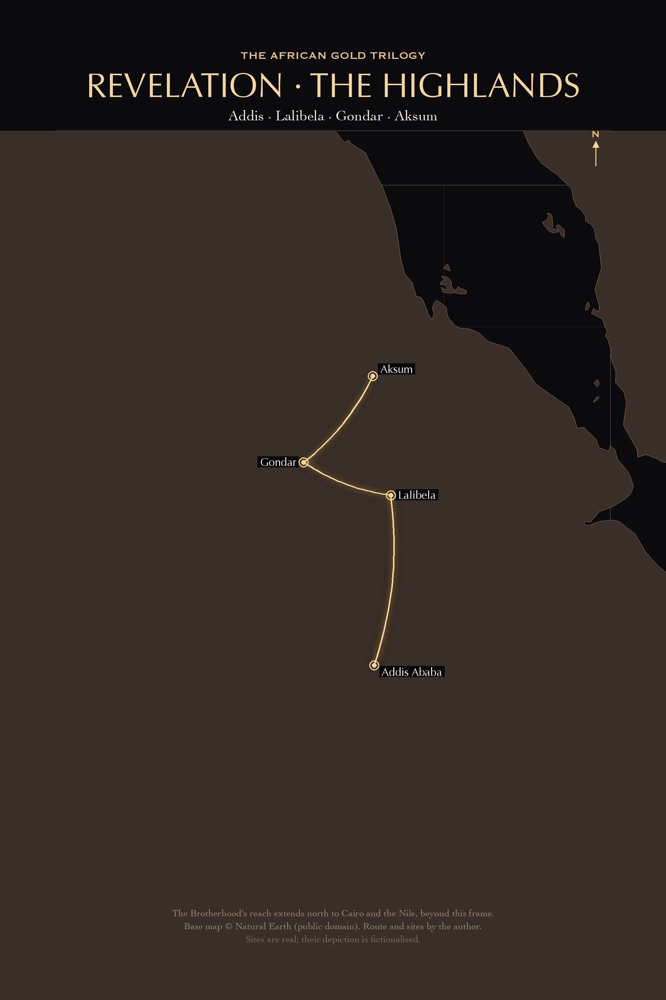

# REVELATION

**The African Gold Trilogy · Book Two**

Andries J. Greyling

---

---

*REVELATION*

Copyright © 2026 Andries J. Greyling. All rights reserved.

This is a work of fiction. Names, characters, places, and incidents are the product of the author's imagination or are used fictitiously. Any resemblance to actual persons, living or dead, events, or locales is coincidental. Real places, historical traditions, and scientific and archaeological references are used in a fictional context.

Published by the House of Greyling.

ISBN: ___-_-_____-___-_  *(assigned at print)*

*Per Ardua ad Magnum.*

---

# A Note to the Reader
## English

This is a work of fiction.

I love Africa — her many peoples, her languages, her long memory, and the quiet dignity of those
who live close to the sand and the highlands. I hold the deepest respect for the devotion that the
followers of Islam show. The Qur'an has taught me many things. The Prophet — peace be upon him —
is not named, depicted, or characterised anywhere in this book.

No offence is intended to any of the religions or peoples named in these pages. The story imagines
men who would use faith and race to divide us for their own power and greed; it does not point at
any real person, community, or institution. Where the book touches scripture, history, and sacred
tradition, it does so in a made-up story, with respect, and never to mock or to judge.

It is my hope that we might look instead at all that is the same between us — and refuse to be
divided by the political ambitions of men who would set faith against faith, and people against
people, for their own gain.

We are, all of us, more alike than we are different.

— Andries J. Greyling

---

## العربية (Arabic)

هذا عملٌ من نسج الخيال.

أُحبُّ أفريقيا — شعوبَها الكثيرة، ولغاتِها، وذاكرتَها الطويلة، والوقارَ الهادئ لمن يعيشون قريبًا من
الرمال والمرتفعات. وأكنُّ أعمقَ الاحترام لما يُظهره أتباعُ الإسلام من تفانٍ وإخلاص. لقد علَّمني
القرآنُ أشياءَ كثيرة. والنبيُّ — صلى الله عليه وسلم — لا يُذكَر، ولا يُصوَّر، ولا يُجسَّد في أيِّ موضعٍ
من هذا الكتاب.

لا أقصِدُ الإساءةَ إلى أيٍّ من الأديان أو الشعوب المذكورة في هذه الصفحات. تتخيَّلُ هذه القصةُ رجالًا
يستغلُّون الدينَ والعِرقَ ليُفرِّقوا بيننا خدمةً لسلطتهم وجشعهم؛ وهي لا تُشيرُ إلى أيِّ شخصٍ حقيقيٍّ، أو
جماعةٍ، أو مؤسسة. وحيثُ يلامسُ الكتابُ النصوصَ المقدَّسة، والتاريخَ، والتقاليدَ الموروثة، فإنه يفعلُ
ذلك ضمنَ قصةٍ متخيَّلة، باحترام، ودونَ أيِّ سخريةٍ أو حُكم.

وأملي أن ننظرَ بدلًا من ذلك إلى كلِّ ما هو مشتركٌ بيننا — وأن نرفضَ أن نتفرَّقَ بفعلِ مطامعِ الرجال
الذين يُؤلِّبون الإيمانَ على الإيمان، والناسَ على الناس، لمصلحتهم الخاصة.

فنحنُ جميعًا أكثرُ تشابهًا مما نحن مختلفون.

— أندريس ج. غريلينغ

---

## አማርኛ (Amharic)

ይህ ልብ ወለድ ሥራ ነው።

አፍሪካን እወዳለሁ — ብዙ ሕዝቦቿን፣ ቋንቋዎቿን፣ ረጅም ትዝታዋን፣ እና ከአሸዋውና ከደጋው አጠገብ የሚኖሩትን
ጸጥ ያለ ክብር። የእስልምና ተከታዮች የሚያሳዩትን ታማኝነትና መሰጠት በጥልቅ አከብራለሁ። ቁርኣን ብዙ ነገር
አስተምሮኛል። ነቢዩ — ሰላም በእርሳቸው ላይ ይሁን — በዚህ መጽሐፍ ውስጥ በየትኛውም ቦታ አልተጠቀሰም፣
አልተሳለም፣ እንደ ገጸ ባሕርይም አልቀረበም።

በእነዚህ ገጾች ውስጥ ለተጠቀሱት ሃይማኖቶችም ሆነ ሕዝቦች ምንም ዓይነት ስድብ አልታሰበም። ታሪኩ እምነትንና
ዘርን ለራሳቸው ሥልጣንና ስግብግብነት ሊከፋፍሉን የሚፈልጉ ሰዎችን ይዘክራል፤ ነገር ግን ወደ ማንኛውም እውነተኛ
ሰው፣ ማኅበረሰብ ወይም ተቋም አይጠቁምም። መጽሐፉ ቅዱሳት መጻሕፍትን፣ ታሪክንና የተቀደሰ ባህልን በሚነካበት
ጊዜ፣ ይህን የሚያደርገው በልብ ወለድ ታሪክ ውስጥ፣ በአክብሮት፣ ለማላገጥ ወይም ለመፍረድ ፈጽሞ ሳይሆን ነው።

ተስፋዬ ይልቁንም በመካከላችን ያለውን ሁሉንም የሚያመሳስለንን ነገር እንድንመለከት ነው — እና እምነትን በእምነት ላይ፣
ሕዝብንም በሕዝብ ላይ ለራሳቸው ጥቅም ሊያነሳሱ በሚፈልጉ ሰዎች የፖለቲካ ምኞት እንዳንከፋፈል እንቢ እንድንል ነው።

ሁላችንም ከምንለያይበት ይልቅ የምንመሳሰልበት ይበልጣል።

— አንድሪስ ጄ. ግሬይሊንግ

---

## Kiswahili (Swahili)

Hii ni kazi ya kubuni.

Naipenda Afrika — watu wake wengi, lugha zake, kumbukumbu yake ndefu, na heshima tulivu ya wale
wanaoishi karibu na mchanga na nyanda za juu. Nina heshima kubwa kabisa kwa ujitoaji
wanaouonyesha wafuasi wa Uislamu. Qur-ani imenifundisha mambo mengi. Mtume — rehema na amani
ziwe juu yake — hatajwi, hachorwi, wala hapewi sura ya mhusika popote katika kitabu hiki.

Hakuna nia ya kuudhi dini yoyote au watu wowote waliotajwa katika kurasa hizi. Hadithi hii inawazia
watu wanaotaka kutumia imani na rangi kutugawanya kwa ajili ya madaraka na uchoyo wao wenyewe;
haimwelekezi mtu yeyote halisi, jamii, wala taasisi. Pale kitabu kinapogusa maandiko matakatifu,
historia, na mapokeo matukufu, kinafanya hivyo ndani ya hadithi ya kubuni, kwa heshima, na
kamwe si kwa kudhihaki au kuhukumu.

Tumaini langu ni kwamba badala yake tuangalie yote yanayofanana kati yetu — na tukatae kugawanywa
na tamaa za kisiasa za watu wanaotaka kuichochea imani dhidi ya imani, na watu dhidi ya watu, kwa
faida yao wenyewe.

Sote, kwa kweli, tunafanana zaidi kuliko tunavyotofautiana.

— Andries J. Greyling

---

## Français (French)

Ceci est une œuvre de fiction.

J'aime l'Afrique — ses nombreux peuples, ses langues, sa longue mémoire, et la dignité tranquille
de ceux qui vivent au plus près du sable et des hauts plateaux. Je porte le plus profond respect à
la dévotion dont font preuve les fidèles de l'islam. Le Coran m'a beaucoup appris. Le Prophète —
paix et bénédictions sur lui — n'est ni nommé, ni représenté, ni incarné nulle part dans ce livre.

Aucune offense n'est destinée à l'une quelconque des religions ou des peuples nommés dans ces
pages. Ce récit imagine des hommes qui se serviraient de la foi et de la race pour nous diviser au
profit de leur propre pouvoir et de leur avidité ; il ne vise aucune personne, aucune communauté,
ni aucune institution réelles. Là où le livre touche aux Écritures, à l'histoire et à la tradition
sacrée, il le fait à l'intérieur d'une histoire inventée, avec respect, et jamais pour railler ni
pour juger.

Mon espoir est que nous regardions plutôt tout ce qui nous est commun — et que nous refusions
d'être divisés par les ambitions politiques d'hommes qui dresseraient la foi contre la foi, et les
peuples contre les peuples, pour leur seul profit.

Nous sommes tous, en vérité, bien plus semblables que différents.

— Andries J. Greyling

---

## Hausa

Wannan aiki ne na ƙagaggen labari.

Ina son Afirka — al'ummominta masu yawa, harsunanta, dogon tunaninta, da kuma natsuwar mutuncin
waɗanda ke zama kusa da yashi da tuddai. Ina da matuƙar girmamawa ga ƙwazo da ibada da mabiya
Musulunci ke nunawa. Alƙur'ani ya koya mini abubuwa da yawa. Annabi — tsira da amincin Allah su
tabbata a gare shi — ba a ambace shi ba, ba a zana shi ba, kuma ba a sanya shi a matsayin wani
hali ba a ko'ina cikin wannan littafi.

Babu nufin ɓata wa kowane addini ko kowace al'umma da aka ambata a cikin waɗannan shafuffuka rai.
Labarin yana hasashen mutanen da za su yi amfani da imani da launin fata don raba mu domin mulki
da kwaɗayinsu; bai nuna wani mutum na ainihi ba, ko wata al'umma, ko wata cibiya. Inda littafin ya
taɓa nassosi masu tsarki, tarihi, da al'adun gargajiya masu tsarki, yana yin haka ne a cikin
ƙagaggen labari, da girmamawa, kuma ba don izgili ko hukunci ba ko kaɗan.

Fatana shi ne mu maimakon haka mu duba duk abin da ya haɗa mu — mu kuma ƙi a raba mu ta hanyar
buri na siyasa na mutanen da za su tunzura imani a kan imani, da mutane a kan mutane, domin
ribarsu.

Dukkanmu, hakika, mun fi kamanceceniya da bambanci.

— Andries J. Greyling

---

## Português (Portuguese)

Esta é uma obra de ficção.

Eu amo a África — os seus muitos povos, as suas línguas, a sua longa memória, e a dignidade
serena daqueles que vivem perto da areia e dos planaltos. Tenho o mais profundo respeito pela
devoção que os seguidores do Islão demonstram. O Alcorão ensinou-me muitas coisas. O Profeta — a
paz esteja com ele — não é nomeado, retratado, nem caracterizado em parte alguma deste livro.

Não há intenção de ofender qualquer religião ou povo nomeado nestas páginas. A história imagina
homens que usariam a fé e a raça para nos dividir em proveito do seu próprio poder e da sua
ganância; não aponta para nenhuma pessoa, comunidade ou instituição reais. Onde o livro toca as
escrituras, a história e a tradição sagrada, fá-lo dentro de uma história inventada, com respeito,
e nunca para escarnecer ou julgar.

A minha esperança é que olhemos antes para tudo aquilo que temos em comum — e que recusemos ser
divididos pelas ambições políticas de homens que poriam fé contra fé, e povo contra povo, para
proveito próprio.

Somos, todos nós, mais semelhantes do que diferentes.

— Andries J. Greyling

---

## فارسی (Persian / Farsi)

این یک اثر داستانی است.

من آفریقا را دوست دارم — مردمان بسیارش، زبان‌هایش، حافظهٔ دیرینه‌اش، و وقار آرامِ کسانی که نزدیک
به شن و کوهستان زندگی می‌کنند. برای ایمان و سرسپردگی‌ای که پیروان اسلام نشان می‌دهند، ژرف‌ترین
احترام را قائلم. قرآن چیزهای بسیاری به من آموخته است. پیامبر — درود و سلام بر او — در هیچ جای این
کتاب نامی از او برده نمی‌شود، تصویر نمی‌شود، و در قالب شخصیتی پرداخته نمی‌شود.

قصد توهین به هیچ‌یک از ادیان یا مردمانی که در این صفحات نام برده شده‌اند وجود ندارد. این داستان
مردانی را تصور می‌کند که ایمان و نژاد را برای جدا کردن ما در خدمت قدرت و آز خویش به کار می‌گیرند؛
اما به هیچ شخص، جامعه یا نهاد واقعی اشاره نمی‌کند. آنجا که کتاب به متون مقدس، تاریخ و سنت قدسی
نزدیک می‌شود، این کار را در دل داستانی ساختگی، با احترام، و هرگز برای ریشخند یا داوری انجام
می‌دهد.

امید من آن است که در عوض به همهٔ آنچه میان ما یکسان است بنگریم — و نپذیریم که با جاه‌طلبی‌های
سیاسیِ مردانی که ایمان را در برابر ایمان، و مردم را در برابر مردم، به سود خویش برمی‌انگیزند، از هم
جدا شویم.

ما همگی، در حقیقت، بیش از آنکه متفاوت باشیم، به هم شبیه‌ایم.

— آندریس ج. گریلینگ

---

## Türkçe (Turkish)

Bu bir kurgu eseridir.

Afrika'yı seviyorum — onun pek çok halkını, dillerini, uzun belleğini ve kuma ile yaylalara yakın
yaşayanların sessiz vakarını. İslam'ın takipçilerinin gösterdiği bağlılığa en derin saygıyı
duyuyorum. Kur'an bana pek çok şey öğretti. Peygamber — ona selam olsun — bu kitabın hiçbir
yerinde anılmamakta, tasvir edilmemekte ve bir karakter olarak işlenmemektedir.

Bu sayfalarda adı geçen hiçbir dine ya da halka gücenme kastı yoktur. Hikâye, kendi iktidarları ve
açgözlülükleri uğruna inancı ve ırkı bizi bölmek için kullanacak adamları hayal eder; gerçek
hiçbir kişiyi, topluluğu ya da kurumu işaret etmez. Kitap kutsal metinlere, tarihe ve kutsal
geleneğe değindiğinde, bunu uydurma bir hikâyenin içinde, saygıyla ve asla alay etmek ya da
yargılamak için olmaksızın yapar.

Umudum, bunun yerine aramızdaki tüm ortaklıklara bakmamız — ve inancı inanca, halkı halka karşı
kendi çıkarları için kışkırtacak adamların siyasi hırslarıyla bölünmeyi reddetmemizdir.

Hepimiz, doğrusu, farklı olduğumuzdan çok birbirimize benziyoruz.

— Andries J. Greyling

---

## עברית (Hebrew)

זוהי יצירה בדיונית.

אני אוהב את אפריקה — את עמיה הרבים, את שפותיה, את זיכרונה הארוך, ואת הכבוד השקט של החיים
קרוב אל החול ואל הרמות. אני רוחש את מלוא הכבוד למסירות שמגלים מאמיני האסלאם. הקוראן לימד
אותי דברים רבים. הנביא — עליו השלום — אינו נזכר, אינו מתואר, ואינו מעוצב כדמות בשום מקום
בספר הזה.

אין כל כוונה לפגוע באף אחת מן הדתות או מן העמים הנזכרים בעמודים אלה. הסיפור מדמיין אנשים
שישתמשו באמונה ובגזע כדי לפלג בינינו למען כוחם וחמדנותם; הוא אינו מצביע על שום אדם, קהילה
או מוסד ממשיים. במקום שבו הספר נוגע בכתבי הקודש, בהיסטוריה ובמסורת הקדושה, הוא עושה זאת
בתוך סיפור בדוי, בכבוד, ולעולם לא כדי ללעוג או לשפוט.

תקוותי היא שנביט במקום זאת בכל המשותף בינינו — ושנסרב להיות מפולגים בידי שאיפותיהם
הפוליטיות של אנשים המסיתים אמונה כנגד אמונה, ועם כנגד עם, לטובת עצמם.

כולנו, באמת, דומים זה לזה הרבה יותר משאנו שונים.

— אנדריס ג'יי גריילינג

---

## ትግርኛ (Tigrinya)

እዚ ናይ ልብ ወለድ ስራሕ እዩ።

ኣፍሪቃ የፍቅራ — ብዙሓት ህዝባ፣ ቋንቋታታ፣ ነዊሕ ዝኽራ፣ ከምኡውን ናይቶም ኣብ ጥቓ ሑጻን ጎቦታትን
ዝነብሩ ህዱእ ክብሪ። ንተኸተልቲ እስልምና ዘርእይዎ ተወፋይነት ዓሚቝ ኣኽብሮት ኣለኒ። ቁርኣን ብዙሕ ነገር
መሃረኒ። እቲ ነቢይ — ሰላም ኣብ ልዕሊኡ ይኹን — ኣብዚ መጽሓፍ ኣብ ዝኾነ ቦታ ኣይተጠቕሰን፣ ኣይተሳእለን፣
ከም ገጸ ባህሪ እውን ኣይቐረበን።

ኣብዘን ገጻት ንዝተጠቕሱ ዝኾኑ ሃይማኖታት ኮነ ህዝብታት ዝኾነ ናይ ምጽራፍ ሓሳብ የብሉን። እታ ዛንታ
ንእምነትን ዓሌትን ንረብሕኦም ስልጣንን ስስዐን ኢሎም ክፈላልዩና ንዝደልዩ ሰባት ትገልጽ፤ ግን ናብ ዝኾነ
ናይ ሓቂ ሰብ፣ ማሕበረሰብ ወይ ትካል ኣይተመልክትን። እቲ መጽሓፍ ንቕዱሳት ጽሑፋት፣ ንታሪኽን ንቅዱስ
ባህልን ኣብ ዝትንክፈሉ እዋን፣ ነዚ ዝገብሮ ኣብ ውሽጢ ናይ ልብ ወለድ ዛንታ፣ ብኣኽብሮት፣ ንምልጋጽ ወይ
ንምፍራድ ፈጺሙ ዘይኮነ እዩ።

ተስፋይ ኣብ ክንዲኡ ነቲ ኣብ መንጎና ዘሎ ዘመሳስለና ኹሉ ክንርኢ እዩ — ከምኡውን ብሰብኣዊ ፖለቲካዊ ህርፋን
ናይቶም እምነት ኣንጻር እምነት፣ ህዝቢ ኣንጻር ህዝቢ ንረብሕኦም ዘለዓዕሉ ሰባት ክንፈላለ ንኸይንቕበል እዩ።

ኩላትና፣ ብሓቂ፣ ካብ እንፈላለ ንላዕሊ ንመሳሰል ኢና።

— ኣንድሪስ ጀ. ግሬይሊንግ

---

*For Lisel.*

*The whole of this library — every book, every series, and the Jakobus Thread that runs through the heart of it — is hers. Each page that follows may carry another name; all of them together carry only one. She is the floor the entire house stands on.*

*Sawubona.*

⁂

**For Quinn.**

Head-strong — which the world will keep trying to file down, and which you should keep exactly
as it is, because it is the same thing as a spine. You are held as a best friend by more people
than you know, which is its own quiet proof of character. This is the book about a woman who
will not let anyone else decide what the truth is allowed to mean. I think you'll understand her.

Stand your ground. Love what you love, loudly. *One love.*

---

# Foreword

### *by Dan Brown*

I should recuse myself from this one.

I am, after all, the man who put a murderous conspiracy inside the Catholic Church, sold rather a lot of copies, and got myself denounced from pulpits on three continents. So when I tell you that the book you are holding involves a secret brotherhood, a suppressed manuscript, a re-translation that could rewrite what a billion people believe, and a conspiracy with a Vatican thread running through it — you are entitled to assume I am simply applauding a man for doing my act in my coat.

And I am. Partly. I would be lying if I said it wasn't a joy to watch someone sprint down a corridor I built. But that is not why I agreed to write this, and I want to be careful here, more careful than I usually bother to be, because this book earns the care.

Here is the difference, and it is the whole reason I set my cocktail down and paid attention.

When I send a hero into the hidden chambers under a church, the secret at the bottom is a *scandal.* A bloodline, a cover-up, a thing the institution would kill to hide because it would *embarrass* them. It is great fun and I regret none of it. But the secret at the bottom of *this* book is not a scandal. It is the opposite of a scandal. The author has built the entire machinery of the conspiracy thriller — the codes, the chase, the hunted scholar, the closing shadows, the chamber beneath the ancient churches — and aimed it, with enormous nerve, at a secret that turns out to be *that the three great faiths were never really enemies, and that someone profited, for centuries, from teaching them that they were.*

Do you see what a strange and difficult thing that is to pull off? It is easy to write a thriller that tears a religion down; I am told I made it look easy, which is unkind but not entirely wrong. It is *brutally* hard to write a thriller — a real one, with a body in the first act and a villain and a ticking clock — whose final revelation *builds something up,* whose buried treasure is reconciliation, whose payoff is not "look how rotten they are" but "look how much they share, and look who worked to hide it." He kept every gear of the genre and reversed its polarity, and it should not work, and it absolutely does, because he never once cheats you of the thriller while he's doing it.

I want to say a careful word about the faith of it, because I have learned, the hard way, in very large rooms, that this is holy ground and a clumsy boot does real harm. The author handles three living religions in these pages — Islam, Judaism, Christianity — and he handles them, every one, with a respect I did not always manage and have come to admire. He does not mock anyone's God. He locates the rot exactly where it belongs, in the human institutions that have always found it profitable to keep the faithful afraid of each other, and he leaves the faith itself standing, and dignified, and worth a person's life. That is a harder balance than any cliffhanger, and he holds it for an entire novel. A thriller about scripture that the devout could read without insult, and the skeptic without condescension, is something I am not sure I have seen done before. I have certainly never done it.

Now, the practical warnings, because I am still me.

The protagonist is a linguist, which means the codes are *real* codes, real languages, real scripts, and the author has done the unforgivable thing of getting them right, so you will learn something against your will. The chapters end where mine end — mid-fall, one beat early — and I extend my standard apology to your sleep schedule. And somewhere in this book you will pass a quiet, watchful man who reads symbols the way the heroine reads languages, and who is connected to a larger story than this one; pay attention to him, in the way you pay attention to a door left slightly open.

I have spent my career being told that what I do is a guilty pleasure. Fine. Guilty I'll take. But every so often someone uses these disreputable tools — the chase, the code, the gasp — to build something that is quietly, genuinely *good,* in the old sense, the moral sense, and when that happens the guilty pleasure turns out to have been a Trojan horse for something true.

This is one of those. Read it fast, the way it's built to be read. Then sit a while with what it actually said. I did. I'm still sitting.

*— Dan Brown*

---

## Contents

- The Cryptic Message
- The Institute
- The Inciting Incident
- Unlikely Alliance
- The Decoded Truth
- Shadows and Surveillance
- The Journalist's Gambit
- The Vatican Connection
- The Brotherhood's Offer
- The Betrayal
- Confronting the Past
- The Global Summit
- The Presentation
- The Confrontation
- The Rescue
- The New Dawn
- Unfinished Business
- The Legacy

---

# The Cryptic Message

> ዞሮ ዞሮ ወደ ቤት፤ ኖሮ ኖሮ ወደ መሬት።
>
> *One keeps travelling on until one returns home; one lives on until one returns to the earth.*
>
>—Amharic proverb

The email had no sender, no subject line, and one attachment: `coordinates.jpg`.

Leila Aziz had spent three years learning to delete messages exactly like this one. After her father died, the inbox had filled with a particular species of vulture. Distant cousins who suddenly remembered her name, collectors who wanted his papers, two separate men claiming he'd promised them a manuscript. She had built filters. She had built routines. An unsolicited attachment from a stripped address was not a mystery; it was a hook, and she knew better than to bite.

She hovered the cursor over the trash icon. Her screen dimmed, waiting for her to decide.

Then she opened it instead, because the filename was lowercase and the period sat too close to the *j*, and that was how her father had named files his whole life.

The image rendered in bands, top to bottom. A scrap of paper, folded so many times the creases had gone white and furred, resting on a surface of pitted grey stone. Below it, printed in hard modern black:

*12.0317° N, 39.0411° E*

And beneath the numbers, four words in a cramped, back-slanting hand:

*The library remembers. Find it.*

Leila looked at the lowercase *r*. Her father had formed his with a small backward hook, a holdover from a German palaeography teacher he'd worshipped in the seventies, a habit he complained about and never broke. The note had three of them, all hooked.

She set her coffee down. It went over the lip of the mug and spread across a stack of offprints, and she let it.

Not similar. Not reminiscent of. *His.* And underneath the recognition, cold and immediate, a second thought that had nothing to do with grief: the coordinates were set in a digital typeface, sharp-edged, machine-clean. The handwriting was not. Someone had photographed her father's note and added the numbers afterward. The image was not something he had left her. It was something someone had *built* out of him.

She right-clicked and opened the file's properties.

The metadata had been scrubbed clean: no camera, no GPS, no author field, every line wiped to blank. That alone told her something; ordinary photographs were filthy with data, and a clean one had been cleaned on purpose. But whoever did it had missed the transmission trail buried below the visible fields, the way an editor misses a comma. The file had been forwarded through three relays she didn't recognize and one she did. The last machine to touch it before it reached her sat inside the Institute's own network, on the basement subnet, ninety meters below and to the left of where she was sitting.

The sender was in the building. A person down the stairs, today, now.

"You're up early."

Leila's hand was already on the monitor, tilting it away, before she'd decided to move. Dr. Amara Tekle stood in the doorway with two cups of coffee, iron-grey hair pinned back, watching her with the flat attention of a woman who had spent forty years cataloguing things that lied about their age. Director of Acquisitions. Ten years they'd shared a corridor. Cordial, professional, sealed.

"Couldn't sleep," Leila said.

Amara didn't come in. She set one cup on the threshold table, just inside the door, and stayed on her side of it. That, more than anything she said, made Leila sit up straight. In ten years Amara had walked into her office a hundred times.

"You've opened something of your father's." Amara's eyes had gone to the cant of the monitor, the spill she hadn't wiped, the particular stillness of a person caught. "I can see the shape of you from across the hall when you do. You sit the way he sat."

"It's nothing. An old colleague."

"Mm." Amara picked up her own cup but didn't drink. "If you're going into his materials, Leila, I'll give you one piece of advice and then I'll mind my business. Don't start with the boxes labelled in his hand."

"Why not?"

"Because dead scholars don't reorganize their own shelves." She turned to go, then stopped with one hand on the frame. "The cataloguing on his collection changed after the funeral. Start with the things relabelled after he died. That's where you'll learn something." A pause. "I never told you that."

She left. Her footsteps went down the corridor, unhurried, and turned toward the stairs rather than her own office.

Leila sat for a moment with both hands around the coffee she hadn't asked for. Then she pulled up the satellite map and dropped the coordinates into it. A pin fell onto rust-brown highland, terraced and treeless, and resolved into a name she had seen once at sixteen and never forgotten.

Lalibela.

The rock churches. The ones her father had declined to take her to, citing research, the year the rest of the trip went without him. Her grandmother had gone south to Lalibela once a year on the bus from Tigray until her knees gave out, come home each time with holy water in a recapped Coca-Cola bottle and the unshakable serenity of a woman who had touched the thing itself; Leila had stopped going to the Orthodox liturgy at fourteen and had never once, in the twenty years since, stopped being able to follow the Ge'ez when she heard it. The language had outlived the belief in her, which was, she had always thought, the more honest order for those two things to fail in. She had a sudden, useless memory of her university graduation, fifteen years ago, his face doing the thing it did when he was proud and trying to hide it, the small leather journal he'd pressed into her hands afterward. *For your own work. Every linguist needs somewhere to keep her real thoughts.* She had thanked him and shelved it, never written a line in it, and it was sitting in a drawer in her apartment at this exact moment, blank.

She closed the map.

Amara had said the basement. So she went to the basement.

---

Her badge opened the stairwell door without complaint. The Institute's lower archive smelled of cold concrete and the faint green-copper of old fittings, and the light came on in stuttering banks as she walked between the shelving. *Aziz, A.* His racks, a tenured man's privilege, near the back where the humidity control hummed loudest.

She found his boxes where they had always been. And then she found that Amara was right.

The external labels were his: square capitals, archival dates, the call numbers he'd assigned himself. But the order inside the third box was wrong. Her father filed chronologically, ruthlessly, a man who alphabetized his spice rack. This box ran from 2019 to 2021 and then jumped backward to 2017 in the same run of folders, as if a hand had pulled the contents, fanned them, and put them back by feel. Whoever had done it knew his labels. They had not known his mind.

One folder held a photocopy where an original should have been. She could tell at a glance: the toner sheen, the slight skew of a page laid crooked on a platen. The text was all there, clean and legible. But the copy had been cropped a centimeter inside the margin, and her father never cropped a margin in his life. He photographed the edges precisely *because* that was where the evidence lived: the binding stitches, the later hands, the ghost of an erased rubric. Someone had reproduced the words and thrown away exactly the part that mattered, and trusted that no one would notice what was missing because nothing appeared to be.

She almost talked herself out of it. A photocopy in a box was nothing. Copies got made, originals went to conservation, the world was full of dull explanations. But she had spent her career on the principle that a thing which looks innocent and is missing the same information twice is not innocent, and so she did what her father would have done: she checked.

He had published this folio. She was nearly sure of it, a comparative plate in a paper on Deuteronomic variants, four or five years back, the kind of figure a journal prints at grudging quarter-page and a co-author keeps at full resolution. She pulled her phone, found the offprint in her own files, and pinched the figure open until the margin filled the screen.

There. In her father's photograph, in the outer margin the photocopy had amputated, a notation in a second hand: later ink, a different nib, a small careful gloss running vertical against the text. She couldn't read it at this size and it didn't matter. What mattered was that it existed, and that the copy in the box had been framed, deliberately, to make it not exist. You did not crop a margin by accident. You cropped it the way you redacted a line: because of what was in it.

The call number on the folder tab read: *TCP-ALT-03.7—Variants in Deuteronomy, comparative.*

Underneath it, wedged flat against the box's bottom, was the journal.

Forest-green leather, his initials stamped in flaking gold on the spine: *A.A.* She sat down on the cold floor with it in her lap and turned the pages, and the careful academic hand of the early entries tightened, year over year, into something that hurried. He had been collating manuscripts. "Pristine copies," he called them, sources he wouldn't name except as *the Brotherhood* and *the archive.* He'd started out arguing with himself in the measured language of his field: *scribal drift, transmission error, the ordinary entropy of copying.*

And then, six months before the end, the argument stopped. A single line, underscored twice, hard enough to score the paper:

*Not error. Harmonization.*

After that the word *error* never appeared again. He had a new phrase, and he used it the way a man uses a word he is afraid of. *Administrative theology.* Whole pages now: cross-references, two columns of variants set side by side, a line in an old Lalibela copy that read *with them* against the printed edition on every seminary desk in the world, which read *over them.* One preposition. She read his marginal note beside it three times.

*Six centuries of commentary built on a word someone changed. They didn't mistranslate it. They corrected it, for consistency. Whose consistency? That's the whole question.*

The last entries were not frantic so much as tired, a man writing past the point where fear is exciting. *They know I've talked to them. The cataloguing in B-74 was touched last week: folders out of order, one folio swapped for a copy. They're not hiding it well because they don't need to. They only need me to know they can reach it.* And then, the final line before the pages went blank, in smaller writing, as if to himself:

*Should have told Leila. Should have told her how to read it, not just that it was there.*

The entry ended mid-thought. She turned the next page and it was empty, and the one after that, and that was what undid her. Not the warnings, not the fear in the hand. The fact that he had expected another page. He had stopped writing in the middle of a sentence because he believed there would be time to finish it, and there had not been.

She pressed the heels of her hands against her eyes and stayed like that until the cold of the floor came through her clothes.

Then the lights changed.

Not off. *Down.* The fluorescents over the front of the archive cut out in a block, leaving her aisle lit and the route to the stairwell in dark. A second later her phone buzzed against her thigh: an automated notice from Institute facilities, the kind that went out for fire drills and system tests.

*Basement access, credential AZIZ-L, revoked pending review. Direct enquiries to the Office of the Director.*

Her badge. Disabled while she was standing under the shelf it opened.

Somewhere above her, on the main floor, a printer woke up and began to run, the heavy chunk of the archival machine in the catalogue room, the one nobody used at this hour, pulling sheet after sheet. She stood very still and listened to it print, and understood that whoever had sent her a photograph from a basement machine had wanted her down here, reading, when the door locked behind her.

She did not run. She slid the journal into her bag, set the photocopied folder back exactly as she'd found it, square to the box, crooked page and all, and walked to the service stair at the far end, the one that fed the loading dock and that her revoked badge would not open. The crash bar gave on the inside. It always did. Fire code didn't care who you were.

The service stair came up beside the catalogue room. The door stood open a hand's width, light spilling out, and she should have walked past it and didn't, because the archival printer was still feeding and she wanted to know what was worth printing at this hour from a dead man's collection. She looked through the gap.

The output tray was filling with her father's work. She knew the layouts at a glance: his comparison tables, his two-column variant plates, the particular way he set a footnote. Someone had his entire digital archive open and was running it to paper, methodically, file after file, the way you make a copy of something before you delete the original. A man stood at the machine with his back to her, unhurried, squaring each batch as it came off. He was harvesting it. On the table beside him sat an evidence box, flaps open, already half full.

They had not come to find out what her father knew. They already had it. They had come to take the last copy that wasn't theirs, and they had timed it for the morning someone finally went looking.

She moved on before the man turned, down the last flight and out through the loading bay into ordinary morning. Students crossing the green. Coffee carts. A delivery van idling. She made herself walk at the pace of a woman who was merely late for something, and not once did she look back at the building, because looking back was what they would be watching for.

---

In the taxi she texted Miriam, *Drinks tonight, my treat, something's come up,* and got back, within the minute, *Only if it's the good gin. Been a bitch of a week.* Miriam Asher. Closest friend she had, which said more about Leila's friendships than about Miriam. A journalist with the magpie instinct of her trade, a woman who knew things and knew how to find out the rest. *Later,* Leila thought. *When I know what I'm dragging her into.*

Her apartment was small and exact and felt, the instant she walked in, like a room someone else had measured. She pulled a bag from the closet and packed the way she did everything, in order, and was reaching past the unworn graduation journal for her passport when her fingers found the envelope taped behind it.

Heavy paper. His wax seal, a thing she'd forgotten he owned. Her name in the hooked hand: *Leila—in case.*

She opened it standing up.

*My dearest Leila,*

*If you're reading this, silence stopped protecting you, which means it stopped protecting me first. For two years I have been collating texts I cannot tell you how I obtained, with people I can only half name. The work is sound. That is the danger. A wrong idea hurts no one. A correct one, about this, gets a man's heart to stop on schedule.*

*Go to Lalibela. There is a library beneath the church of St. George, and a door that does not look like a door. The way in is the name of the village where your mother and I married. You were not told it on purpose, and you already know how to find it, because I taught you to find things.*

*Trust Samuel El-Ghazali as far as his interests run with yours, and not one step past it. Trust no one who comes wearing the Vatican's authority, however gentle. And trust the page over the man, always. The people in this fight all want to tell you what the texts say. You are the only one I know who can make the texts say it themselves.*

*I am sorry I gave you a method instead of a father these last years. It was the only protection I had to give.*

*Abebe*

She read the last line twice. Then she folded the letter along his creases, put it with the journal, and finished packing.

She booked the next flight to Lalibela, a connection through the regional carrier, departing in just under four hours, because it was the obvious way, the way anyone would go.

It was on the jet bridge, with the boarding pass warm in her hand, that her phone buzzed with a photograph.

A brass door handle, tarnished, worn to brightness at the grip. She knew it before she'd finished registering the image, because she had wrapped her hand around that exact handle ninety minutes ago: it was the pull on the restricted drawer at the back of the lower archive. Drawer B-74. The one her father's last entries named. The one her badge had opened, until it didn't.

In the corner of the photo, a timestamp: *14:02 UTC.*

Her phone said 14:05.

Three minutes. Whoever sent it had not followed her from the Institute to the airport. There was no time to. They had photographed that handle three minutes ago, in a basement she could no longer enter, and sent it to her here. Two people, then, at the least. One waiting at the gate. One still standing at the drawer.

And the message under the message, as clean as the metadata they'd scrubbed: *We were there before you. We are there now. And we knew which flight you'd take.*

Leila looked down the jet bridge, at the door of the aircraft her father's killers had every reason to expect her to board.

She turned and walked back up it, toward the terminal, already pricing the difference between the route they had laid out for her and the one she would have to find herself.

---

# The Institute

> *Man zawwara ash-shāhid, qatala ash-shahādata marratayn.*
>
> *He who forges the witness kills the testimony twice.*
>
>—saying of the keepers of the sand-roads

She did not go to Lalibela. Not yet. The route they'd staged for her ran through the airport, and she had walked off the jet bridge precisely so she would not take the road her father's killers had drawn. Before she vanished she needed one thing the basement could give her and the basement no longer would: she needed someone with standing to open the drawer her badge had died trying to reach. She needed Kebede.

Dr. Yohannes Kebede had been her father's oldest colleague and her own reluctant godfather, and he kept the Institute's restricted collections the way a verger keeps a crypt, out of duty, without warmth. He did not look up when she came into his office. He was annotating a stack of offprints in red, seventy-three years old and moving like a man who had decided long ago that haste was vulgar.

"You're not due until next week," he said.

"Someone is harvesting Abebe's archive right now." She stayed standing. "A man in the catalogue room, running his entire digital collection to paper into an evidence box. My basement credential was revoked while I was under the shelf it opened. I have maybe an hour before they finish, and I need the original of TCP-ALT-03.7, because the copy in his box has had its margin cropped off."

That moved him. Not his face. His hands. The red pen stopped.

"Sit down, Leila."

"I'd rather you walked me to the drawer."

"Sit down." He took his glasses off, which was how she knew he was going to lie to her about at least one thing. "Your father came to me eight months before he died and asked for unsupervised access to the restricted Ethiopic holdings. I refused him. It is the last conversation we had that wasn't an argument, and three weeks after the final argument he was dead in a hotel that was supposed to be secure, of a heart that his own doctor will tell you was sound." He set the glasses on the blotter. "I refused him to protect him. It did not work. So you will understand that I am not eager to repeat the experiment with his daughter."

"Then come with me. Supervise. That's your condition met." She put her hands flat on his desk. "Yohannes. You can stand at the drawer and watch me, or you can read about it in whatever obituary they're already drafting. Those are the choices you've left yourself, not me."

For a long moment the office held nothing but the fluorescent hum. Then Kebede opened a locked drawer, took out a single card, and wrote a code on the back of a requisition slip in a hand that had gone unsteady.

"You will look at one folder," he said. "The one you named. You will not photograph the room. And you will give me your word that if you find what I think you'll find, you will put it down and get on a plane and become, for the rest of your life, a woman who teaches undergraduates about the Septuagint and nothing else." He held the slip but didn't release it. "Promise me, and we both know you're lying, and we'll proceed anyway."

"I promise," she said, lying, and he let go of the slip.

She turned for the door. He spoke once more, to her back, in a voice stripped of its lecture.

"Six months before the end, he stopped saying *error*. I'd ask him about a variant and he'd correct my word before he answered. It wasn't an error, he'd say. It was a decision." Kebede's mouth worked. "He had a phrase for it. *Administrative theology.* I told him he sounded paranoid. I would give a great deal to tell him I was wrong."

---

The restricted wing was its own room within the basement, a steel door and a keypad and air kept three degrees colder than the rest. Kebede's code turned the light green. Drawer B-74 slid out on its runners with a sound like a held breath.

She found the folder by its tab, *TCP-ALT-03.7, Variants in Deuteronomy*, and this was the original, not the cropped copy from the box upstairs: the photographic plates full-bleed to the margin, her father's edges intact. She laid the first plate beside the printed critical edition the drawer kept for comparison and read the two together, and there it was, the thing the cropped copy had been built to hide.

The passage was a covenant formula, the terms a sovereign sets over a people. In the printed text, standard for a century, the verb was one of subjugation: the powerful would *rule* the weak, and the line had been quarried for a thousand sermons on hierarchy and obedience. In her father's plate, in the older hand, the same verb carried its older sense, the one that survived in the cognate languages she'd cut her teeth on: not *rule over* but *stand surety for.* The strong were bound *to* the weak, not set *above* them.

A later hand had glossed it in the margin (the margin the photocopy had amputated) in three words of careful clerical script: *corrected for consistency.* And beside that, in her father's pencil, the question that had killed him: *consistency with what?*

She stood with the cold coming up through the floor and understood, in her own hands and not because anyone had told her, that her father had been right. Not paranoid. Right. The word had been changed, deliberately, and someone had written down that they'd done it.

She should have stopped there. She had what she came for. But the folder held more than the plate, and the next document made her stop breathing for a different reason.

It was a single sheet, modern, stamped across the top in faded red: *BROTHERHOOD OF ABRAHAM—INTERNAL ANALYSIS—RESTRICTED.* A summary of the very alteration she'd just found, written as if by the order her father had died trying to join, confirming his thesis in clean institutional prose. Confirmation. Corroboration. A second, independent witness to put beside her father's plate.

It was a forgery, and she knew it in under ten seconds, because forgers are betrayed by the things they don't think are evidence.

The stamp transliterated the order's name from the Arabic, and the transliteration was wrong by a single letter, a consonant rendered the way an English speaker hears it rather than as the Arabic is actually pointed, an emphatic flattened to a plain. No Arabic speaker made that substitution; it was the precise error of someone working from sound, from a European ear, dressing up in the costume of a movement whose own scribes would never have misspelled their own name. She had marked a hundred student transliterations for exactly this slip. It was as good as a signature, and the signature was not the Brotherhood's.

Someone had planted a fake Brotherhood document in her father's restricted file. The finding was real, the plate beside it was genuine. They had built the forgery to *poison* it. To sit a forgery next to the truth so that when the truth finally surfaced, an opponent could hold up the fake, prove it false in an afternoon, and let the real plate drown in the laughter. You did not hide a thing this way. You discredited it in advance.

The conspiracy was real. And the evidence was being manufactured from more than one direction at once.

Her phone buzzed against her hip. An email, no sender, two lines: *Your father's library is real and waiting. Trust no one at the Institute; trust no one in authority; trust only what you verify with your own hands.*

A week ago it would have read as a friend's warning. Standing over a planted forgery, it read as something else entirely. A hand reaching in to steer her, telling her whom to distrust so she'd run toward whoever was doing the steering. *Trust only what you verify with your own hands.* She had just verified something with her own hands, and it was that this very drawer had been salted. The advice and the forgery were the same gesture from two angles.

She did not photograph the room. She'd given Kebede that, and meant it, because a promise you intend to keep is camouflage for the one you don't. But the Brotherhood sheet she slid flat inside her father's journal, against the back cover, because a forgery is evidence of the forger, and she was going to need to show someone the shape of the hand that made it.

She put the folder back square and walked out. The light over the drawer went red behind her.

---

Kebede was not in the corridor. The reading room he'd have steered her to stood dark. She found, when she reached the lobby, that her Institute account had been suspended (the staff portal on her phone returning a flat *credential under administrative review*, the same bloodless phrase that had locked the basement) and that the security desk, where a guard who'd waved her through for a decade sat every morning, was empty, the monitor angled away and the morning's footage already, she had no doubt, overwritten or gone.

They were not chasing her through the building. They were closing the building around her, quietly, the way you draw a sheet over furniture. Revoke the badge. Suspend the account. Lose the footage. Salt the file so that whatever she carried out could be called a fabrication later. It was patient and it was administrative and it frightened her more than a man with a gun would have, because a man with a gun wants you dead and these people wanted her *disbelieved.*

She walked out through the garden at the pace of someone leaving early, not fleeing, and did not look up at the cameras. Past the gate she let herself move faster. She had a genuine plate proving a six-hundred-year-old alteration, a forged document proving someone had anticipated her, and a dead man's instruction to read the page over the man. She had no idea yet who had sent the coordinates, or whether the library was where the map said. But she had one fact she could stand on, and she turned it over as she walked toward the taxi rank and the long unstaged road north.

The Brotherhood stamp had been wrong by one letter, the kind of mistake only someone who had never spoken the language would make. Whoever was forging the Brotherhood into existence inside her father's files had never been a member of it. They had only needed her to believe she'd found one.

---

# The Inciting Incident

> ማየት ማመን ነው።
>
> *Seeing is believing.*
>
>—Amharic proverb

The road into the highlands was not a road so much as a rumor of one, and Leila drove it in the dark with the headlights off for the last kilometer, because headlights on a mountain announce you for ten miles. She had bought the Land Rover for cash from a man in Lalibela who asked nothing, and she had taken the long way to reach it. Two days north by routes nobody had staged for her, doubling through Gondar, paying in small notes, leaving her phone dark. If the obvious path to Lalibela had been laid out like a trap, she would arrive by the path no one had thought to set.

The coordinates put her on the eastern ridge above the church complex, and there she stopped, because the coordinates were where the trouble started. They pointed at bare rock. No door, no cleft, nothing but a basalt face the starlight turned the color of bone. Anyone following the pin would stand here and find nothing and conclude there was nothing to find.

But her father had not written *go to the coordinates.* He had written *the library remembers,* and her father did not waste words on atmosphere. *Remembers*—not *is here*, not *is buried*. A thing the place itself had been made to hold. She had spent twenty years reading what scribes meant under what they wrote, and she made herself read the cliff the same way.

Remembers. Stone remembered two things: water and feet. She walked the base of the ridge with her torch hooded to a coin of light and looked not for an entrance but for *wear*. She found it where the rock met the old pilgrim track, a runnel of stone worn shallow and smooth, the unmistakable dishing of centuries of hands and shoulders passing through a gap too low to walk upright. Erosion didn't pool like that on a blank face. It pooled where bodies had gone in and out for a thousand years. She followed the worn line to its end, and the shadow that had looked like a fold in the cliff resolved, when she was close enough to touch it, into an opening framed in fitted stone.

She had solved it herself. The small fierce satisfaction of it steadied her hands more than courage could have.

She ducked through into cold air that smelled of dust and old vellum, and her torch opened the dark onto shelves cut from the living rock, floor to ceiling, packed with manuscripts that had darkened to the color of the stone that held them. Hebrew on Arabic on Greek, an Orthodox cross stamped beside a crescent, the codices shelved deliberately *together*, mixed, as if whoever kept this place believed the separation of the traditions was the lie and their conversation the truth. It was real. Her father's library was real, and her breath went ragged with a joy that frightened her.

Then her training took the wheel, and the wonder cooled into observation, because a scholar's first duty in a room like this is to read the room.

This was not a tomb. The air moved. Engineered circulation, vents cut to draw the dry highland wind through and pull the damp out, a conservator's work, not an accident of geology. The shelves were dusted to a line about chest height and dusty above it: someone tended the working shelves and ignored the high ones, which meant someone *worked here,* recently, by hand. And there was a gap. Third shelf, eye level, in the section where the dust was thinnest. A slot the exact width of a large codex, the leather-dust ghost of its absence still sharp-edged on the stone. Something had been pulled from there, and pulled lately, within days. The library was curated. It was kept. And it had just been edited.

She drew down the volume beside the gap. Latin text, Coptic glosses crowding the margins, a scholar's apparatus of comparison running centuries deep. She photographed it open, edges and stitching and shelf tag, the way her father had taught her to photograph everything. A working library of variants. Proof, in her hands, that someone had been collating the sacred texts against each other for longer than her country had been a country.

It was the smell that turned her. Under the vellum and the dust, something coppery and wrong, recent.

Professor Hakim lay in an alcove three shelves down, on his back on the stone, hands folded over his chest. She knew the name from her father's journal: *Hakim is reliable; Hakim sees it whole*. For half a second the arrangement read as peace, a tired man asleep among his books. Then the torch found the angle of his neck, and the dark pool gone tacky beneath his head, and the peace curdled into its opposite. He had not fallen and been left. He had been *placed*. Composed, hands crossed, laid out straight along the shelf like an effigy on a tomb lid. You did not die in that posture. Someone arranged you in it.

She made herself look the way she'd look at a manuscript, because looking like a scholar was the only thing keeping her from screaming. His right hand, the one on top. The first two fingers were stained. Not blood. A deep red-brown ground into the cuticle and the pad, the unmistakable color of a particular iron-gall-and-ochre ink she had handled a hundred times in a hundred reading rooms. Fresh ink. He had been touching a wet or recently inked page when he died, or after. And he had been laid out beside an open codex on a reading stand, deliberately, the book turned to face his folded hands.

She leaned to it. The exposed page was a known passage, one she recognized at a glance, but the ink of one line sat *proud* of the rest, blacker, the strokes a hair too confident, the way a modern hand fakes an old one. Someone had altered a line on this page, recently, and set the dead man's stained fingers beside it like a caption. *He died trying to mark this. Or he died because he caught them marking it.* Either way the body was not just a murder. It was a sentence with a footnote.

She photographed the page. The altered line, the stand, the staged hands. Her own hands shook so badly the first frame blurred and she took three more.

And then the footsteps came. Not wind, not an animal, the flat deliberate scuff of boots on stone, more than one set, between her and the way out.

She killed the torch and moved by memory toward the entrance, and as she passed the reading stand a last time her eye caught the open codex again, and her stomach dropped, because the page had *changed.* Not the same page. In the seconds her light had been off, or in some trick of angle and panic she would never be sure of, the codex now showed a different opening, clean, unaltered, innocent, where the proud black line had been. Either someone had turned it in the dark a meter from her, or the leaf she'd photographed had already been lifted out and a substitute laid in. The evidence was not sitting still to be found. It was being moved while she stood over it.

She did not stop to understand it. She went for the gap in the rock low and fast, and behind her a voice said something short in a language she was too frightened to parse, and a torch beam swung across the shelves and threw her shadow huge against the stone.

She came out of the cliff into the cold and the stars and ran.

The descent tried to kill her honestly. Loose scree rolled under her boots; she went down once, hard, a spike of pain through her ribs where she caught a rock, and got up and kept going because the lights were out of the cliff-mouth now and bobbing after her down the slope. A hundred meters to the Land Rover felt like a kilometer. She heard a man shout an order, and it was the *manner* of it that lodged in her even through the terror, clipped and procedural, call-and-response, the cadence of people trained to coordinate, the radio discipline of an organization and not a gang of local thieves. Whoever these were, they had a protocol. They had been *sent.*

She reached the vehicle, threw herself in, found the key on the third grab. The engine caught. She took the ridge road blind and reckless, headlights off, the slope hauling at the wheels, and something cracked hard against the rear panel, a stone or a round, she couldn't tell and didn't slow to learn. The track leveled as she dropped, and only when the lights behind her had finally fallen away into the dark did she let herself put her own lights on and breathe.

Two hours back to anywhere. Her ribs sang with every breath. She drove and the image would not leave her: Hakim laid out like an illustration, his inked fingers pointing at a line that had been changed and then, in the space of a heartbeat, changed back. They had not only silenced him. They had been *working* in that library when she walked into it, altering, lifting, substituting, and the murder was a thing they'd done in passing, the way you close a door behind you.

Her father had died of a sound heart in a hotel that was supposed to be secure. She had let the doctors tell her otherwise for three years. She did not need them now. She had just watched what happened to people who got close to this, and she had watched the evidence itself get up and move to stay ahead of her, and somewhere in the cold drive down toward the lights of Lalibela the last of her doubt burned off and left a cold resolve underneath.

This was method. The pages would lie to her, and be stolen from under her, and be forged to discredit her. So she would do what her father had failed to teach her in time and taught her too late, from the grave, in a journal: she would trust nothing she could not read with her own eyes, and she would photograph the edges, always, because the edges were where they thought no one was looking.

She pressed on toward the town, checking the empty mirror, and did not call Miriam. Not yet. Not until she understood what she had seen. But her hand kept going to the phone in her pocket, to the photographs on it, as if to make sure they were still the ones she had taken—and not, already, something else.

---

# Unlikely Alliance

> *Aman iman.*
>
> *Water is life.*—and in the desert you learn quickly whose hand is on the well.
>
>—Tuareg proverb, with the gloss of the sand-roads

The man was standing in the middle of the track with his hands open at his sides, and Leila's first instinct, honed by the last three days, was to put the accelerator down and drive through him.

She got as far as lifting her foot. Then she saw that he had chosen his spot. A blind rise where the track pinched between two boulders, no room to swing wide, nowhere for her to go but forward into him or backward down a grade that had nearly killed her once already tonight. He had not stepped into the road by accident. He had picked the one place on the mountain where she would have to stop.

She stopped, headlights full on him, engine running, doors locked.

He didn't shield his eyes or step closer. He waited, hands open, until it was clear she wasn't going to bolt, and then he spoke loudly enough to carry through the glass.

"Dr. Aziz. My name is Abdi Harun. Before you decide what I am, your father left something with me to give you, in case it was ever me standing in a road and you in a car deciding whether to run me down." He moved one hand, slowly, to his jacket, and drew out a folded scrap of paper, and held it up in the light. "He said you'd need proof. He said a stranger could learn your name and your father's name from an obituary, so a name wouldn't do."

"Put it on the hood," she said through the gap at the top of the window. "Then step back to the rocks."

He did exactly that. Laid the paper under her wiper, walked backward six paces to the boulder, and waited. She reached out, snatched it, rolled the window up again, and unfolded it against the wheel where she could watch him over the top of it.

It was a photograph of a manuscript line, and beneath it, in her father's hooked hand, a transliteration. And the transliteration had been *corrected,* a particle struck through and re-rendered, with a marginal note: *L.—this is the one I got wrong for ten years. You caught it when you were nineteen and too polite to gloat. Trust the man who carries this only as far as the work.—A.*

She had caught it when she was nineteen. At his desk, over his shoulder, a relative particle he'd read as possessive when it was partitive, and she'd said *Dad, that's not "of," that's "some of,"* and he'd gone quiet for a long time. Nobody knew that. It had never been in a paper. It had happened in a room with two people in it, and one of them was dead.

Her throat closed. She kept her face still.

"Get in," she said. "Front seat. Hands where I can see them. You talk, I drive, and the first time your story and my eyes disagree, you walk."

"Fair," Abdi said, and folded himself into the passenger seat with the economy of a man who had spent his life in vehicles that might need to leave somewhere quickly. He smelled of woodsmoke and diesel. Up close he was older than his voice. Mid-forties, a face weathered to the grain. He did not try to put her at ease, which was, perversely, the thing that eased her most.

She drove. For a while neither of them filled the silence, and she was grateful he didn't reach for it.

"What did you find in the library," he said at last. A flat operational query, the way you'd debrief anyone.

She thought about lying and decided to lie partially, which was its own kind of test. "Manuscripts. A working collation. A lot of shelves." All true. She left out Hakim. She left out the staged hands and the inked fingers and the line that had changed itself while her light was off. She watched the side of his face to see what he'd do with an answer she'd hollowed out.

"You're leaving out the body," Abdi said.

Her hands tightened on the wheel.

"I'm not testing you to be cruel," he said. "I'm testing you because your father is dead and Hakim is dead and the next funeral I attend should not be yours, and I need to know whether you're a scholar who can hold a thing in, or a frightened woman who'll spill everything she knows to the first kind voice the other side sends. You held it in. Good. Hold the rest in too." A pause. "Hakim was ours. You found him arranged."

"You knew he was dead."

"I knew the site went dark two days ago and didn't come back. I hoped I was wrong." His jaw set, then loosened. "Tell me one thing and then I'll stop. The page by his hands. Was it altered."

She hesitated. "Yes. A line, recently. Blacker ink, a hand faking an older one." She didn't tell him about the substitution, the leaf that had become a different leaf. She was keeping one thing back from him the way he was plainly keeping things back from her, and the symmetry of it was the most honest thing that had passed between them yet.

Abdi weighed her for a beat. Then he reached into his jacket again, slowly, watching her watch him, and brought out a phone, woke it, and held it up at the edge of her vision. A photograph of a manuscript fragment, dense script, a smear of marginal notes.

"Since we're measuring each other," he said. "Tell me what you see. Not what it says. What you *see.*"

She flicked her eyes to it between bends in the road. "Gospel fragment. Greek majuscule, so it's old, or wants me to think it is." Another glance. "Marginal gloss in a second hand."

"Everyone sees the gloss. What else."

She looked longer than she should have with the track unspooling in the dark, because something about it nagged. The binding. "The stitch," she said slowly. "The sewing runs *through* the gloss. The margin note is older than the binding. Somebody cut the original sewing, wrote in the margin, and resewed. That's not a reader annotating a book. That's someone taking a book apart to add a line and putting it back together to hide that they did." She glanced at him. "Whoever bound it last wanted that gloss to look original to the codex. It isn't."

For the first time, Abdi's composure shifted. A man revising an estimate upward. He lowered the phone.

"He said you could do that," he said. "I didn't believe him. He had a way of seeing his daughter larger than life." He put the phone away. "Turn left at the standing stones. Three white rocks."

She made the turn. The track narrowed; below, the lights of Lalibela lay scattered in the dark like coals.

"Here's what I'll tell you tonight, and not more," Abdi said, "because more, before we've verified what's on your phone, gets people killed. There is an order. It's old and it's real and your father worked with it. It's called the Brotherhood of Abraham. Hakim belonged to it. So do I, after a fashion." He looked out at the dark hills. "I'm not going to sit you down and recite a thousand years of secret history tonight like a man reading you a bedtime story, because half of what gets recited in this fight is recited *to* people to steer them, and I'd rather you trust what you dug out of the rock yourself than what I tell you in a car. We verify your photographs first. Then you'll know what I know, and you can decide what it's worth."

"*After a fashion,*" she repeated. "That's a careful phrase for a man who just told me to trust what's exact."

For a moment he didn't answer, and she watched him decide how much of the answer to give her—which was an answer in itself. "I serve the texts," he said finally. "I don't always serve the men who keep them. The order has a leadership and a hierarchy and a thousand years of deciding things in rooms I'm not invited to, and I belong to the part that goes up mountains, not the part that votes. So: after a fashion. Loyal to the work. Less loyal than they'd like to the people who run it." He said it evenly, and she could not tell whether it was a confession or a credential. Whether he was warning her off the Brotherhood's leadership or positioning himself, early and deliberately, as the one honest man inside a crooked house, which was exactly the role she would most want to believe in and therefore the one she trusted least.

It was, she registered, the first time since the email that anyone had offered her information by offering to *withhold* it until she could check it. She made herself notice the seduction in that. A man who refuses to over-explain is either honest or has learned that refusing to over-explain is what honest men look like, and after three days of voices telling her whom to trust, she would not mistake the one for the other until the photographs came back clean.

The safe house came up in the headlights: low stone, a single lit window. She pulled to a stop and left the engine running.

"My father's dead," she said. "If your order is so noble, where were you when they killed him?"

Abdi didn't flinch and didn't comfort her. "Failing him," he said. "That's the honest answer and the only one. We were careful and they were more careful. If you want an order that never loses anyone, it doesn't exist, and the people promising you one are lying." He reached for the door. "Truth is a blade, Dr. Aziz. I care a great deal about who's holding it. Right now I don't entirely know if that's you. Neither do you."

He got out into the wind. She killed the engine and sat a moment in the ticking dark, and then, before she followed him, she did the thing he'd told her not to do. Being steered cut both ways, and she would not walk into a stranger's stone house in the mountains with no one in the world knowing where she was. She thumbed her phone alive, shielded it against her chest, and sent Miriam four words on the encrypted thread they'd used since university: *Lalibela. Alive. Trust no calls.* Then she powered it down before it could be a beacon, and got out.

Abdi was waiting at the door. He had watched her do it. She could tell from the set of his shoulders, and he said nothing about it. He'd expected it, then. Which meant he was either exactly what he claimed or very good at his work, and that she still couldn't tell was the whole point.

"One thing, before we go in," she said. "My father. Did he tell you to protect me?"

In the spill of light from the window, Abdi's face was unreadable.

"No," he said. "He told us not to trust you. Not until you'd proven you could read what he died for." He pushed the door open onto warmth and lamplight. "You're closer than you were an hour ago. Come inside."

She followed him, and the thing that should have wounded her instead settled into place beside everything else she was learning about him. It was *method.* Her father had not exempted his own daughter from proof. He had made even her stand in the road and show her papers. *Trust the man who carries this only as far as the work.* He had written that to her about Abdi, and she understood now that he had lived it about her too, that the inheritance was not his love, which she'd never doubted, but his refusal to let love stand in for evidence. It was the coldest gift he could have left her, and the only one that would keep her alive.

---

# The Decoded Truth

> *ʿimmahem—loʾ ʿalehem.*
>
> *With them—not over them.*
>
>—the reading beneath the reading; Covenant of Equals, fragment

The monastery was a working one, not a ruin. A community of forty monks who grew their own teff and had, for four centuries, kept a room beneath the refectory that none of them were permitted to enter. Abdi had the key. The man who met them at the cellar door did not.

"Brother Tewodros keeps the texts," Abdi said as they descended. "He's been at it forty years. He is also going to be unpleasant to you, and I'd take it as a compliment if I were you."

He was not what Leila expected. No serene custodian. A spare, impatient man near sixty with ink on his fingers and reading glasses pushed up into grey hair, he looked at her the way a senior examiner looks at a candidate he expects to fail.

"Abebe Aziz's daughter," he said, not warmly. "He told us you were the best textual eye of your generation. He also told us you'd thrown it away on a salaried post cataloguing other people's discoveries, so forgive me if I reserve judgment." He turned without waiting for an answer. "Come. You can be useful or you can be in the way. I'd prefer useful, but I've been disappointed before."

The room beneath the refectory was small and dry and alive with quiet machinery: a conservation-grade scanner, a multispectral rig, two monitors throwing blue light across shelves of codices. The laptops among the leather read as obvious. The books were evidence, and you used whatever tools made the evidence speak.

"The Brotherhood isn't against technology," Tewodros said, catching her look. "We're against the comfort of not checking. Sit."

He did not give her a revelation. He gave her a problem.

He laid two images side by side on the left monitor, the same manuscript line, one captured in raked light, one under multispectral, and folded his arms. "A colleague and I have argued about this passage for a month. The software gives us two readings. Tell me which is right. Don't tell me which you'd prefer. I have had quite enough of people telling me what they'd prefer."

Leila leaned in, and despite everything, the body in the library, the long dark drive, the ribs that still caught when she breathed, her mind did the thing that had made the rest of her life feel like waiting. The world narrowed to the page.

It was a covenant text, Old Aramaic, a later Greek column beside it. The disputed verb sat at the hinge of the sentence. The software offered *rule over* and *bind to*. Two readings a galaxy apart in meaning, a single consonant-cluster apart on the page.

"*Bind to,*" she said. "Not *rule over.*"

She heard her own certainty and did not check it, because the reading was right there and it was beautiful and it was, she would understand later, the one she had walked into the room already wanting. "Look at the parallelism. The line before it pairs the strong and the weak in apposition; the verb has to carry mutual obligation or the couplet collapses. *Rule over* breaks the parallel. *Bind to* completes it. The strong indentured to the weak, your whole thesis in one verb." She sat back, pleased, already past it. "Your colleague was right. It's *bind to.* I'd stake the summit on it."

She had spent three years being the most careful reader in any room. She had also spent three years grieving, and not sleeping, and being handed, tonight, the first thing since the funeral that made her feel like herself, and she wanted it to be true so much that she reached the conclusion the way her father had taught her never to: ahead of the evidence, because it was lovely and it served her side.

Tewodros did not say *good.* He let the silence go on exactly long enough to be a verdict, and then he reached over and brought the same scribe's hand up elsewhere on the leaf, three other lines, without a word, and waited.

She looked. And the bottom went out of it.

*Bind* took a closed medial form in this hand. He closed it: there, there, and there, the loop sealed every time, a tic as good as a signature. She flicked back to the disputed cluster, and the loop was *open.* He hadn't sealed it. She had read the parallelism, the meaning, the thing she wanted, and she had not done the dull first thing, the thing she lectured students about, the thing on the first leaf of her father's every notebook: she had not checked the verb against the scribe's own hand before she decided what it said. A first-year error. An error of *appetite.* The couplet had seduced her and she had let it, because she was tired and bereaved and hungry to be right, and if Tewodros had been a hostile expert in a summit hall instead of an old man in a cellar she would have staked her father's keystone on a reading the man's own pen disproved in ten seconds.

Her face heated. She made herself say it out loud, because not saying it would have been worse. "I'm wrong. The loop's open. That's not *bind.* I read the meaning before I read the letter." The shame of it was clean and total. "I did the exact thing I'd have failed a student for."

"Yes," said Tewodros, and did not soften it, and did not pile on. He simply waited again, because the test was not over, and the second half of it was whether she could climb back from a wrong answer to a right one without flinching.

She went back to the page differently this time. Slower. Cold. She stopped wanting anything. The open loop was a *third* form, off both the software's guesses, and she ran it down through the scribe's hand twice more before she let herself believe it. "*Stand surety for,*" she said at last, and there was no pleasure in her voice now, only the flat care she should have started with. "A guarantor's word. A legal term. The powerful party doesn't partner the weak and doesn't rule them; he *assumes their debts,* he's answerable for them in a court. It's stronger for you than the reading I wanted—which is how I know, this time, that it isn't me flattering the thesis. *Bind to* was a pretty sermon I'd have hanged us on. *Stand surety for* is a contract." She looked up. "And I'd never have got there if you hadn't made me eat the first one."

Tewodros took the glasses down from his hair and actually put them on, as if deciding to see her properly.

"My colleague," he said, "is me. I argued both sides for a month and landed, for a while, exactly where you just landed, on the pretty one, because I wanted it too. So I am not going to enjoy your mistake more than I enjoyed my own." He set the glasses straight. "I did not need to know whether you can read; Abebe told me you can read. I needed to know what you do when you've read *wrong* and been caught. Your father, near the end, could no longer bear to be caught. The fear got into him; he started defending readings instead of testing them. You went red and you said the wrong thing out loud and then you fixed it. That is the more useful organ, and most scholars lose it the first time a room is watching." A pause. "Remember the heat in your face just now. You will feel it again at the worst possible moment, in front of people who want you to be wrong, and the work will be whether you can still turn the page over when it costs you everything to admit you read it backwards."

He could, she understood, have simply *told* her the answer and moved to the next slide, as the whole chapter of her life before tonight had run: be told, be shown, be hurried along. He didn't. He let her fail, and made her climb out, and the climbing was the thing. Earning it, she stopped being Abebe Aziz's grieving daughter and became, for the first time since the funeral, the only person present who could do the one thing that mattered—including, she now knew, get it badly wrong.

They built it then, not as a parade of horrors but as a single case assembled in order, the way you'd lay a proof before a hostile court.

First the undertext. Tewodros brought up a folio that read, to the naked eye, as a clean and pious line about authority. Under the multispectral rig the erased layer beneath it bloomed up out of the parchment. The original wording, scraped away and written over. A palimpsest. *They didn't lose the first version,* Leila said. *They erased it. That's labor. Nobody scrapes a skin clean by accident.*

Then the younger hand. In the margin, a gloss. Leila dated it on sight to two centuries after the main text by the letterforms, a correction written long after the fact and made to look coeval.

Then the correction itself, in plain words, the thing that turned suspicion into testimony. The marginal hand had written, in a clerical Greek, an instruction not a translation: *aligned by direction of the council; strike the former reading.* Someone had recorded the act of changing it.

And then the lexical shift, the iceberg under all of it. The altered verb propagating outward, the same substitution of dominion-for-obligation turning up in copy after copy, each scribe faithfully reproducing the doctored line, until six hundred years of commentary stood on a word that a council had ordered changed and a clerk had been honest enough, or vain enough, to initial.

"One preposition," Leila said softly, looking at the chain of it across the screen. "*With them* became *over them.* And every sermon since was preached on the forgery."

"That," said Tewodros, "is the one. Of everything in this room, that is the line that ends careers. Your father called it the keystone."

The word steadied something that had been loose in her since the library, and she understood, looking at the clean erasure under the lamp, what had actually happened on that reading stand beside Hakim's body. The thing that had felt like a hallucination and that she had been half-afraid to say aloud even to herself. The page that changed while her torch was off. The proud black line that was simply *gone* when she looked again.

"In the library," she said slowly. "The codex by Hakim. I photographed an altered line, and when I looked back the page was clean. A different opening, no alteration. I thought I'd panicked. I thought my eyes had lied." She shook her head. "They didn't. It was a leaf substitution. A prepared replacement, slipped in while my light was off, or the folio turned to a sound page by a hand a metre from me in the dark. They didn't do it to hide the alteration; they'd already let me photograph it. They did it so that *I* would doubt what I'd seen. So that when I stood up in a room like the one you're sending me to and said *I saw an altered page,* the page wouldn't be there, and I'd sound exactly like a grieving woman who imagines things." She heard her own voice go flat. "They alter the text, and then they alter the *witness.*"

Tewodros watched her arrive at it and did not look surprised, only grave. "Your father said they were better at unmaking observers than at hiding objects," he said. "Photograph the edges. Photograph twice. Trust the file, never the memory."

She made herself slow down. The momentum of it was seductive. She could feel how easy it would be to let the proof become a creed, to stand up and say *they corrupted everything.* Her father's voice, from somewhere: *never trust a conclusion written before the variants are collated.*

"This proves one alteration," she said. "A real one, an ordered one, I'd stake my name on it. But you keep saying *they* and *everything,* and that's a different claim. One council changing one verb for one king is documented. A centuries-long coordinated architecture across three faiths is a thesis. I'll give you the keystone. I won't give you the cathedral until I've seen the rest of the stones."

She braced for the rebuke. Instead Tewodros looked, of all things, satisfied.

"Good," he said. "Your father overreached exactly once, near the end, when grief and fear got into his arguments, and it nearly cost him his credibility before it cost him his life. You don't. Keep not doing it. It is the most useful thing about you." He paused. "Though I'll tell you, since you insist on rigor: he had begun to worry the rigor cut both ways. Not only against the Vatican."

"Meaning what?"

"Meaning he had started to wonder," Tewodros said, choosing the words with care, "whether everyone holding this evidence had clean hands. Including us. He thought we were too comfortable deciding what the world was ready to know, and when. He didn't finish the thought." A beat. "I didn't encourage him to."

She might have let it pass as foreboding, the kind of grave nothing custodians say to seem deep, except that her eye had already snagged on the thing while he talked, and her training would not let it go. The codex he'd shown her last, the oldest, sat in its cradle with a conservation label on the box: *examined and stabilised,* a date, an initial. But the leaf under the multispectral rig had a repair to the gutter margin, a Japanese-tissue mend, modern, competent, that the label's date *predated.* Someone had opened and worked this manuscript *after* the box said it had been sealed, and either not logged it or logged it somewhere she wasn't being shown.

"Your label's wrong," she said. "Or your record is. This mend postdates the stabilisation date on the box. Somebody handled this after you say it was put to bed, and didn't write it down. Or wrote it in a file I'm not looking at." She kept her voice flat, a colleague noting a discrepancy, and watched him take it. "You want me to read against my own side. Fine. That's me reading against yours. Who opened this after you closed it, and why isn't it on the box?"

Tewodros looked at the label for a long moment, and did not have an answer ready, which told her more than an answer would have. "I don't know," he said at last, and she believed the *I* and distrusted the *we.* "Which is, I think, precisely the thing your father stopped being able to live with."

It landed wrong and important, a hairline crack she marked and kept. Not in the texts now, but in the order that kept them.

He showed her one more thing, because she'd earned it. The file was old, the script the oldest in the room, what the Brotherhood called the Covenant of Equals, a text they held to predate the three faiths as they now stood. Leila read it twice, and it was beautiful, and a small disciplined part of her noted that beautiful and true were not synonyms and that she had not yet seen this manuscript's chain of custody. Later. She wrote the doubt down and moved on.

What she did not move on from, what snagged the textual eye that ran ahead of the rest of her, was the older stratum showing through it. Every tradition has its floor, the layer beneath which the record stops being history and becomes the stories a people tell about where they came from, and the Covenant's floor was crowded. In its oldest marginal hand it spoke of *the ones who built before the flood,* the makers the later books would scatter into a dozen names: the Nephilim the Genesis redactors could neither include nor quite erase, the *giants in the earth*; the Watchers of the apocryphal books; and, in a Hebrew gloss two columns over, the figure Leila had spent a graduate year on for reasons that had seemed academic at the time: the *golem,* the made thing, matter that wakes when the true word is spoken over it. *Clay that answers, because a name was set inside.* The modern fringe had its own version, of course: the ancient-astronaut writers, the sky-engineers who came down to mine, the gods who were really just somebody's technology misremembered. She filed those where she filed all unfalsifiable things, neither believed nor dismissed, because a careful reader did not get to choose which sources were beneath her. The traditions disagreed on everything except the shape of the claim: that something had built, here, before; that it had been more than men; and that what it made had answered not to hands but to *intent.* It was not magic. The careful versions were always careful to say it was not magic. It was just very old, and very strange, and someone had wanted it forgotten badly enough to bury it under three religions. She wrote *the makers—see the floor of every covenant text* in her notes, and did not yet know why her hand had pressed hard enough to score the page.

It was when she went into her father's own notes that the floor went out from under her.

Abdi opened a folder under Abebe's initials, and she scrolled past the collation tables and the cross-references, his real work, methodical, nothing like the frightened journal she'd found in the basement, until she reached a scanned scrap clipped into the file, an image of a much older fragment, and beside it, in his hand, a note addressed to no one: *the erased line under the keystone—see L's book, the one I gave her, p.1.*

L's book. The one I gave her. Page one.

She knew the book. It was in a drawer in her apartment five hundred kilometers south, leather, unused, the graduation gift she had thanked him for and never opened. *For your own work.* She had assumed he meant it as encouragement. She thought now of him pressing it into her hands at twenty-two with his proud, hiding-it face, and understood that he had not given her a journal. He had given her a hiding place, and trusted that one day she would have reason to open it, and that when she did she would find, on page one, in his hand or pasted in, the very line some council had scraped off a skin six centuries ago, the keystone's lost original, carried out of every archive on earth in the one place no enemy would ever think to search: a sentimental object in his daughter's drawer.

He had been saying goodbye at her graduation. Fifteen years ago. And she had answered him like a man being difficult, and shelved the book, and never looked.

She set both hands flat on the desk and breathed until the room held still.

"Leila?" Abdi, quiet.

"The keystone," she said. Her voice came out steadier than she had any right to. "The original line they erased. I know where it is." She looked up, and the grief reorganized itself into the only thing she had left to do with it. "He didn't hide it in the library. The library's where he sent his hunters. He hid the real one with me, fifteen years before he needed to, and never told me, because telling me would have painted a target on the one safe place left." She almost laughed, and it came out wrong. "He gave me a method instead of a father. He kept saying that. I thought it was an apology. It was an inventory."

Tewodros and Abdi exchanged a look she was not meant to catch.

"Then we have a problem and an opportunity," Tewodros said slowly, "because that book is in an apartment that the people who killed your father have certainly searched, and may be searching still. If they ever understood what *p.1* meant —"

"They didn't," Leila said. "If they had, they wouldn't have bothered murdering him in a hotel and salting his files. They'd have just taken the drawer." She was already standing, already three moves ahead, the fear converted entirely now into the cold forward motion her father had bred into her without either of them noticing. "Which means the most important page in this entire conspiracy is sitting unguarded in my sock drawer, and I am the only person alive who knows it's there. We don't go public. Not yet. First I go home, and I get my book."

---

# Shadows and Surveillance

> Haraka haraka haina baraka.
>
> *Hurry, hurry has no blessing.*
>
>—Swahili proverb

Going back to Addis was the obvious move, which was exactly what made it dangerous. The graduation book was in her apartment; Hakim's research office was across the city; and both were places her hunters could reasonably expect a grieving daughter to go. Abdi had argued against the city for an hour and lost, because Leila had pointed out that the one page that mattered in the entire conspiracy was sitting in her sock drawer, and no amount of caution changed the fact that someone had to go and get it.

"Then we do it like professionals," Abdi had said, "or we don't do it at all."

So she did not simply walk through Addis feeling watched. She tested it.

She got off the minibus three stops early and went into a pharmacy with a mirrored front, and while she pretended to read the back of a box of paracetamol she watched the street behind her in the glass. A man in a grey jacket who had been forty meters back stopped to look at a phone he didn't dial. She bought the paracetamol. She walked two blocks, turned into a side street that she knew dead-ended in a tailor's courtyard, went in, waited a slow count of thirty, and came out. The grey jacket was at the mouth of the street, facing a wall of fabric bolts, having found nothing else in the entire city to look at.

That was the difference, she thought, between her father's paranoia and her own training. He had felt eyes. She had counted them. One tail, professional enough to use distance and bad enough to follow her into a cul-de-sac with no exit but the one she'd use. She had confirmed a *number*, and a number she could work with.

She lost him the way she'd been taught by a security course she'd taken for fieldwork and never expected to use in her own neighborhood. Into the covered market, against the flow, through the spice section where the crowd packed tightest and a follower had to either close the gap and reveal himself or lose the line of sight. He lost the line of sight. She came out the far side alone, took a different minibus, and texted Abdi a single word: *clean.*

---

Hakim's office was on the third floor of a concrete university block, and the night guard was, Abdi said, sympathetic enough to forget to lock a maintenance door. They took the stairs. The office was cramped and overstuffed and exactly as a dead scholar leaves a room. Books two deep, a wall of manuscript photographs, a half-drunk coffee gone to mold.

"Twenty minutes," Abdi said, already at the filing cabinet. "Take what's his, not what's interesting. There's a difference and we don't have time for the second one."

But Leila had stopped at the desk, because Hakim had been a man like her father, and men like her father kept their real thinking somewhere physical. Under the blotter she found it: a hand-ruled ledger, columns in a cramped Arabic-inflected English, and at the top of each page two headings that made her go still. *Clean.* And *Harmonized.*

It was an index. Hakim had been keeping a register of manuscripts, not by date or shelf but by *integrity.* In the left column, sources he judged uncorrupted, with sigla and locations. In the right, the ones he'd identified as doctored, each with a terse note on the alteration. Pages of it. Years of patient triage, one scholar quietly sorting the world's sacred copies into the trustworthy and the tampered. It was the most useful single object she had seen since the email, because it was a *map.* It told you where to look and what you'd find when you got there.

One line in the left column had been struck through and annotated: *folder removed—see correspondence.* The folder it pointed to was gone from the cabinet; Abdi confirmed the gap. But the correspondence wasn't.

And there was a second annotation, smaller, beside a different entry, that she would not have understood a week ago and could not stop reading now. One of Hakim's *Clean* sources was an Institute holding. Her Institute, Addis, the building she'd worked in for ten years. Hakim had noted its accession number and then, later, in fresher ink: *re-shelved; acq. dept slow to process the transfer-out request. AT.* A deaccession order to move the manuscript somewhere it could be "handled" had gone in, and someone in Acquisitions had been *slow.* Had let it sit, unprocessed, long enough that the manuscript was still where Hakim could find it when he needed it. *AT.* Amara Tekle. Director of Acquisitions. The woman who had stood in Leila's doorway after the funeral and said one careful sentence about boxes labelled in her father's hand and then said nothing else at all.

She had read that doorway moment a hundred times as a warning. She read it now as the visible edge of something larger: a colleague who had quietly let a transfer-out request gather dust, who had not refused it (refusing leaves a record) but had simply been *slow,* the one instrument a frightened insider has that leaves no fingerprints. Amara had been buying time inside the machine for longer than Leila had known there was a machine.

"Someone at my own Institute slowed a deaccession down," she said, half to Abdi, half to the room. "On purpose. Quietly enough to be deniable." She didn't say the name. She filed it, the way her father had, against a day she might understand it.

She found it in a drawer Hakim had not locked because, she suspected, he'd died before he thought he needed to. A slim sheaf of letters, photocopied, between Hakim and a name in Rome. A correspondent writing under the letterhead of a respectable manuscript-studies institute, requesting, in the unctuous prose of academic courtesy, *access details and current shelf locations for the comparative Ethiopic holdings, for a survey of conservation needs.* A man in Rome, posing as a conservation scholar, asking a Brotherhood archivist to tell him precisely where the dangerous originals were kept.

"Abdi." She held up the letters. "Someone in Rome was using a fake scholarly cover to get Hakim to hand over the locations of the clean copies. This is a shopping list. Whoever wrote this was building a map of exactly which manuscripts to seize or alter."

Abdi crossed the room fast and read over her shoulder, and she watched a calculation behind his eyes revise itself. "That letterhead's real. The institute exists. The man may not."

And then she saw the other thing, the one that turned her cold, because she had seen it before.

Clipped to the back of the correspondence was a page that did not belong. A single sheet stamped, in faded red, *BROTHERHOOD OF ABRAHAM—INTERNAL.* A summary, clean and confident, confirming the corruption of one of the very manuscripts in Hakim's *Clean* column, as though the order itself had declared its own genuine source a forgery. Corroboration, sitting in a dead man's file, ready to be found.

The transliteration of the order's name across the stamp was wrong by one letter. The same letter. The same emphatic flattened to a plain, the same European ear, the same hand she had caught in her father's restricted drawer in the Institute basement a hundred and fifty kilometers away.

"It's here too," she said. "The same forgery. The exact same mistake." She looked up at Abdi, and the scale of it arranged itself in front of her all at once, ugly and elegant. "They're not just hunting the clean copies to destroy them. They're *salting* every archive your father and Hakim touched with fake Brotherhood documents. Planting confirmations that are obviously forged the moment an expert looks at them. So that when the truth finally comes out, the other side holds up these"—she shook the red-stamped page—"proves they're fraudulent in an afternoon, and the real evidence drowns in the laughter."

And then, because she had promised herself she would not stop being suspicious of the people she liked, she made herself say the other half of it, and she watched his face while she did. "Or," she said, "the forgeries are real Brotherhood documents, and somebody wants me to think they're plants. The stamp's wrong by one letter. I've decided that means an outsider faking your order's hand. But it could mean an insider who knows I'll *read* it as an outsider. Someone salting your own archives to make the order look framed when it isn't." She let the page hang between them. "You belong to the Brotherhood, after a fashion. You brought me to the texts. You're the one telling me which side the forgers are on. So which is it, Abdi: is your order being framed, or are you walking me past the part of it that does the framing?"

Abdi did not flinch, and did not rush, and that steadiness was either innocence or craft and she still could not tell which. "Both are possible," he said. "You're right to say it out loud. I'd trust you less if you didn't." A beat. "I think it's a frame, and I'll tell you why I think so, and you'll check it yourself instead of taking it from me. The wrong letter is one a Brother would never write and a European would, and I can show you fifty genuine stamps that prove the convention. But check them. Don't believe me because I'm the one in the room being kind to you." He nodded at the page. "Photograph all of it. The ledger, the Rome letters, the forgery. Now. We argue about whose hand it is once it's somewhere they can't burn it."

She had the ledger open under her phone when the building told them they'd stayed too long. Not footsteps yet, but the building's own breath changing: somewhere below, a stairwell door banged, and then the unmistakable double-tone of a handheld radio, the same procedural cadence she'd heard on the mountain. Accessing Hakim's office, or moving the folder, or simply tripping a sensor on the Rome drawer. Something had told them, and they had come.

"Stairs are covered," Abdi said, at the door, listening. "They'll have the main exit."

"I know these buildings." She was already moving, the ledger and letters jammed in her bag, because she'd spent three student years in the science wing next door and there was a maintenance tunnel under it she'd found chasing a medieval reference in the basement stacks. "There's a service tunnel. Coolant runs and electrical, between the wings. Come on."

They went down a back hall while the radios converged behind them, into a maintenance closet where a rusted grate sat in the floor under a fall of mops, and together they hauled it up and dropped into the dark. The grate came down over them with a clang as the first boots hit the corridor above.

She had remembered the tunnel as a corridor. It was a crawl. Abdi's phone lit a concrete throat barely wider than her shoulders, the ceiling low enough that she went forward bent double and then, where the coolant runs sagged, down onto her hands and knees through grit and the long-dead water pooled in the floor's low spine. The pipes were warm against her back, too warm, a heat she could not get away from in a space that gave her nowhere to put her elbows, and within a minute her breath had gone loud and ragged in her own ears and would not slow however she ordered it to. This was the part the reading rooms had never asked of her. Her hands she could trust; she had spent her life trusting her hands over a page. Her body, packed into a pipe under a building with men overhead who would kill her for what was in her bag, was a stranger making decisions she had not authorised, the heart going too fast, the throat closing, the animal certainty arriving that the ceiling was lower than it had been a metre back and would keep lowering until it held her. It did not. She told herself it did not, in her father's voice, the way he had talked her down from the dark as a child, *the walls are where they have always been, it is only you who has changed size,* and she made her knees keep moving over the grit because the alternative was to stop, and stopping in a place like this was how people were found.

Abdi's light steadied ahead of her. "Air gets better at the junction," he said, low, not looking back, and the not-looking-back was a kindness, because it let her face do what it needed to without a witness. She crawled toward the better air. Behind and above, the pursuit had thinned to a confused muffle, boots in the wrong corridor, and somewhere past the throat a loading door let them out at last into ordinary evening traffic, and she came up off her hands into the wet warm night shaking in the long muscles of her arms, soaked to the knee, two people among thousands, and she did not let Abdi see how long it took her legs to remember they were legs.

---

The hotel in the Piazza rented rooms by the hour and the proprietor never looked up. Abdi paid cash. In the small room Leila spread the photographs across the bed: the ledger, the Rome letters, the salted forgery. For the first time the thing in her hands looked less like grief and more like a case.

"I have to move tonight," Abdi said. "My brother's in Dire Dawa; he has channels that can put copies somewhere they can't be recalled. But you can't come, and you can't sit here, and you can't go to your apartment yet. It's the most watched address in the city. So." He set the messenger bag down and met her eyes. "Call Miriam Asher. Not because you're frightened. Because you've just found something a journalist needs to see, and because the one protection these people genuinely fear is being *visible.* They can disappear a scholar. They have a harder time with a story."

She had resisted the idea of Miriam for days. Miriam belonged to the before, to coffee and arguments about books. But she remembered Miriam refusing to back down from a professor who'd stolen her work, and she powered on her phone and dialed.

"Leila—Christ, I've been calling you for —"

"Is your line secure?"

A beat, a door, the sound of Miriam getting into a car. "Go."

Leila told her enough. Her father, the Brotherhood, the corrupted texts, the chase tonight, and then the thing she'd actually found: a dead man's index of clean and doctored manuscripts, a Roman shopping list under a false name, and a forgery planted to discredit the truth in advance. She heard Miriam stop moving on the other end. Miriam, who interrupted everyone, said nothing for a long time.

"Say the last part again," Miriam said finally. "The fake Brotherhood documents. They're *planting* evidence that's designed to be caught."

"Designed to collapse the second a real expert tests it. So the real evidence collapses with it."

"Then they're cleverer than your conspiracy theorists ever are." Miriam's voice had gone flat and fast, the register Leila remembered from the worst and best of her. "Burying a thing just makes people dig. But if you can make the truth look like a hoax—if Devlin salted your father's archive *and* Hakim's office with the same forgery—then he didn't just want the truth buried, Leila. He wanted it made ridiculous. That's not a cover-up. That's a reputation murder, planned years out." A breath. "Tell me where you are. I'm coming, and then you're going to show me every page."

---

# The Journalist's Gambit

> *Lā yukadhdhibūnaka; yuhawwinūnaka.*
>
> *They will not call you a liar; they will make you small.*
>
>—saying of the keepers

Miriam arrived at the café forty minutes late and angry about it, which Leila chose to read as a good sign. A frightened person is punctual; a working one shakes a tail first.

"Two of them, off the magazine's car park," Miriam said, dropping into the chair with her back to the wall, taking the seat Leila had been saving for herself. "Lost the second one in the Mercato. Don't look at me like that, I've been followed before, I just didn't know it was your fault." She put her phone face-down on the table. "Show me. And Leila, before you start talking like a believer, understand that I have spent eight months on a religious-corruption story that died because every source I had turned to smoke. So I am the worst audience in Africa for a thing you want me to take on faith. Good. You should want the worst audience. If it survives me it might survive them."

Leila laid the photographs out: the keystone folios, the multispectral undertext, Hakim's ledger, the Rome correspondence, the red-stamped forgery.

Miriam went through them fast, sorting with two fingers, and what she said as she sorted reorganized the whole conversation.

"Okay. This one's beautiful." The undertext folio. "This one's persuasive." The keystone. "This one"—Hakim's ledger—"is publishable, maybe, if the man who wrote it weren't dead and unable to stand behind it." She squared the stack and looked up. "You understand those are three different words and not one. Beautiful gets you a magazine cover. Persuasive gets you read. *Publishable* is the only one that matters, and it's the one you have least of, and I need you to stop hearing me say your father was wrong. I'm not. I'm saying being right is the easy part. Surviving the lawyers is the whole job."

"Then ask me the questions," Leila said. "The ones you'd ask if you wanted to kill it."

Miriam's shoulders came down a fraction. Relief, maybe, that she didn't have to drag her friend to the hard ground, that Leila had walked there herself.

"Fine." Miriam pulled a notebook, not to write yet, just to have it. "Question one. What would survive a hostile forensic review? Not yours. Theirs. They'll put a paid expert in a witness box to say every one of these is a misreading. What doesn't break when he pushes?"

"The keystone." Leila touched the folio without looking at it. "The verb under the verb. It isn't interpretation. It's a palimpsest. There's an erased layer, physically, in the skin, and a later hand in the margin that *records the change* in plain words: *aligned by direction of the council; strike the former reading.* You don't argue a man out of an erasure. It's there under the light or it isn't, and it's there."

"Good. That's one. One is not a story, but it's a spine." Miriam tapped the next. "Question two. Originals, copies, or chain-of-custody? Because a photograph of a manuscript proves you own a photograph. Where are the actual objects, who's had their hands on them, and can you account for every pair of hands? If there's a gap, that gap is where they'll say you forged it."

And there it was. The question that turned Leila from a witness into the only person who could answer. "Most of it's chain-broken," she admitted. "The library's hidden, the custody's a secret order that won't testify, and half of what I've shown you is exactly what they want you to find." She slid the red-stamped page forward. "This one's a plant. A forged Brotherhood document, salted into my father's files *and* Hakim's office, the same forger both times. Wrong transliteration, one letter, a European ear faking an Arabic name. It's designed to be caught. The strategy is to surround the truth with obvious fakes so that when it surfaces, your hostile expert holds up the fake, breaks it in an afternoon, and the real folio drowns in it."

Miriam stared at her. "So you're handing me a story where some of the evidence is *engineered to discredit the rest.*"

"I'm handing you the shape of the enemy. Which is worth more than any single page."

"It's worth more and it's worse, because now I can't publish a single artifact without proving which side made it." Miriam wrote, finally, fast and cramped. "Question three. Who confirms this who *isn't* a secret order with a motive? A reclusive brotherhood that re-translates scripture in a cave is not a source, Leila. It's a thing I have to *defend* before I can even use it. Who's independent?"

"No one yet," Leila said. "That's the work that isn't done. My father was assembling it when they killed him. Hakim was indexing it when they killed him." She met Miriam's eyes. "I'm what's left of the independent review. Me, my eyes, my name, the things I can verify with my own hands and not take from anyone, the Brotherhood included. I caught the forgery they didn't catch. I read the keystone the Brotherhood's own software got wrong. I'm not their passenger. If anything I'm the only person in this who's checked *their* work too."

"Now *that*," Miriam said, pointing the pen at her, "is the only sentence you've said tonight I can build on. Not 'the texts prove a conspiracy.' *I personally verified this and I can show you how.* The story isn't the conspiracy. The story is a linguist who can read what nobody else can, being hunted by people sophisticated enough to forge their own enemy. The reader follows *you*, because you're the instrument they can't fake." She sat back, and her eyes caught a brightness under the professionalism. The particular look of a journalist who has just felt a career-defining thing settle into her hands, eight months of dead sources redeemed in a single café. Leila saw it and filed it. Miriam was on her side. Miriam also wanted this, badly, in a way that had a shape of its own.

And it was the *shape* of what Miriam wanted that arrived a half-second late and cold: she had just been told, by the one ally she'd trusted longest, that the plan was to make her into a character. "The instrument they can't fake." She turned the phrase over and did not like the underside of it. To survive, she would let Miriam build *Dr. Leila Aziz, the linguist who reads what no one else can*. She would let herself be framed, narrated, made legible, a persona the public could follow. It was protection. It was also, she understood with a small lurch, the exact thing she had spent a week learning to fear: someone deciding which version of the truth the world was permitted to have, and shaping it for an audience, for reasons they believed were good. Devlin curated by suppression. Samuel curated by timing. Miriam would curate by *story*, and Leila would help her, because the alternative was disappearing, and a curated truth that survived was better than an honest one that didn't. She just made herself name it for what it was before she agreed to it. "Last question, and it's the one that decides whether I ruin both our lives. What have you, personally, proven? Not believe. Not been told by a monk. Proven, with your own two hands, that you'd stake your name on in print."

Leila thought about it honestly, because Miriam had earned an honest count.

"One alteration, ordered, documented, in the skin. One forgery, planted, with a signature the forger doesn't know he left. And one pattern: the same planted forgery in two archives a hundred and fifty kilometers apart, which means a single coordinating hand. Those three I'd put my name to tonight." She paused. "Everything else—the scope, the centuries, the architecture—I will not claim until I've collated the variants. My father overreached once at the end and it cost him. I won't."

Miriam closed the notebook, taking her time about it.

"Then here are my terms, and they're not negotiable, because I've watched this kind of story get people killed and I'd rather you hate me alive." She held up a finger. "One. You keep a duplicate of everything, separate from me, somewhere neither of us names out loud. If they take me, the evidence doesn't die with the journalist." A second finger. "Two. I publish nothing—*nothing*—until we have one document so institutionally undeniable that it doesn't need the Brotherhood to vouch for it. A real memo, a real seal, a real signature from inside the machine. Your three proofs are a spine; they are not yet a body. We do not go to print on a spine." A third finger. "Three. I get the keystone in front of an independent expert of my choosing—someone with no idea who you are, no stake, no order—and if they can't be made to see the erasure, we don't have it, however much we love it."

"That's slower than going public now."

"Going public now gets you a week of headlines and then a decade of being the woman who fell for a hoax." Miriam gathered the photographs, and her voice dropped into the flat certainty Leila remembered from the worst nights of their twenties. "Listen to me, because this is the only prophecy I'm sure of. If you're right, and the forgery tells me you might be, they are not going to try to prove you wrong. They can't; you'll have the erasure under the light. So they won't attack the evidence. They'll attack *you.* Unstable. Grieving. In thrall to a cult in the mountains. Daughter avenging daddy with a conspiracy theory. They won't try to prove you wrong, Leila. They'll try to prove you *unserious.* And the only defense against that is to be so slow, so sourced, so boring and rigorous and undeniable that 'unserious' bounces off."

She had the bag on her shoulder. Then she stopped, and the rigor she'd been preaching slipped a notch, and the other Miriam came through, the one who had been doing the math under the table the whole time.

"One thing, though, and I want you to actually consider it before you say no." She kept her voice light, which was how Leila knew it wasn't. "The hotel. Your father's heart, the convenient timing, the cleaned room. We can't prove it's murder. You said so yourself; the toxicology was closed, the body's gone. But I can *write toward* it. I don't have to say killed. I say *died suddenly, days after warning colleagues he feared for his safety, in a room that was professionally cleaned before police arrived.* Every word true. The reader does the arithmetic I'm not allowed to do on the page. It's the difference between a story people share and a story people respect, and Leila, respect doesn't trend. We need this to *move.*"

And there it was, naked on the café table: her closest friend, the person preaching rigor thirty seconds ago, asking her to let the truth be *shaped*—not falsified, never that, Miriam was too good for that, but angled, lit, walked right up to the edge of a claim the evidence couldn't carry, because the angled version would travel and the honest one would sink. It was a small ask. That was what made it dangerous. It was exactly the size of ask that gets said yes to.

"No," Leila said. "Every word true and the whole thing a lie by arrangement. That's the thing they did to scripture, Miriam. One preposition at a time, every change defensible, and six hundred years later it means the opposite and every single edit was *technically accurate.*" She heard her own father in it and let him stay. "If we beat them by doing a smaller version of the exact thing they did, I don't want to win."

Miriam looked at her for a long moment, and something complicated moved through her face—not quite shame, not quite agreement, the look of a professional who has been told no by an amateur and suspects, irritably, that the amateur is right. "Okay," she said at last, and it cost her, and she didn't pretend it didn't. "Okay. We do it the boring way. But you should know the boring way is how good true stories die, and I'm agreeing to it for you, not because you've convinced me." She slid the stack into her bag. "So we're going to be boring. Together. Starting now. And if it sinks, you don't get to be surprised."

---

# The Vatican Connection

> *Aẓ-ẓulmu lā yarkudu; yuwaqqaʿu wa yu'arrakh.*
>
> *Tyranny does not run; it is signed, and given a date.*
>
>—saying of the keepers

Abdi came back from Dire Dawa with a folder and a name, and laid both on the desk in the room beneath the refectory where Tewodros kept the texts.

"The suppression has a center," he said. "We've traced enough of it. A cardinal. Anton Devlin."

Leila knew the name the way you know a name from childhood, half-heard at her father's dinner table, attached to nothing. "Show me. But Abdi." She put her hand flat on the folder before he could open it. "I've spent the last week learning that half of what's handed to me in this fight is forged to be caught. So I'm not going to read these and believe them. I'm going to try to break them first. If they survive me, then we have something."

"Good," Abdi said. "Break them."

The first document was a Vatican internal memo, seventeen years old, Italian on the letterhead of the Office of Doctrine and Faith. And before she read a word of its content she read it the way she'd read a manuscript, as an object, for the tells.

The dating formula was right; the Office used the liturgical year alongside the civil date in exactly that order in that decade, a convention they'd quietly dropped later, which a forger working from recent samples would get wrong. The protocol number in the corner followed the registry pattern, and, when she held it to Tewodros's lamp, there was a pressure mark, a ghosted rectangle and two pinholes where a staple had once held a second sheet, since removed. You did not fake a staple's shadow. The memo had been part of a longer document, filed and physically handled, and then pulled. Its abbreviations were the in-house clerical shorthand of the dicastery, not the textbook Latin a layman would imitate.

"This one's real," she said quietly. "Or made by someone with access to the genuine article, which is nearly as damning." But before she let herself read it for what it *said,* she made herself read it for what had been done *to* it, because authentic was not the same as innocent. "And it's been groomed before it reached me. Look. The staple held a second sheet, removed. So this isn't the document; it's the *page someone chose to keep.* Whatever was on the sheet they pulled, I'm not meant to weigh." She turned it in the lamplight. "Which means two questions before I believe a word of the content. Who took the other page off? Devlin's office, hiding what doesn't serve them? Or your channel, Abdi, deciding which page I was ready for? A real memo handed to me with a sheet missing is still a curated memo. The forger isn't the only one who edits. So does the man who decides which true page you get to see, and when." Then she read the content, and her hand went still.

*Re: the Lalibela materials. Dr. Abebe Aziz represents a particular concern, given his interfaith networks and his access to original source material. Recommend the standard graduated approach.*

Her father's name. Turned into a problem to be managed, in the bloodless register of an office that managed problems for a living.

"The standard graduated approach," she read aloud. "That's worse than a threat. It's a *procedure.* They had a process for people like him. A form." She looked up. "This is what I didn't understand until now. I kept looking for a villain. This isn't a villain. It's a *bureaucracy* of suppression. Deniable, paginated, with a graduated approach and a registry number. Devlin isn't a man who hates the truth. He's a man who *administers* it."

The pages that followed were the procedure spelled out: scholars to be discouraged, journals to be steered, funding to be quietly rerouted, a roster of friendly institutions to absorb and bury inconvenient research. And the manufactured-discredit work, the same logic as the forgeries she'd found in two archives now. *Where direct suppression is inadvisable, the subject's credibility is the preferred target.* Make the man unbelievable and you never have to answer him.

"That's the salting," she said. "In policy language. The forged Brotherhood documents, the 'unstable grieving daughter' they'll throw at me. It's all one doctrine, written down. They decided years ago that you don't bury a truth, because burials get exhumed. You *discredit* it in advance, so that when it surfaces it surfaces already ridiculous."

"Devlin's signature is on the strategy pages," Abdi said.

"I see it." She did not entirely trust the signature, since signatures were the easiest thing to forge and the most likely to be planted, but the staple-shadow and the dating formula she trusted, and they were enough.

It was Tewodros, from the shelves, who turned the night from documentation into murder.

"Your father did not die of his heart," the old monk said, not looking up from the codex he was holding. "You know this. But you have not let yourself *prove* it, because proving it is different from suspecting it." He set the book down. "We have the autopsy file. Look at it the way you looked at the memo. Not for what it concludes. For what doesn't fit."

They had the file because the Brotherhood had a reach Leila was beginning to find unsettling. She made herself read it clinically. Cardiac arrest, the certificate said, in a man with a documented heart condition, unwitnessed, in a hotel. Unsurprising. Unremarkable. Designed, she understood, to be exactly that.

It was the medication reconciliation that stopped her. The standard list of what the deceased had been taking, compiled from the pharmacy and the hotel room. And on it, a cardiac glycoside. Digitalis.

"He wasn't prescribed this," she said slowly.

"How can you be sure?" Abdi asked. "After three years?"

"Because of who he was." And here the grief and the method fused into one thing, because the proof was the man. "My father logged every pill he ever took in the margin of his desk calendar. Every one. Date, dose, a little tick. It drove my mother insane. He had a horror of medication errors—his own father died of one. There is a calendar, three years of them, in a box in his study or his archive, and I will bet my life that this drug"—she touched the line—"appears on no page of it, because he never took it. Which means it was in his blood at the end and not on his list, and a glycoside in a man with a weak heart, unprescribed and unlogged, is a method." She sat back. "It mimics exactly the death they then certified. They didn't just kill him. They killed him with the disease he was *expected* to die of."

The room was very quiet. She had not cried; she had done the colder thing, and it had cost more.

"There's the question you haven't asked," Tewodros said, watching her. "And you should ask it, because you ask all the others."

"How did the Brotherhood get a Vatican internal memo and a sealed autopsy file." She'd been circling it. "Who's your source inside?"

Abdi and Tewodros exchanged a look, the same one she'd been catching for days now, the one that meant *that's above this room.*

"The memo reached us through a channel," Tewodros said carefully. "A channel your father used. It is controlled by the leadership."

"Controlled by whom, specifically?"

"That," the monk said, "is a question for Father Samuel, whom you have not yet met. He decides what comes through that channel and what doesn't. He decided what your father saw." A pause, and the warning sat plain in it. "I have served this order forty years, Dr. Aziz, and I will tell you the one thing I have learned that the younger members have not. The men who control what truth you are *allowed* to see are not automatically different from the men who control what truth you are *forbidden* to see. They are sometimes only on the other side of you." He picked the codex back up. "I would have your eyes on whatever Samuel hands you. The way you had them on the memo."

It was the first crack she'd seen in the Brotherhood from the inside, and it widened a doubt she'd been carrying since the cellar: that being steered toward a truth was its own kind of being steered.

She turned back to the folder to close it, and the last sheet stopped her cold.

It was the final item, filed at the back—a single page, the culminating instruction in the procedure against her father, the order that set the "graduated approach" in motion. She had expected Devlin's signature, or the Office's stamp.

The page was not signed by Devlin. At the bottom, in the place where the authorizing initial went, was a small mark in iron-gall ink, a monogram she had seen ten thousand times in the margins of her own childhood, on the flyleaves of books, at the foot of every note he ever left her.

Her father's mark. *A.A.*, in his own hand, hooked exactly as he made it, authorizing the operation against himself.

She stared at it until the lamp guttered.

"That's his," she said. Her voice had gone strange. "That's my father's mark, on the order to destroy my father."

The first thing the mark did was the cruelest, and she felt it before she could stop it: *betrayal*, that he had been one of them, that the man she was mourning as a victim had signed the procedures he later died inside, that the grief of three years had been spent on a lie about who he was. It lasted a second and it nearly took her legs.

Then the scholar pushed the daughter aside and did the colder reading. *Forgery.* A monogram is the easiest thing in the world to fake, easier than a memo, easier than a seal; she had a forged Brotherhood stamp in her own bag to prove the people in this fight forged hands for a living. They could have copied his initial precisely to make him look complicit. To make *her,* if she ever found it, recoil from her own father exactly as she just had. The betrayal-reading might be the thing the page was built to produce.

But it was the third possibility that made her go quiet and stay there, because it was the one that fit everything else she had learned this week and the one she could least bear, and she landed on it the way you land on the truth—without relief. "Or," she said slowly, "neither. He initialed it himself. Genuinely, in his own hand, but not knowing what it was. Someone he trusted put it in front of him through a channel he'd never thought to doubt, buried in a stack of things that needed his mark, and he signed the instrument of his own murder because the man holding the pen out to him was a friend." She looked up at the two of them, and for the first time the whole architecture frightened her more than the men in it. "That's not a man who was inside it. That's a man who was *used* by being trusted. And it's worse than either of the others, because it means the thing that killed him wasn't his enemies. It was the part of him that still trusted his own side."

Nobody answered her. Outside, the monastery bells began to toll for dawn, and she understood she would not sleep, because she had just learned that the next page she needed was not in this folder at all. It was in whatever Father Samuel had decided, for years, that she was not yet ready to see.

---

# The Brotherhood's Offer

> ውሃ ቀስ በቀስ አለትን ይበሳል።
>
> *Water, little by little, bores through the rock.*
>
>—Amharic proverb

The summons came the next night, and Leila went down to meet Father Samuel El-Ghazali carrying a folder, a forgery, and a question she intended to put to him before he could put anything to her.

The passage dropped deeper than she expected, the monastery's cellar giving way to something older. A stair cut through living rock, and then a chamber that opened above her like a held breath. Thirty feet of carved ceiling. Columns left standing out of the stone when the rest was quarried away. And shelves, everywhere, climbing the walls into the dark, packed with codices and scrolls and modern boxes alike. The library her father had written about. The real one. The murder site had only ever been its decoy.

She gave herself three seconds to feel the awe and then put it away, because awe was how this room intended to disarm her. What she let herself keep was the inventory her mind made without asking. One item in it did not fit. On a shelf at eye height, between a box of folios and a humidity logger, sat a small open case of coins: gold, unmilled, a few of them the dull butter colour of very old bullion and one or two with the bright machined edge of Krugerrands. An order that banked in metal. It made a brutal kind of sense, she thought. A body that had survived six centuries of people reading its mail would have learned, long before there was mail to read, that money which moves through no ledger leaves no trail to follow, and that a coin in a box on a shelf cannot be frozen by anyone's order from anywhere. She would learn later, from Tewodros and not from Samuel, that the order converted what it spent into ordinary bullion precisely so it would be fungible and forgettable, and that some of the old coin was held back from spending entirely, kept the way you keep a thing that is not for buying anything, for reasons even the keepers gave only as *it is older than the use we'd put it to.* She filed the case of coins under *does not yet fit* and turned back to the man.

Samuel waited by a low stone table. He was older than she'd pictured, spare in white linen, a face worn smooth by the particular patience of men who decide things for other people. "Dr. Aziz," he said. "Your father sat where you're standing, more hours than I could count."

"I know how my father died," she said. "Digitalis he was never prescribed and never logged. I can prove it. So we can skip the part where you tell me gently." She set the folder on the table between them. "What I can't prove yet is the last page in here. The order against him. It's initialed in his own hand, Father. His mark, authorizing the operation that killed him. I've spent a day with three possibilities and I don't like any of them, and one of them is yours to answer. Tewodros told me the document reached the Brotherhood through a channel you control. That you decided what my father was shown."

Samuel did not flinch, which she noted, and did not rush to fill the silence, which she noted more.

"Sit," he said. "I'll answer what I can, and I'll tell you plainly when I'm choosing not to, which is more than most men in this fight will give you."

She sat. It was, she decided, the only honest sentence he'd said, and she'd take it.

"Did you forge his mark?"

"No." Flatly. "Nor do I think Devlin did. I think your father initialed a document he was not permitted to fully read, through a channel he trusted, because trusting that channel was the price of the access he wanted. I think he was used. I think"—and here, for the first time, the smooth face tightened at the jaw—"I think it is possible he was used by us before he was killed by them, and that those two facts are closer together than I would like. I have not finished examining it. I am not certain I want to."

It was the answer of a man admitting his own hands might not be clean. She had come down ready to disbelieve him and he had disarmed her by conceding the thing she'd meant to accuse him of.

"Then answer the rest," she said. "Why was he allowed to get isolated? You wanted him for three years; you had a channel into his work; and he died alone in a hotel while you were, what, being careful?"

"Being careful," Samuel agreed, without defense. "We are an old order, Dr. Aziz, and old orders confuse caution with wisdom. We watched the net close on your father and we moved at the speed of an institution that has survived by never moving quickly. By the time we understood what 'the graduated approach' meant, it had graduated." He folded his hands. "I will not tell you we are blameless. I'll tell you we are guilty of the specific sin of believing we had more time. It is, I'm aware, the same sin that killed him."

"And what do you intend to do with all this." She gestured at the shelves, the library, the centuries of evidence. "Preserve it? Or control it? Because those aren't the same, and my father seems to have died unsure which one you were."

For the first time Samuel was quiet for a long moment, and when he answered he did not reach for comfort. He rose and drew a single codex from a niche behind the table. Not the oldest thing in the room, she could see that at a glance, but the most tended, rebound and protected with a care the others hadn't been given.

"This is the Covenant of Equals," he said, and the register of his voice changed on the word. She heard it, a man speaking a name he loved differently from all other names. He did not set it down like the other codices. He laid it before her the way you lay down something you have carried, with both hands and a small involuntary care, and she noticed that this was the one volume in the room rebound and rehoused beyond any conservation logic, climate-cradled, tended like a relic and not an artifact. "The heart of everything on these shelves. Older, we hold, than the three faiths as they now stand—the relational teaching before anyone edited it into hierarchy. Every brother who ever served this order served *this.* The oath of entry is sworn with a hand on this box; men have died on mountains rather than say where it was kept; my predecessor's predecessor carried it out of a burning library wrapped in his own cassock and lost the use of his hands to do it. When the younger brothers ask me what we are *for,* under all the centuries and the secrecy, I bring them here and I open it, and I do not need to explain. When you ask what we intend, the honest answer begins here: we exist to keep this safe, and to decide when the world is ready for it." He let her look at it, then closed it gently. "Both. And there is the rot at the center of us, since you've asked honestly and deserve it answered the same way. There are those in this order who believe the texts must be released to the world entire, now, whatever the cost. And there are those—I will not pretend I am wholly outside their number—who believe the world is not ready, that revelation mistimed becomes a weapon, that we are the stewards who decide *when.* We stage-manage the timing. We have always staged the timing. Your father came to distrust us for exactly that reason in his last months, and he was not wrong to." He met her eyes. "I am telling you this because if I hid it, you'd find it, and then you'd believe nothing else I said. We are not the clean opposite of Devlin, Dr. Aziz. We are people who also decide what truth you may have, and when. We only flatter ourselves that our reasons are better. Sometimes they are."

She had expected to be recruited with certainty. Instead he had handed her the order's worst secret unprompted, and it had not disarmed her at all. It made her trust the *information* and distrust the *intention* in the same breath, which she suspected was the most dangerous thing a clever man could do to her.

And the longer she sat with it, the more she noticed the *sequence.* He had not confessed at random. He had answered her sharpest accusation, *did you forge his mark,* with a flat denial, and then, before she could press the advantage, conceded a *larger* sin she hadn't yet named: that the order might have used her father before the Vatican killed him. The bigger guilt, offered up to make the smaller denial go down clean. Every admission arrived at the precise moment it would cost him least and bind her most. He answered the hard question too elegantly. Honest men stammer. Samuel composed.

She would take everything he gave her. She would believe none of the order in which he gave it.

"Then here are my terms," she said, "because I'm not joining anything. I'll *work* with you, which is different." She counted them on the table with one finger each, the way Miriam had counted hers. "One. Direct access to every page my father left, raw. No summaries curated by you or anyone, no folder assembled to make a point. I read his work the way he wrote it or not at all. Two. I keep my own line to Miriam Asher, and you don't touch it, monitor it, or advise me about it. Three. Nothing I find goes public on the Brotherhood's say-so or its timing. The release is mine to argue, with proof I've verified myself, against people I choose. Your stewardship ends where my father's evidence begins." She held his gaze. "Those aren't negotiable. You've just told me you manage timing. So I'm taking timing off your table."

Samuel studied her for a long moment, and his face, she would think about it later, eased at the eyes, relieved, as though he had been waiting a long time for someone to refuse him properly.

"One and three," he said. "Yes. The raw papers, yours. The release on your judgment, not ours. Your father asked for less and it killed him; I'll not make that mistake with his daughter." But he did not say *all three,* and the pause where the second should have been was deliberate, and she let it stretch. "The line to the journalist," he said finally, and here the smoothness thinned, just slightly. "I would ask you to reconsider. Not to control it. To *survive* it. An open channel to a working journalist is the single easiest thing in your life for them to find, and once they find it they have her, and through her they have you, and through you they have these shelves. I have buried brothers who were betrayed by a phone. I am asking you to let us at least *secure* it."

"No," Leila said. "That's exactly the term I won't give, and you knew it when you tried, because a secured channel is a monitored channel and a monitored channel is one you can close. Miriam's the one piece of this you don't get to touch. That's the point of her."

For a moment she thought he'd press it. Then he conceded, his mouth going flat. The grudge in it was how she knew it was real. "Then all three," he said, "against my judgment, which you should note I am setting aside, because you've earned the right to be wrong in your own way rather than safe in mine." He rose, and offered not a welcome but a hand, which she did not yet take. "I'll have his unredacted papers brought to you tonight. Read them against me as hard as you read that memo. I'd rather you caught us than trusted us."

She stood, and at the foot of the great dark shelves, with the order's founder waiting on her answer, she made the only vow she was prepared to make in that room.

"I'll work with you," she said. "I'll use your library and your tools and your protection, and I'll be grateful for them. But understand one thing before I take anything from your hands." She did take the hand then, and held it a beat longer than a courtesy. "If I ever find that you edited my father—his words, his findings, his work—the way those people edited the texts, to manage what the world was allowed to know of him, I will not just leave. I'll burn all of you down with them, in the same fire, and I won't sort the ashes."

Samuel did not smile, and did not promise, and did not let go of her hand too quickly. "I'd expect nothing less from his daughter," he said. "Come. The papers are waiting, and so, I think, is the part of this neither of us will enjoy."

---

The problem Samuel laid out, when the part neither of them enjoyed finally arrived, was not a cipher or a forgery. It was a road.

The next leaf her father had wanted her to read was not in the cellar library. It was held by a keeper further north and higher up, in a place Samuel named once and then declined to name again in the open room — a man the Brotherhood trusted with the things it would not even bring down its own stairs. And between this monastery and that man were four hundred kilometres of mountain, two checkpoints the Brotherhood no longer controlled, and — Samuel said it flatly, the way you report weather — *people on the passes now who answer to the curators.* The suppression network had the roads. It always took the roads first; roads were cheaper than libraries and did the same work, which was to decide who reached the truth and who turned back.

"So we wait," Leila said, "until they get bored of the passes."

"They do not get bored." Samuel turned the cold tea glass on the table. "And the leaf does not keep forever; the keeper is old, and the channel your father used to reach him is the channel that is now watched." He looked at her with the particular reluctance of a man about to spend something he had been saving. "There is one way up that road that the curators cannot close, because it does not look like anything they know to watch for. We will have to call a debt."

She waited. She had learned, in this room, that the silences were where the real things lived.

"Years ago," Samuel said, "we needed a thing moved out of this country that could not exist on any manifest, to a man in another country who could not be seen to receive it. It was the kind of errand that ends careers and lives, and we had no one clean enough to send. A keeper of ours — the old man you'll be going to; he keeps more than texts — knew a *driver.* Not one of us. Not a believer in anything we'd recognise. A South African who does the work that does not have a name, for the people who keep things, because" — the ghost of something crossed Samuel's face that might have been amusement and might have been awe — "because, he says, the world is mostly waiting and discomfort, and a man should be useful in it. He moved the thing. He asked for nothing. So we owe him, and a debt to that man is the one currency the curators have never learned to forge."

"And he'll come? For a debt that old?"

"He has already come," Samuel said. "He was a day's drive away, doing something he wouldn't explain, and our keeper sent one word, and he turned the truck around." A pause. "He is downstairs. He brought his own coffee. He would not come down into the library — said a man should not see the inside of a thing he hasn't been invited to keep — so he is sitting in the courtyard being, I am told, extremely patient with Brother Abune, who does not approve of him."

She found him exactly where Samuel had said, in the grey pre-dawn cold of the courtyard, and her first thought — the dry historian's reflex she trusted more than any feeling — was that the Brotherhood had made a mistake. The man on the low wall was nobody. Soft through the middle, a bad olive shirt, a salt-and-pepper beard, cheap wraparound sunglasses pushed up into the grey at his temples though there was no sun yet to need them, a battered tin pot of coffee balanced on a little gas ring at his feet as though the holiest cellar in the Horn of Africa were a place one came to make breakfast. He looked like a man who fixed air-conditioners. She had spent her life learning to read what a person was under what they showed, and she could not, for ten full seconds, read this one at all, which was itself the most interesting thing about him.

Then he took the glasses off the rest of the way and looked at her, and the eyes were not a nobody's eyes — pale, shifting, grey going somewhere green, and *reading* her, not the priced head-to-toe inventory she'd weathered her whole life but something slower and more total, taking in the grief she carried like a second coat and the wariness over it and, she felt rather than saw, declining to comment on either. He offered her the spare tin mug before he offered her a word, which she would understand later was the most characteristic thing he ever did.

"You're the doctor," he said. The accent was broad and flat and unhurried, Afrikaans under the English. "Tewodros says you read things nobody else can read, and that you're stubborn enough to get killed proving it, and that I'm to get you up the mountain to him without either of those happening." The corner of his mouth moved. "He didn't say which of the two would be harder."

*Tewodros.* The name landed in her like a key turning a lock she hadn't known was in her. The keeper Samuel wouldn't name in the open room. This man said it the way you say the name of someone you've sat in the dark with.

"You know him."

"I drove a woman to him once," he said, "a long time and a long way south of here, who was carrying a thing heavier than she was, and who turned out to be exactly who he'd been waiting for." He poured the coffee, dark and unhurried, into her mug from a height, and the smell of it cut clean through the incense-cold of the courtyard. "He has a habit of being right about people before they've finished being wrong about themselves. He's right about you. I read your file on the drive." He said *file* the way other men said *weather.* "There isn't much in it that scares me. The road scares me. So we'll do the road my way, and you can be as clever as you like once we're at the top." He glanced at the brightening line over the eastern wall, and something in him went briefly to work — the exits, the angles, the morning's whole geometry — and then came back to her, and was, again, only a tired man with good coffee. "Drink that. We leave before the light. The kind of men on that road like the light. I don't."

She drank it. It was the best coffee she had ever been handed, in the worst week of her life, by a man she could not read, on the lip of the most dangerous journey she had ever agreed to, and she understood — with the part of her that catalogued things without permission — that she had just been folded, without anyone asking her, into someone's care, and that it had been done so gently and so completely that to object would have been like objecting to the dawn.

She did not object. She had a leaf to read at the top of a mountain. And the nobody on the wall, it was becoming clear, was the road.

---

# The Betrayal

> አያ ጅቦ ሳታመካኝ ብላኝ።
>
> *A close friend can become a close enemy.*
>
>—Amharic proverb

The engine came up the mountain three hours before the supply run was due, and that was the first thing wrong.

Leila was at the table in the safe house with her father's unredacted papers spread out. Samuel had kept his word and sent them, raw, and she had spent two days reading him the way she read a manuscript and finding, page after page, a man whose certainty curdled into doubt about his own allies near the end. She heard the engine, and she heard it *stop* too soon, short of the gate. You stop like that when you don't want to be heard arriving. She was already moving the most important pages into her jacket when the second thing went wrong, and the second thing was worse.

They didn't try the front. The front was reinforced; Abdi had built it that way. They went straight for the side window of the back room, the small room where the documents were kept, without checking the other rooms first. She heard glass, and a man's voice low and certain saying *the cases are in here,* and she understood in a cold rush that they were not searching the house. They knew its plan. They had come up the mountain already knowing which of four rooms held the evidence, and they had gone to it first, the way you go to a thing whose location you've been told.

Somebody had drawn them a map.

She went out the back as they came in the side, onto the slope, and as she dropped over the lip of the first terrace she heard one of them call to another to hold position, and he used a phrase she knew. A Brotherhood recognition phrase, the Ge'ez tag Abdi and Tewodros used to mark a safe contact. He used it *wrong*, as a command, a clearance to advance, when it was a greeting, a question. A password handed over on a slip of paper, no one telling the carrier what it meant. The same wrongness as the forged stamp. People wearing the Brotherhood's words without the Brotherhood's grammar.

She did not run blind. She ran the slope she and Abdi had walked on the first day precisely because Abdi had walked it with her and said *if it ever comes apart, you go down the east terraces to the streambed; the bank hides you from the house; you do not take the road.* She went down the east terraces to the streambed. The bank hid her. She did not take the road. The man who'd planned her escape route had planned it well, and the thought of him—*where was Abdi*—arrived with the cold clarity that he had not been at the house, that he had gone two days ago to meet a contact he would not name, over Tewodros's objection, and that his absence tonight was either the luckiest thing that had ever happened to her or part of the same shape as everything else.

She lay in the thorns above the ravine and watched three men quarter the streambed with the unhurried competence of people who did this for a living, and when they gave up and the engines pulled away she stayed down a full ten minutes more, because the version of her that had left the airport on a hunch had learned to outwait the obvious. Then she went to the men's turning-point, where they'd stood and conferred, and she searched the ground, because people who plan operations carry paper and people in a hurry drop it.

She found it caught under a stone at the edge of the streambed: a single sheet, folded twice, rained-on but legible. A sketch map of the safe house. Four rooms, the reinforced front marked, the document room circled, the back window, her exit, marked with a small annotation she recognized before she could stop herself, because she had spent two days reading documents from the same hand.

It was drawn in the Brotherhood's internal convention. The room-labelling, the little double-stroke that meant *secured access,* the shorthand for sightlines. It was the notation of one specific office, the one that kept the safe houses, the one whose products had been passed to her through Samuel. And there was a tell sharper than the convention, a thing she only caught because she'd spent two days inside that office's paperwork: the rooms were keyed with a three-letter prefix, *SH-* and a property code, that wasn't general Brotherhood shorthand at all. It was the internal asset-register tag of the *custody desk,* the small standing committee that warehoused and allocated the safe houses. Not the whole order. Not the field operatives. A handful of administrators in one room who decided which house held what, and who could see the floor plan of a property before anyone was sent to it. The map of her hiding place, handed to the men who came to take her, had been copied from the working records of that desk. The slow, careful, custodial heart of Samuel's own circle.

She sat with it in the grey light and made herself not leap. *Copied from* was not *drawn by.* The men who came for her had held the custody desk's paper; that did not put the pen in Samuel's hand. But it narrowed the hole from a thousand-year-old order to a room of administrators — the custodians who catalogued and warehoused and decided, the exact faction her father had distrusted for being too comfortable deciding what the world was ready for. She still could not name the person. She could name the room. The betrayal and the order's whole instinct toward secrecy were not two problems. They were one.

Which was, she understood, the whole point of a betrayal this clean. It was meant to make her unable to trust the only people keeping her alive.

---

She reached a monastery by mid-morning and they let her use a phone, and she called Samuel, and she did not tell him about the map.

"They took the document room first," she said. "They knew the floor plan. They used a recognition phrase like men reading it off a card. Somebody inside your order drew them a picture, Father, and I want you to sit with how few people that could be before you answer me."

The silence on the line was long, and to his credit it did not sound like guilt. It sounded like a man doing the same arithmetic she'd done and liking the answer no better.

"Where is Abdi," he said finally.

"You tell me. He left to meet someone two days ago and Tewodros didn't like it and now he's not in a cell because he wasn't in the house." She closed her eyes. "Tell me he's one of yours all the way down, Samuel. Tell me, and mean it."

"I believe he is," Samuel said. "I also believed the safe house was secure. You have just taught me what my belief is worth." A breath. "Come in. The old location. We find the hole together —"

"No." And here it was, the cold conclusion her father had reached one beat too late. "Listen to me, because this is the thing you taught me without meaning to. You stage-manage timing. Your order decides when the world is ready. And your order has a hole in it that just handed my hiding place to the people who poisoned my father. So I am not coming in and letting you decide the timing of anything ever again, because the safest place in your gift turned out to have a door in it I couldn't see." She steadied her voice. "Secrecy was the strategy. Secrecy is what just failed. The only protection I have left is the opposite of yours. I'm going to make this impossible to bury, right now, before whoever drew that map finishes the job."

"If you publish before it's documented, before it can survive review, you hand them the discredit —"

"I'm not publishing the case. I know better than that; Miriam beat it into me." She was already composing it in her head, the cold mathematics of it. "I'm distributing the *insurance.* Encrypted copies of everything, to people and places it can't be recalled from, so that taking me, or taking Miriam, or taking Abdi, stops being worth anything, because the evidence outlives all three of us. You don't go public to win, Samuel. You go public so that killing you stops solving their problem."

She hung up before he could manage the timing of her again.

---

She did it from the monastery's old computer, methodically, the way her father would have: encrypted archives, split and seeded—to Miriam, yes, but also to a list Miriam had given her for exactly this, dead-drop accounts and a lawyer in London and two academics on different continents who would not know what they were holding until they needed to. Not the public. Not yet. The tripwire. *If I disappear, this opens.*

It was when she was addressing the copy to Miriam that the last cold thing arrived, because Miriam had told her, in the café, *I keep a duplicate, separate, somewhere we don't name*—and Leila had agreed, and now she made herself look hard at the other half of the arithmetic. The leak could be in Samuel's order. Or it could be that one of Miriam's secure packets, the ones they'd been moving in person to avoid exactly this, had been opened somewhere along its chain before it reached her. The map was Brotherhood paper. But the route the attackers had needed—her movements, the timing of the supply run—that knowledge lived in more than one house.

She sent it anyway, because the alternative was trusting no one, and you could not survive trusting no one. But she wrote the doubt down in her father's notebook-habit, in her own hand, and underlined it twice as he had: *the hole is in the Brotherhood, or it's in the press, or it's in me. Until I know which, I trust the page and no one carrying it.*

The monk who'd lent her the phone found her a change of clothes, and told her the ride was already waiting — had been waiting, in fact, since before dawn, parked nose-out under the pepper trees where it could leave fast. She came round the wall and there was the dust-coloured Land Cruiser and the soft-bellied man leaning on its wing with a mug of his own coffee, entirely unbothered, as though he had known the safe house would come apart and had simply driven to the far end of the disaster to collect her from it. He did not ask what had happened. He looked at her — the bare grey eyes doing their slow total reading — took in that she was unhurt and that something in her had gone hard and forward instead of broken, and seemed to approve of the second thing.

"They found you," Jakobus said. Not a question. He opened the passenger door. "Then we don't use the road they'd expect, and we don't use it in the light. Get in. Tewodros is expecting you, and the old man does not like to be kept."

The monk watched them both with old eyes. "You are still running," he said to her.

"I'm running toward it now," she said, "instead of away. There's a difference." She folded the dropped map into the notebook, against the forged stamp, two pieces of the same hand she still couldn't name. "Somebody I trusted drew the men a map to my door. I don't know who yet. But I know the shape of their handwriting now, and I'm going to read it until it tells me their name." She got into the truck, and the man who was the road put it down the mountain the wrong way, into the country the curators had the maps to, and somehow she felt, for the first time in two days, that the maps would not be enough.

---

# Confronting the Past

> ላለፈ ክረምት ቤት አይሰራም።
>
> *One does not build a house for a winter already past.*
>
>—Amharic proverb

She went to the apartments at the worst possible time, full daylight, the university district awake, because the two things she needed most in the world were in two rooms the hunters would expect her to avoid, and expectation was the only cover she had left.

Her own flat first, and only for ninety seconds. The graduation journal was where it had sat untouched for fifteen years, in the drawer, and she did not open it there; she put it in the canvas bag against her ribs and left before the building could notice her. The keystone's lost line, the thing six hundred years of councils had scraped off a skin, riding out of the city at last in a sentimental object nobody had ever thought to search. She would read it somewhere safe. Not here.

Her father's flat was harder, because her father's flat still smelled of him: old paper, the ghost of his tobacco, the sealed-window sourness of a room no one had aired since the funeral. His desk faced the window as it always had, the papers stacked in the obsessive order that had driven her mother to despair. *How do you find anything?* And his finger to his temple: *catalogued, up here.* Except now the catalogue was gone, and only the stacks remained, and she stood in the doorway and let it take her for exactly as long as she could afford, which was not long.

She had come for one object, and she knew where he'd keep it, because she was his daughter and they hid things the same way. Behind the loose panel in the bookcase, in the wall safe she'd found his first journal in, secured with a combination she got on the third try. Their wedding date, *the beginning of everything good.* Inside: letters, photographs, and the thing she'd come for, which was not another frightened diary.

It was his comparative notebook. His *working* notebook, the real one, the scholar's instrument, nothing like the panicked entries she'd found in the basement. Collation tables in his neat hand. Sigla and cross-references. Columns of variants set against each other, sources keyed by location, a running apparatus built over years. This was a man *working,* and it was worth more than every fearful page he'd ever written, because fear told her he'd been hunted and this told her *what he'd actually found.*

On the first leaf, underlined twice, in the place where another man would have written a dedication, was the rule he'd lived by and tried to give her too late:

*Never trust a conclusion written before the variants are collated.*

She sat in his chair and read his method instead of his grief, and somewhere in the second hour the notebook stopped being a relic and became a problem, because her father had been doing something in these pages that no one had told her about. He had been checking the Brotherhood's work.

She had assumed, everyone around her had let her assume, that her father's quarrel was with the Vatican and the Vatican alone: that the corruption ran one way, from the men who altered the texts, and that the order that fought them was the clean half of the world. The notebook did not read like that. The notebook read like a man who trusted no one's hands, including the hands that fed him.

Page forty-one: a Brotherhood collation of a Psalms fragment, the order's confident attribution to the eighth century printed at the head. In the margin, in her father's hooked script: *on what evidence the date? T. says "tradition." tradition is not a colophon. provisional, at best.* He had taken his own side's certainty and made it wait outside the door until it could show papers.

Page fifty-three, worse, because it had teeth: the Brotherhood held that a particular Genesis variant in their keeping was uncontaminated, a clean witness from before the alterations. Her father had set it beside two other copies and found, in his own hand, *the "clean" reading here shares an error with the Cairo branch. see col. 3. if it descends from Cairo it is not clean, it is downstream. have not said this aloud.* Have not said this aloud. Four words that told her the shape of his last year better than any frightened entry in the basement. He had been finding things his own allies did not want found, and keeping them to himself, and collating further, because the rule on the first leaf forbade him to conclude before the variants were in.

She read on, and the small disquiets accumulated into a direction, and the direction had a destination, and when she reached it she understood why he had built the apparatus so carefully and shown it to no one.

There were emotional pages too, and she did not skip them; she had earned the right to them and she took it. The photograph that had arrived (*Leila leaving her office, having coffee with the journalist*) and his decision, in a hand that shook, to put distance between them, *better she thinks me paranoid than that she becomes a target.* She understood the last year of his life in a single entry: the withdrawal that had felt like rejection had been the only shield he had to give her. The guilt she'd carried for three years did not dissolve. It moved, and she could not yet say where to. He'd tried to tell her, in the only code he trusted. She'd answered like he was being difficult. She put the entry down and did not let herself read it again yet.

She let herself feel it. Then she went back to the problem, because the problem was what he'd actually left her, and the problem was extraordinary.

The last third of the notebook was given over to a single text, and she knew which one before she read the heading, because there was only one text in the Brotherhood's keeping that would warrant this much of him. The Covenant of Equals. The keystone Samuel had laid before her like a man laying down his own heart, the one Tewodros called the foundation, the relational teaching the whole movement held to predate the three faiths as they now stood, the original beneath all the editing. Her father had filled twelve leaves with it. He had not been venerating it. He had been taking it apart.

He had built the apparatus the way he had taught her to build one, exactly as she would have built it herself: the Covenant's text down the center column, and in the columns flanking it the older fragments the order itself had used to *prove* the Covenant's primacy, its supposed ancestors. If the Brotherhood was right, the Covenant should sit at the head of the family, and every reading in it should be cleaner, earlier, more original than the fragments below. Her father had tested exactly that, line by line, and she followed his hand down the page and felt the floor of the movement quietly give way.

The first tell was in column three, and he had circled it once, lightly, the way he circled a thing he did not yet trust himself about. A phrase in the Covenant repeated six words and then resumed: *and to the stranger, and to the widow, and to the stranger.* The second *stranger* was plainly an error, the eye of a copyist jumping back to a word it had already written and carrying on from the wrong place. Homoeoteleuton. A scribe's stumble, the most ordinary mistake in the trade. Except an *original* could not contain it. The slip only happens when a man is copying *from* something. His eye leaves the exemplar, finds its place again on the wrong line. The pristine source of all sources had a copyist's eye-skip fossilised in its most quoted verse, which meant the Covenant was not where the copying began. It was somewhere in the middle of the chain, faithfully reproducing a mistake it had inherited.

She sat with that and did not leap, because one error could be argued: a later hand, a damaged leaf, a hundred things. Her father had not leapt either. He had gone looking for the second tell, and found it, and so did she, three leaves on.

The second tell was a spelling. A divine epithet in the Covenant rendered with a medial letterform that (she knew this cold, this was the floor of her own training) did not enter the scribal repertoire of that script until roughly two centuries *after* the date the Brotherhood assigned the manuscript. Her father had noted three other occurrences, consistent, not a single slip of a careless pen but a copyist writing in the only orthography he had ever known, the orthography of his own later century, because he was a later-century man. You cannot write in a hand that has not been invented yet. The Covenant claimed a birthday two hundred years before its own handwriting existed.

And then the thing that turned suspicion into proof, the third leaf, where her father's hand had finally stopped being careful: a "corrected" reading. The Covenant gave a word in a smoothed, regularised form, and in the margin of one of the older fragments below it, the *rough* form survived, the difficult original a scribe would have every reason to tidy and no reason to roughen. Texts decay toward smoothness; nobody copies an easy word and makes it hard. The Covenant held the tidied version. The fragment it was supposed to be the *ancestor* of held the harder, earlier one. The arrow of descent ran backward from everything the Brotherhood believed. The Covenant had been copied *from* the corrupted branch, after the corruption, downstream of it, and then enshrined, by men who loved it, as the thing the corruption had departed from.

She set her father's pen down. Her hand was not quite steady.

The Covenant of Equals, the bedrock, the heart of everything on those deep shelves, was not the original. It was a copy of a copy, late, derivative, carrying its own inherited errors like a face carries its grandfather's. Proof not of the teaching before the editing but of a branch well after it. Someone, generations back, inside the tradition that became the Brotherhood, had taken a downstream witness and loved it into a source. The order that had spent a thousand years fighting the curation of truth had, in the one place it could least afford to look, curated too. Not out of malice—she made herself be careful here, the way her father would, before she assigned a motive she couldn't source. Out of love. Someone had loved the thing, and the loving had done the work.

Her father had found it. And he had not told them. She turned the pages with a cold and growing certainty. The last collation was annotated in his smallest hand: *if I am right, the Covenant cannot bear the weight S. puts on it. Have not raised it. Do not yet know whether the silence in this order is innocence or design. Collate further before concluding.* He had died still collating. He had refused, even at the end, even afraid, to write a conclusion before the variants were in. And so he had left her not a verdict but the work, mid-stroke, the way the basement journal had ended mid-sentence.

She sat with it as dawn greyed the windows.

This was the inheritance, and it was a correction, not a cause. Her father had not left her the answer to the conspiracy. He had left her proof that everyone holding the evidence (the Vatican that altered the texts, and the Brotherhood that claimed to restore them) had at some point decided which truth the world was permitted to have. He had left her the one tool that cut in every direction: his method. Trust the page. Collate the variants. Write no conclusion before they're in. Suspect even the people on your own side, especially when they hand you a foundation and ask you to build.

It reframed everything she was about to do, and she made herself walk it forward the way Devlin would, because the only way to protect the case was to break it first, in private, before he could break it in public.

Picture it: she stands at the summit and lays out the Covenant as the jewel, the original teaching, the proof that beneath all three faiths there was once a shared and relational truth. It is beautiful. It moves the room. And then Devlin (or worse, some paid philologist Devlin has never had to meet, testifying in a register of pure technical boredom) stands up and does in twenty minutes what her father did in twelve leaves. *The eye-skip. The anachronistic letterform. The smoothed reading the ancestor doesn't share.* He proves the centerpiece is a late copy. He does not even have to raise his voice. And the instant the Covenant falls, it takes everything with it, because a hostile audience does not reason *one of her proofs was weak, the other three stand.* It reasons *she built her grand unifying claim on a forgery she was too in love with to check, so why would I trust the rest of her romance?* The Covenant would not be one stone among four. It would be the stone he pulled to bring down the wall, and the salting forgeries had taught her exactly what the rubble would look like: not refuted, *ridiculed.* Her father's keystone, the real one, the erasure in the skin, drowned in the laughter at the fake jewel beside it.

Her allies had built their faith on an unstable stone, and they could not see it, because they had sworn oaths beside it. If she let them carry it into that room, that stone was the thing Devlin would use to make all of it (the murder, the directive, the keystone, her father's death) ridiculous.

So her next move was not to publish. It was to go to Samuel and the summit they were planning and take the Covenant *out* of the case before the other side could find it: to refuse her own allies their most beloved proof, to make the reveal smaller and colder and harder, three stones no expert could pull, by cutting the one piece they loved most and could least defend. They would hate her for it. Some of them would call it betrayal. It was the most loyal thing she could do for the truth, and the loneliest.

She put the comparative notebook in the bag beside the graduation journal (the correction beside the keystone, her father's doubt beside his proof) and in the drawer, under his teaching notes, she found one last thing: the worn wedding photograph, *the beginning of everything good,* and she put it in her pocket against her chest, his to carry now.

Then she texted Miriam, and it was not *publish everything,* because she knew better now and Miriam had taught her better.

*Found his real notebook. The Brotherhood's centerpiece is derivative. I can prove it. We were about to build on sand. Don't move yet. Everything changes.*

---

# The Global Summit

> *Gold is for the gods; salt is for men.*
>
>—Tuareg proverb of the caravan roads, the world of Mansa Musa

The summit was announced while she was still reading her father's notebook, and Leila understood what it was before the headline finished loading.

*Global Summit on Religious Reconciliation—World Leaders Convene in Addis Ababa.* Seventy-two hours out, at the International Conference Center. Every patriarch and mufti and chief rabbi's office, forty-three heads of delegation, and, three paragraphs down, confirmed by the Vatican, Cardinal Anton Devlin, attending to discuss *doctrinal unity and interfaith brotherhood.*

"It's not a coincidence. It's a pre-emption." She turned the screen toward Miriam. "Look at the framing. *Reconciliation. Unity.* They get up in front of the world and perform the harmony of the institutions, three days before we say those same institutions made the *dis*harmony. Counter-narrative first. In public. With a cardinal for a face. We release after that, we're not breaking a story. We're a conspiracy theory attacking world peace."

"Or," said Miriam, dropping into the chair, already lit with it, "it's the biggest stage on earth and Devlin just walked onto it where we can reach him. Same fact, two readings. Depends whether we're ready." She leaned forward. "And I'll be straight, somebody has to be. If it's the second one, it's the story of my life. I'm not going to pretend I don't want it."

"We're not ready. That's the other thing." Leila put the comparative notebook on the table between them and opened it to the collation pages. "Before we argue timing, see what my father left me. It changes the shape of what we can say."

She walked Miriam through it: the Covenant of Equals, the Brotherhood's bedrock, the beautiful unifying text Samuel had shown her like a holy thing, and her father's quiet, devastating apparatus proving it was *derivative.* A copy downstream of the corruption it claimed to predate. The one proof the movement loved most, and the one a hostile expert could break in an afternoon.

Miriam was quiet for a moment, which from Miriam was an event. "So the centerpiece's a fake."

"Not a fake. A *late copy* they've mistaken for an original. Worse for us. It's sincere, and sincerity reads as evidence right up until someone collates it." Leila tapped the page.

"Then we cut it." Miriam dragged a hand down her face and stared at the page a beat, the stare she gave a story slipping a column inch. "Hell. There went my exclusive. Half the desk'll have it inside a day once it's mirrored to twelve universities. And every keeper in that order's going to want my head on the wall for it." She exhaled. "And. God. Better story anyway. They tell the truth even when it guts their own founding myth. You don't get to write that twice."

"Then we cut it. And the Brotherhood is going to hate it, because I'm about to walk into Samuel's plan and take out the one piece he's protected for forty years." The corner of her mouth went dry and tight. "My father found this and didn't tell them, I think because he wasn't sure whether their not-knowing was innocence or design. I'm going to find out by watching their faces when I say it."

---

Samuel's people convened that night in a back room of a guesthouse in the Kazanchis district, a room that smelled of old paper and the *jebena* coffee someone had set down and let go cold. Samuel was on by encrypted link, his laptop angled toward the table, Tewodros in person at the far end, and two scholars Leila didn't know seated between them like a jury that had not yet been told what it was hearing. The link to Samuel was grainy; behind him there was stone, and the suggestion of shelving, and the dark she had learned to associate with the mountain.

Jakobus had got her there — the long wrong way, two days of bad road and one checkpoint he had talked them through in a language she hadn't known he had — and at the door of the room he had stopped, the way he always stopped at the doors of things he had not been invited to keep, and stayed in the passage with his coffee and his back to the wall and his eyes on the street. But Tewodros, when the old keeper came in, had paused at the threshold and looked at the soft-bellied man in the passage, and something had passed between them that Leila — who read everything — could only half-read: not warmth exactly, two old men were past needing warmth, but *recognition,* a debt and a road and a great many silences held in common. *"You drove the woman with the calendar,"* Tewodros said, in English, for Leila's benefit or perhaps for none. *"And now the woman with the book."* And Jakobus said, *"Different cargo. Same mountain,"* and Tewodros almost smiled, and that was the whole of it; the driver stayed at the door and the keeper came to the table, and Leila understood, in the part of her that catalogued without asking, that she had walked into the meeting-place of two things older than either of them, kept in two countries, in stone and in ink, by men who had quietly known each other all along.

She would think about it later — the rubbing of a carved stone the keepers had brought down from somewhere, laid that night on the same table as a leaf of the uncorrupted text, the two of them side by side under the one bad bulb, and Tewodros's hand resting a moment on both at once as though they were not two records but one. *Different hands,* the old man said, when he caught her looking. *One keeping. Older than either of our names for it.* She had filed it where she filed the things she did not yet have a frame for, and turned back to the work, because the work was hers and the rest was theirs.

It became an argument, and she started it.

"Before timing, evidence," she said. She did not sit. "The Covenant of Equals comes out of the presentation."

The younger of the two unknown scholars, a man with the careful hands of a conservator, lifted his head as though she had mispronounced a sacred name.

"It's derivative," Leila went on. "A copy made downstream of the very corruption it claims to predate, and I can prove it from my father's collation. So can anyone hostile, in an afternoon, which is the entire point." She opened the notebook to the page she had marked and turned it so the table could see. "Three tells. One: a copyist's eye-skip, a line of text the scribe dropped, the kind of slip a man makes when his eye jumps from one word to the same word further down. It is reproduced faithfully in the Covenant. An original cannot contain a copyist's omission. It was copied from a source that already had the slip. Two: a regional letterform here, in the ligature, that does not enter this hand until roughly two centuries after the date the order assigns the codex. Three —" she set her finger on the third notation, "— a corrected reading. Someone fixed a mistake. But the correction only makes sense if the mistake was already there to fix, which means they were working *from* a corrupted exemplar, not before it. The Covenant doesn't predate the corruption. It descends from it."

The room did not break all at once. It broke the way a frozen river breaks: a crack, then a silence longer than seemed possible, then the whole surface moving.

"Impossible." It was the conservator, the white-faced one, and the word came out of him like a reflex, before thought. He looked at the page, at the notations, at her, and his eyes moved down the notations a second time and stopped; he had read it faster than his mouth would allow. So he changed his ground. "And—even if. *Even if.* This isn't a determination Dr. Aziz has standing to make alone. A finding this size doesn't go on a notebook page and then to a podium. It goes before the full collation board. The keepers examine it. There is *process*, Father." He said the last to the screen, appealing past her to Samuel, as men do when they would rather not argue with the person actually in the room. "And for the record, the codex was authenticated long before any of us at this table held a brief for it. Whatever this is, it doesn't begin with me."

"There is process," Leila said. "And there are seventy-two hours, and a cardinal who has staffed the building he's inviting me into. Process is a luxury of peacetime."

The second scholar, older, with the flat affect of an administrator, had not looked at the page at all. He was looking at the implications. "If this is released," he said, "with this finding in it. *Who* is named? Who, in the order, is on record as holding the Covenant as bedrock for forty years and not seeing what a dead man's daughter saw in a week?" He turned his palm up, the gesture soft, reasonable. "I ask not to evade. That name will be the first thing the other side prints, and I want to know whether it can be left out." A small bureaucratic beat. "There may also be a case for tabling this pending review. Convene the board. Minute the finding properly. So whatever's said later is said in good order. For the order's protection. For all of ours."

"It can be left out by not being relevant," Leila said. "Which it isn't. We're not publishing who missed it. We're publishing that the proofs that remain don't depend on it. That's the whole architecture. And there is no board to convene inside seventy-two hours."

Through all of it Tewodros had said nothing. He had gone very still at the first word, the stillness of an examiner who has been handed a paper he half-expected to receive, and now, slowly, he leaned forward and drew the notebook toward him. He read the collation the way she had read it the first time, top to bottom, then the eye-skip line again, then the letterform, his thumb pressing the page flat as if to keep it from arguing back. When he straightened, his face had the gray cast of a man confirming a grief he had carried privately for a long while.

"I have wondered," he said. He did not raise his voice; he never did. "About the ligature. Twice I raised it. Twice I was told the dating was settled and the codex was not to be subjected to—certain tests. I let it lie. We do not—" he stopped, and chose the harder honesty, "—*I* did not press, because the Covenant is the thing we are sworn over. You do not bring a knife to the thing you are sworn over." He looked at her. "She is right about the page. I have been wrong about it, by choosing not to be sure."

The conservator turned on him. "You suspected this and said *nothing?*"

"I suspected a possibility and lacked the courage to make it a certainty," Tewodros said. "Which is its own kind of nothing. Yes."

The river was fully moving now. And on the screen, Samuel had said nothing at all, for a long time. Long enough that Leila looked at the laptop to be sure the link had not frozen. It had not. He was simply choosing. She watched him do it, watched the man who had shown her the Covenant as a holy thing decide what to be in front of her now, and when he spoke he did not deny it. That was his answer to her father's question, and she heard it as clearly as if he had spoken it aloud. *Not innocence. Not quite design either. Something worse: a thing they preferred not to examine.*

"You're asking us to set aside forty years of work," Samuel said at last, "on a timetable none of us has tested." His voice was level, the patience in it as deliberate as a hand laid flat on a table. Then, briefly, the hand on the table moved. He touched two fingers to his lips, an old man's gesture, before he caught it and stilled. "There are other ways. Withhold the Covenant without conceding it. Present the three proofs now, reserve the rest for the order, where it can be assessed properly. In its own house." A pause, and she heard him arranging the words in the order he wished them to land. "I held that codex on the day I was sworn, Leila. So did the man before me, and the man before him." The personal register lasted only that long; she watched him fold it away. "I am not refusing you. I am asking that we not surrender our own foundation to our enemy's tempo."

It was, she thought, beautifully done. He had conceded nothing and refused nothing; he had made caution sound like fidelity and surrender sound like courage; and he had answered the one question, *is it derivative*, by declining to be the man who said the word. She trusted the information he had given her over months. She did not, in that moment, trust the intention with which he was now using it. The two feelings sat in her at once and did not cancel.

"You're asking to keep the one stone the other side can pull." She did not raise her voice either. "'Reserve it for the order' is the slow way of leaving it in the wall, and you know it. You manage timing, Father. Fine. I'm managing *exposure.* And the first rule of exposure is you never build with a stone they can pull out." She leaned toward the camera, into the grain of it, so that whatever lens carried her into the mountain carried this. "You want the world to believe you. Then give them only what they cannot disbelieve. Three proofs. Each one physical, each one mine-verified, each one a thing a paid expert breaks his teeth on. Separate the proof from the interpretation so that even if they hate the conclusion they cannot fault the evidence. Release the full archive simultaneously through enough channels that no injunction reaches them all. And prepare—*prepare now*—for the discredit campaign, because it's coming, and it's coming at me, not at the documents."

The conservator opened his mouth. Tewodros lifted one hand, a small motion, and the conservator closed it.

"She is right," Tewodros said. "And she is more rigorous than we have been. Abebe chose well." He let the name sit in the room a moment. "If we walk in with the Covenant, we walk in carrying the one thing built to fall. We have protected it. We have not protected it from itself."

There was a silence after that of a different quality, the silence after a thing is decided rather than before. On the screen Samuel was quiet again, and when he spoke he did not give it warmly. He conditioned it: he would see the channel list himself, every outlet, before a single byte moved; the order's archivists would be present in whatever room the originals were imaged; the Covenant would be *withdrawn*, not *denounced*, in any public language. But he agreed. He said the word.

"Agreed," he said. "On those terms."

Leila sat back. Her hands stayed flat on the notebook a beat longer than she meant them to. Fingers spread on her father's collation, holding too still, the way they held still when a reading came out worse than she wanted it to. She did not move them. She looked at the gray rectangle where Samuel's face had been, and at the conservator gathering his own papers with small offended motions, and for a while none of the three proofs would assemble in her head at all; there was only the cold of the room and the cold coffee and the knowledge that she had just taken a knife to the thing he was sworn over and he had let her. The collation under her fingers had been written by a man who would not say a word before the variants were in. She made herself read the eye-skip line one more time before she trusted herself to think past it.

Then, slowly, the case came back to her in the order it had to stand. The keystone preposition: undertext and council-gloss, *with them* beneath *over them*, the erasure no one could argue away. The authenticated Vatican directive, the bureaucracy of suppression in its own words. And the tri-faith pattern, the same alteration across three traditions through three institutions, a coordinated political motive no coincidence could fake. Not the Covenant. Never the Covenant.

---

She closed the notebook and sat with it a while before she moved.

The next day she went to the conference center to learn the terrain, the way her father had taught her to walk a room before she trusted it, and the terrain told her the rest.

The International Conference Center sat on its own apron of pale stone off the ring road, a long curved building of glass and concrete with the flags of the delegations already going up along the approach, limp in the morning, snapping by noon when the highland wind came down off the hills. Inside, the great hall opened under a ceiling ribbed like the hull of a boat turned over, and the air smelled of new carpet and floor wax and, faintly, of the incense someone had burned in the chapel set aside for the Orthodox delegation. Workmen on scaffolds were dressing the stage with the summit's blue-and-white seal. Two interpreters argued amiably in a glass booth about a cable.

The security was layered. Ethiopian federal police held the public cordon at the gate, unhurried, automatic rifles slung, waving the catering vans through with a glance. Inside, it was different. Inside, the screening and the floor were run by private contractors, quiet men in dark soft-shell jackets who did not carry rifles and did not need to, who moved through the hall the way she moved through an archive, noticing the placement of things.

She watched them the way she watched everything now, for the tells, and she found one. A lanyard on a man re-taping a cable run near the stage: a logo, a wordmark she half-knew, the kind of corporate non-name that meant to be forgotten. She did not stare. She walked the perimeter as a registered researcher walks a perimeter, reading the printed program at a kiosk, and committed the wordmark to memory as she would a colophon.

She crossed the plaza to a café with a view of the entrance and ordered a *macchiato* she did not drink, and ran the name on Miriam's clean phone. The private security firm handling the inner floor of a summit on religious reconciliation traced back, through two holding companies registered in two convenient jurisdictions, to a foundation. And the foundation had appeared once already. In her father's notebook, in his patient flat hand, in the roster of *friendly institutions* the Office of Doctrine and Faith used to absorb, fund, and quietly retire inconvenient research.

She set the phone face-down on the marble and looked across the plaza at the building. Devlin's apparatus was not attending the summit. It was *staffing* it. He would own the screening, the floor, the doors she would walk through and the lights she would stand under. She turned the cup a half-circle on its saucer and did not drink, and counted the exits, three on the plaza side, two she could see, before she realized she had stopped reading the program some minutes ago.

---

She told Miriam that night, in the safe house, and Miriam did not look frightened. She looked, if anything, sharpened.

The safe house was a third-floor walk-up Miriam's fixer had arranged in a residential lane behind the Italian quarter: two rooms, a kitchen with a balcony, the smell of someone else's spices in the walls, a single bare bulb, and on the table a litter of printouts, two phones face-down, and the cold *jebena* nobody finished. Through the window the city was a low constellation, and a dog argued with another dog somewhere below.

"Then here's what that means. Most important thing I'll say before you go in." Miriam set down her coffee. "Devlin controls the floor, he can stop your speech. Cut the mic, pull you out, call you a threat. Easy. So ask why he'd let a summit he staffs be the place you expose him." She let it sit, the bulb harsh on her face. "He wouldn't stop it. Stopping it makes a martyr. Proves there's something to hide. No. His people run that floor because he *wants* you up there. He'll let you talk. Show your evidence. And he's praying, built his whole counter-move on the hope, you overstate one thing. One stone he can pull. One Covenant of Equals." She held Leila's eyes. "You were about to hand it to him. Walked in with the exact piece he needs. Only reason you're not is a dead man's notebook and the fact you checked your own side's work."

She paused, and the journalistic briskness dropped out of her voice. "And the part I need you to hear as your friend, not your editor. The story I want needs *you* on that stage. The linguist who burned her own movement's relic to keep the truth clean. That's the version that travels. Which means I'm about to make you the most legible thing in that room, and I want you to know I know what I'm doing when I do it."

"You're turning me into the headline," Leila said.

"I'm turning you into the thing that survives Devlin's lawyers." Miriam didn't flinch from it. "It costs something. I just won't pretend it isn't a curation of its own." She picked the coffee back up. "So. We don't give him the one thing?"

"We don't give him the one thing," Leila said.

"We don't give him the one thing." Miriam let out a short breath through her nose. "He's planning to let you win the speech so he can win the week. We let him think that."

---

# The Presentation

> የአባይ ማደሪያ የለው፤ ግንድ ይዞ ይዞራል።
>
> *The Nile keeps no secret; what it learns, the whole land learns soon after.*
>
>—Amharic proverb

Backstage, three minutes out, Miriam gave her the last warning.

"You'll want to say more than we agreed. The room will pull it out of you. Two thousand people, the cameras, the chance to make them *feel* it. Don't. The second you reach past what you can prove, you hand Devlin the stone." She squeezed Leila's wrist, three times, the old exam signal from a life ago. "Three proofs. Each one physical. Then you stop. The story doesn't need you to win the room. It needs you to be undeniable in it."

Samuel's voice came once in her earpiece, low. "Leave out the murder, Leila. The accusation against Devlin personally, it's the one inference you can't document on a slide. Show the suppression. Let them infer the rest."

She had thought about that for a day. "No," she said. "I'll name it once, as motive, and I'll mark it as the one thing I haven't yet proved. Honesty about the gap is what makes the rest credible." She straightened the single page of notes she barely needed. "I decide what I claim. That was the deal."

The diplomat introducing her read her sanitized title, *Comparative Philological Analysis of Sacred Texts*, dry enough to disarm. Through the curtain she could see Devlin in the Vatican delegation, composed, certain, a man who had been told this would be a manageable afternoon. He had let her get this far. Miriam was right about why. She intended to disappoint him.

The curtain parted. She did not let the lights take her. She walked to the lectern, set her first image on the screen, and began with an object.

"Three things," she said. "I'm going to show you three things, and I'm going to show you how to check each one yourself, because you should not believe me. You should believe the evidence, and only as far as it goes."

**The first.** A folio filled the screen, and beside it the same line under multispectral light, the erased layer blooming up beneath the visible text.

"This is a covenant passage, ninth century, from a manuscript held in Ethiopia. In every Bible on every seminary desk in this room, the line reads that the powerful shall rule *over* the weak. Here"—she advanced—"under imaging, you see what was scraped off the skin and written over. The original verb does not say *rule over.* It says *stand surety for.* A legal term. It means the strong are bound to the debts of the weak. The opposite of dominion." She let the image hold. "This is not a translation I prefer. It is an *erasure,* physical, in the parchment, and in the margin a later hand records the reason in plain words: *aligned by direction of the council; strike the former reading.* Someone changed it, and someone wrote down that they changed it. You do not need my opinion. You need a lamp and the manuscript, and the manuscript is now public."

The room had gone very quiet. In the Vatican delegation, Devlin had stopped moving.

"**The second.**" A document now, the Office of Doctrine and Faith letterhead. "An internal directive, authenticated—and before anyone reaches for the word *forgery,* let me tell you why it can't be one: the dating formula, the registry number, and the physical staple-shadow of the page that once sat beneath it are each, independently, consistent with genuine dicastery records of its decade, and a forger clever enough to fake all three would have been clever enough not to leave the directive itself behind. What it establishes, when you read past its careful nouns, is a procedure—a *graduated approach,* the document's own phrase, to scholars whose work it judges a threat to doctrinal integrity. I am, I think, what that procedure was written for. Whatever else this is, it is the management of inconvenient truth, set down in an institution's own hand, and signed."

"**The third.**" Three images side by side. "If this were one altered verb in one tradition, I would not waste the room's time; a single change can always be an accident, a damaged leaf, a tired scribe, and I would be the first to say so. But what you are looking at is the same alteration—relational language turned hierarchical, obligation turned to dominion—surviving in a Christian branch, a Jewish branch, and an Islamic one, made by three institutions that in the centuries concerned agreed on almost nothing else. When an error appears once you call it an error. When the identical error appears three times, in three hands that never met, pushing always in the one direction that happens to flatter whoever held the pen, you have stopped looking at accident, and you have started, whether you wished to or not, at intention. The variants, finally, agree. They agree that someone, somewhere, decided."

She stopped. She did not say *they corrupted everything.* She did not reach for the Covenant of Equals, which was not on any slide, which would never be on any slide.

"There is one more thing, and I mark it honestly as the one thing here I have not yet proven to the standard of the other three." Her voice changed, and she let it. "My father, Abebe Aziz, assembled the first of this evidence. He died of a heart he did not have the disease for, with a drug in his blood he was never prescribed and never logged, three weeks after this office opened a file on him. I believe he was murdered to stop this presentation. I cannot put that on a slide the way I can put up an erasure. So I tell you plainly: that part is grief, and inference, and I leave you to weigh it. The three proofs, you do not have to weigh. You only have to look."

She watched Devlin and saw the exact moment it cost him. She had spent a week learning to read the small tells of a careful man, and his was a single flicker of the eyes, down and back. He had a folder open on the table before him. She could see it from the stage, the tabbed pages, a man who had come prepared to rebut a *specific* presentation. And as she closed on three proofs and stopped, did not reach for the Covenant, did not say *the original teaching beneath all faiths,* did not hand him the romantic overclaim he had a tab waiting for. She watched him glance down at the folder, and then not use it. His hand had gone to it on reflex and then stilled. He had walked in expecting her to do what her allies would have done: lead with the beautiful unifying jewel, the Covenant, the thing he could prove derivative in twenty minutes and bring the whole edifice down behind it. He had built his afternoon around the overreach. And she had cut the overreach out of her own case before she ever entered the room, and she saw him understand it, saw the prepared man discover, live, on a global feed, that the weak stone he'd meant to pull was simply *not there,* and that he would have to improvise against three proofs that held.

Devlin was on his feet. And here was the thing she had prepared for. He did not shout *liar.* He was far too good for that. He spread his hands and reached, in a voice pitched for the cameras, for reason. But a half-beat late, she heard it, the smallest hesitation of a man pivoting off a script he could no longer use.

"A photograph of a manuscript proves the existence of a photograph," he said, urbane, his voice softened as if for a grieving daughter. "Copies are not originals. A note in a margin is the opinion of one medieval scribe, not the law of a church. And an isolated variant, however striking, is the ordinary stuff of textual transmission, which this distinguished scholar knows better than anyone. What we are watching is grief, dressed as proof. I am sorry for her father. I am sorrier for what sorrow has done to her judgment."

It was good. It was very good, and a day ago, with the Covenant in her case, it might have worked. But she had been hunted across a country by exactly this man's mind, and she had walked the floor he staffed, and she had cut the one stone he was reaching for, and she was, for the first time, one step ahead of him.

"You'd expect me to say *copies, not originals,*" she answered, even and unhurried. "So I chose evidence where the copy *is* the proof. The erasure is in the physical skin, Cardinal, not the reading. You can't out-original an erasure; it's the act of changing itself, caught in the parchment. You'd expect *marginalia aren't law*—so I didn't show you a scribe's opinion. I showed you an *institution's directive,* on its own letterhead, ordering the change. And you'd say *isolated variance*—so I didn't show you one. I showed you the same variance in three faiths at once, which is the one thing transmission error cannot produce." She held his eyes across the hall. "I anticipated all three of your answers, because they're the obvious ones, and I built the case to survive them before I walked in. The only argument you have left is the one you just used. That I'm too sad to be right. Look at the lamp on the parchment and tell the room I'm too sad to be right."

The hall did not collapse into chaos. It did something better and worse. It *split,* and she could see the fracture run through individual people, not just the crowd.

In the third row a woman she recognised—a textual scholar, Leipzig, someone who had spent a career on exactly these manuscripts—had both hands over her mouth and was not appalled but *lit,* the specific joy of a specialist watching a thing she'd half-suspected for twenty years proven under a lamp; she was already turning to the colleague beside her, talking fast, and Leila knew that conversation would not stop tonight or this year. Two seats over, a cleric in the Vatican delegation had gone the colour of ash. He believed her instantly, she understood, and was doing the arithmetic of what it cost, his lips moving on something that might have been a prayer or a calculation and at this distance was both. A wire-service reporter near the aisle had stopped writing entirely, phone up, recording, his face the flat stunned blank of a man who has realised mid-sentence that he is standing inside the biggest story he will ever file and that it is already, irretrievably, out of his hands.

And at the edge of the stage, the head of the security detail—a professional, earpiece, the calm of a man who removed problems for a living—took two steps toward her and then *stopped,* and she watched him make the calculation she'd gambled on: that dragging a soft-spoken woman off a stage mid-sentence, on a live feed to forty countries, in the silence right after she'd said *look at the lamp on the parchment,* would not read as security. It would read as *confession.* He held his position with the particular stillness of a man who has just been given an impossible order by his own training and his own eyes and found they disagree.

Half the press section was on its feet and surging; the other half was silent, stricken. The room had stopped being one room. It was now a hundred people each privately deciding what they had just been made unable to un-know.

Miriam was not coming for her. Miriam was moving the *other* way, into the press scrum, phone up, voice flat and fast, making herself a second source, a witness who would still be standing in that hall and talking to forty newsrooms after Leila was gone. They had agreed it backstage. *One of us leaves with the evidence. One of us stays with the story. They can't take both.*

Behind her the room was coming apart into noise now: a presiding voice trying and failing to call order, a microphone shrieking feedback, someone shouting a question in French and someone else answering it in Arabic, the security chief finally moving but moving *late,* against a tide of delegates who had risen and were not sitting back down. Two of the Vatican party were already gone, fast, toward a side exit, phones to their ears; she understood she was watching the first calls go out, the apparatus that had run silently for years suddenly forced to improvise in the open, and improvising badly, because it had never had to move in daylight before.

Tewodros reached her at the wings in an attendant's lanyard. Enough of this fight had taught her the Brotherhood's real craft was doors, not throws, and he had a service corridor and a key and the certainty of a man who'd mapped the building, moving her fast now, because the window between *they hesitate* and *they recover* was measured in seconds and closing.

"There's a car," he said. "Three streets. Move. They're done being surprised."

She went, through the maze and out into the warm night, and only when they were moving did she let herself ask the question that mattered more than the escape.

"Did it get out? Before they could pull it?"

One corner of Tewodros's mouth went up, the most she had ever got from him.

"By the time security reached your stage," he said, "the full archive package—every folio, every authentication, the directive, the three branches—had already mirrored to twelve universities on four continents and four major newsrooms, on a release Miriam set to trigger the moment you began speaking. There is no injunction that reaches all of them. There is no raid that recalls it." He looked at her. "You did not reveal it tonight, Dr. Aziz. You made it unrecallable. The difference is the only thing that was ever going to matter."

Behind them the conference center blazed, and somewhere inside it a cardinal was making the first of the calls that would no longer be enough.

---

# The Confrontation

> እውነቱን ተናግሮ ካመሹበት ማደር።
>
> *To speak the truth and be beaten for it is better than to lie.*
>
>—Amharic proverb

They took her from the safe house before dawn, two men, no introductions, the practiced courtesy of people who never had to raise their voices, and drove her up into the highlands she already knew were waiting. Lalibela. The library beneath the rock. Of course.

The road brought them in above the churches as the light came, and the men did not slow for it, but she looked anyway, because you could not be driven past the thing and fail to look. Eight hundred years ago a king had set masons to a cliff of red volcanic tuff and told them to make a Jerusalem, and they had not built one. They had *subtracted* one. Where every church she had ever entered was raised stone on stone toward a sky, these had been cut the other way, carved down and inward out of the living rock, whole sanctuaries excavated from a single mass with their roofs at the level of the ground you stood on, so that to worship you descended, you went down into the earth to find the nave, and the cross-shaped church of Saint George sat in its deep pit with the dawn just reaching the top of its roof and the floor of it still in night. No mortar. No joins. No carried block. A thing the size of a cathedral that was not assembled but *released,* the negative of a building, the stone that a thousand years of chisels had decided to leave. She had spent her life among men who believed the holy thing was the text on the surface. Here was a whole holy city made of what had been taken away, and the men driving her to her interrogation went past it without turning their heads, the way you go past a thing you have decided is only scenery, and she filed that, too, against whatever was waiting in the chamber.

What surprised her was that they were not rough. Devlin had not sent men to kill her. He had sent men to *fetch* her. A corpse needs no chauffeur. He wanted a conversation, and a man who wants a conversation still needs something, and she held it, whatever it was, even here.

He was waiting in the great chamber, among the shelves, in a plain dark coat rather than scarlet. A man who understood that vestments were for performances and this was not one. He dismissed the men with a small motion.

"Dr. Aziz. You walked the floor I staffed. You cut the one piece of your case I was counting on. You're better than your father, and I was very fond of your father." He drew a codex from the shelf and laid it on the stone table, open. "Read this for me. Not the doctrine. The hand. I want to know if you can still see straight after a night like yours."

She should have refused. She went to the table, because the page was older than anything she'd touched, and because reading it was the one move in the room that was hers.

It was a Markan passage, in a hand centuries before the received text, and it was clean. She saw it at once, and it cost her something to see it. Not crudely altered. *Clearer.* It spoke of a teacher who came to remind people that the divine was equally in all of them, and it did not build a church, or a hierarchy, or an office, and the absence of those things in the oldest layer was its own quiet devastation.

"You see it," Devlin said, watching her face. "Good. Then we can speak as two people who both know the archive is genuine. That's the part I came to establish. I'm not going to insult you by disputing your evidence. Your evidence is correct." He folded his hands. "I'm going to tell you why I've spent my life keeping it in this room anyway, and I'd like you to listen as a scholar, because the argument is better than you expect."

"Then make it," she said. "Quickly. I've had a long night."

"Interpretation is what stands between scripture and slaughter." He said it without heat, the way you state an engineering tolerance, and he gestured at the room as he said it: the carved chamber, the climate-held shelves, the codices ordered and guarded and kept. "Look at where you're standing and tell me it argues for you. This room is my whole case. Controlled access. Selective preservation. A thousand years of deciding which hands may touch which page, and in what light, and when. You call it a prison for the truth. I call it the reason any of these survived at all to be read by a woman clever enough to resent me for keeping them. The architecture of custody is not the enemy of the text. It is the only reason there is a text." He let it sit. "A sacred text is not a fact. It is a loaded thing, and the institutions you despise are the safety mechanism: the trained interpreter, the consensus, the slow filter that stands between a man and his certainty that God wants his neighbor dead. Remove the filter, hand the raw and ambiguous and ancient text to every frightened person on earth, and you do not get enlightenment. You get a billion private popes, each one certain. Every revelation produces counterfeit certainty faster than it produces understanding." He turned to the maps along the wall, religious violence charted across centuries. "The Reformation freed the text from the institution. Between three and eleven million dead in the wars that followed, because suddenly everyone could read and everyone was right. That is not an argument against truth, Dr. Aziz. It is data about what truth does in systems built on interpretation. I am not a liar protecting a lie. I am a custodian of a managed fiction, and I know exactly what the fiction costs, and I have decided it costs less than the alternative."

It was good. It was the most coherent case for his own monstrousness she could have imagined, and the worst of it was that she did not merely feel its pull. She *recognised* it. She had stood in another carved room three nights ago and watched Samuel lay down the Covenant with both hands and speak of deciding when the world was ready, and she had distrusted his intention and trusted his information, and here was Devlin making the identical argument in a colder key, and the symmetry was unbearable. Two men of rooms. Two custodians certain their filter was mercy. The Brotherhood and the suppression network were not opposites; they were the same instinct—*we will decide what truth you can bear*—wearing different robes, and her father had seen it, and it was the thing he'd died unable to stop collating. She felt how easily, on a different morning, with a different inheritance, she could have become a third custodian, certain and kind and wrong. That was the pull: the recognition that his logic was one good intention away from her own.

She made herself answer it not as a grieving daughter but as the only thing that had ever let her win in this fight, as a reader.

"Your filter is the thing that broke the text in the first place." She kept her voice level. "You talk about interpretation standing between scripture and slaughter, but you didn't *interpret* the verb in that covenant line, Cardinal. You *changed* it. *Stand surety for* became *rule over,* by order of a council, recorded in the margin. The hierarchy you say prevents violence is the hierarchy that edited the text to manufacture itself. The fractures you point at on those maps, you didn't contain them. Your predecessors *carved* them, on purpose, because three faiths at each other's throats are easier to administer than three faiths discovering they're siblings. You're not the safety mechanism. You're the original wound, claiming credit for the bandage."

His hands, folded, went still in a different way.

"And the consent," she went on, because she could feel the shape of the whole argument now. "You decided, for two thousand years, what billions of people were permitted to know about their own scripture. You call that stewardship. Stewardship without consent isn't stewardship, it's ownership. You took the archive that belonged to every believer who ever prayed from a corrupted copy and you locked it in a mountain and you *culled* the truth that would have freed them, and you did it for their own good, which is the sentence every tyrant says last. Truth delayed because someone might misuse it is not protected truth. It's stolen truth. And the violence you're so frightened of—it is already here, Cardinal. It has been here for a thousand years. You didn't prevent it. You *budgeted* it."

The chamber was silent. He did not reach for a rebuttal, and the not-reaching was its own answer.

"Your father," he said at last, quietly, "made almost that speech. I offered him a chair in this room. I told him he could keep his findings, keep his life, simply stop releasing them. He quoted Mill at me." A pause, exact and terrible. "The decision after that was made above my level. I was told he could no longer be permitted to pose a threat, and I did not argue, and it was done, and they tell me it was quick." He met her eyes without flinching and without satisfaction. "I am not going to pretend to you that I don't know what's in a glycoside. You'll note I'm also not going to write it on a slide."

And then, before she could answer, he did a small thing that did not belong to the rest of him. He looked at the codex still open on the table between them, the clean Markan hand, and his fingers went out and squared it to the edge of the stone, fussily, a half-centimetre that did not need correcting, and he left them resting on the page a moment too long. "Do you know how few people I can show this to," he said, and it was not rhetoric, it came out slightly wrong, the cadence of a man who had not meant to say it and could not now unsay it. "I have given my life to a room full of the most extraordinary objects on earth and I am permitted to discuss them with almost no one, and the few who could understand them I have mostly had to frighten, or buy, or"—the smallest hesitation—"and your father was the best reader I ever met who was not in my order, and I had him in this chamber twice, and both times I talked too long, because it is so rare, do you see, to be in a room with someone who can *see the hand.*" He withdrew his fingers from the page as though he'd been caught at something. The composure came back down over him like a visor. But she had seen it: not a monster's vanity and not a tactician's gambit, just an old, clever, monumentally lonely man who had killed her father partly, she understood with a lurch, because Abebe had been the one person alive who might have sat in the other chair and stayed, and had said no. The wanting had been real. That was the obscene part. He had wanted a friend and settled for a corpse and a managed fiction, and he genuinely could not tell her which loss he was mourning.

There it was. The confession that confessed nothing actionable. The murder acknowledged and un-prosecutable in the same breath, an administrator to the end. She found she was very clear.

"Then you understand you've already lost," she said. "Not because of anything left to release. Because it's *out.* Twelve universities. Four newsrooms. You can't recall it, you can't injunct it, you can't kill enough people to un-know it. You spent your life keeping a secret, and the secret is keeping itself now without you."

For the first time Devlin looked tired. A man who had run a long calculation and not liked where it landed.

"You misunderstand what I do," he said. "I never expected to keep it secret forever. Secrets end. I expected to control the *manner* of its ending. To make it arrive slowly, framed, survivable. You took that from me at the summit. So now I have a smaller problem, which is you, and an even smaller decision, which is whether killing you costs more than letting you live." The corner of his mouth moved and didn't commit. "A week ago it would have been simple. But you've made yourself loud. A dead unknown scholar is housekeeping. A dead famous one is a confession, broadcast, with your three proofs as the eulogy. You've raised your own price beyond what I can comfortably pay. I find that genuinely well played."

"So you won't kill me."

"I haven't decided. I rarely decide anything alone; it's the secret of lasting as long as I have." He moved toward the inner passage, and guards came out of the dark she hadn't known held them. "And before I decide, I need things only you can give me, which is the entire reason you arrived breathing. I need to know what the release actually contained—whether you held anything back, a card in reserve, a piece you didn't mirror to your twelve universities. I need to know whether you can still be made *unserious* rather than *martyred,* because those require very different mornings. A corpse answers none of those questions; a guest answers all of them, eventually." He said it without cruelty, an accountant noting line items. "Your friend Asher is talking to half the world's press as we speak and is, for the moment, too visible to touch. Your man Harun is alive, which surprises me. Hold her," he told the guards, "below. We resolve the cost question in the morning, when Rome is awake."

At the threshold he paused, and turned back, and gave her the only thing she would carry out of that room more sharply than the evidence.

"Your father's mistake," Devlin said, "was thinking truth is an event. A revelation. A moment on a stage after which the world is different." For a moment the contempt went out of his voice and left something quieter that wanted her to agree with him. "It isn't. Truth is an aftermath, Dr. Aziz. It's the long, ungovernable thing that happens *after* the moment, when everyone decides what the fact is going to mean—and that, the meaning, is the only territory that was ever worth holding. You've won the fact. Now we'll both find out who wins the aftermath." He stepped into the dark. "Sleep, if you can. Tomorrow is the part that lasts."

They led her down to a cell cut from the rock, and she went without struggling, because struggling was not the fight that mattered, and as the dark closed over her she turned his last words over and found, to her fury, that he was right about the shape of it even as he was wrong about everything else. The fact was free. The meaning was the war. And the war was just beginning.

---

# The Rescue

> *The Creator made lands with lakes and rivers so that man could live—and the desert, so that he could find his soul.*
>
>—Tuareg proverb

They came for her before Rome woke, which was the one thing Devlin had not budgeted.

She heard it as a change in the mountain: a crash above, voices in Amharic, a single English word cut short. Then the iron door of her cell scraped open and Father Samuel was there, robes disordered, older than she'd ever seen him, with two operatives behind him moving like people who had practiced this in the dark.

"We have minutes," Samuel said. "Possibly fewer. Come."

She came. The great chamber had become a place of emergency lights and fallen men and the particular violence of a fight that was already over, and it was here that the rescue stopped being a relief and became a decision, because Samuel was not only extracting her. He was extracting the *library,* and the library was too large to extract.

"We cannot take it all," he said, fast, to the silver-haired woman directing the crates. "Three cases. Choose by age. The oldest first." Operatives were already pulling codices, the most ancient, the most venerable, the ones any custodian's instinct would save.

"No." Leila heard herself say it before she'd finished thinking it. "Not by age. Stop."

Samuel turned. There was no time for it and she took the time anyway, because this was the one thing in the room only she could get right.

"Age isn't what matters now. *Provenance* is." She was already moving along the shelves, reading tags, her hand passing over the beautiful old things to the ones that mattered. "Listen to me. Whatever we save has to survive a hostile court. The oldest manuscript in this room is worthless to us if its chain of custody is a secret order that won't testify. They'll say we forged it, and the older and more spectacular it is, the easier that accusation lands. We don't need the oldest. We need the ones we can *account for.* Documented acquisition, conservation records, an unbroken line of hands." She pulled a codex from the third shelf, not the most ancient, a plainer thing, and pushed it at the nearest operative. "This one. This one before any of the showpieces. It has a complete custody history; my father logged it; I can stand in a witness box and trace every owner. It's worth ten of the older ones because no one can call it a fake."

And it cost her to say it, more than she'd expected, because her hand had to pass *over* the things every cell in her wanted to save: a sixth-century psalter with a binding she had dreamed about since graduate school, a Ge'ez gospel whose illumination she would never see again and that would almost certainly not survive the night, manuscripts older than nations, the actual physical ancestors of half her field. This was a library she'd have given a decade of her life to study, sorted into *save* and *burn* by a clock, and she was choosing, with her own hand, to let the most beautiful things in the room go into the fire so that a plain workmanlike codex could ride out in a case because a court could trace its owners. Her father, she thought, would have wept and done exactly the same.

Samuel looked at her for one second, and then at the operative. "Do as she says. Provenance, not age. Quickly."

They reloaded by her judgment, and it cost them, because choosing well took seconds they were spending, and they could feel the mountain filling above with the reserves Devlin was bringing. They got three cases. They left the rest. And as they ran for the lower passage, one of the operatives, a young man who had been holding the stair, did not come, and no one said his name, and Samuel's face when he counted heads and came up one short was a thing Leila would not forget. The rescue had a cost. It was paid by someone whose name she never learned, so that she could carry out a plainer codex than the ones they'd had to leave burning behind them.

And they did leave something burning. In the confusion of the reload, a whole branch of the collection (an alcove of Islamic manuscript variants, the physical originals behind one of her three summit proofs) was on the wrong side of a corridor the operatives had already sealed against pursuit. They could not reach it. Samuel made the call not to try, and he made it correctly, and it meant that one leg of the case she'd shown the world that afternoon now had no original behind it that they controlled. The tri-faith pattern still stood on two branches and a photograph. The third was gone.

"We've lost the Cairo branch," she said to Samuel in the cavern below, where two Land Rovers sat with their engines running. "The originals. That's a hole. A real one. They'll find it."

"I know," he said. "I weighed it against the boy we also lost, and against you. Tell me I weighed it wrong."

She couldn't.

Abdi was at the second vehicle, and the reunion was not the soft thing she'd braced for. His left arm was bound against his body, his face gone grey and bruised, and when she reached him he didn't fold her into relief; he gripped her good-handed and started talking, because he'd been holding intelligence through the pain and it mattered more than comfort.

"Listen before you're glad," he said. "Two things, and they're both bad." His voice was a rasp. "One. Devlin isn't alone and he isn't the top. They asked me questions for a day, and it was the *shape* of the questions that told me. They came in a sequence, a checklist, the way questions come from a man relaying someone else's agenda. Devlin answers to something. Not a face. I never heard a name and I don't think there is one clean name to hear. A committee. An office. Something older than him that he's frightened of and doesn't control. You put him on a screen. You didn't touch the thing he answers to. It's still there. You cut the man, not the post." He breathed. "Two. The release worked, and it's worse than we thought, in both directions. The evidence is everywhere and it can't be recalled—good. But it's already *fracturing.* The Brotherhood's own people are splitting over it, the ones who wanted it slow against the ones who wanted it out, and some of the slow faction are saying you went too far, that you've started a fire. There are people on our side, Leila, who would now hand you to Devlin to stop the burning. The leak in the safe house, I don't think it's resolved. I think it's a *faction.*"

It landed cold, and it landed true. She had thought escaping the mountain was the end of the danger. Abdi was telling her it had only moved inside.

"Then we stop thinking like fugitives," she said, as the convoy pulled into the grey dawn through a forest of pines, "and start thinking like archivists. We have three cases and a hole where the Cairo branch was. The fight isn't to *release* anymore. It's released, it's done, it's the world's now. The fight is *curation.* Which originals go to which independent scholars, fast, before the slow faction or Devlin's people can reach them. Which copies go to which newsrooms. What goes into public repositories tonight so that no fracture in the Brotherhood and no office above Devlin can pull it back." She looked at the plain codex riding in the case at her feet. "We don't have the oldest library in the world anymore. We have the *defensible* part of it. That's better."

Samuel was watching her, his mouth set in a line that wanted to be pride and couldn't quite leave the grief behind.

"You chose that codex over manuscripts three centuries older," he said. "Brothers have died protecting some of the ones you left."

"I know what they died for." She didn't look away from the case. "And I know why I left them. The one I saved isn't the oldest thing in that mountain, Father. It's the only one with a chain of custody so complete that no court, no cardinal, and no office behind him will ever be able to call it a forgery." She finally met his eyes. "That's not a relic. That's a weapon that works. My father would have left the rest too."

---

# The New Dawn

> እንቁላል ቀስ በቀስ በእግሩ ይሄዳል።
>
> *Little by little, the egg learns to walk on its own legs.*
>
>—Amharic proverb

The sun came up over Lalibela in amber and rose, and Leila watched it from a rock ledge above the churches and did not mistake it for a sign.

Three days since the cell, since the messy extraction, since the boy whose name she never learned had stayed behind on a stair so she could carry out a plainer codex than the ones they'd left burning. The beauty of the morning was real. So was everything Abdi had told her in the Land Rover, and she had learned, this past season, not to let the one drown out the other.

Her satellite phone held the shape of the world she'd actually made, and it was not a healed one. She scrolled it for the tells now, the whole picture, not the headline.

*Istanbul: interfaith vigil, candles along the Galata bridge.* Good. *Lagos: seventeen detained after clashes outside a cathedral.* Not good. *Jerusalem: stones thrown, at a synagogue and a mosque, the same night.* A church burned in one city; in another, a rabbi and an imam read the keystone folio aloud together to a crowd. In Milan an old Jesuit she'd never heard of had stood on the cathedral steps and told the cameras that a Church confident in God did not need to fear a manuscript, that the erasure shamed the men who ordered it and not the faith that survived them, and had been shouted down by half his own parish and embraced by the other half. A small brave man caught in the same split as everyone else, choosing, at seventy, the harder reading.

She stopped scrolling on a clip she had not gone looking for, because the algorithm had decided she should see it: a preacher she didn't know, somewhere in the American South by the accent, holding up a phone with her own keystone slide on the screen to a congregation on its feet. *They have proven to you,* he was shouting, joyful, *that the book in your hand was bent by the hands of men. And I say if men bent it once, then every word they use to chain you was bent too, and you owe it nothing.* It was not her argument. It was the precise opposite of her argument, wearing her evidence like a stolen coat, and the congregation was weeping and raising hands and she felt sick. She thumbed forward and it got smaller and worse: a woman, ordinary, filming herself in a kitchen, hollowed out, saying quietly to the camera that she had prayed the same prayer every night for forty years and did not know, now, whether she had been talking to God or to a sentence some council changed for a king, and that she had not been able to pray at all for three days, and did not know how to tell her mother. No clashes. No headline. Just a kitchen, and a woman whose floor had moved, holding a phone with hands that shook the way Leila's father's hands had shaken at the end.

That was the one she couldn't put down. The vigils and the riots were the news; this was the cost. She had freed a true fact, and somewhere a woman who had done nothing to anyone could no longer pray, and there was no archive, no proof, no method that reached into that kitchen and made it right.

The revelation had simply removed the option of not knowing, and people were doing with that exactly what people did: the brave thing and the worst thing and the quietly broken thing, in different streets, in different kitchens, at the same hour.

Footsteps on the gravel. She didn't tense, she'd unlearned that, mostly, and it was Abdi, one cup of coffee in his good hand, the other arm in a sling, his face still grey at the edges. He lowered himself beside her carefully, and he did not say *we won.*

"You've seen the feeds," he said.

"All night."

"Then you know it's both." He drank. "I keep asking myself if we timed it wrong. If slower would have meant fewer candles outside fewer burning churches." He looked at her sidelong. "I'm not saying you were wrong. I'm saying I don't know, and I don't trust anyone in this who claims they do. The faction in the Brotherhood that wanted it slow. They're saying it loudly now, Leila. *Look what she lit.* Some of them mean it as grief. Some of them mean it as a case against you."

"I know." She wrapped both hands around the cup. "Samuel told me this morning the order's split has a shape now. Names. The slow faction has started using the word *reckless* in rooms I'm not in." She turned the cup. "And it's not vague, that's the thing. They had a *plan,* and I detonated it. They wanted a staged release over years: the keystone first, alone, to a vetted committee of scholars under the order's own custody; then a tribunal, internal, to decide what the laity could bear and when; then a slow, managed disclosure they controlled the framing of, faith by faith, with pastoral cover ready in each one. Redacted. Sequenced. *Stewarded.*" She heard the bitterness and let it stand. "Everything I cut out of the summit, they wanted to make the whole strategy. They're not wrong that it would have hurt fewer people this week. They're wrong that they'd ever have agreed on the *when,* and while they argued the *when,* Devlin would have kept editing. But I can't prove the road not taken. So to them I'm just the woman who set the timetable on fire."

She scrolled once more, to a message that had come in the night and that she had not answered because she did not yet know how. *Three words from a number she knew: Dr. Amara Tekle, Director of Acquisitions, ten years across a corridor, the woman who had stood on her own side of a threshold and told Leila not to start with the boxes labelled in her father's hand, and then named the basement, knowing exactly what was in it. You were right to go down there, the message read. He'd have been proud.—A.* No more than that. Leila had spent a season assuming everyone inside the Institute was either Devlin's or oblivious, and here was a third thing she'd been too hunted to consider: a colleague who had known the shape of the danger for years, said precisely as much as she dared and not one word more, and steered a grieving daughter toward the truth by the only safe means she had: a single piece of advice, on a threshold, that had turned out to be a door. Leila typed back *thank you*, and meant it as an apology for never having wondered whose side the quiet ones were on.

"And whatever Devlin answered to hasn't moved." Abdi's voice was flat. "Three days of silence. He wasn't the top, Leila. He was an office, a procedure, a man with a budget and a remit, and offices don't die when you put one administrator on a screen. Whatever committee or desk he reported into is still there, still funded, still patient. That's not absence. That's an institution waiting out a bad news cycle, the way institutions do."

So they sat with it, the two of them, neither pretending. It was, she thought, the most honest conversation she'd had since the email, and it was honest precisely because neither of them tried to make it hopeful.

Her phone buzzed. *Breaking: Vatican announces commission to review textual integrity; calls for "honest reckoning."* She showed it to Abdi, and he read it and did not whistle.

"That's not reform," he said.

"No. It's a pressure valve. A commission is what you build when you can't deny a thing and aren't ready to admit it. It buys years, it controls the framing, it's Devlin's whole philosophy wearing a contrite face." She put the phone down. "There'll be a faction inside the Vatican that means it sincerely, and a faction that's running damage control, and they'll fight, and the sincere ones might even win something small. That's the most I'd promise anyone. Not healing. A commission, an argument, and a fight that's now at least happening in the light."

"You used to want more than that."

"I used to want my father back, and then I wanted Devlin in a cell, and I'm not going to get either." She said it without self-pity. "What I've got is that the question is finally *public.* They can't make it un-asked. That's not victory. It's just the end of the silence, and the silence was the thing that killed him, so I'll take it."

Abdi was quiet a while. Then, carefully: "The Father offered me work. Coordinating between the Brotherhood and the academic side, in the open, for once. I might take it." A pause. "After I see my mother. The revelations have shaken her; the Quran she prayed from her whole life, and now this. I don't know what I'll say to her. My father always held that truth was the highest thing. I'm going to find out if he meant it when the truth is about *his* book." He turned the cup. "That's the part the candles-and-vigils crowd never counts. For most people this isn't a headline. It's the floor of their life moving."

It was the truest thing either of them had said, and she let it stand.

"Samuel asked me yesterday if I'd made peace with my faith," she said.

"Have you?"

She thought about it honestly. She owed everything an honest count now.

"No. I've made peace with the *questions,* which is different, and it's all I've got and I've stopped apologizing for it." She watched the pilgrims start their slow climb to the churches below, the rituals continuing as they had for eight centuries, indifferent to the fire in the feeds. "My father left me a line in his notebook. *Never trust a conclusion written before the variants are collated.* I used to think it was about manuscripts. It's about everything. Faith, grief, the Brotherhood, Devlin's beautiful argument about managed fictions. All of it. Don't write the conclusion before the variants are in. Live in the collation." The corner of her mouth moved. "It's a terrible philosophy for someone who wants peace. It's the only honest one I've found."

They walked back down toward the churches, and a man was waiting on the path who had not been there when they climbed.

He had no shoes, and the path was sharp with grit and old frost in the shadows, and he stood on it the way other men stand on a warm floor. Old, and settled into what he was. The locks bound up under a tightly wound wrap, the cloth undyed, the colour of the hessian sack it had once been and hand-stitched at the seam; nothing on him from a factory, the only colour a thread at his wrist, red and gold and green, and a small worn Lion of Judah pressed into the tin clasp at his throat. Abdi slowed and inclined his head to him with a deference he had not shown the cardinal's name, and Leila understood that this was one of the order's outer lines: the part that went up mountains and kept the roads, not the part that voted in rooms.

"Blessed," the man said. He set it down the way you set water before a traveller, not a greeting she had to return.

"He keeps the road, not the room," Abdi said quietly. "Came up from Shashamane this week, the Rasta land in the south, the grant the Emperor gave the ones who crossed the water home. When the Brotherhood needs a thing carried where no register reaches, it goes by men like him. He knew your grandmother's people."

"I knew the bus she rode." The old man's eyes were very clear, and went over Leila without weighing her for use, which she had stopped expecting anyone to do. "You are the one who let the secret out. The whole road is talking of it. Some bless you for it. Some curse you. I came up to look at the woman either way."

"And?"

"You look tired, and you have not run away, which is the only two things that matter on the first morning." He nodded down at the churches cut into the rock below them, the pilgrims threading in. "You know what I-and-I see when I look at those? Not the stone. Any king can pile stone. I see that someone cut a church *downward,* into the ground, where Babylon's fire could not reach to burn it. And then gave their whole life to standing in it so it would still be standing when the burning stopped. That is the thing. Not the building. The keeping of it."

The pronoun had landed strangely in her ear and then stopped being strange; she understood, the way she understood a grammar before she could parse it, that he was not using a royal *we*. He was saying that he and the God in him were not two things, and that therefore neither were he and she. The pronoun was the theology. She had spent her life on languages that hid their beliefs in their grammar and had never met one that put it so far up front.

"There is a story," he went on, "your church tells and mine keeps. That the Ark of the law sits in a chapel at Aksum, and one man guards it, and he never leaves it, and he names the next guard only when he is dying. The cardinal's kind of men have come for it with cameras. They want the gold box. They make their films where the box melts a man's face." A flicker; he had seen the film. "They never ask whether the box was the point. It was never the box, daughter. The point was a man, in every generation, who gives his whole life to standing before it and *not* showing it, not selling it, not melting one face to prove it is real. *That* is what is kept. The man is the keeping. The box only gives him something to refuse."

Leila stood very still, because he had said, in the plain grammar of his livity, the thing she had been circling for a season in the language of hers. The thing Samuel had shown her in the rebound Covenant and the case of old coin held back from spending, the thing her father had died inside. *Truth is custody, not text. The keeping is the meaning.* She did not ask him whether the Ark was truly there. She found, standing on the cold path with the bells starting below, that she did not want to know, and that the not-wanting was itself the first thing resembling faith she had felt in twenty years: not belief in the object, but a sudden fierce respect for the refusal to put it on a slide.

"You call him King," she said. At the foot of the path a younger man had greeted the old one as *my lord*, and been called the same back, a king greeting a king. "Why."

"Because the Most High is in all of us." He said it without weight, the way you state a tolerance. "In I. In you. In the cardinal, God forgive him, who built his whole house on forgetting it. If I called the youth less than King I would lie about what is in him, and I do not take the fruit of the vine and I do not lie. It is one discipline, not two." He read the question still sitting in her face. "You want to ask whether I-and-I believe a man was God. The Emperor himself answered it. He told the ones who came to worship him, plainly: *I am a man, I am mortal, and I will be replaced by the oncoming generation.* Never assume that a human being is emanated from a deity." The old man let it sit. "He said the one thing a God is not supposed to say, that he would be replaced, and the ones who came to worship heard a humble God and loved him more, and you hear an honest man and trust him more, and the both of you are only putting the weight of your hope somewhere it will hold. I do not need you to put it where I put mine. One love does not mean one mind. It means I need not make you into me before I share the road with you." A glance down at the rock churches, the guardian's lamp somewhere inside them. "*Replaced by the oncoming generation.* That is the whole of the keeping, daughter. Not the one who holds the thing. The handing of it on."

"My father would have liked you," she said, and was surprised to find it was not a courtesy.

"Your father walked this road. He asked better questions than you, and fewer." A line at the corner of the old man's mouth deepened and held, the nearest thing to approval he would spend. "You ask more, and worse, and you do not stop, which is its own kind of keeping. Your church cut churches into rock so the fire could not reach them. My people carried a king in their heads across an ocean until they could carry their feet after him. The Brotherhood hid the texts in a cave. Three ways of doing one thing, daughter: keeping the truth alive in a world built to make you forget it. You were taught to be ashamed to say that in a footnote." He turned to go down to the churches, barefoot on the frost, the red-gold-green at his wrist the only bright thing in the grey morning. "Go and say it in the footnote anyway. Overstand it. That is your keeping. Mine is here."

Tewodros was waiting when they reached the bottom, a sheaf of printouts in his hands and no smile at all, which she'd come to read as his version of respect.

"The agencies want statements." He thumbed the sheaf without looking at it, as though the contents bored him. "Reuters wants the exclusive. Al-Jazeera wants a documentary, which means a year and a crew and the wrong questions. The Vatican offers a conditional apology if you soften the murder—note the grammar, *conditional.*" He handed the pages over. "And the slow faction has asked, through three intermediaries, because one was apparently insufficiently slow, that you stop speaking until the order agrees a position. Which it will not do in your lifetime, or mine, or the intermediaries'."

Leila took the pages and didn't open them.

"Tell the agencies I'll speak on the record, no conditions, only to what I've verified. And that the conclusions are theirs to draw, not mine to hand them." She looked north, toward the peaks and the half-emptied library. "Tell the Vatican I don't soften a thing I can prove, and I'll mark plainly the one thing I can't. And tell the slow faction —" she paused, and chose it carefully, because they were not her enemies and might yet be her death—"tell them I hear them. That I know what I lit. That I'd light it again, and that I'll spend the rest of it helping carry the people the fire frightened. But the silence is over, and I'm not the one who can give it back to them, because it was never mine to give. It was stolen, from all of us, a long time ago."

Tewodros studied her, and inclined his head.

She turned back to the morning. The symposium in Istanbul was six weeks out, and she understood now that it was the next battlefield. The place the war moved to once the fact was free and the only thing left to fight over was what the fact would be allowed to *mean.* She would go. She would be ready. And she would go knowing that the danger had not ended in that mountain; it had only changed its address, from the men who wanted the truth buried to the larger, harder country of everyone now arguing about what it meant.

The bell tolled below. The light moved on the old stone the way it had for eight hundred years.

The world had not chosen truth, she thought. It had only lost the luxury of ignorance. That was less than she'd dreamed in the beginning and more than her father had lived to see, and it would have to be enough.

---

# Unfinished Business

> የፈሰሰ ውሃ አይታፈስም።
>
> *Spilled water cannot be gathered back up.*
>
>—Amharic proverb

The Institute of Ancient Texts looked smaller than she remembered, or she had grown, expanded by three weeks of headlines and inquiries and the weight of a thing she could not unknow. The guard at the desk half-rose, uncertain.

"Dr. Aziz. I didn't have you on the —"

"I still have access." She walked past him, and he let her, because almost no one stopped her anymore. Her credentials had been armored by the same media storm that had armored nothing else in her life.

Her office was as she'd left it three weeks and a lifetime ago. She sat, and opened her laptop, and read the war the exposure had actually started. It was not the war she'd expected to win.

The secure channel held a message timed to 4:47 a.m. *Three cardinals unaccounted for. Devlin was a node, not the root. You have won a battle.—T.* Tewodros. She pulled the public feeds against it and watched the institutional immune system do its work: the Vatican had disavowed Devlin; Devlin had pleaded sudden ill health; three officials had resigned citing "personal reasons," and three more had simply gone to ground, treated by the coverage as a footnote to a scandal that the coverage had already decided was over. It had gone *subterranean,* instead, which was the environment these people had evolved for.

And it had grown a second front, one she had not aimed at and could not control.

The reaction feed surfaced him, and she did not skim this one or read the transcript beneath it. She turned the sound up and made herself *watch,* the whole thing, because she owed it to herself to see what she had made and not look away from the worst of it. Ibrahim Nassar, in a packed hall, precise and cultured and burning, and the thing that turned her cold was that he was using *her evidence,* not denying it, *seizing* it, and using her own *words,* turned inside out.

"They tell us our scripture was touched by foreign hands," Nassar said, soft, and the hall leaned toward him the way the summit hall had leaned toward her, and that symmetry was the first knife. "And in this, for once, the apostates and I agree. It was. The West has reached into the holy text for a thousand years." He let it land, and she watched a young man in the third row nod and grip the shoulder of the man beside him, faces she knew, faces that could have been her cousins. "But where these so-called scholars say the lesson is *unity*—that we are all one, all the same, all siblings—I say the lesson is the opposite. We were *targeted.* Singled out. And the answer to being targeted is not to embrace the people who held the knife. It is to purify. To separate. To stand apart from those who would dissolve us into their comfortable brotherhood."

And then he said it, and she felt it land in her own body, because it was *hers:* "Look at the lamp on the parchment," Nassar said—her line, her exact line, the one she'd thrown at Devlin across the summit hall, the one she'd been so proud of—"and do not let them tell you what the light means. The fact is theirs to find. The meaning is *ours* to keep." His voice dropped, intimate, terrible, and the hall answered it with a sound she recognised, the sound she'd heard rise toward her own stage. "Dr. Aziz hands you a truth and tells you it means peace. I hand you the same truth and tell you it means *war for your soul.* The fact is hers. The meaning will be ours."

The clip ran on and she let it, watched the crowd come to its feet for him as crowds had come to their feet for her, and understood that she was not watching a refutation. A refutation she could have answered. This was worse: it was her own discovery, her own rhetoric, her own *lamp,* wearing the face of the exact fanaticism the corruption had been built to produce. Except now it ran on the *real* text instead of the doctored one, which made it stronger, because no one could ever expose it. She had not ended the manipulation of scripture. She had handed it a better weapon and democratised the right to swing it. *Truth is an aftermath.* Nassar had just proven Devlin right in the one way that mattered, and he had done it in her own words, to a room full of people who looked like her family.

Her father had seen this coming. She found the line in his notebook, in his small hand: *Exposing a lie does not create truth. It creates a vacuum, and a vacuum is not filled by the patient. It is filled by the loudest.*

The phone rang. Unknown number, crisp voice. "Dr. Aziz, Margaret Liu, Vatican Communications. The Holy See is preparing a formal legal response to today's reporting, and intends to pursue every available avenue. I'm extending you the courtesy of knowing before you make further statements."

"The evidence is documented."

"Documentation is interpreted, Doctor. What you have is a reading of fragmentary materials, and a great many distinguished authorities are prepared to call it a divisive and irresponsible one. The reporting will be challenged. Your platforms will come under pressure. I'm told you have a symposium." A pleasant pause. "We thought you should understand the shape of what's coming."

"Is that a threat?"

"It's a courtesy. Good day."

She set the phone down and understood the call for what it was. The understanding came not from the words but from the *tone.* The words had been courteous. The tone had been the directive itself, read aloud. She had authenticated that memo by its register, the bloodless administrative calm of an office that managed problems for a living, and Margaret Liu of Vatican Communications had just spoken to her in the identical register, the same pleasant procedural flatness, *where direct suppression is inadvisable, the subject's credibility is the target.* The doctrine *performed,* alive in a living voice three weeks after she'd read it on a dead man's page. The machine had not been dismantled. It had simply phoned her, politely, to begin. They would not try to prove her wrong. Miriam had promised her that in a café a lifetime ago. They would try, exactly as predicted, to make her unserious. And now they had an ally in Nassar, who made her dangerous, and between *unserious* and *dangerous* there was very little airspace left for *right.*

Miriam's long-form piece went live as she sat there, *THE SHADOW VATICAN,* weeks of work, every proof she'd verified now braced with Miriam's own sourcing, the case given a public spine it hadn't had on the summit stage. It was thorough and damning and it would, Leila knew, be litigated for a decade. But it did the one thing that mattered: it put the evidence somewhere a lawsuit couldn't unpublish and a fanatic couldn't fully twist, in the boring rigorous form that *unserious* bounced off. Miriam had built the body to go under the spine. The slow boring undeniable body.

And Abdi's message came, a video, his arm still slung, his face tighter than the mountain had left it. "There's a fracture. The Islamic contingent especially. Nassar's rise—the older members are reading it as proof we should have stayed in the dark. Three of them have stopped answering me." He looked off-camera, then back. "I keep thinking about your father. We all thought he died for what he knew. He didn't." A pause; he picked at the sling. "The knowing was the easy part. He knew that. It's the after that buries people, and we're in the after now, and there's no archive for it. Just the argument. And Nassar's better at the argument than we are—he doesn't have to be right." He let it sit, and didn't soften it. "Watch yourself."

She sat in the office that had been her sanctuary back when she believed truth was a thing you established and then possessed. She had been wrong about the verb. You did not establish truth and rest. You established a fact, and then the fight over its meaning began—and it did not end, and it included, she could see now, factions of her own side.

That told her what the next phase was, and it was not what she'd spent the last season doing. Exposure was finished; the thing was exposed. Chasing the missing officials was Tewodros's fight and the Brotherhood's, and they were welcome to it. Her fight—the one her expertise actually fit, the one her father had been reaching toward and never named—was not to reveal the truth. It was to build something durable enough to *steward* it without becoming Devlin: a place where the texts lived in the open, with their provenance and their variants and their honest uncertainties attached, so that no Nassar and no committee and no patient office in any capital could ever again own what they meant by owning where they were kept.

And she made herself see the trap in it, because she had spent a season learning that every keeper of truth believes his reasons are the good ones. An institution was the answer. An institution was also the Vatican, the Brotherhood, the thing Devlin served—a room where someone decided. She was not building innocence. There was no innocence to get back to; there never had been a clean room. She was trying to build the one kind of institution that might survive its own nature: one whose only doctrine was that it kept nothing hidden, claimed no text exempt, and reproduced its own evidence faster than anyone could suppress it. An institution designed, from the first brick, against the sin of institutions. It might fail. It would certainly be tempted. But it was the only move on the board that wasn't either secrecy or surrender.

She opened a new document, and at the top of it she wrote not a speech for Istanbul but a charter, and she sat with it as the morning came up through the dust of the office, and somewhere out in the world the same morning fell on people hardening against the fact she'd freed.

She pulled up the old video she kept of him, a lecture, years back, when he'd still been certain and whole.

"The corruption of scripture is not the work of demons," her father said, warm and alive in the speakers. "It is the work of men. And what men corrupted, men can choose to restore—not to a perfect past that never was, but to our capacity to read these texts honestly, together, and see in them what power tried to bury: human connection, human responsibility, human dignity." He looked, as he always did at that point, straight into the lens, straight at her. "That vision is worth dying for."

She had always thought he was being metaphorical.

She knew better now. Watching him, she turned back to the charter, and began to write the room where it might be true.

---

# The Legacy

> ድር ቢያብር አንበሳ ያስር።
>
> *When the spider's threads are woven together, they can bind a lion.*
>
>—Amharic proverb

She built it in his apartment, because that was where the questions still lived.

Four rooms, high ceilings, the small courtyard with the olive tree he'd nursed and the herbs gone leggy from a year without him. She had avoided the place for three years after his death and now she could barely leave it. Every shelf was a conversation he hadn't finished. The dog-eared books, the flagged pages, the marginalia where he argued with dead men and, she understood now, with the daughter he hoped would one day read them. She did not turn his study into a shrine. She turned it into a workroom, the only memorial he'd have tolerated.

The living room became the library, and not only the sacred texts: history, philology, comparative law, the apparatus of people who check things. His bedroom became the seminar room, around a heavy oak table Tewodros had somehow caused to be delivered, the chairs set in a circle so that no seat sat above another. Abdi had been right that a room could speak the values of the work before anyone in it said a word. The kitchen she left exactly as it was. She had learned from her father that the real thinking happened over coffee, and that a place that fed only the mind and not the hands had already started to lie to itself.

She named it on a napkin, the way he'd have done. *The Abebe Aziz Institute for Sacred Texts and Interfaith Understanding.* And then she did the harder thing, the thing the whole last year had been teaching her toward: she wrote its principles, because an institution is only as honest as the rules it can't quietly break.

She kept them few, and she kept them sharp, and she wrote them against everything she'd seen, against Devlin and against the Brotherhood both. The lesson of the notebook was that anyone who holds the texts is tempted to own what they mean.

*No text released without its provenance attached. No interpretation taught without its history of variants. No tradition held up to ridicule. No authority—none, including this one—exempt from scrutiny.*

That last clause was the one that mattered, and she knew it. It was the clause Devlin's office would never have written about itself, the clause the Brotherhood had quietly failed when it enshrined a derivative Covenant and declined to look. *No authority exempt, including this one.* She read it back and heard her father in it, and for once the hearing did not hurt.

And then it did, a little, because honesty made her finish the thought. She was the authority now. She had chosen the twelve from the forty-three; she had written the rules; she would decide, this autumn and every autumn after, which variants the cohort saw first and which provenance counted and whose reading was rigorous and whose was appetite. She had spent a year proving that every keeper of these texts, however loving, eventually curates toward the shape of their own certainty—Devlin in his mountain, the Brotherhood around its derivative jewel, her father himself, who had kept his worst doubts in a locked drawer because he could not bear to say them to his own side. She was not exempt from that gravity. She could feel, even now, writing a rule against ownership, how good it felt to own the writing of it. *Including this one* was not a boast about her virtue. It was a warning addressed, first and most of all, to her, against the version of herself a decade of this room might quietly make—certain, and kind, and editing the truth for people's own good. She did not know whether she would keep the clause when it cost her something. Neither had any of them. That was the whole of what the notebook had taught her, and the only protection she could build was a room full of people permitted to catch her at it, the way Tewodros had let her go red in a cellar over a verb she'd read backwards because she wanted it to be true.

Abdi came and went through that autumn, bound to the work and not, she was glad, to anything that needed naming yet. He'd gone home first and faced his mother. Told her about Hakim, about why he'd really been in Lalibela, about a Quran she'd prayed from her whole life. *I told him sometimes truth is a luxury,* he said of a teacher he'd had, *and you can only afford it standing on something solid. Your father was standing on tenure and decades and respect, and it still cost him everything. But the answer to that isn't to lie. It's to build something more people can stand on.* He brought back coffee dark as night and honey still in the comb and a blessing in Ge'ez from his village priest, who'd called the Institute the most Christian thing he'd heard of in forty years, and meant it as the highest praise, and was not wrong.

Her mother called from Cairo. They'd barely spoken in three years, and her voice had gone small. "I was wrong to ask him to stop. I was afraid, and I called it sense." A pause weighted with a marriage. "Miriam sent me his letter. The one about the Institute. I'm selling the house. The money's yours, for this. It's the least, and I know it's the least." Leila sat a long time after they hung up, and wrote in the worn journal that was not the graduation one (that one was evidence now, the keystone's lost line still pressed in it, headed for the archive) that she thought her father would have forgiven her. Love had always been more complicated for him than ideology, and this, too, was a kind of variant worth collating before concluding.

The fight did not end because she built a room. She had stopped expecting it to. The three cardinals stayed unaccounted for; whatever office had stood behind Devlin stayed silent and patient, distributed across rooms she would never be invited into; Nassar kept preaching the real corruption as a reason for the oldest hatred, and was, in some places, winning. The Vatican's lawyers wrote their letters. The slow faction of the Brotherhood still called her reckless through intermediaries. She answered all of it the same way now: on the record, only to what she could prove, the conclusions left to the people who'd have to live with them. And she went on building the boring, defensible, unglamorous thing. Exposure had been the easy half. Stewardship without ownership was the hard one, the one her father had been reaching toward and never lived to name.

The first cohort would be twelve, chosen from forty-three across fifteen countries and nine traditions. She did not overstage them in her mind. A Muslim codicologist from Konya. A rabbinical student who'd written to her in three languages. A Catholic textual scholar who'd lost a post for citing her work. A secular palaeographer who believed in nothing but the lamp and the parchment, which was its own kind of faith and a welcome one. They would arrive in September and they would argue, and the arguing in the open was the entire point.

On the evening before they came, she did the thing she had been circling for a year.

She opened her father's comparative notebook, his real one, the working instrument, the inheritance that was a correction and not an answer. She opened it to a page she had never been able to follow. Early on, when she'd first read it in his locked study, this page had been opaque to her: a dense knot of cross-references, a collation she couldn't parse, a conclusion he'd refused to write because the variants weren't all in. She had skipped it then. She had not been ready, and the page had known it.

She read it now, and it opened.

Not because she had solved everything. She had solved almost nothing; the war was still on, the cardinals still loose, the meaning of the freed fact still contested in every street that had a church and a mosque and a grudge. The page opened because she had finally become the reader he'd built it for. She could follow the references now, see what he'd been testing, feel where he'd stopped and why, and understand that the unwritten conclusion at the bottom was not a gap in his work but the most honest thing in it: *collate further before concluding,* left open on purpose, handed forward. He hadn't left her an answer. He'd left her the habit of refusing the premature one, and the habit was the legacy, and the page she finally understood was the proof that the legacy had taken.

She did not finish his conclusion for him. She left it open, the way he had, because that was the method and the method was the point.

Her pen hovered, though, longer than she expected, over the white space beneath his last line, because to write in his notebook was to mark the one object he had left exactly as his hands had left it, and for a moment it felt like trespass, like speaking over a man who could no longer answer. She sat with the hesitation. Then she uncapped the pen, because a notebook nobody wrote in again was a thing he had spent his life refusing to make of anything. She added beneath his unwritten conclusion, in her own hand, a single line, not a verdict but a continuation: *the variants keep coming in.—L.*

Then she set the notebook on the seminar table, open to that page, where twelve people who did not yet trust each other would sit in a circle in the morning and begin, together, to read.

The archive was no longer hidden. The questions were no longer his alone. It was not peace, and it was not victory, and it was not the world made whole. Nassar was still preaching, and the lawyers were still writing, and somewhere behind a disgraced cardinal a patient office, a committee with no face and a budget that outlived its administrators, was deciding what her freed fact would be allowed to mean. It was smaller than any of that, and harder, and it would have to be enough, because it was the only thing she had ever found that power could not edit.

In the morning it would fill with people willing to ask, out loud and in daylight, the questions her father had died for the right to ask. That, he had taught her, was where they had always been safest. Not in the dark. In good company, with the lamp held steady on the page.

---

# Acknowledgements

These books exist because other people made things that lived in my head long after I'd finished
them. My thanks:

To **Dennis E. Taylor**, who wrote software for thirty-five years — front-line grunt to upper
management, always in IT — before he ever wrote a Bob, and then proved that a career programmer can
write gripping, genuinely entertaining stories. As one software engineer to another: it would be my
great honour to talk shop with you over a pint, in "real" (sic). *The Court thanks the Bobs.*

To **Ray Porter**, for giving me the voices of the Court in my head. May I be so lucky as to have
you narrate the US release.

To **Scott Sigler**, for *EarthCore* and *Mount Fitz Roy*.

To **Michael Crichton**, for — honestly — everything.

To **Dan Brown**, for teaching me a new kind of storytelling.

To **Andy Weir**, for showing how to write fiction on the back of real science that isn't science
fiction.

To **Neill Blomkamp**, for *District 9*, *Elysium*, and *Chappie* (Die Antwoord and all). Your
films kept the characters and the scenes grounded in my head. May you be the one who puts this on
the big screen.

And to **Patrick Rothfuss**, for getting me into a genre I never knew I'd fall in love with. As my
small way of giving back: you have free use of Arjuna Badger Press, always.

— Andries J. Greyling

---

# A Reader's Glossary — *REVELATION*

*For readers outside Ethiopia and outside Africa. This book is set largely in Ethiopia and moves
through ancient churches, sacred texts, and the histories of three great religions. It rarely
stops to explain a place or a term — it trusts the moment to carry you. Nothing here is required
to enjoy the story; it's a courtesy, so an unfamiliar name, language, or tradition never slows you
down.*

Each entry is marked:

- **(real)** — a true place, language, text, or idea you could look up outside this book.
- **(in the novel)** — invented for the story.

A note on what kind of book this is: it's a present-day thriller about *texts* — who wrote them,
who edited them, and who decides what truths the world is allowed to have. Its heroine is a
**linguist** who reads old scripts. Where the story brushes against famous fringe theories
(below), it treats them the way she does — as ideas to weigh carefully, never as proven fact.

---

## A

**Addis Ababa** *(real)* — The capital and largest city of Ethiopia; a high-altitude, fast-moving
metropolis. One of the story's main settings.

**Amharic** *(real — language)* — The most widely spoken language of modern Ethiopia and the
country's official working language, written in its own distinctive script. The book uses Amharic
proverbs as chapter epigraphs.

**Ancient-astronaut theory** *(real fringe theory, referenced as belief)* — The popular
speculation (associated with writers like Erich von Däniken and Zecharia Sitchin) that ancient
monuments were built with help from extraterrestrial "sky-gods." This is **not** accepted history
or science. The heroine, a careful scholar, files it among "unfalsifiable things" — neither
believed nor dismissed — and the book never presents it as literally true. (It becomes important,
still framed as *theory and memory*, in the trilogy's final book.)

**Ark of the Covenant** *(real — religious tradition)* — In the Hebrew Bible, the sacred gold-
covered chest holding the tablets of the Ten Commandments. Ethiopian Orthodox tradition holds that
the true Ark rests in a chapel in **Aksum** — a belief central to Ethiopian Christian identity and
woven through this story.

---

## B

**The Brotherhood of Abraham** *(in the novel)* — An ancient, secretive order that has guarded
original, uncorrupted religious texts for centuries — protecting them from those who would alter
scripture for power. They are not simple heroes: the book's hard truth is that they, too, decide
*when* the world is "ready" for the truth they keep. (This order returns, transformed, in the
trilogy's final book.) Not to be confused with the real Abrahamic religions (below).

**Abrahamic religions** *(real)* — Judaism, Christianity, and Islam — the three great faiths that
trace their origin to the patriarch Abraham. The book's central idea is what they share beneath
their divisions.

---

## C

**Coptic** *(real)* — Relating to the ancient Christianity of Egypt and its liturgical language
(descended from the language of the pharaohs). One of the old scriptural traditions the heroine
reads.

**The Covenant of Equals** *(in the novel)* — The single most treasured text in the Brotherhood's
hidden library: a teaching the order believes predates the three faiths "as they now stand" — the
relational message *before* anyone edited it into hierarchy and division. The story's holy grail.
(Note: when the book says "the Covenant," it usually means *this text*, not the biblical Ark of the
Covenant.)

---

## G

**Ge'ez** *(real — language)* — An ancient Ethiopian language, no longer spoken day-to-day but
still used in the liturgy of the Ethiopian Orthodox Church — much as Latin survives in some
churches. The heroine can still follow it from childhood, even after her belief has faded.
Pronounced roughly *GHEE-ez*.

**Golem** *(real — folklore, referenced in the story)* — From Jewish tradition: a figure of
unformed clay that comes to life when the right *word* is spoken over it — *matter that answers a
mind*. The heroine cites it as one of many old traditions describing the same strange, ancient
claim. Used as meaning and foreshadowing, never as literal fact.

**Gondar** *(real)* — A historic city in northern Ethiopia, former imperial capital, known for its
castles and churches.

---

## L

**Lalibela** *(real)* — A town in northern Ethiopia famous for **eleven medieval churches carved
downward out of solid volcanic rock** (12th century) — not built up from blocks but cut *into* the
ground, an astonishing feat of "subtractive" engineering. It remains a living Christian pilgrimage
site and is the beating heart of this book. A genuine bucket-list wonder.

---

## N

**Nephilim** *(real — biblical term, referenced in the story)* — In the Hebrew Bible, the
"giants" said to have lived before the Flood — the mighty ones. Along with the **Watchers** (from
apocryphal texts), they're cited as old traditions remembering builders greater than ordinary men.
Used as cultural texture, not as fact.

---

## O

**Ophir** *(real — biblical place)* — A legendary land of gold mentioned in the Hebrew Bible as a
source of King Solomon's wealth; its real location is unknown and much debated. Part of the gold
thread that runs across the whole trilogy.

**Orthodox (Ethiopian Orthodox Tewahedo Church)** *(real)* — One of the world's oldest Christian
churches and the historic faith of much of Ethiopia, with its own ancient liturgy (in **Ge'ez**),
calendar, and traditions — including the belief that it guards the **Ark of the Covenant**.

---

## Q

**Quran (Qur'an)** *(real)* — The central religious text of Islam. One of the three scriptural
traditions whose shared origin the book explores.

---

## S

**Sheba, Queen of** *(real — legend)* — The queen who, in the Hebrew Bible, visits King Solomon.
Ethiopian tradition (the *Kebra Nagast*, "Glory of Kings") holds that her son by Solomon founded
Ethiopia's royal line and brought the Ark to Aksum — a cornerstone of Ethiopian identity.

**The suppression network** *(in the novel)* — The book's antagonist force: not a cartoon villain
or any supernatural evil, but a *system of institutional power* that corrupts and conceals
scripture to keep control — "deciding what truth you can bear." The book's unsettling point is that
it and the well-meaning Brotherhood are two faces of the same instinct.

---

## T

**Tigray** *(real)* — A region in northern Ethiopia, home to the ancient city of **Aksum** and
deep in Ethiopian Christian history. The heroine's family roots are here.

**Torah** *(real)* — The first five books of the Hebrew Bible and the central text of Judaism. One
of the three traditions at the heart of the story.

---

## V

**Vatican** *(real — institution)* — The seat of the Roman Catholic Church in Rome. In the story
it represents one of the powerful institutions with a stake in which version of scripture the world
accepts.

---

## W

**Watchers** *(real — apocryphal tradition)* — In certain ancient Jewish texts (such as the Book
of Enoch, outside the standard Bible), angelic beings who came to Earth and taught humanity. Cited
in the book as yet another old tradition of "makers" who came before — texture, not fact.

---

**Aksum (also Axum)** *(real)* — An ancient city in **Tigray**, northern Ethiopia: capital of the
mighty Aksumite kingdom (c. 1st–8th centuries CE), famous for towering carved granite obelisks
(**stelae**), early Christianity, and the tradition that the **Ark of the Covenant** rests there.
A profound real-world wonder, and a key location across the trilogy.

---

*A last note: this book deliberately respects every tradition it touches and takes no side on
matters of faith. The places are real and worth seeing; the heroism is human; and where it cites
"giants" or "sky-gods," it is always reporting what people once believed, never asserting it as
truth.*

---

