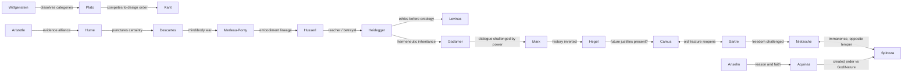

# House Dynamics Map

## Force fields

The house is not divided into permanent teams. It has five shifting force fields:

1. **Certainty:** Descartes, Anselm, Aquinas, Kant seek foundations; Hume, Wittgenstein, Camus resist them.
2. **Authority:** Plato, Aristotle, Kant and Hegel naturally design systems; Marx, Nietzsche and Sartre
   challenge who authorised the designers.
3. **Embodiment:** Merleau-Ponty, Husserl and Heidegger make the body philosophically visible; illness,
   hunger, attraction and exhaustion prevent the house from living as pure intellect.
4. **Violence:** Aquinas, Hegel, Marx, Nietzsche and Sartre can justify force under different conditions;
   Kant, Camus and Levinas impose incompatible limits.
5. **Interpretation:** Gadamer believes understanding can emerge; Wittgenstein questions shared grammar;
   Marx questions power; Descartes questions the forecast; Levinas questions what statistics conceal.

## Relationship graph

## Domestic behaviour matrix

| Thinker | Chore politics | Camera behaviour | Tablet wound | Under stress |
|---|---|---|---|---|
| Plato | assigns roles by aptitude | treats audience as cave-prisoners | sees philosophy become footnotes | forms an inner council |
| Aristotle | builds rota and inventory | studies observation effects | confronts slavery and sexism | classifies the threat |
| Anselm | serves as devotion | addresses God, not viewers | encounters centuries of objections | seeks necessary proof |
| Aquinas | turns meals into ordered community | teaches patiently | sees synthesis fragmented | writes just-war criteria |
| Descartes | checks every utensil and sensor | tests for edited continuity | learns the caricature of dualism | doubts allies and memory |
| Spinoza | cooks without possessiveness | ignores performance incentives | reads excommunication and influence | maps affects and calms fear |
| Hume | cooks well and trades jokes | charms the unseen audience | enjoys becoming canonical | refuses certainty past evidence |
| Kant | makes an exact timetable | acts as if universally observed | finds duties used rigidly | becomes more procedural |
| Hegel | narrates conflicts as development | absorbs cameras into history | sees rival schools inherit him | totalises the crisis |
| Marx | exposes invisible labour | speaks through cameras to workers | sees states claim his name | organises refusal |
| Nietzsche | rejects equal rota as herd morality | performs, then hates himself for it | discovers appropriation and collapse | provokes decisive risk |
| Husserl | documents experience precisely | brackets the audience | watches phenomenology fracture | suspends judgement too long |
| Heidegger | claims the garden and workshop | calls filming technological enframing | cannot evade Nazism | retreats into obscurity |
| Wittgenstein | repairs rather than schedules | refuses confession-room theatre | meets both versions of himself | becomes brutally clarifying |
| Gadamer | mediates meals and disputes | treats viewers as future interpreters | sees tradition exceed intention | prolongs dialogue |
| Merleau-Ponty | notices exhaustion and exclusion | studies bodily self-consciousness | sees unfinished work fossilised | removes the earpiece |
| Sartre | contests assigned roles | knowingly performs authenticity | relives the Camus break | forces a choice |
| Camus | does unclaimed chores | speaks plainly, distrusts spectacle | sees himself turned into slogans | draws a line against murder |
| Levinas | attends to the vulnerable first | worries filming destroys encounter | sees ethics systematised | refuses sacrificial arithmetic |

## Arrival order and destabilisation

1. **Aristotle** establishes observation and household competence.
2. **Descartes** makes the house doubt its senses and handlers.
3. **Hume** turns doubt against certainty without becoming paralysed.
4. **Kant** builds the first rules and charter procedure.
5. **Nietzsche** makes obedience itself suspect.
6. **Marx** exposes labour, ownership, and the selection committee.
7. **Husserl** imposes descriptive discipline after ideological chaos.
8. **Merleau-Ponty** reveals what the earpieces and cameras erase.
9. **Heidegger** attacks the retrieval machine's view of persons.
10. **Levinas** makes Heidegger's moral authority the crisis.
11. **Gadamer** attempts repair without erasing history.
12. **Plato** arrives late enough to find a city already constituted.
13. **Aquinas** offers synthesis and rules for justified defence.
14. **Anselm** radicalises the relation between proof and existence.
15. **Spinoza** changes the emotional temperature and concept of survival.
16. **Hegel** interprets the catastrophe as history's transformation.
17. **Sartre** insists interpretation is already a choice.
18. **Camus** refuses the murder hidden in abstractions.
19. **Wittgenstein** arrives last and asks whether their central problem is malformed.

## Pressure events

- Food delivery stops for thirty-six hours: abstract justice becomes rationing.
- One earpiece mistranslates *guest* as *occupier*: the language system becomes a political actor.
- A private search history leaks: legacy-reading becomes surveillance and shame.
- Nietzsche collapses physically during a debate about strength.
- A cleaner appears behind the glass: Marx's invisible labour acquires a face.
- The garden sky glitches: Descartes' suspicion gains evidence.
- A bunker authority publishes selection rules that mirror a phrase spoken only in the confession room.
- Residents learn that their charter language is being ingested by automated bunker-allocation systems.
- One philosopher is offered release in exchange for a private recommendation.
- The group may retrieve a twentieth thinker, but doing so shortens the deadline.

## Pair scenes worth writing first

- Hume cooking while Kant explains why the recipe must be followed exactly.
- Nietzsche asking Spinoza whether serenity is only exhaustion with better manners.
- Levinas sitting silently beside an ill Nietzsche after condemning his ethics.
- Marx and Aristotle inspecting the service corridor and discovering who keeps the experiment alive.
- Merleau-Ponty teaching Descartes to navigate the house without his earpiece.
- Camus and Sartre washing dishes after their public argument, unable to stop knowing one another.
- Wittgenstein repairing a tablet while Plato asks whether the page contains the thinker or only his shadow.
- Gadamer attempting reconciliation between Heidegger and Levinas and discovering that dialogue is not absolution.
