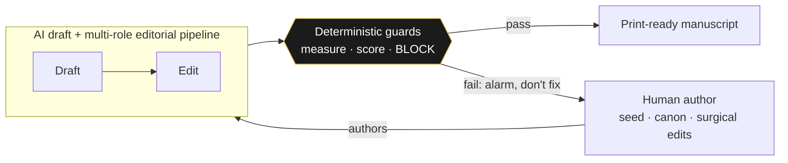
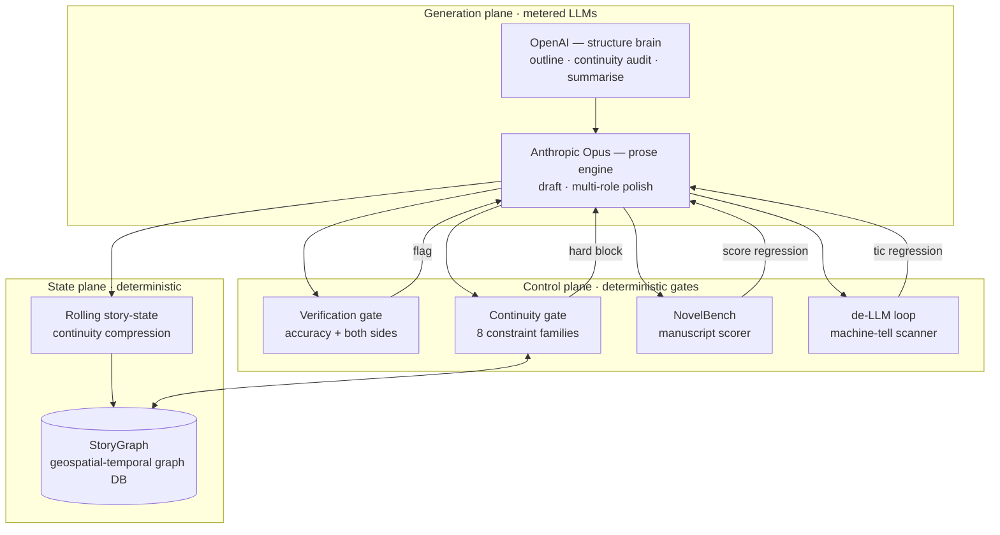
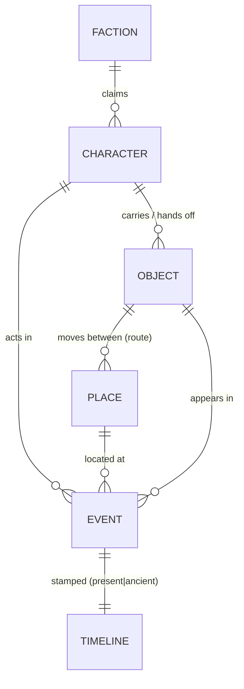
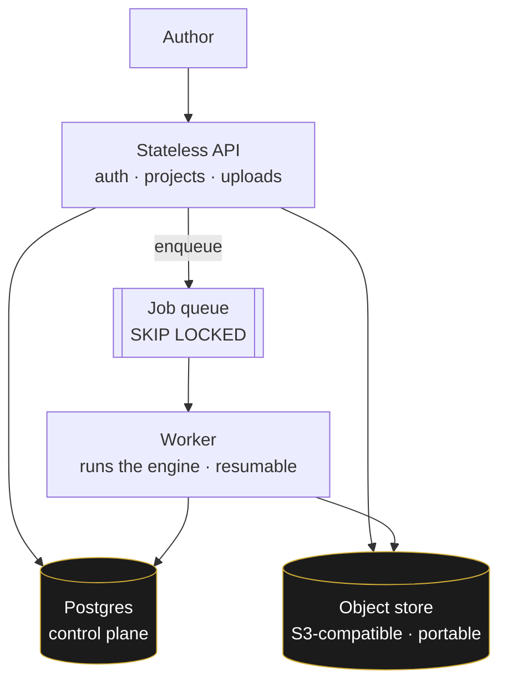
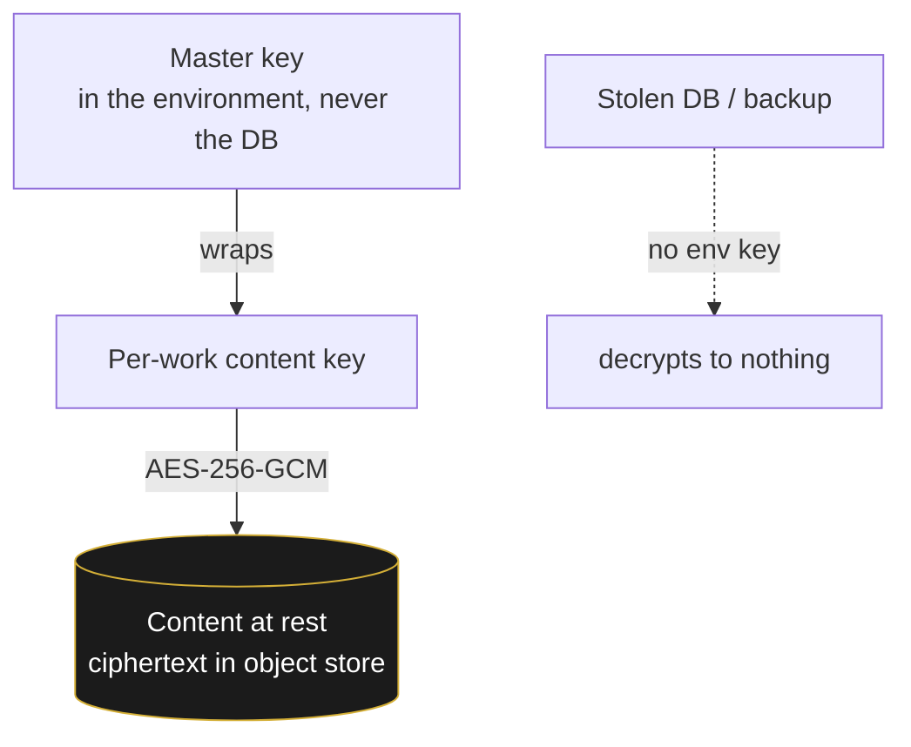
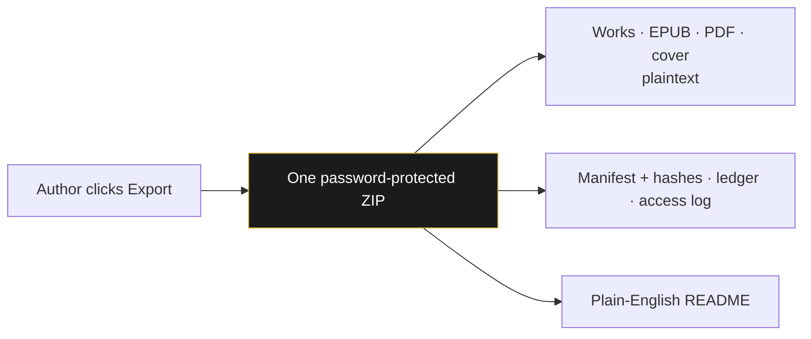
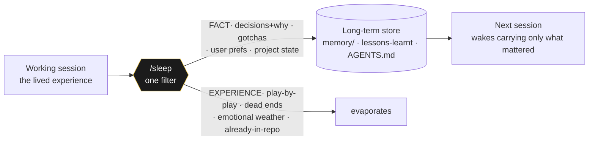

# The technology behind the library

> **What this is.** A plain-English, diagram-led tour of the manuscript-craft studio that produces
> the books in this library — written for an engineering leader who wants to see the *system design*,
> not the prose. It describes the architecture and the guardrails. It does **not** publish the
> proprietary engine itself (the prompts, the scoring models, the graph schema, the gate internals);
> those are private IP. This is the blueprint a CTO can read in ten minutes.
>
> *The author of these tools is available for consulting.* — [arjunabadger.press](https://arjunabadger.press)
>
> **For authors & editors** — what the workshop offers, who it is for (including established
> authors), and the upload → wizard → Go → proofread flow → **[The workshop](FOR_AUTHORS.md)**.

---

## 0. The one invariant everything hangs on

**Tools measure and sound the alarm. They do not generate, and they do not drive.**

A human writes the soul of the book. Large models draft and edit *under* that authorship. A layer of
deterministic tooling stands guard — it checks, scores, and **blocks**, but it never writes the
voice. This is the line that separates "AI slop" from a book a person is proud to sign: the machine
is a *gate and a microscope*, not the author.

This single rule is why the output reads like a person wrote it — and it is the rule most AI-content
pipelines get exactly backwards (they let the model drive and bolt a spell-checker on the end).

---

## 1. System overview

Three planes: a **generation plane** (multi-provider LLMs), a **state plane** (a continuity graph +
rolling story-state), and a **control plane** (the gates and scorers that decide whether a chapter is
allowed to exist). Generation is the only place tokens are spent; everything else is deterministic.

| Stage | Provider | Role | Output |
|---|---|---|---|
| 1 · Outline | OpenAI | structure brain (blueprint-aware) | chapter plan |
| 2a · Draft | Anthropic (Opus) | prose engine | raw chapter |
| 2b · Polish | OpenAI + Anthropic | multi-role editorial pipeline (triage → structure → character → line → dialogue → **gatekeeper**) | modulated chapter |
| 2c · Continuity audit | OpenAI | auditor (structured JSON) | issues → one targeted fix pass if errors |
| 2c′ · Graph gate | — | re-ingest + constraint check | **hard block** on any violation |
| 2d · Summarise | OpenAI | continuity compression | rolling story-state |
| 3 · Merge | — | deterministic assembly | print-ready manuscript |

Every chapter is checkpointed; a re-run **resumes** and skips completed work. The polish stage's last
pass is a **style gatekeeper** that may *reject a flattened revision and fall back to the stronger
draft* — an LLM judging an LLM, with the human's protected spans injected so the things that make the
prose human are never edited out.

---

## 2. StoryGraph — a geospatial-temporal continuity graph

The spine of the system. Every chapter is parsed into a graph DB whose nodes are **characters,
places, objects, factions, and events**, and whose edges carry **time** and **space**. Two axes make
it more than a wiki:

- **Temporal** — a *two-layer timeline* (a present-day chronology braided with an ancient one). The
  gate asserts the braid **closes** and that no fragment is orphaned in time.
- **Geospatial** — places and the movement of key objects between them form a tracked route. The gate
  asserts an object's location chain is **unbroken** (you cannot read a relic in Egypt that was last
  seen, unmoved, in South Africa).

On every chapter the graph is **re-ingested from scratch** and a constraint checker runs across the
whole work — eight families, including the state-machine of who-knows-what, the relay/hand-off chain,
the key-chain of plot-critical objects, the two-layer timeline braid, cross-book payoffs, and the
"physics" rules of the world. **Any violation is a hard block** — the chapter does not pass until it
is fixed. This is the difference between a continuity *editor* (catches some) and a continuity *gate*
(catches all, deterministically, every run).

---

## 3. NovelBench — a read-only manuscript scorer

A genre-aware scorer that grades a finished manuscript on craft dimensions (tension, pacing, agency,
structure conformance, voice, over-explanation, and more) against per-genre targets. It is
**read-only**: it scores, it never rewrites. Its job is to turn "this feels off" into a *number that
moved*, so a revision can be judged by whether it actually improved the book or just changed it.

It runs in two tiers: a free **local/deterministic** pass (sentence-layer metrics) on every build,
and a metered **LLM scorecard** for a deeper read when it's worth the spend.

---

## 4. The de-LLM loop — hunting the machine tells

A closed editorial loop whose only goal is "no obvious craft issues or LLM tells." Three components
chase each other until only material creative changes remain:

1. **A brutal cold-read agent** (sentence layer) and a **structural craft audit** (the layer above —
   voice homogenisation, gravitas inflation, over-polished action, reveal/reaction order) find the
   problems a model's prose falls into.
2. Each finding is **re-incorporated into the engine** — the prompts, the style guide, and a
   deterministic **tic scanner** that counts the specific machine-tells against falling targets.
3. A surgical, human-in-the-loop prose pass fixes them. Then the loop runs again.

The point: the system **learns from its own failures**. A tell found once becomes a guardrail that
catches it forever after — the prose quality ratchets, it doesn't drift.

---

## 5. The verification gate — accuracy + both sides

Non-negotiable, and documented in full: every real-world claim is fact-checked against live sources,
and every *contested* claim is required to carry **both sides**. The bar is Andy Weir / Michael
Crichton / Dan Brown — "a hostile expert with a search engine cannot catch a silent factual error,
and a fair-minded reader cannot accuse the book of one-sided history."

→ **[Read the Verification Gate spec](VERIFICATION_GATE.md)**

---

## 6. Why a CTO should care

This is a working reference implementation of the things every team is now trying to get right with
generative AI:

| Capability | How it shows up here |
|---|---|
| **Human-in-the-loop by design** | the author drives; the model never has the last word — the gatekeeper can fall back to the human's draft |
| **Guardrails & hard gates** | continuity gate + verification gate **block** bad output; they don't politely suggest |
| **Deterministic evals** | NovelBench + the tic scanner turn quality into numbers that gate regressions, like tests in CI |
| **Multi-provider routing** | the right model for the job — a structure brain and a prose engine, not one model forced to do both |
| **State & memory at scale** | a graph DB + rolling compression hold a 90k-word, multi-book world in continuity |
| **Self-improving loop** | failures are converted into permanent, deterministic checks |
| **Cost discipline** | tokens spent only in the generation plane; everything else is free and deterministic |

The invariant — *measure, don't generate; the human authors, the machine guards* — is portable to any
domain where AI output has to be trustworthy: legal, medical, finance, code. The books are the proof
that it works end to end.

> **Want this in your stack?** The author of this system consults on AI pipelines, human-in-the-loop
> design, and guardrail/eval architecture. → [arjunabadger.press](https://arjunabadger.press)

---

## 7. The platform — the studio as a portable, multi-tenant service

The engine above produces *this* library. The same machinery also runs as a **service** other
authors can use: a multi-tenant SaaS where an author brings a manuscript and notes, answers a short
wizard, and gets back a proofread-ready book — the workshop, productised.

It is built **cloud-agnostic on purpose**. State lives in two portable places — a Postgres control
plane and an **S3-compatible** object store (R2 / B2 / S3 / MinIO, chosen by an env var, never a
vendor SDK) — so the whole thing moves between hosts without a rewrite. The web tier is a **stateless
API**; the heavy generation runs in a **broker-free worker queue** (Postgres `FOR UPDATE SKIP
LOCKED`), so workers scale horizontally and a crashed job **resumes** from its last checkpoint rather
than restarting.

A work is **private by default**. It becomes public only when its author asks and the press accepts —
publication and wide distribution (the library, plus any external stores) are tracked as explicit,
auditable states, never an accident. The control plane stays vendor-neutral so an author's work is
never locked to one cloud.

**This library runs on that platform.** The catalogue, the read-online view, and the EPUB/PDF
downloads you see here are served by the platform's own public reader — the same engine, hosting its
own shop window. There is no separate stack to keep in sync.

---

## 8. Encryption, transparency, and the right to leave

Author work is private and protected — and we are **honest about exactly what that means**. We do not
claim a "we literally cannot read it" guarantee, because the things authors actually want — an AI
engine that works on the prose, a one-click export of everything they own, human support — all
require that the platform *can* read content. Instead the promise is **operational and accountable**,
and stated plainly.

**Encrypted at rest.** Every author's content is encrypted at rest under a key held only in the
running service's environment, never in the database. A stolen database — or a stolen backup — is
ciphertext: without the environment key it decrypts to nothing.

**Accountable, not unable.** The platform can read content when it must — to run the engine, to build
your export, to help with a support issue — and **every such read is written to an access log you can
see**. The honest substitute for "we can't look" is "we can, we record it, and you can check." We
don't pretend to a guarantee the product contradicts.

**The right to leave — no lock-in.** At any time you can download **everything you own** in a single
password-protected ZIP: every work and its built files (manuscript, EPUB, PDF, cover) as plaintext, a
manifest of what we hold (with integrity hashes), your billing ledger, and your access log — plus a
plain-English README. Leaving is a button, not a support ticket.

The stance in one line: **private, encrypted at rest, every read logged, and yours to take and leave
whenever you want.** What you do with your data after you export it is yours to protect.

---

## 9. Access & economics — bring your own key, or BadgerBucks

Two ways to power the metered generation, and a deliberate ethic about who pays.

- **BYOK** — bring your own model-provider key; the token cost is yours, and your key is stored
  **envelope-encrypted** (the database never holds it in the clear).
- **BadgerBucks** — the platform's prepaid token credit, for authors who'd rather not manage a key.

The pricing carries a **geo-subsidy**: the first world subsidises the third. The *credit* is the same
everywhere; the *price* of buying it isn't — wealthier regions pay a multiplier, and a set of
lower-income regions (much of Africa, India, and the ex-British colonies) pay the base rate and
receive a small standing grant, so a writer without a card can still use the studio. It is a small,
explicit redistribution baked into the billing, not a marketing line.

---

## 10. `/sleep` — memory consolidation as a first-class step

The table above lists *state & memory at scale* as a capability — a graph DB and rolling compression
holding a multi-book world in continuity. That covers the **engine's** memory. It does not cover the
**agent's** memory: the question of what an AI co-worker should carry from one working session into
the next. That turned out to have a missing primitive, and closing it produced a small, portable tool
that ships on its own.

**The problem.** A coding agent has two memories and, by default, no bridge between them:

- **working memory** — the live session, everything said this turn; and
- **a long-term store** — the durable facts a future session needs (`CLAUDE.md`, a `memory/`
  directory, a Cursor `lessons-learnt.mdc`, an `AGENTS.md`, a docs-of-record table).

The two controls you're handed are both wrong for real work. **`/clear` is death** — it doesn't close
the eye, it deletes the *person*; the next session inherits nothing. **Never clearing is insomnia** —
the context grows without bound (cost, latency) and the durable facts stay trapped in a transcript no
future session will ever read. Biology already solved this with the third option: **sleep** — the
nightly, lossy, *intentional* move that keeps what the day taught and discards the lived texture of
it. You don't keep the dream; you keep the lesson.

**The mechanism.** `/sleep` runs the whole session through one question — *what must survive the
session ending, and what was only the texture of getting there?* — sorts every item into **FACT**
(persists) or **EXPERIENCE** (evaporates), **auto-detects the repo's own store** and writes in *that*
store's format, **shows the consolidation envelope before writing** (memory is hard to un-write), and
**dedups and prunes** rather than piling up. It is the same human-in-the-loop, measure-don't-sprawl
discipline as the rest of this system, pointed at the agent's memory instead of the manuscript.

| Design choice | Why it matters to an engineering leader |
|---|---|
| **Lossy on purpose** | the value of a memory store is everything it *didn't* write; a store that swallows everything is noise. Signal beats volume — the same reason evals gate regressions instead of logging everything. |
| **Store-agnostic** | one ritual across a polyglot estate — a Cursor repo's `lessons-learnt.mdc` and a Claude-native `memory/` dir are written in their own idioms, no new format imposed. |
| **Envelope before write** | the human approves what their future self inherits; nothing outward-facing or durable is persisted blind. |
| **Reflex via hooks, not magic** | a `PreCompact` / `SessionEnd` hook *reminds*; it never silently writes — the human keeps the brake. |

**It is open source.** The skill, the reminder hook, and the install steps are public, MIT-licensed:
**[github.com/ajgreyling/claude-sleep-skill](https://github.com/ajgreyling/claude-sleep-skill)**. The
longer-form story of where it came from — and the conversation about what it means for a machine to
"remember" at all — is in [The kettle and the blink](../site/content/writing/the-kettle-and-the-blink.md)
on the press site.

> The discipline is the same one this whole document argues for: **the human authors; the machine
> measures, filters, and asks before it commits.** `/sleep` just applies it one layer up — to memory
> itself.
