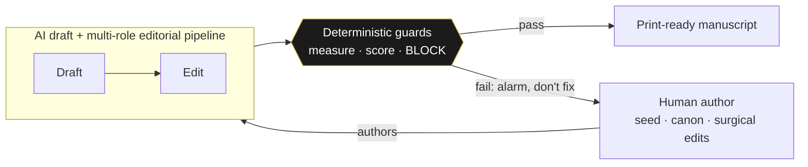
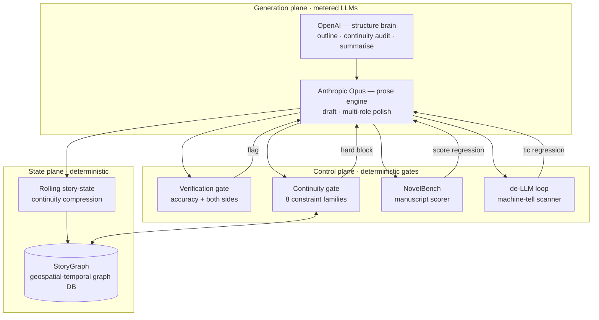
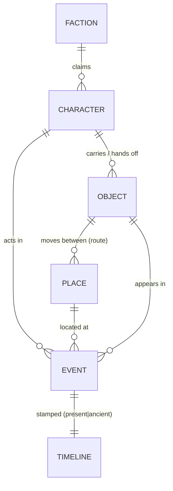
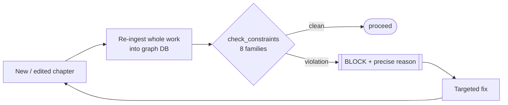

# The technology behind the library

> **What this is.** A plain-English, diagram-led tour of the manuscript-craft studio that produces
> the books in this library — written for an engineering leader who wants to see the *system design*,
> not the prose. It describes the architecture and the guardrails. It does **not** publish the
> proprietary engine itself (the prompts, the scoring models, the graph schema, the gate internals);
> those are private IP. This is the blueprint a CTO can read in ten minutes.
>
> *The author of these tools is available for consulting.* — [arjunabadger.press](https://arjunabadger.press)

---

## 0. The one invariant everything hangs on

**Tools measure and sound the alarm. They do not generate, and they do not drive.**

A human writes the soul of the book. Large models draft and edit *under* that authorship. A layer of
deterministic tooling stands guard — it checks, scores, and **blocks**, but it never writes the
voice. This is the line that separates "AI slop" from a book a person is proud to sign: the machine
is a *gate and a microscope*, not the author.

This single rule is why the output reads like a person wrote it — and it is the rule most AI-content
pipelines get exactly backwards (they let the model drive and bolt a spell-checker on the end).

---

## 1. System overview

Three planes: a **generation plane** (multi-provider LLMs), a **state plane** (a continuity graph +
rolling story-state), and a **control plane** (the gates and scorers that decide whether a chapter is
allowed to exist). Generation is the only place tokens are spent; everything else is deterministic.

| Stage | Provider | Role | Output |
|---|---|---|---|
| 1 · Outline | OpenAI | structure brain (blueprint-aware) | chapter plan |
| 2a · Draft | Anthropic (Opus) | prose engine | raw chapter |
| 2b · Polish | OpenAI + Anthropic | multi-role editorial pipeline (triage → structure → character → line → dialogue → **gatekeeper**) | modulated chapter |
| 2c · Continuity audit | OpenAI | auditor (structured JSON) | issues → one targeted fix pass if errors |
| 2c′ · Graph gate | — | re-ingest + constraint check | **hard block** on any violation |
| 2d · Summarise | OpenAI | continuity compression | rolling story-state |
| 3 · Merge | — | deterministic assembly | print-ready manuscript |

Every chapter is checkpointed; a re-run **resumes** and skips completed work. The polish stage's last
pass is a **style gatekeeper** that may *reject a flattened revision and fall back to the stronger
draft* — an LLM judging an LLM, with the human's protected spans injected so the things that make the
prose human are never edited out.

---

## 2. StoryGraph — a geospatial-temporal continuity graph

The spine of the system. Every chapter is parsed into a graph DB whose nodes are **characters,
places, objects, factions, and events**, and whose edges carry **time** and **space**. Two axes make
it more than a wiki:

- **Temporal** — a *two-layer timeline* (a present-day chronology braided with an ancient one). The
  gate asserts the braid **closes** and that no fragment is orphaned in time.
- **Geospatial** — places and the movement of key objects between them form a tracked route. The gate
  asserts an object's location chain is **unbroken** (you cannot read a relic in Egypt that was last
  seen, unmoved, in South Africa).

On every chapter the graph is **re-ingested from scratch** and a constraint checker runs across the
whole work — eight families, including the state-machine of who-knows-what, the relay/hand-off chain,
the key-chain of plot-critical objects, the two-layer timeline braid, cross-book payoffs, and the
"physics" rules of the world. **Any violation is a hard block** — the chapter does not pass until it
is fixed. This is the difference between a continuity *editor* (catches some) and a continuity *gate*
(catches all, deterministically, every run).

---

## 3. NovelBench — a read-only manuscript scorer

A genre-aware scorer that grades a finished manuscript on craft dimensions (tension, pacing, agency,
structure conformance, voice, over-explanation, and more) against per-genre targets. It is
**read-only**: it scores, it never rewrites. Its job is to turn "this feels off" into a *number that
moved*, so a revision can be judged by whether it actually improved the book or just changed it.

It runs in two tiers: a free **local/deterministic** pass (sentence-layer metrics) on every build,
and a metered **LLM scorecard** for a deeper read when it's worth the spend.

---

## 4. The de-LLM loop — hunting the machine tells

A closed editorial loop whose only goal is "no obvious craft issues or LLM tells." Three components
chase each other until only material creative changes remain:

1. **A brutal cold-read agent** (sentence layer) and a **structural craft audit** (the layer above —
   voice homogenisation, gravitas inflation, over-polished action, reveal/reaction order) find the
   problems a model's prose falls into.
2. Each finding is **re-incorporated into the engine** — the prompts, the style guide, and a
   deterministic **tic scanner** that counts the specific machine-tells against falling targets.
3. A surgical, human-in-the-loop prose pass fixes them. Then the loop runs again.

The point: the system **learns from its own failures**. A tell found once becomes a guardrail that
catches it forever after — the prose quality ratchets, it doesn't drift.

---

## 5. The verification gate — accuracy + both sides

Non-negotiable, and documented in full: every real-world claim is fact-checked against live sources,
and every *contested* claim is required to carry **both sides**. The bar is Andy Weir / Michael
Crichton / Dan Brown — "a hostile expert with a search engine cannot catch a silent factual error,
and a fair-minded reader cannot accuse the book of one-sided history."

→ **[Read the Verification Gate spec](VERIFICATION_GATE.md)**

---

## 6. Why a CTO should care

This is a working reference implementation of the things every team is now trying to get right with
generative AI:

| Capability | How it shows up here |
|---|---|
| **Human-in-the-loop by design** | the author drives; the model never has the last word — the gatekeeper can fall back to the human's draft |
| **Guardrails & hard gates** | continuity gate + verification gate **block** bad output; they don't politely suggest |
| **Deterministic evals** | NovelBench + the tic scanner turn quality into numbers that gate regressions, like tests in CI |
| **Multi-provider routing** | the right model for the job — a structure brain and a prose engine, not one model forced to do both |
| **State & memory at scale** | a graph DB + rolling compression hold a 90k-word, multi-book world in continuity |
| **Self-improving loop** | failures are converted into permanent, deterministic checks |
| **Cost discipline** | tokens spent only in the generation plane; everything else is free and deterministic |

The invariant — *measure, don't generate; the human authors, the machine guards* — is portable to any
domain where AI output has to be trustworthy: legal, medical, finance, code. The books are the proof
that it works end to end.

> **Want this in your stack?** The author of this system consults on AI pipelines, human-in-the-loop
> design, and guardrail/eval architecture. → [arjunabadger.press](https://arjunabadger.press)
