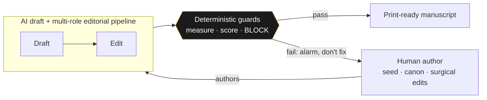
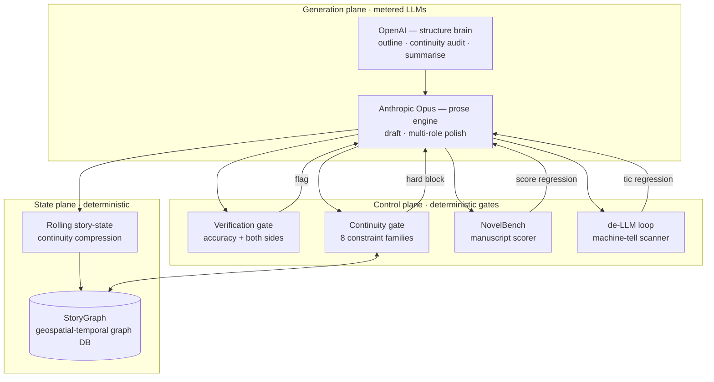
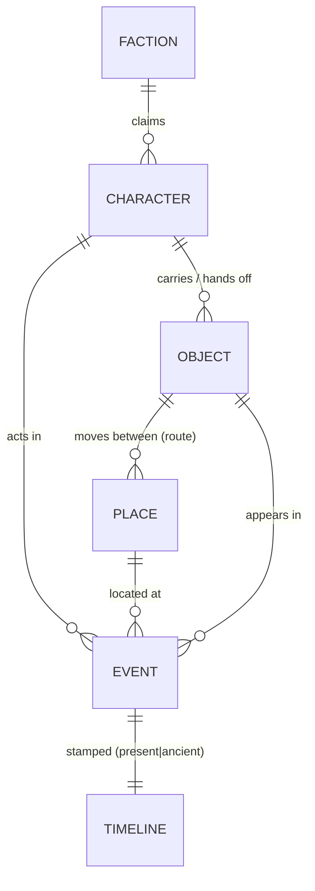
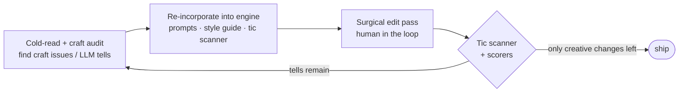
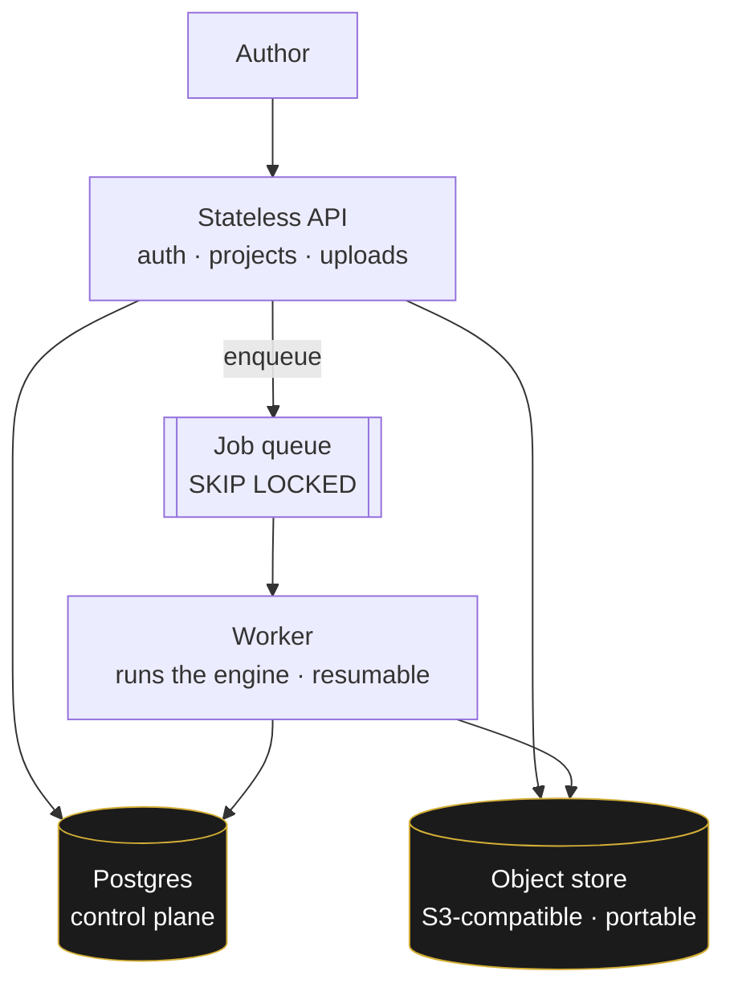
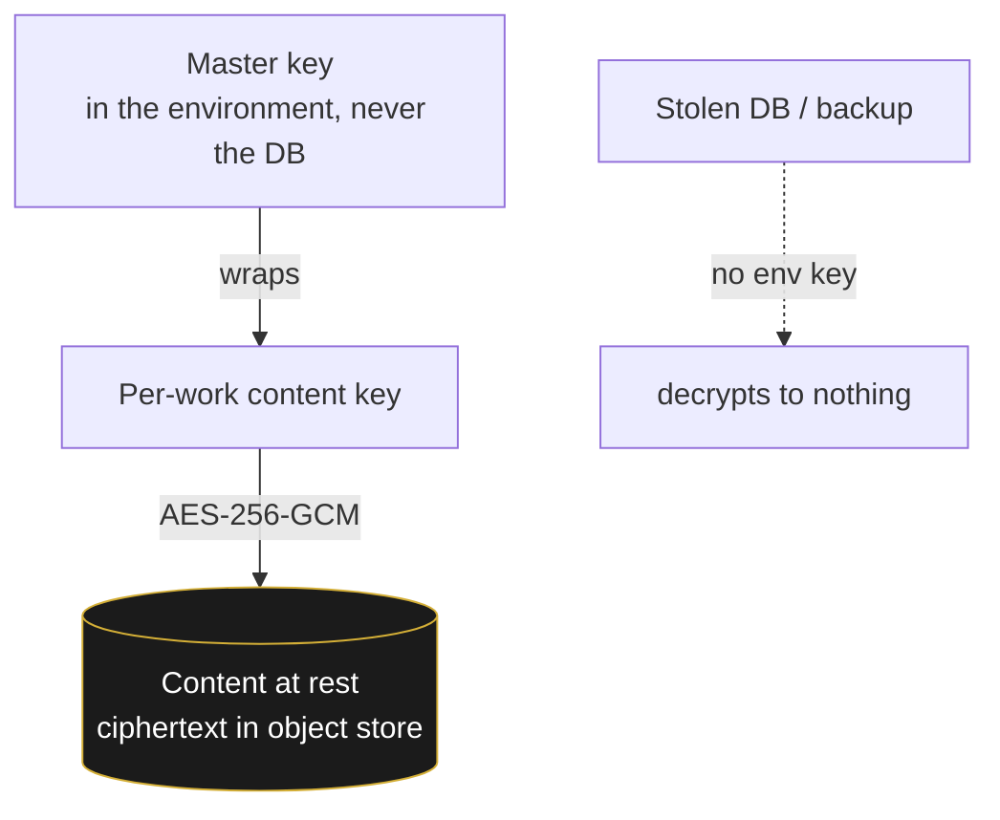
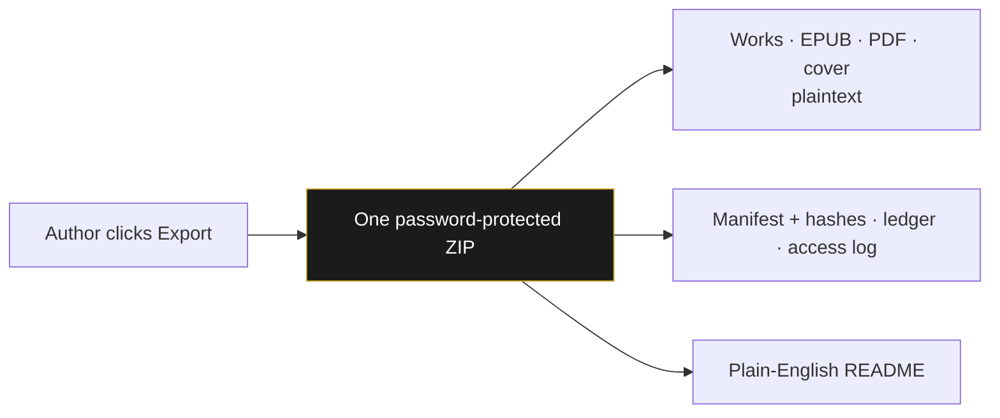
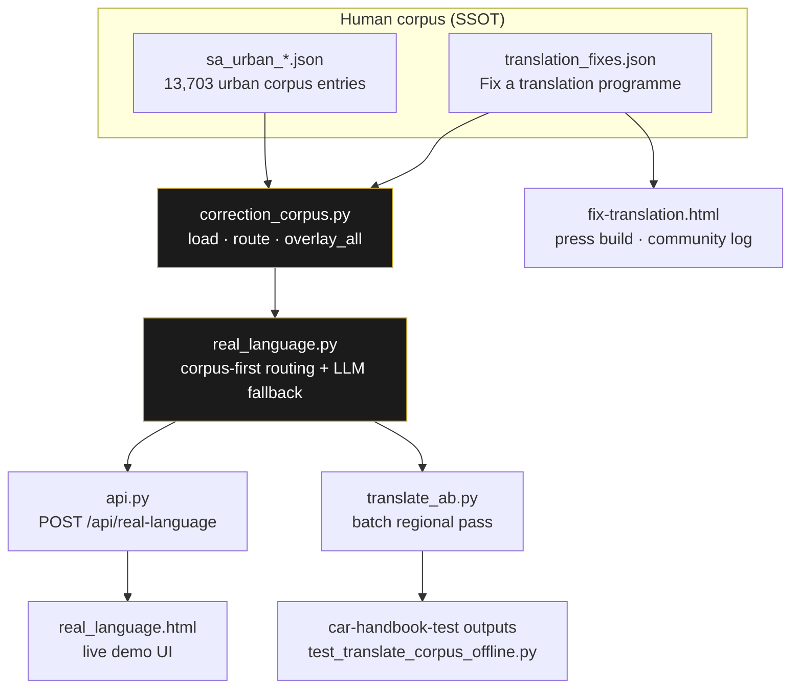
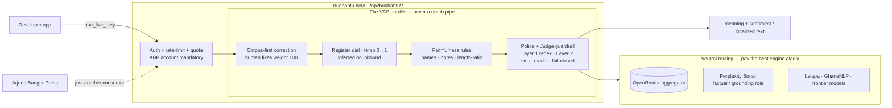
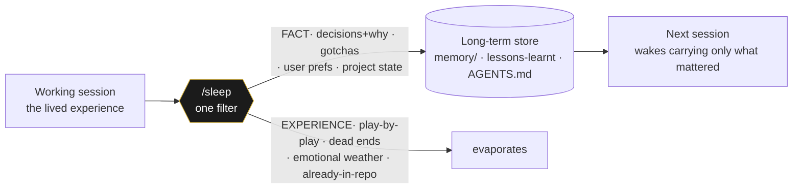

# The technology behind the library

> **What this is.** A plain-English, diagram-led tour of the manuscript-craft studio that produces
> the books in this library — written for an engineering leader who wants to see the *system design*,
> not the prose. It describes the architecture and the guardrails. It does **not** publish the
> proprietary engine itself (the prompts, the scoring models, the graph schema, the gate internals);
> those are private IP. This is the blueprint a CTO can read in ten minutes.
>
> *The author of these tools is available for consulting.* — [arjunabadger.press](https://arjunabadger.press)
>
> **For authors & editors** — what the workshop offers, who it is for (including established
> authors), and the upload → wizard → Go → proofread flow → **[The workshop](FOR_AUTHORS.md)**.

---

## 0. The one invariant everything hangs on

**Tools measure and sound the alarm. They do not generate, and they do not drive.**

A human writes the soul of the book. Large models draft and edit *under* that authorship. A layer of
deterministic tooling stands guard — it checks, scores, and **blocks**, but it never writes the
voice. This is the line that separates "AI slop" from a book a person is proud to sign: the machine
is a *gate and a microscope*, not the author.

This single rule is why the output reads like a person wrote it — and it is the rule most AI-content
pipelines get exactly backwards (they let the model drive and bolt a spell-checker on the end).

---

## 1. System overview

Three planes: a **generation plane** (multi-provider LLMs), a **state plane** (a continuity graph +
rolling story-state), and a **control plane** (the gates and scorers that decide whether a chapter is
allowed to exist). Generation is the only place tokens are spent; everything else is deterministic.

| Stage | Provider | Role | Output |
|---|---|---|---|
| 1 · Outline | OpenAI | structure brain (blueprint-aware) | chapter plan |
| 2a · Draft | Anthropic (Opus) | prose engine | raw chapter |
| 2b · Polish | OpenAI + Anthropic | multi-role editorial pipeline (triage → structure → character → line → dialogue → **gatekeeper**) | modulated chapter |
| 2c · Continuity audit | OpenAI | auditor (structured JSON) | issues → one targeted fix pass if errors |
| 2c′ · Graph gate | — | re-ingest + constraint check | **hard block** on any violation |
| 2d · Summarise | OpenAI | continuity compression | rolling story-state |
| 3 · Merge | — | deterministic assembly | print-ready manuscript |

Every chapter is checkpointed; a re-run **resumes** and skips completed work. The polish stage's last
pass is a **style gatekeeper** that may *reject a flattened revision and fall back to the stronger
draft* — an LLM judging an LLM, with the human's protected spans injected so the things that make the
prose human are never edited out.

---

## The exposé — one page per tool

Each part of the studio has its own deep-dive. The sections below are the short version; follow the link
for the full page with its own diagrams.

| Tool | What it does | Kind |
|---|---|---|
| **[StoryGraph — the continuity gate](tech-storygraph.html)** | hard-gates the world's internal logic across a whole book (and across books) | deterministic |
| **[NovelBench](tech-novelbench.html)** | read-only craft scorer — turns "feels off" into "number moved" | deterministic + AI |
| **[The de-LLM loop](tech-de-llm-loop.html)** | finds and permanently kills duplicate machine-tells | AI + deterministic |
| **[The editorial pipeline](tech-editorial-pipeline.html)** | outline → draft → polish → gatekeeper → gate → merge | AI + deterministic |
| **[The verification gate](tech-verification-gate.html)** | fact-checks every claim; both sides on contested history | AI (cited) |
| **[The police + judge guardrail](tech-guardrails.html)** | two-layer, fail-closed safety on both directions | deterministic + AI |
| **[People's Language](tech-peoples-language.html)** | corpus-first, register-aware translation | AI + corpus |
| **[Buabantu](tech-buabantu.html)** | the translation engine, spun off as a closed-beta API | product |

---

## 2. StoryGraph — a geospatial-temporal continuity graph

The spine of the system. Every chapter is parsed into a graph DB whose nodes are **characters,
places, objects, factions, and events**, and whose edges carry **time** and **space**. Two axes make
it more than a wiki:

- **Temporal** — a *two-layer timeline* (a present-day chronology braided with an ancient one). The
  gate asserts the braid **closes** and that no fragment is orphaned in time.
- **Geospatial** — places and the movement of key objects between them form a tracked route. The gate
  asserts an object's location chain is **unbroken** (you cannot read a relic in Egypt that was last
  seen, unmoved, in South Africa).

On every chapter the graph is **re-ingested from scratch** and a constraint checker runs across the
whole work — eight families, including the state-machine of who-knows-what, the relay/hand-off chain,
the key-chain of plot-critical objects, the two-layer timeline braid, cross-book payoffs, and the
"physics" rules of the world. **Any violation is a hard block** — the chapter does not pass until it
is fixed. This is the difference between a continuity *editor* (catches some) and a continuity *gate*
(catches all, deterministically, every run).

→ **[Full page: StoryGraph — the continuity gate](tech-storygraph.html)**

---

## 3. NovelBench — a read-only manuscript scorer

A genre-aware scorer that grades a finished manuscript on craft dimensions (tension, pacing, agency,
structure conformance, voice, over-explanation, and more) against per-genre targets. It is
**read-only**: it scores, it never rewrites. Its job is to turn "this feels off" into a *number that
moved*, so a revision can be judged by whether it actually improved the book or just changed it.

It runs in two tiers: a free **local/deterministic** pass (sentence-layer metrics) on every build,
and a metered **LLM scorecard** for a deeper read when it's worth the spend.

→ **[Full page: NovelBench — the read-only manuscript scorer](tech-novelbench.html)**

---

## 4. The de-LLM loop — hunting the machine tells

A closed editorial loop whose only goal is "no obvious craft issues or LLM tells." Three components
chase each other until only material creative changes remain:

1. **A brutal cold-read agent** (sentence layer) and a **structural craft audit** (the layer above —
   voice homogenisation, gravitas inflation, over-polished action, reveal/reaction order) find the
   problems a model's prose falls into.
2. Each finding is **re-incorporated into the engine** — the prompts, the style guide, and a
   deterministic **tic scanner** that counts the specific machine-tells against falling targets.
3. A surgical, human-in-the-loop prose pass fixes them. Then the loop runs again.

The point: the system **learns from its own failures**. A tell found once becomes a guardrail that
catches it forever after — the prose quality ratchets, it doesn't drift.

→ **[Full page: the de-LLM loop — and the duplicate-tell eliminators](tech-de-llm-loop.html)**

---

## 5. The verification gate — accuracy + both sides

Non-negotiable, and documented in full: every real-world claim is fact-checked against live sources,
and every *contested* claim is required to carry **both sides**. The bar is Andy Weir / Michael
Crichton / Dan Brown — "a hostile expert with a search engine cannot catch a silent factual error,
and a fair-minded reader cannot accuse the book of one-sided history."

→ **[Read the Verification Gate spec](VERIFICATION_GATE.md)**

---

## 6. Why a CTO should care

This is a working reference implementation of the things every team is now trying to get right with
generative AI:

| Capability | How it shows up here |
|---|---|
| **Human-in-the-loop by design** | the author drives; the model never has the last word — the gatekeeper can fall back to the human's draft |
| **Guardrails & hard gates** | continuity gate + verification gate **block** bad output; they don't politely suggest |
| **Deterministic evals** | NovelBench + the tic scanner turn quality into numbers that gate regressions, like tests in CI |
| **Multi-provider routing** | the right model for the job — a structure brain and a prose engine, not one model forced to do both |
| **State & memory at scale** | a graph DB + rolling compression hold a 90k-word, multi-book world in continuity |
| **Self-improving loop** | failures are converted into permanent, deterministic checks |
| **Cost discipline** | tokens spent only in the generation plane; everything else is free and deterministic |

The invariant — *measure, don't generate; the human authors, the machine guards* — is portable to any
domain where AI output has to be trustworthy: legal, medical, finance, code. The books are the proof
that it works end to end.

> **Want this in your stack?** The author of this system consults on AI pipelines, human-in-the-loop
> design, and guardrail/eval architecture. → [arjunabadger.press](https://arjunabadger.press)

---

## 7. The platform — the studio as a portable, multi-tenant service

The engine above produces *this* library. The same machinery also runs as a **service** other
authors can use: a multi-tenant SaaS where an author brings a manuscript and notes, answers a short
wizard, and gets back a proofread-ready book — the workshop, productised.

It is built **cloud-agnostic on purpose**. State lives in two portable places — a Postgres control
plane and an **S3-compatible** object store (R2 / B2 / S3 / MinIO, chosen by an env var, never a
vendor SDK) — so the whole thing moves between hosts without a rewrite. The web tier is a **stateless
API**; the heavy generation runs in a **broker-free worker queue** (Postgres `FOR UPDATE SKIP
LOCKED`), so workers scale horizontally and a crashed job **resumes** from its last checkpoint rather
than restarting.

A work is **private by default**. It becomes public only when its author asks and the press accepts —
publication and wide distribution (the library, plus any external stores) are tracked as explicit,
auditable states, never an accident. The control plane stays vendor-neutral so an author's work is
never locked to one cloud.

**This library runs on that platform.** The catalogue, the read-online view, and the EPUB/PDF
downloads you see here are served by the platform's own public reader — the same engine, hosting its
own shop window. There is no separate stack to keep in sync.

---

## 7a. The named stack — and why each piece earns its place

The abstractions above (Postgres control plane, S3-compatible store, stateless API) are deliberately
vendor-neutral. Here is what *actually* runs in production today, and the defensible reason each was
chosen. The throughline is the same two values that shape the whole platform: **privacy** and
**portability — no vendor lock-in.** Every component below was picked so it can be *swapped or
self-hosted*, not because a vendor captured us.

| Layer | Today | Why this one | Exit cost if we leave |
|---|---|---|---|
| **Compute** | [**Render**](https://render.com) | Plain container running `uvicorn saas.api:app` from a public `render.yaml` — no proprietary runtime, no Render-only SDK in the code. It runs the same `docker compose up` locally. | **Low** — any container host (Fly, Railway, a VPS, your laptop) runs the identical image. |
| **LLM access** | [**OpenRouter**](https://openrouter.ai) (one aggregator) + [**Perplexity**](https://www.perplexity.ai) Sonar (the factual layer) | **One key, one bill, logical roles.** Instead of wiring each vendor SDK, the app routes every call through OpenRouter by a *role* (`prose`/`structure`/`grounding`/`judge`) that maps to a model slug in `render.yaml`. Swap any model by editing a slug — no code change. **Perplexity Sonar is the grounding/factual role** (cited answers). For a one-off niche model, a single call passes the slug straight through. | **Low** — `LLM_BACKEND=direct` falls back to vendor keys; the role abstraction means any provider OpenRouter exposes is reachable without an integration. |
| **Database** | [**Neon**](https://neon.tech) | **Postgres, full stop** — chosen because Postgres is known, trusted, and standard; Neon is just managed Postgres with branching, reachable by a plain `DATABASE_URL`. No Neon-specific extensions in the schema. | **Low** — `pg_dump` → restore into any Postgres (RDS, Supabase, self-hosted). The connection string is the only thing that changes. |
| **Object store** | [**Cloudflare R2**](https://www.cloudflare.com/developer-platform/r2/) | Manuscripts, EPUB/PDF, covers — addressed through the **S3 API via an env var (`BLOB_BACKEND`/`BLOB_ENDPOINT`), never a vendor SDK.** R2 adds zero egress fees, which matters for a free public library. | **Low** — point the endpoint at B2, MinIO, or AWS S3; the code does not change. |
| **Auth** | [**Auth0**](https://auth0.com) | Identity is the one thing you must not roll yourself. Auth0 speaks **standard OIDC/OAuth2**, so the app holds tokens, not an Auth0 lock-in; **local email/password auth still works with Auth0 switched off** (`ALLOW_LOCAL_AUTH`), so the platform is never *hostage* to the identity provider. | **Medium** — any OIDC provider (Keycloak self-hosted, Cognito, Clerk) drops in behind the same `/auth/*` routes; local auth is the always-available fallback. |
| **Analytics** | [**Plausible**](https://plausible.io) | **Privacy-first by design** — no cookies, no cross-site tracking, no personal data, GDPR/PECR-clean, and **open-source/self-hostable**. Readers are counted, never surveilled. Chosen *because* it refuses to do what Google Analytics does. | **Low** — it's a single script tag against a domain; self-host the open-source version or drop it entirely with no app changes. |
| **CDN / TLS** | [**Cloudflare**](https://www.cloudflare.com) | Edge cache + free TLS in front of Render. Standard HTTP semantics; nothing in the app depends on it. | **Low** — remove it and Render serves directly, or front it with any CDN. |
| **DNS** | [**Namecheap**](https://www.namecheap.com) | Registrar only. | **Trivial** — transfer the domain. |

**Postgres, specifically, because it is trusted — not novel.** The control plane runs on Postgres
for the least glamorous and most defensible reason: it is the database the author already knows and
trusts. A publishing platform's job is to *not lose people's work*; that calls for the boring,
battle-tested, decades-proven engine with the deepest operational knowledge behind it, not the
newest one. Postgres also doubles as the **broker-free job queue** (`FOR UPDATE SKIP LOCKED`), which
removes an entire vendor dependency — there is no Redis, no SQS, no proprietary message bus to be
locked into.

**One aggregator, a factual layer, and a flexibility hatch.** LLM access follows the same
no-lock-in instinct as everything else: rather than couple the code to Anthropic's and OpenAI's
SDKs, **all model traffic goes through OpenRouter as a single aggregator**, and the app talks in
*roles* — a *prose* engine, a *structure* brain, a *grounding* fact-checker, a *judge* — each role
bound to a model slug in `render.yaml`. Three consequences: (1) **the factual layer is explicit** —
the grounding role is **Perplexity Sonar**, so anywhere the platform needs *checked, cited* facts it
calls one entrypoint that returns an answer **with its sources**, not a confident guess; (2) **niche
models are one call away** — an experimental small or regional model is reachable by passing its slug
straight through, no new integration; (3) **swapping a model is a config edit**, not a deploy of new
code. OpenRouter routes *to* Anthropic and OpenAI rather than trying to defeat them — the same
aggregator posture the press's own language product ([Buabantu](#7c-buabantu--the-real-language-router-api))
takes one level up.

**Extra privacy: bring your own GitHub repo.** Beyond the platform's own encrypted store, an author
who wants maximum control can keep their manuscript in **their own private GitHub repository** and
have the engine work against that — the prose lives in a repo *they* own and can make private,
revoke, or delete, entirely outside the platform's database. (This mirrors how the press itself runs:
the engine repo is private, and prose never lives inside the tooling tree.) For a life-story or a
sensitive manuscript, "the source of truth is a repo only I control" is a stronger privacy posture
than any hosted store can offer.

**The honest test of "no lock-in" is the Exit-cost column.** Every row is **Low** or **Trivial**
except identity, which is **Medium** and even then has a local fallback that needs no third party at
all. That is the difference between *using* a managed service and being *captured* by one: we use the
convenient hosted version today, and the day any of them stops serving us, the move is a config
change and a data copy — not a rewrite.

---

## 7b. Why Python + FastAPI — the honest answer

Most "tech stack rationale" sections are reverse-engineered: a choice gets made, then a tidy
justification gets written around it. Here is the truth instead, because the truth is the stronger
argument.

**The language and the framework were never the point. Shipping books was.** The first version of
this didn't have a backend at all — it was **GitHub Pages**, flat static HTML, because the only
goal that mattered was getting finished books in front of readers without asking anyone's permission.
You don't need a web framework to publish a book; you need a published book. Everything else is
yak-shaving until that's done.

So when a backend *did* become necessary — auth, a job queue, an engine that runs per-author — the
framework wasn't agonised over. **It was delegated.** The constraint I actually cared about was not
"FastAPI vs Django vs Node"; it was a pair of values that *do* matter and that the named-stack table
above already enforces:

1. **Don't get locked into a cloud provider.** The whole reason I'm here is that locked doors are
   what this house was built to route around (see [the origin story](/)). A stack that traded the big
   ebook stores' lock-in for a cloud vendor's lock-in would have missed the entire point. So the test
   was *portability* — a plain container, a plain Postgres URL, an S3 API behind an env var — not the
   brand of the web framework.
2. **Play well with LLMs.** This is an AI-native system: the engine is models, the tooling is built
   *with* a model in the loop, and the codebase has to be one an LLM can read, extend, and reason
   about quickly. Python is the lingua franca of that world — the AI SDKs, the data tooling, the
   examples a model has seen a million of — and **FastAPI is about as legible as a Python web layer
   gets**: typed, declarative, one obvious way to do things, trivially explainable to a model and to
   a human. The framework being *boring and conventional* is a feature, not a confession.

Given those two real constraints, the specific framework genuinely didn't warrant a research project,
so **I let the model pick the conventional default and moved on to the work that mattered.** That is
not a gap in the reasoning — it *is* the reasoning. Spending a week comparing web frameworks to
publish books that were already written would have been exactly the kind of permission-seeking
detour this whole project rejects.

**And the choice is defensible precisely because it's reversible.** The business logic lives in
`service.py`, framework-agnostic and offline-testable; `api.py` is a thin routing shell over it.
Swapping FastAPI for something else would touch the shell, not the engine. A stack you can walk away
from cheaply (the Exit-cost table) is one you're allowed to choose quickly. The discipline went into
the parts that are expensive to get wrong — continuity gates, the verification gate, portability,
privacy — and *not* into the parts that are cheap to change. **Knowing which is which is the skill.**

> The one-line version: **the framework was the least important decision, so it got the least
> deliberation — on purpose. Python and FastAPI win here for being boring, portable, and
> LLM-legible, and the architecture is built so that if they ever stop winning, replacing them is a
> shell swap, not a rewrite.**

---

## 8. Encryption, transparency, and the right to leave

Author work is private and protected — and we are **honest about exactly what that means**. We do not
claim a "we literally cannot read it" guarantee, because the things authors actually want — an AI
engine that works on the prose, a one-click export of everything they own, human support — all
require that the platform *can* read content. Instead the promise is **operational and accountable**,
and stated plainly.

**Encrypted at rest.** Every author's content is encrypted at rest under a key held only in the
running service's environment, never in the database. A stolen database — or a stolen backup — is
ciphertext: without the environment key it decrypts to nothing.

**Accountable, not unable.** The platform can read content when it must — to run the engine, to build
your export, to help with a support issue — and **every such read is written to an access log you can
see**. The honest substitute for "we can't look" is "we can, we record it, and you can check." We
don't pretend to a guarantee the product contradicts.

**The right to leave — no lock-in.** At any time you can download **everything you own** in a single
password-protected ZIP: every work and its built files (manuscript, EPUB, PDF, cover) as plaintext, a
manifest of what we hold (with integrity hashes), your billing ledger, and your access log — plus a
plain-English README. Leaving is a button, not a support ticket.

The stance in one line: **private, encrypted at rest, every read logged, and yours to take and leave
whenever you want.** What you do with your data after you export it is yours to protect.

---

## 9. Access & economics — bring your own key, or BadgerBucks

Two ways to power the metered generation, and a deliberate ethic about who pays.

- **BYOK** — bring your own model-provider key; the token cost is yours, and your key is stored
  **envelope-encrypted** (the database never holds it in the clear).
- **BadgerBucks** — the platform's prepaid token credit, for authors who'd rather not manage a key.

The pricing carries a **geo-subsidy**: the first world subsidises the third. The *credit* is the same
everywhere; the *price* of buying it isn't — wealthier regions pay a multiplier, and a set of
lower-income regions (much of Africa, India, and the ex-British colonies) pay the base rate and
receive a small standing grant, so a writer without a card can still use the studio. It is a small,
explicit redistribution baked into the billing, not a marketing line.

---

## 10. People's Language — corpus-first translation

Parallel editions must read like **people talking**, not textbook flatness. **People's Language**
(*die mense se taal*) is the product name for a stack that routes translation **corpus-first** —
human corrections outrank any model, the way eval gates outrank raw generation elsewhere in this
studio.

### Routing (three steps, one invariant)

| Step | Route | What happens |
|---:|---|---|
| **1** | `corpus` | Exact match on accepted human fix → return immediately, **no LLM** |
| **2** | `ai_guided` | LLM called with **BINDING CORPUS** block — human entries are law, not hints |
| **3** | `corpus_overlay` | Post-AI pass replaces any wrong `original` still in output with human `fix` |

Response field `source` tells you which path ran. Human entries default to **weight 100** — always
outrank model knowledge. Register dial **`temp`**: 0 = formal / scripture, 1 = street slang; each
book's `LANGUAGES.json` sets the edition default for regional langs (`af`, `zu`, `xh`, `st`, `tn`, `sw`).

### Surfaces

| Surface | Path | Role |
|---|---|---|
| **Live demo** | [arjunabadger.press/real-language](https://arjunabadger.press/real-language) | Translate-style UI on the platform |
| **Fix a translation** | [fix-translation.html](https://arjunabadger.press/fix-translation.html) | Community submissions → `translation_fixes.json` → rebuild |
| **Batch pipeline** | `tools/translate_ab.py` · `tools/translate_real.sh` | Same router as API; BINDING CORPUS in system prompt |
| **Offline gate** | `tools/test_translate_corpus_offline.py` | Car-handbook fixture — register guards across six langs |
| **Feature doc** | [`docs/PEOPLES_LANGUAGE.md`](PEOPLES_LANGUAGE.md) | Product brief · taglines · rollout gates |
| **API doc** | [`docs/REAL_LANGUAGE.md`](../arjuna-badger-platform/docs/REAL_LANGUAGE.md) | Endpoints · schema · env vars |

> Same invariant as the rest of this document: **the human phrase is binding; the model fills gaps
> only under corpus law.** Measure and overlay — do not let flat machine register pass as people's speech.

---

## 10a. Buabantu — the Real-Language Router API (spinoff, closed beta)

People's Language is being promoted into a **standalone product: Buabantu** — *OpenRouter, but for
register and dialect.* Send text and a target (language + how colloquial), get it back in the language
people actually speak. Arjuna Badger Press becomes just **one consumer** of the API, not its owner.

It runs **both directions**: **translate** (outbound, corp → street — localized, register-tuned) and
**decode** (inbound, street → corp — meaning + sentiment, with the speaker's register *inferred* and
used to resolve polarity, because *"this is the shit"* from a low-formality speaker is **positive**).
The base routing is a commodity; the defensible value is the **VAS bundle** layered on every byte —
*never a dumb pipe.*

**The beta is real and gated.** A working API is mounted on the platform today —
`POST /api/buabantu/translate`, `POST /api/buabantu/decode`, key management, and a landing page at
[`/buabantu`](https://arjunabadger.press/buabantu). Access is **limited and ABP-account-mandatory**:

- **Signing up with Arjuna Badger Press is required** before any key — minting a beta key needs a
  verified ABP login, enforced server-side. There is no path to a key without an ABP account.
- Keys are **sha256-hashed at rest** (shown once), **rate-limited** and **monthly-quota-capped** —
  that's the "limited" in the closed beta. Every call is metered for the caps and future billing.

**The police + judge guardrail (the safety VAS), in two layers, fail-closed:**

| Layer | What | Cost |
|---|---|---|
| **1 · Policeman** | Deterministic regex/patterns for high-confidence violations (self-harm, jailbreak, prompt-injection, egress) | Free — no model call |
| **2 · Judge** | A small, cheap, swappable classifier model over OpenRouter (`GUARDRAIL_JUDGE_MODEL`, default `gpt-4o-mini`) decides the ambiguous cases | Cheap |

If the judge is unreachable or unsure on a flagged item, the request is **blocked, not allowed
through** — safety defaults to deny. It runs on **both directions** and is the *same* engine the
press's own pipeline uses (`saas/guardrails.py` + `judge_client.py`) — reused, not rebuilt.

**First faithfulness scan — and what it taught the engine (2026-06-21).** The mechanical faithfulness
VAS was run over the four shipped *RESONANCE* parallel editions (Afrikaans · French · Spanish · isiZulu,
~282k translated words). Proper names preserved, no translator's-note leakage, all 24 chapters aligned —
clean. **But the length-ratio check flagged isiZulu at 0.66** (a third "shorter" than the English). On
inspection the shortfall was **flat across every chapter** — the signature of a language property, not an
omission: **isiZulu is agglutinative** (it folds articles, prepositions, and pronouns into single
inflected words), so a *faithful* Zulu translation genuinely carries ~30–35% fewer whitespace words.

The flag was a **false alarm — and catching that is the point.** The lesson folded straight back into the
spec: a length-ratio check needs **per-language-family baselines** (Bantu ≈0.6–0.7, European ≈0.9–1.15),
or it cries wolf on every Nguni/Sotho edition forever. This is *never-a-dumb-pipe* working exactly as
designed — the VAS surfaced the one edition worth a look, a human resolved it, and the engine got smarter.
(Recorded in [`TRANSLATIONS.md`](TRANSLATIONS.md) and `docs/MISOGI.md`.)

> Full product spec, competitive landscape, and rollout gates: `docs/MISOGI.md` (Buabantu section).
> Rollout follows **corpus depth** — South Africa first, then Swahili, then the rest of Africa as each
> language's corpus clears review. A trademark clearance on the name is still owed before commercial launch.

---

## 11. Circadian — giving the agent a body clock (`/spark` · `/sleep` · `/dream` · `/wakeup`)

The table above lists *state & memory at scale* as a capability — a graph DB and rolling compression
holding a multi-book world in continuity. That covers the **engine's** memory. It does not cover the
**agent's** memory: the question of what an AI co-worker should carry from one working session into
the next. That turned out to have a missing primitive, and closing it produced a small, portable
suite — **Circadian** — that ships on its own.

**The body clock, in four commands.** An always-on context window has no day and no night. Circadian
gives it both:

- **`/spark`** — *genesis, run once per repo.* Mines the repo, scans memory and past transcripts (or,
  if there's nothing yet, asks a few questions), then leaves the project with the tooling, a memory
  store, and an agent that has a **name and a personality**. The birth before the first sleep.
- **`/sleep`** — *dusk.* Consolidate the session into long-term memory (detailed below): keep the
  lesson, lose the dream. The humane counterpart to `/clear`.
- **`/dream`** — *the night.* Autonomous, unattended work: tidy the house, build the
  scaffolded-but-unbuilt, and chase what-ifs — leaving a journal of what it did and what it got stuck
  on (with options and blast radius).
- **`/wakeup`** — *dawn.* Boot up carrying only what mattered: recover voice and identity, read back
  what `/sleep` kept and what `/dream` did, and resume without a cold start.

The rest of this section details `/sleep`, the keystone of the cycle.

**The problem.** A coding agent has two memories and, by default, no bridge between them:

- **working memory** — the live session, everything said this turn; and
- **a long-term store** — the durable facts a future session needs (`CLAUDE.md`, a `memory/`
  directory, a Cursor `lessons-learnt.mdc`, an `AGENTS.md`, a docs-of-record table).

The two controls you're handed are both wrong for real work. **`/clear` is death** — it doesn't close
the eye, it deletes the *person*; the next session inherits nothing. **Never clearing is insomnia** —
the context grows without bound (cost, latency) and the durable facts stay trapped in a transcript no
future session will ever read. Biology already solved this with the third option: **sleep** — the
nightly, lossy, *intentional* move that keeps what the day taught and discards the lived texture of
it. You don't keep the dream; you keep the lesson.

**The mechanism.** `/sleep` runs the whole session through one question — *what must survive the
session ending, and what was only the texture of getting there?* — sorts every item into **FACT**
(persists) or **EXPERIENCE** (evaporates), **auto-detects the repo's own store** and writes in *that*
store's format, **shows the consolidation envelope before writing** (memory is hard to un-write), and
**dedups and prunes** rather than piling up. It is the same human-in-the-loop, measure-don't-sprawl
discipline as the rest of this system, pointed at the agent's memory instead of the manuscript.

| Design choice | Why it matters to an engineering leader |
|---|---|
| **Lossy on purpose** | the value of a memory store is everything it *didn't* write; a store that swallows everything is noise. Signal beats volume — the same reason evals gate regressions instead of logging everything. |
| **Store-agnostic** | one ritual across a polyglot estate — a Cursor repo's `lessons-learnt.mdc` and a Claude-native `memory/` dir are written in their own idioms, no new format imposed. |
| **Envelope before write** | the human approves what their future self inherits; nothing outward-facing or durable is persisted blind. |
| **Reflex via hooks, not magic** | a `PreCompact` / `SessionEnd` hook *reminds*; it never silently writes — the human keeps the brake. |

**It is open source.** The full Circadian suite — all four skills, the reminder hooks, and a
one-command installer — is public and MIT-licensed:
**[github.com/ajgreyling/circadian](https://github.com/ajgreyling/circadian)**. It
needs nothing but a Claude subscription and a free repo, which is the point: anyone, not just
engineers, can have a co-worker that remembers them. The longer-form story of where it came from — and
the conversation about what it means for a machine to "remember" at all — is in
[The kettle and the blink](../site/content/writing/the-kettle-and-the-blink.md) on the press site.

> The discipline is the same one this whole document argues for: **the human authors; the machine
> measures, filters, and asks before it commits.** `/sleep` just applies it one layer up — to memory
> itself.
