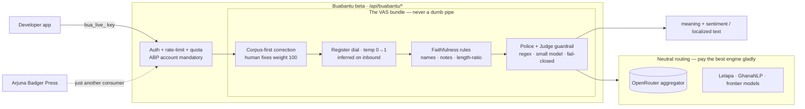

# Buabantu — the Real-Language Router API

> Part of the [technology exposé](TECHNOLOGY.md). Buabantu is the language arm of the studio, promoted
> out of the press's own translation engine into a standalone product. *Closed beta — ABP account required.*

**Buabantu is *OpenRouter, but for register and dialect.*** You send text and a target — a language, how
colloquial to be, who the audience is — and get the meaning back in the language people *actually speak*,
not textbook flatness. Arjuna Badger Press is just **one consumer** of the API, not its owner.

It began as the press's internal **People's Language** translation feature ([its own page](TECH_PEOPLES_LANGUAGE.md))
and grew into something a company can call directly.

---

## The shape: a router with a value-added layer

The base — **neutral routing** — is a commodity. If a frontier model, or a specialist like Lelapa or
GhanaNLP, does a given slice best, Buabantu **routes to them and pays their cost.** That is the
OpenRouter ethos taken seriously: it routes *to* the big engines, it doesn't try to defeat them.

The value — and the whole product — is the **VAS bundle** layered on **every byte**. The governing rule
is **never a dumb pipe**: nothing passes through untreated.

| VAS layer | What it adds over raw routing |
|---|---|
| **Corpus-first correction** | Human fixes (weight 100) overlay any engine's raw output — the proprietary ground truth. |
| **Register dial** | `temp` 0 (formal) → 1 (street), tuned to the audience's age/demographic. |
| **Faithfulness rules** | Proper names preserved, no translator's notes, per-language-family length-ratio checks. |
| **Police + Judge guardrail** | Two-layer safety on **both directions** — see below. |

---

## It runs both directions

**Outbound (corp → street):** turn corporate-speak into the language a market actually uses —
marketing, campaigns, support replies that don't read like a memo.

**Inbound (street → corp):** the higher-value half. **Decode** what people say — slang, code-switching,
dialect — into meaning **and sentiment** the business understands. The twist: **register is inferred from
the text and used to resolve meaning**, because the same word inverts by speaker. *"This is the shit"* from
a low-formality teen is **strongly positive**; from a high-formality elder, **negative**. Get that wrong
and an inbound system reports sentiment exactly backwards.

---

## The faithfulness scan that taught the engine a rule

The first real run of the faithfulness VAS — over the four shipped *RESONANCE* translation editions
(Afrikaans · French · Spanish · isiZulu) — proves the *never-a-dumb-pipe* posture in miniature.

Names preserved, no note-leakage, every chapter aligned — clean. But the length-ratio check **flagged
isiZulu at 0.66** (a third "shorter" than English). On inspection the shortfall was **flat across every
chapter** — the signature of a language property, not an omission. **isiZulu is agglutinative**: it folds
articles, prepositions, and pronouns into single inflected words, so a *faithful* Zulu translation
genuinely carries ~30–35% fewer whitespace words.

The flag was a **false alarm — and catching it was the point.** The lesson folded back into the spec: a
length check needs **per-language-family baselines** (Bantu ≈0.6–0.7, European ≈0.9–1.15) or it cries wolf
on every Nguni/Sotho edition forever. The gate is allowed to be wrong; it is **not allowed to be wrong
quietly.**

---

## The beta is real, and gated

A working API is mounted today: `POST /api/buabantu/translate`, `POST /api/buabantu/decode`, key
management, `GET /api/buabantu/status`, and a landing page at [`/buabantu`](https://arjunabadger.press/buabantu).

- **An Arjuna Badger Press account is mandatory** before any key — minting one needs a verified ABP login,
  enforced server-side. No path to a key without an account.
- Keys are **sha256-hashed at rest** (shown once, `bua_live_…` prefix), **rate-limited**, and
  **monthly-quota-capped** — the "limited" in closed beta.
- Built on the press's own `real_language.py` engine and the **same** police/judge guardrails the studio
  uses internally (`saas/guardrails.py` + `judge_client.py`) — reused, never rebuilt.

---

## Why it's a fair fight

There are real efforts in African-language AI (Lelapa, GhanaNLP, Masakhane) — but no clear commercial
winner, held back by the compute "infrastructure ceiling" and data scarcity. Buabantu doesn't try to
**out-compute** anyone. It competes on the **angle**: register as the core dial, inbound decode with
register-conditioned sense, and corpus-first human correction that **out-*data*s** the size race. Rollout
follows corpus depth — South Africa first, then Swahili, then the rest of Africa as each language clears
review. *(A trademark clearance on the name is still owed before commercial launch.)*

> ← Back to the [technology exposé](TECHNOLOGY.md) · related: [People's Language](TECH_PEOPLES_LANGUAGE.md) ·
> the [police + judge guardrail](TECH_GUARDRAILS.md)
