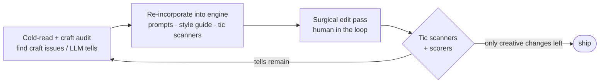

# The de-LLM loop — hunting the machine tells

> Part of the [technology exposé](TECHNOLOGY.md). The closed editorial loop that drives prose toward
> *"no obvious craft issues or LLM tells"* — and the **duplicate-tell eliminators** at its core.

A model's prose has a fingerprint: the spaced em-dash, "almost smiled," the thesis stated on a loop, the
flat even rhythm where every sentence weighs the same. Readers feel it as "this was written by a machine"
without being able to name it. The de-LLM loop's only job is to find those tells and kill them — and to
**learn each one permanently**, so the prose quality ratchets up instead of drifting.

## Three components chasing each other

1. **A brutal cold-read agent** (sentence layer) and a **structural craft audit** (the layer above —
   voice homogenisation, gravitas inflation, over-polished action, reveal/reaction order) find the
   problems model prose falls into.
2. Each finding is **re-incorporated into the engine** — the prompts, the style guide, and a set of
   deterministic **tic scanners** that count the specific machine-tells against falling targets.
3. A surgical, human-in-the-loop prose pass fixes them. Then the loop runs again.

## The duplicate-tell eliminators (deterministic, free)

The "duplicate eliminator" is really a **family of scanners**, each killing a different layer of *repeated*
machine pattern. They are pure pattern-counters — no model, no cost — and they run on every build:

| Scanner | The tell it eliminates |
|---|---|
| **`prose_tics`** | the **sentence-layer** tells — the spaced em-dash, "almost smiled," the stock gesture-beats a model reaches for again and again |
| **`prose_thesis`** | the **semantic** tell — the book's theme stated and re-stated on a loop, as if the reader might miss it |
| **`prose_evenness`** | the **deepest and subtlest** tell — *even register*, where every sentence carries the same weight and rhythm, so nothing lands. The cold-read names this the hardest to grep; it's made measurable here. |
| **`prose_cadence`** | rhythm and sentence-length variance — the music under the prose |
| **`voice_audit`** | character-voice homogenisation — when everyone in the cast starts to sound the same |

Each one turns a vague "this feels like AI" into **a number against a target**, so a revision can be judged
on whether it actually removed the tell or just moved the words around.

## Why the loop matters

The system **learns from its own failures.** A tell found once becomes a guardrail that catches it forever
after. That's the whole trick: the prose doesn't depend on the model getting better — it depends on the
*scanners* getting more complete, which they do every time the cold-read finds something new.

> ← Back to the [technology exposé](TECHNOLOGY.md) · graded against targets by [NovelBench](TECH_NOVELBENCH.md).
