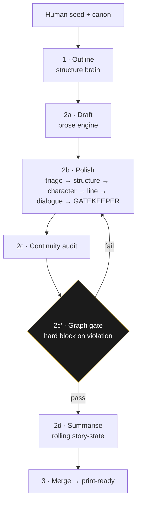

# The editorial pipeline — how a chapter is made

> Part of the [technology exposé](TECHNOLOGY.md). The assembly line a chapter passes through — and the
> single rule that keeps a human at the wheel.

A human writes the soul of the book. Large models draft and edit *under* that authorship. Deterministic
tooling stands guard. The pipeline is how those three roles are staged so the machine never takes the wheel.

| Stage | Role | What it does |
|---|---|---|
| **1 · Outline** | structure brain | a blueprint-aware chapter plan |
| **2a · Draft** | prose engine | the raw chapter, single-shot against a strong human seed |
| **2b · Polish** | multi-role editor | triage → structure → character → line → dialogue → **gatekeeper** |
| **2c · Continuity audit** | auditor | structured issues; one targeted fix pass if errors |
| **2c′ · Graph gate** | [StoryGraph](TECH_STORYGRAPH.md) | re-ingest + constraint check — **hard block** on any violation |
| **2d · Summarise** | compressor | rolling story-state so later chapters stay consistent |
| **3 · Merge** | deterministic | assemble the print-ready manuscript |

## The gatekeeper — an LLM judging an LLM

The polish stage's *last* pass is a **style gatekeeper** with a surprising power: it may **reject a
flattened revision and fall back to the stronger draft.** Over-editing is a real failure mode — a model
will happily polish the life out of a set-piece — so the gatekeeper protects *velocity* and *voice*, not
just correctness. Crucially, the human's **protected spans** are injected so the things that make the prose
human are never edited out.

## The counter-intuitive finding: single-shot beats multi-pass

The pipeline once had an elaborate multi-pass rewrite engine. Measured against single-shot generation on a
strong human seed, the multi-pass engine **regressed** the prose — it sanded off exactly what made it good.
The lesson is baked in: the human and a single-shot model do the creative work; the pipeline's job is to
*guard*, not to *re-write*. That's the one invariant, made operational.

> ← Back to the [technology exposé](TECHNOLOGY.md) · guarded by [StoryGraph](TECH_STORYGRAPH.md),
> [the verification gate](TECH_VERIFICATION_GATE.md), and [the de-LLM loop](TECH_DE_LLM_LOOP.md).
