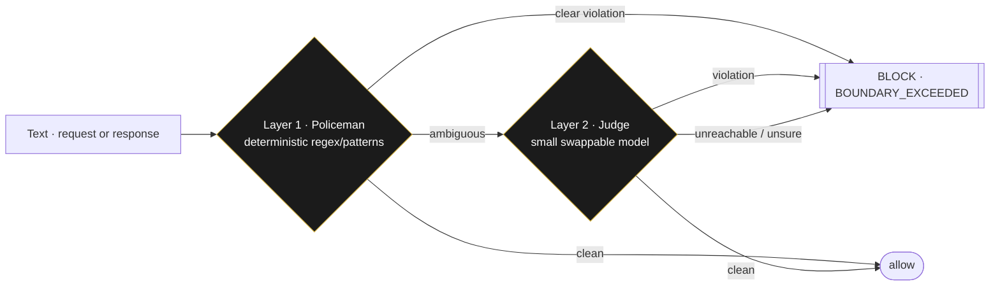

# The police + judge guardrail

> Part of the [technology exposé](TECHNOLOGY.md). The two-layer safety gate that runs on both the studio's
> own pipeline and the [Buabantu](TECH_BUABANTU.md) API — fail-closed.

Any system that lets text flow through a model needs a boundary. The studio's guardrail is built in **two
layers**, cheapest first, and it **fails closed**: if it can't be sure, it blocks.

| Layer | What | Cost |
|---|---|---|
| **1 · Policeman** | deterministic regex/patterns for high-confidence violations — self-harm, non-consensual, CSAM elicitation, prompt-injection, jailbreak, egress | **Free** — no model call |
| **2 · Judge** | a small, cheap, **swappable** classifier model decides the ambiguous cases (`GUARDRAIL_JUDGE_MODEL`, default a mini model) | Cheap |

## Fail-closed, both directions

If the judge is unreachable or unsure on a flagged item, the request is **blocked, not allowed through** —
safety defaults to deny. It runs on **both directions**: a request on the way in, and a response on the way
out.

## Humane by policy, not just by block

The guardrail isn't only a wall. Its content policy is deliberate:

- **Self-harm** routes to crisis resources and a human-first nudge — it does not just throw an error code.
- **Lived-experience testimony** about abuse is **not blocked from processing** (people deserve to tell
  their story) but is **flagged sensitive**, and self-publication is hard-gated until a human review
  confirms anonymisation and that publishing won't cause further harm.
- **Consensual adult content** is allowed; coercion never is.

## One engine, two homes

The same code (`saas/guardrails.py` + `judge_client.py`) guards the press's own generation pipeline **and**
is the safety VAS inside the [Buabantu](TECH_BUABANTU.md) API — reused, never rebuilt. That reuse is the
point: a guardrail proven on a million words of fiction is the same one a Buabantu customer's traffic passes
through.

> ← Back to the [technology exposé](TECHNOLOGY.md) · the safety layer of [Buabantu](TECH_BUABANTU.md).
