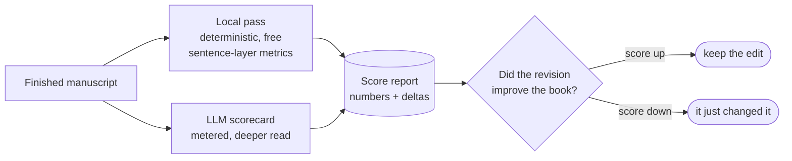

# NovelBench — the read-only manuscript scorer

> Part of the [technology exposé](TECHNOLOGY.md). The instrument that turns *"this feels off"* into
> *"this number moved."*

NovelBench is a **genre-aware scorer** that grades a finished manuscript on craft dimensions against
per-genre targets. Its defining discipline: it is **read-only**. It scores; it never rewrites. That
separation is the whole point — a tool that *measures* can be trusted, because it has no stake in the
edit it's judging.

## What it measures

| Dimension | What it asks |
|---|---|
| **Tension** | does the scene pull forward, or sit? |
| **Pacing** | is the energy modulated, or flat? |
| **Agency** | does the protagonist *act*, or get acted upon? |
| **Structure conformance** | does the chapter match its blueprint node (arrive → obstacle → cost → key …)? |
| **Voice** | is the cast distinct, or homogenised? |
| **Over-explanation** | does the prose trust the reader, or spell it out? |

Each dimension is scored against a **per-genre target** — an adventure-thriller wants different numbers
than a literary character study — so "good" means "good *for this kind of book*," not a single abstract bar.

## Two tiers

- A free **local / deterministic** pass (sentence-layer metrics) runs on **every build** — no cost, always on.
- A metered **LLM scorecard** gives a deeper, human-like read when a section is worth the spend.

## Why read-only is the invention

The studio's one invariant is *tools measure and sound the alarm; they do not generate, and they do not
drive.* NovelBench is that rule made concrete. Because it never edits, its score is an honest referee on
every other pass: the [de-LLM loop](TECH_DE_LLM_LOOP.md) can claim it removed a tell, and NovelBench is the
neutral party that says whether the book actually got better — or just got different.

> ← Back to the [technology exposé](TECHNOLOGY.md) · feeds the [de-LLM loop](TECH_DE_LLM_LOOP.md).
