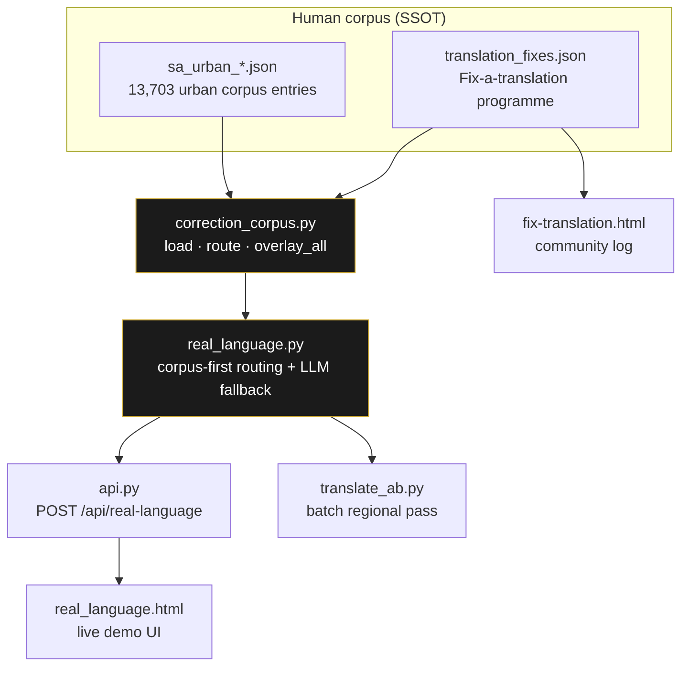

# People's Language — corpus-first translation

> Part of the [technology exposé](TECHNOLOGY.md). The engine that makes parallel editions read like *people
> talking* — and the foundation [Buabantu](TECH_BUABANTU.md) is built on.

Parallel editions must read like **people talking**, not textbook flatness. **People's Language**
(*die mense se taal*) is the press's name for a translation stack that routes **corpus-first** — human
corrections outrank any model, the way eval gates outrank raw generation everywhere else in this studio.

## Routing — three steps, one invariant

| Step | Route | What happens |
|---:|---|---|
| **1** | `corpus` | exact match on an accepted human fix → return immediately, **no LLM** |
| **2** | `ai_guided` | the model is called with a **BINDING CORPUS** block — human entries are law, not hints |
| **3** | `corpus_overlay` | a post-AI pass replaces any wrong phrasing still in the output with the human fix |

Human entries default to **weight 100** — they always outrank model knowledge. The response says which
path ran, so it's auditable.

## The register dial

`temp` runs **0 (formal / scripture) → 1 (street slang)**. Each edition's `LANGUAGES.json` sets the
default for its language. That dial is the seed of [Buabantu](TECH_BUABANTU.md)'s whole product thesis:
the same meaning, tuned to the register a given audience actually uses.

## The corpus is real

The SA urban corpus is **13,703 entries** across six languages — Afrikaans, isiZulu, isiXhosa, Sesotho,
Setswana, Swahili (~2,270–2,295 each). The community `fix-a-translation` programme feeds more in, and every
accepted fix becomes binding ground truth. This is the **out-data, don't out-compute** strategy made
literal: the moat isn't a bigger model, it's a corpus no one else has.

## The faithfulness rules

Verbatim in-culture words stay verbatim. Proper names are never translated. No translator's notes the
source didn't have. And — a lesson the engine learned the hard way — the length-ratio faithfulness check
needs **per-language-family baselines**, because agglutinative Bantu languages legitimately run ~30–35%
"shorter" by word count than their English source. (The story of that catch is on the
[Buabantu page](TECH_BUABANTU.md).)

> ← Back to the [technology exposé](TECHNOLOGY.md) · productised as [Buabantu](TECH_BUABANTU.md).
