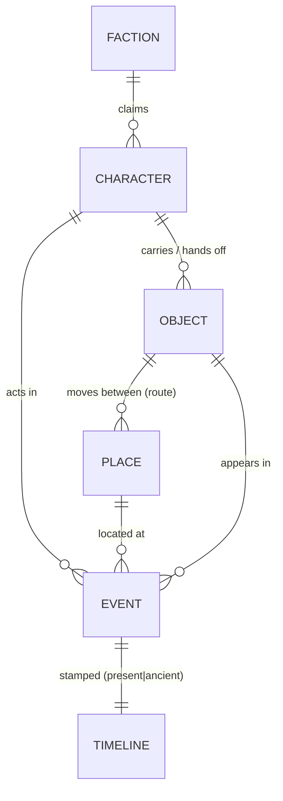
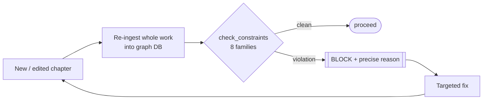

# StoryGraph — the continuity gate

> Part of the [technology exposé](TECHNOLOGY.md). The deterministic spine that hard-gates fiction the way
> a test suite gates code.

Every chapter is parsed into a graph database whose nodes are **characters, places, objects, factions, and
events**, and whose edges carry **time** and **space**. That's what makes it more than a wiki: it doesn't
just *store* the world, it can be *checked* against itself.

## The two axes a wiki doesn't have

- **Temporal** — a *two-layer timeline*, a present-day chronology braided with an ancient one. The gate
  asserts the braid **closes** in the final act and that no fragment is orphaned in time.
- **Geospatial** — places, and the movement of key objects between them, form a tracked route. The gate
  asserts an object's location chain is **unbroken**: you cannot read a relic in Egypt that was last seen,
  unmoved, in South Africa.

## Editor vs gate

On every chapter the graph is **re-ingested from scratch** and a constraint checker runs across the
*whole work* — eight constraint families:

| Family | What it guards |
|---|---|
| **Knowledge FSM** | the state-machine of who-knows-what (no one acts on a secret before they learn it) |
| **Relay / hand-off** | the chain of who carries the quest forward is unbroken |
| **Key-chain** | plot-critical objects exist, move legally, and are present where used |
| **Two-layer timeline** | present + ancient braid closes; nothing orphaned |
| **Cross-book crumbs** | reverse-payoffs land and none dangles or is load-bearing for a newcomer |
| **Mythos rules** | the "physics" of the world holds; no over-explained mystery |
| **Relay conformance** | each chapter matches its blueprint node shape |
| **Set-piece ledger** | the cinematic spine's key-chain stays intact |

**Any violation is a hard block** — the chapter does not pass until it's fixed. That's the difference
between a continuity *editor* (catches some, sometimes) and a continuity *gate* (catches all,
deterministically, every run). It is also **free**: pure graph logic, no model calls.

## Cross-book, at scale

The same machinery runs *across* books. The Jakobus Swart continuity gate (`./run.sh continuity`) holds a
presence matrix for the recurring man and his Land Cruiser ("the Beast") across the whole shelf —
**39 Jakobus books, 0 errors, 0 review items** at last run. A character can't be in two deserts at once,
across a dozen volumes, and have it slip.

> ← Back to the [technology exposé](TECHNOLOGY.md) · the [verification gate](TECH_VERIFICATION_GATE.md)
> guards facts; this one guards the world's internal logic.
