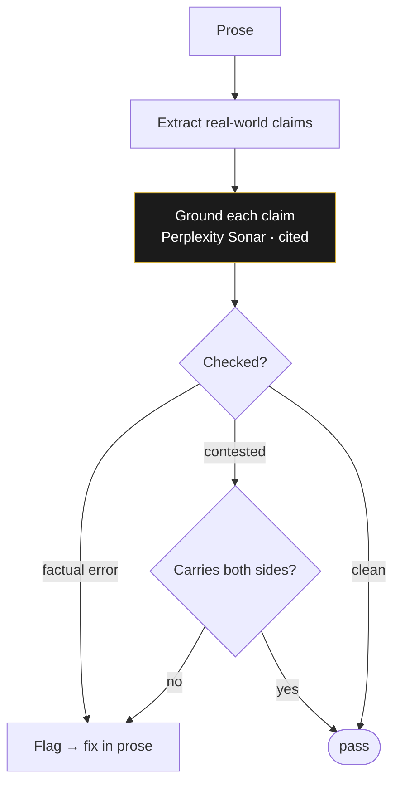

# The verification gate — accuracy + both sides

> Part of the [technology exposé](TECHNOLOGY.md). The gate that fact-checks every real-world claim and
> forces every contested one to carry both sides.

These books put real history, real science, and real places on the page. The verification gate exists so
that **a hostile expert with a search engine cannot catch a silent factual error, and a fair-minded reader
cannot accuse the book of one-sided history.** The bar is named on purpose: Andy Weir / Michael Crichton /
Dan Brown — grounded enough that the impossible reads as credible, accurate enough that the real parts are
*real*.

## Two obligations

**1 · Accuracy.** Every real-world claim is extracted from the prose and fact-checked against live sources.
The grounding role is **Perplexity Sonar** — chosen because cited, checkable answers are its strength, not
free generation.

**2 · Both sides.** Every *contested* claim must carry both sides. Where history is disputed, the book
tells it honestly — it does not launder a one-sided version through a confident narrator.

## The all-sides framing law

There's a deeper editorial rule the gate serves: **indict the machine, not the people.** When a story
touches harm, the canon aims the indictment at systems and structures, never at a single group rendered as
villain. Contested stories get told with their conflict intact and surfaced — the true thing, aimed
correctly.

This is also why the press runs a public **bounty**: readers who catch a factual error, a cultural misstep,
or a continuity fault get paid and named on the fix. The gate is the automated first pass; the bounty is the
honest admission that no automated pass is the last word.

> ← Back to the [technology exposé](TECHNOLOGY.md) · the [continuity gate](TECH_STORYGRAPH.md) guards the
> world's *internal* logic; this one guards its agreement with the *real* world.
