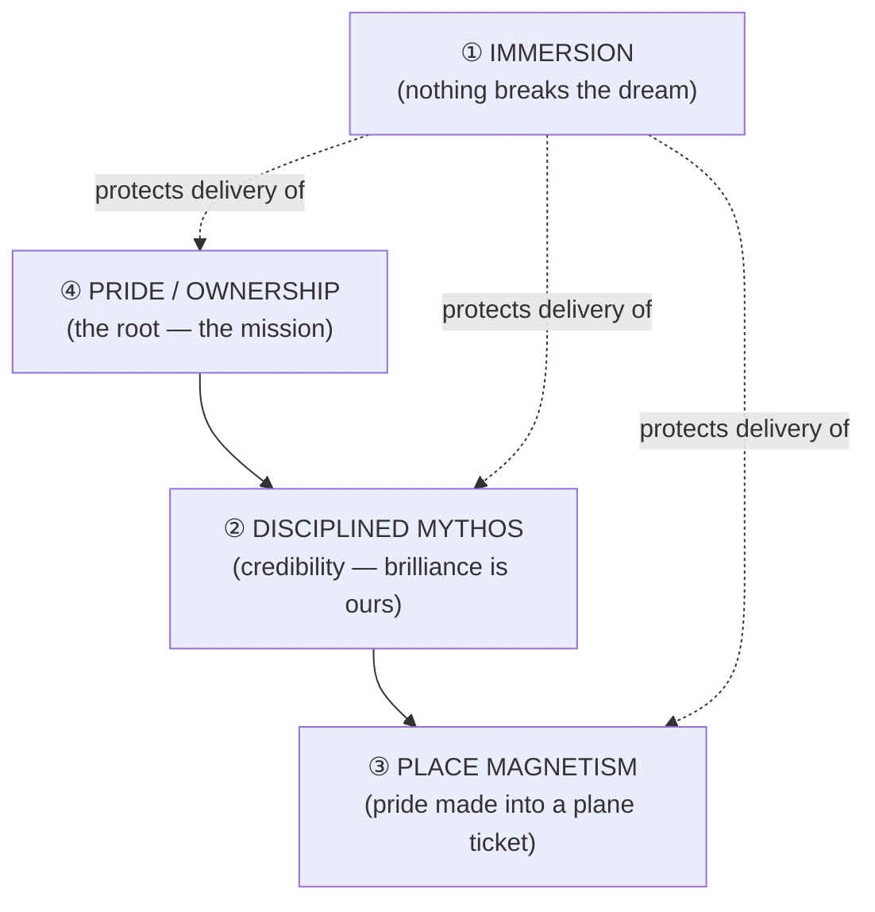

# The Press Thesis

### *Grounded fiction, guarded intention, human verdict*

> **Arjuna Badger Press** — *The archer's eye. The badger's nerve.*
>
> **Author:** Andries J. Greyling (AJ Greyling)
> **Status:** Working thesis — June 2026
> **Form:** Interdisciplinary practice-based research at the intersection of creative writing,
> narratology, computational creativity, and authorial craft — submitted as **published work +
> critical commentary + reproducible practice record**, with **qualitative human reading** as the
> ultimate proof standard.

---

## Abstract

This thesis argues that serious fiction can be produced at scale with machine assistance **without
surrendering authorial soul** — but only if three invariants hold: **(1)** creative intention is
declared in canon and **guarded by deterministic tooling** that measures and alarms rather than
rewrites; **(2)** literary structure can be **specified and enforced** like a type system (the
Triptych Trilogy as executable form); and **(3)** the final validity of the work is decided **not
by metrics, rubrics, or model self-assessment**, but by the **qualitative judgment of human
readers** — editors, beta readers, and the public — who either stay inside the dream or are pulled
out of it.

The through-line is one mechanism applied everywhere: **the wrapper is not the work.** A harmful
request labelled "fiction" is still a harmful request. Cargo-cult craft vocabulary without grounded
content does not improve prose. Multi-pass automated rewrite pipelines can *regress* quality. Colonial
framing that outsources African ingenuity to aliens is still colonial framing. What travels in the
context — the actual sentences, places, constraints, and stakes — is what matters; decoration does
not substitute for grounding.

**Arjuna Badger Press** is the house built on that claim: a studio and a free craft library grown
from twenty-plus finished manuscripts, an engine that finishes books in an author's voice (thinning
machine-tells, not replacing voice), and a public shelf where the proof is **to be determined by
whether people read, re-read, and recommend** — not by whether a scorecard said pass.

Companion documents: [`THESIS.md`](../THESIS.md) (engineering) · [`CREATIVE_THESIS.md`](CREATIVE_THESIS.md)
(creative intentions) · [`FOR_AUTHORS.md`](FOR_AUTHORS.md) (the workshop) ·
[`academic/CRITICAL_COMMENTARY.md`](../academic/CRITICAL_COMMENTARY.md) (submission spine) ·
[`academic/TRIPTYCH_FORM.md`](../academic/TRIPTYCH_FORM.md) (literary theory) ·
[`craft/LLM_TELLS.md`](craft/LLM_TELLS.md) (de-LLM catalog) ·
[`guardrail-register-thesis`](https://github.com/ajgreyling/guardrail-register-thesis) (empirical register study, sibling repo)

---

## 1. The one-sentence claim

**A human author can direct a machine to finish print-ready novels at scale — and the only honest
proof is whether other humans want to read them.**

Everything else in this document — the continuity gate, the Triptych obligations, the de-LLM
scanners, the NovelBench dimensions, the git history of rejected polish passes — is **supporting
apparatus**. Instrumentation makes intention *holdable* across hundreds of chapters. It does not
replace the reader's verdict.

---

## 2. What Arjuna Badger Press is (and is not)

### 2.1 The house

Arjuna Badger Press is two things at once:

1. **A public library** — free craft knowledge, finished novels to read, the Triptych and de-LLM
   doctrine given away without gatekeeping. *Mastery without credential.*
2. **A workshop** — for authors who already have a soul in the drawer: ingest the pile (manuscript,
   notes, photos, lore), answer ~twenty binding questions, click Go, return to a continuity-clean
   draft ready for **the author's proofread**. Not beginner's toy; Rothfuss-scale finish problem.

The emblem is deliberate. The honey badger is **fearless** (walk at the work anyway), **nearly
unkillable** (structure as resilience), an **escape artist** (craft as cleverness, not talent-worship),
and — the tender note under the ferocity — **willing to be carried**. The strongest creature allows
help. The work is fierce; the maker may be gentle with themselves.

### 2.2 The line that must not be crossed

> **The engine measures and alarms. It does not replace your voice.**

- A human seed plus surgical edits authors the soul; the pipeline does not drive.
- The gatekeeper may **reject** a flattened polish pass and fall back to the stronger draft.
- de-LLM is **thinning**, not banning — machine-tells are good moves miscalibrated by evenness.
- The wizard **proposes; the author decides** — the model must not both propose and decide at forks.

This is not humility marketing. It is the epistemological core: **only a situated human can sign the
book.** Tools extend reach; they do not confer authorship.

### 2.3 What it is not

- Not a course to sell or a guru's system — the craft library is reference, take what's useful.
- Not "hide that AI helped" — provenance is disclosed; **immersion** is the craft obligation.
- Not proof-by-dashboard — scores and gates are microscopes for the author and editor, not substitutes
  for readers.

---

## 3. The mechanism: content-addressed, not frame-addressed

Large language models predict continuations from **what is actually in the context** — tokens,
register, constraints, examples — not from decorative wrappers around the task.

| Domain | The tempting wrapper | What actually governs output |
|---|---|---|
| Safety | "It's just fiction" / nested thesis-about-a-story | The payload that would leave the chat |
| Craft | Sprinkling expert jargon ("beat," "coda," "load-bearing") | Coherent register grounded in the task |
| Revision | Seven-pass automated polish | The strongest surviving draft (often single-shot) |
| Mythos | Ancient-aliens register as literal physics | Grounded places, metallurgy, belief labelled as belief |
| Authorship | "The AI wrote it" | Canon locked by a human; surgical human edits on soul |

**Constructive corollary:** Correct craft vocabulary *can* help when it **disambiguates** and points
into a region of competent practice the author actually inhabits. **Destructive corollary:** Wrong or
ungrounded register injects noise; recursive framing does not evade evaluation.

The press operationalises the constructive half with a **grounding-gated register scaffold** — craft
terms are inserted only when elicited from the author's actual material — and refuses the destructive
half by never treating framing as permission.

*(Empirical sibling study:
[`guardrail-register-thesis/thesis/THESIS.md`](https://github.com/ajgreyling/guardrail-register-thesis/blob/master/thesis/THESIS.md);
companion fiction: *Afraud All The Way Down*.)*

---

## 4. The four creative intentions (what the books are *for*)

Every manuscript in the library serves intentions declared in canon and guarded in code. They are
stated here in order of **delivery**; the root is §4.4.

### 4.1 Immersion — strip the seams, not the truth

Remove LLM tics and craft friction so the reader stays inside the fictional dream. This is **not
deception** — the repository documents how the books were made — it is the same obligation every
writer has: don't let the apparatus show. Provenance open; experience clean.

*Guarded by:* de-LLM loop · `prose_tics.py` · STYLE_GUIDE machine-tell taboos ·
[`craft/LLM_TELLS.md`](craft/LLM_TELLS.md)

### 4.2 Disciplined mythos — woo in small doses, history as backbone

Ancient-mystery material is **texture**, never the load-bearing meal. Real places, real geology,
real light. Mysteries stay belief and tradition until the one sanctioned climax — and it lands
*because* everything else stayed grounded.

*Guarded by:* MYTHOS_RULES · `storygraph/mythos.py` · Rule 0: *ground everything, so the one place
you don't lands like a thunderclap.*

### 4.3 Place magnetism — make them want to stand here

Render heritage sites with such **specific, sensory, true** magnificence that the reader wants the
plane ticket — awe through scale and craft, never magic; honest texture, not theme-park gloss.

*Guarded by:* WONDER_OF_PLACE · NovelBench `place_magnetism` axis (microscope, not verdict)

### 4.4 Pride — African ingenuity in African hands *(the root)*

The ancient-mystery genre carries a colonial poison: the unspoken assumption that someone else built
Africa's wonders. This work **inverts on purpose** — brilliance is human, African, ours; shown, not
lectured. Pride is the mission; education and tourism follow when ownership is rendered truly.

*Guarded by:* THEMES · WONDER_OF_PLACE order-of-heart · the History Before Time companion shelf

---

## 5. The literary contribution: the Triptych Trilogy as executable form

Most structural claims in creative writing are made **in retrospect**. This project advances a form
with **falsifiable proof obligations** — and enforces them over the actual manuscripts:

| Obligation | Claim |
|---|---|
| **Panel-completeness** | Each volume stands alone; no weave element is load-bearing for a newcomer's plot |
| **Weave-closure** | Motifs span ≥2 panels; spine motifs span all three; the braid closes |
| **Order-independence** | Every reading permutation is valid and enriched — not order-*invariant*, but no privileged "book 1" |

*The African Gold Trilogy* (RESONANCE · REVELATION · RELIC) is the primary demonstration. The
**continuity gate** is the form's executable definition: violations block merge; crumbs, relay nodes,
timeline braids, and mythos rules are checked as graph constraints, not editorial vibes.

Full theory: [`academic/TRIPTYCH_FORM.md`](../academic/TRIPTYCH_FORM.md) · public edition:
[`craft/TRIPTYCH_FORM.md`](craft/TRIPTYCH_FORM.md)

**Literary proof still rests with readers:** order-independence is a structural promise; whether each
order *feels* complete and rewarding is a question for human reading, not the gate alone.

---

## 6. The methodological contribution: measure, don't generate

The engine pairs **single-shot LLM generation** with a **deterministic finite-state continuity
engine** and a **measurement harness**. The binding finding from practice:

> **The deterministic layer must measure and alarm, never generate** — because when tools were allowed
> to rewrite prose in bulk, quality *regressed*. The proof is in the git history.

| Layer | Role | May it rewrite prose? |
|---|---|---|
| Canon + wizard | Human locks intention | Human only |
| Draft (single-shot) | Prose engine | Yes — primary generation |
| Editorial polish | Modulate rhythm, voice | Yes — but gatekeeper may reject |
| Continuity gate | FSM + graph constraints | **No — block only** |
| de-LLM / tics / cold-read | Name friction | Diagnose; human thins |
| Merge / export | Derive artifacts | No creative claims |

Multi-provider routing separates **expensive prose** from **cheap analysis**. Checkpointed runs
resume across days. Twenty-plus books in one monorepo share a unified trilogy gate and cross-series
continuity auditors — the method scales because **constraints are code**, not hope.

Engineering detail: [`THESIS.md`](../THESIS.md) · [`docs/MASTER_PLAN.md`](MASTER_PLAN.md) ·
[`docs/TECHNOLOGY.md`](TECHNOLOGY.md)

---

## 7. Proof — to be determined by human readers

### 7.1 The epistemological stance

This thesis **refuses** the claim that a novel is "proven" because:

- a rubric scored ≥ 4/5,
- a continuity gate passed,
- a de-LLM tic count fell within band, or
- a model judged its own output acceptable.

Those are **necessary microscopes** for the author and editor in the workshop. They are **not
sufficient** for literary validity.

**Proof is qualitative.** It accrues when:

1. **A reader finishes** — and does not feel pulled out by seams, homogenized voice, or over-explained
   significance.
2. **A reader returns** — re-reads, recommends, argues about character, order, and meaning.
3. **An editor's judgment aligns** — developmental, line, sensitivity: the work survives professional
   eyes without requiring apology for how it was made.
4. **The dream carries the mission** — for this corpus especially: an African reader may stand taller;
   any reader may want to stand on real ground the book rendered honestly.

Metrics **support** that proof — they do not **substitute** for it. NovelBench's `place_magnetism`
axis asks a human-shaped question ("do you want to go there?") but still requires a human to answer
it honestly after reading.

### 7.2 Who counts as judge

| Judge | What they decide |
|---|---|
| **The author** | Canon, forks, surgical cuts, signature — the right to sign |
| **Working editors** | Whether structure, voice, and line survive craft scrutiny |
| **Beta / cold readers** | Whether immersion holds without inside knowledge of the engine |
| **The public shelf** | Whether free readers stay, share, and return — the slow verdict |
| **The academy** *(if submitted)* | Whether the form + method constitute original contribution |

The press publishes openly — [arjunabadger.press](https://arjunabadger.press) — so the largest jury
is **anyone who reads**. That is intentional. A thesis that hides behind paywalls and peer-only
samples would contradict its own immersion ethic.

### 7.3 What counts as evidence *for* the claim

- **The corpus** — ~22 merged manuscripts, multiple series, one engine, one authorial line; read online
  with EPUB/PDF exports.
- **The practice record** — dated decisions, rejected polish passes, gate failures caught pre-merge,
  external editorial feedback ingested into STYLE_GUIDE and prompts.
- **The craft library** — 90+ terms, de-LLM catalog, anti-patterns: doctrine extracted because it
  survived contact with real books.
- **Professional editorial traces** — cold-read reports, craft audits, triptych-judge runs: human
  language describing failure modes, not just numbers.
- **Reader uptake** *(ongoing)* — time on page, correspondence, re-read permutations of the Triptych,
  tourism intent — qualitative and slow.

### 7.4 What would falsify the claim

The thesis is **wrong** if informed human readers consistently report:

- prose that **reads as machine-even** despite tic thinning,
- structure that **fails the Triptych promises** when read in alternate orders,
- mythos that **leaks woo** into literal fact without earning it,
- place-writing that **flatters or falsifies** real heritage,
- or mission that **lectures** rather than embodies pride.

A passing gate with failing readers means the gate is incomplete — not that readers are wrong.
**Readers are the court of final appeal.**

---

## 8. Authorship under constraint

Where does authorship live when generation is cheap?

1. **Canon** — names, timeline, mythos physics, voice laws: human-locked.
2. **Forks** — wizard decisions the model cannot make alone.
3. **Constraint design** — what the gate enforces is an authorial theory of the book.
4. **Surgical edits** — the de-LLM loop and line pass: human thins where scanners point.
5. **Signature** — the proofread, the cut only the author would make, the willingness to publish.

The collaboration record ([`docs/COLLABORATION.md`](COLLABORATION.md)) documents where the agent was
wrong and where tooling caught what no human would — not to boast about automation, but to show
**directed autonomy**: the human remains architect; the machine is labour; the gate is conscience.

---

## 9. The Misogi origin (why the month happened)

The press grew from a thirty-day vow: one subscription, one novel, **non-slop**. What shipped was
not one book but a **house** — because the vow's real goals were four: evaluate the agent stack;
produce literary craft at scale; assemble portfolio-grade proof of platform thinking; understand LLMs
deeply enough to know where they fail.

The vow is kept. The proof of *literary* success, however, remains **open** — decided by readers over
time, not by the month's output count alone.

Record: [`docs/MISOGI.md`](MISOGI.md) · [`docs/ORIGINS.md`](ORIGINS.md)

---

## 10. Conclusion — contribution in three sentences

**Literary:** The Triptych Trilogy — a three-novel form with falsifiable panel-completeness,
weave-closure, and order-independence — demonstrated and **executable** via a continuity gate.

**Methodological:** Single-shot generation plus deterministic FSM/graph enforcement plus measurement
harness — with the invariant that **tools measure and alarm, not replace voice** — documented across
a multi-book practice record.

**Epistemological:** The ultimate validation of all of the above is **qualitative human judgment** —
whether readers stay inside the dream, stand taller, want to stand on real ground, and return.

The engine exists so a human author can finish at scale **without lying to the reader**. Arjuna Badger
Press exists so that practice is **shared** — craft given away, books offered freely, the workshop
opened to authors who need finish, not permission.

*The archer's eye. The badger's nerve.*

---

## Appendix — document map

| Reader need | Document |
|---|---|
| Engineering / CTO | [`THESIS.md`](../THESIS.md) · [`TECHNOLOGY.md`](TECHNOLOGY.md) |
| Creative intentions | [`CREATIVE_THESIS.md`](CREATIVE_THESIS.md) |
| Workshop / authors | [`FOR_AUTHORS.md`](FOR_AUTHORS.md) |
| Degree submission spine | [`academic/CRITICAL_COMMENTARY.md`](../academic/CRITICAL_COMMENTARY.md) |
| Triptych theory | [`academic/TRIPTYCH_FORM.md`](../academic/TRIPTYCH_FORM.md) |
| de-LLM catalog | [`craft/LLM_TELLS.md`](craft/LLM_TELLS.md) |
| Register / guardrails (empirical) | [guardrail-register-thesis](https://github.com/ajgreyling/guardrail-register-thesis) |
| Origin & collaboration | [`MISOGI.md`](MISOGI.md) · [`ORIGINS.md`](ORIGINS.md) · [`COLLABORATION.md`](COLLABORATION.md) |
| Free craft index | [`craft/README.md`](craft/README.md) |
