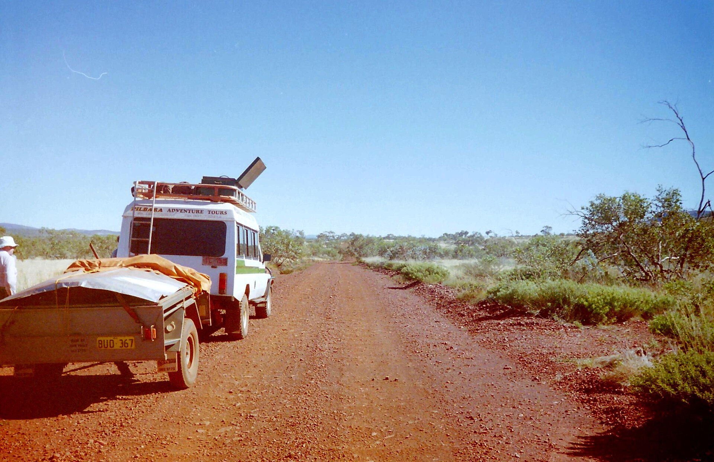
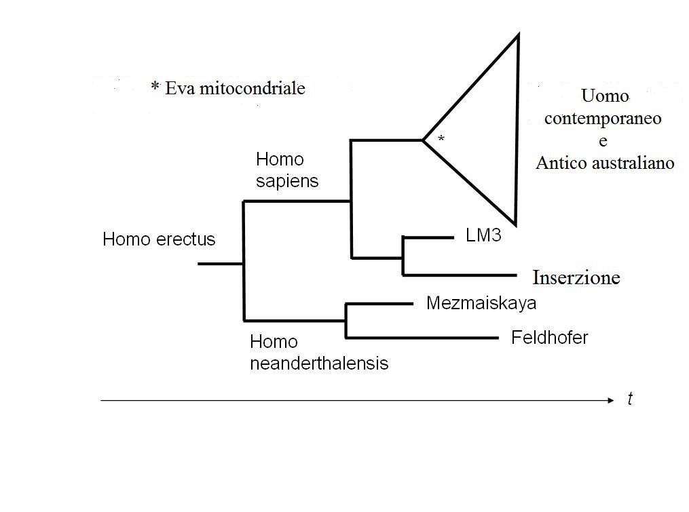
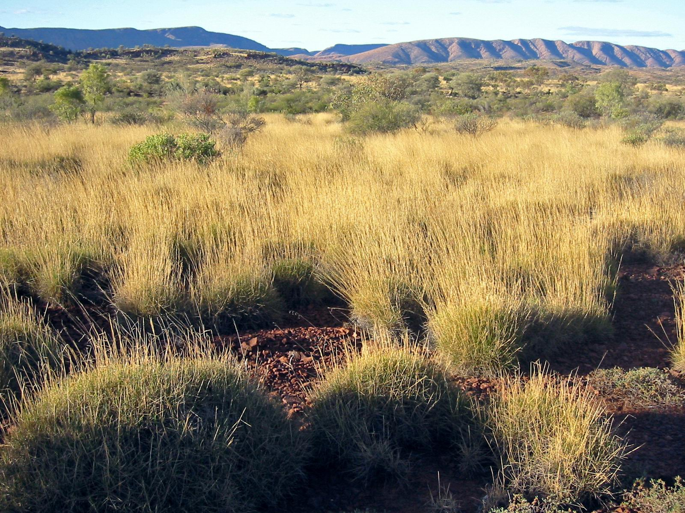
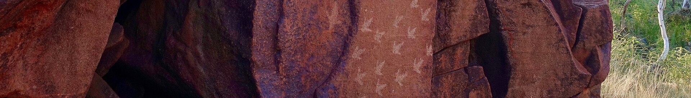
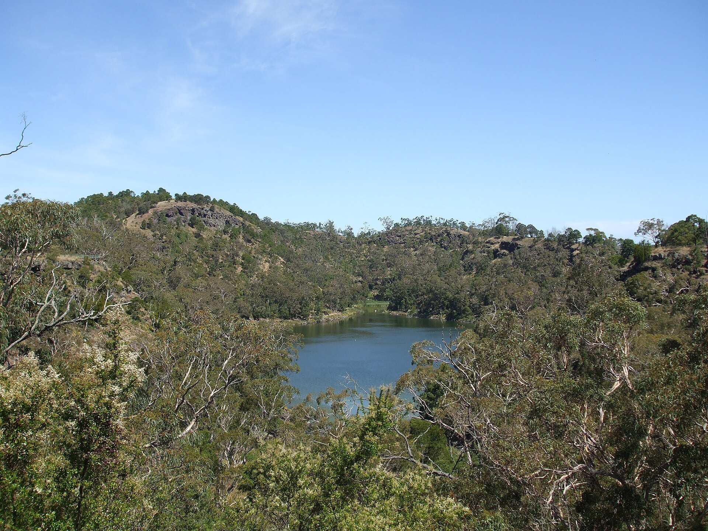
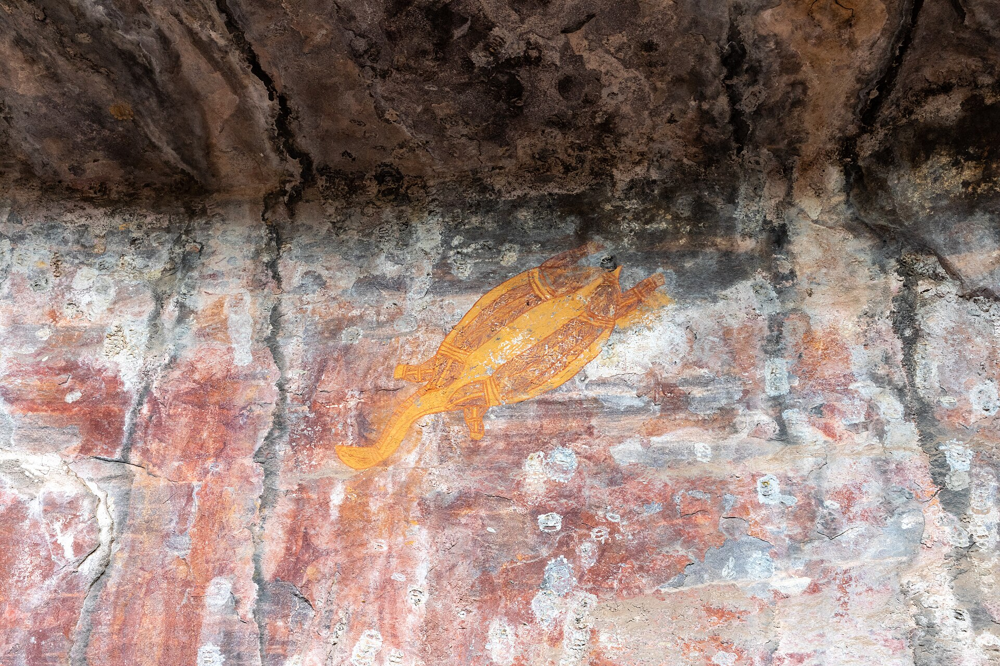
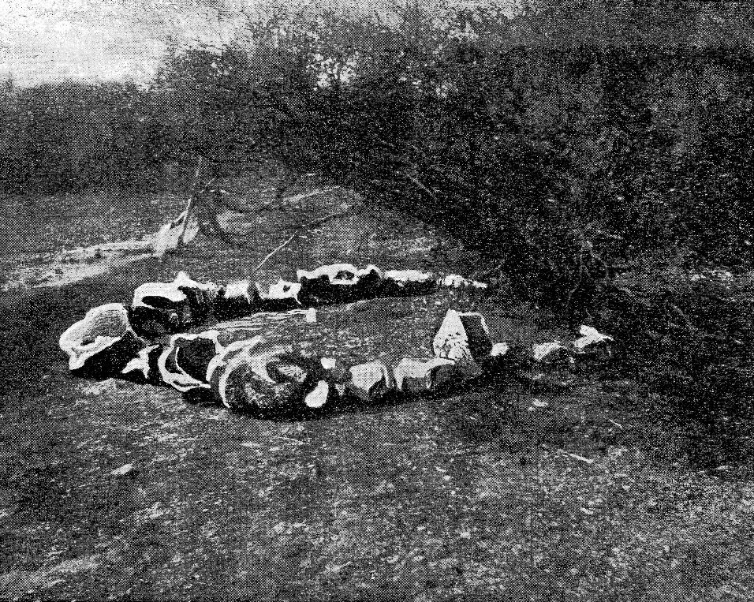
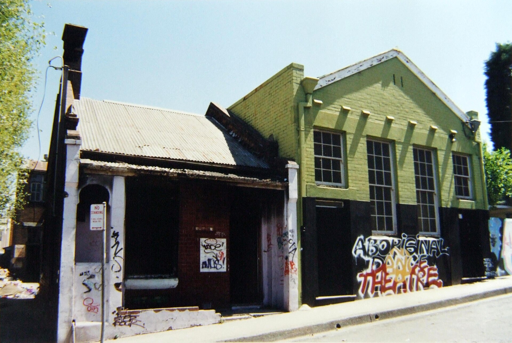
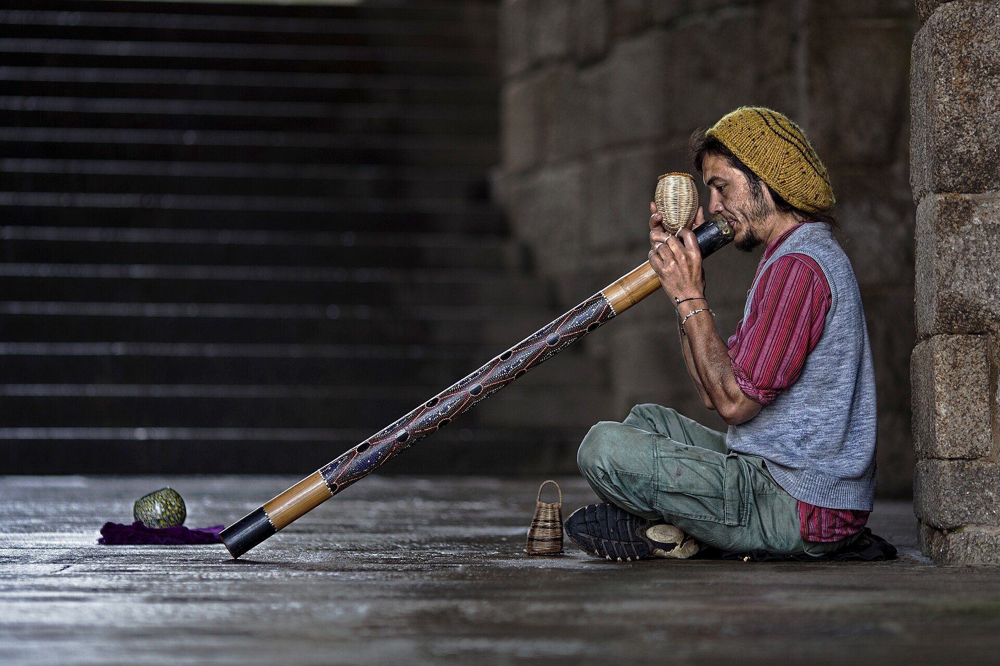
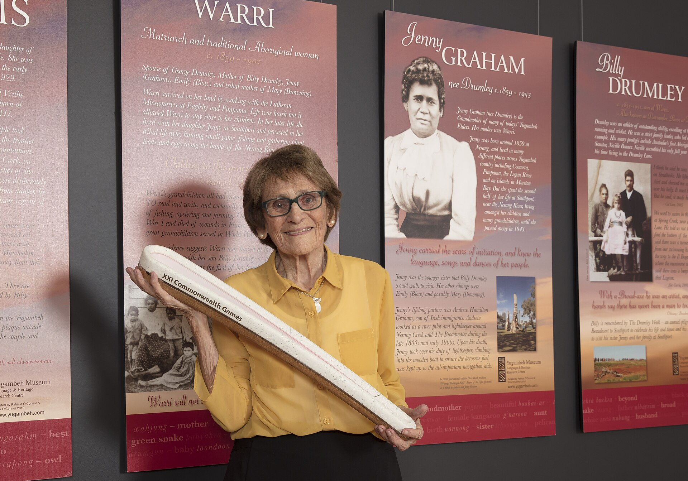

# The Songlines of Stone — real places & people

> History Before Time · VI · A photo wiki for travellers and curious readers.
> The novel is fiction; these grounds are real — go stand in them.
> **[Read the book](../../books/history-before-time/books/australia-outback/build/BOOK.md)** · [All place wikis](README.md)

## Places of awe

### The red Pilbara — iron-ore country and rock-art coast.

*Calistemon, CC BY-SA 4.0, via Wikimedia Commons*

### Lake Mungo — where the oldest known ceremonial burials lie.

*Benutzer:Schomynv de:Benutzer:Schomynv, Public domain, via Wikimedia Commons*

### The country that the half-million-dollar instruments read as empty.

*Thomas Schoch, CC BY-SA 2.5, via Wikimedia Commons*

## Things of wonder (made by hand)

### Murujuga — the world's largest rock-art gallery.

*Marius Fenger, CC BY-SA 4.0, via Wikimedia Commons*

### Budj Bim — engineered aquaculture older than the pyramids.

*Dhx1, CC0, via Wikimedia Commons*

### Rock art as record — the country's own archive.

*Dietmar Rabich, CC BY-SA 4.0, via Wikimedia Commons*

### A stone arrangement that marks solstice and equinox sunset.

*Not attributed, so nominally Uren., Public domain, via Wikimedia Commons*

## Peoples, in their own dress

### Ceremony — knowledge carried in body and song.

*Unknown authorUnknown author, CC BY 4.0, via Wikimedia Commons*

### The yidaki (didgeridoo) — the voice of country.

*Didgeridoo_street_player.jpg: Noel Feans derivative work: Tomer T, CC BY 2.0, via Wikimedia Commons*

### An elder — the ones who out-read the rig.

*BlackfullaLinguist, CC BY-SA 4.0, via Wikimedia Commons*

---

*All photographs are freely licensed (public domain / CC) via [Wikimedia Commons](https://commons.wikimedia.org/).
See each caption for author and licence.*
