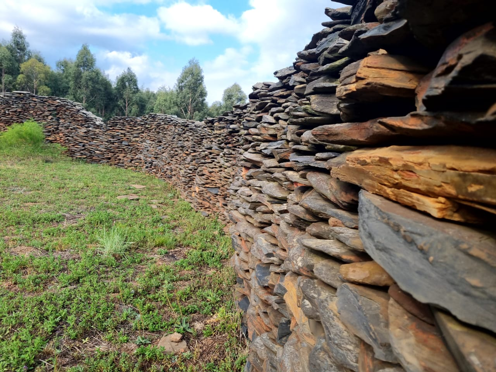
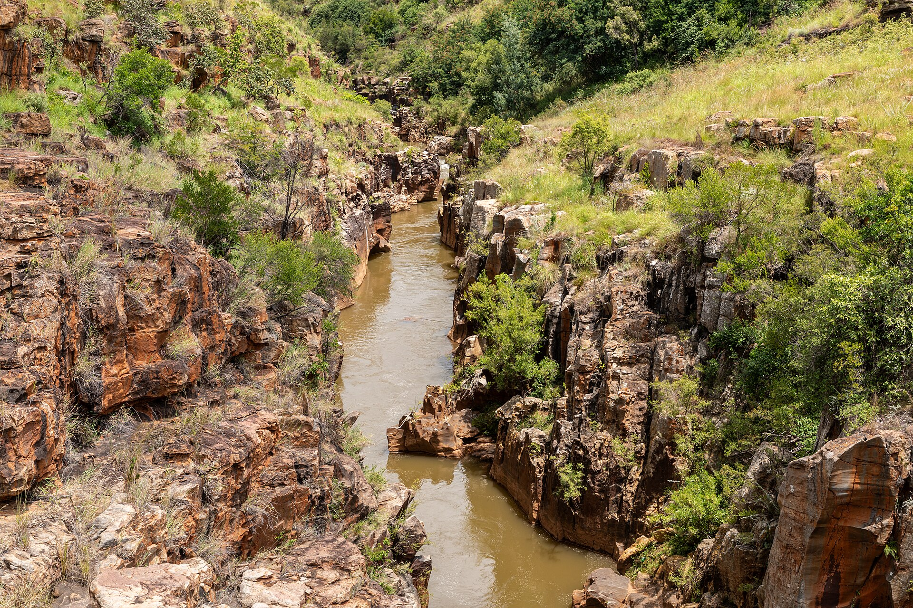
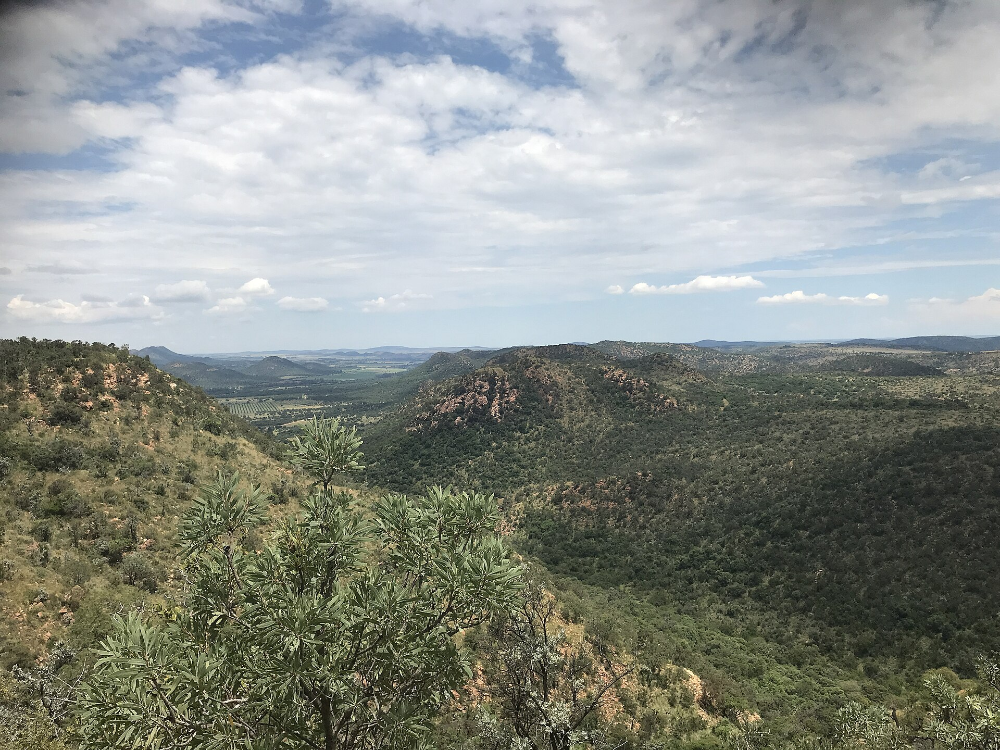
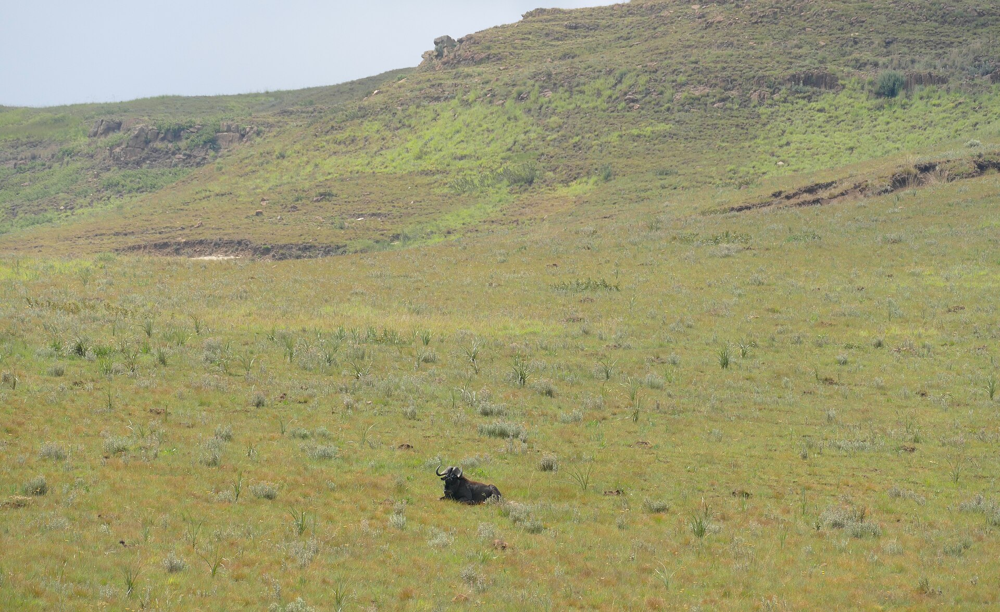
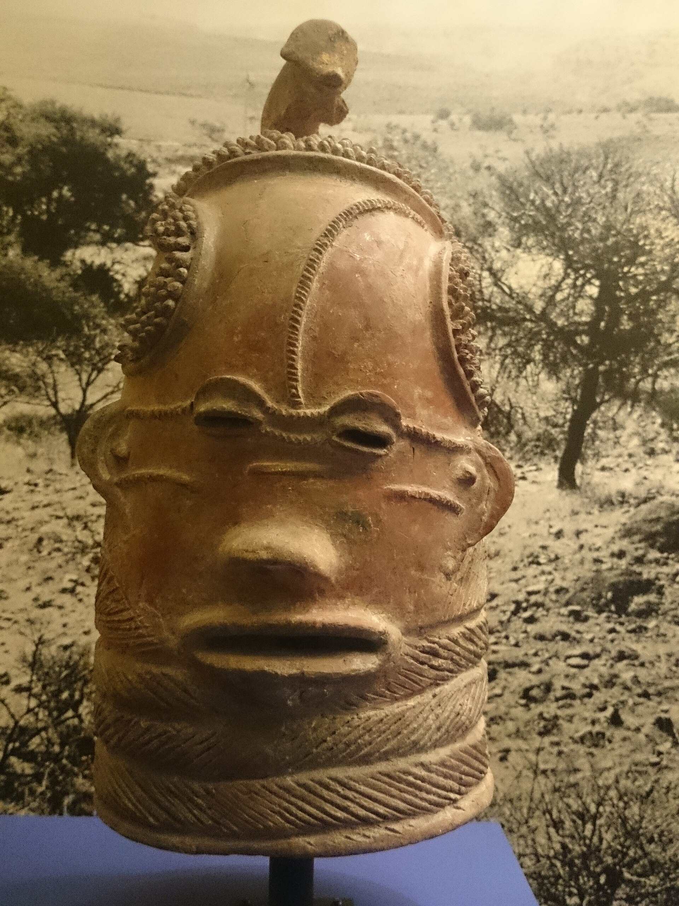
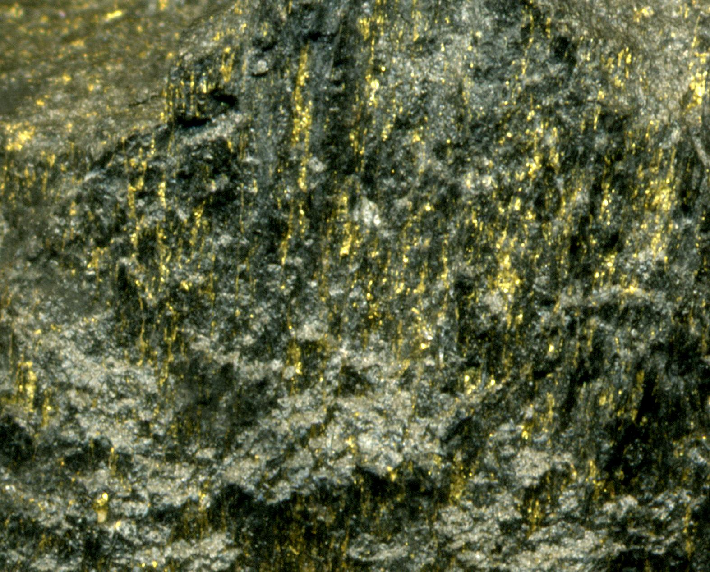
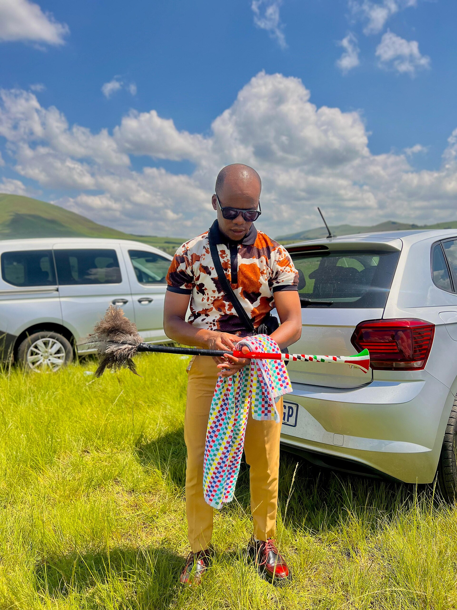
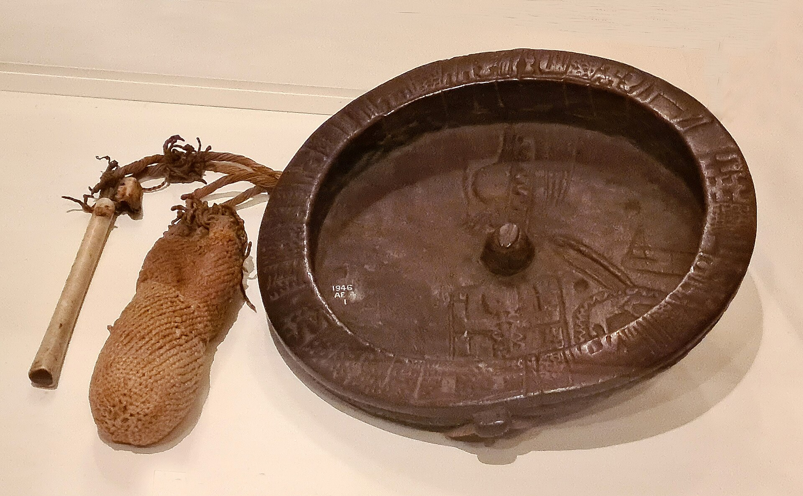
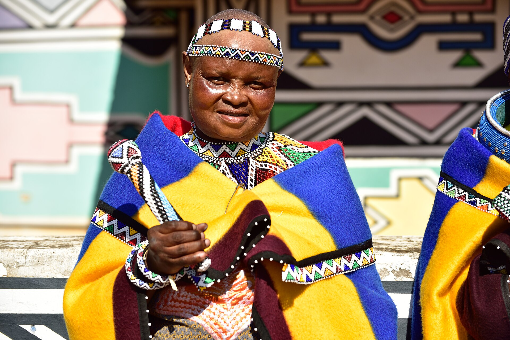

# The Calendar of Stone — real places & people

> History Before Time · I · A photo wiki for travellers and curious readers.
> The novel is fiction; these grounds are real — go stand in them.
> **[Read the book](../../books/history-before-time/books/book1-africa/build/BOOK.md)** · [All place wikis](README.md)

## Places of awe

### Adam's Calendar, Mpumalanga — the standing-stone instrument that opens the book.

*Sháron Viljoen, CC BY-SA 4.0, via Wikimedia Commons*

### The Mpumalanga highveld escarpment — the land the Order crosses.

*Dietmar Rabich, CC BY-SA 4.0, via Wikimedia Commons*

### The Vredefort impact structure — the oldest scar on Earth.

*Phillip778899, CC0, via Wikimedia Commons*

### Highveld dawn — mist over standing stone.

*Bernard DUPONT from FRANCE, CC BY-SA 2.0, via Wikimedia Commons*

## Things of wonder (made by hand)

### Great Zimbabwe — the stone city of the gold-trade cultures.

*Edwin Smith and Andrew Dale, CC BY-SA 4.0, via Wikimedia Commons*

### The Conical Tower, Great Zimbabwe — mortarless masonry.

*amanderson2, CC BY 2.0, via Wikimedia Commons*

### The Golden Rhinoceros of Mapungubwe — worked African gold.

*Sian Tiley-Nel, CC BY-SA 4.0, via Wikimedia Commons*

### The Lydenburg Heads — early southern-African sculpture.

*Nkansahrexford, CC BY 3.0, via Wikimedia Commons*

### Witwatersrand deep-gold country — why the visitors came.

*James St. John, CC BY 2.0, via Wikimedia Commons*

## Peoples, in their own dress

### Xhosa dress — one of Jennefer's living tongues made visible.

*mike barwood from port elizabeth, nelson mandela bay, south africa, CC BY-SA 2.0, via Wikimedia Commons*

### Zulu ceremonial dress.

*LindaniShaka, CC BY-SA 4.0, via Wikimedia Commons*

### Venda people of the far north — keepers of stone-walled sites.

*Ji-Elle, CC BY-SA 4.0, via Wikimedia Commons*

### Ndebele dress and wall-painting — geometry as inheritance.

*South African Tourism from South Africa, CC BY 2.0, via Wikimedia Commons*

---

*All photographs are freely licensed (public domain / CC) via [Wikimedia Commons](https://commons.wikimedia.org/).
See each caption for author and licence.*
