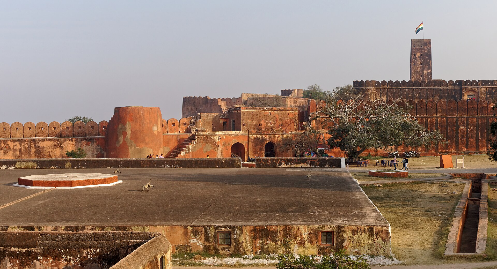
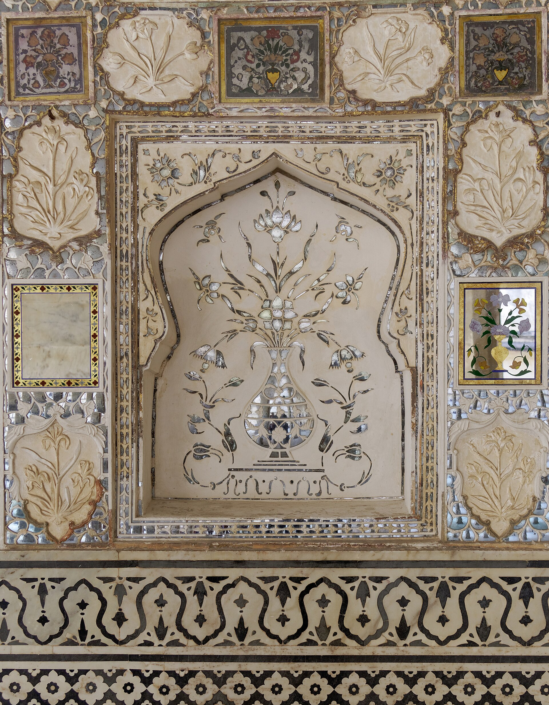
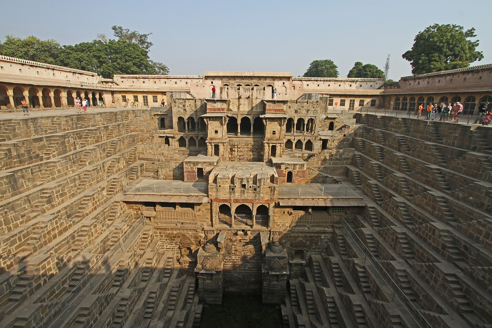
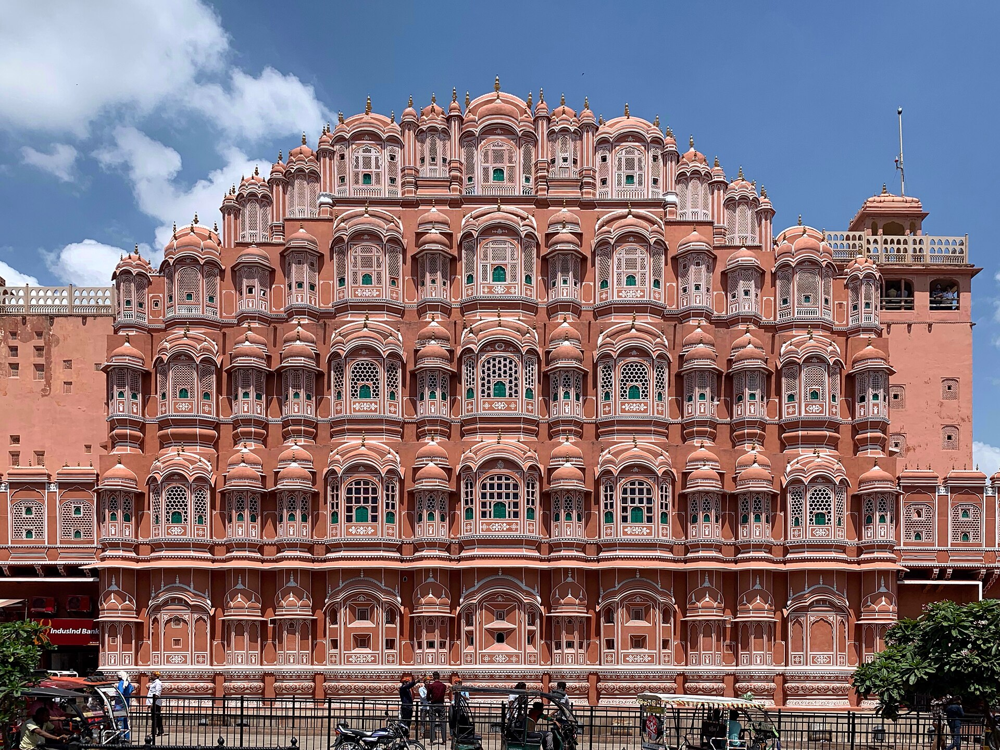
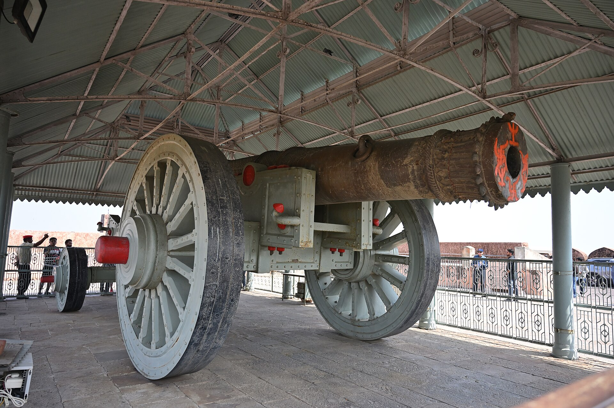
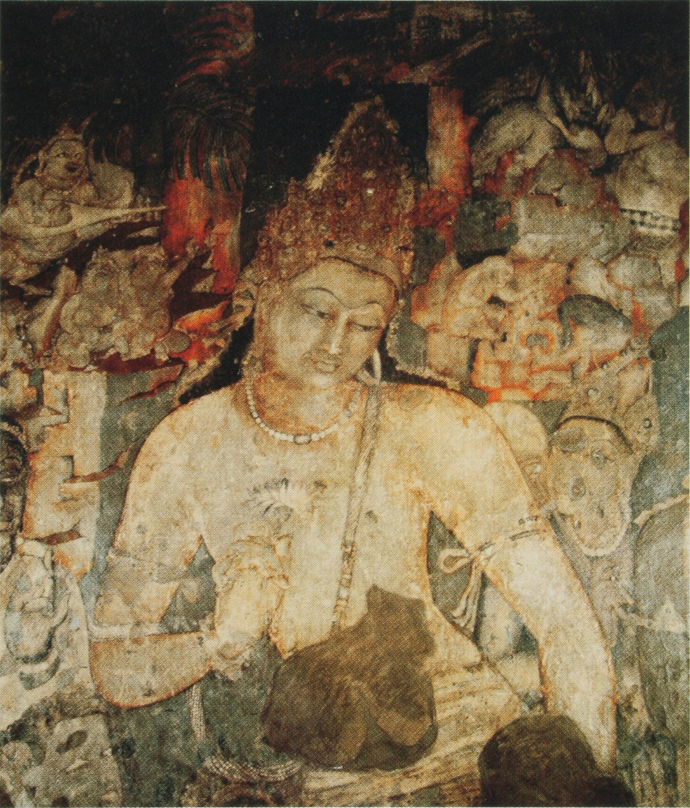
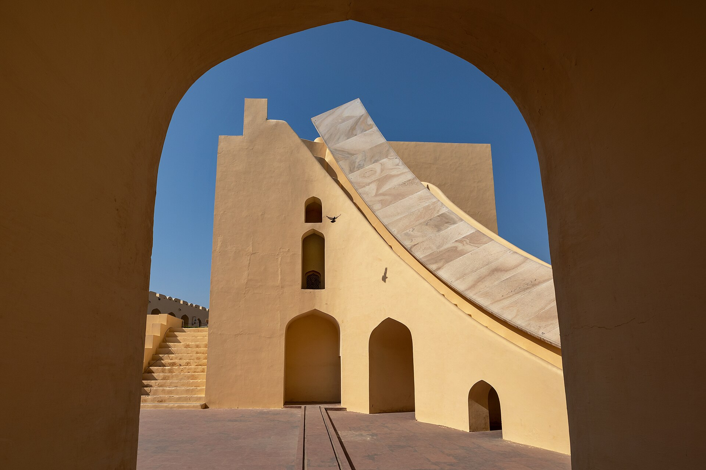
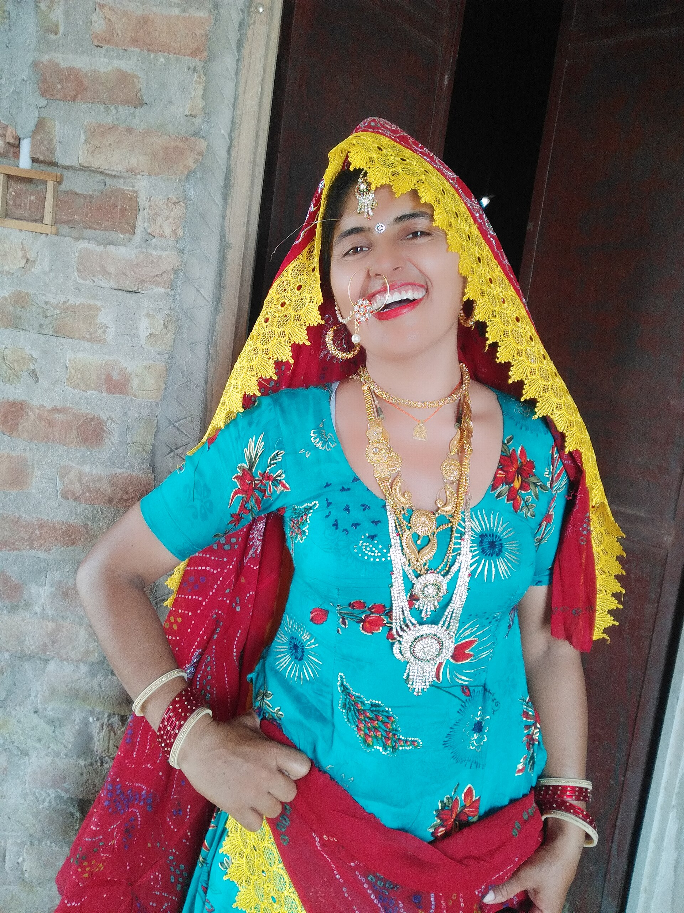
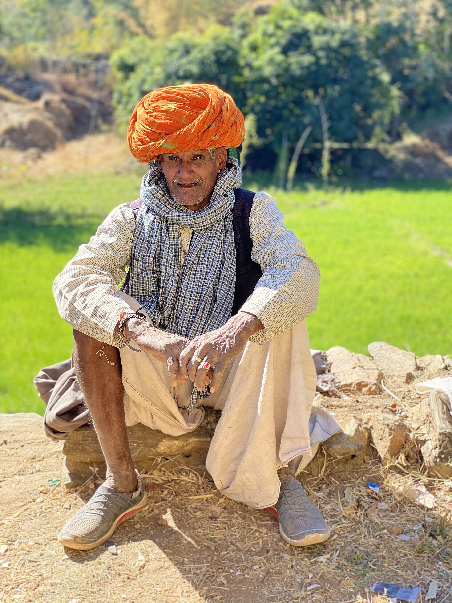
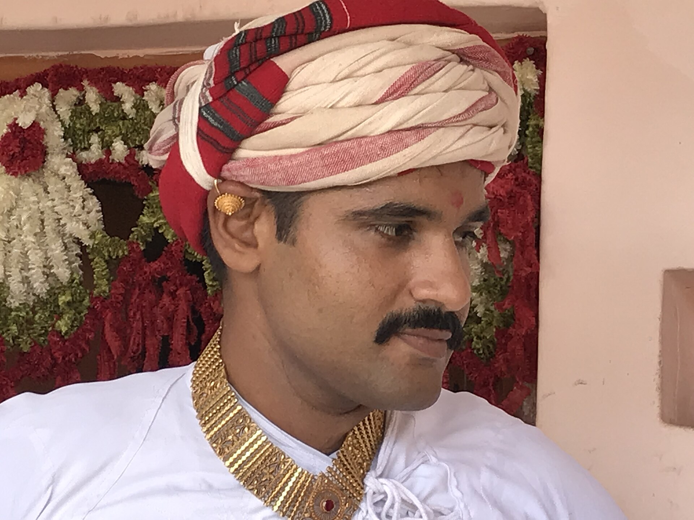

# The Indian One — real places & people

> History Before Time · II · A photo wiki for travellers and curious readers.
> The novel is fiction; these grounds are real — go stand in them.
> **[Read the book](../../books/history-before-time/books/book2-india/build/BOOK.md)** · [All place wikis](README.md)

## Places of awe

### Jaigarh Fort above Amber — the Rajasthan node.

*Jakub Hałun, CC BY-SA 4.0, via Wikimedia Commons*

### Amber Fort's mirrored halls — Hindu and Mughal in one room.

*Jakub Hałun, CC BY-SA 4.0, via Wikimedia Commons*

### Chand Baori — 3,500 steps of infrastructure as geometry.

*Gerd Eichmann, CC BY 4.0, via Wikimedia Commons*

### The pink city of Jaipur — built in dialogue with empire.

*Chainwit., CC BY-SA 4.0, via Wikimedia Commons*

## Things of wonder (made by hand)

### The Jaivana cannon — the world's largest wheeled gun; fired once.

*Wander-earth, CC BY-SA 4.0, via Wikimedia Commons*

### Ellora's Kailasa — a temple carved whole, top-down, from one rock.

*Rohit Sharma, CC BY-SA 4.0, via Wikimedia Commons*

### Ajanta — the painted older layer; what the rock remembers.

*Unknown authorUnknown author, Public domain, via Wikimedia Commons*

### Jantar Mantar — masonry instruments that read the sky.

*Sudipta Maulik, CC BY-SA 4.0, via Wikimedia Commons*

## Peoples, in their own dress

### Rajasthani dress — colour against the desert.

*Jaishree.lunkaransar, CC BY-SA 4.0, via Wikimedia Commons*

### The Rajasthani turban — region read in a wrap of cloth.

*Sumana Palle, CC BY-SA 4.0, via Wikimedia Commons*

### Rabari herders — a living layer of Rajasthan.

*Parbatchavda, CC BY-SA 4.0, via Wikimedia Commons*

---

*All photographs are freely licensed (public domain / CC) via [Wikimedia Commons](https://commons.wikimedia.org/).
See each caption for author and licence.*
