# The Temple in the Rock — Deccan — real places & people

> History Before Time · III · A photo wiki for travellers and curious readers.
> The novel is fiction; these grounds are real — go stand in them.
> **[Read the book](../../books/history-before-time/books/book3-india-deccan/build/BOOK.md)** · [All place wikis](README.md)

## Places of awe

### The Ellora escarpment — thirty-four caves, three faiths, one mountain.

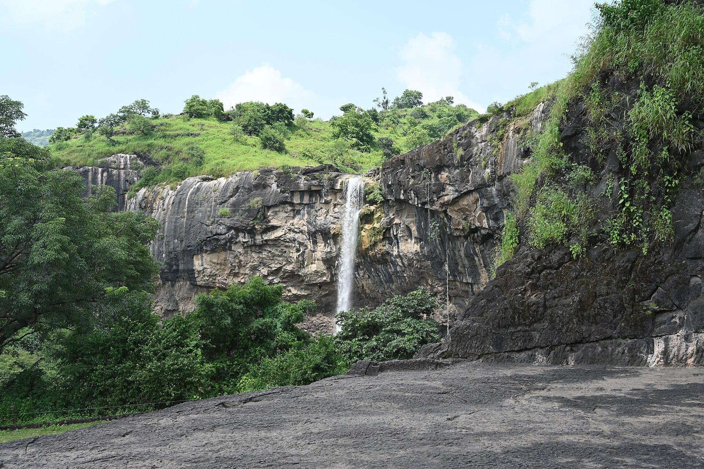

*Vinayaraj, CC BY-SA 4.0, via Wikimedia Commons*

### The horseshoe gorge of Ajanta above the Waghora.

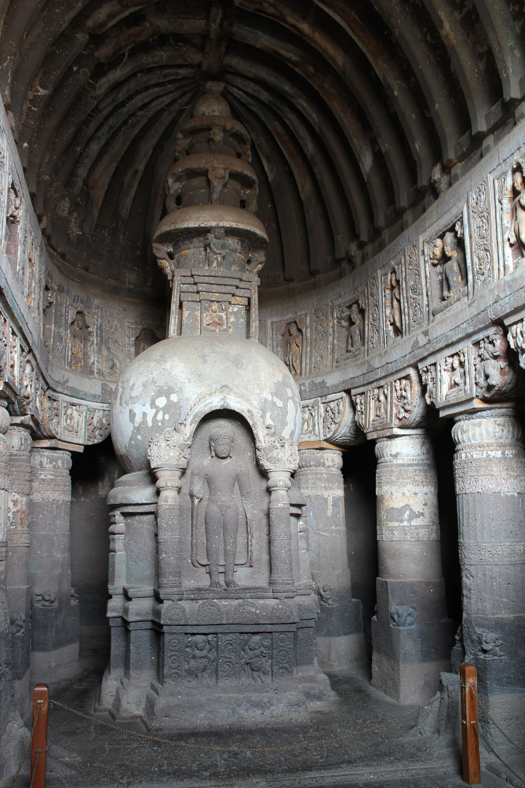

*Arian Zwegers from Brussels, Belgium, CC BY 2.0, via Wikimedia Commons*

### Hampi — the last great southern empire among granite boulders.

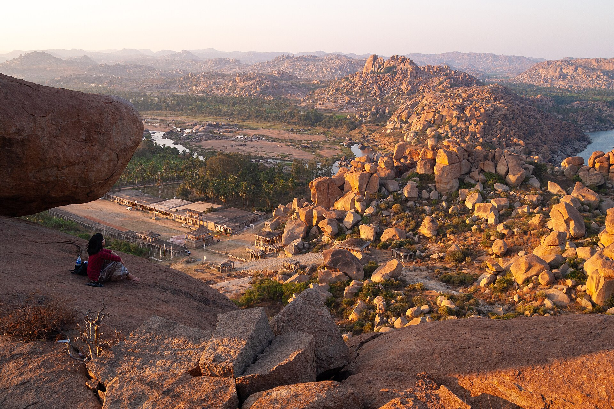

*Vyacheslav Argenberg, CC BY 4.0, via Wikimedia Commons*

## Things of wonder (made by hand)

### Kailasa, Cave 16 — every cut was final; no revision, no prototype.

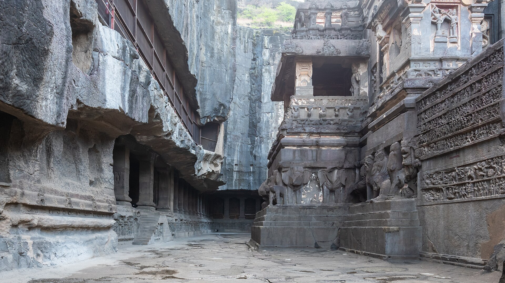

*Rohit Sharma, CC BY-SA 4.0, via Wikimedia Commons*

### The Stone Chariot of the Vittala temple, Hampi.

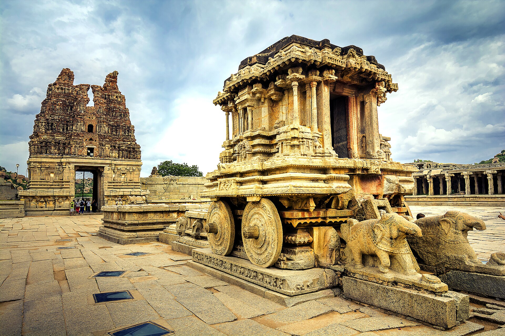

*Ram Nagesh Thota, CC BY-SA 4.0, via Wikimedia Commons*

### Gol Gumbaz — one of the largest unsupported domes; the whispering gallery.

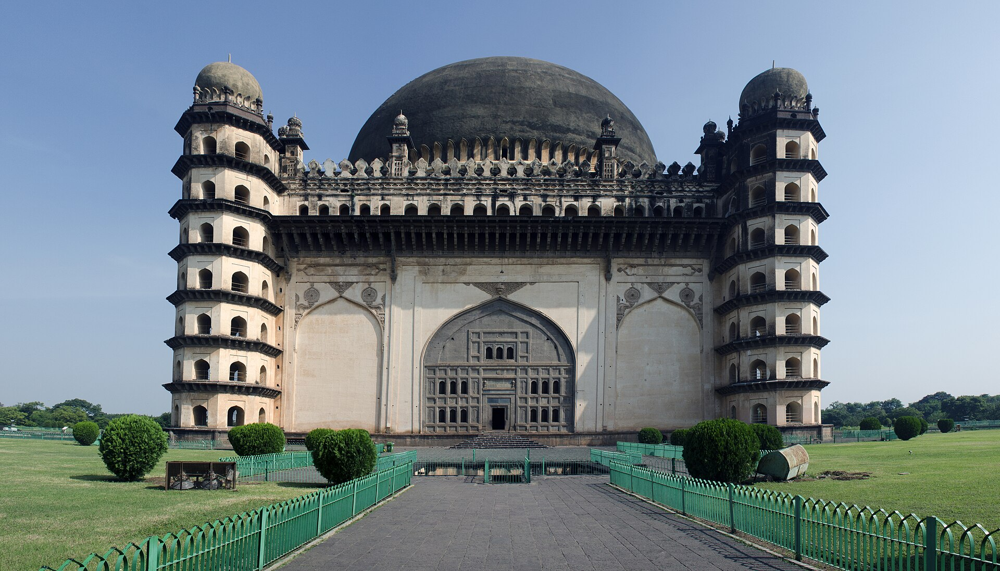

*Rangan Datta Wiki, CC BY-SA 4.0, via Wikimedia Commons*

### Golconda — a fort built so a hand-clap carries to the hilltop.

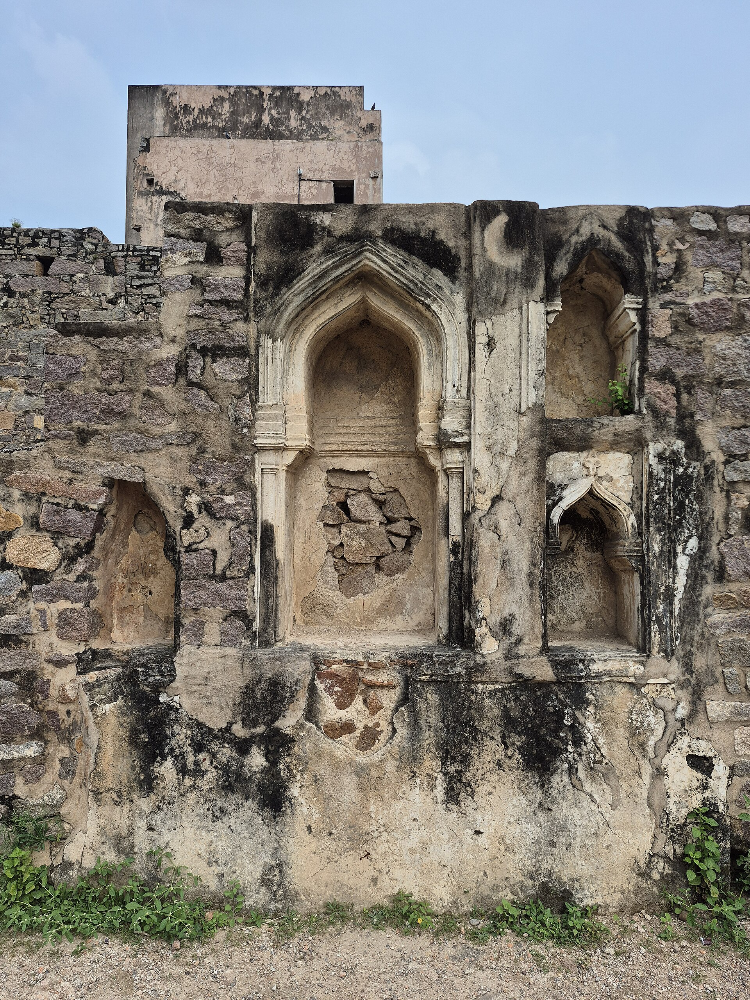

*Kuldeepburjbhalaike, CC BY-SA 4.0, via Wikimedia Commons*

### Bidriware — silver inlaid in black zinc alloy; Persian motifs, Indian hands.

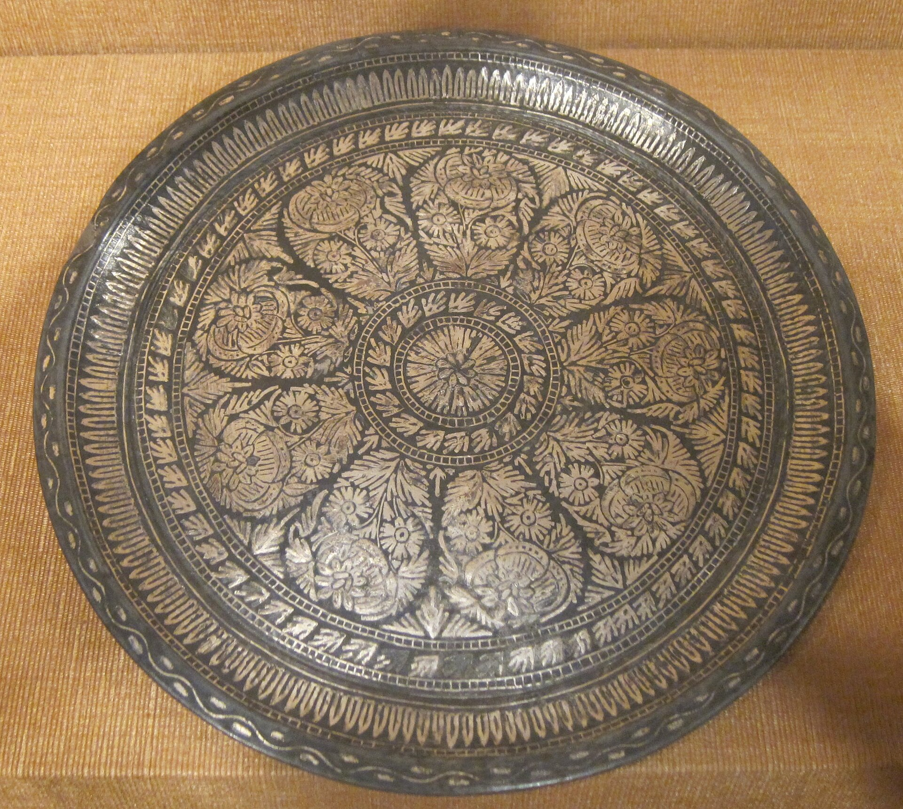

*Hiart, CC0, via Wikimedia Commons*

### The Mahmud Gawan Madrasa, Bidar — a centre of learning, half-ruined.

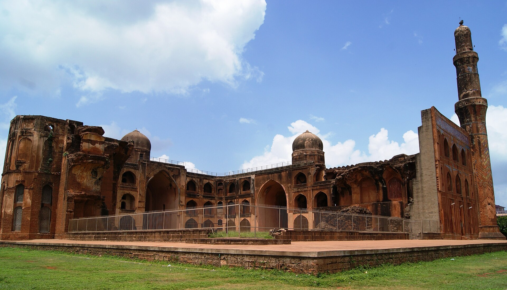

*Prasannasindol, CC BY-SA 3.0, via Wikimedia Commons*

## Peoples, in their own dress

### Lambani (Banjara) dress — mirrorwork of the Deccan.

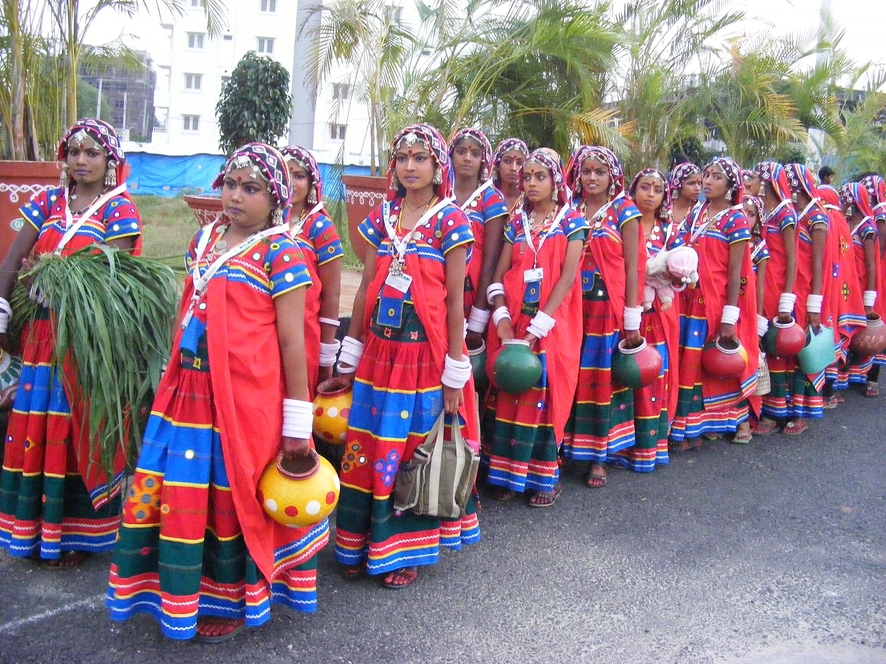

*Dr. Raju Kasambe, CC BY-SA 3.0, via Wikimedia Commons*

### Marathi dress — the architect Arjun's own people.

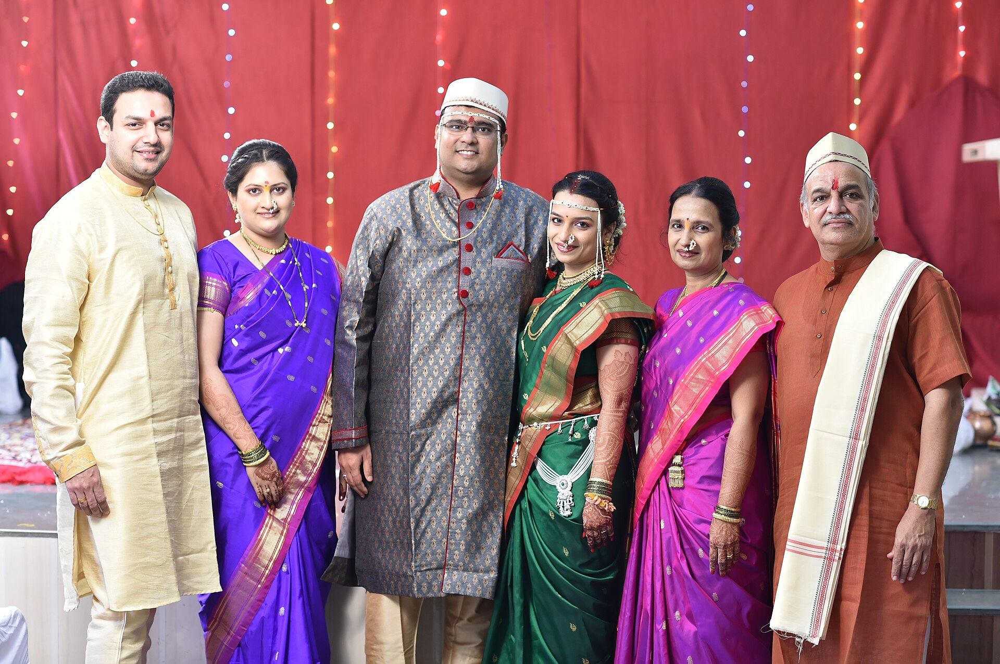

*Adigogate18, CC BY-SA 4.0, via Wikimedia Commons*

---

*All photographs are freely licensed (public domain / CC) via [Wikimedia Commons](https://commons.wikimedia.org/).
See each caption for author and licence.*
