# The Shore That Remembers — real places & people

> History Before Time · IV · A photo wiki for travellers and curious readers.
> The novel is fiction; these grounds are real — go stand in them.
> **[Read the book](../../books/history-before-time/books/book4-india-tamil/build/BOOK.md)** · [All place wikis](README.md)

## Places of awe

### The Shore Temple — granite in the surf for thirteen centuries.

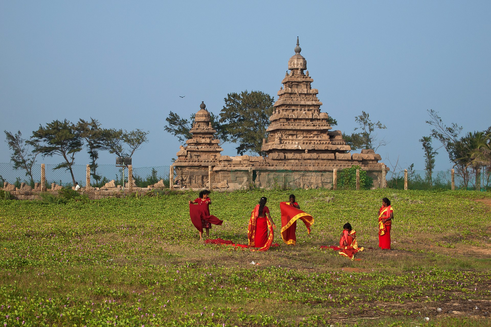

*Vyacheslav Argenberg, CC BY 4.0, via Wikimedia Commons*

### The Five Rathas — each carved whole from one boulder; several unfinished.

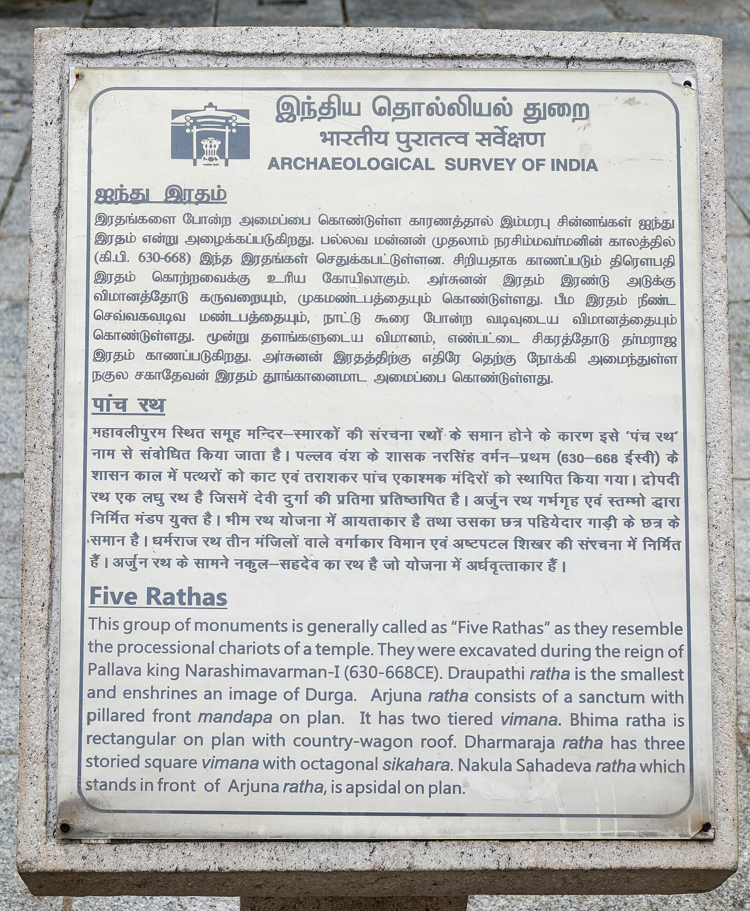

*This Photo was taken by Timothy A. Gonsalves. Feel free to use my photos, but please mention me as the author. I would much appreciate if you send me an email tagooty@yahoo.com or write on my talk page, for my information. Please contact me before commercial use. Please do not upload an edited image here without consulting me. I would like to make corrections only at my own source to ensure that the changes improve the image and are preserved.Otherwise you may upload an edited image with a new name. Please use one of the templates derivative or extract., CC BY-SA 4.0, via Wikimedia Commons*

### Arjuna's Penance — one of the largest open-air bas-reliefs on Earth.

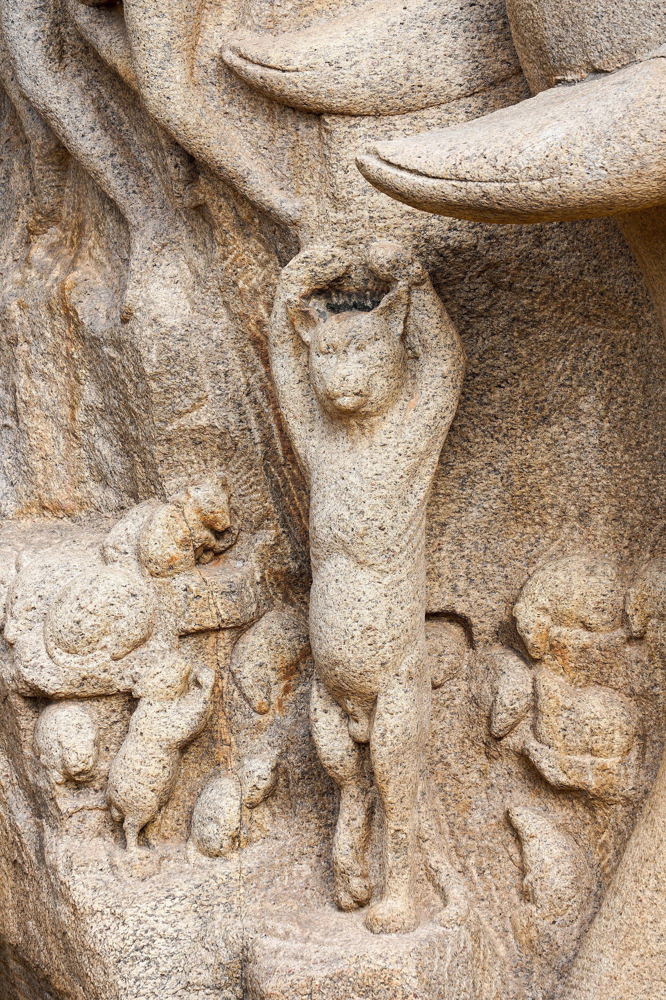

*This Photo was taken by Timothy A. Gonsalves. Feel free to use my photos, but please mention me as the author. I would much appreciate if you send me an email tagooty@yahoo.com or write on my talk page, for my information. Please contact me before commercial use. Please do not upload an edited image here without consulting me. I would like to make corrections only at my own source to ensure that the changes improve the image and are preserved.Otherwise you may upload an edited image with a new name. Please use one of the templates derivative or extract., CC BY-SA 4.0, via Wikimedia Commons*

## Things of wonder (made by hand)

### Madurai's Meenakshi temple — Meena's namesake; Kannagi's city.

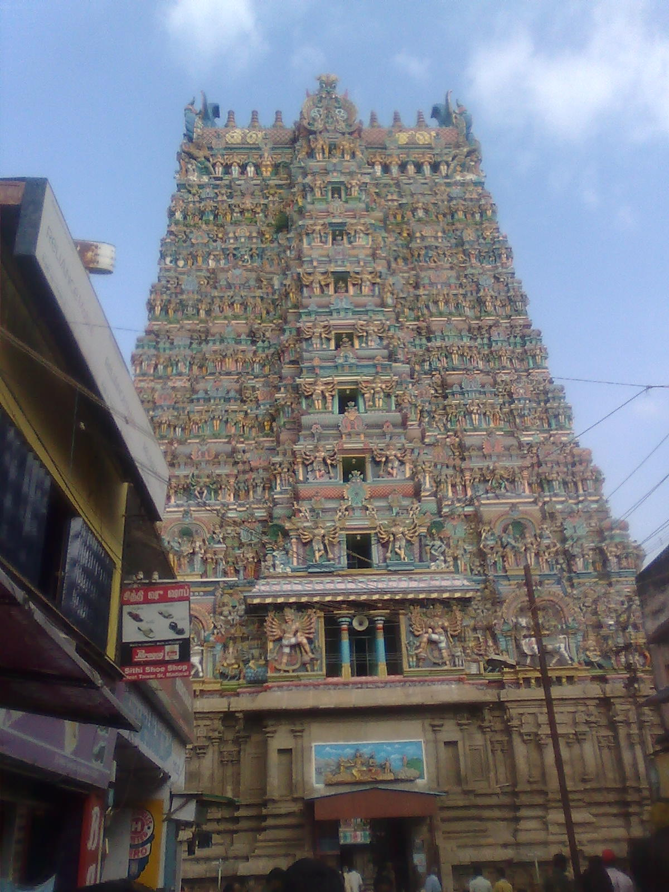

*user:deadrat, CC BY-SA 3.0, via Wikimedia Commons*

### The Big Temple, Thanjavur — the Chola imperial masterwork.

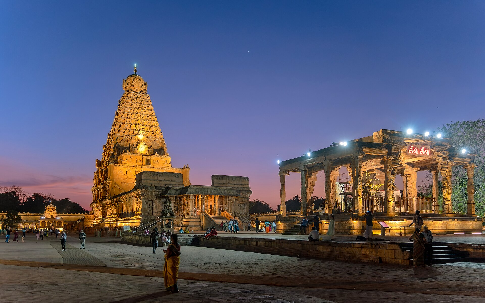

*Original: Rainer Halama Derivative work: UnpetitproleX, CC BY-SA 4.0, via Wikimedia Commons*

### Kanchipuram's Kailasanathar — early Pallava sandstone.

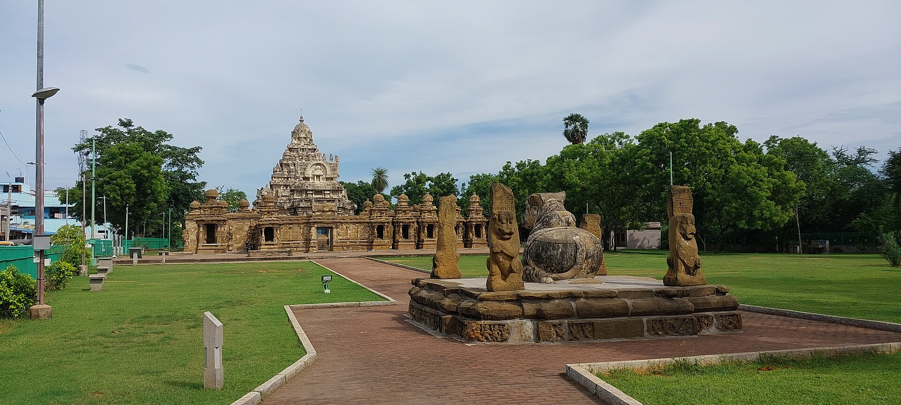

*Pinakpani, CC BY 4.0, via Wikimedia Commons*

### The Nagore Dargah — Islam native to the Tamil shore.

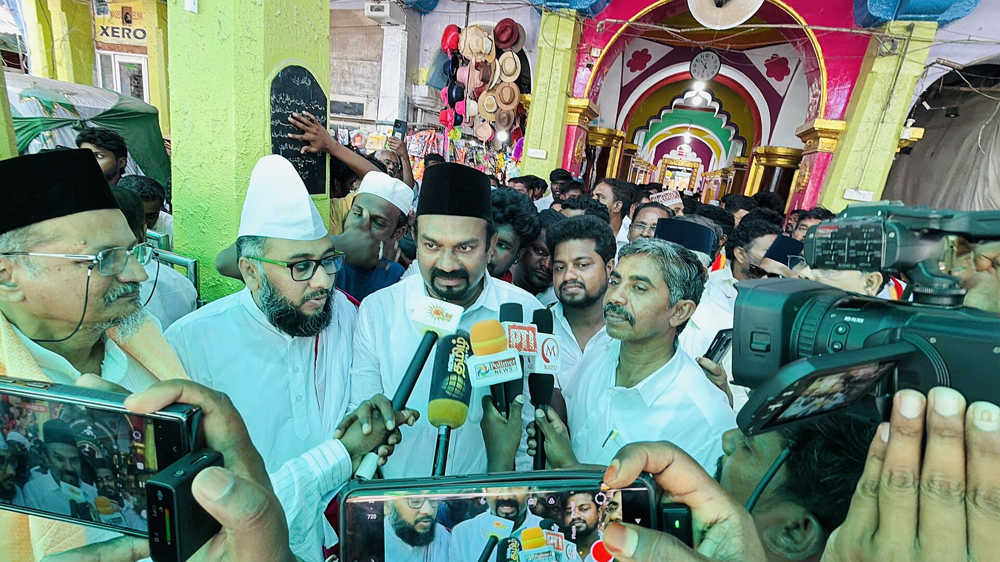

*Samad Faize, CC BY 4.0, via Wikimedia Commons*

### The living looms of Kanchipuram — craft handed down, not displayed.

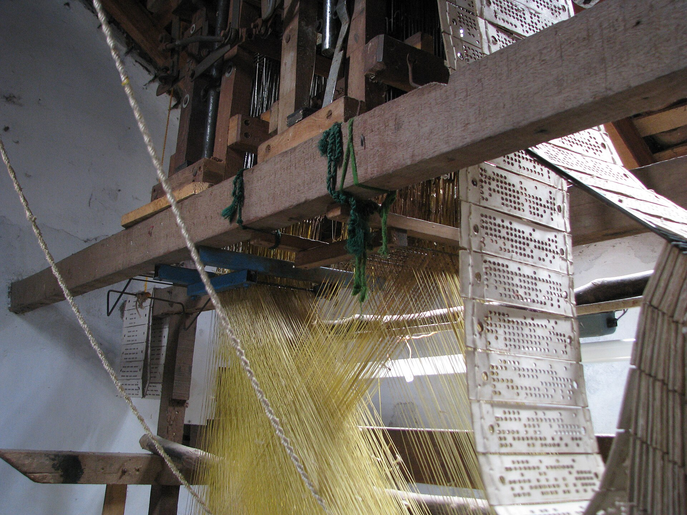

*McKay Savage, CC BY 2.0, via Wikimedia Commons*

## Peoples, in their own dress

### Tamil dress — jasmine and silk.

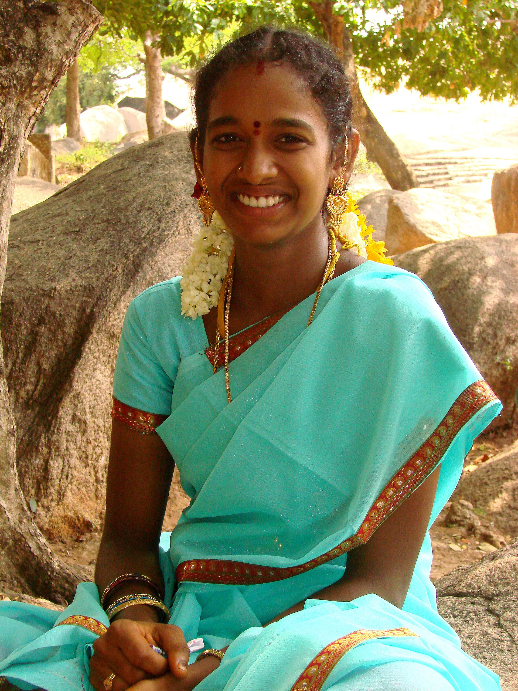

*Adam Jones Adam63, CC BY-SA 3.0, via Wikimedia Commons*

### Bharatanatyam — the body as instrument.

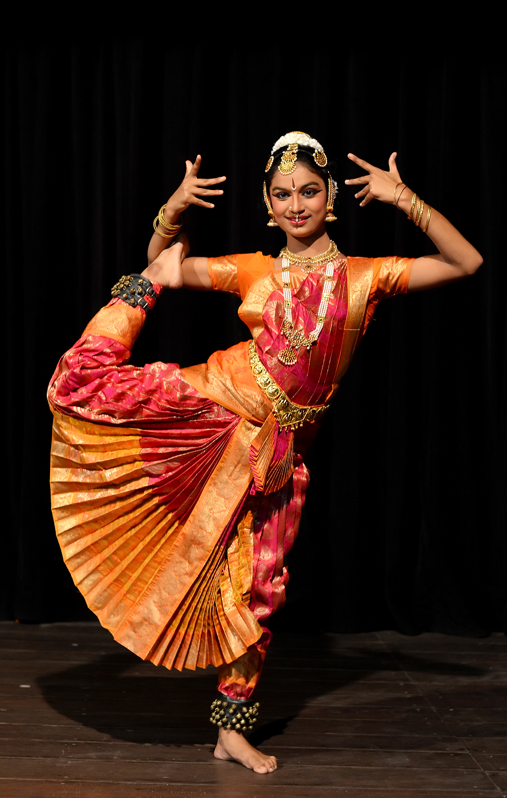

*Augustus Binu/ facebook, CC BY-SA 3.0, via Wikimedia Commons*

### The sthapati tradition — the temple-builder's living hands.

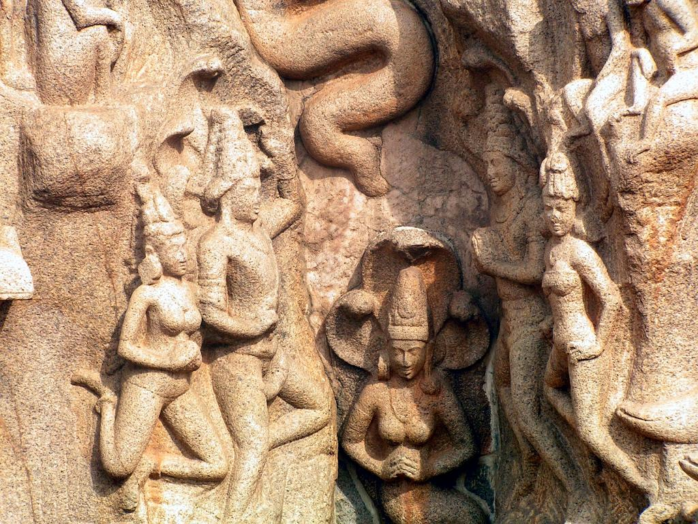

*Nicholas.Iyadurai, CC BY-SA 3.0, via Wikimedia Commons*

---

*All photographs are freely licensed (public domain / CC) via [Wikimedia Commons](https://commons.wikimedia.org/).
See each caption for author and licence.*
