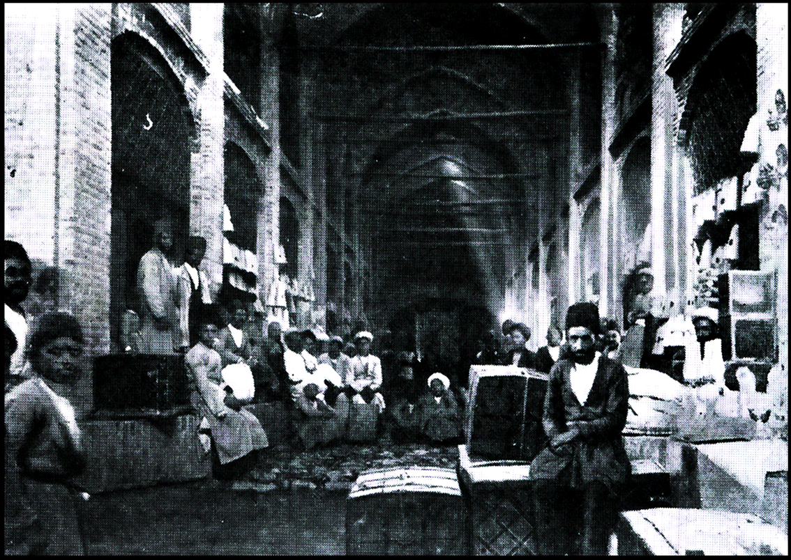
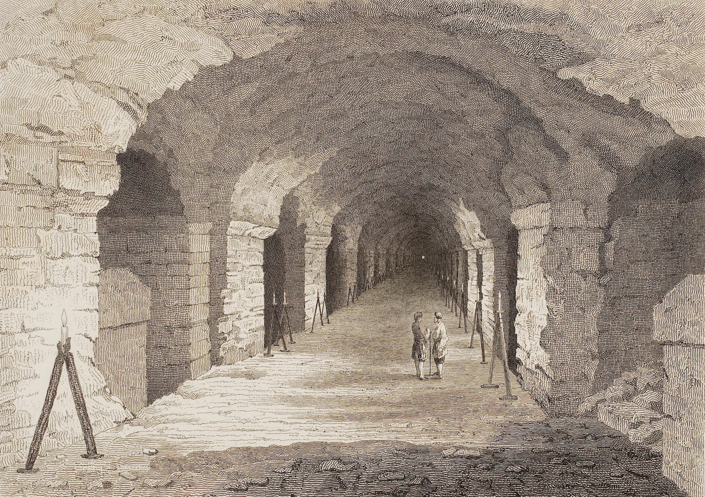
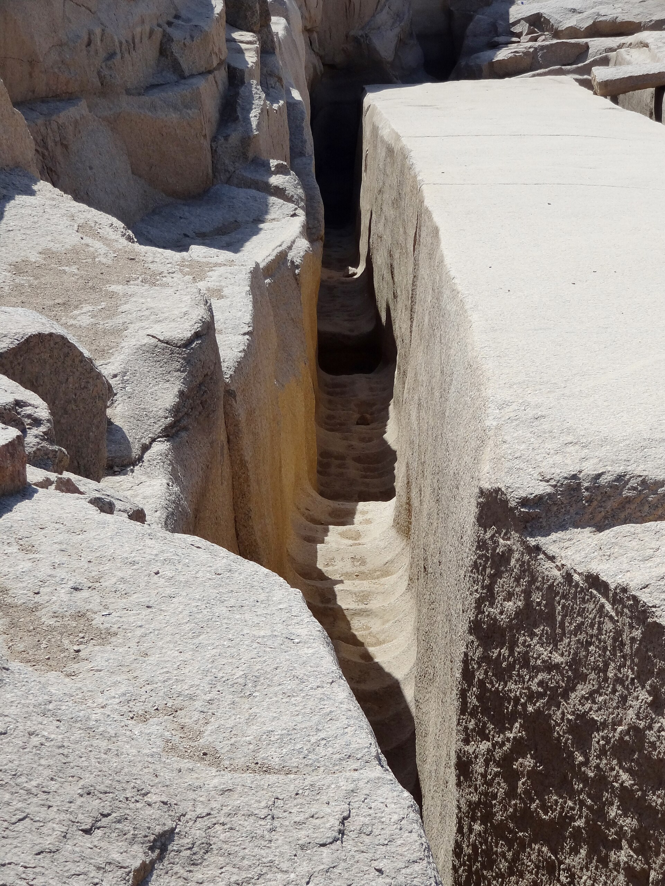
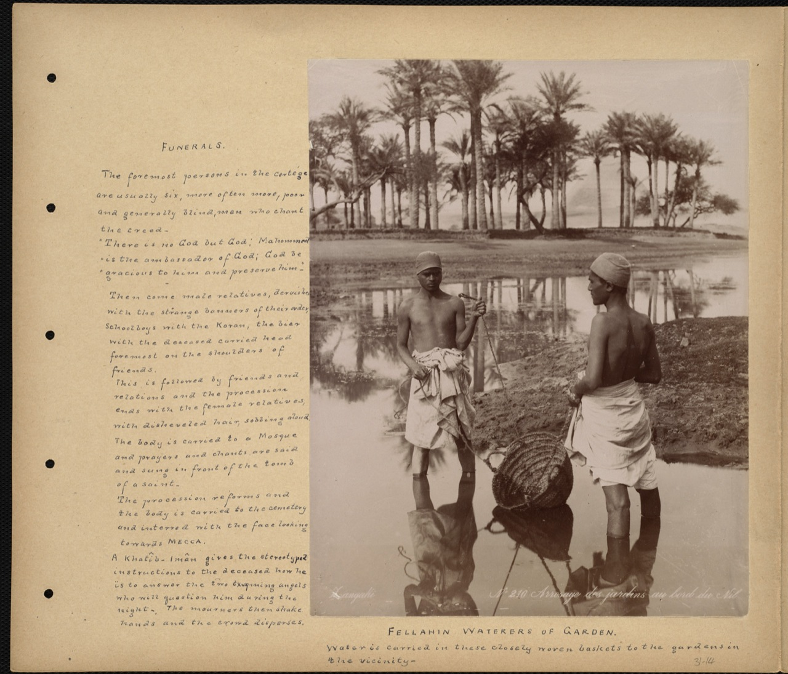
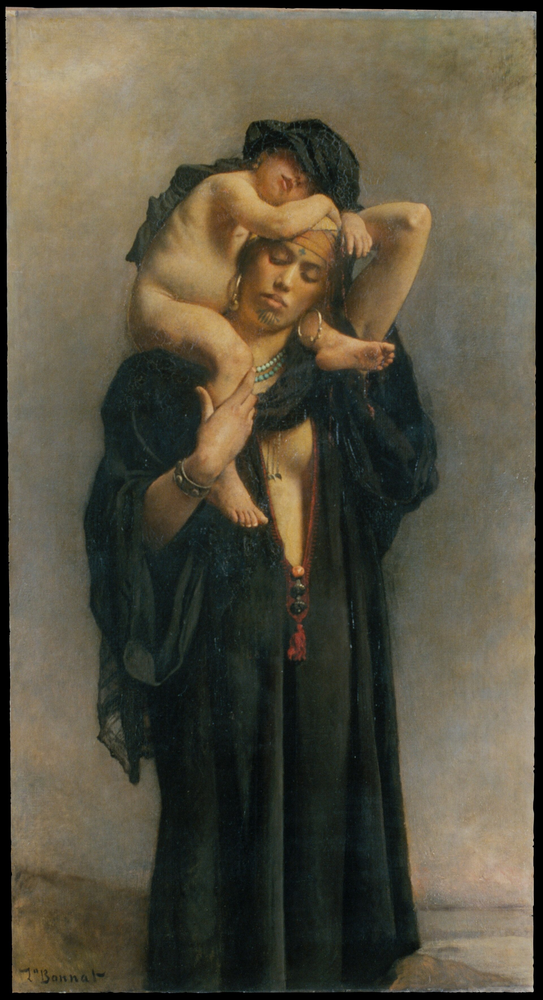

# The Engineer of the Gods — real places & people

> History Before Time · V · A photo wiki for travellers and curious readers.
> The novel is fiction; these grounds are real — go stand in them.
> **[Read the book](../../books/history-before-time/books/book5-egypt/build/BOOK.md)** · [All place wikis](README.md)

## Places of awe

### The Giza plateau — precision made visceral.

*Eduard Spelterini, Public domain, via Wikimedia Commons*

### Khan el-Khalili — copper-light and the call to prayer over haggling.

*Sosimoth, CC BY-SA 3.0, via Wikimedia Commons*

### Aswan — the granite quarry where the makers' hand is caught mid-cut.

*Vyacheslav Argenberg, CC BY 4.0, via Wikimedia Commons*

## Things of wonder (made by hand)

### The King's Chamber granite — hard stone hauled and set with uncanny fit.

*Mike McBey, CC BY 2.0, via Wikimedia Commons*

### The Serapeum boxes — single blocks cut to optical-flat tolerances.

*Auguste Mariette, Public domain, via Wikimedia Commons*

### The Unfinished Obelisk — the largest ever attempted, abandoned mid-cut.

*Olaf Tausch, CC BY 3.0, via Wikimedia Commons*

### The Sphinx — water-weathering and an older-than-allowed question.

*Petar Milošević, CC BY-SA 4.0, via Wikimedia Commons*

### Philae — a temple the rising water nearly drowned, then lifted and rebuilt stone by stone; the book's water-and-stone motif, real and visitable. (No freely-licensed photograph of the still-submerged Thonis-Heracleion exists; see the credits note.)

*Marc Ryckaert, CC BY 3.0, via Wikimedia Commons*

## Peoples, in their own dress

### Nubian dress and houses of the Aswan reach.

*David Broad, CC BY 3.0, via Wikimedia Commons*

### The fellahin — the living Nile.

*Boston Public Library, CC BY 2.0, via Wikimedia Commons*

### Everyday Egyptian dress — the city as opera.

*Léon Bonnat, CC0, via Wikimedia Commons*

---

*All photographs are freely licensed (public domain / CC) via [Wikimedia Commons](https://commons.wikimedia.org/).
See each caption for author and licence.*
