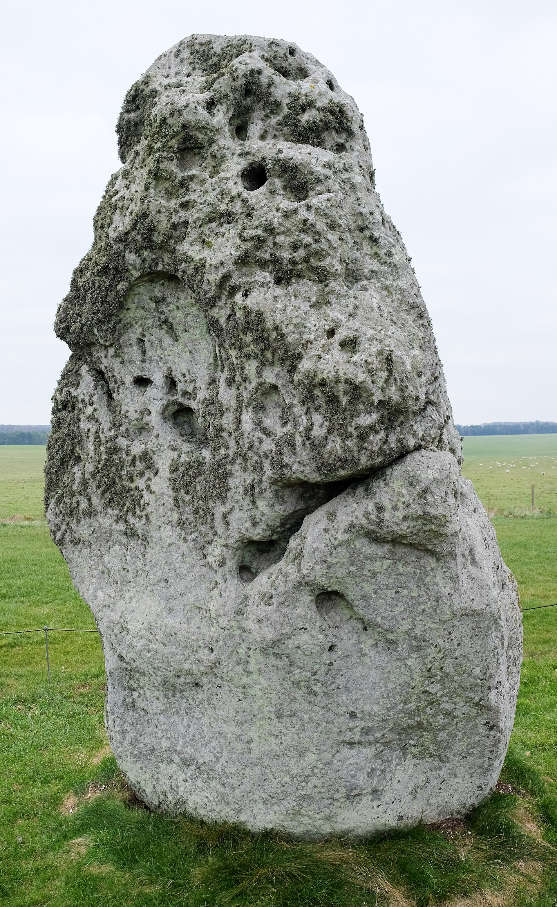
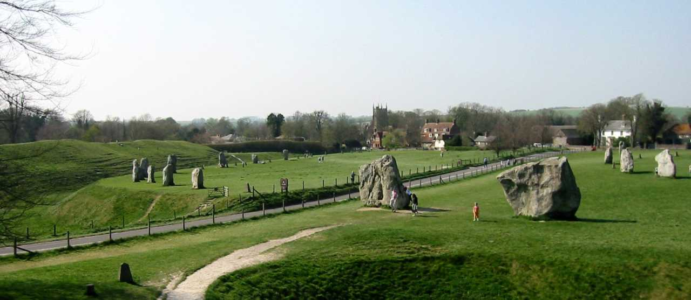
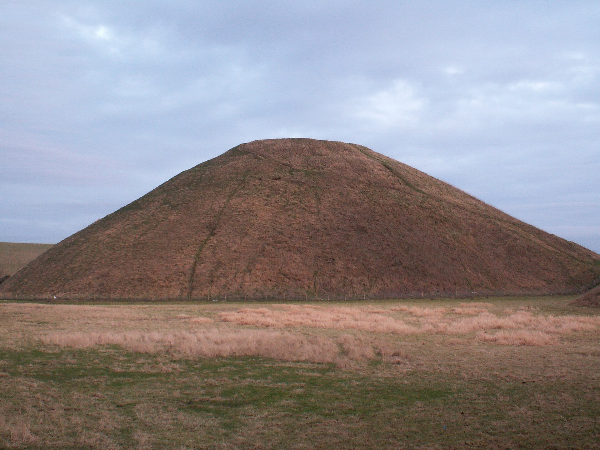
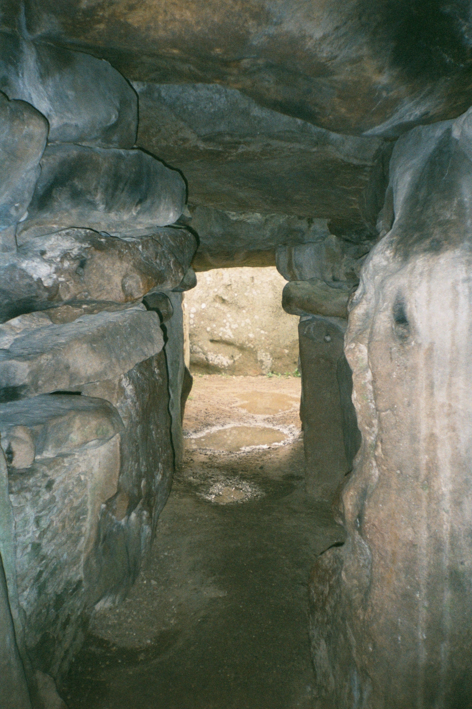
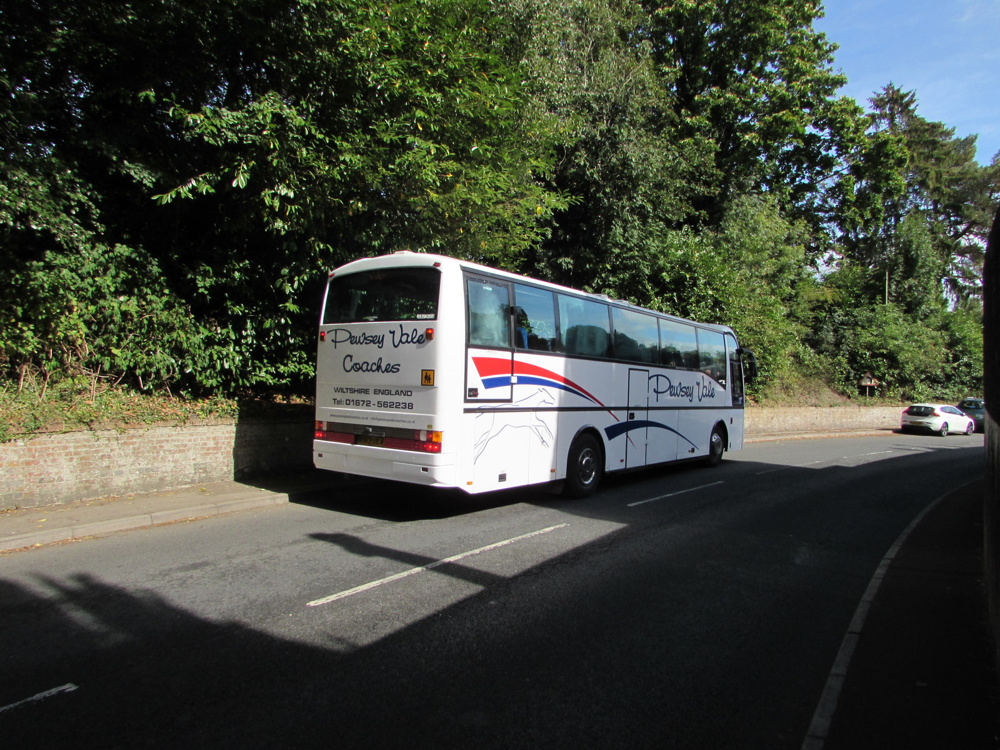
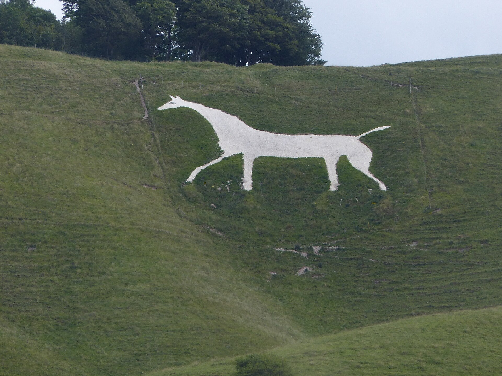
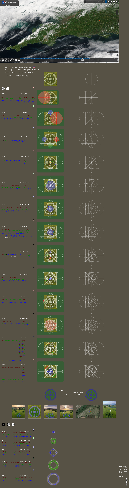
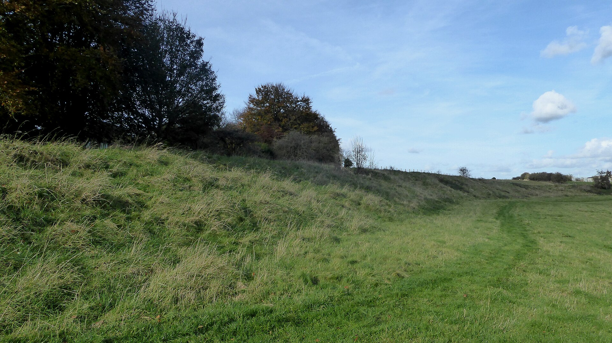
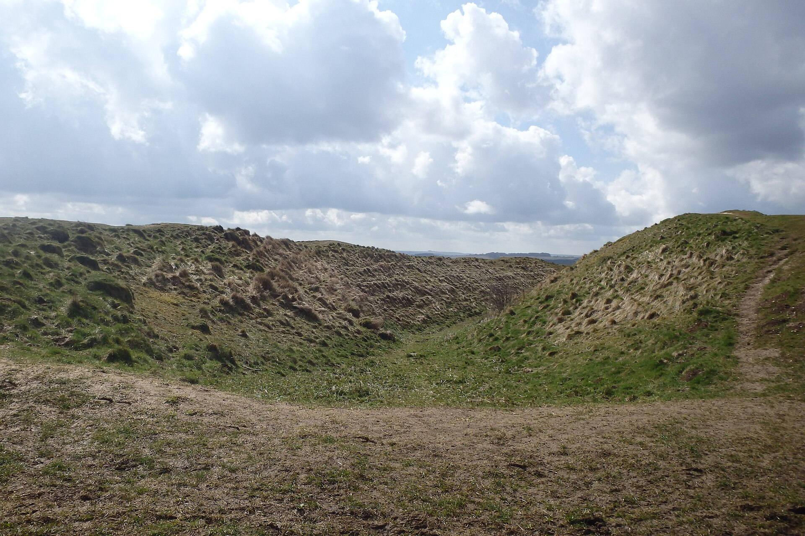
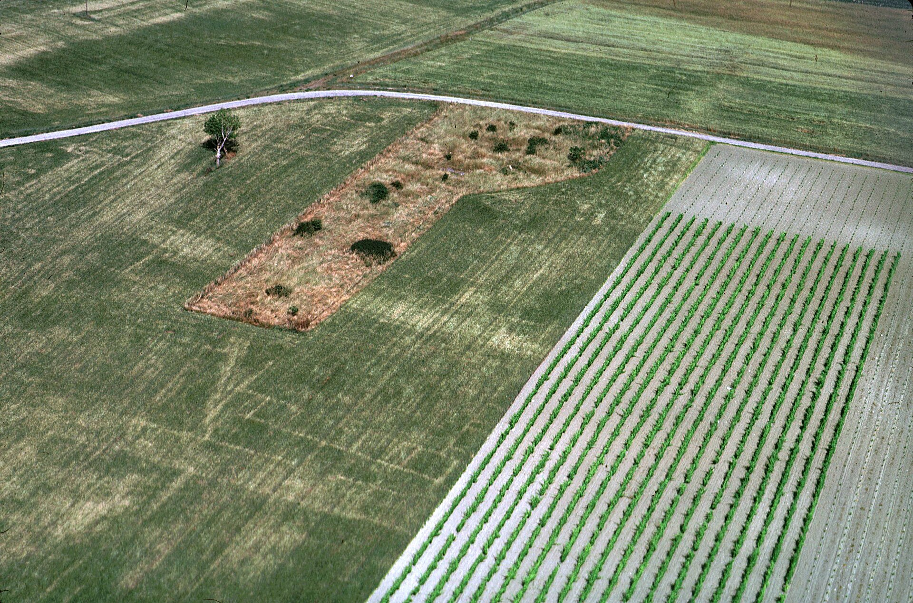

# The Field of Doors — real places & people

> The Why Files · I · A photo wiki for travellers and curious readers.
> The novel is fiction; these grounds are real — go stand in them.
> **[Read the book](../../books/history-before-time/books/crop-circles/build/BOOK.md)** · [All place wikis](README.md)

## Places of awe

### Stonehenge — the most-looked-at stones on Earth; the decoy the world mistook for the door.

*DeFacto, CC BY-SA 4.0, via Wikimedia Commons*

### Avebury — the great henge the village grew up inside.

*Rxfelix, CC BY 3.0, via Wikimedia Commons*

### Silbury Hill — the largest prehistoric mound in Europe, raised for a reason we still don't have.

*Dickbauch, Public domain, via Wikimedia Commons*

### West Kennet Long Barrow — the chalk holding its dead five thousand years.

*Simon Burchell, CC BY-SA 4.0, via Wikimedia Commons*

### The Wiltshire chalk downland — the canvas the patterns appear on.

*Jaggery, CC BY-SA 2.0, via Wikimedia Commons*

### A Wiltshire chalk hill-figure — the land already written on by hand.

*Schildiecom, CC BY-SA 4.0, via Wikimedia Commons*

## Things of wonder (made by hand)

### A crop formation in the Wessex wheat — craft, hoax, or the few that aren't either.

*Croppy Peace Sign, CC0, via Wikimedia Commons*

### Durrington Walls — a buried super-henge most eyes walk straight past.

*Ethan Doyle White, CC BY-SA 4.0, via Wikimedia Commons*

### Barbury Castle — an Iron Age hillfort over the same chalk.

*Michael Graham, CC BY-SA 2.0, via Wikimedia Commons*

### Crop-marks — the land writing its buried history in the wheat when the drought comes.

*Jacques DASSIÉ, CC BY-SA 4.0, via Wikimedia Commons*

---

*All photographs are freely licensed (public domain / CC) via [Wikimedia Commons](https://commons.wikimedia.org/).
See each caption for author and licence.*
