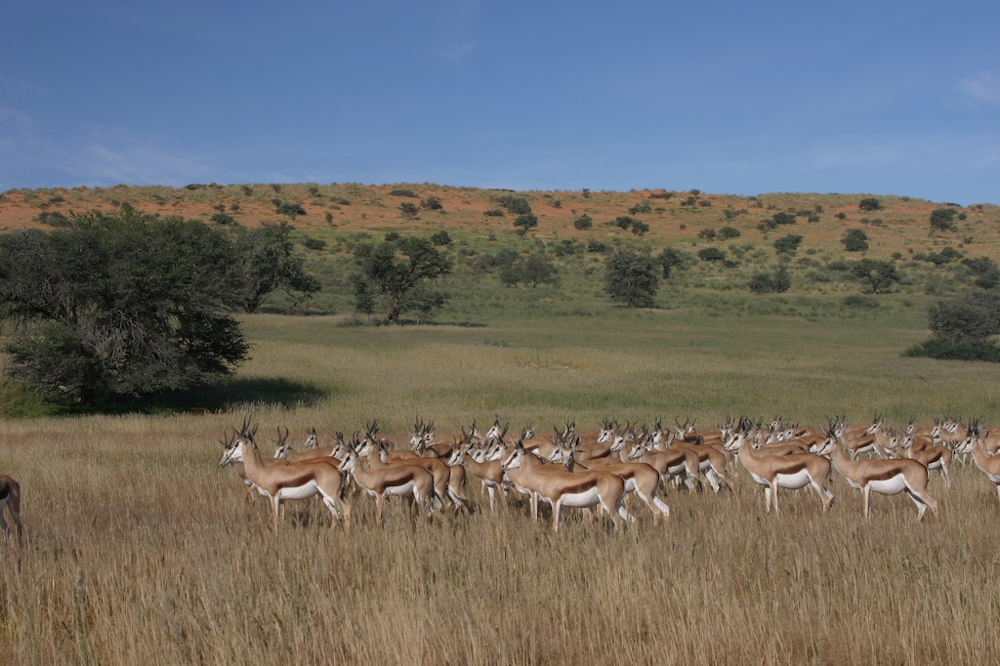
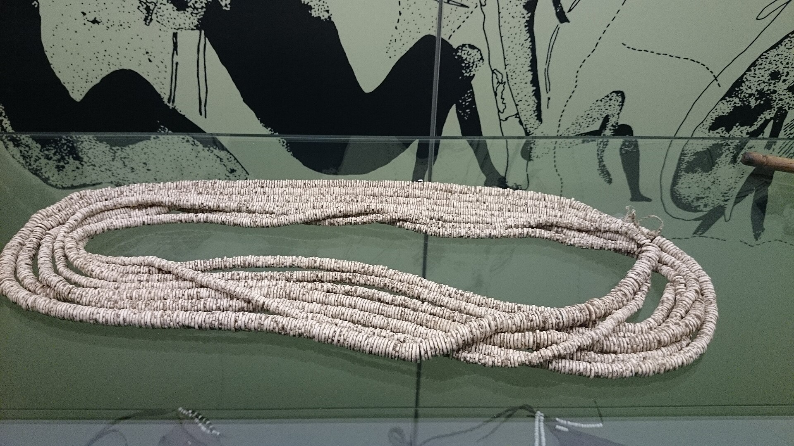
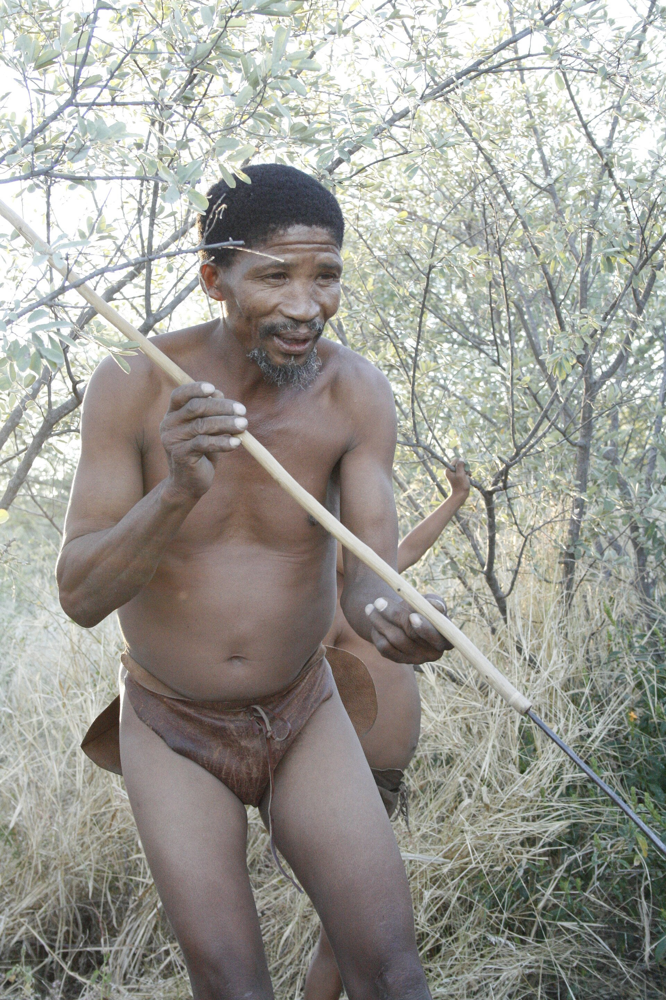
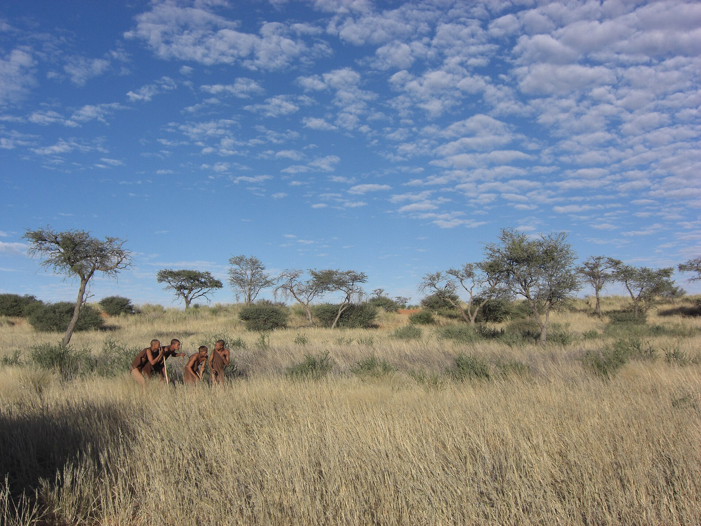

# The Silver Thread — real places & people

> A Jakobus Swart story · A photo wiki for travellers and curious readers.
> The novel is fiction; these grounds are real — go stand in them.
> **[Read the book](../../books/history-before-time/books/jakobus-silver-thread/build/BOOK.md)** · [All place wikis](README.md)

## Places of awe

### The Kalahari — the place they just call home.

*NeilMoll, CC0, via Wikimedia Commons*

### The Nyae Nyae pans — water, grass and distance.

*Hp.Baumeler, CC BY-SA 4.0, via Wikimedia Commons*

### Camelthorn and red sand — the bush that unmakes a soldier.

*Dr. Thomas Wagner, CC BY-SA 3.0, via Wikimedia Commons*

## Things of wonder (made by hand)

### San rock art — the oldest continuous storytelling on Earth.

*Southern San Details on Google Art Project, Public domain, via Wikimedia Commons*

### Ostrich-eggshell beadwork — wealth that is given away.

*Nkansah Rexford, CC BY 3.0, via Wikimedia Commons*

### The hunter's bow — patience as the deepest gift.

*DVL2, CC BY-SA 3.0, via Wikimedia Commons*

## Peoples, in their own dress

### The San — people who own almost nothing and are calm in any room.

*sjorford, CC BY-SA 2.0, via Wikimedia Commons*

### The healing dance — the silver thread itself.

*Kgara Kevin Rack, CC BY-SA 4.0, via Wikimedia Commons*

### The tracker who reads the ground — Kxao's craft.

*DVL2, CC BY-SA 3.0, via Wikimedia Commons*

- _(no free image found for: An elder of the band — the clown-grandfather, the storytelling grandmother.)_

---

*All photographs are freely licensed (public domain / CC) via [Wikimedia Commons](https://commons.wikimedia.org/).
See each caption for author and licence.*
