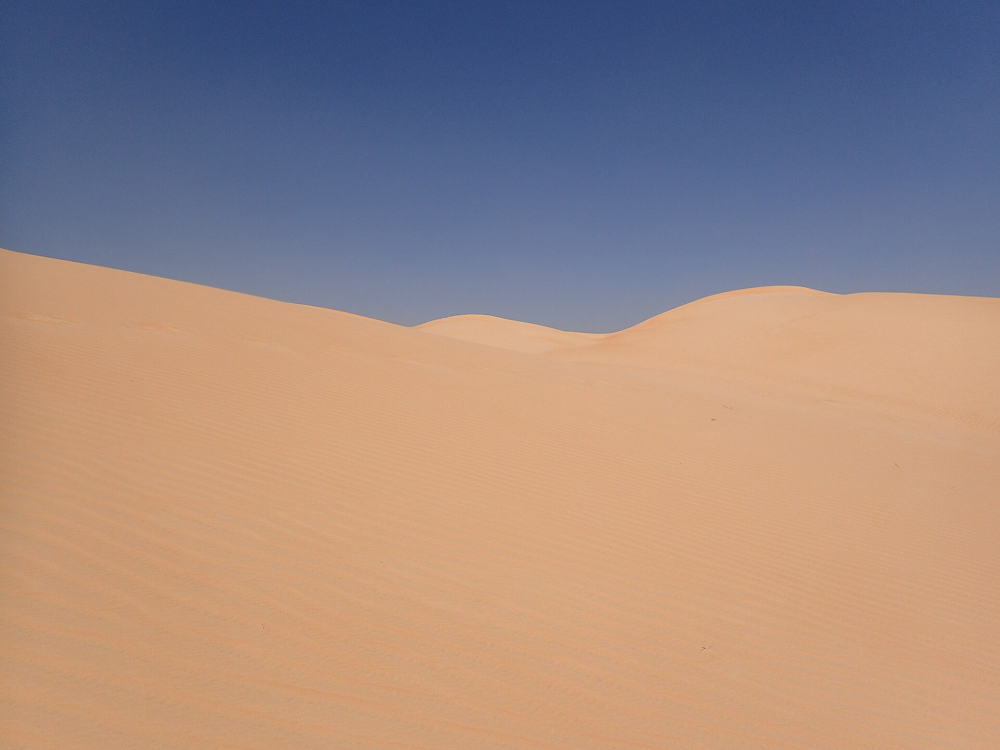
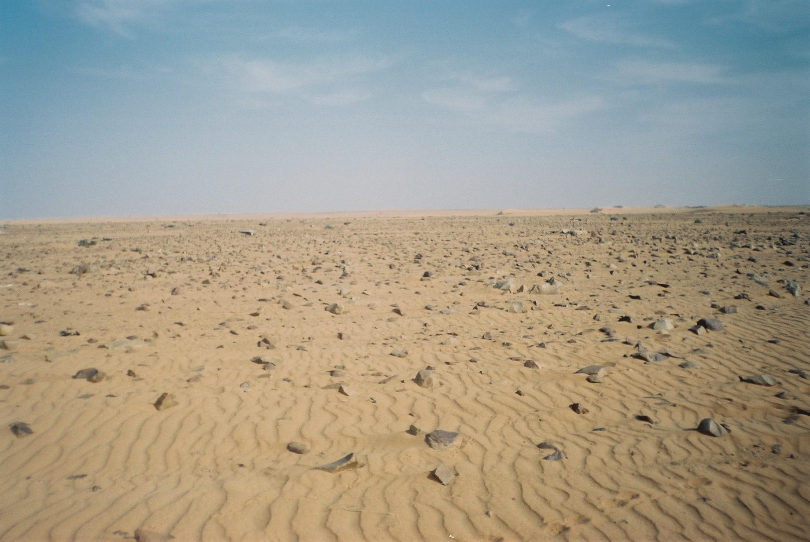
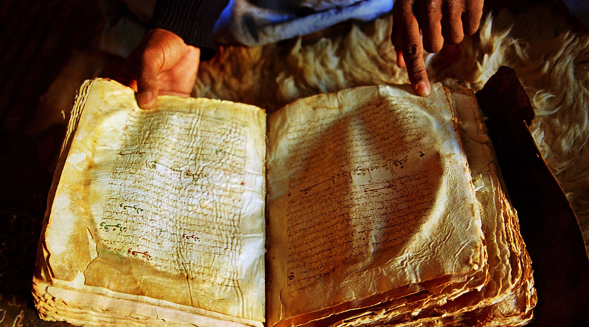
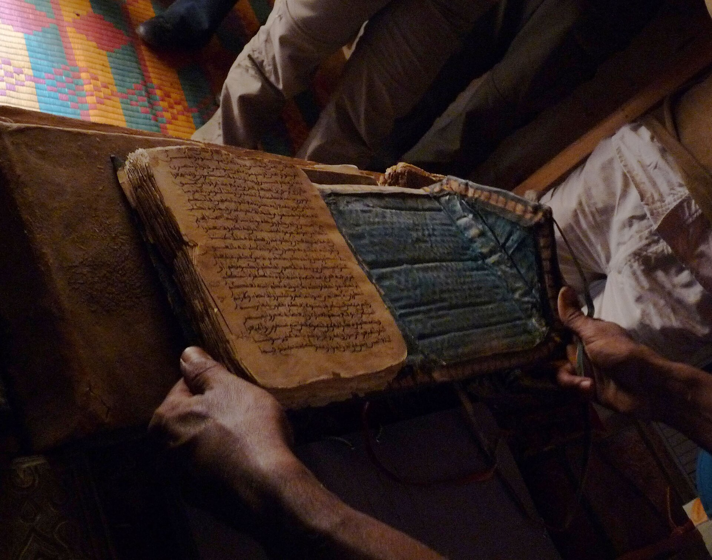
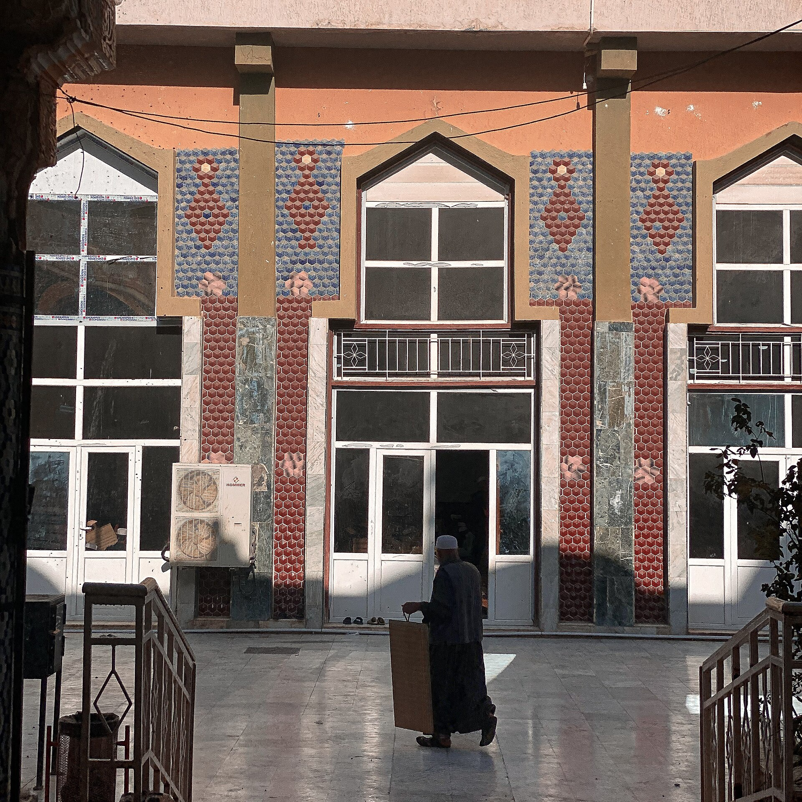
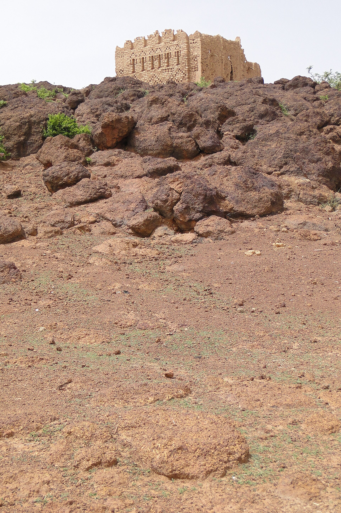
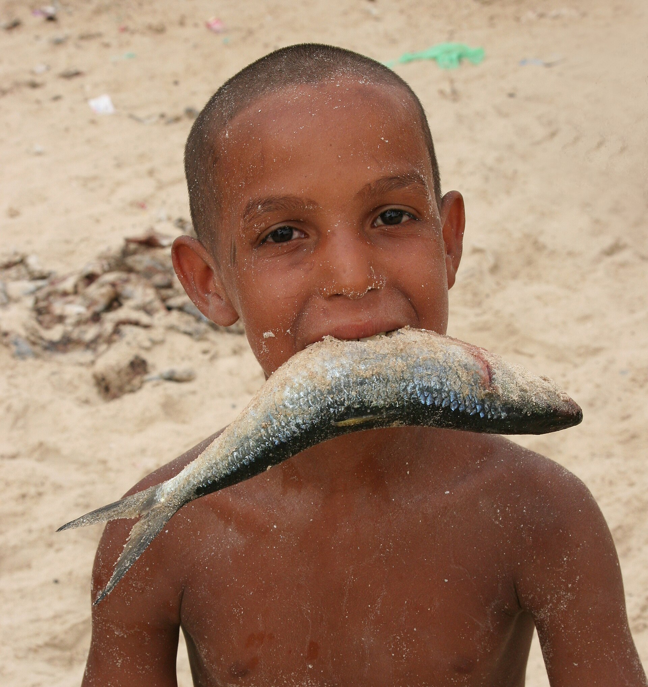
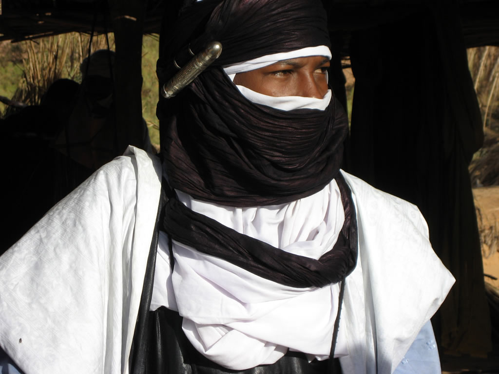
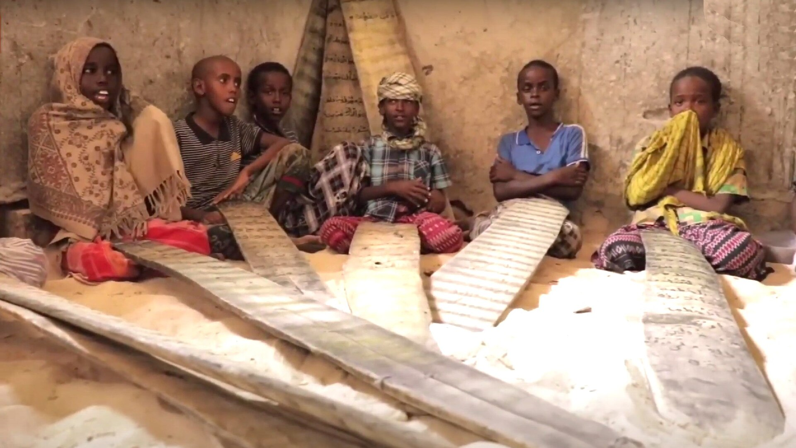
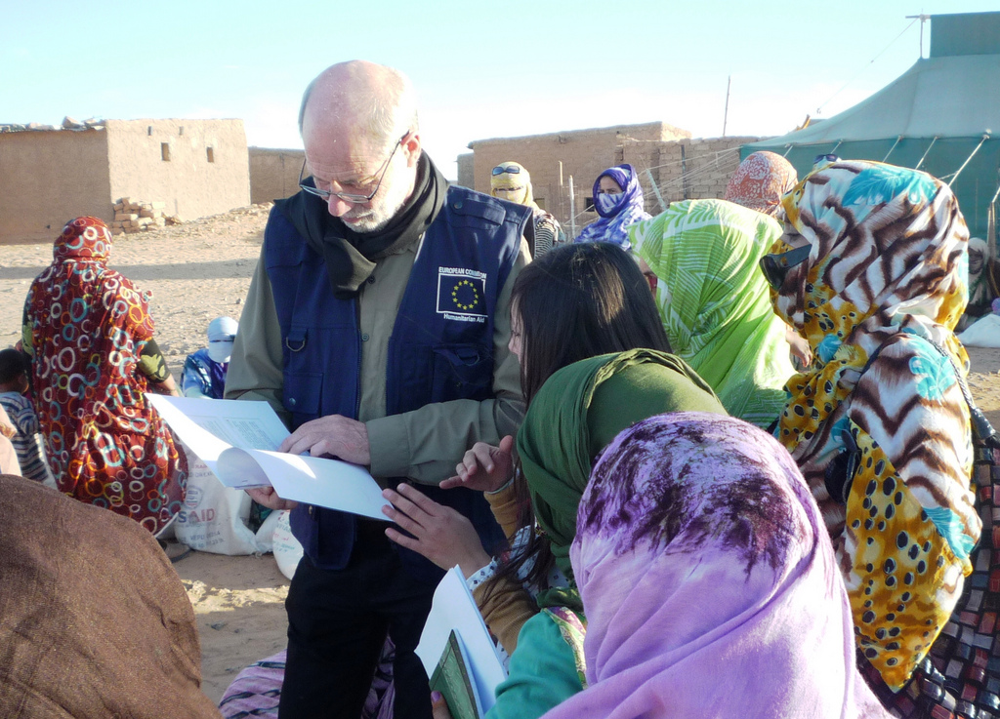

# The Recitation — real places & people

> A Jakobus Swart story · A photo wiki for travellers and curious readers.
> The novel is fiction; these grounds are real — go stand in them.
> **[Read the book](../../books/history-before-time/books/jakobus-the-recitation/build/BOOK.md)** · [All place wikis](README.md)

## Places of awe

### The deep Sahara — the real desert behind the paperback's romance.

*Seriouslyfab, CC BY-SA 4.0, via Wikimedia Commons*

### The Adrar — stone, sand and the long light.

*Radosław Botev, CC BY 3.0 pl, via Wikimedia Commons*

### Chinguetti — a desert town of mud-brick and memory.

*Dr. Ondřej Havelka (cestovatel), CC BY-SA 4.0, via Wikimedia Commons*

## Things of wonder (made by hand)

### Chinguetti's manuscript libraries — the Word kept in the sand.

*Ji-Elle, CC BY-SA 3.0, via Wikimedia Commons*

### The lawḥ — the washed wooden tablet a child learns the recitation on.

*Salihen edrees, CC BY-SA 4.0, via Wikimedia Commons*

### A Sahelian mud mosque — the day shaped around prayer.

*Adam Jones, Ph.D., CC BY-SA 3.0, via Wikimedia Commons*

## Peoples, in their own dress

### Ḥassāniyya dress — the household that takes the stranger in.

*Ferdinand Reus from Arnhem, Holland, CC BY-SA 2.0, via Wikimedia Commons*

### The Tuareg veil — the desert's own people.

*David Stanley from Nanaimo, Canada, CC BY 2.0, via Wikimedia Commons*

### The mahadra — children at the recitation, Jakobus's small mirror.

*Somfany, Public domain, via Wikimedia Commons*

### The melḥfa — women of the western Sahara.

*European Commission DG ECHO, CC BY-SA 2.0, via Wikimedia Commons*

---

*All photographs are freely licensed (public domain / CC) via [Wikimedia Commons](https://commons.wikimedia.org/).
See each caption for author and licence.*
