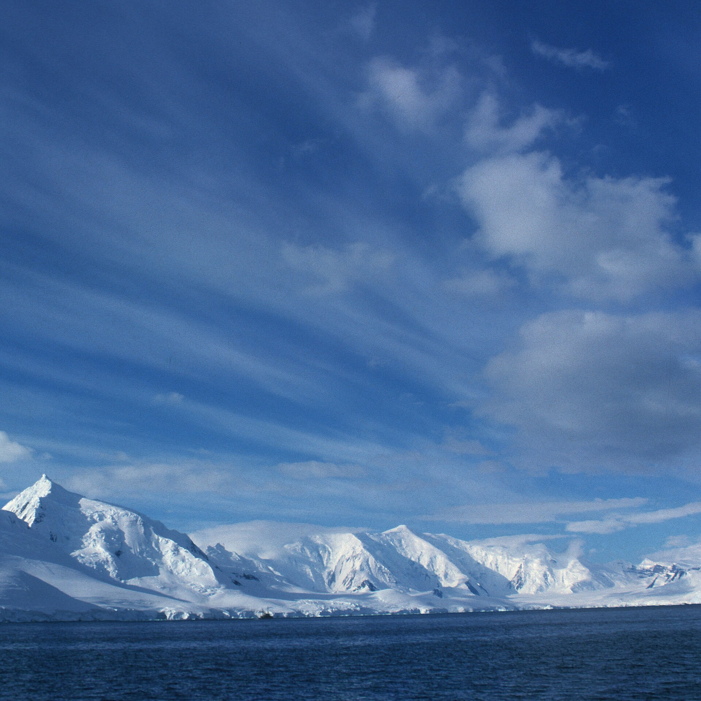
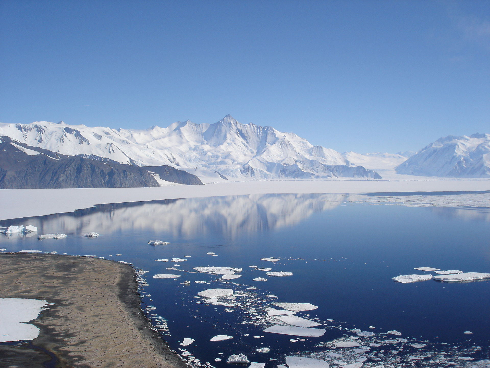
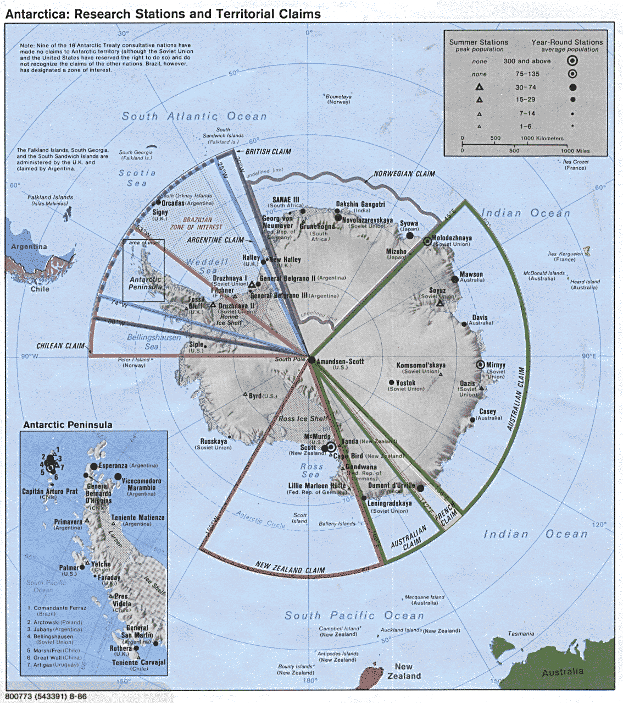
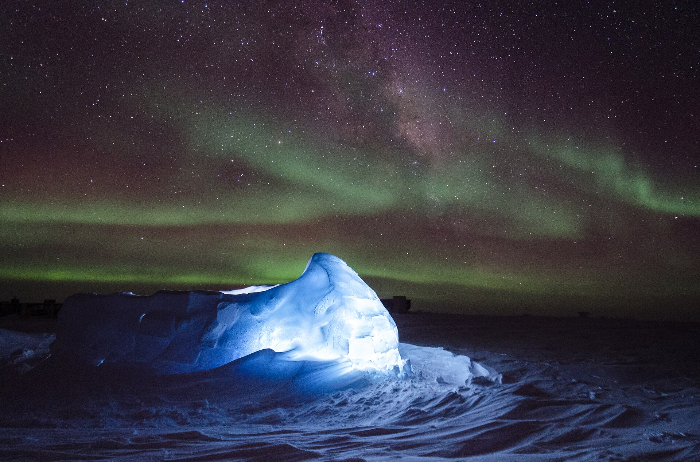
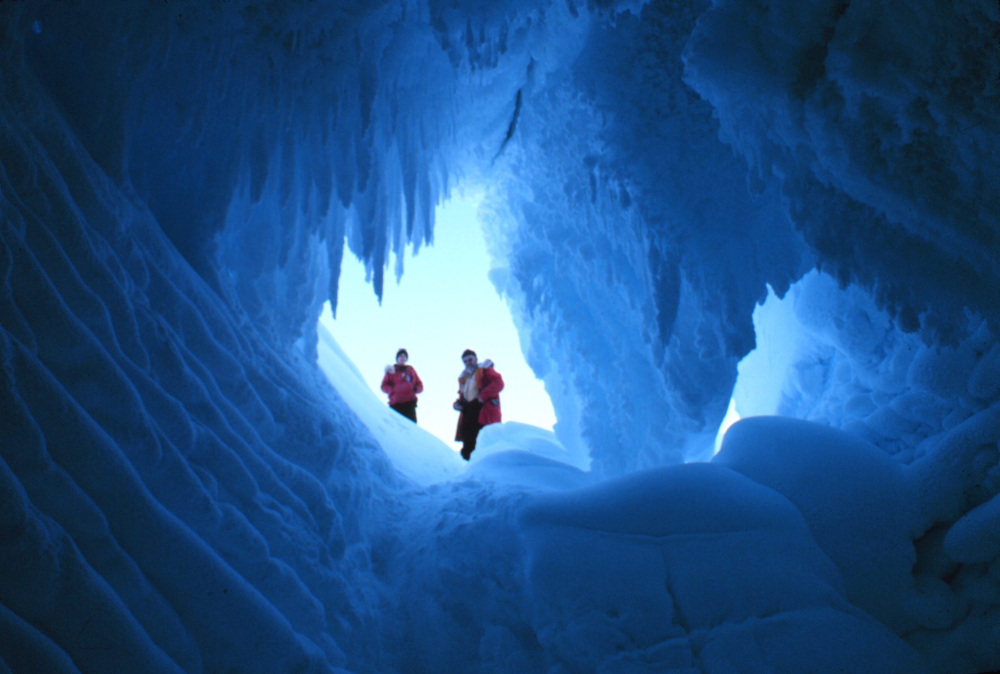

# The Men Who Opened the Door — real places & people

> History Before Time · VII · A photo wiki for travellers and curious readers.
> The novel is fiction; these grounds are real — go stand in them.
> **[Read the book](../../books/history-before-time/books/project-stargate/build/BOOK.md)** · [All place wikis](README.md)

## Places of awe

### Antarctica — the ice the records say has something beneath it.

*Robert L. Dale, CC BY-SA 4.0, via Wikimedia Commons*

### The Transantarctic range — the edge of the unmapped.

*Andrew Mandemaker, CC BY-SA 2.5, via Wikimedia Commons*

### A polar station — the official face of the unofficial story.

*U.S. Central Intelligence Agency Uploaded by This map has been uploaded by Electionworld from en.wikipedia.org to enable the Wikimedia Atlas of the World . Original uploader to en.wikipedia.org was Pdytwong, known as Pdytwong at en.wikipedia.org. Electionworld is not the creator of this map. Licensing information is below., Public domain, via Wikimedia Commons*

### Aurora australis — the sky as a tuning signal.

*Ross Burgener, Public domain, via Wikimedia Commons*

## Things of wonder (made by hand)

### An ice cave — the dark the remote-viewer's coordinates point to.

*Fishdecoy, Public domain, via Wikimedia Commons*

---

*All photographs are freely licensed (public domain / CC) via [Wikimedia Commons](https://commons.wikimedia.org/).
See each caption for author and licence.*
