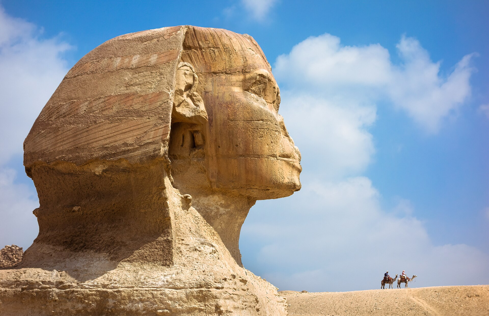
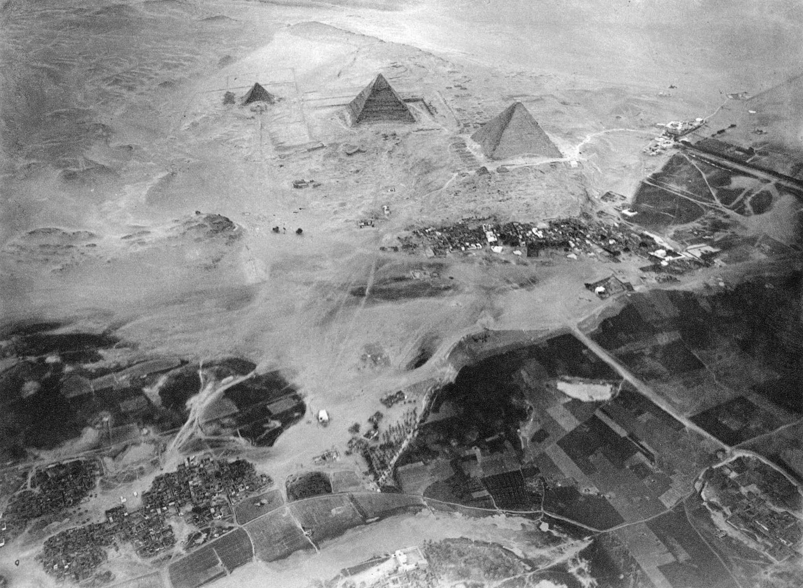
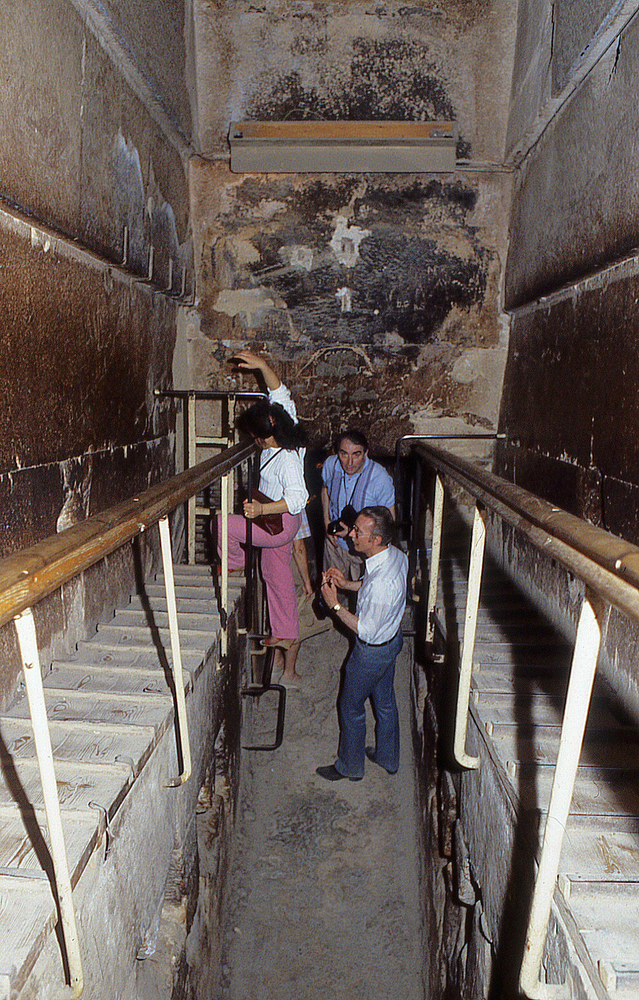
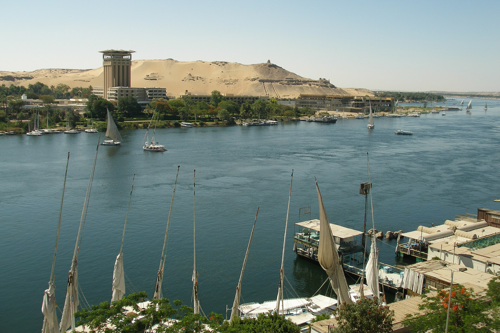
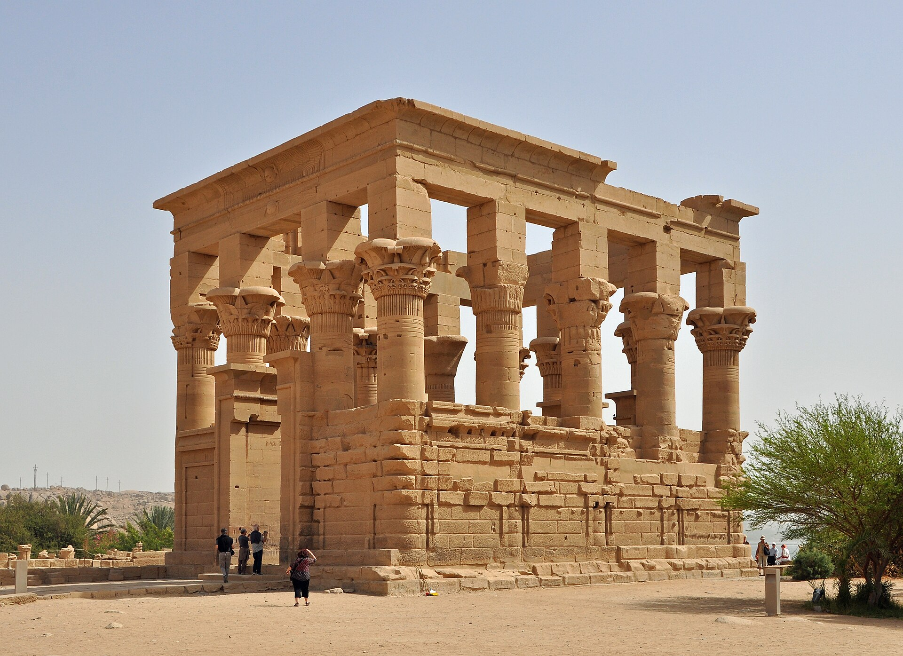
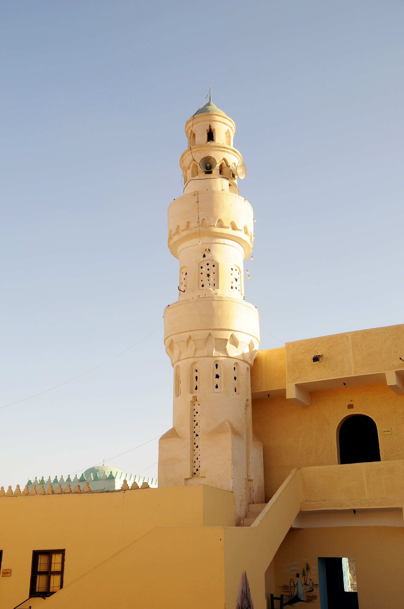

# RELIC — real places & people

<!-- hand-authored -->

> The African Gold Trilogy · III · A photo wiki for travellers and curious readers.
> Priya's capstone runs from the African reef to the flooded Nile — these are the real coordinates.
> **[Read the book](../../books/relic/build/BOOK.md)** · [All place wikis](README.md)

## Places of awe — Africa

### Vredefort Dome — where the ancient machine story meets the impact ring.

*Phillip778899, CC0, via Wikimedia Commons*

### Adam's Calendar, Mpumalanga — standing stones older than the pyramids.

*Sháron Viljoen, CC BY-SA 4.0, via Wikimedia Commons*

## Places of awe — Egypt

### The Great Sphinx — the face the engineers argue with.

*See Wikimedia Commons file page for author and licence.*

### Giza pyramids — the scale problem stated in limestone.

*See Wikimedia Commons file page for author and licence.*

### The Grand Gallery, Great Pyramid — interior geometry you can still walk.

*See Wikimedia Commons file page for author and licence.*

### The Nile at Aswan — the river the capstone follows north.

*See Wikimedia Commons file page for author and licence.*

### Philae — temple island in the flood zone.

*See Wikimedia Commons file page for author and licence.*

## Peoples, in their own dress

### Nubian village at Aswan — living river culture.

*See Wikimedia Commons file page for author and licence.*

---

*All photographs are freely licensed (public domain / CC) via [Wikimedia Commons](https://commons.wikimedia.org/).
See each caption for author and licence.*
