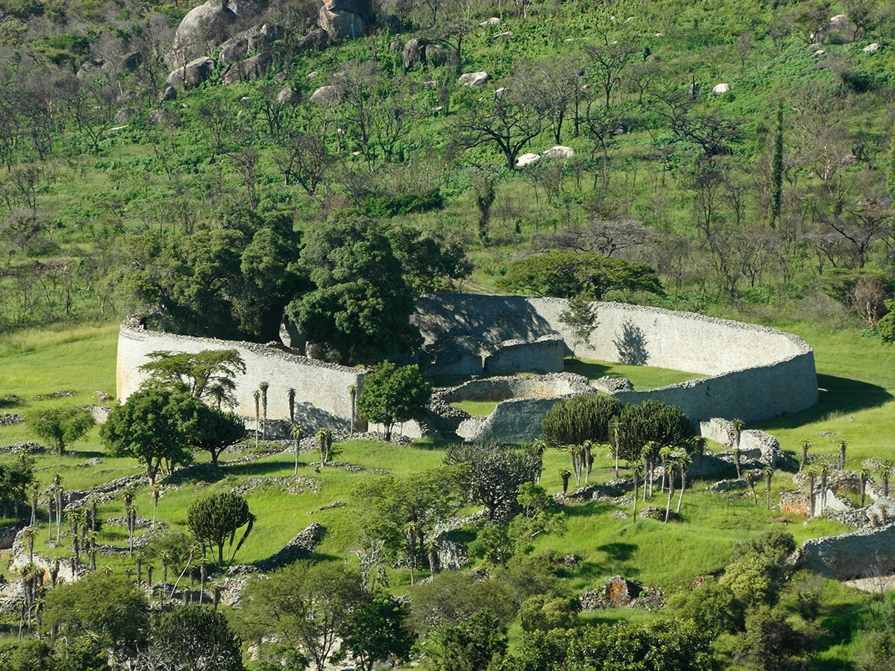
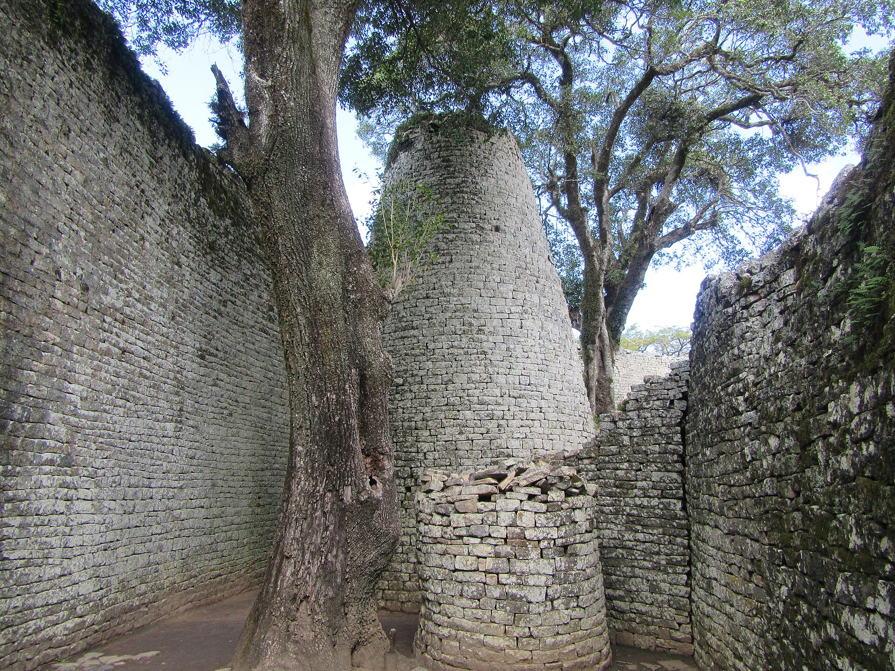
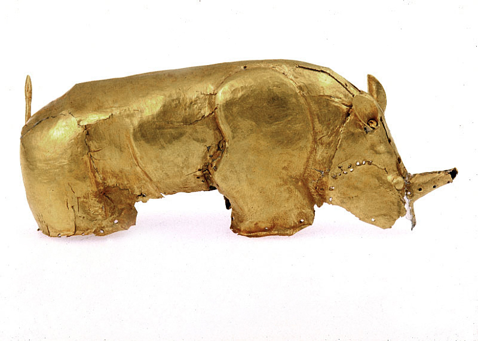

# REVELATION — real places & people

<!-- hand-authored -->

> The African Gold Trilogy · II · A photo wiki for travellers and curious readers.
> Leila reads symbols; these walls and stones are what she is reading against.
> **[Read the book](../../books/revelation/build/BOOK.md)** · [All place wikis](README.md)

## Places of awe — Africa

### Great Zimbabwe — mortarless stone at city scale.

*Edwin Smith and Andrew Dale, CC BY-SA 4.0, via Wikimedia Commons*

### The Conical Tower — engineering without a named engineer.

*amanderson2, CC BY 2.0, via Wikimedia Commons*

### Mapungubwe gold — worked rhinoceros, proof of deep African metallurgy.

*Sian Tiley-Nel, CC BY-SA 4.0, via Wikimedia Commons*

## Places of awe — India (the symbol chain)

### Ellora, Kailasa — a temple cut downward from a single mountain.

*See Wikimedia Commons file page for author and licence.*

### Jantar Mantar, Jaipur — astronomical instruments at city scale.

*See Wikimedia Commons file page for author and licence.*

### Amber Fort — the Rajput hill forts the Brotherhood's maps still use.

*See Wikimedia Commons file page for author and licence.*

## Peoples, in their own dress

### Rajasthani woman in traditional dress.

*See Wikimedia Commons file page for author and licence.*

---

*All photographs are freely licensed (public domain / CC) via [Wikimedia Commons](https://commons.wikimedia.org/).
See each caption for author and licence.*
