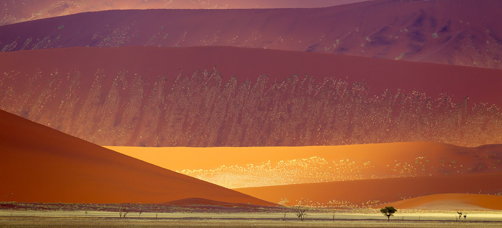
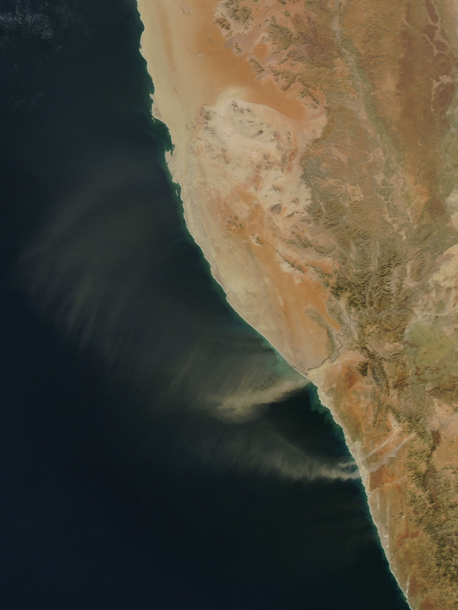
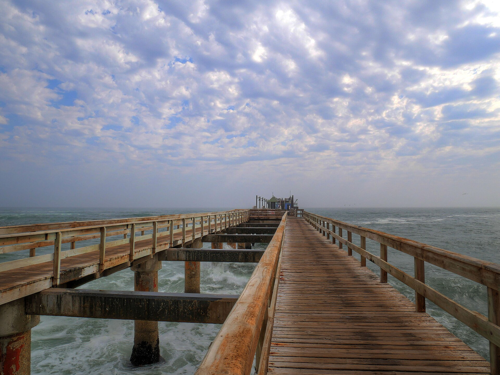
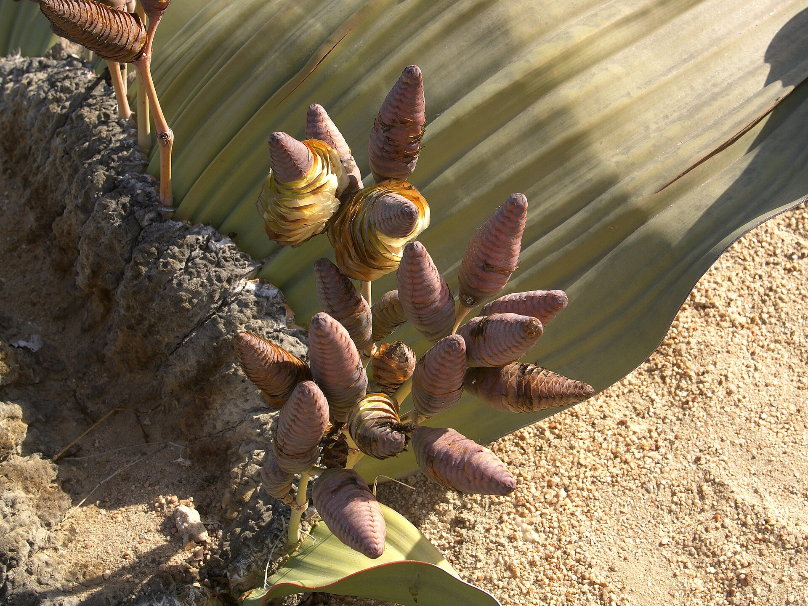
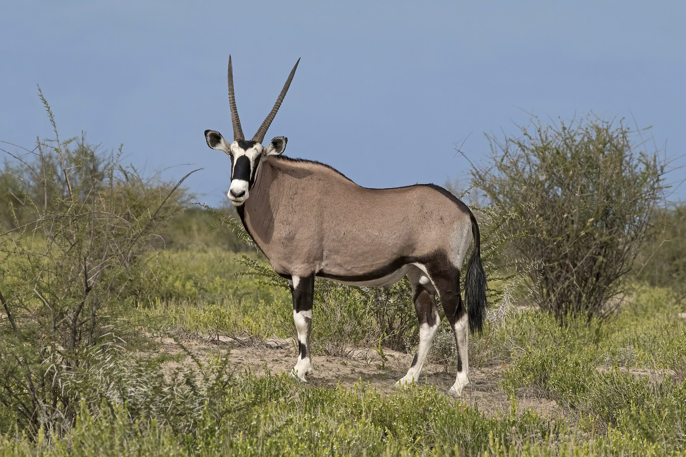
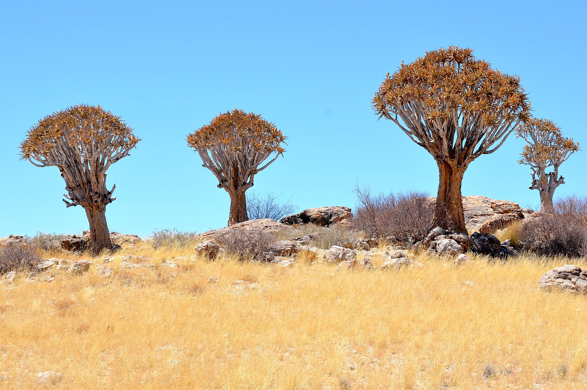
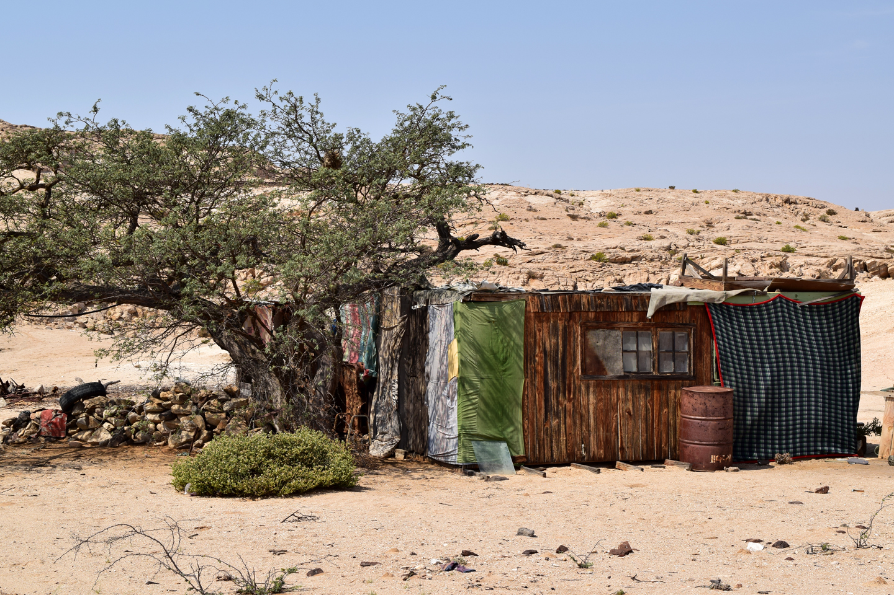
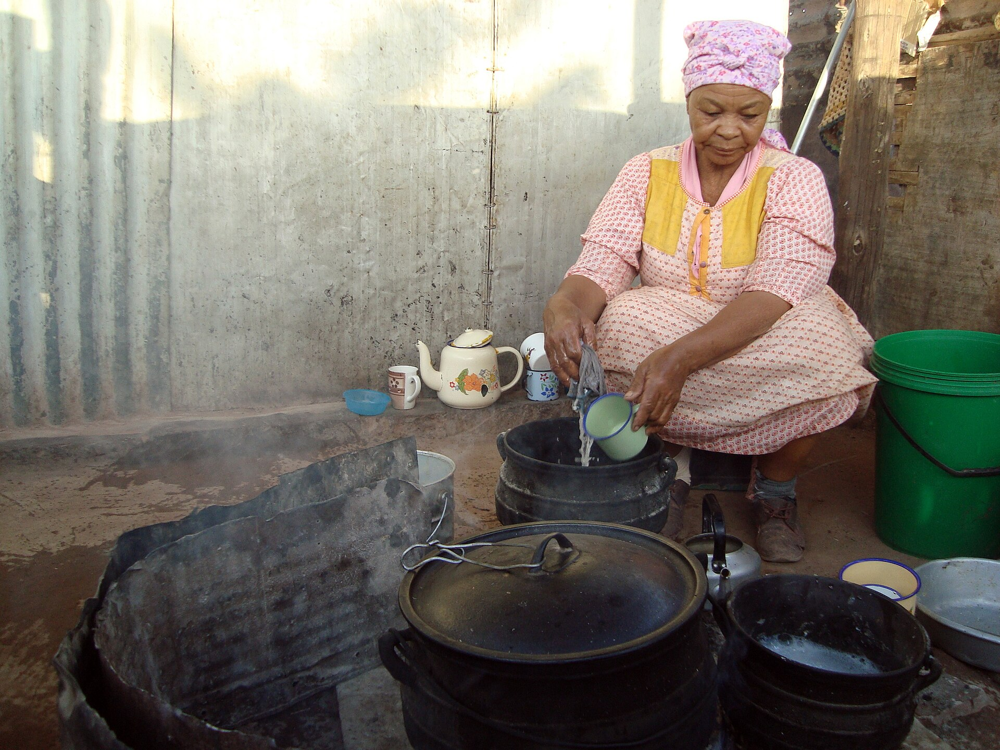

# The Sheltering Desert — real places & people

> A standalone novel · true story · A photo wiki for travellers and curious readers.
> The novel is fiction; these grounds are real — go stand in them.
> **[Read the book](../../books/the-sheltering-desert/build/BOOK.md)** · [All place wikis](README.md)

## Places of awe

### The Kuiseb canyon — the schist gorge that hid two geologists for two and a half years.

*Zairon, CC BY-SA 4.0, via Wikimedia Commons*

### The Namib dunes — the oldest desert on Earth, the sheltering and the killing one.

*Yathin S Krishnappa, CC BY-SA 3.0, via Wikimedia Commons*

### The Namib gravel plains and fog-belt — water out of the air when there is none in the ground.

*Jeff Schmaltz, MODIS Land Rapid Response Team, NASA GSFC, Public domain, via Wikimedia Commons*

### Swakopmund and Walvis Bay — the coast they arrived on in 1935, fleeing one war into another.

*Daniel Kraft, CC BY-SA 3.0, via Wikimedia Commons*

## Things of wonder (made by hand)

### Welwitschia mirabilis — a living fossil that drinks the fog and outlives empires.

*Hans Hillewaert, CC BY-SA 4.0, via Wikimedia Commons*

### The gemsbok — the desert game the two men hunted to stay alive, and kept observing as they starved.

*Charles J. Sharp, CC BY-SA 4.0, via Wikimedia Commons*

### The quiver tree (kokerboom) — the arid country's own architecture.

*Olga Ernst, CC BY-SA 4.0, via Wikimedia Commons*

## Peoples, in their own dress

### The Topnaar (ǂAonin) Nama of the lower Kuiseb — the people who belong to that river.

*NASA Earth RIght Now, Public domain, via Wikimedia Commons*

### Nama dress — a living people of the Namib's edges.

*Shark studio, CC BY-SA 4.0, via Wikimedia Commons*

---

*All photographs are freely licensed (public domain / CC) via [Wikimedia Commons](https://commons.wikimedia.org/).
See each caption for author and licence.*
